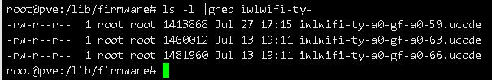
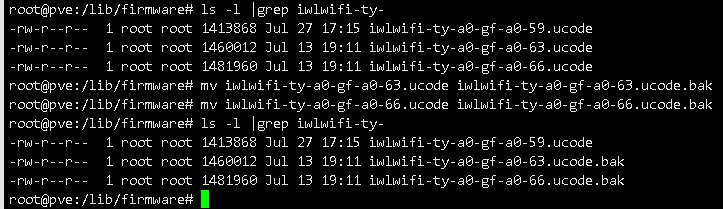
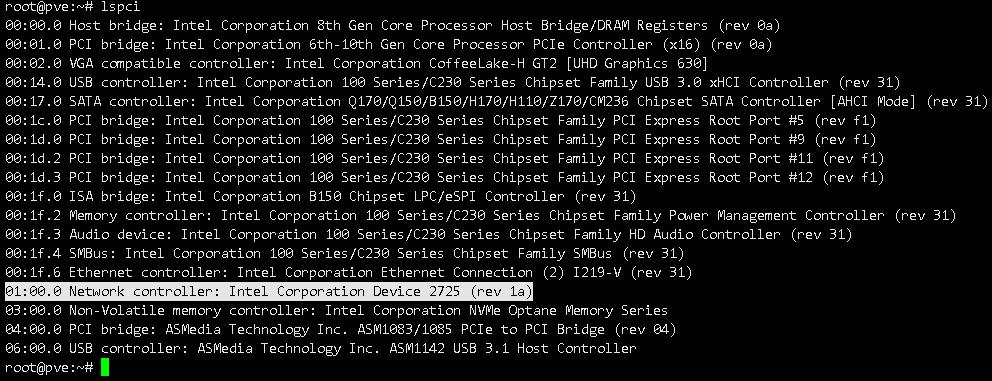
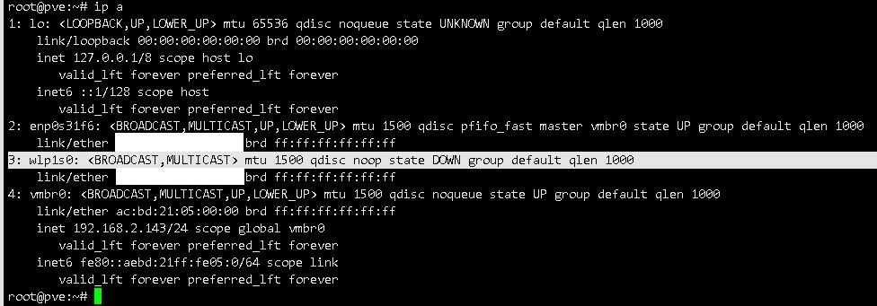
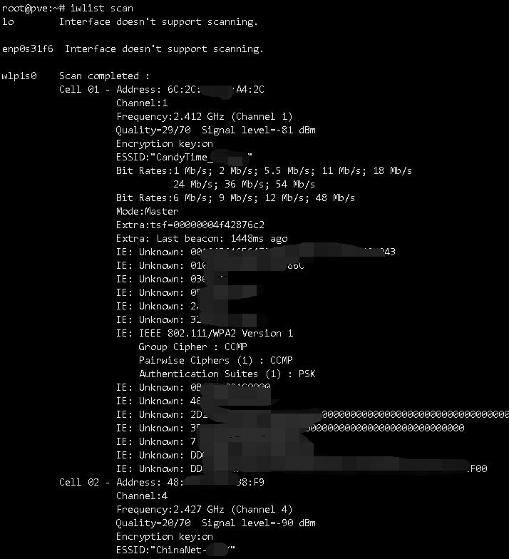
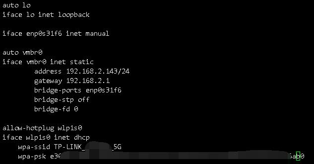
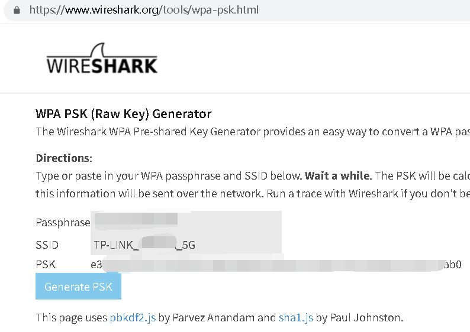
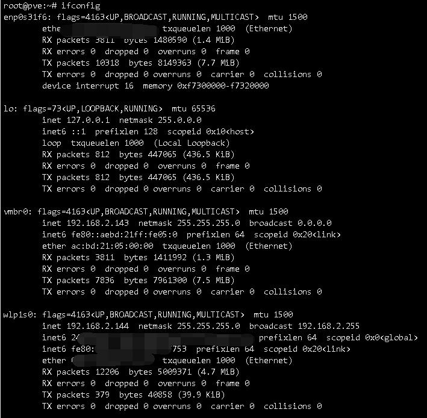
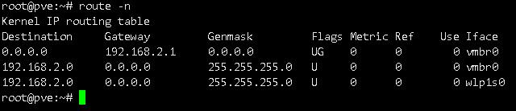
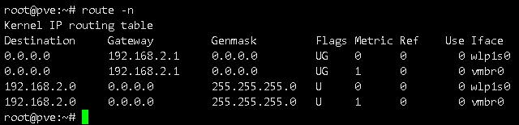

# proxmox中使用ax210连接无线网络

# 需求背景
为什么会有这种奇怪的需求呢  
起因是因为一台废物利用安装PVE的笔记本，只有百兆口  
使用nfs挂载硬盘或者是下载东西体验都极差，但百兆口焊死在主板上  
能更换的只有无线网卡，只能尝试使用wifi6提高使用体验。

本教程默认用户已有一个可用有线网络，且已配置好软件源，如未配置可参考其他文章的软件源修改方法。

本教程使用的PVE版本为7.2,无线网卡为Intel ax210。

# 检查ucode
注意：本节内容是PVE7.2版本遇到的坑，在未来的新版本中可能已经修复，是否执行本节内容请依据实际情况

首先检查PVE中有没有非`iwlwifi-ty-a0-gf-a0-59.ucode`的ucode  
如果有则可能导致设备加载不正常，请注意删除以`iwlwifi-ty-a0-gf-a0`开头的其他ucode。

```shell 
ls /lib/firmware/ |grep iwlwifi-ty-a0-gf-a0
```
可查看ucode，根据实际情况选择性删除  
  
如图所示，有59、63、66三种，把非59重命名即可  
  
如果没有ucode就去因特尔官网下载对应的ucode，7.2肯定是有的。

https://www.intel.com/content/www/us/en/support/articles/000005511/wireless.html

即便是`lspci` 未能认出无线网卡也无关紧要不影响实际使用  
  
删除了ucode后键入命令`reboot` 重启pve，不要用重载iwifi模块的方式代替重启。

# 启用并验证无线网卡
使用`ip a` 查看无线网卡是否被认出。  
  
如图所示，我的无线网卡为`wlp1s0`，推荐复制此处的文本避免打错字演自己

需要验证无线网卡是否正常运作，我们先安装包`apt install -y wireless-tools wpasupplicant`

安装完成后使用`ifup wlp1s0` 打开设备，并使用`iwlist scan` 尝试扫描网络。

如果ifup起不来，可以试试`ip link set wlp1s0 up`  
  
如果可以正常扫描出网络，说明设备打开正常，至少不会因为设备异常导致接下来的操作执行完依旧连不上然后百思不得其解  
这一步不是必须步骤，但可以降低自己演自己的概率。

# 修改网络配置接入无线网络
使用文本编辑器修改网络配置，此处使用vi作例子。使用nano或者其他编辑器的抄目录即可。

命令`vi /etc/network/interfaces` 修改配置  
  
如图所示，于配置下方插入  
```log
allow-hotplug wlp1s0
iface wlp1s0 inet dhcp
       wpa-ssid TP-LINK_(略)_5G
       wpa-psk e3(略)ab0

```  
wpa-psk的计算可以使用wpasupplicant包提供的工具计算，也可以使用网页工具计算。

网页的地址为https://www.wireshark.org/tools/wpa-psk.html  
  
从上到下依次为密码，ssid，输入完成后即可生成psk。

检查输入无误后即可reboot重启PVE  
此处偷懒使用ifdown&&ifup命令重启无线设备可能出现奇怪的问题，建议reboot就完事了。

如果你已经安装了net-tools软件包就可以使用ifconfig看看你拿到了什么IP。  
如果没装该软件包，使用ip addr也可看见无线网络获取的IP。
  

# 修改路由表
如果需要流量优先从无线网络发送，需要修改路由表。  
  
原始的路由表默认是从vmbr0流出，而vmbr0桥接的是有线网络。
  
修改为图中状态即可。

# 后记
现在，使用nfs挂载外部存储空间，apt更新系统都会走我们的无线网络了，使用体验大大提升  
那么虚拟机的网络体验要怎么改善呢，我们下一篇文章见。