# proxmox虚拟机使用nat网络

# 前言
在某些情景下，如主机只有WIFI，或者运营商只允许一个IP出口，此时，你只能做NAT。本文将以WIFI作为上行接口为例。

主要参考文档如下

https://pve.proxmox.com/wiki/Network_Configuration#_masquerading_nat_with_tt_span_class_monospaced_iptables_span_tt

新建并配置vmbr1
新建一个vmbr1给虚拟机分配网络，注意，这里不需要填写桥接端口。Linux Bridge允许虚拟桥接设备。
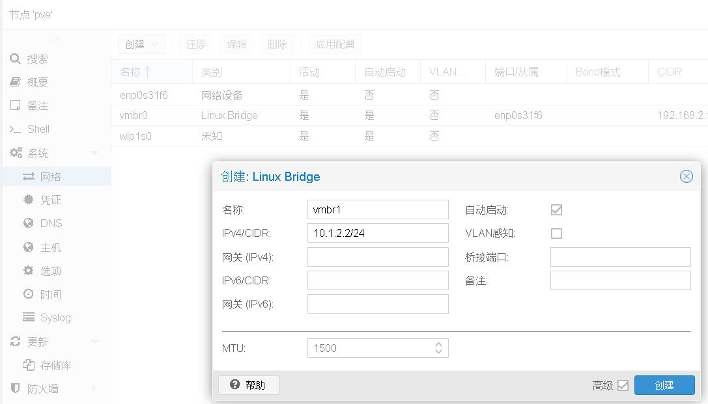  
本次演示计划给接入vmbr1的虚拟机分配`10.1.2.X` 的网络，如图所示新建vmbr1。

编辑/etc/network/interfaces配置文件，加入以下文本。
```log
        post-up   echo 1 > /proc/sys/net/ipv4/ip_forward
        post-up   iptables -t nat -A POSTROUTING -s '10.1.2.0/24' -o wlp1s0 -j MASQUERADE
        post-down iptables -t nat -D POSTROUTING -s '10.1.2.0/24' -o wlp1s0 -j MASQUERADE

```  
注意，这里填写的是无线网络的wlp1s0，如果你不打算使用无线，请修改为对应设备。

修改完成后如图所示。  
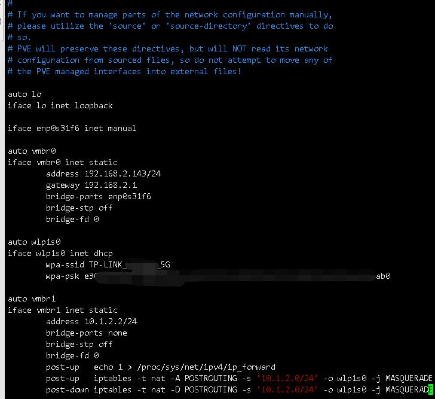  
此时可以使用`ifreload -a` 命令，重启网络。

注意，PVE路由表应该是这样的。  
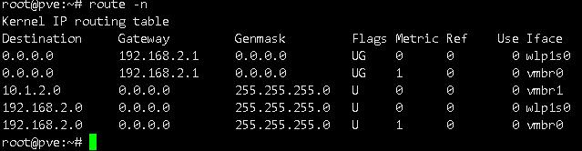  

# 安装软路由给虚拟机分配IP
建立并完成vmbr1的配置后，创建的虚拟机需要手动分配IP才能上网。

此时可以选择在PVE中安装dhcp服务，但使用软路由更符合一般地球人类管理习惯。

本次演示的软路由为ikuai，你也可以使用openwrt。本部分默认用户掌握在PVE中安装windows的技能。  
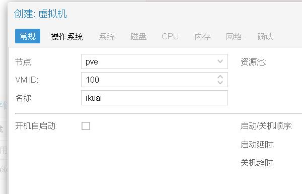  
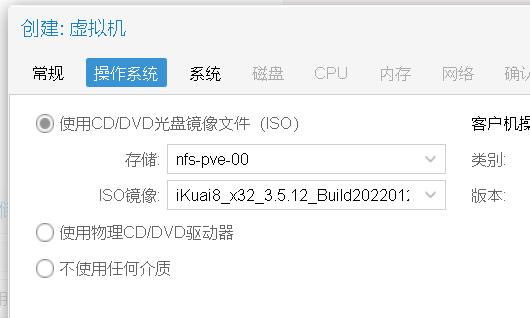  
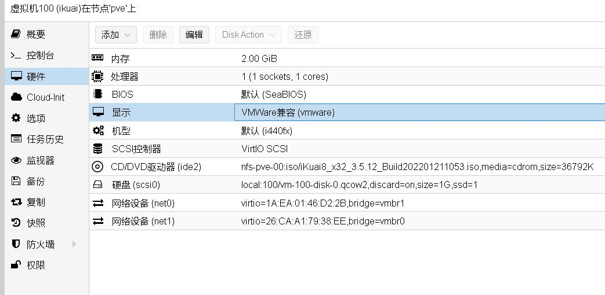  
创建虚拟机需要注意，net0需要接入vmbr1中，显示要改为vmware兼容。新建net1留作备用，不接入网络。部分软路由系统在只有一个口的时候会抽风，两个口就工作正常。  
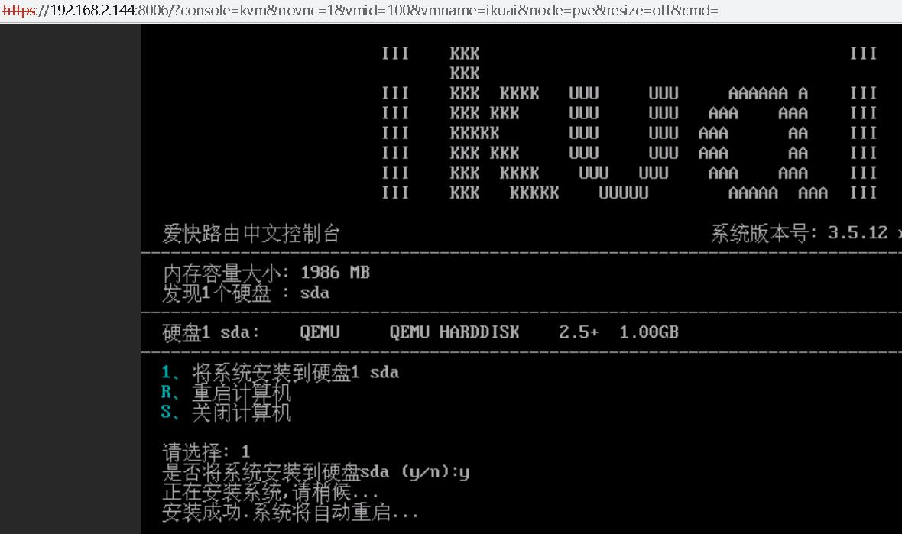  
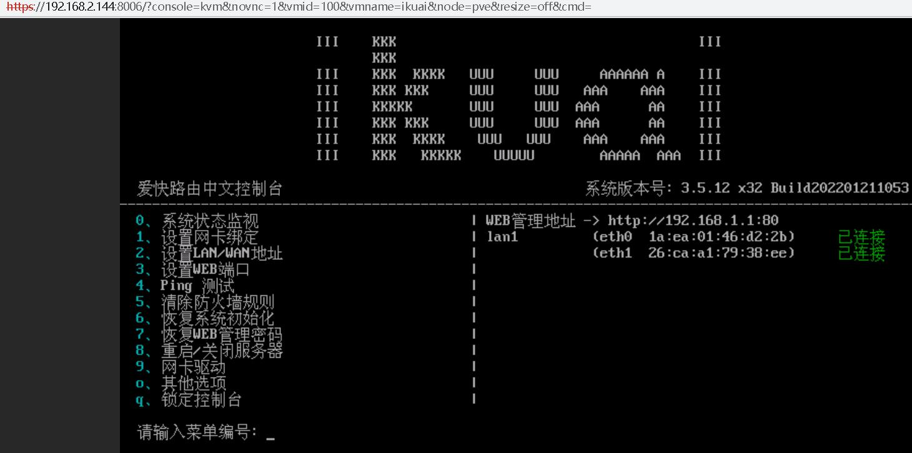  

如图所示则ikuai安装完毕，使用win10虚拟机接入vmbr1，手动分配ip。  
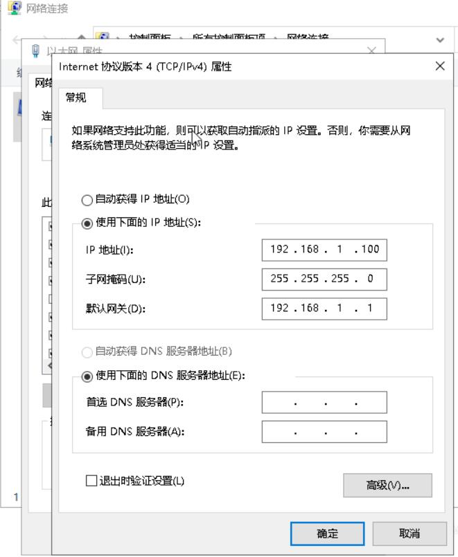  
点击确定，使用浏览器访问ikuai后台。
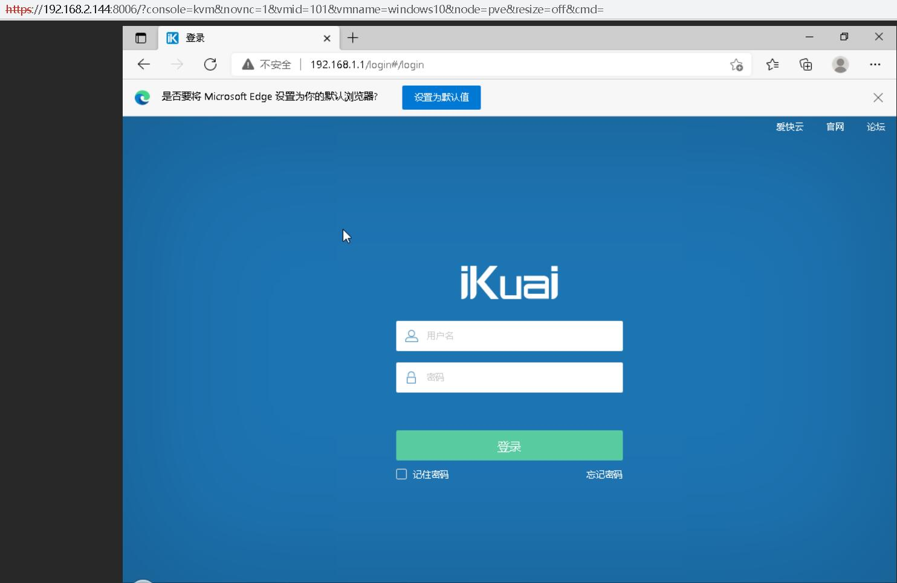  
ikuai的默认用户名密码是admin/admin，进入打开dhcp功能。  
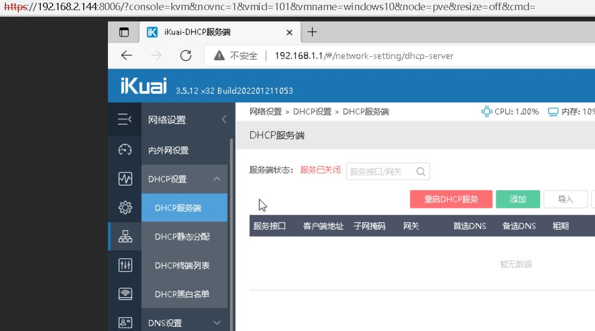  
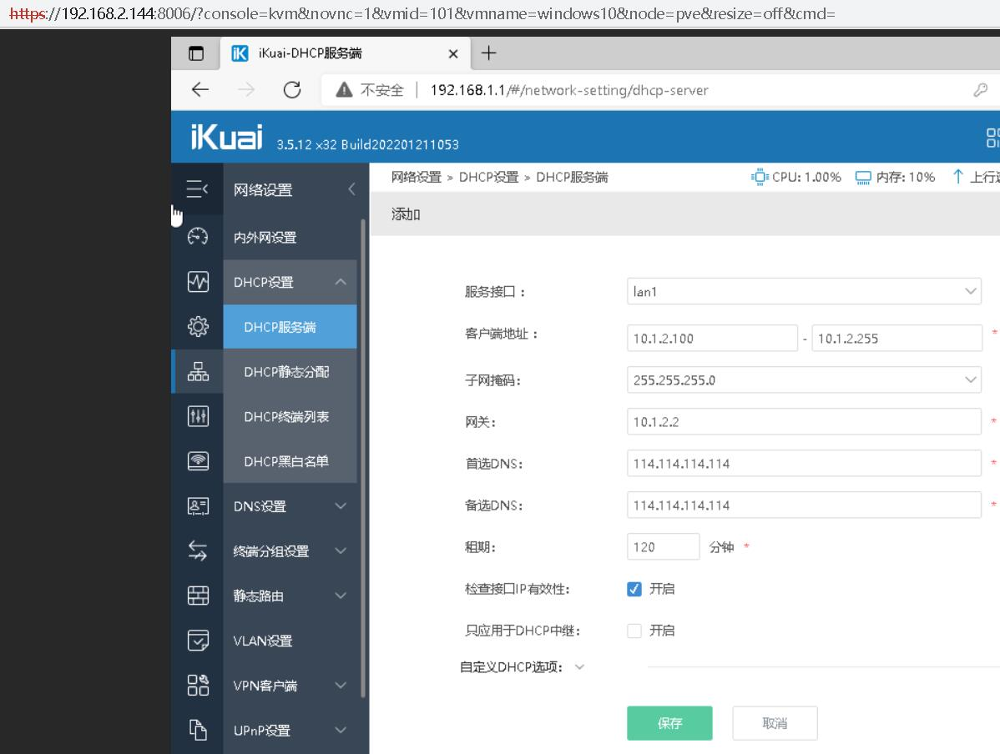
确认配置无误后保存，为了方便管理ikuai，也修改lan口ip。  
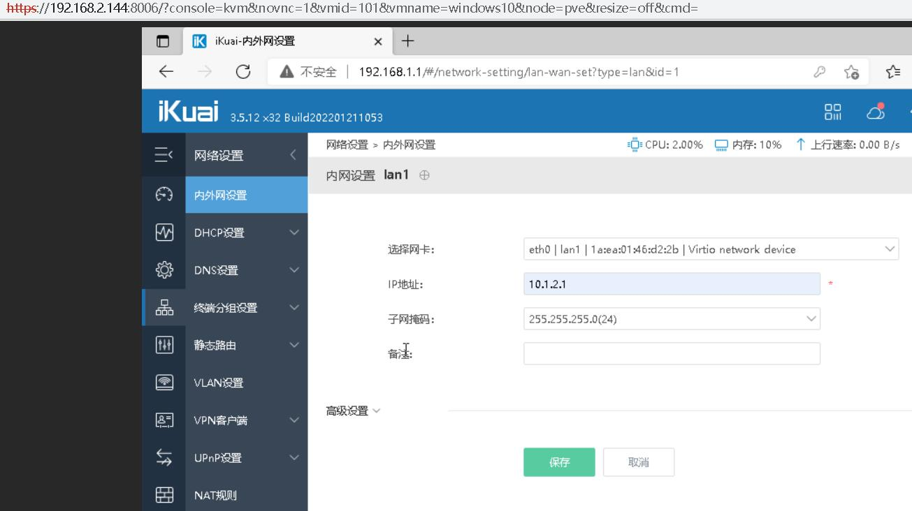  
保存后，将虚拟机ip重新调整为自动获取ip，此时可以尝试上网。如果需要静态分配ip，可以在ikuai中进行分配。

# 从外部访问虚拟机
在进行上述配置后，虚拟机已经可以通过vmbr1走wlp1s0访问网络。

可虚拟机是在另外的一个网段（10.1.2.0/24），所以需要修改提供WIFI上网的路由器的路由表。

由于各家路由器配置各不相同，此处以我使用的小米路由器为例。

即便是小米路由器，部分机型也需要关闭防火墙才能正常访问！
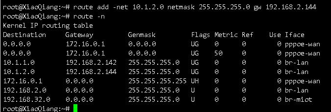  

如图所示，新增一个条目。在PVE外机器tracert测试。  
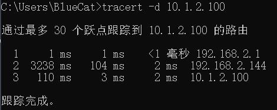  
验证可达。

# ax3600路由器配置参考
如需持久化配置小米ax3600，可以参考以下内容。

防火墙该accept的就改成ACCEPT，或者是选择关闭Firewall自启也行。

否则会出现ping通但连不上的问题。甚至是直接不通。

操作防火墙规则后，必须使用reboot进行重启后才能生效。  
仅重启防火墙服务是不行的。  
直接拔电重启会丢失数据。  
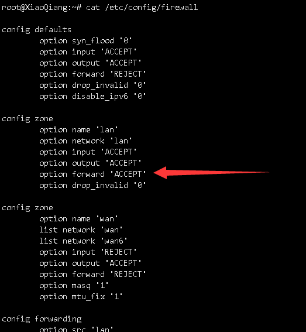

持久化添加路由，找一个开机一定会执行的地方，填就完事了，此处自然也是要使用reboot重启，不能拔电重启。  
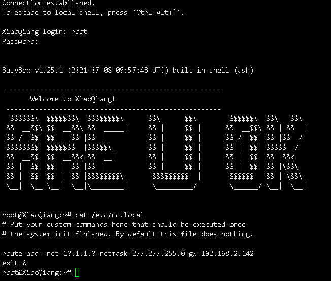
