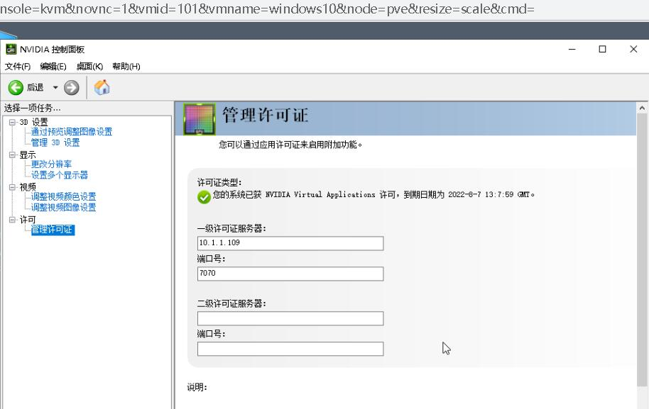

# 于proxmox的lxc中安装vgpu授权服务(License Server Manager)笔记

# 前言
在某些奇怪的场景中，我们需要使用License Server Manager给虚拟机提供一个vgpu授权。

此时需要搭建一个服务，如果使用单独虚拟机就是杀鸡用牛刀。

本文是一个笔记，并非是一个完整教程，可以参考但不建议抄作业。

毕竟，免除vgpu授权直接改device-id, sub-vendor-id，sub-device-id就完事了。

没必要搭个授权服务平白消耗3个G的硬盘与2个G的内存。

# 创建lxc
直接默认一条道走到黑，中间改一点东西就好。

跟普通创建lxc没区别。最低配置是2GB内存与3GB硬盘。

本次使用的lxc模板是`debian-11-standard_11.3-1_amd64.tar.zst`。   
  

使用dhcp动态获取ipv4地址  
  

安装软件包  
```shell
apt update
apt install -y --no-install-recommends vim busybox sudo default-jdk tomcat9
```
如图所示，使用以上命令安装软件包即可。

其中busybox提供一点奇奇怪怪的命令，有的发行版缺点东西。

有的命令不用sudo，虽然是root用户，但也报permission deny，所以就习惯装这玩意了。
  

安装完成后，启动tomcat，验证是否正常。  
```shell
systemctl enable tomcat9.service
systemctl start tomcat9.service
```
接着在宿主机，push安装包至lxc中  
```shell
pct push 109 setup.bin /root/setup.bin
```

使用命令安装  
```shell
chmod +x setup.bin && ./setup.bin -i console
```  
  

因为我们安装的是tomcat9，所以此处的release就是9  
  

可以使用验证flexnets服务是否运行。  
```shell
systemctl restart flexnetls-nvidia.service
```

如果服务未正常启动。需要再补一下。此处重启tomcat不是多余操作。  
```shell
sudo bash /opt/flexnetls/nvidia/server/install-systemd.sh
systemctl enable flexnetls-nvidia.service
systemctl restart flexnetls-nvidia.service
systemctl restart tomcat9.service
```

此时查看服务状态应为。  
  

# 生成授权（另篇）
参考lxc容器mac地址，对应修改。

随后将授权中的mac地址修改为lxc容器的，并生成授权。  
  

授权生成可以参考NVIDIA被开源的代码进行操作。此处不作说明。

预计在后续的解读nvidia被开源源码，或者是关于专业卡加成的文章中说明。

比如说`__glNVIsQuadroDevice`这玩意。

**正常用户建议去搞一份正儿八经的授权，不过正经用户也不会用lxc搭授权不是？**

# 配置并上传vgpu授权
如图所示，如果安装正常。此处server host id应该就是你的mac地址。   
  

对应的授权在License Management上传即可。  
  
  

# 验证授权
这个就真没什么好说的，在nv控制面板把lxc分配的ip填进去就完事了  
  
  

# 结束语
这破玩意跑起来消耗这么多性能。

为什么不直接改device-id, sub-vendor-id，sub-device-id呢？ 
