# 在群晖中使用docker跑ProxmoxVE

# 前言
在容器技术发展的年代，我们期望把很多东西丢进容器里面。

有些东西不知道丢进容器有什么意义，今天就给大家整个活，在群晖的docker套件中跑ProxmoxVE。

请注意，群晖是一个特殊的Linux发行版，如果想在正常Linux中使用docker跑ProxmoxVE请自行调整。

在正常Linux中使用docker跑ProxmoxVE，操作流程可能与本文差异极大。

因为群晖孱弱的性能，本文实际上不具备实用意义。

你使用的群晖需要支援intel VT，内核需要支持启用intel_kvm，kvm模块。

群晖内要有至少一个btrfs存储池，网络必须为openswitch，否则vmm套件会拒绝启动。
# 事前准备
## 开启群晖终端ssh
  
如图所示，在控制面板中的终端机，启用SSH功能即可。

## 安装docker
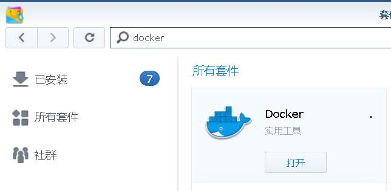
此处不作详细说明，打开套件中心直接搜索docker安装即可，随后配置加速镜像等可以搜索其他教程。

对自己网络有信心的，可以安装完docker套件后就不管了。

## 启用kvm
一般来说，群晖未启用kvm模块。

我们可以进入群晖的ssh中查看。此处password出现后，输入你当前管理员账号的密码。

比如说我的是admin，那么就输入admin的密码。

```shell
ls -l /dev/ |grep kvm

```  
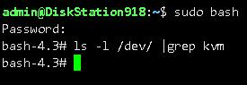  
如图所示，kvm是不在dev下面的。

对于群晖，不同于正常Linux系统，最简单启用kvm的方式就是安卓群晖的VMM套件。
  
直接在套件中心找到vmm套件进行安装。  
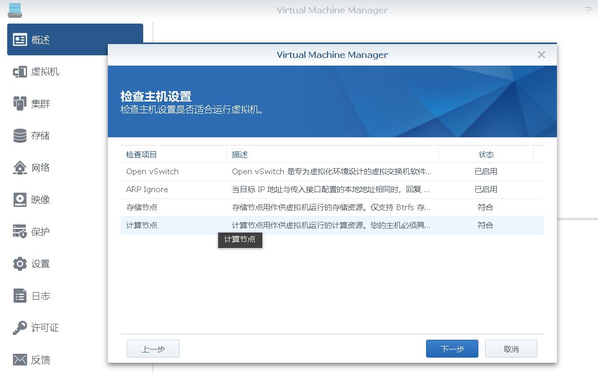  
下一步即可  
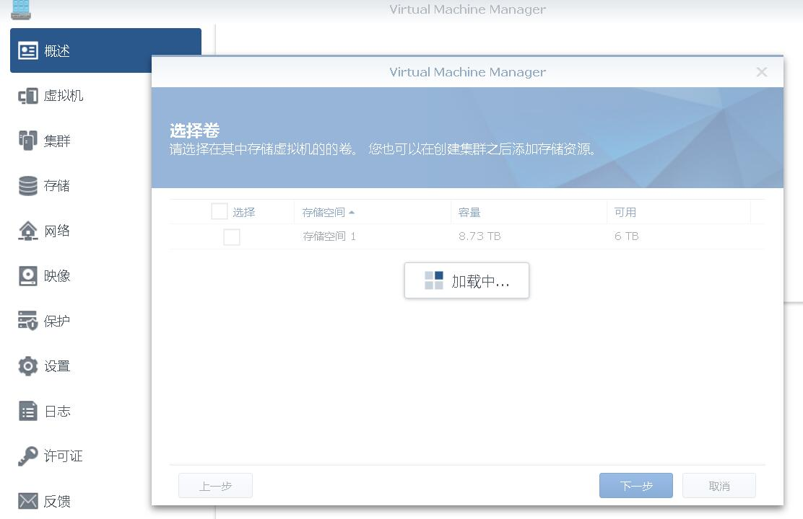  
如图所示，因为我们只是借用vmm启用kvm模块，因此不需要选中btrfs存储池，但如果没有btrfs存储池，vmm会拒绝启动。  
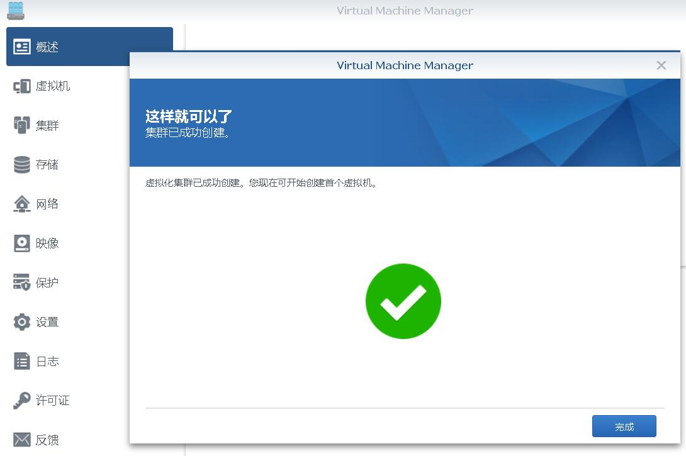  
当如图界面出现时，可以进入终端查看kvm模块是否出现。

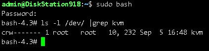  
如果出现了这个kvm，那么恭喜你kvm开启成功。

至于不安装vmm能不能开启kvm，答案是可以的，但有点复杂。

正经人谁拿群晖开虚拟机玩啊！

# docker
## 下载docker镜像
具体tag可以看https://hub.docker.com/r/makedie/proxmox_ve/tags
```shell
docker pull makedie/proxmox_ve:7.2-1

```
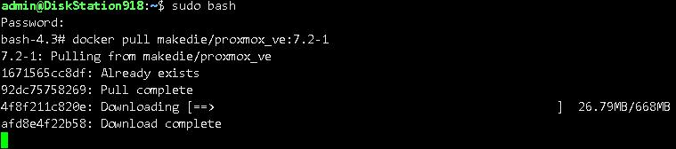  
然后静待完成即可，网络不好的用户可以选择更改群晖docker套件的镜像设置。  
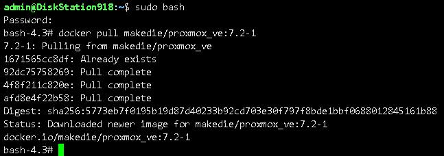  
如图所示，pull完成。

## 运行docker
此处的[your_ip]应修改为群晖的IP，如果你不希望使用host网络，使用bridge网络那就得自己算IP。  
```shell
docker run -idt \
--network host \
--privileged  \
--name pve  \
--add-host pve:[your_ip] \
--hostname pve \
makedie/proxmox_ve:7.2-1

```
一般来说，还会挂载外部文件夹进PVE，此处挂载一个本地存放镜像的存储作为例子。  
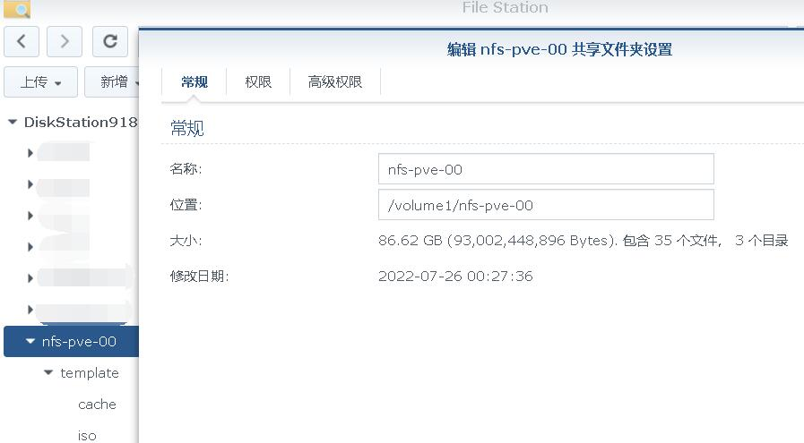  
如图所示，我希望以只读方式挂载的共享文件夹 nfs-pve-00进去,位置可以在如上界面找到。

假如我的IP是192.168.2.100，那么实际运行的就应该是。  
```shell
docker run -idt \
--network host \
--privileged  \
--name pve  \
--add-host pve:192.168.2.100 \
--hostname pve \
-v /volume1/nfs-pve-00: /volume1/nfs-pve-00:ro \
makedie/proxmox_ve:7.2-1

```  
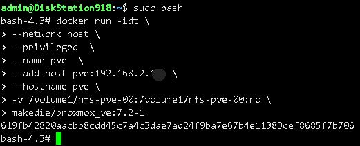  

随后我们可以运行docker logs pve看看情况  
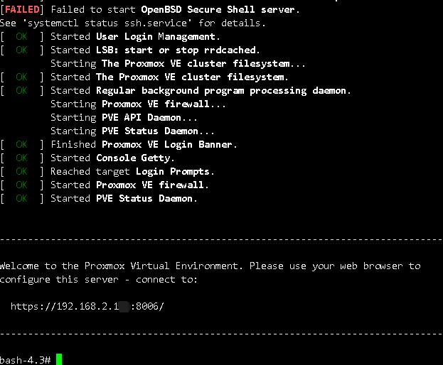  
这里ssh因为与群晖冲突，所以启动失败，不过不用担心，正常情况也不会ssh连进去，本就在docker里面直接用docker的方法连就是了。

# PVE in Docker
## 进入PVE
直接复制上面logs的链接，丢浏览器即可。  
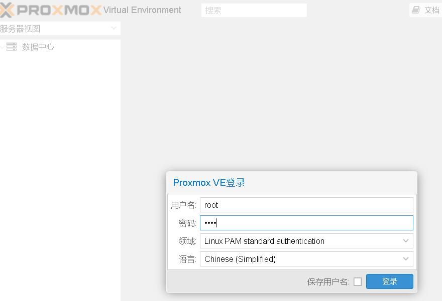  
这里用户名密码默认均为root

## 挂载存储

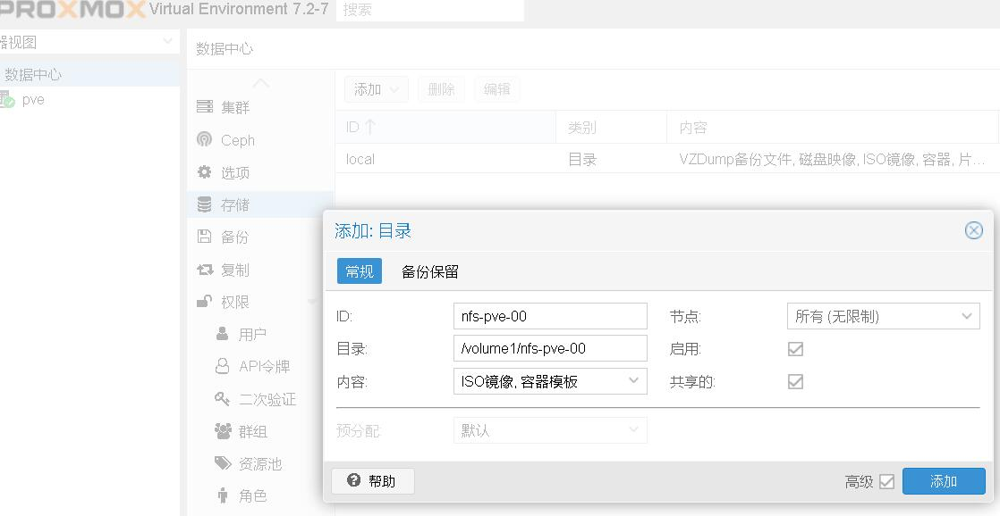
直接在数据中心-存储这里添加刚刚挂载的目录/volume1/nfs-pve-00即可

因为我这个共享文件夹本来就是给PVE存放镜像用的，因此点击刚刚添加的存储就能看见镜像  
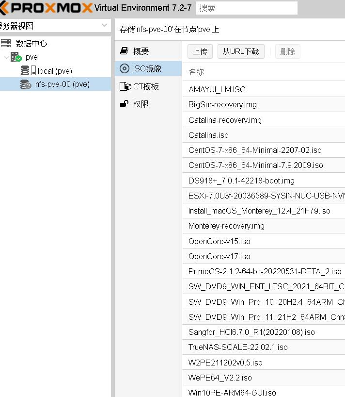  
你也通过其他方式，往里面丢镜像，需要注意的是除了目录这种存储方式，其他存储均不能正常使用。

建议先挂载到群辉再通过-v参数挂载目录进PVE容器。

## 创建没啥用的网络
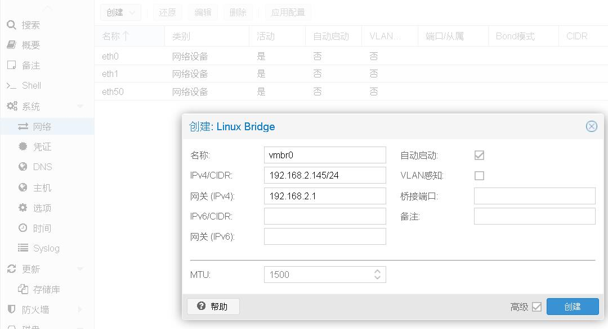  
如图创建个网络就完事了，这个东西没用的，在群晖里面，这玩意不来的。

# 第一个虚拟机
## 创建虚拟机
新建虚拟机的过程与正常PVE一致，需要注意系统类别不能选择windows。  
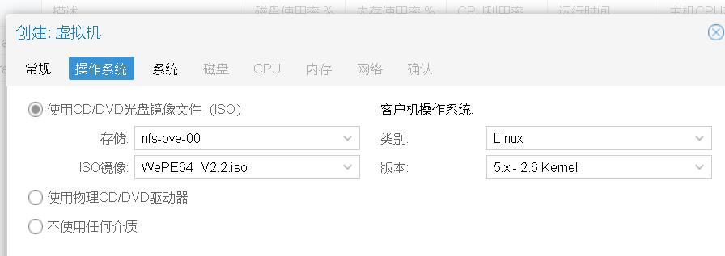  
如图所示，这里虽然启动windows，但类别是Linux

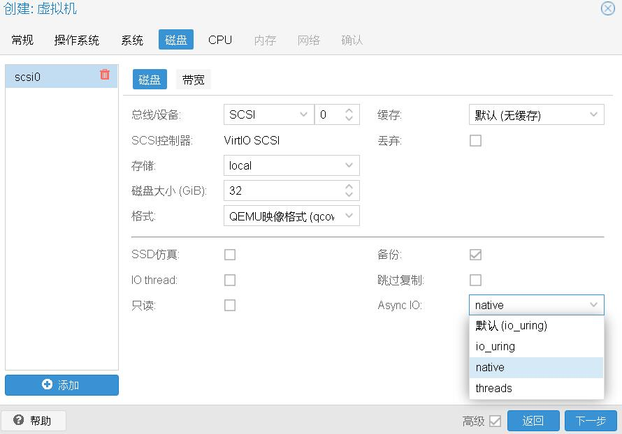  
这个aio不能是默认那个io_uring，垃圾群晖内核版本旧。  

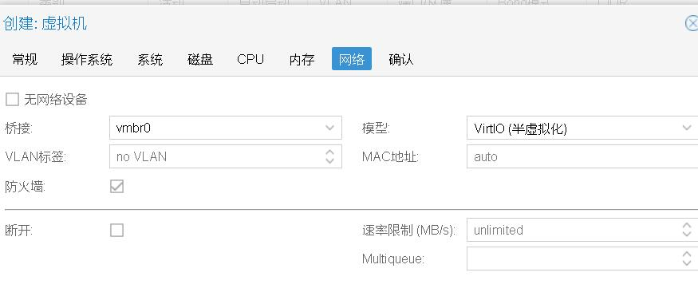  
这里可以把网络改成E1000，或者是后面再改也行。  
这里是玄学步骤，不在这里改成E1000后删掉，后面会起不来网络。不知道为什么。  
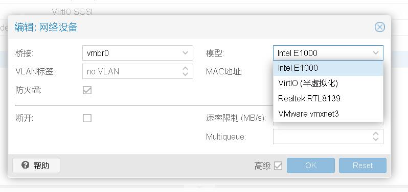  
如图所示，改为E1000后，删除掉这个网络。实际上不会用到这里的网络。  

点击启动虚拟机，会出现如图所示的错误，由于ISO镜像没有aio之类的东西调整，我们需要进虚拟机配置文件中修改。  
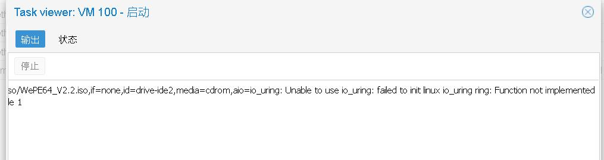  

## 添加tap
```shell
ovs-vsctl add-port ovs_eth1 tap0
ip tuntap add name tap0 mode tap
ip link set tap0 up

```
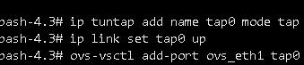  
添加完成后就可以在pve中使用ifconfig命令看见这个tap0了  
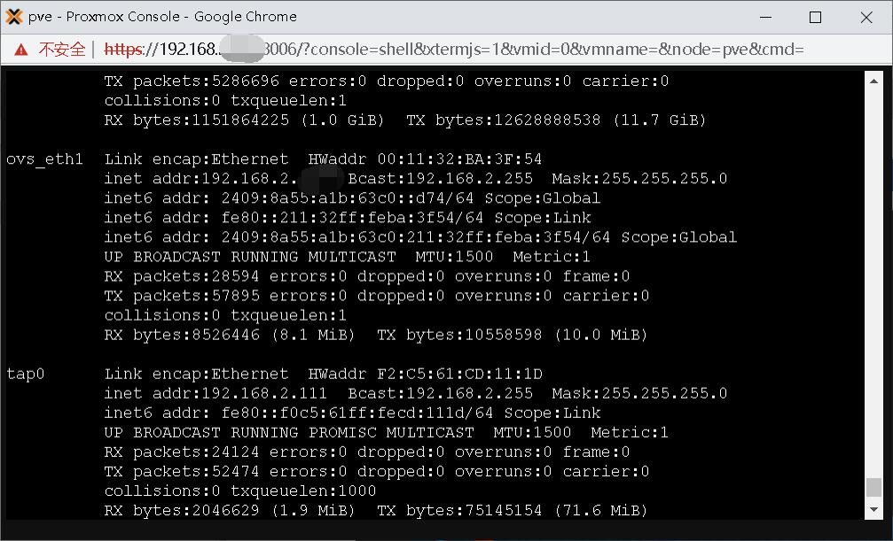  

## 修改虚拟机配置文件
直接vim进去改，加点东西就完事了。  
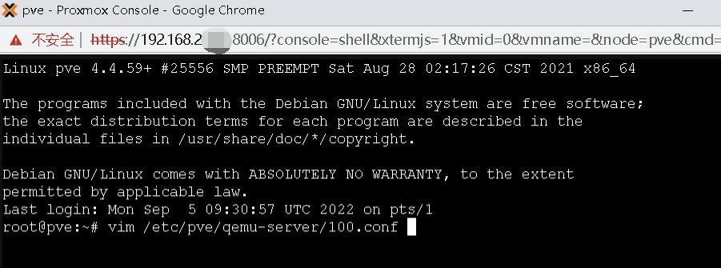  
直接往里头加`,aio=native,cache=none`  
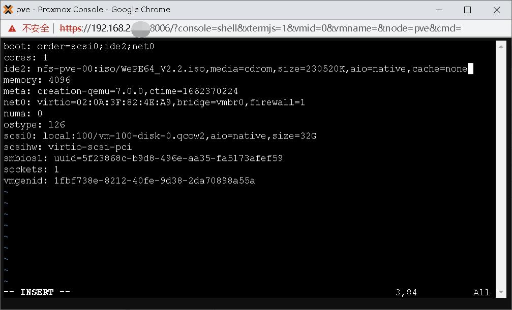  
随后，再增加个args，给我们的虚拟机加个网络。弄的时候没截图，补个cat吧。  
```log
args: -netdev tap,ifname=tap0,script=no,id=hostnet0 -device e1000,netdev=hostnet0,id=net0,mac=02:11:32:2a:76:f2
```
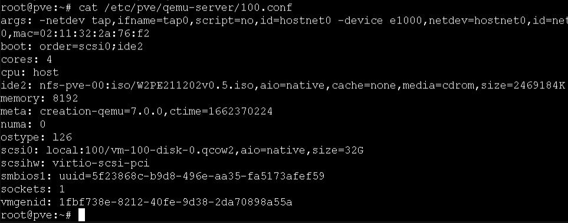  

# 启动虚拟机
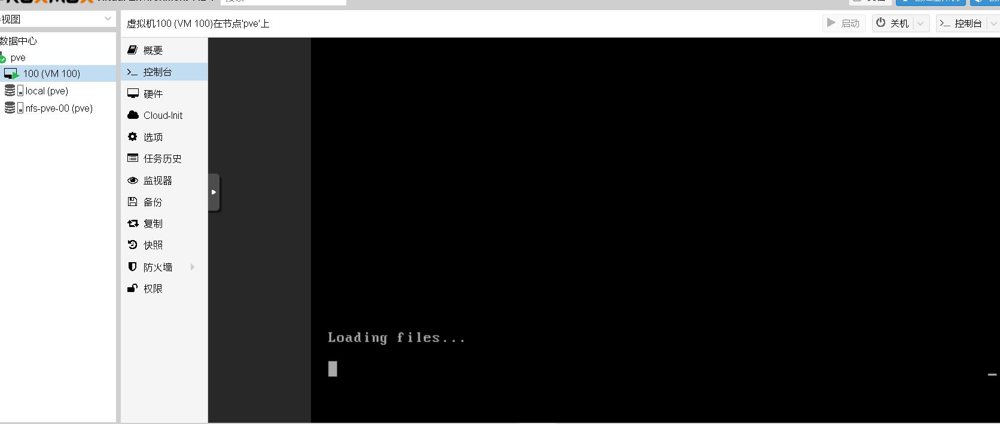  
启动虚拟机，检查是否工作正常。这里使用了winpe，安装完整windows这种事情就别折磨群晖了。  
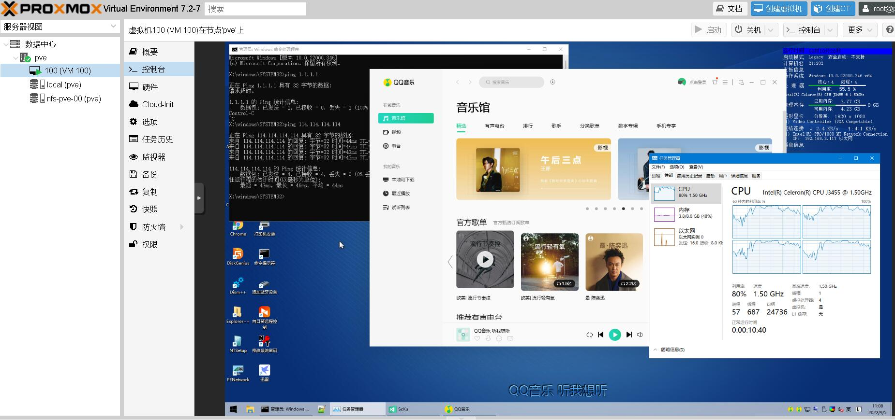  
如图所示，虚拟机运行正常，j3455苦不堪言。

# 给大伙看看首页
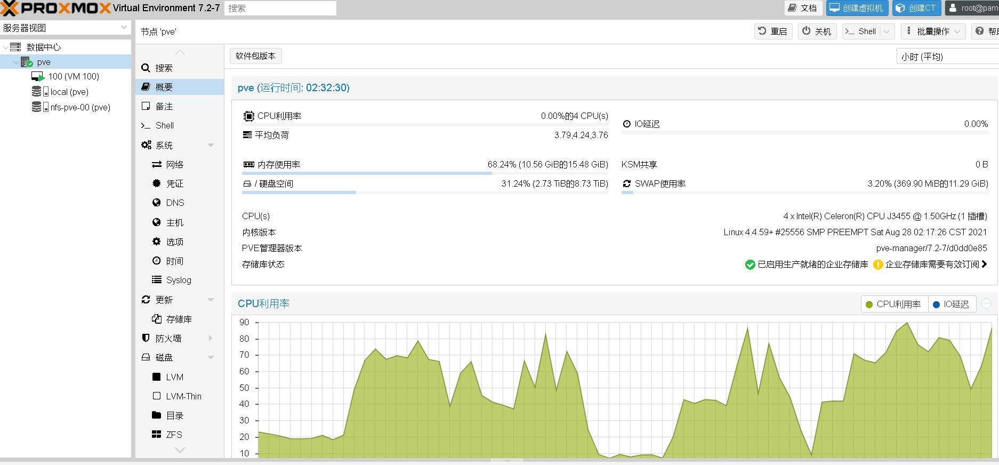