# 在Proxmox中直通P106-090不认卡的解决方案(估计也适用于其他矿卡)

# 前言
目前P106系列矿卡价格已经下降到可以接受的程度

这种矿卡拿来弄vGPU与普通Pascal架构的显卡操作一样，很适合练手

本来是准备出一篇文章，发一下vGPU与直通的性能对比，也就一些跑分软件的结果截图

后续弄到正常显卡再重测重跑

与一般卡就算是用Grid驱动但强打驱动也能用不同，如果直接直通使用，会出现找不到驱动或者是打上驱动但wddm的D3D无法使用的情况

实际上P106等卡已经被列入GL_SANDBAG_WHITELIST中，虽然我看它更像黑名单

于nVidia被开源的驱动源码dev/gpu_drv/stage_rel/drivers/common/inc/nvSandbagList.h
```cpp
/*
 *
 * Bug 1838709,200295819, 200474593
 *
 * This file lists the device IDs which are sandbagged on OpenGL/Vulkan. 
 *
 * For queries, please contact SW-OGL-Driver
 *
 */

#define SANDBAG_NO_WHITELIST       0x00000001
#define SANDBAG_NO_CROSS_ADAPTER    0x00000002
#define SANDBAG_YELLOWBANG          0x00000004

#define SANDBAG_MINER_FLAGS (SANDBAG_NO_WHITELIST | SANDBAG_NO_CROSS_ADAPTER | SANDBAG_YELLOWBANG)

typedef struct _GL_SANDBAG_WHITELIST {
    unsigned int    ulDevID;               // This holds DeviceID
    unsigned int    ulSubSystemID;         // This holds SubSystemID
    unsigned int    ulSubSystemVendorID;   // This holds Vendor
    unsigned int    flags;
} GL_SANDBAG_WHITELIST;


static const GL_SANDBAG_WHITELIST aGLSandbagWhiteList[] = {
  { 0x01F8, 0, 0, 0 },
  { 0x1C2A, 0, 0, 0 },
  { 0x1D82, 0, 0, 0 },
  { 0x1DC2, 0, 0, 0 },
  { 0x1E03, 0, 0, 0 },
  { 0x1E06, 0, 0, 0 },
  { 0x1E10, 0, 0, 0 },
  { 0x1E2D, 0, 0, 0 },
  { 0x1E42, 0, 0, 0 },
  { 0x1E43, 0, 0, 0 },
  { 0x1E44, 0, 0, 0 },
  { 0x1E47, 0, 0, 0 },
  { 0x1E50, 0, 0, 0 },
  { 0x1E6D, 0, 0, 0 },
  { 0x1E80, 0, 0, 0 },
  { 0x1E91, 0, 0, 0 },
  { 0x1E93, 0, 0, 0 },
  { 0x1EAB, 0, 0, 0 },
  { 0x1EAC, 0, 0, 0 },
  { 0x1ED1, 0, 0, 0 },
  { 0x1ED3, 0, 0, 0 },
  { 0x1EEB, 0, 0, 0 },
  { 0x1EEC, 0, 0, 0 },
  { 0x1EF0, 0, 0, 0 },
  { 0x1EF1, 0, 0, 0 },
  { 0x1EF5, 0, 0, 0 },
  { 0x1EF6, 0, 0, 0 },
  { 0x1EF8, 0, 0, 0 },
  { 0x1EF9, 0, 0, 0 },
  { 0x1EFA, 0, 0, 0 },
  { 0x1EFB, 0, 0, 0 },
  { 0x1F01, 0, 0, 0 },
  { 0x1F04, 0, 0, 0 },
  { 0x1F09, 0, 0, 0 },
  { 0x1F13, 0, 0, 0 },
  { 0x1F14, 0, 0, 0 },
  { 0x1F41, 0, 0, 0 },
  { 0x1F44, 0, 0, 0 },
  { 0x1F46, 0, 0, 0 },
  { 0x1F48, 0, 0, 0 },
  { 0x1F49, 0, 0, 0 },
  { 0x1F53, 0, 0, 0 },
  { 0x1F54, 0, 0, 0 },
  { 0x1F76, 0, 0, 0 },
  { 0x1F80, 0, 0, 0 },
  { 0x1F81, 0, 0, 0 },
  { 0x1F93, 0, 0, 0 },
  { 0x1FC1, 0, 0, 0 },
  { 0x1FC2, 0, 0, 0 },
  { 0x1FD1, 0, 0, 0 },
  { 0x1FD2, 0, 0, 0 },
  { 0x1FD3, 0, 0, 0 },
  { 0x1FF8, 0, 0, 0 },
  { 0x1FF9, 0, 0, 0 },
  { 0x2080, 0, 0, 0 },
  { 0x20B0, 0, 0, 0 },
  { 0x20BF, 0, 0, 0 },
  { 0x20C0, 0, 0, 0 },
  { 0x20F0, 0, 0, 0 },
  { 0x20FE, 0, 0, 0 },
  { 0x20FF, 0, 0, 0 },
  { 0x2180, 0, 0, 0 },
  { 0x2183, 0, 0, 0 },
  { 0x2185, 0, 0, 0 },
  { 0x2187, 0, 0, 0 },
  { 0x2192, 0, 0, 0 },
  { 0x21AE, 0, 0, 0 },
  { 0x21AF, 0, 0, 0 },
  { 0x21C2, 0, 0, 0 },
  { 0x21C3, 0, 0, 0 },
  { 0x21C4, 0, 0, 0 },
  { 0x21C5, 0, 0, 0 },
  { 0x21C7, 0, 0, 0 },
  { 0x21D2, 0, 0, 0 },
  { 0x23B0, 0, 0, 0 },
  { 0x23BE, 0, 0, 0 },
  { 0x23F0, 0, 0, 0 },
  { 0x15C2, 0, 0, SANDBAG_MINER_FLAGS },
  { 0x1B07, 0, 0, SANDBAG_MINER_FLAGS },
  { 0x1B87, 0, 0, SANDBAG_MINER_FLAGS },
  { 0x1BC7, 0, 0, SANDBAG_MINER_FLAGS },
  { 0x1C07, 0, 0, SANDBAG_MINER_FLAGS },
  { 0x1C09, 0, 0, SANDBAG_MINER_FLAGS },
  { 0x1D83, 0, 0, SANDBAG_MINER_FLAGS },
  { 0x1D84, 0, 0, SANDBAG_MINER_FLAGS },
  { 0x1DC1, 0, 0, SANDBAG_MINER_FLAGS },
  { 0x1EBC, 0, 0, SANDBAG_MINER_FLAGS },
  { 0x1EFC, 0, 0, SANDBAG_MINER_FLAGS },
};

```
至于这些是什么卡，能在dev/gpu_drv/stage_rel/drivers/common/inc/nv_name.h源码中明确找到的有

```cpp
{ 0x15C2, 0x0000, "GP100-A", "CMP 100-100"},
{ 0x1B07, 0x0000, "GP102-A", "P102-100"},
{ 0x1B87, 0x0000, "GP104-A", "P104-100"},
{ 0x1BC7, 0x0000, "GP104-B", "P104-101"},
{ 0x1C07, 0x0000, "GP106-A", "P106-100"},
{ 0x1C09, 0x0000, "GP106-A", "P106-090"},
{ 0x1D83, 0x0000, "GV100-A", "CMP 100-200"},
{ 0x1D84, 0x0000, "GV100-A", "CMP 100-210"},
{ 0x1DC1, 0x0000, "GV100-B", "CMP 100-200"},
```

剩下的均为写出名称只有架构，例如
```cpp
{ 0x23F0, 0x0000, "GA101-B", "Graphics Device"},
```

至于被列入名单的卡，会走什么逻辑，后续会在nvidia被开源源码阅读笔记系列文章中逐步解释

包括`glNVIsQuadroDevice`以及`__glNVIsQuadroDevice`等解锁非专业卡的负优化的内容也会在后续释出

# Patch驱动
由于针对此名单的引用及其复杂，如果直接修改，怕不是直接升天，因此换个思路把它patch掉就行

有一个简单搜寻的方法，SANDBAG_MINER_FLAGS = 0x07

至于为什么是7，因为

```cpp
#define SANDBAG_NO_WHITELIST       0x00000001
#define SANDBAG_NO_CROSS_ADAPTER    0x00000002
#define SANDBAG_YELLOWBANG          0x00000004

#define SANDBAG_MINER_FLAGS (SANDBAG_NO_WHITELIST | SANDBAG_NO_CROSS_ADAPTER | SANDBAG_YELLOWBANG)
```

因此SANDBAG_MINER_FLAGS就是7

而我们的windows是小端系统，因此第一个0x15C2在实际的程序中会是C215

就这个思路，可以直接在512.78_grid_win10_win11_server2016_server2019_server2022_64bit_international这个驱动中找到

```log
C2150700071B0700871B0700C71B0700071C0700091C0700831D0700841D0700C11D0700091E0700491E0700BC1E0700FC1E07000B1F0700812007008220070083200700C2200700892107000D2207004D2207008A240700CA2407000A250700
```

这里还有之前被开源源码没有的

248A (GA104 [CMP 70HX]),220D (GA102 [CMP 90HX]), 2189 (TU116 [CMP 30HX]),20C2 (GA100 [CMP 170HX]),2082 (GA100 [CMP 170HX]), 1F0B (TU106 [CMP 40HX]), 1E09(TU102 [CMP 50HX])

把它直接做掉，就代码层面上就能去掉矿卡不认驱动限制了(编解码驱动限制不在这里，在别的地方)

**在本站https://foxi.buduanwang.vip/pan/foxi/Virtualization/vGPU/NVIDIA-GRID-Linux-KVM-510.73.06-510.73.08-512.78.zip**

**下载后解压可得512.78_grid_win10_win11_server2016_server2019_server2022_64bit_international.exe，再次用7zip解压**

把512.78_grid_win10_win11_server2016_server2019_server2022_64bit_international\Display.Driver，下面的全部sys还有dll都撸一次

## 人工是不可能人工的
这里写一个golang小程序干这事情  
```golang
package main

import (
	"context"
	"encoding/hex"
	"github.com/gogf/gf/v2/frame/g"
	"github.com/gogf/gf/v2/os/gfile"
	"sync"
	"time"
)

func main() {
	patch()
}
func patch() {
	var err error
	rawHexString := "C2150700071B0700871B0700C71B0700071C0700091C0700831D0700841D0700C11D0700091E0700491E0700BC1E0700FC1E07000B1F0700812007008220070083200700C2200700892107000D2207004D2207008A240700CA2407000A250700"
	rawBytes, _ := hex.DecodeString(rawHexString)
	patchHexString := ""
	for i := 0; i < len(rawBytes); i = i + 4 {
		patchHexString = patchHexString + "FFFF0700"
	}
	patchBytes, _ := hex.DecodeString(patchHexString)
	globDll, err := gfile.Glob(gfile.Pwd() + gfile.Separator + "*.dll")
	globSys, err := gfile.Glob(gfile.Pwd() + gfile.Separator + "*.sys")
	glob := append(globDll, globSys...)
	if err != nil {
		g.Log().Line().Warning(context.TODO(), err)
		return
	}
	g.Log().Line().Debugf(context.TODO(), "match %v files", len(glob))
	wg := &sync.WaitGroup{}
	for _, v := range glob {
		wg.Add(1)
		go func(group *sync.WaitGroup, v string) {
			defer wg.Done()
			g.Log().Line().Debug(context.TODO(), v)
			err = gfile.ReplaceFile(string(rawBytes), string(patchBytes), v)
			if err != nil {
				g.Log().Line().Warning(context.TODO(), err)
				return
			}
		}(wg, v)
	}
	wg.Wait()
	g.Log().Line().Debug(context.TODO(), "done")
	time.Sleep(time.Second * 100)
}
```
## 二次解压必要的文件
但是很多朋友就会发现，诶怎么我驱动就没sys也没dll啊

其实吧这里需要用7zip解压一下就有了  
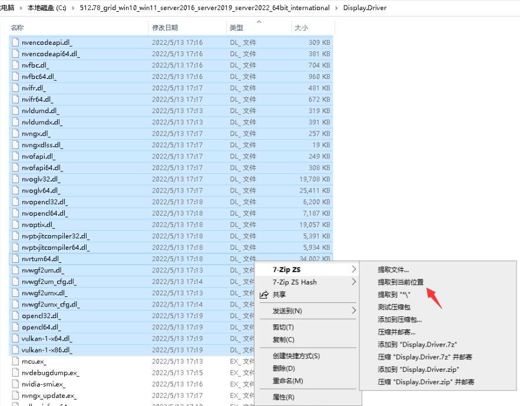  
然后跑一下那个批量替换的代码，就能把这个名单去掉了

# 修改inf文件
接下来就看你喜好，把设备加进nvgridsw.inf里面，不加在设备管理器手动选个gtx1060也能用就是

至于其他设备的ID，你可以自己看看GPUZ然后抄作业
```inf
%NVIDIA_DEV.1B07% = Section021, PCI\VEN_10DE&DEV_1B07
%NVIDIA_DEV.1C07% = Section021, PCI\VEN_10DE&DEV_1C07
%NVIDIA_DEV.1C09% = Section021, PCI\VEN_10DE&DEV_1C09

```
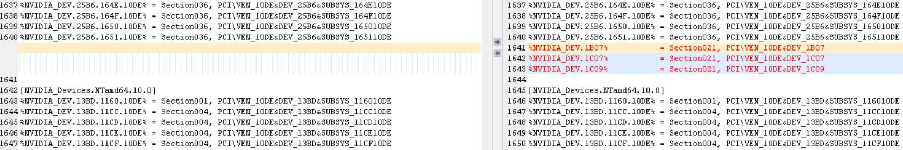
```inf
NVIDIA_DEV.1B07 = "NVIDIA P102-100"
NVIDIA_DEV.1C07 = "NVIDIA P106-100"
NVIDIA_DEV.1C09 = "NVIDIA P106-090"

```
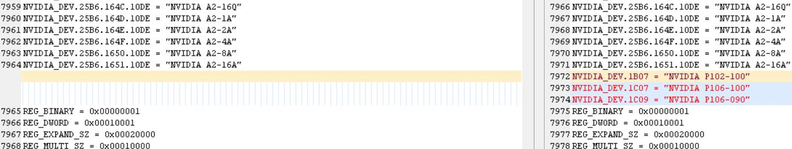  
# 添加注册表
加完inf文件，接下来是给系统加注册表，以下内容保存为reg文件，双击导入注册表

作用是，让nvidia驱动安装完后，跳过nv签名加载验证，不会出现驱动没报错然后愣是加载不上dll的情况
```reg
Windows Registry Editor Version 5.00

[HKEY_LOCAL_MACHINE\SOFTWARE\NVIDIA Corporation\Global]
"{41FCC608-8496-4DEF-B43E-7D9BD675A6FF}"=dword:00000001

[HKEY_LOCAL_MACHINE\SYSTEM\ControlSet001\Services\nvlddmkm]
"{41FCC608-8496-4DEF-B43E-7D9BD675A6FF}"=dword:00000001

```
至于这玩意怎么来的？敬请期待后续的nvidia被开源源码阅读笔记

```cpp
#define NV_PE_SIGNATURE_OVERRIDE_REGKEY     L"SOFTWARE\\NVIDIA Corporation\\Global"
#define NV_PE_SIGNATURE_OVERRIDE_REGKEY_RS4 L"SYSTEM\\ControlSet001\\Services\\nvlddmkm"
#define NV_PE_SIGNATURE_OVERRIDE_REGVALUE {0x41FCC608, 0x8496, 0x4DEF, {0xB4, 0x3E, 0x7D, 0x9B, 0xD6, 0x75, 0xA6, 0xFF}}
/*    (translates to a "{41FCC608-8496-4DEF-B43E-7D9BD675A6FF}" regvalue name)
 *
 *    , or b) when compiling your module by defining NV_PE_SIGNATURE_OVERRIDE
 *    at build-time, or by just temporarily toggling this #define right here:
 */
```
# 开启测试模式
然后为系统开启测试模式，在任务栏管理器中以管理员身份运行
```shell
bcdedit /set testsigning on
```  
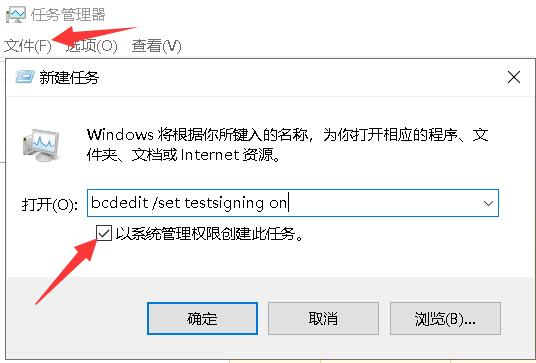  
# 禁止系统联网检索驱动
接着关闭系统联网更新驱动功能，于组策略gpedit.msc中  
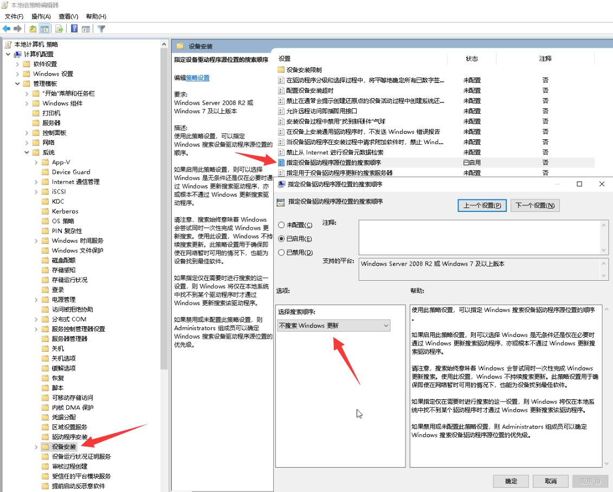  
完事了就可以重启，进行驱动签名，由于开启了测试模式，因此只需要签名nvlddmkm.sys即可

# 签名nvlddmkm.sys
如果不希望使用测试模式，也可以自己去捞nvidia的开源代码里面的证书签名

要处理安全编录CAT以及修改过的全部dll，然后那个签名还是过期的，要想办法解决时间戳的事情

所以就交给有精力的人弄吧，不难，就是累

这里我们用这工具随便签个
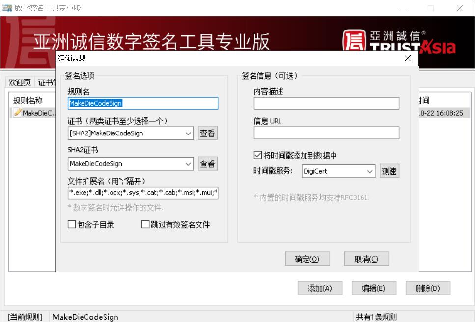  
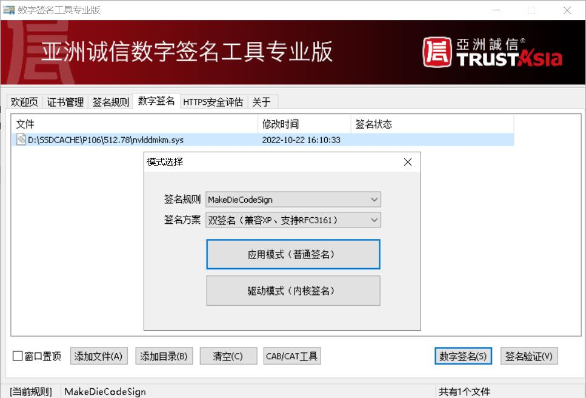  
# 安装驱动
签名完成后，就可以进行驱动安装了  
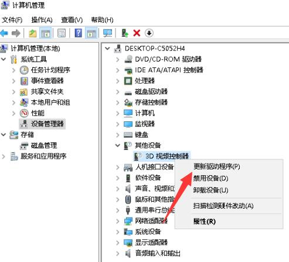  
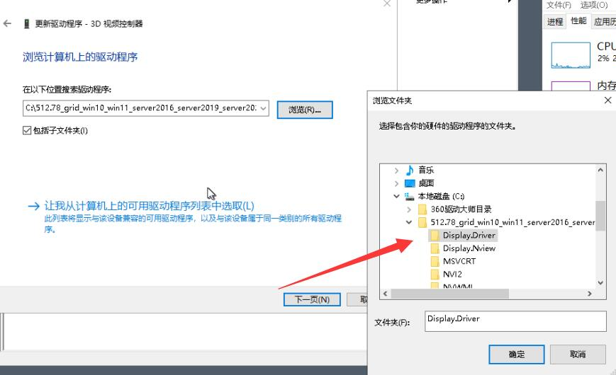  
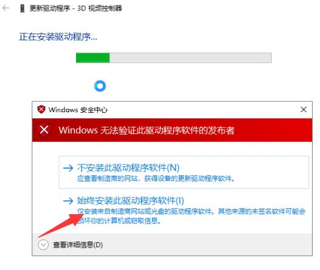  
稍等片刻，就可以看见它安装完毕了可以跑分试试

# 图形设置中指定程序为高性能
在跑分之前，可能需要在系统中把目标程序设置为高性能，但有时候也不用，不知道啥时候需要设置这玩意
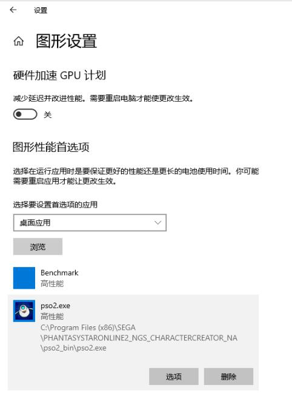  
# PSO2NGS跑分
首先是PSO2NGS跑分  
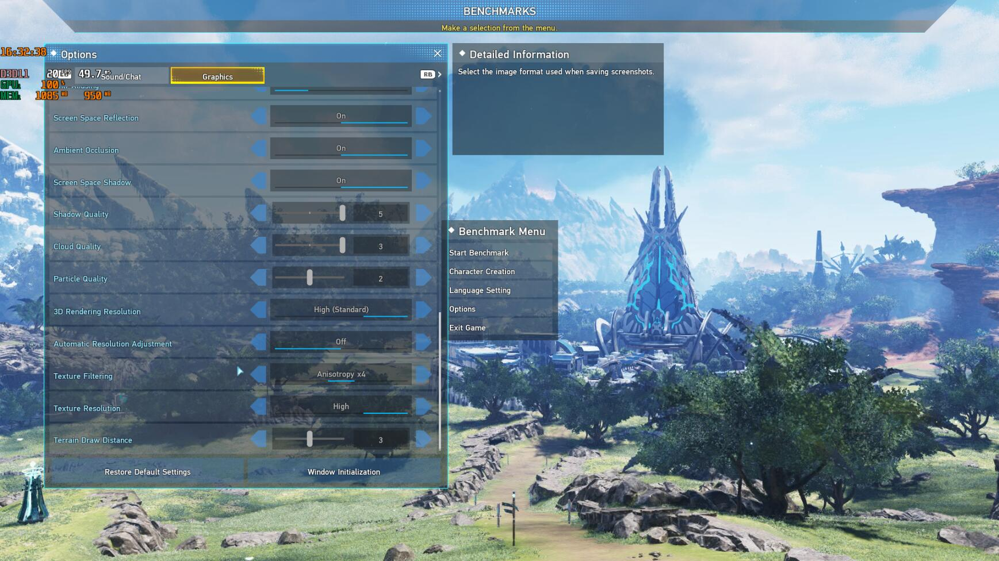  
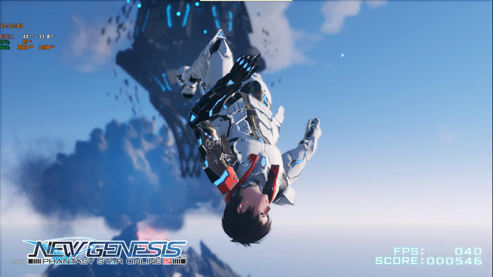  
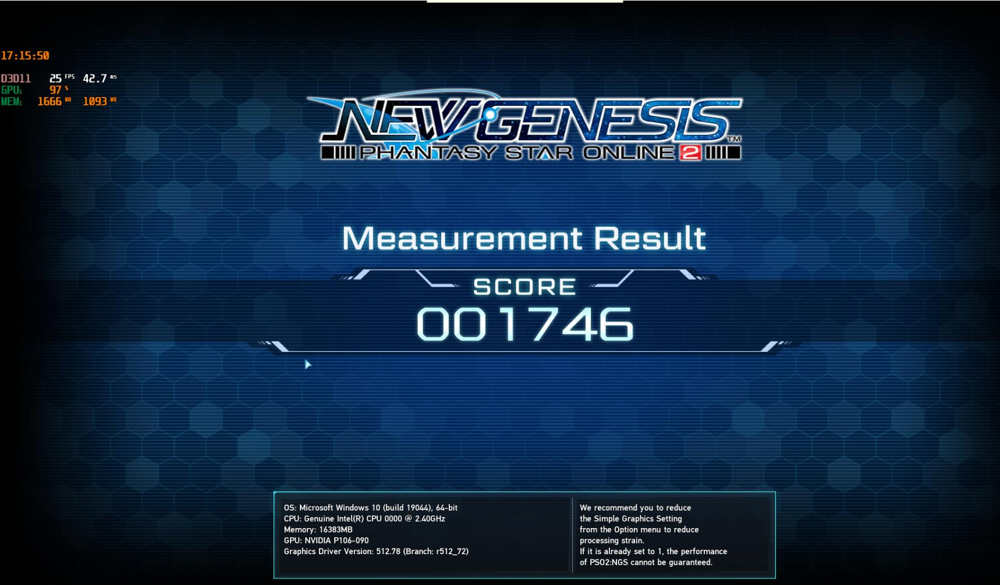  
# 娱乐大师跑分
然后是新版娱乐大师  
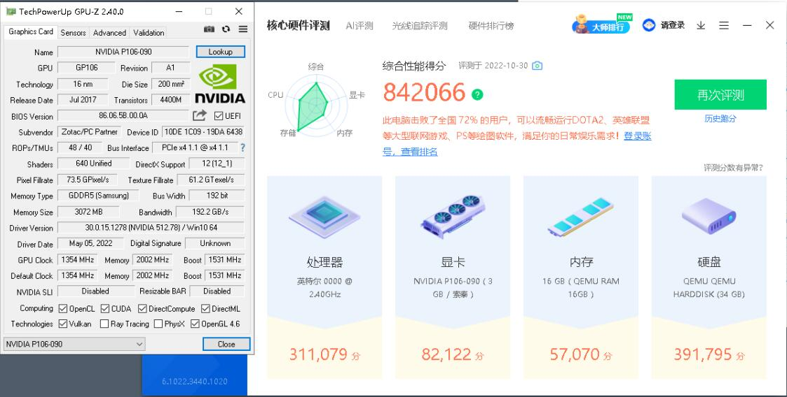  
# 结尾
至此，直通的P106-090就可以在PVE的虚拟机中，正常工作了

但比起vGPU，直通真的有意义吗？

如果是正常卡还能接个显示器，但P106没接口啊！

vGPU比起直通怎么感觉跑分还更高了？  
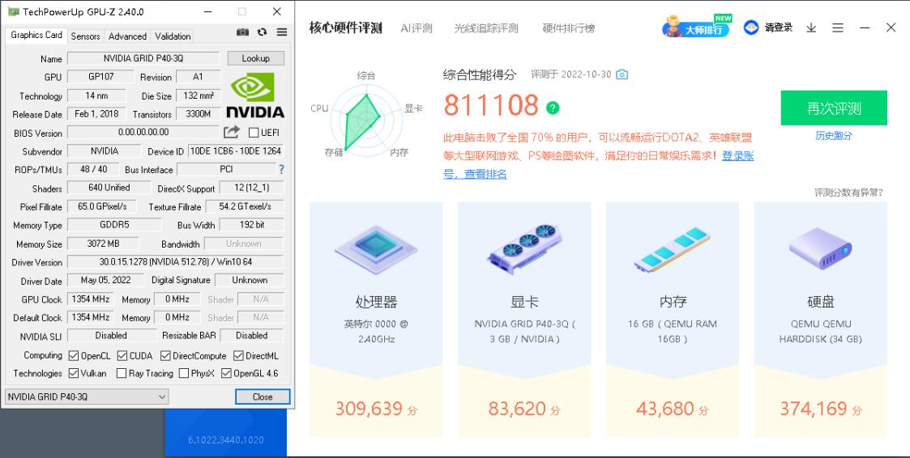  
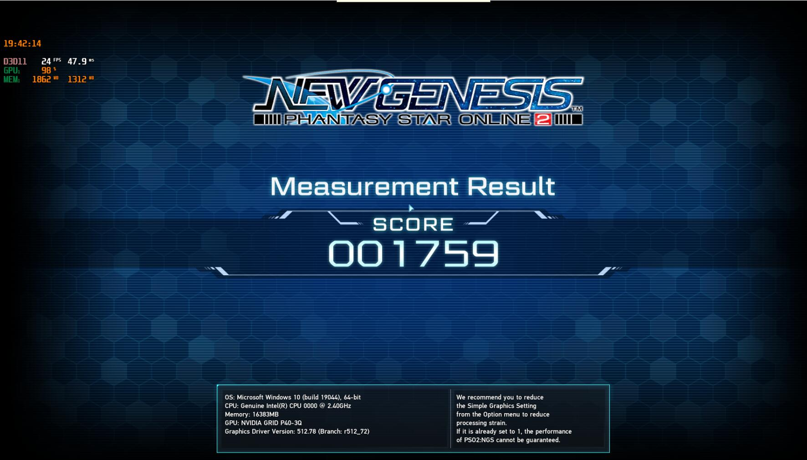  
由于P106这卡过于特殊，后续的VGPU与直通性能对比不会使用该卡作为测试卡

等我蹲到张正常卡再做直通与VGPU性能对比测试吧

如果有跑分软件推荐可以在后面留言，不需要操作的东西都可以推荐，要手动跑圈的比如说吃鸡之类的就不要推荐了，VGPU跑那玩意要命的

测试会测，2台虚拟机同时VGPU，1台虚拟机VGPU，1台虚拟机直通，三个场景

至于为什么没有2台虚拟机直通，因为一张卡不能直通到两台机

# 一顿操作猛如虎实际不如二百五
有没有可能，PVE可以直接改PCIe设备的deviceID，而不用大费周章去改驱动？  
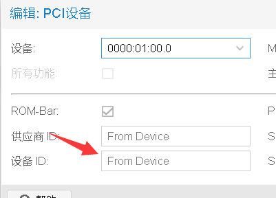  
好想玩CMP HX系列矿卡啊，什么时候才掉价啊

好想玩CMP HX系列矿卡啊，什么时候才掉价啊

好想玩CMP HX系列矿卡啊，什么时候才掉价啊