# 来自民间的VGPU授权fastapi-dls

# 首先介绍一下
该项目来源于

https://hub.docker.com/r/collinwebdesigns/fastapi-dls

但由于需要用OpenSSL生成证书，有一定使用门槛(?)，因此自封了个证书进去，也就是文中使用的docker镜像

如果有一定的技术能力，可以直接参考原文教程

**这个东西是一个很新的东西，相关缺陷报告目前尚未得知，请谨慎用于生产环境**

# 开局第一步
你自然是得有一个docker环境，此处不再进行赘述，没有docker的可以参考别的PVE使用docker的文章

当然，你PVE中也得正常安装使用VGPU，具体安装方式可以看其他文章

此处以NVIDIA-Linux-x86_64-510.108.03-vgpu-kvm 为例

你可以从NVIDIA官网、本站网盘或第三方网站(如：https://archive.biggerthanshit.com/NVIDIA/ )获取驱动

**请注意你获取的是vgpu驱动及对应版本的grid驱动，而不是quadro以及geforce驱动**

**也不要通过unlock或者是PVE添加设备那边修改设备ID**

# 寻找ip地址
该镜像需要一个DLS_URL，该处可以填写你访问该容器的IP，比如本次例子是10.1.1.107

这个DLS_URL的作用，是告知虚拟机内的grid驱动，访问哪个IP与端口获取授权

在本例中，IP(10.1.1.107)为一台跑docker的centos机器，实际使用时请结合实际情况

后续生成授权与访问该服务需要用到

# 创建容器
执行命令  
```shell
docker run -d -e DLS_URL=10.1.1.107 -e DLS_PORT=443 -p 443:443  makedie/fastapi-dls

```  
> 此处的DLS_URL与DLS_PORT是后续生成授权文件，告知guest如何访问授权容器，如果你要使用192.168.2.123:1234访问，则创建容器的命令应为
>
> ```docker run -d -e DLS_URL=192.168.2.123 -e DLS_PORT=1234 -p 1234:443  makedie/fastapi-dls```
> 
> 随着版本更新，如果需要指定最新版本，去下面的hub地址看看，假如需要使用1.3.5版本则
> 
> 没有同步更新到最新的fastapi-dls时如需使用可以联系本人更新一下
>
> https://hub.docker.com/repository/docker/makedie/fastapi-dls/tags?page=1&ordering=last_updated
>
> `docker run -d -e DLS_URL=10.1.1.107 -e DLS_PORT=443 -p 443:443 makedie/fastapi-dls:1.3.5`
>
创建容器即可  
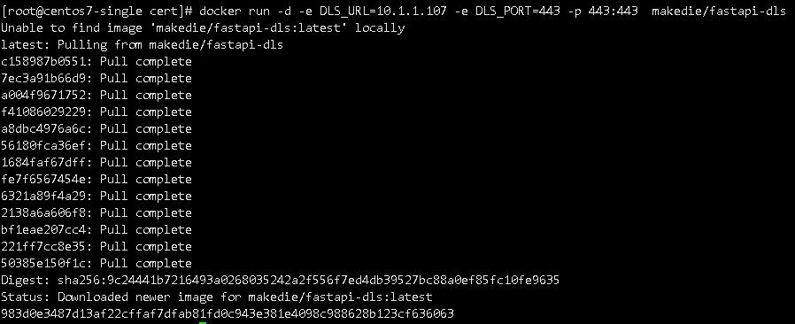  
## 关于TrueNas的特殊情况
如果您使用的是TrueNas，需要知道一件事情，trueNas虽然写着docker，但实际上运行的是k3s（即阉割版本k8s）

此处以面板安装方式举例，由于TrueNas默认会占用443端口，因此本例会使用9443端口作为替代

本例的TrueNas的外部访问IP依旧为10.1.1.107

以下未提及的页面，使用默认配置即可  
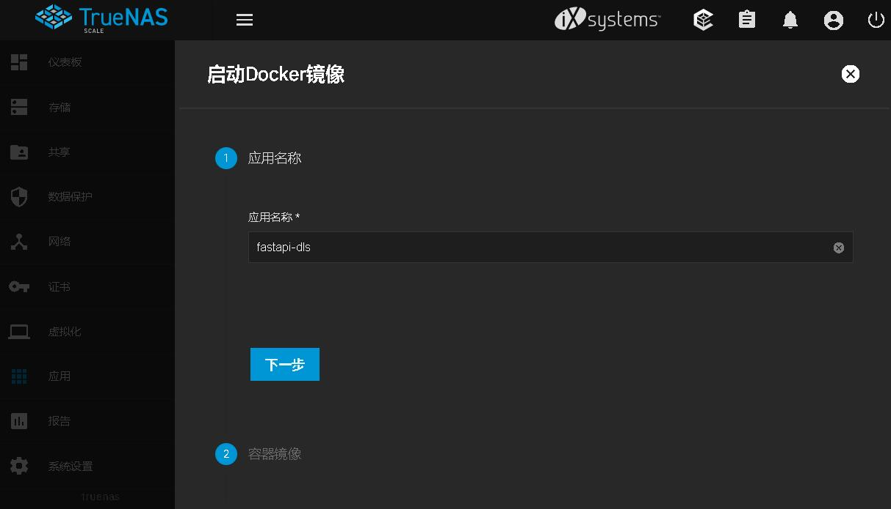  
首先指定一个pod名称，也就是上图的应用名称  
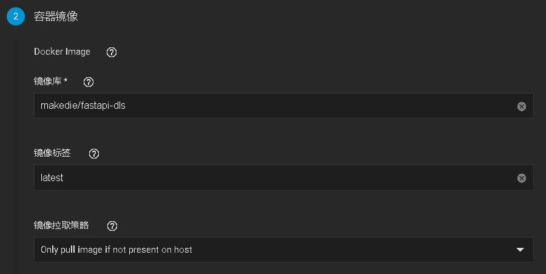  
镜像名与标签如图所示，都可以在docker命令中看见复制过来即可  
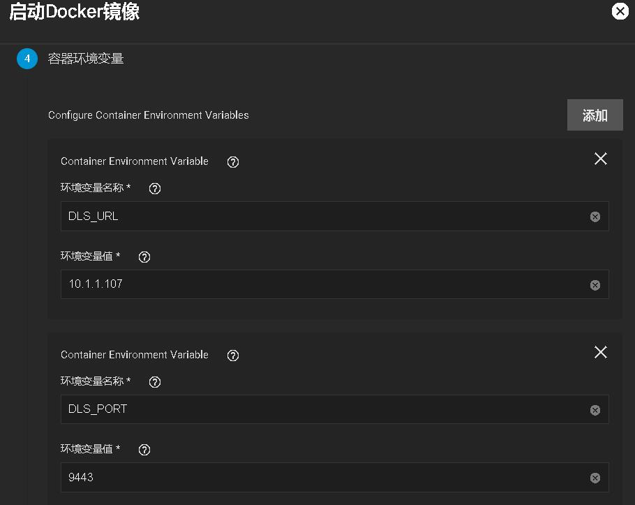  
如图所示，本例因为TrueNas的443端口被占用，DLS_PORT端口被换为9443   
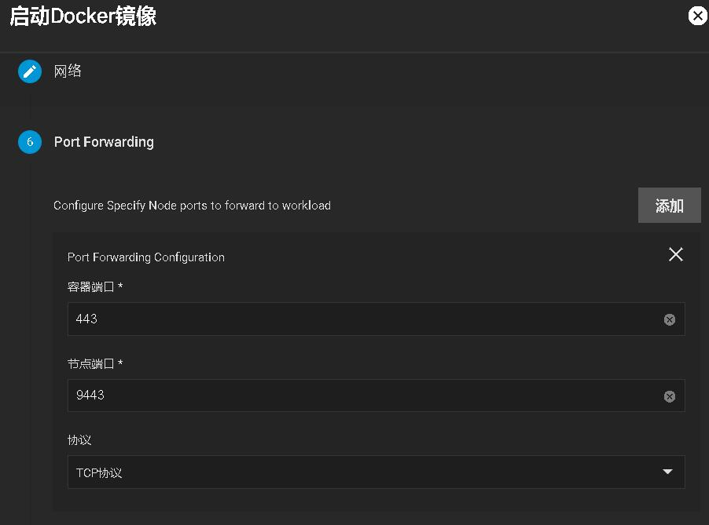  
上图的容器端口，为443无需改动，节点端口对应刚刚我们决定的9443端口  
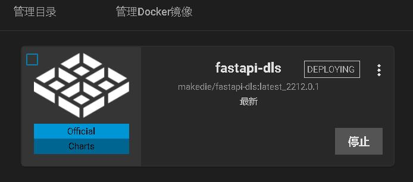  
等等镜像下载，根据网络情况的不同花费的时间也不同，可以点击查看应用事件观察进行到的进度  
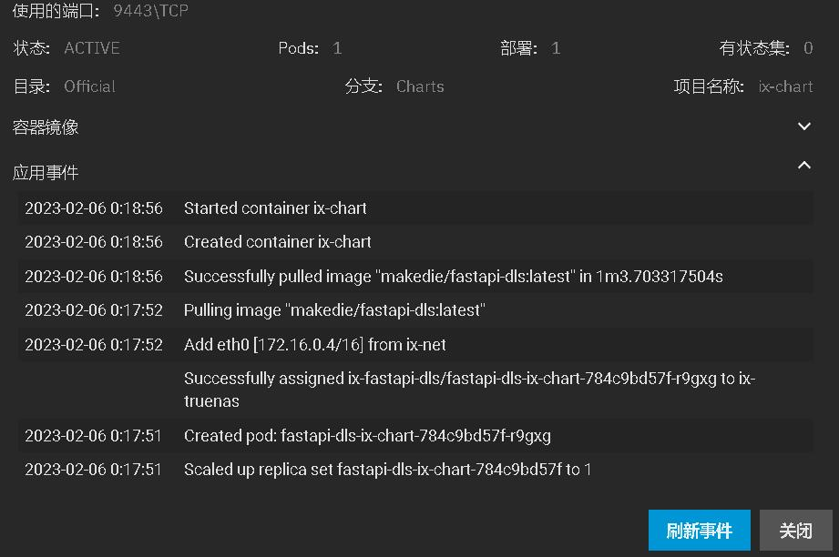  
如图所示，下载用了1分3秒，如果您的网络情况不佳可能需要更多时间  
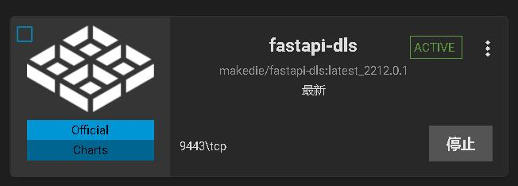  
最后可以看见，TrueNas的面板已经有了个9443端口跑着的授权“容器”

# 于虚拟机安装VGPU驱动
首先我们得安装vgpu使用的grid驱动，此处以`512.78_grid_win10_win11_server2016_server2019_server2022_64bit_international`为例

注意：目前已知的成功案例的guest驱动均为5XX.XX版本，4XX.XX版本未有成功案例

后续反馈成功的案例还有以下例子
```log
15.1(528.24_grid_win10_win11_server2019_server2022_dch_64bit_international.exe)

15.2(528.89_grid_win10_win11_server2019_server2022_dch_64bit_international.exe)

皮蛋熊群晖(NVIDIARuntimeLibrary-x86-510.108.03)
```
以上驱动包括本文书写时使用的驱动版本，是有明确成功案例的，不在本文提及的版本如果成功了也可以在群里反馈一下

驱动直接安装对应版本或者是稍微低一点版本的Grid驱动即可，这里就不附带图片了，相信装个驱动……不至于吧

安装完驱动会提示需要重启，此时不急着重启，先把授权应用了再进行重启

# 应用授权
首先先创建一个路径为

`C:\Program Files\NVIDIA Corporation\vGPU Licensing\ClientConfigToken` 的目录

于虚拟机内使用浏览器，访问刚刚创建的docker容器，https://10.1.1.107/client-token

注意：根据容器版本的不同，这个地址可能是`https://10.1.1.107/-/client-token` 注意自行尝试

`DLS_URL=10.1.1.107 DLS_PORT=443`

此处IP对应DLS_URL如果端口指定了非443的记得加端口访问  
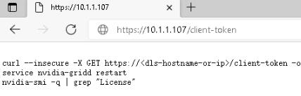  
此时会下载一个文件  
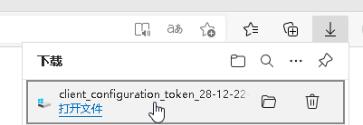  
将该文件保存至刚刚创建的目录中，如图所示  
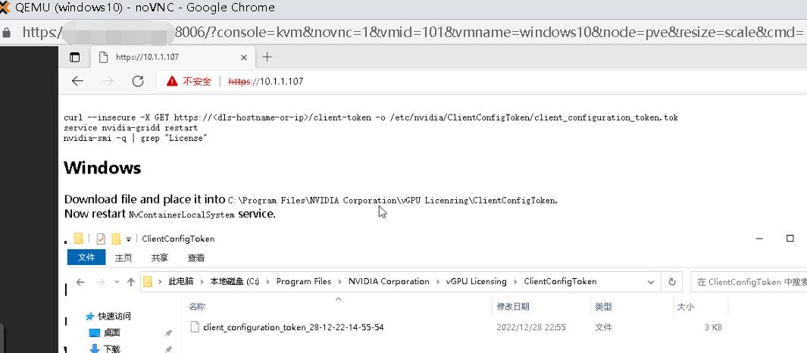  
随后，重启虚拟机

# 验证授权
重启完成后，右下角即可看见授权已获得  
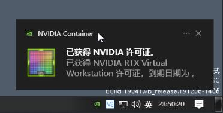  
观察PVE日志，也可以看见授权日志  
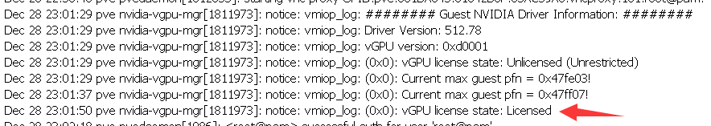  
在虚拟机中使用`nvidia-smi -q` 查看  
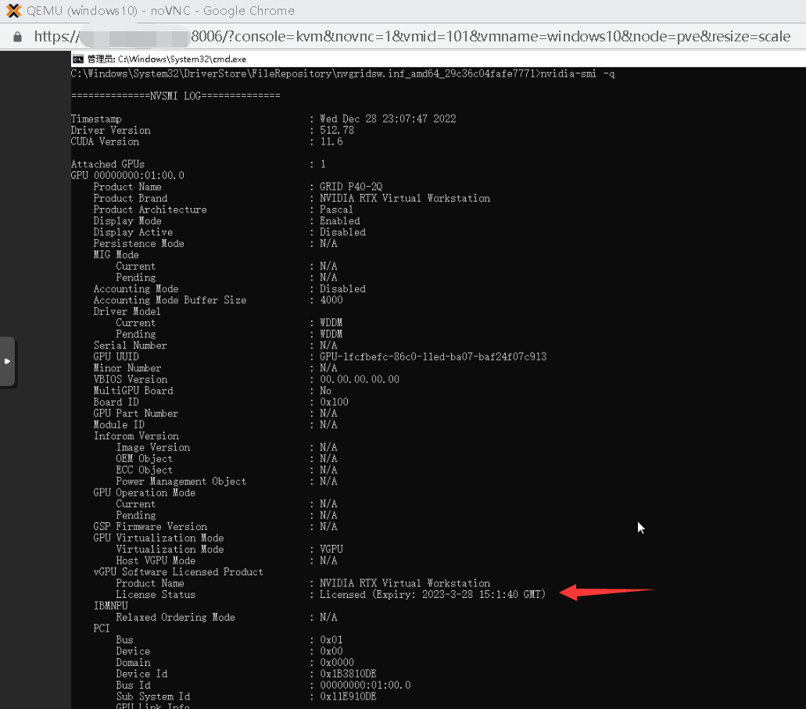
