# 在ProxmoxVE上使用bcache让SSD加速机械硬盘

# 前言
本篇仅作为PVE使用bcache的参考

该方案的稳定性与可用性在PVE上皆存疑，请优先使用proxmox官方支持的其他方案

参考文档 https://www.kernel.org/doc/Documentation/bcache.txt

由于设备的限制以及不完善的测试方法，测试结果可能存在问题，仅供自嗨

使用bcache翻车的风险请自行承担

# 基础需求
已验证Proxmox 7至7.3版本可以使用，后续新版本估计也能用

至少在提供加速的设备上有一个空余的分区用于创建Cache(缓存)

本篇演示，在系统盘中预先预留一部分空间  
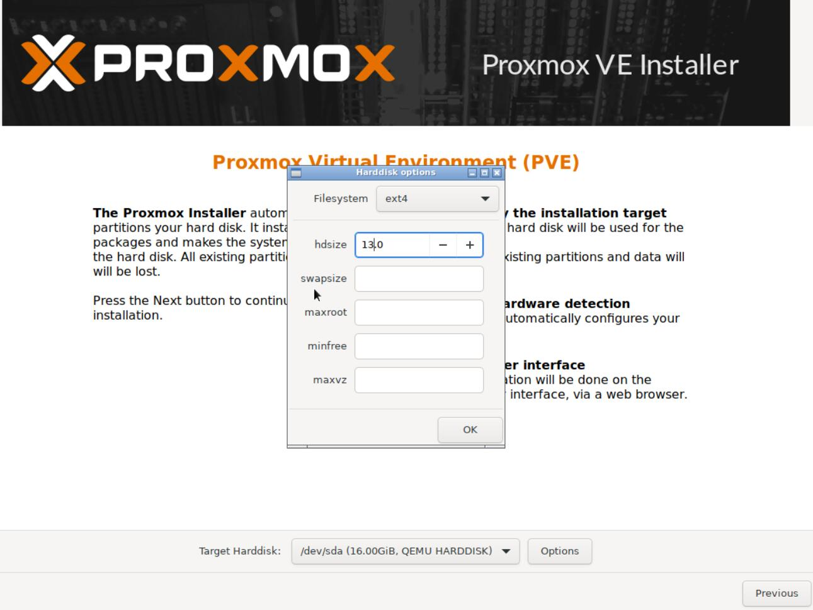  
至少有一个被加速的设备，创建backend(后端设备)

# 环境预览与准备
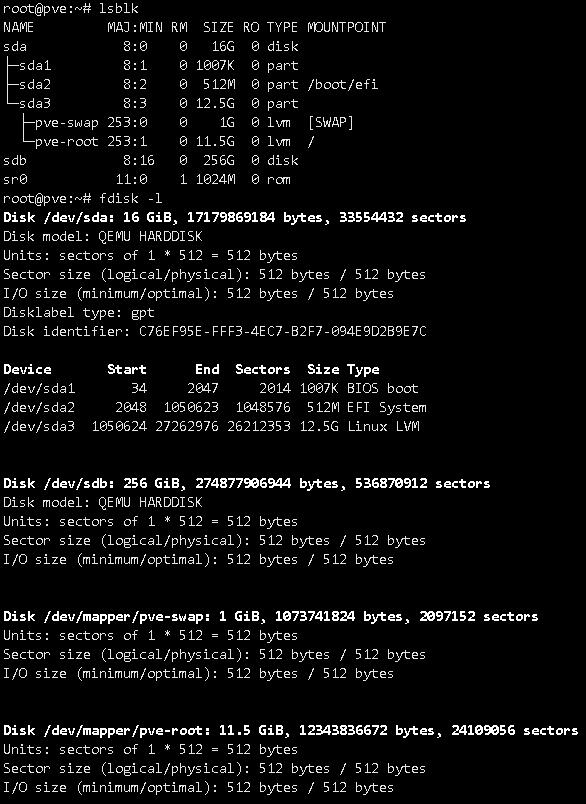  
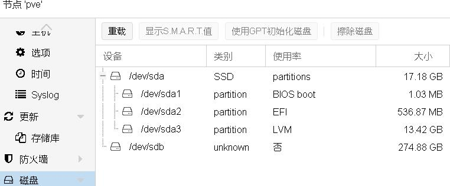  

```log
root@pve:~# lsblk
NAME         MAJ:MIN RM  SIZE RO TYPE MOUNTPOINT
sda            8:0    0   16G  0 disk 
├─sda1         8:1    0 1007K  0 part 
├─sda2         8:2    0  512M  0 part /boot/efi
└─sda3         8:3    0 12.5G  0 part 
  ├─pve-swap 253:0    0    1G  0 lvm  [SWAP]
  └─pve-root 253:1    0 11.5G  0 lvm  /
sdb            8:16   0  256G  0 disk 
sr0           11:0    1 1024M  0 rom


```
```log
root@pve:~# fdisk -l
Disk /dev/sda: 16 GiB, 17179869184 bytes, 33554432 sectors
Disk model: QEMU HARDDISK   
Units: sectors of 1 * 512 = 512 bytes
Sector size (logical/physical): 512 bytes / 512 bytes
I/O size (minimum/optimal): 512 bytes / 512 bytes
Disklabel type: gpt
Disk identifier: C76EF95E-FFF3-4EC7-B2F7-094E9D2B9E7C

Device       Start      End  Sectors  Size Type
/dev/sda1       34     2047     2014 1007K BIOS boot
/dev/sda2     2048  1050623  1048576  512M EFI System
/dev/sda3  1050624 27262976 26212353 12.5G Linux LVM


Disk /dev/sdb: 256 GiB, 274877906944 bytes, 536870912 sectors
Disk model: QEMU HARDDISK   
Units: sectors of 1 * 512 = 512 bytes
Sector size (logical/physical): 512 bytes / 512 bytes
I/O size (minimum/optimal): 512 bytes / 512 bytes


Disk /dev/mapper/pve-swap: 1 GiB, 1073741824 bytes, 2097152 sectors
Units: sectors of 1 * 512 = 512 bytes
Sector size (logical/physical): 512 bytes / 512 bytes
I/O size (minimum/optimal): 512 bytes / 512 bytes


Disk /dev/mapper/pve-root: 11.5 GiB, 12343836672 bytes, 24109056 sectors
Units: sectors of 1 * 512 = 512 bytes
Sector size (logical/physical): 512 bytes / 512 bytes
I/O size (minimum/optimal): 512 bytes / 512 bytes

```
看不清文字的可以去点击查看大图


如图所示，本次将使用16G系统盘sda预留的空间，加速sdb设备

# 安装必须软件包
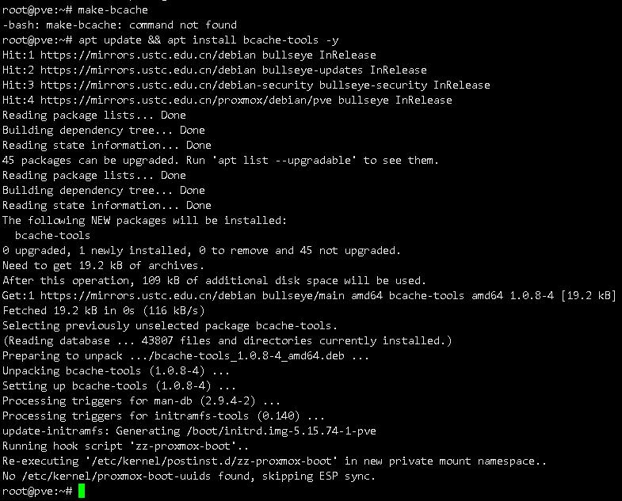
首先需要安装软件包bcache-tools，一般而言运行 `apt update && apt install bcache-tools -y` 就可以安装完成  
```log
root@pve:~# make-bcache
-bash: make-bcache: command not found
root@pve:~# apt update && apt install bcache-tools -y
Hit:1 https://mirrors.ustc.edu.cn/debian bullseye InRelease
Hit:2 https://mirrors.ustc.edu.cn/debian bullseye-updates InRelease
Hit:3 https://mirrors.ustc.edu.cn/debian-security bullseye-security InRelease
Hit:4 https://mirrors.ustc.edu.cn/proxmox/debian/pve bullseye InRelease
Reading package lists... Done
Building dependency tree... Done
Reading state information... Done
45 packages can be upgraded. Run 'apt list --upgradable' to see them.
Reading package lists... Done
Building dependency tree... Done
Reading state information... Done
The following NEW packages will be installed:
  bcache-tools
0 upgraded, 1 newly installed, 0 to remove and 45 not upgraded.
Need to get 19.2 kB of archives.
After this operation, 109 kB of additional disk space will be used.
Get:1 https://mirrors.ustc.edu.cn/debian bullseye/main amd64 bcache-tools amd64 1.0.8-4 [19.2 kB]
Fetched 19.2 kB in 0s (116 kB/s)        
Selecting previously unselected package bcache-tools.
(Reading database ... 43807 files and directories currently installed.)
Preparing to unpack .../bcache-tools_1.0.8-4_amd64.deb ...
Unpacking bcache-tools (1.0.8-4) ...
Setting up bcache-tools (1.0.8-4) ...
Processing triggers for man-db (2.9.4-2) ...
Processing triggers for initramfs-tools (0.140) ...
update-initramfs: Generating /boot/initrd.img-5.15.74-1-pve
Running hook script 'zz-proxmox-boot'..
Re-executing '/etc/kernel/postinst.d/zz-proxmox-boot' in new private mount namespace..
No /etc/kernel/proxmox-boot-uuids found, skipping ESP sync.

```

# 分区并创建cache
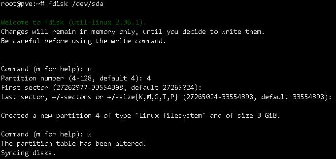  
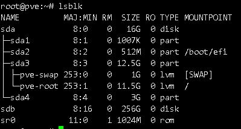  
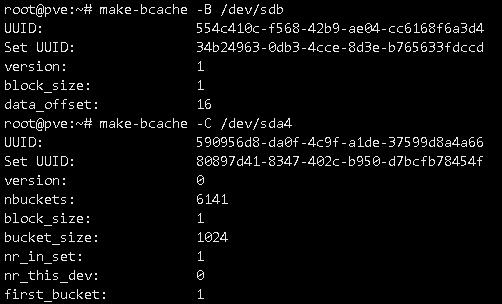  
此处使用fdisk吧sda剩余的空间进行分区  
```log
root@pve:~# fdisk /dev/sda

Welcome to fdisk (util-linux 2.36.1).
Changes will remain in memory only, until you decide to write them.
Be careful before using the write command.


Command (m for help): n
Partition number (4-128, default 4): 4
First sector (27262977-33554398, default 27265024): 
Last sector, +/-sectors or +/-size{K,M,G,T,P} (27265024-33554398, default 33554398): 

Created a new partition 4 of type 'Linux filesystem' and of size 3 GiB.

Command (m for help): w
The partition table has been altered.
Syncing disks.

```  

随后使用lsblk查看分区情况  
```log
root@pve:~# lsblk
NAME         MAJ:MIN RM  SIZE RO TYPE MOUNTPOINT
sda            8:0    0   16G  0 disk 
├─sda1         8:1    0 1007K  0 part 
├─sda2         8:2    0  512M  0 part /boot/efi
├─sda3         8:3    0 12.5G  0 part 
│ ├─pve-swap 253:0    0    1G  0 lvm  [SWAP]
│ └─pve-root 253:1    0 11.5G  0 lvm  /
└─sda4         8:4    0    3G  0 part 
sdb            8:16   0  256G  0 disk 
sr0           11:0    1 1024M  0 rom  

```

可见新分区sda4，此时创建缓存  
```log
root@pve:~# make-bcache -C /dev/sda4
UUID:			590956d8-da0f-4c9f-a1de-37599d8a4a66
Set UUID:		80897d41-8347-402c-b950-d7bcfb78454f
version:		0
nbuckets:		6141
block_size:		1
bucket_size:		1024
nr_in_set:		1
nr_this_dev:		0
first_bucket:

```

查看创建的缓存信息
```log
root@pve:~# bcache-super-show /dev/sda4
sb.magic		ok
sb.first_sector		8 [match]
sb.csum			2141F91CAE066BC4 [match]
sb.version		3 [cache device]

dev.label		(empty)
dev.uuid		590956d8-da0f-4c9f-a1de-37599d8a4a66
dev.sectors_per_block	1
dev.sectors_per_bucket	1024
dev.cache.first_sector	1024
dev.cache.cache_sectors	6287360
dev.cache.total_sectors	6288384
dev.cache.ordered	yes
dev.cache.discard	no
dev.cache.pos		0
dev.cache.replacement	0 [lru]

cset.uuid		80897d41-8347-402c-b950-d7bcfb78454f

```

# 创建backend
接着创建被加速的backend  
```log
root@pve:~# make-bcache -B /dev/sdb
UUID:			554c410c-f568-42b9-ae04-cc6168f6a3d4
Set UUID:		34b24963-0db3-4cce-8d3e-b765633fdccd
version:		1
block_size:		1
data_offset:		16

```

查看被加速的backend
```log
root@pve:~# bcache-super-show /dev/sdb
sb.magic		ok
sb.first_sector		8 [match]
sb.csum			9373030BA8EB9FBE [match]
sb.version		1 [backing device]

dev.label		(empty)
dev.uuid		554c410c-f568-42b9-ae04-cc6168f6a3d4
dev.sectors_per_block	1
dev.sectors_per_bucket	1024
dev.data.first_sector	16
dev.data.cache_mode	0 [writethrough]
dev.data.cache_state	0 [detached]

cset.uuid		34b24963-0db3-4cce-8d3e-b765633fdccd

```

# 往backend附加cache
此处附加的uuid，是在上面查询到的cache的uuid
```log
root@pve:~# echo 80897d41-8347-402c-b950-d7bcfb78454f > /sys/block/bcache0/bcache/attach

```

随后再次查看backend设备，可见已经有cache被附加
```log
root@pve:~# bcache-super-show /dev/sdb
sb.magic		ok
sb.first_sector		8 [match]
sb.csum			9CD3F5996941D630 [match]
sb.version		1 [backing device]

dev.label		(empty)
dev.uuid		554c410c-f568-42b9-ae04-cc6168f6a3d4
dev.sectors_per_block	1
dev.sectors_per_bucket	1024
dev.data.first_sector	16
dev.data.cache_mode	0 [writethrough]
dev.data.cache_state	1 [clean]

cset.uuid		80897d41-8347-402c-b950-d7bcfb78454f

```

# 分区并挂载使用
PVE的mkfs可以支持以下格式  
```log
root@pve:~# mkfs.
mkfs.bfs     mkfs.btrfs   mkfs.cramfs  mkfs.ext2    mkfs.ext3    mkfs.ext4    mkfs.fat     mkfs.minix   mkfs.msdos   mkfs.vfat    mkfs.xfs

```

这里我们选用通俗易懂的ext4，你喜欢的话也可以是btrfs之类的
```log
root@pve:~# mkfs.ext4 /dev/bcache0
mke2fs 1.46.5 (30-Dec-2021)
Discarding device blocks: done                            
Creating filesystem with 67108862 4k blocks and 16777216 inodes
Filesystem UUID: b590690a-9030-47ee-b11c-cd20fd88c956
Superblock backups stored on blocks: 
	32768, 98304, 163840, 229376, 294912, 819200, 884736, 1605632, 2654208, 
	4096000, 7962624, 11239424, 20480000, 23887872

Allocating group tables: done                            
Writing inode tables: done                            
Creating journal (262144 blocks): done
Writing superblocks and filesystem accounting information: done 

```

随后查看一下是否创建了

```log
root@pve:~# lsblk
NAME         MAJ:MIN RM  SIZE RO TYPE MOUNTPOINT
sda            8:0    0   16G  0 disk 
├─sda1         8:1    0 1007K  0 part 
├─sda2         8:2    0  512M  0 part /boot/efi
├─sda3         8:3    0 12.5G  0 part 
│ ├─pve-swap 253:0    0    1G  0 lvm  [SWAP]
│ └─pve-root 253:1    0 11.5G  0 lvm  /
└─sda4         8:4    0    3G  0 part 
  └─bcache0  252:0    0  256G  0 disk 
sdb            8:16   0  256G  0 disk 
└─bcache0    252:0    0  256G  0 disk 
sr0           11:0    1 1024M  0 rom  

```  
# 修改fstab挂载分区
首先创建一个目录用于后续挂载  
```log
root@pve:~# mkdir -p /mnt/disk1

```

随后，查看一下bcache0的uuid  
```log
root@pve:~# lsblk -lf
NAME     FSTYPE      FSVER    LABEL UUID                                   FSAVAIL FSUSE% MOUNTPOINT
sda                                                                                       
sda1                                                                                      
sda2     vfat        FAT32          1946-93A4                               510.7M     0% /boot/efi
sda3     LVM2_member LVM2 001       vyIvUH-oFVV-I5GX-7WSp-M3II-PXJ1-Ku19cF                
sda4     bcache                     590956d8-da0f-4c9f-a1de-37599d8a4a66                  
sdb      bcache                     554c410c-f568-42b9-ae04-cc6168f6a3d4                  
sr0                                                                                       
bcache0  ext4        1.0            b590690a-9030-47ee-b11c-cd20fd88c956                  
pve-swap swap        1              ab14f45e-12f6-49d2-be06-408a3d69d35f                  [SWAP]
pve-root ext4        1.0            c9f3a7d3-10c3-4705-b1a9-2e42cd01ac0e        8G    23% /

```

再对fstab进行修改
```log
root@pve:~# vim /etc/fstab

```
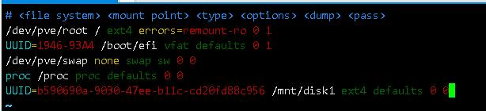
改完了保存重启，反正你都得改这里，手动mount不如直接冲，相信自己

重启完看看挂载情况

```log
root@pve:~# mount
sysfs on /sys type sysfs (rw,nosuid,nodev,noexec,relatime)
proc on /proc type proc (rw,relatime)
udev on /dev type devtmpfs (rw,nosuid,relatime,size=8140972k,nr_inodes=2035243,mode=755,inode64)
devpts on /dev/pts type devpts (rw,nosuid,noexec,relatime,gid=5,mode=620,ptmxmode=000)
tmpfs on /run type tmpfs (rw,nosuid,nodev,noexec,relatime,size=1634948k,mode=755,inode64)
/dev/mapper/pve-root on / type ext4 (rw,relatime,errors=remount-ro)
securityfs on /sys/kernel/security type securityfs (rw,nosuid,nodev,noexec,relatime)
tmpfs on /dev/shm type tmpfs (rw,nosuid,nodev,inode64)
tmpfs on /run/lock type tmpfs (rw,nosuid,nodev,noexec,relatime,size=5120k,inode64)
cgroup2 on /sys/fs/cgroup type cgroup2 (rw,nosuid,nodev,noexec,relatime)
pstore on /sys/fs/pstore type pstore (rw,nosuid,nodev,noexec,relatime)
efivarfs on /sys/firmware/efi/efivars type efivarfs (rw,nosuid,nodev,noexec,relatime)
bpf on /sys/fs/bpf type bpf (rw,nosuid,nodev,noexec,relatime,mode=700)
systemd-1 on /proc/sys/fs/binfmt_misc type autofs (rw,relatime,fd=30,pgrp=1,timeout=0,minproto=5,maxproto=5,direct,pipe_ino=15299)
hugetlbfs on /dev/hugepages type hugetlbfs (rw,relatime,pagesize=2M)
mqueue on /dev/mqueue type mqueue (rw,nosuid,nodev,noexec,relatime)
debugfs on /sys/kernel/debug type debugfs (rw,nosuid,nodev,noexec,relatime)
tracefs on /sys/kernel/tracing type tracefs (rw,nosuid,nodev,noexec,relatime)
sunrpc on /run/rpc_pipefs type rpc_pipefs (rw,relatime)
fusectl on /sys/fs/fuse/connections type fusectl (rw,nosuid,nodev,noexec,relatime)
configfs on /sys/kernel/config type configfs (rw,nosuid,nodev,noexec,relatime)
/dev/sda2 on /boot/efi type vfat (rw,relatime,fmask=0022,dmask=0022,codepage=437,iocharset=iso8859-1,shortname=mixed,errors=remount-ro)
/dev/bcache0 on /mnt/disk1 type ext4 (rw,relatime)
lxcfs on /var/lib/lxcfs type fuse.lxcfs (rw,nosuid,nodev,relatime,user_id=0,group_id=0,allow_other)
/dev/fuse on /etc/pve type fuse (rw,nosuid,nodev,relatime,user_id=0,group_id=0,default_permissions,allow_other)
tmpfs on /run/user/0 type tmpfs (rw,nosuid,nodev,relatime,size=1634944k,nr_inodes=408736,mode=700,inode64)

```

```log
root@pve:~# lsblk
NAME         MAJ:MIN RM  SIZE RO TYPE MOUNTPOINT
sda            8:0    0   16G  0 disk 
├─sda1         8:1    0 1007K  0 part 
├─sda2         8:2    0  512M  0 part /boot/efi
├─sda3         8:3    0 12.5G  0 part 
│ ├─pve-swap 253:0    0    1G  0 lvm  [SWAP]
│ └─pve-root 253:1    0 11.5G  0 lvm  /
└─sda4         8:4    0    3G  0 part 
  └─bcache0  252:0    0  256G  0 disk /mnt/disk1
sdb            8:16   0  256G  0 disk 
└─bcache0    252:0    0  256G  0 disk /mnt/disk1
sr0           11:0    1 1024M  0 rom

```
# 在PVE中添加存储目录
在数据中心的存储中，添加目录，把刚刚创建的挂载点，填进去就完事了  
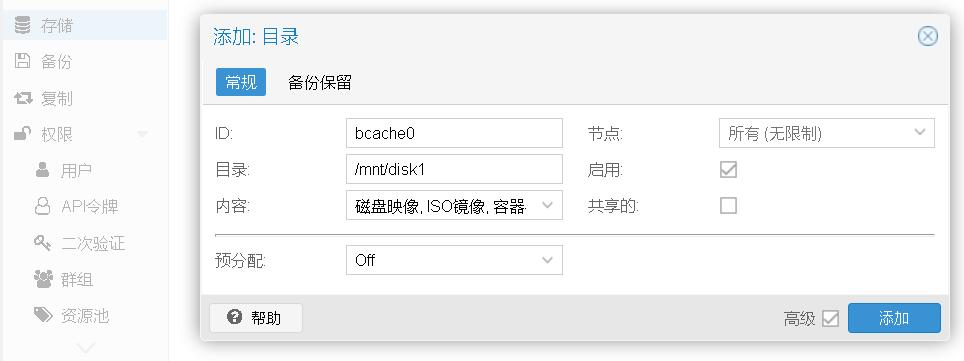  
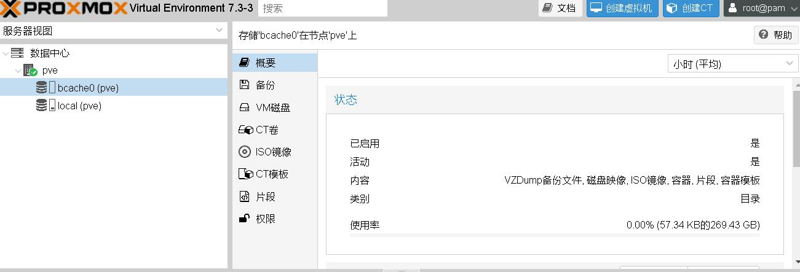  
# 修改缓存模式为writeback
此处不作详细介绍，可以参考文档  
```shell
echo writeback > /sys/block/bcache0/bcache/cache_mode
```
> -  Bad write performance
>
>If write performance is not what you expected, you probably wanted to be
running in writeback mode, which isn't the default (not due to a lack of
maturity, but simply because in writeback mode you'll lose data if something
happens to your SSD)::
>
>	#echo writeback > /sys/block/bcache0/bcache/cache_mode
>
当cache_mode是writeback时，此时缓存有dirty与clean两种状态，请不要在dirty状态下搞事情

# 调优sequential_cutoff
此处不作详细介绍，可以参考文档

sequential_cutoff

>- Bad performance, or traffic not going to the SSD that you'd expect
>
>By default, bcache doesn't cache everything. It tries to skip sequential IO -
because you really want to be caching the random IO, and if you copy a 10
gigabyte file you probably don't want that pushing 10 gigabytes of randomly
accessed data out of your cache.
>
>But if you want to benchmark reads from cache, and you start out with fio
writing an 8 gigabyte test file - so you want to disable that::
>
>#echo 0 > /sys/block/bcache0/bcache/sequential_cutoff
>
>To set it back to the default (4 mb), do::
>
>#echo 4M > /sys/block/bcache0/bcache/sequential_cutoff
>
# 简单性能测试
此处测试设备  
```log
ASUS B150 gaming
QQLT
DDR3 8GB x3
傲腾16G
HGST_HTS545050A7E380

```  
简单在的虚拟机中跑一下AS SSD，你以为我会在PVE里面直接跑吗，想不到吧  

别问我为什么数据这么诡异  
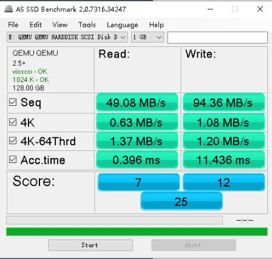  
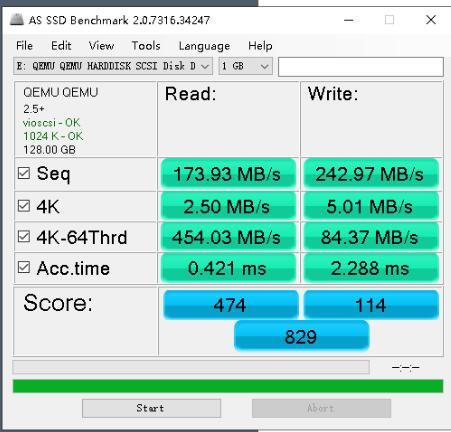  
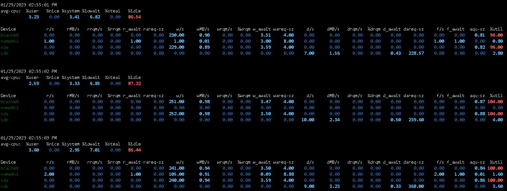  
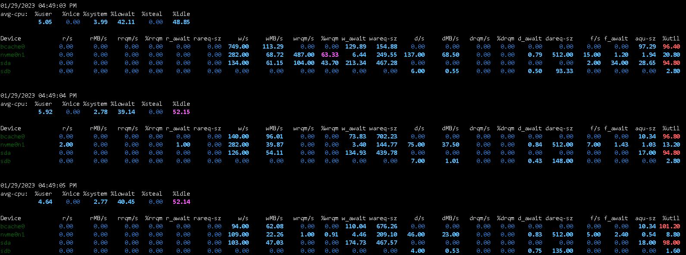  