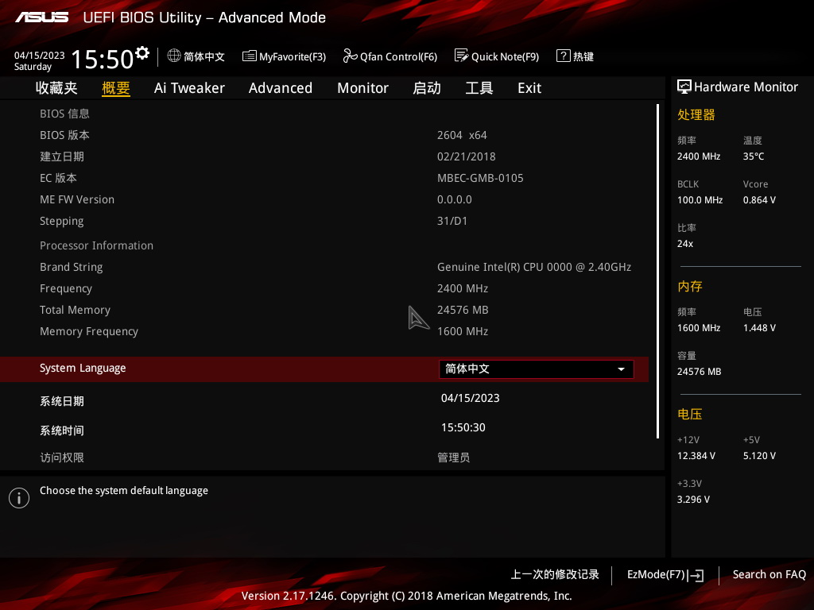
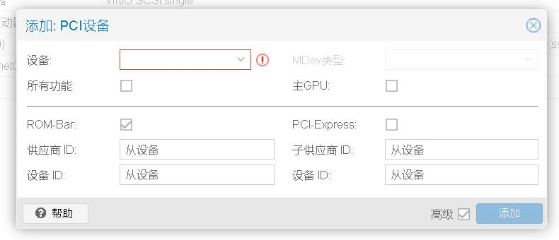
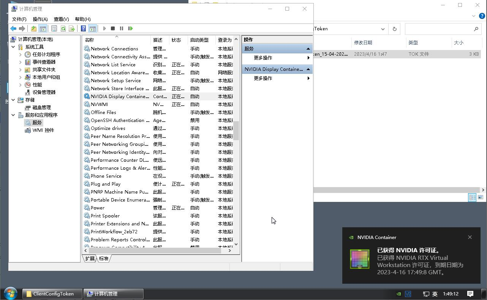

# 在Proxmox VE 7.4 中开启NVIDIA P106显卡虚拟化(vGPU)

# 前注
本文成文时，PVE版本为7.4  
虽然后面经过修修补补，新增了点内容  
但实际上新版本安装新的patch过的vgpu包可以略去很多步骤  
强烈建议仅将文本当做参考，不要生搬硬套  
有时间会根据新版本重写本文  
## 高版本(2024年7月后)可以略去的步骤  
这里说的日期，指的是粗略的日期  
可以理解为这个日期后的PVE版本与打包的patch驱动  
并不是在这个日期后装旧版本也可以略过下面的步骤  
### 内核cmdline
内核cmdline的修改可以省略，原因如下：  
在Proxmox8.2版本中，IOMMU会自动启用，但也有其他的情况。
>**Kernel: intel_iommu now defaults to on**
> 
>The intel_iommu parameter defaults to on in the kernel 6.8 series. Enabling IOMMU can cause problems with older hardware, or systems with not up to date BIOS, due to bugs in the BIOS.
>
### libvgpu_unlock_rs.so 的准备
该文件已被驱动内置替代
### host安装VGPU 一节的 创建相关配置
高版本无需手动创建

# 前言
本文使用硬件为Pascal架构的P106显卡，如您使用的显卡非本架构请自行变通

例如ampere架构的显卡需要自行开启VF，且每个VF仅能选择一个配置开启

文中提及的libvgpu_unlock_rs.so、NVIDIA-Linux-x86_64-525.85.07-vgpu-kvm-patched.run 、528.24_grid_win10_win11_server2019_server2022_dch_64bit_international.exe 均已上传至apaq镜像站中

宿主机驱动可见

https://mirrors.apqa.cn/vGPU/vgpu_unlock/drivers/NVIDIA-Linux-x86_64-525.85.07-vgpu-kvm-patched.run

libvgpu_unlock_rs.so可见，记得改名字

https://mirrors.apqa.cn/vGPU/vgpu_unlock/rust/libvgpu_unlock_rs_20230207_44d5bb3.so

以下本文使用的主要硬件及配置，如果您平台与本篇差距过大也请自行变通

主板：ASUS B150 PRO GAMING D3

CPU：Intel QQLT

内存：3条8G的DDR3绿条

存储：傲腾16G

所谓显卡：NVIDIA P106-090

网络存储：嗨群晖开启SMB及NFS

## 预编译/重打包文件
libvgpu_unlock_rs.so

该文件实际上并不需要每次装都编译一下，提前编译好就可以到处用

因为网络等原因，自己编译也挺困难的，直接用编译好的就行

NVIDIA-Linux-x86_64-525.85.07-vgpu-kvm-patched.run

该文件由官方驱动修改而来，也不需要每次都打一份，用改好的就行

## 关于PVE高版本版本
目前PVE8启用vGPU与PVE7并无区别，仅在添加设备处略有区别（详见下文"向虚拟机添加设备"）

PVE8宿主机驱动使用低版本vGPU宿主机驱动需要patch以支持高版本内核(会在文件名称显式2注明)

安装驱动时尽量选择注明版本与你内核版本相近的驱动

以如下Grid15.2为例，注意不要下错文件然后问为什么8版本的PVE用不了

NVIDIA-Linux-x86_64-525.105.14-vgpu-kvm-kernel-6.2.16-patched.run

纯vGPU宿主机驱动，适用于宿主机不需要跑涉N卡负载时使用

NVIDIA-Linux-x86_64-525.105.17-merged-vgpu-kvm-kernel-6.2.16-patched.run

杂种(merged)vGPU宿主机驱动，适用于宿主机在开vGPU时，仍然需要显示、视频转码、跑AI应用

宿主机的负载会占用显存，可能导致vGPU显存不足开不起来

具体案例请将查看疑难杂症一节

如果是17.0版本及以上，安装宿主机驱动请加上-m=kernel参数，详细情况可见“关于17.0版本以上”一节

# BIOS设置  

## 开启VT
如图所示，开启VT功能  
  
## 开启VT-d
如图所示，开启VT-d  
  
## 开启主要输出为核显
不开启核显可能导致P106插上去后，就黑屏了

后续有兴趣你也可以顺便玩玩Intel的GVT-G  
  
## 安全引导设置
关闭安全引导，或者是选择非Windows系统  
  
# 安装PVE
略，这个有啥好说的，非本文重点好吧

# 查看系统信息
## 查看内核cmdline
```shell
cat /proc/cmdline
```  
此步骤可以迅速排查引导参数导致翻车的问题

如图所示，参数未有所需的  
  
## 查看IOMMU状态
这一步不用命令行，直接在这个添加PCI设备看一眼就行

如图所示这种状态就是没开起来  
  
## 查看显卡情况
使用`lspci -v -d 10DE:` 即可，此步骤防止你以为卡插好了实际上并没有的情况

如图所示，这是一张P106-090  
  
# 修改相关配置及参数
## /etc/modules
```shell
echo -e "vfio\nvfio_iommu_type1\nvfio_pci\nvfio_virqfd" >> /etc/modules
```  

## /etc/modprobe.d/pve-blacklist.conf
```shell
echo "blacklist nouveau" >> /etc/modprobe.d/pve-blacklist.conf
```  

## 内核cmdline
此处需要注意不同启动方式需要修改的文件不同

本例为/etc/default/grub

添加intel_iommu=on iommu=pt spectre_v2=off到如图所示位置，spectre_v2参数非必须相关参数  
  

> 有AMD用户反馈，参数需使用quiet amd_iommu=on iommu=pt pcie_acs_override=downstream
> 
> 并刷新grub及引导后重启才可以安装host驱动。
>
# 安装依赖及软件包
## 更换软件源
如下4行，执行便可  
```shell
sed -i 's|^deb http://ftp.debian.org|deb https://mirrors.ustc.edu.cn|g' /etc/apt/sources.list
sed -i 's|^deb http://security.debian.org|deb https://mirrors.ustc.edu.cn/debian-security|g' /etc/apt/sources.list
source /etc/os-release
echo "deb https://mirrors.ustc.edu.cn/proxmox/debian/pve $VERSION_CODENAME pve-no-subscription" > /etc/apt/sources.list.d/pve-no-subscription.list

```  
## 安装包
一句`apt update` 即可  
  
```log
root@pve:~# apt install -y build-essential dkms pve-headers-$(uname -r) mdevctl
Reading package lists... Done
Building dependency tree... Done
Reading state information... Done
The following additional packages will be installed:
  cpp cpp-10 dctrl-tools dpkg-dev fakeroot g++ g++-10 gcc gcc-10 jq libalgorithm-diff-perl libalgorithm-diff-xs-perl
  libalgorithm-merge-perl libasan6 libatomic1 libc-dev-bin libc-devtools libc6-dev libcc1-0 libcrypt-dev libdeflate0
  libdpkg-perl libfakeroot libfile-fcntllock-perl libgcc-10-dev libgd3 libgomp1 libisl23 libitm1 libjbig0 libjq1 liblsan0
  libmpc3 libmpfr6 libnsl-dev libonig5 libquadmath0 libstdc++-10-dev libtiff5 libtirpc-dev libtsan0 libubsan1 libwebp6 libxpm4
  linux-compiler-gcc-10-x86 linux-headers-5.10.0-21-amd64 linux-headers-5.10.0-21-common linux-headers-amd64 linux-kbuild-5.10
  linux-libc-dev lsb-release make manpages-dev patch pve-headers-5.15 pve-headers-5.15.102-1-pve sudo
Suggested packages:
  cpp-doc gcc-10-locales debtags menu debian-keyring g++-multilib g++-10-multilib gcc-10-doc gcc-multilib autoconf automake
  libtool flex bison gdb gcc-doc gcc-10-multilib glibc-doc git bzr libgd-tools libstdc++-10-doc make-doc ed diffutils-doc
The following NEW packages will be installed:
  build-essential cpp cpp-10 dctrl-tools dkms dpkg-dev fakeroot g++ g++-10 gcc gcc-10 jq libalgorithm-diff-perl
  libalgorithm-diff-xs-perl libalgorithm-merge-perl libasan6 libatomic1 libc-dev-bin libc-devtools libc6-dev libcc1-0
  libcrypt-dev libdeflate0 libdpkg-perl libfakeroot libfile-fcntllock-perl libgcc-10-dev libgd3 libgomp1 libisl23 libitm1
  libjbig0 libjq1 liblsan0 libmpc3 libmpfr6 libnsl-dev libonig5 libquadmath0 libstdc++-10-dev libtiff5 libtirpc-dev libtsan0
  libubsan1 libwebp6 libxpm4 linux-compiler-gcc-10-x86 linux-headers-5.10.0-21-amd64 linux-headers-5.10.0-21-common
  linux-headers-amd64 linux-kbuild-5.10 linux-libc-dev lsb-release make manpages-dev mdevctl patch pve-headers
  pve-headers-5.15 pve-headers-5.15.102-1-pve sudo
0 upgraded, 61 newly installed, 0 to remove and 18 not upgraded.

```  
## 刷新grub及引导
分别运行`update-grub`及`update-initramfs -u -k all` 即可，随后使用reboot重启  
```log
root@pve:~# update-grub
Generating grub configuration file ...
Found linux image: /boot/vmlinuz-5.15.102-1-pve
Found initrd image: /boot/initrd.img-5.15.102-1-pve
Found memtest86+ image: /boot/memtest86+.bin
Found memtest86+ multiboot image: /boot/memtest86+_multiboot.bin
Warning: os-prober will not be executed to detect other bootable partitions.
Systems on them will not be added to the GRUB boot configuration.
Check GRUB_DISABLE_OS_PROBER documentation entry.
Adding boot menu entry for UEFI Firmware Settings ...
done
root@pve:~# update-initramfs -u -k all
update-initramfs: Generating /boot/initrd.img-5.15.102-1-pve
Running hook script 'zz-proxmox-boot'..
Re-executing '/etc/kernel/postinst.d/zz-proxmox-boot' in new private mount namespace..
No /etc/kernel/proxmox-boot-uuids found, skipping ESP sync.
root@pve:~# reboot

```  
## 重启后检查
如下所示，cmdline应有刚才添加的内容，添加PCI设备也消去了警告  
```log
root@pve:~# cat /proc/cmdline 
BOOT_IMAGE=/boot/vmlinuz-5.15.102-1-pve root=UUID=61e72f0f-a4f7-4455-9959-aebf71e6af5e ro quiet intel_iommu=on iommu=pt spectre_v2=off

```  
  

# host安装VGPU
## 创建相关配置
以下命令执行#号左边的就行比如说第一行就是`mkdir /etc/vgpu_unlock`  
```log
root@pve:# mkdir /etc/vgpu_unlock
root@pve:# touch /etc/vgpu_unlock/profile_override.toml
root@pve:# mkdir /etc/systemd/system/{nvidia-vgpud.service.d,nvidia-vgpu-mgr.service.d}
root@pve:# echo -e "[Service]\nEnvironment=LD_PRELOAD=/opt/vgpu_unlock-rs/target/release/libvgpu_unlock_rs.so" > /etc/systemd/system/nvidia-vgpud.service.d/vgpu_unlock.conf
root@pve:# echo -e "[Service]\nEnvironment=LD_PRELOAD=/opt/vgpu_unlock-rs/target/release/libvgpu_unlock_rs.so" > /etc/systemd/system/nvidia-vgpu-mgr.service.d/vgpu_unlock.conf
root@pve:# cat /etc/systemd/system/{nvidia-vgpud.service.d,nvidia-vgpu-mgr.service.d}/*
[Service]
Environment=LD_PRELOAD=/opt/vgpu_unlock-rs/target/release/libvgpu_unlock_rs.so
[Service]
Environment=LD_PRELOAD=/opt/vgpu_unlock-rs/target/release/libvgpu_unlock_rs.so

```  
## 上传必须文件
上传前需要通过  
```shell
mkdir -p /opt/vgpu_unlock-rs/target/release

```
创建对应文件夹  
随后通过ssh或者是其他方式上传`libvgpu_unlock_rs.so`及`NVIDIA-Linux-x86_64-525.85.07-vgpu-kvm-patched.run`  
  
上传完了记得用chmod给run文件加可执行权限  

```log
root@pve:~# mkdir -p /opt/vgpu_unlock-rs/target/release
root@pve:~# cd /opt/vgpu_unlock-rs/target/release
root@pve:/opt/vgpu_unlock-rs/target/release# ls -l
total 96240
-rw-r--r-- 1 root root  4756296 Apr 16 01:29 libvgpu_unlock_rs.so
-rw-r--r-- 1 root root 93787315 Apr 16 01:29 NVIDIA-Linux-x86_64-525.85.07-vgpu-kvm-patched.run
root@pve:/opt/vgpu_unlock-rs/target/release# chmod +x NVIDIA-Linux-x86_64-525.85.07-vgpu-kvm-patched.run 
root@pve:/opt/vgpu_unlock-rs/target/release# ls -l
total 96240
-rw-r--r-- 1 root root  4756296 Apr 16 01:29 libvgpu_unlock_rs.so
-rwxr-xr-x 1 root root 93787315 Apr 16 01:29 NVIDIA-Linux-x86_64-525.85.07-vgpu-kvm-patched.run

```
## 安装host驱动
一句./NVIDIA-Linux-x86_64-525.85.07-vgpu-kvm-patched.run 就跑起来了  
  
  
  
## 检查安装情况
保险起见可以先使用以下命令启动相关服务
```shell
systemctl restart {nvidia-vgpud.service,nvidia-vgpu-mgr.service} 
```  

随后使用nvidia-smi以及mdevctl types查看  
  
  
# guest安装VGPU
## 向虚拟机添加设备
首先给你要跑gpu的虚拟机添加设备  
  
<details>
<summary>
如果是高版本的PVE8，界面就是这样的  
</summary>
本图硬件为40HX不是上文的P106，仅做参考  
  

</details>  

记得虚拟机改成q35，CPU不会选的话直接host，nvidia启动对CPU是有要求的  
  

## 虚拟机安装guest驱动
想个办法，无论是走smb也好，nfs也好，还是浏览器也好，把对应版本的GRID驱动丢进去安装

注意，如果版本高于宿主机驱动，或者是低于宿主机驱动版本，均有可能出现包括但不限于装不上、感叹号等异常

如下，Windows虚拟机安装驱动528.24_grid_win10_win11_server2019_server2022_dch_64bit_international.exe完成  
  
  
  

可以去PVE看看  
  
## 启用授权
此过程略过，如需了解请看另外一篇文章，那篇有介绍

[来自民间的VGPU授权fastapi-dls](../../../2022/12/291214_vGPU_fastapi-dls/index.md)

授权文件丢进文件夹后，重启如图所示的服务  
  
# 疑难杂症
## vGPU运行的程序fps过低  
因为vGPU配置有帧数限制，如下为官方文档的说明及解除fps步骤  

https://docs.nvidia.com/grid/15.0/grid-vgpu-release-notes-generic-linux-kvm/index.html#lower-vgpu-benchmarks

如果想通过覆盖配置可以修改`/etc/vgpu_unlock/profile_override.toml`   
如vGPU配置为260则要  
```toml
[profile.nvidia-260]
frl_enabled = 0
```
## TDR或OpenGL性能异常
### 快速缓解方法
非quadro卡可能触发TDR问题可修改`/etc/vgpu_unlock/profile_override.toml` 缓解  
以260配置为例  
```toml
[profile.nvidia-260]
vgpu_type = "NVS"
```  
此时vGPU可以正常跑完OpenGL任务，但性能会按NVS卡进行负优化  
如果不需要使用到专业卡级别的OpenGL性能，推荐使用这个方法

这两种方法的跑分截图如下，对其他子项感兴趣可以自己在这个压缩包捞  
https://foxi.buduanwang.vip/pan/vGPU/15.2/SPECviewperf13_%E8%B7%91%E5%88%86%E7%BB%93%E6%9E%9C_patch_different.7z

  
  

### 具体的解决办法
需要patch一下guest驱动

以15.2版本为例patch过的Windows驱动在https://foxi.buduanwang.vip/pan/vGPU/15.2/  
这个目录下的[NVIDIA-Windows-x86_64-528.89-patched.7z](https://foxi.buduanwang.vip/pan/vGPU/15.2/NVIDIA-Windows-x86_64-528.89-patched.7z)

你需要先解压原始版本的驱动，再把这个压缩包的文件覆盖到对应目录的文件，关闭Windows安全启动证书验证一大堆玩意  
再安装这个patch过的驱动，此时OpenGL的相关性能就能解除负优化恢复正常  
甚至比你没vGPU裸机跑SPECviewperf的分数还高

这个方法推荐给那些需要使用专业卡OpenGL性能的用户使用
  
  

## OpenGL设备异常
这个问题的症状表现就是跑啥OpenGL的应用都表现为不支持，打开GPUZ显示的OpenGL版本低于2.0

通常在Windows下使用多个虚拟显示器时会出现这个问题，解决方案有二

### 1、开启ramfb，直接用vgx
如图所示，OpenGL版本已经正常显示为4.6  
  
### 2、禁用PVE自带的显示，自行在系统中安装vnc_server、parsec等其他远程工具（会导致自带novnc无画面）
### 3、修改Windows注册表
## 40HX的bar1错误
因为40HX设备的bar1被阉割，因此需要覆盖配置，以260配置为例  
```toml
[profile.nvidia-260]
bar1_length = 0x40
```  
## NVENC未能工作
nvenc未能工作有多种原因，以下为已知原因
### 显存过小
如下文所示，当显存大小不正确时，nvenc会被禁用  
https://docs.nvidia.com/grid/15.0/grid-vgpu-release-notes-generic-linux-kvm/index.html#nvenc-needs-at-least-1-gb-of-framebuffer

### 物理设备缺陷
部分NVIDIA显卡先天编解码功能故障  
可以塞进Windows机器里面看看能不能用先  

## 关于vGPU的类型
https://docs.nvidia.com/grid/15.0/grid-vgpu-user-guide/index.html#virtual-gpu-types-grid

简单来说，有Q、C、B、A几种类型，NVIDIA的文档有大致的描述，后续有必要的话可以再详细描述一下

这里描述一下官方文档没有但很重要的内容

其中Q这个类型，如果使用游戏卡与NVS系列  
不仅要patch host驱动，还要patch guest才能正常使用OpenGL相关功能  
不然就会出现上面说的"TDR或OpenGL性能异常"  

但cudaEnabled这个feature大多数情况仅在Q类型配置中启用，详细的feature启用情况可见vgpuConfig.xml

C类型这个冷门玩意在官方版本中，已于16.0删除，但patch过的host驱动已经恢复了该类型

## Maxwell大显存卡无法充分利用显存
在官方版本中，M60等卡单核心最大显存为8G，而在默认的libvgpu_unlock_rs.so中  
<details>
<summary>
代码
</summary>

```rust
            let (spoofed_devid, spoofed_subsysid) = match actual_device_id {
                // Maxwell
                0x1340..=0x13bd | 0x174d..=0x179c => {
                    // Tesla M10
                    (0x13bd, 0x1160)
                }
                // Maxwell 2.0
                0x13c0..=0x1436 | 0x1617..=0x1667 | 0x17c2..=0x17fd => {
                    // Tesla M60
                    (0x13f2, actual_sub_system_id)
                }
                // Pascal
                0x15f0 | 0x15f1 | 0x1b00..=0x1d56 | 0x1725..=0x172f => {
                    // Tesla P40
                    (0x1b38, actual_sub_system_id)
                }
                // GV100 Volta
                //
                // 0x1d81 = TITAN V
                // 0x1dba = Quadro GV100 32GB
                0x1d81 | 0x1dba => {
                    // Tesla V100 32GB PCIE
                    (0x1db6, actual_sub_system_id)
                }
                // Turing
                0x1e02..=0x1ff9 | 0x2182..=0x21d1 => {
                    // Quadro RTX 6000
                    (0x1e30, 0x12ba)
                }
                // Ampere
                0x2200..=0x2600 => {
                    // RTX A6000
                    (0x2230, actual_sub_system_id)
                }
                _ => (actual_device_id, actual_sub_system_id),
            };
```
</details>
会使用M10与M60的配置，因此即便你是M40这种24G大卡，也不能使用超过8G显存开vGPU，开8G显存也只能开一个

重编译这个库使用其他大显存卡配置可缓解该问题，以下修改版本可以强制使用RTX6000的配置  
https://foxi.buduanwang.vip/pan/vGPU/vgpu_unlock/rust/libvgpu_unlock_rs_rtx6000.so  

  

如上图所示，在M40这个24G的卡上，顺利的使用了超过8G的显存

## 关于17.0版本以上
注意，17.0版本以上Pascal及Maxwell的多数卡已经废弃支持

以下设备也需要使用修改过的宿主机驱动才能启用vGPU
> https://docs.nvidia.com/grid/17.0/whats-new-vgpu/index.html
> 
> Feature Support Withdrawn in Release 17.0
> 
> Hypervisor software features no longer supported:
> - VMware vSGA
> Graphics cards no longer supported:
> - Tesla M6
> - Tesla M60
> - Tesla P4
> - Tesla P6
> - Tesla P40
> - Tesla P100 PCIe 12 GB
> - Tesla P100 PCIe 16 GB
> - Tesla P100 SXM2 16 GB
>
17.0版本以上由于存在两种模式，因此在安装宿主机驱动的时候需要指定`-m=kernel`参数  
```shell
./NVIDIA-Linux-x86_64-550.54.10-vgpu-kvm-custom.run -m=kernel
```
否则将会默认使用kernel-open加载GSP运行，导致无法在非支持设备启用vGPU

## 什么版本的PVE能用？
PVE能不能开vGPU，主要看内核是什么版本，以下是验证过的版本

以下是验证过的内核版本

### 6.2.9
  
### 6.2.11

### 6.2.16
  
### 6.5.11

### 6.8 
可以参考另外一篇文章，或者是直接用最新的包  
[修复NVIDA vGPU 17.0(即550.54.10)在6.8内核(PVE8.2)的问题](../../../2024/04/300745_fix_vgpu_grid17-0_in_kernel_6-8/index.md)  
## 注意：ampere及以上架构目前不支持解锁vGPU  
  
如图所示，30系开始就不支持vGPU了（确信）

# 后记
本文成篇于深夜，行为仍需调整，欢迎各位指正优化

好困，顶不住了，后面再改改优化优化