# 使用BepInEx修改unity3d游戏(1)——以SaintGearForce为例初识BepInEx
本系列为BepInEx修改unity3d游戏分享文章，跟PVE基本上没什么关系

# 前言说明
本篇除判断游戏类型一节中其余内容演示均围绕

[RJ01002988]セイントギアフォース(中文名：圣齿轮部队)(英文名：SaintGearForce)

本文建立在您已经分析清楚该游戏的修改位置的情况下，侧重点是BepInEx的使用

如果着重于分析游戏那这一系列文章可能就变成《如何修改SaintGearForce》了

当前互联网中修改unity游戏很多都是直接修改Assembly-CSharp.dll或者是GameAssembly.dll

在游戏更新后重复工作量较大，如果使用BepInEx可以显著降低工作量  
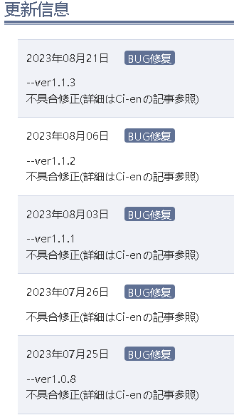  
接下来将会以几个常见的修改方式，作为第一篇的演示例子，完整代码位于文章末尾

# 判断游戏类型
## 判断游戏架构
这个没什么好说的，拿工具扫一下就知道了
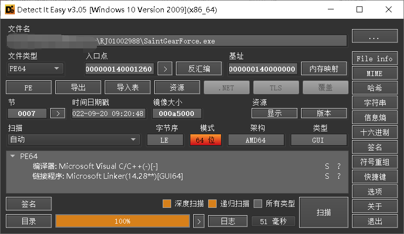  
如图所示，很清楚的写明了是amd64

## 判断runtime
首先你要知道，你要动手的游戏究竟是什么runtime

目前unity主要有il2cpp及mono两种，其他wasm之类的用的比较少的不在BepInEx中介绍与演示  
 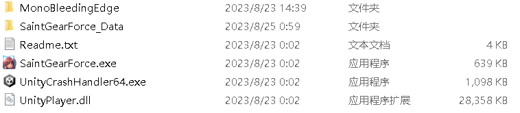  
如图所示，以上图片有带有MonoBleedingEdge可以判断为mono运行时  
而带有GameAssembly.dll的是il2cpp运行时  

这个方法能大致判断目标应用的runtime，部分应用可能会隐藏相关特征

本篇我们以游戏SaintGearForce为例

除了`MonoBleedingEdge` 我们发现`SaintGearForce_Data\Managed\Assembly-CSharp.dll`因此这个想必就是mono

## 判断unity版本
其实这个很好判断的，用文本编辑器打开游戏Data目录下的globalgamemanagers  
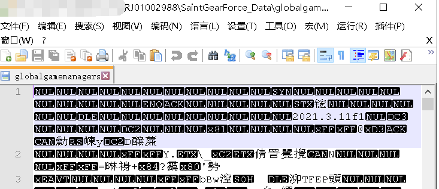  
可以很清晰的看见版本2021.3.11

# 安装BepInEx
首先我们去github下载压缩包  
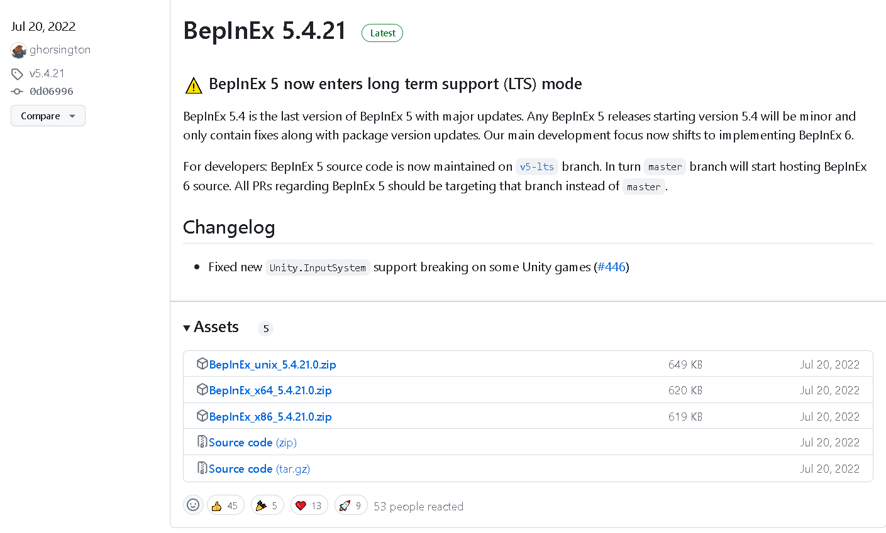  
如图所示，有几个不同的zip，我们本次练习的目标是amd64的，因此选择[BepInEx_x64_5.4.21.0.zip](https://github.com/BepInEx/BepInEx/releases/download/v5.4.21/BepInEx_x64_5.4.21.0.zip)下载

下载完成后解压里面的文件到游戏目录  
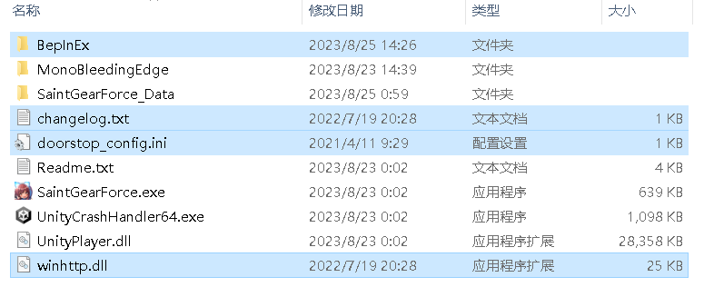  
然后，打开游戏后直接关闭游戏，让BepInEx自行生成相关文件

随后编辑BepInEx的配置，开启调试日志窗口  
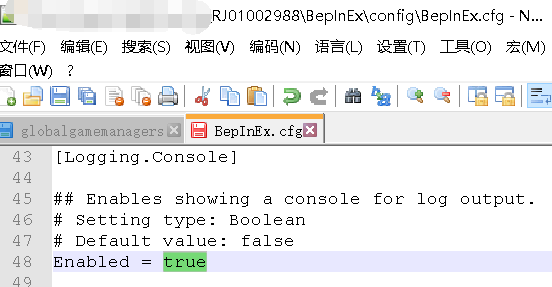  
保存配置后，再次打开游戏就可以见到日志窗口了  
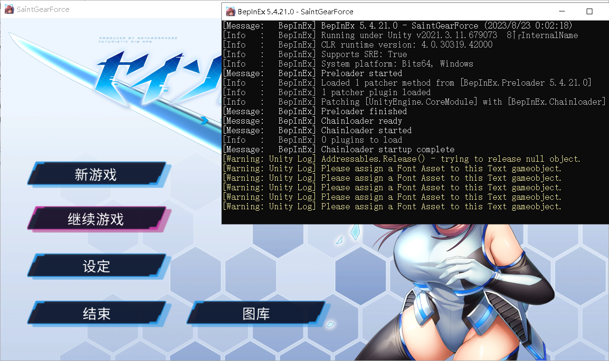  
# 编写Plugin
## 创建plugin
首先我们要加载模板
```shell
dotnet new -i BepInEx.Templates --nuget-source https://nuget.bepinex.dev/v3/index.json

```  
然后使用模板创建插件，注意这里使用的是bepinex5，因为游戏不是il2cpp没必要冲pre-release

```shell
dotnet new bepinex5plugin -n SaintGearForcePlugin -T net472 -U 2021.3.11

```  
之类的-T是插件将要使用的目标运行时，-U是游戏的unity版本

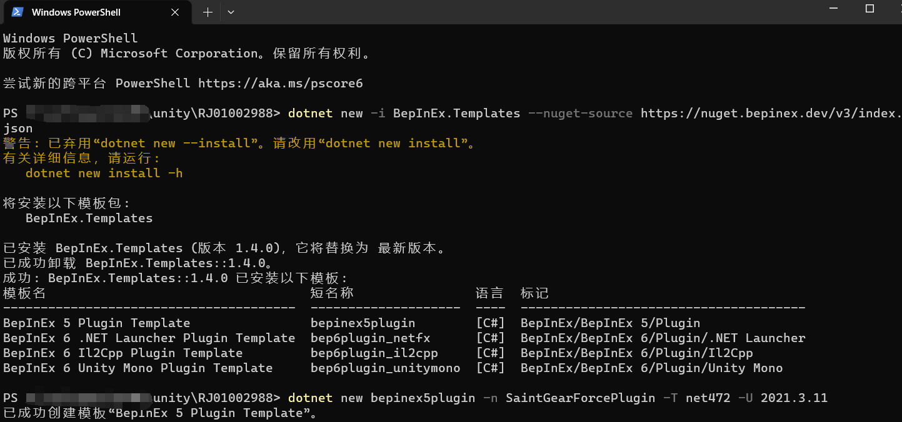  
创建完后我们cd至创建的插件目录下，把使用如下命令把Harmony安装上

```shell
dotnet add package HarmonyX --version 2.10.1

```
## 添加游戏本体至依赖
如图所示，复制游戏中的Assembly-CSharp.dll至插件目录下，并添加至依赖  
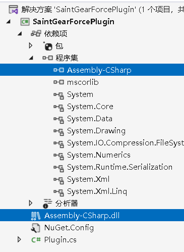  
这个步骤我觉得应该不用细说吧，就复制个文件然后添加依赖

## 编译测试
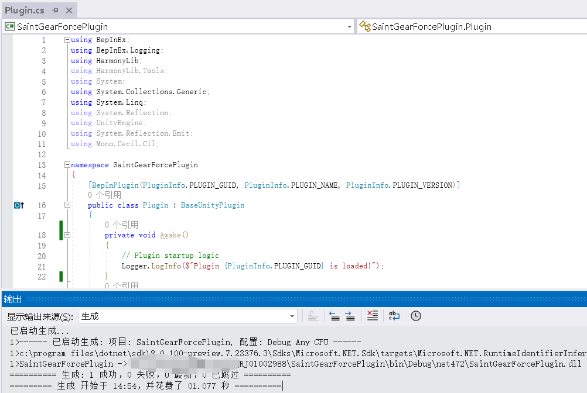  
正常编译插件即可，图中的代码是模板生成的，自带一个日志，可以很方便的让我们看出插件加载没加载。  
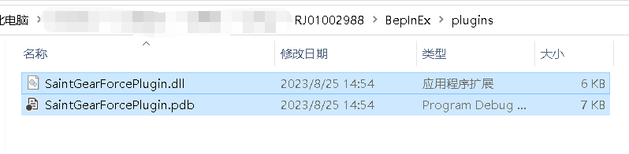  
把构建的插件，放到BepInEx\plugins目录下启动游戏  
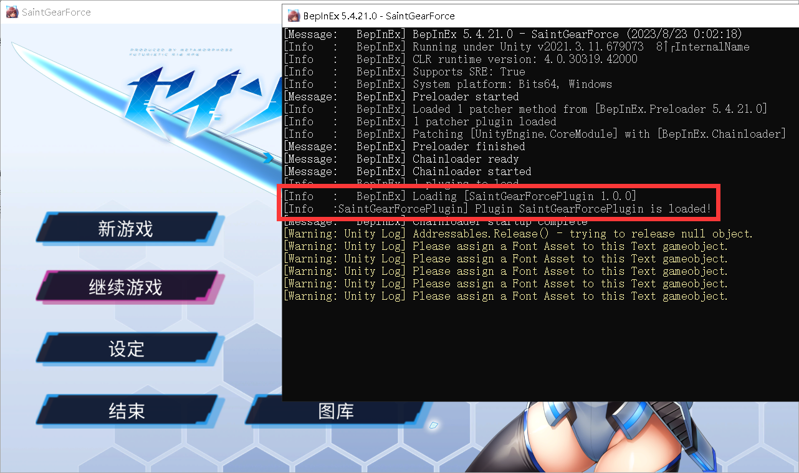  
可以看见，插件被加载成功，说明我们的环境并没有什么问题。

## 日志
这里不得不说一句，日志是一个很重要的东西，它关系着你能不能舒适的编写插件。

此处我们演示新增日志tag及开启HarmonyFileLog  
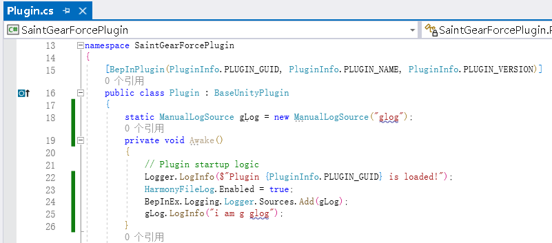  
如图所示，我们新增并添加了一个叫glog的ManualLogSource，以及设置了HarmonyFileLog.Enabled

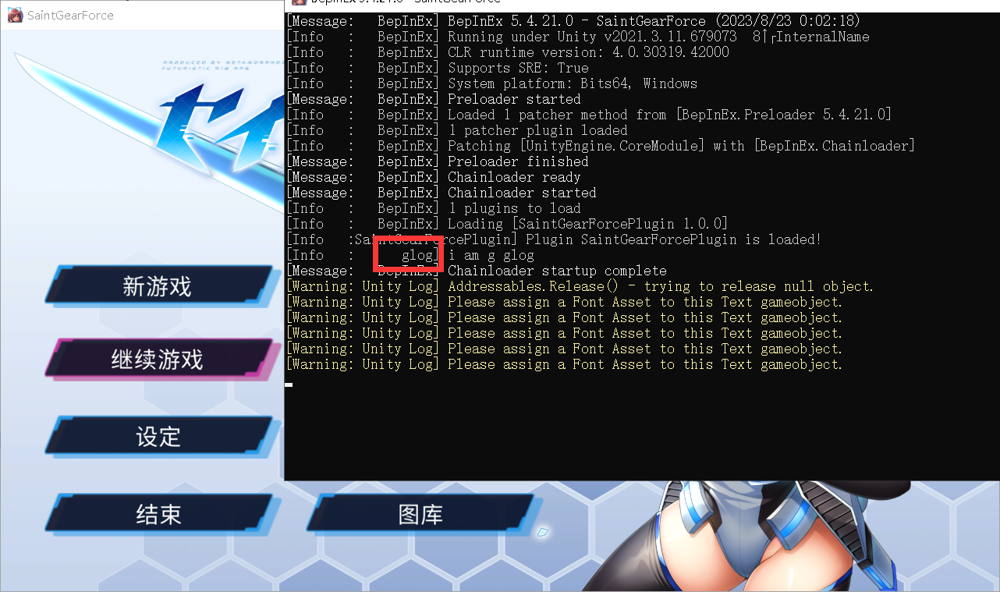  
在使用自行添加的gLog后，日志窗口成功的输出了glog标签的日志

# Harmony
为什么这一节叫Harmony，因为这一节已经是Harmony的部分了。

## CreateAndPatchAll
Harmony支持多种创建patch的方法，这里图省事，先演示CreateAndPatchAll  
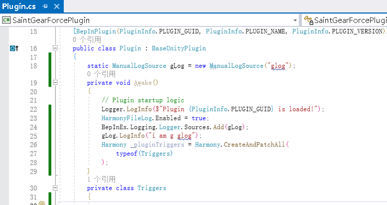  
创建一个class，然后使用Harmony.CreateAndPatchAll，该class就会被应用了

## HarmonyPrefix
这个跟Xposed的beforeHookedMethod很相似，也基本上就是这样用的。

它的作用就是在方法执行前进行一些操作，包括但不限于修改入参。

本次以修改该游戏的SP及EP为例进行演示  
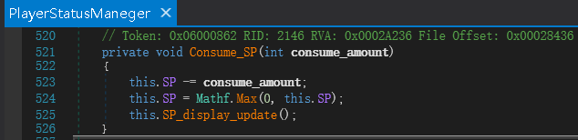 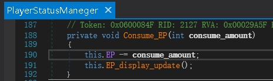  
从上图我们可以看出，消费SP及EP的method有一个叫consume_amount类型为int的入参

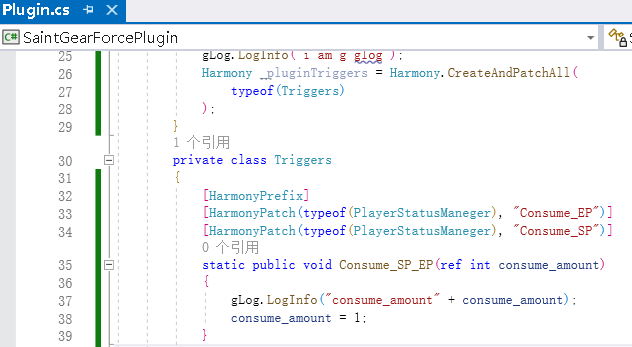  
那么我们使用如上代码，将入参打印并设置为1

编译插件后，进入游戏进行测试  
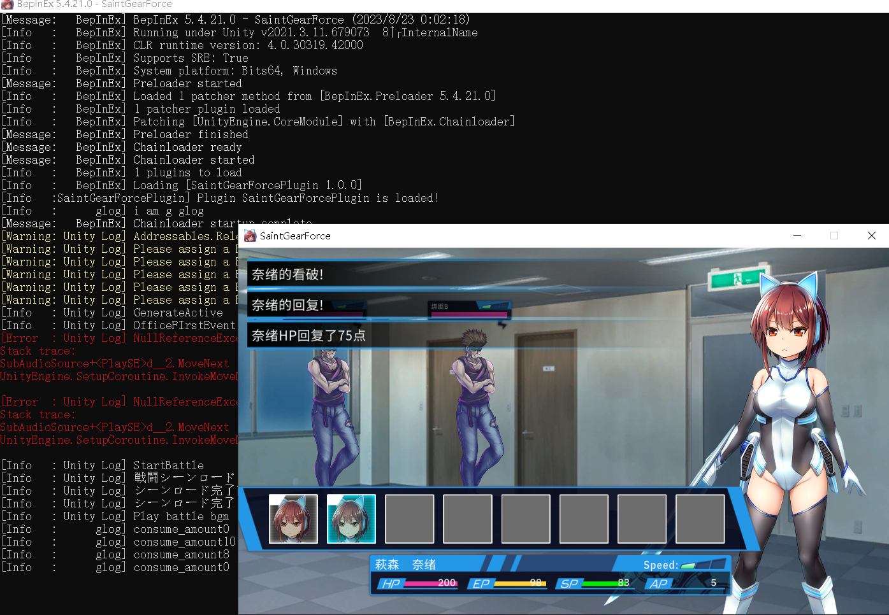  
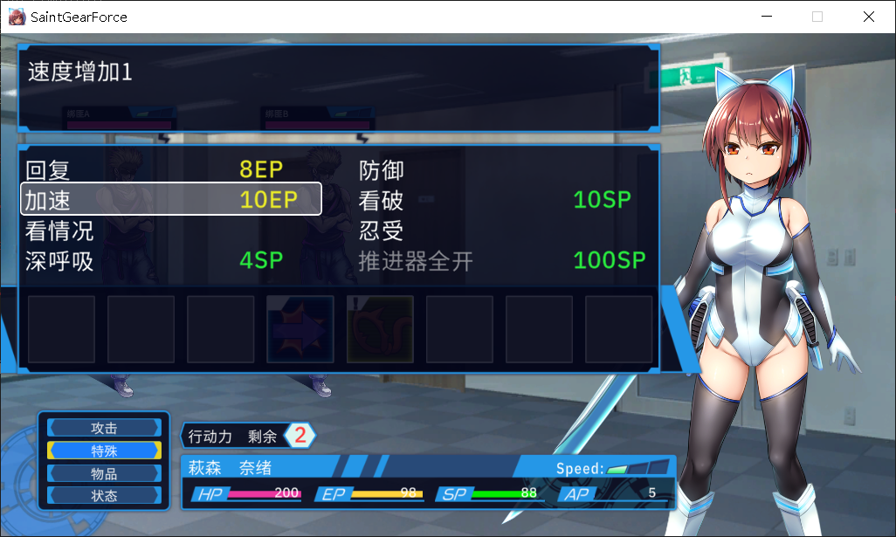  
如图所示，使用SP及EP的技能均只花费了1点

## HarmonyPostfix
这个跟Xposed的afterHookedMethod很相似，都是在method执行完后进行某些操作，包括但不限于修改返回值。

  
本次以修改游戏加点需要的点数为例。  
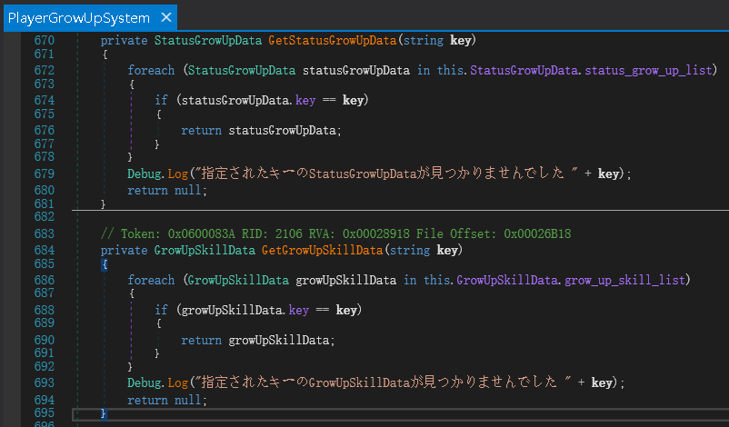  
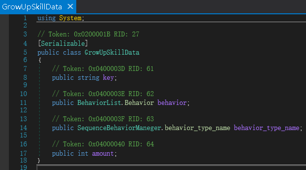  
如图所示，这里我们希望修改statusGrowUpData.consume_sp及growUpSkillData.amount  
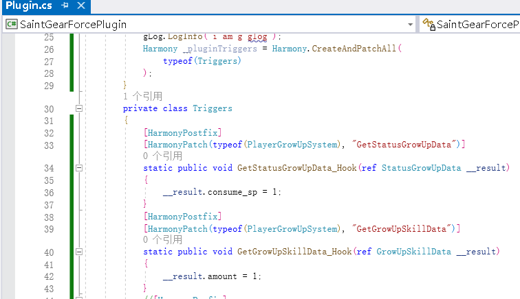  
此处的__result是该框架的一个关键字，在执行完方法后，演示代码会把consume_sp以及amount修改为1  
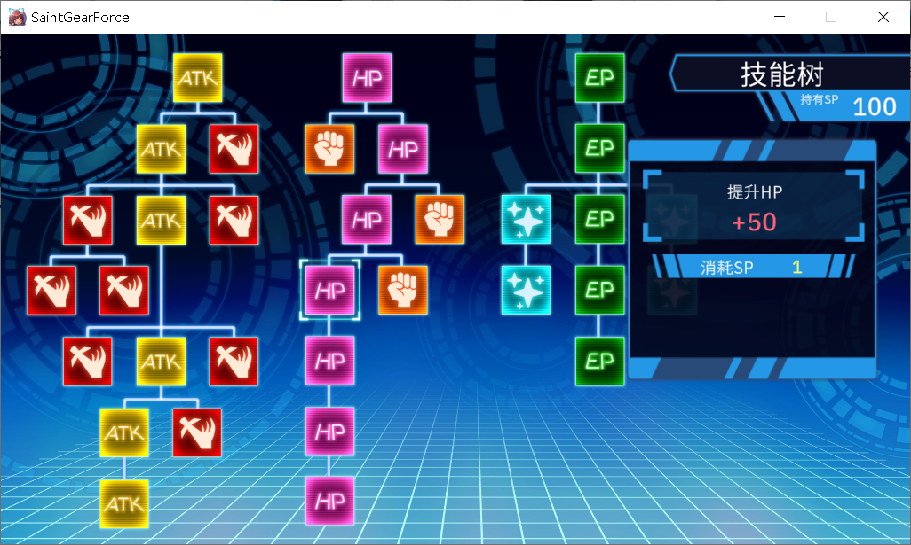  
## HarmonyTranspiler
这玩意不推荐使用。通用性极差，但某些场景下不得不使用它。

这里我们虚构一个场景，就是战斗时HP血量为0时不触发败北逻辑。

先上一段战斗伤害的逻辑。  
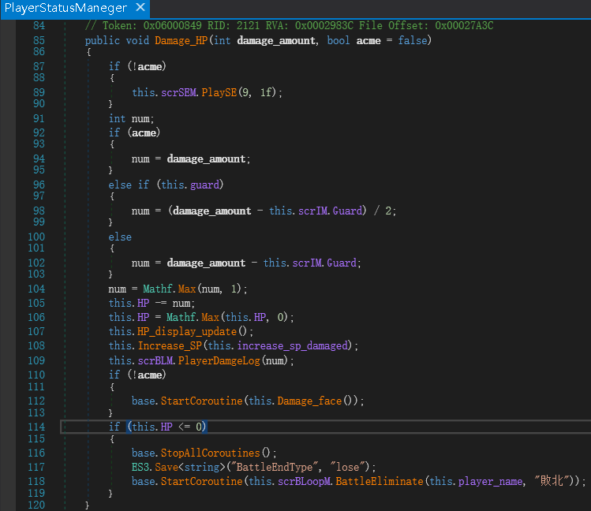  
让图所示，当HP小于等于0时，败北逻辑触发

虽然我们可以直接把damage_amount直接归0免伤立于不败之地  
但为了演示HarmonyTranspiler我们通过消除败北逻辑实现不败  

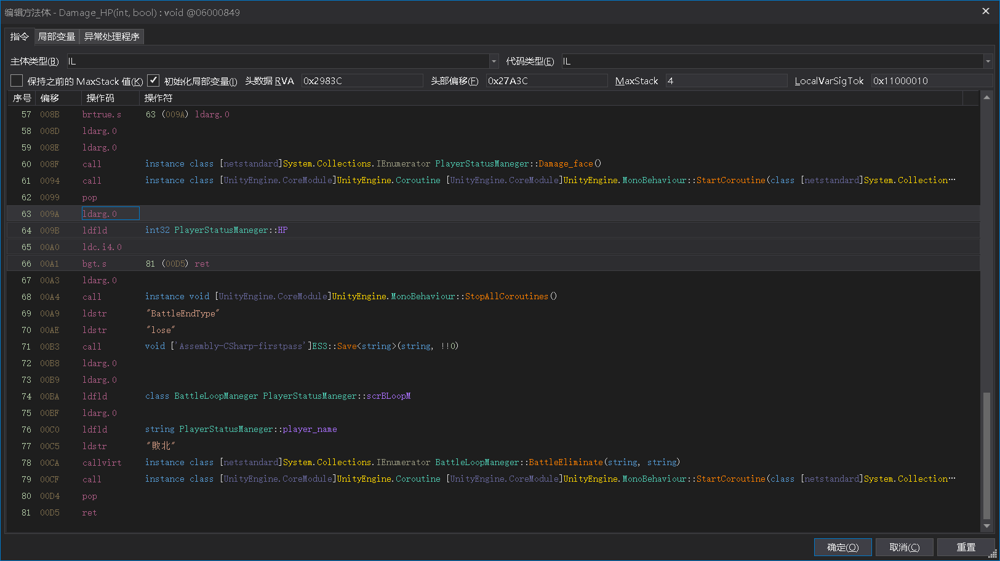
打开该方法的IL，如图逻辑所示，我们只需在63处替换为ret即可  

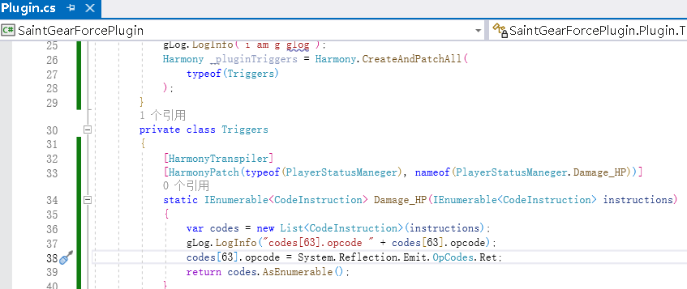  
如上，演示代码会打印codes[63]的opcode，并替换为ret  

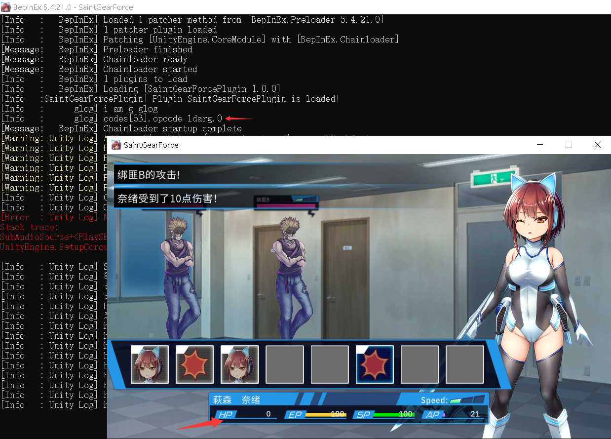  
如图所示，HP归零时不会触发败北逻辑，实现立于不败之地的需求。

# 结束语
本文使用BepInEx实现了几个修改`Assembly-CSharp.dll`实现的需求

但没有实现通过配置或者是插入UI等方式控制功能的开关，存在某些必败关卡会卡关的问题

想必看完之后你还会对 `[HarmonyPatch(typeof(PlayerStatusManeger), nameof(PlayerStatusManeger.Damage_HP))]` 之类的地方感到困惑

在后续文章中，将会演示通过配置及显式UI开关的方式控制patch的行为，以及进一步介绍BepInEx与Harmony

# 本文示例源码

```csharp
using BepInEx;
using BepInEx.Logging;
using HarmonyLib;
using HarmonyLib.Tools;
using System;
using System.Collections.Generic;
using System.Linq;

namespace SaintGearForcePlugin
{
    [BepInPlugin(PluginInfo.PLUGIN_GUID, PluginInfo.PLUGIN_NAME, PluginInfo.PLUGIN_VERSION)]
    public class Plugin : BaseUnityPlugin
    {
        static ManualLogSource gLog = new ManualLogSource("glog");
        private void Awake()
        {
            // Plugin startup logic
            Logger.LogInfo($"Plugin {PluginInfo.PLUGIN_GUID} is loaded!");
            HarmonyFileLog.Enabled = true;
            BepInEx.Logging.Logger.Sources.Add(gLog);
            gLog.LogInfo("i am g glog");
            Harmony _pluginTriggers = Harmony.CreateAndPatchAll(
                typeof(Triggers)
            );
        }
        private class Triggers
        {
            [HarmonyTranspiler]
            [HarmonyPatch(typeof(PlayerStatusManeger), nameof(PlayerStatusManeger.Damage_HP))]
            static IEnumerable<CodeInstruction> Damage_HP(IEnumerable<CodeInstruction> instructions)
            {
                var codes = new List<CodeInstruction>(instructions);
                gLog.LogInfo("codes[63].opcode " + codes[63].opcode);
                codes[63].opcode = System.Reflection.Emit.OpCodes.Ret;
                return codes.AsEnumerable();
            }
            [HarmonyPostfix]
            [HarmonyPatch(typeof(PlayerGrowUpSystem), "GetStatusGrowUpData")]
            static public void GetStatusGrowUpData_Hook(ref StatusGrowUpData __result)
            {
                __result.consume_sp = 1;
            }
            [HarmonyPostfix]
            [HarmonyPatch(typeof(PlayerGrowUpSystem), "GetGrowUpSkillData")]
            static public void GetGrowUpSkillData_Hook(ref GrowUpSkillData __result)
            {
                __result.amount = 1;
            }
            [HarmonyPrefix]
            [HarmonyPatch(typeof(PlayerStatusManeger), "Consume_EP")]
            [HarmonyPatch(typeof(PlayerStatusManeger), "Consume_SP")]
            static public void Consume_SP_EP(ref int consume_amount)
            {
                gLog.LogInfo("consume_amount" + consume_amount);
                consume_amount = 1;
            }
            //[HarmonyPrefix]
            //[HarmonyPatch(typeof(PlayerStatusManeger), nameof(PlayerStatusManeger.Damage_HP))]
            //static public void Damage_HP_Hook(ref int damage_amount, ref bool acme)
            //{
            //    damage_amount = 1;
            //}
        }
    }
}


```