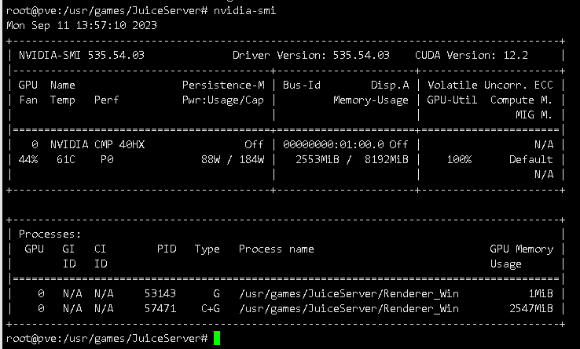

# 远程调用GPU——Juice前瞻
# 前言
Juice这玩意是去年年底出现的，如今(2023年8月)已经达到了堪用状态

项目官网 https://www.juicelabs.co/

但距离可用可能还有很大的距离，使用一个堪用的项目其中风险待各位自行评估

本文仅为对该项目的简单探索，不作为最佳实践推荐

本次的例子以PVE作为host，PVE跑的Windows10虚拟机作为guest

操作系统支持情况  
> 跨操作系统的 Juice 支持哪些用途？
>
>| Client <--> Server   	| 支持的APIs / 使用的Cases 	|
>|----------------------	|--------------------------	|
>| Ubuntu <--> Ubuntu   	| 仅CUDA (ML/AI/HPC)*      	|
>| Ubuntu <--> Windows  	| 仅CUDA(ML/AI/HPC)*       	|
>| Windows <--> Windows 	| CUDA + 图形加速          	|
>| Windows <--> Ubuntu  	| CUDA + 图形加速          	|
>
> *基本上, 在Linux跑图形的需求很少因此我们并没有支持它的计划 - 但其他的功能还能搞的
> 
> 即便是Linux作为server你也可以在Windows上跑图形程序.

# host部署
## host介绍
本次使用的host就是我们的PVE了

PVE搭载了一块40HX作为图形加速用途，也用于对比vGPU的性能差距

主板：ASUS B150 PRO GAMING D3

CPU：Intel QQLT（被动散热的笔记本魔改U）

内存：3条8G的DDR3绿条

因安装需求有`Install NVIDIA driver 530.30 or later and reboot`

故此安装的驱动为杂种的`NVIDIA-Linux-x86_64-535.54.03-merged-vgpu-kvm-patched.run`

该版本驱动的性能是有问题的，如无特殊需求建议回退使用Grid15.2

本文不介绍nvidia驱动如何安装，请自行查看其他资料

## 安装Juice
```shell
apt update
apt install libvulkan1 libgl1 libglib2.0-0

```  
  
如果下文的wget下载不动，可以就自己换个github镜像站，或者是下好了丢进PVE  
```shell
wget https://github.com/Juice-Labs/Juice-Labs/releases/latest/download/JuiceServer-linux.tar.gz
mkdir JuiceServer
cd JuiceServer tar -xf ../JuiceServer-linux.tar.gz

```
  
查看文件无误，就已经安装完毕了，因为是一个堪用项目，这里就不写什么服务启动了

# 启动Juice服务端
这里我推荐开个screen以防ssh断线之类的事情，你不开也行

运行那个agent它就启动了  
  
# guest部署
## 下载文件
下载如下链接的文件并把压缩包解压到任意位置，虽然文档没说能不能有中文空格，但避免麻烦还是不要有了

https://github.com/Juice-Labs/Juice-Labs/releases/latest/download/JuiceClient-windows.zip

## 修改path
  
如上把解压的JuiceClient添加到path

## 修改配置
  
这个servers的IP修改为可以高速连接PVE宿主机的IP(本文的图形加速卡部署在PVE上)

如果你的显卡部署在其他机器那就填其他机器的，记得保存

# 测试
## nvidia-smi
  
如图所示，nvidia-smi会展示远程的显卡信息，如果未安装nvidia相关套件则nvidia-smi不能使用，但这个不影响相关功能

## Juice图形加速
以图中为例`juicify.exe pso2.exe` 就是使用Juice加速pso2.exe，后面的参数是游戏启动所需的参数，根据不同的游戏自行添加  
  
可以看见这东西对网络的需求还是挺恐怖的  
  
  
然后再放一张使用vGPU的跑分成绩  
Juice的图形成绩仅为vGPU的四分之一

# 结束语
这东西，如果有vGPU的话，目前还是别用了

吃网络吃的是真的狠，如果跑多几个实例都不知道会变成什么样

它可能更适合那些尚且能进行vGPU的卡或者是卡与虚拟机分开部署的场景

我预计，在未来它可能在创建多卡资源池然后远程申请调用调度的场景大有作为，未来可期

## 意外之喜
这玩意可能更适合AI画画  
  
除了加载模型的时候慢地难受，加载完之后跑的还是很快的

就算力本身而言基本上没有什么损失

对实时性要求不高的cuda计算任务估计可以胜任