# 启用NVIDIA非专业卡(游戏卡、NVS等)的TCC模式
# 前言
众所周知，NVIDIA只在专业卡(包括专业矿卡上)上提供TCC模式。

之前演示了一下解除部分NVIDIA游戏卡的OpenGL负优化，这次来摸一手TCC。

游戏卡GeForce系列，多屏卡NVS系列等均禁用TCC模式并主动负优化OpenGL性能。

对于某些炼丹场景，WDDM存在一些显存与性能劣势。具体情况不在本文赘述。

本文将以修改驱动的方式，启用非专业卡的TCC模式。

如果是使用PVE，直接在直通设备上修改为Quadro系列专业卡的DeviceID就能启用TCC了。

本文以`NVIDIA GeForce RTX 3070 Laptop GPU` 为例，其设备ID为：`0x249D10DE` 。
# 未修改时
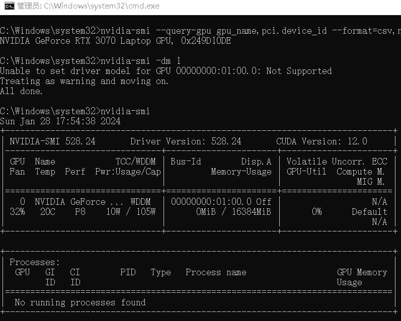  
如图所示，使用未修改启用TCC的驱动时，尝试更改显卡工作模式为TCC时提示不支持。  
```log
C:\Windows\system32>nvidia-smi -dm 1
Unable to set driver model for GPU 00000000:01:00.0: Not Supported
Treating as warning and moving on.
All done.

```  
# 修改并安装驱动
## 给nvlddmkm.sys打补丁
以下两个方案二选一即可

### 方法1：修改sNvTccDevList
此法较为推荐，可以稳定搜索并修改，缺点就是加啥卡就只支持啥卡  
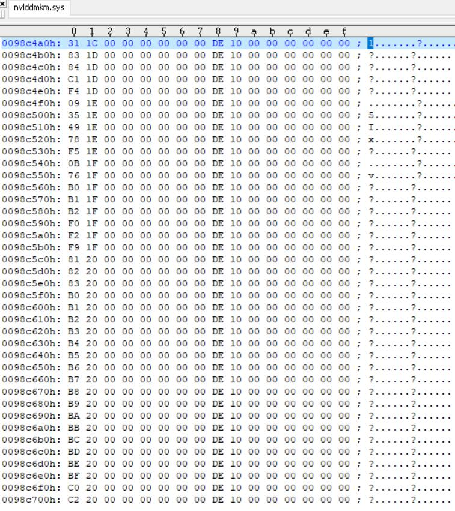  
搜索`31 1C 00 00 00 00` 很快就可以找到如图所示的地方，想了解为什么是这个可以看后面的章节。

修改为如图下所示，我这里的设备ID是`249D`，因此此处按小端模式修改为`9D 24` 。

这个设备ID可以看看GPU-Z或者是使用命令`nvidia-smi --query-gpu gpu_name,pci.device_id --format=csv,noheader` 查看。

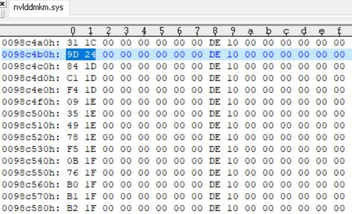
保存nvlddmkm.sys后，进行签名。

### 方法2——修改isTeslaComputeDevice
这个方法不推荐使用，除非你卡是真的多，一个个改不好改

这个方法可以让所有卡支持TCC，但挺难找，换个驱动版本不知道还能不能匹配上

搜索`C7 04 24 93 10 90 10 C7 44 24 04 94 10 9F 10`

然后找到第一个`FF C1 48 83 C0 10 81 F9 ?? ?? 00 00 72 ED 32 C0 EB 02`

在528.24是`FF C1 48 83 C0 10 81 F9 84 00 00 00 72 ED 32 C0 EB 02`

在560.70是`FF C1 48 83 C0 10 81 F9 03 01 00 00 72 ED 32 C0 EB 02`

其中的`?? ??`在不同版本是不同数值，不过通配找估计不是很难  
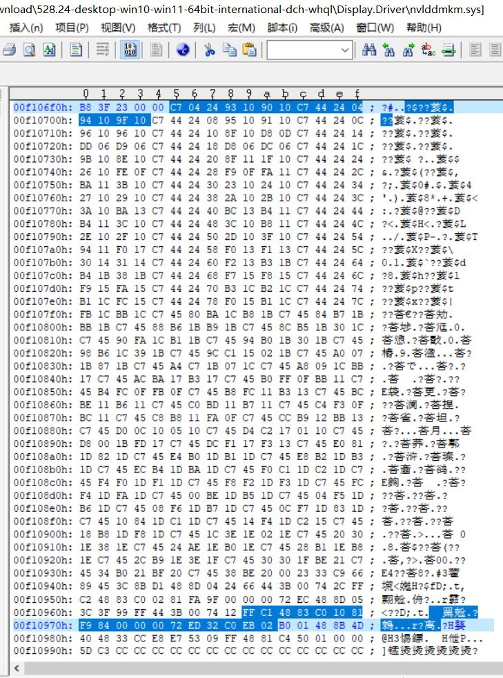  
然后改为  
`FF C1 48 83 C0 10 81 F9 ?? ?? 00 00 72 ED B0 01 EB 02`  
保存后记得去签名

## 签名nvlddmkm.sys
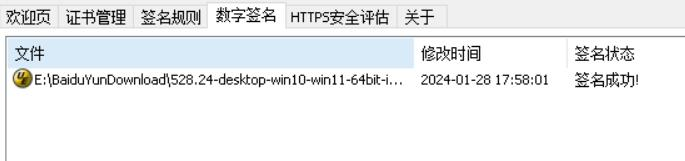  
签名没啥好说的，按一般给驱动签名的方法，签名就行。

## 安装驱动
安装前记得用DDU把系统原来的NVIDIA驱动清了，不然可能出现问题。

系统必须关闭签名检查与安全启动，具体关闭方法可以自行搜索。

然后按正常安装方法，安装修改后的驱动。  
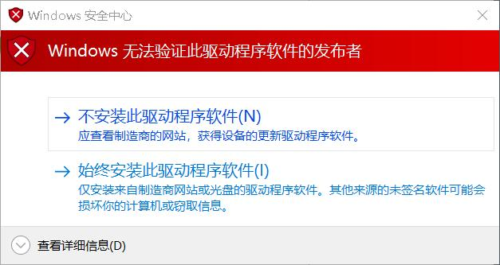  
期间会弹出这个警告弹窗，因为是自签名证书。

直接点“始终安装此驱动程序软件”即可。

# 验证tcc模式是否可用
使用命令`nvidia-smi -dm 1` 切换tcc模式  
  
在提示 *Reboot required.* 后，进入设备管理器停用并启用显卡。  
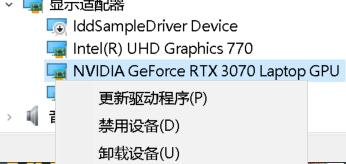 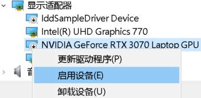  
随后就可以看看任务栏管理器内NVIDIA的GPU是否消失。  
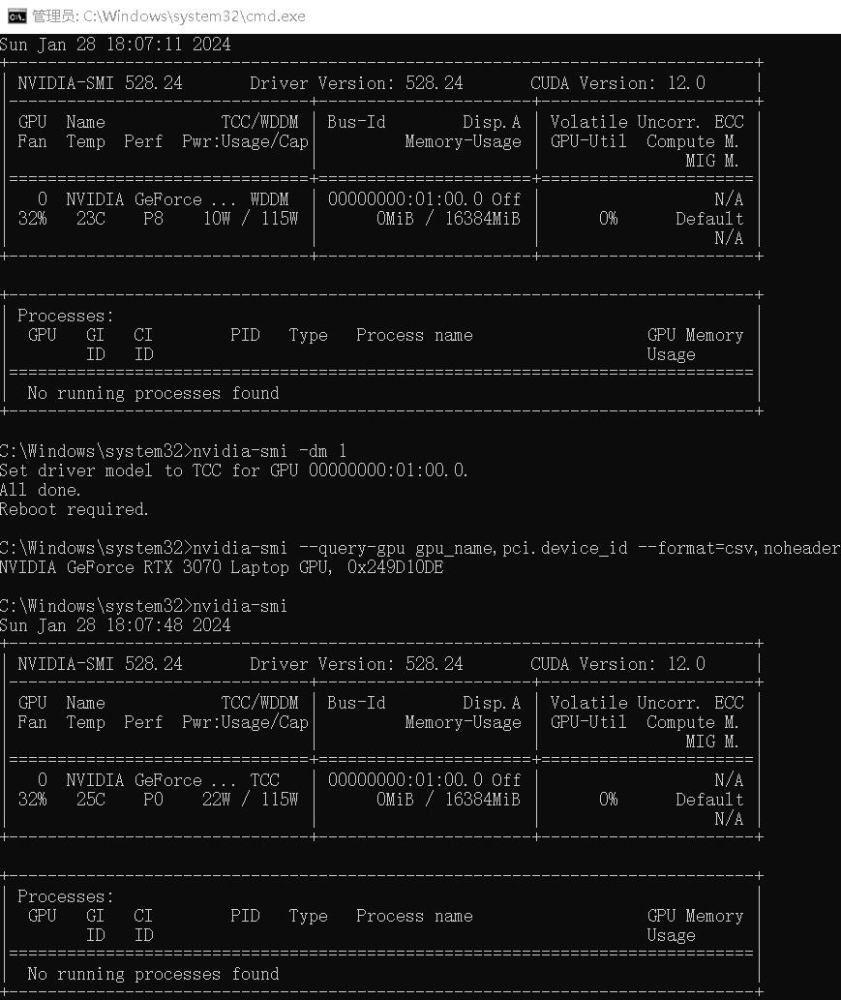  
使用`nvidia-smi --query-gpu gpu_name,pci.device_id --format=csv,noheader `命令查询，卡确实是之前那张不支持TCC的249D。

使用`nvidia-smi` 命令，可以看见已经工作在TCC模式下了。

# 为什么这样改
简单的来说，nvidia通过在驱动中验证DeviceId，来限制是否能启用TCC模式。

有说法是修改注册表也能启用TCC模式，但我看了代码是不存在这种可能性的

因为bTCCSupported等开关都是从这里来的，这里没改的话根本就不会激活TCC相关功能

以下是`bool isTeslaComputeDevice(USHORT ulDeviceId)` 代码节选  
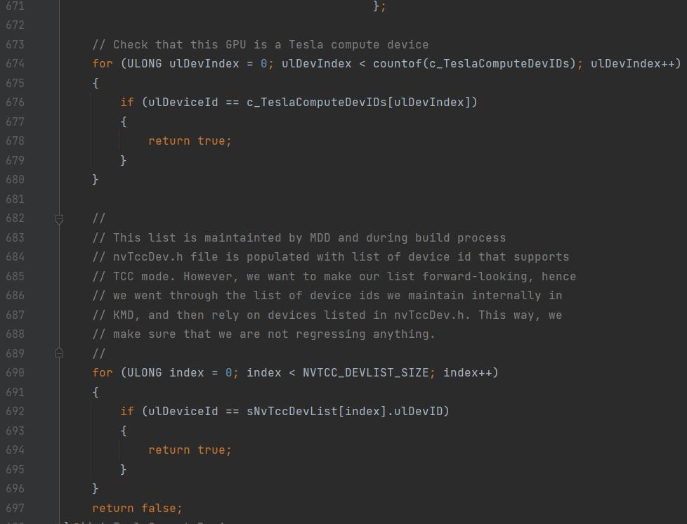  
而这个名单sNvTccDevList就在如图所示的地方。  
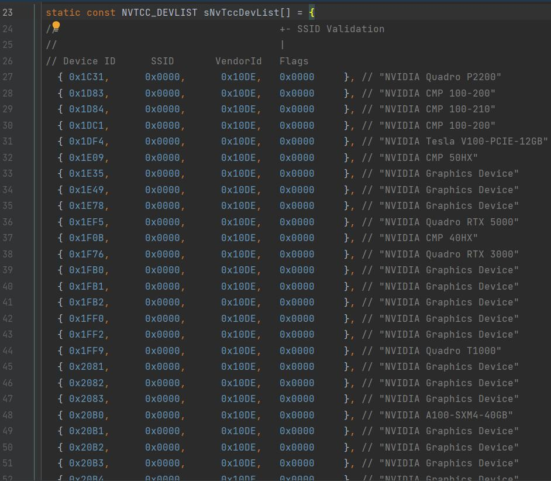  
因此，搜索`31 1C 00 00 00 00` 就可以找到这个列表。

按方法1修改sNvTccDevList
把我们自己不支持的设备塞进去，就可以启用TCC模式了。

而方法2的isTeslaComputeDevice的修改就是  
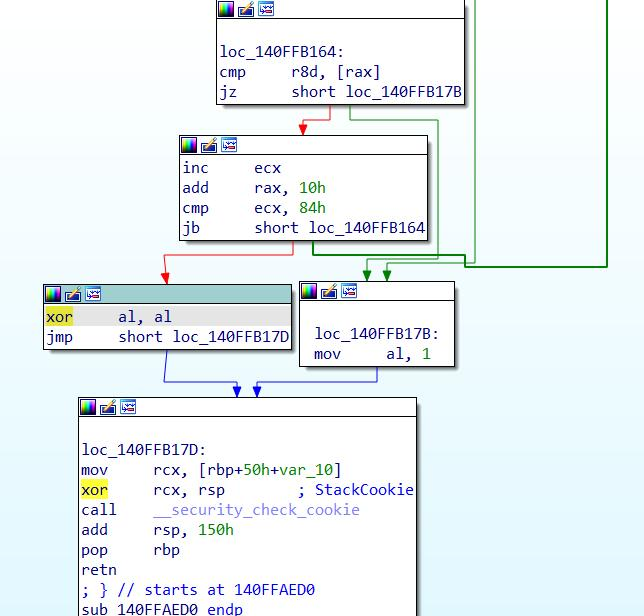  
把这个xor al,al改为mov al,1  

这个修改方法可以兼容更多设备，但是不好找地方  
那个`?? ??`就是源码对应那个`NVTCC_DEVLIST_SIZE`  
图中是84h就是528.24的`84 00`  

这个修改方法可以兼容更多设备，但是不好找地方  
后续版本编译器要是优化一下，就不知道会飘哪去了
# 测试
## GTX 1060 6G 120W
### WDDM
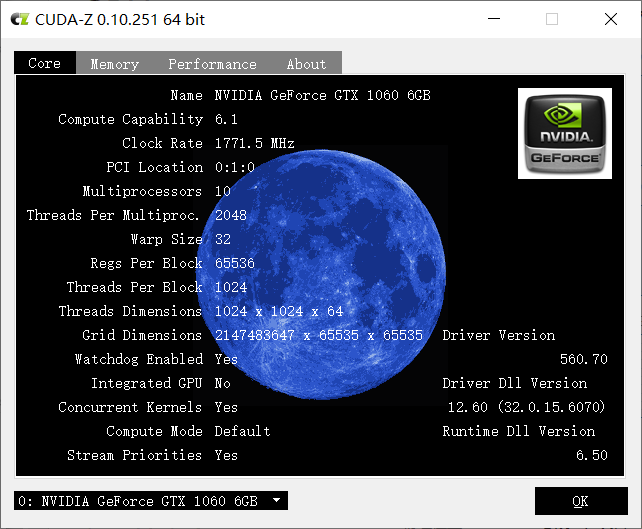  
  
### TCC
  
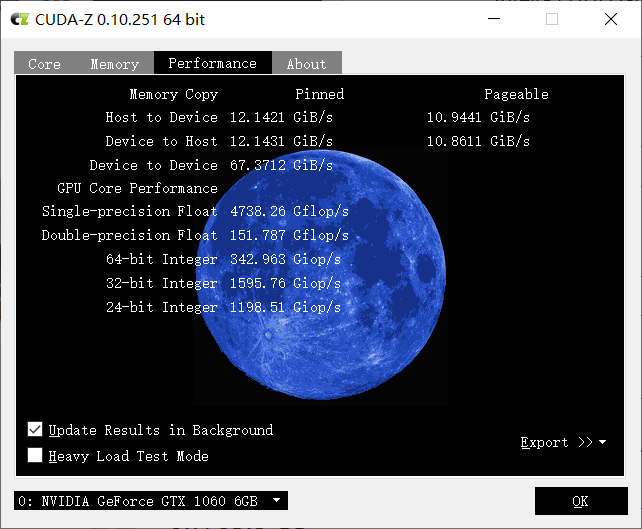  
# 结束语
NVIDIA这样搞，我还能说什么呢？

TCC开启后AI画图还有sovits感觉都快了许多，不知道是TCC确实有用

还是纯粹就是气温低了

大家有什么题材推荐也可以私信或者是发到评论区。

有请评论区的各位评价吧！期待各位的高见！ 