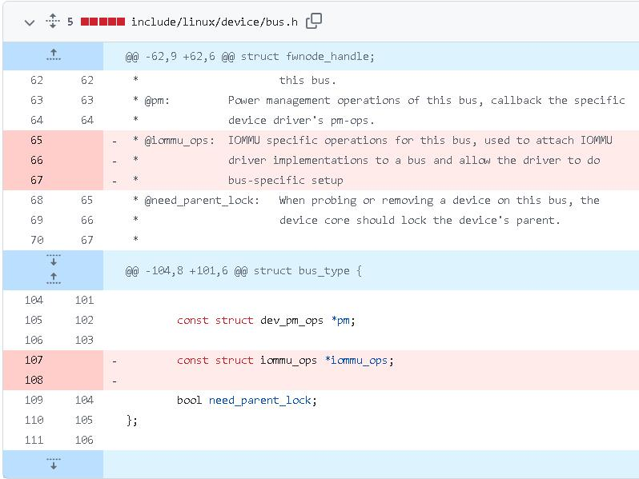
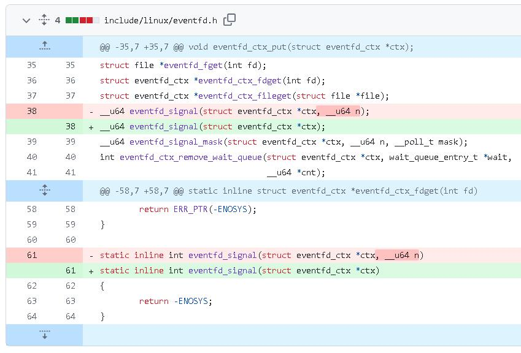
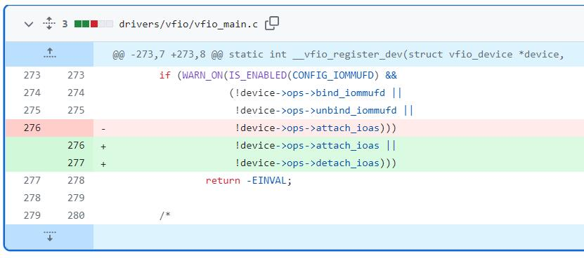
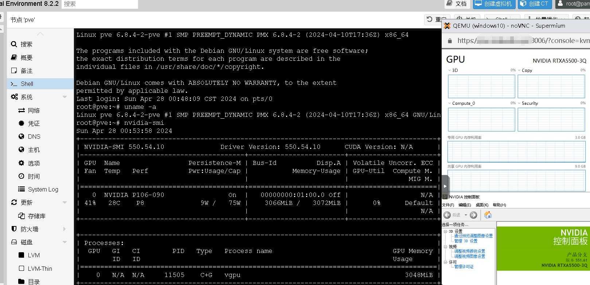

# 修复NVIDA vGPU 17.0(即550.54.10)在6.8内核(PVE8.2)的问题
# 问题描述
最近Proxmox VE更新至8.2，许多人反馈nvidia的vGPU驱动无法正常编译安装

PVE官方文档描述如下 https://pve.proxmox.com/wiki/Roadmap#Proxmox_VE_8.2
> Known Issues & Breaking Changes
>>
>> Kernel 6.8
>>
>>> The Proxmox VE 8.2 releases will install and use the 6.8 Linux kernel by default, a major kernel change can have a few, hardware specific, side effects.
>>>
>>> You can avoid installing the 6.8 kernel by pinning the proxmox-default-kernel package version before the upgrade. The last version to depend on kernel 6.5 is 1.0.1.
>>>
>>> To pin the package to that version, create a file in /etc/apt/preferences.d/proxmox-default-kernel with the following content. This will keep proxmox-default-kernel on the old version until that file is deleted, and a new upgrade is initiated:
>>> ```
>>> Package: proxmox-default-kernel
>>> Pin: version 1.0.1
>>> Pin-Priority: 1000
>>> ```
>>>
>> Kernel: Change in Network Interface Names
>>> Upgrading kernels always carries the risk of network interface names changing, which can lead to invalid network configurations after a reboot. In this case, you must either update the network configuration to reflect the name changes, or pin the network interface to its name beforehand.
>>>
>>> See the reference documentation on how to pin the interface names based on MAC Addresses.
>>>
>>> Currently, the following models are known to be affected at higher rates:
>>> - Models using i40e. Their names can get an additional port suffix like p0 added.  
>>>
>> Kernel: DKMS
>>> Since the default kernel changes to 6.8, it may happen that installed DKMS modules will not build anymore. For instance, as of April 2024 this is the case for the latest NVIDIA GRID driver 17.1.
>>>
>>> Aside from simply removing and not using those modules, one possible workaround is to pin the proxmox-default-kernel package to an older version before the upgrade. The last version to depend on kernel 6.5 is 1.0.1.

大意就是，PVE更新到6.8内核后，即便是最新的GRID17.1版本也不能在上面工作，要用vGPU的自己滚回6.5内核

本文内容仅讲述6.8内核后GRID 17.0编译错误部分的解决方案，在新驱动vGPU的部分请参考其他文章

本文案例以kernel举例，如需使用kernel-open请自行对照移植

因为用16.X的人挺多的，补充了16.X的更变detach_ioas

# 日志特征
```shell
cat /var/log/nvidia-installer.log
```  
展示的日志包括  
```log
   /tmp/selfgz10234/NVIDIA-Linux-x86_64-550.54.16-vgpu-kvm/kernel/nvidia/nv-pci.c: In function 'nv_pci_probe':
   /tmp/selfgz10234/NVIDIA-Linux-x86_64-550.54.16-vgpu-kvm/kernel/nvidia/nv-pci.c:225:29: error: 'const struct bus_type' has no member named 'iommu_ops'
     225 |         if (pci_dev->dev.bus->iommu_ops == NULL)
         |                             ^~

```  
```log
   /tmp/selfgz10234/NVIDIA-Linux-x86_64-550.54.16-vgpu-kvm/kernel/nvidia-vgpu-vfio/nvidia-vgpu-vfio.c:2656:9: error: too many arguments to function 'eventfd_signal'
    2656 |         eventfd_signal(trigger, 1);
         |         ^~~~~~~~~~~~~~

```  
# 问题成因
本次造成vGPU驱动无法正常工作，主要是改动了vfio与iommu及eventfd

## iommu
本更变详细情况可见

https://github.com/torvalds/linux/commit/75f74f85a42eb294b657f847c33e1bb7921dbec9

include/linux/device/bus.h  
  
如上所示，iommu_ops被从bus_type 中移除

## eventfd
本更变详细情况可见

https://github.com/torvalds/linux/commit/3652117f854819a148ff0fbe4492587d3520b5e5



如图所示，eventfd_signal减少了一个入参。

## detach_ioas
这个问题仅在Grid 16.X中出现

本更变详细情况可见

https://github.com/torvalds/linux/commit/9048c7341c4df9cae04c154a8b0f556dbe913358

drivers/vfio/vfio_main.c  


# 问题修正思路
## iommu
在驱动的/kernel/nvidia/nv-pci.c b/kernel/nvidia/nv-pci.c中第229行附近把
```cpp
if (pci_dev->dev.bus->iommu_ops == NULL)
```
修正为  
```cpp
const struct iommu_ops *ops = NULL;
struct iommu_fwspec *fwspec = NULL;
fwspec = dev_iommu_fwspec_get(&pci_dev->dev);
if (fwspec && fwspec->ops)
{ops = fwspec->ops;}
if (ops == NULL)
```  
即可

同时记得在kernel/common/inc/nv-pci.h 新增导入  
```cpp
#include <linux/iommu.h>
```  
以及在/kernel/nvidia-vgpu-vfio/nvidia-vgpu-vfio.c中加入  
```cpp
MODULE_IMPORT_NS(IOMMUFD);
```  
## eventfd
将/kernel/nvidia-vgpu-vfio/nvidia-vgpu-vfio.c中的全部  
```cpp
eventfd_signal(trigger, 1);
```  
更变为  
```cpp
eventfd_signal(trigger);
```
## detach_ioas
在./kernel/nvidia-vgpu-vfio/vgpu-vfio-mdev.c中的nv_vfio_mdev_dev_ops结构体

新增.detach_ioas = vfio_iommufd_physical_detach_ioas,

详情可以参考vGPU-Grid-16.5-535.161.05-Linux-6.8.patch

# 最终修复patch
根据上面的修复思路，直接的修复补丁如下，本补丁仅用于解决NVIDA vGPU GRID 17.0(即550.54.10)在PVE换用6.8.4-2内核后出现的问题

其他问题，如EXPORT_SYMBOL_GPL等不在本文内

确认工作的内核版本为Linux pve 6.8.4-2-pve #1 SMP PREEMPT_DYNAMIC PMX 6.8.4-2 (2024-04-10T17:36Z) x86_64 GNU/Linux

本补丁适配的是kernel，而非kernel-open，如需使用kernel-open请自行移植

使用kernel而非默认的kernel-open请安装时新增参数-m kernel

```patch
From dfb48aa1896ecb6c99a3278db90e4ba0c5a007f7 Mon Sep 17 00:00:00 2001
Date: Sat, 27 Apr 2024 20:16:44 +0800
Subject: [PATCH] kernel 6.8

---
kernel/common/inc/nv-pci.h | 1 +
kernel/nvidia-vgpu-vfio/nvidia-vgpu-vfio.c | 11 +++++++++++
kernel/nvidia/nv-pci.c | 11 ++++++++++-
3 files changed, 22 insertions(+), 1 deletion(-)

diff --git a/kernel/common/inc/nv-pci.h b/kernel/common/inc/nv-pci.h
index 2254e72..c92c968 100644
--- a/kernel/common/inc/nv-pci.h
+++ b/kernel/common/inc/nv-pci.h
@@ -26,6 +26,7 @@

#include <linux/pci.h>
#include "nv-linux.h"
+#include <linux/iommu.h>

#define NV_GPU_BAR1 1
#define NV_GPU_BAR3 3
diff --git a/kernel/nvidia-vgpu-vfio/nvidia-vgpu-vfio.c b/kernel/nvidia-vgpu-vfio/nvidia-vgpu-vfio.c
index c0b7aad..1405077 100644
--- a/kernel/nvidia-vgpu-vfio/nvidia-vgpu-vfio.c
+++ b/kernel/nvidia-vgpu-vfio/nvidia-vgpu-vfio.c
@@ -2653,7 +2653,11 @@ static irqreturn_t vgpu_msix_handler(int irq, void *arg)
}

if (trigger != NULL)
+ #if LINUX_VERSION_CODE >= KERNEL_VERSION(6,8,0)
+ eventfd_signal(trigger);
+ #else
eventfd_signal(trigger, 1);
+ #endif
else
return IRQ_NONE;

@@ -2966,7 +2970,11 @@ NV_STATUS nv_vgpu_inject_interrupt(void *vgpuRef)
}
NV_SPIN_UNLOCK_IRQRESTORE(&vgpu_dev->intr_info_lock, eflags);

+ #if LINUX_VERSION_CODE >= KERNEL_VERSION(6,8,0)
+ eventfd_signal(trigger);
+ #else
eventfd_signal(trigger, 1);
+ #endif

return status;
}
@@ -5432,6 +5440,9 @@ MODULE_VERSION(NV_VERSION_STRING);
MODULE_IMPORT_NS(IOMMUFD);
#endif
#endif
+#if LINUX_VERSION_CODE >= KERNEL_VERSION(6,8,0)
+MODULE_IMPORT_NS(IOMMUFD);
+#endif

#if defined(NV_VGPU_KVM_BUILD)
MODULE_SOFTDEP("pre: nvidia");
diff --git a/kernel/nvidia/nv-pci.c b/kernel/nvidia/nv-pci.c
index 8d490f5..cba7941 100644
--- a/kernel/nvidia/nv-pci.c
+++ b/kernel/nvidia/nv-pci.c
@@ -222,7 +222,16 @@ nv_pci_probe
goto failed;
}

- if (pci_dev->dev.bus->iommu_ops == NULL) 
+#if LINUX_VERSION_CODE >= KERNEL_VERSION(6,8,0)
+ const struct iommu_ops *ops = NULL;
+ struct iommu_fwspec *fwspec = NULL;
+ fwspec = dev_iommu_fwspec_get(&pci_dev->dev);
+ if (fwspec && fwspec->ops)
+ {ops = fwspec->ops;}
+ if (ops == NULL)
+#else
+ if (pci_dev->dev.bus->iommu_ops == NULL)
+#endif
{
nv = NV_STATE_PTR(nvl);
if (rm_is_iommu_needed_for_sriov(sp, nv))
-- 
2.38.1
```  
至此，将17.0版本的vGPU在Linux6.8内核的编译问题已解决

# 包括其他修正的完整patch
包括其他旧内核存在的问题修正与vGPU解锁的完整patch在如下地址，分别提供最新的GRID 16.5与17.1版本

https://foxi.buduanwang.vip/pan/vGPU/16.5/vGPU-Grid-16.5-535.161.05-Linux-6.8.patch

https://foxi.buduanwang.vip/pan/vGPU/17.1/vGPU-Grid-17.1-550.54.16-linux-6.8.patch

看好自己的版本，如果是Pascal与Maxwell2.0建议用16版本，以上补丁分别使用
```shell
./NVIDIA-Linux-x86_64-535.161.05-vgpu-kvm.run --apply-patch vGPU-Grid-16.5-535.161.05-Linux-6.8.patch

```
```shell
./NVIDIA-Linux-x86_64-550.54.16-vgpu-kvm.run --apply-patch vGPU-Grid-17.1-550.54.16-linux-6.8.patch

```
这两个命令对原始安装包打补丁，然后会生成打好补丁的`-custom.run`版本

如果是Grid17.1的那个，安装的时候记得加参数`-m kernel`，比如说这样 
```shell
./NVIDIA-Linux-x86_64-550.54.16-vgpu-kvm-custom.run -m kernel

```
请根据自己的版本选择，补丁后的版本解锁非官方vGPU支持需配合libvgpu_unlock_rs，详情可以参考

https://foxi.buduanwang.vip/virtualization/pve/2815.html
# 已经打好补丁的包
至于17.1，上面的例子不就是吗，就不提供包了，重复做一个版本就没意思了

打好补丁的包基本上装上就能用

## Grid 17.0 (适合追新爱好者使用)
17.0版本相关资源都在

https://foxi.buduanwang.vip/pan/vGPU/17.0/

https://foxi.buduanwang.vip/pan/vGPU/17.0/NVIDIA-Linux-x86_64-550.54.10-vgpu-kvm-patched-kernel6.8-OA5500.run

https://foxi.buduanwang.vip/pan/vGPU/17.0/NVIDIA-Linux-x86_64-550.54.14-merged-vgpu-kvm-patched-kernel6.8-OA5500.run

这两个是17.0版本的包，可直接使用，Pascal与Maxwell2.0的核心会伪装为A5500

宿主机驱动自行解压NVIDIA-GRID-Linux-KVM-550.54.10-550.54.14-551.61.zip获取
## Grid 16.4 (更推荐正常人使用)
https://foxi.buduanwang.vip/pan/vGPU/16.4/

https://foxi.buduanwang.vip/pan/vGPU/16.4/NVIDIA-Linux-x86_64-535.161.05-vgpu-kvm-patched-kernel6.8.run

https://foxi.buduanwang.vip/pan/vGPU/16.4/NVIDIA-Linux-x86_64-535.161.07-merged-vgpu-kvm-patched-kernel6.8.run

名称中带merge的是杂种驱动，具体作用参考其他文章

# 修复结果验证
如图所示，在PVE 8.2上，已经可以使用Linux 6.8内核运行GRID 17.0(550.54.10)版本的vGPU
