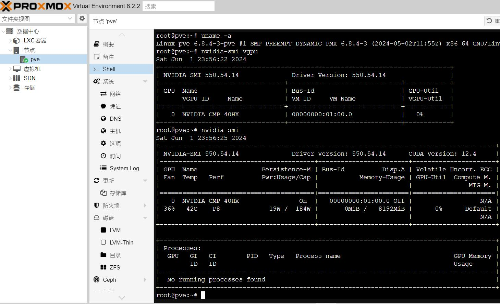
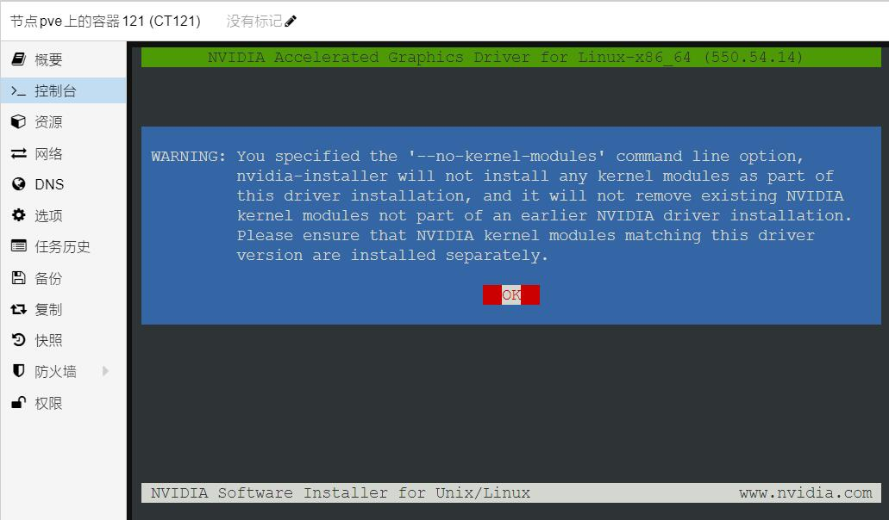

# 使用杂种vGPU驱动保留宿主机CUDA能力

# 问题背景
当使用官方版本的vGPU驱动时，默认不会安装CUDA等外围  
因此在宿主机启用vGPU时，CUDA等功能无法使用

但在某些特殊场景下，又希望在宿主机上同时使用N卡的CUDA能力与vGPU

## 准备验证环境
  
一个显著的特征就是，CUDA Version一栏为N/A

## 宿主机安装pytorch环境
安装大家常用的pytorch尝试调用  
为了避免pytorch污染宿主机环境，此处使用venv对环境进行隔离  
  
随后创建venv环境  
```shell
python3 -m venv venv

```  
安装pytorch环境  
```shell
python3 -m venv venv
source ./venv/bin/activate

```

<details>

<summary>
安装pytorch环境 日志
</summary>

```log
root@pve:/mnt/nvme0n1p5/pytorch# python3 -m venv venv
root@pve:/mnt/nvme0n1p5/pytorch# source ./venv/bin/activate
(venv) root@pve:/mnt/nvme0n1p5/pytorch# pip config set global.index-url https://mirror.sjtu.edu.cn/pypi/web/simple
Writing to /root/.config/pip/pip.conf
(venv) root@pve:/mnt/nvme0n1p5/pytorch# pip install torch==2.3.0+cu121 -f https://mirror.sjtu.edu.cn/pytorch-wheels/torch_stable.
html  --no-cache-dir
Looking in indexes: https://mirror.sjtu.edu.cn/pypi/web/simple
Looking in links: https://mirror.sjtu.edu.cn/pytorch-wheels/torch_stable.html
Collecting torch==2.3.0+cu121
  Downloading https://mirror.sjtu.edu.cn/pytorch-wheels/cu121/torch-2.3.0%2Bcu121-cp311-cp311-linux_x86_64.whl (781.0 MB)
     ━━━━━━━━━━━━━━━━━━━━━━━━━━━━━━━━━━━━━━━━ 781.0/781.0 MB 14.4 MB/s eta 0:00:00
Collecting filelock
  Downloading https://mirror.sjtu.edu.cn/pypi-packages/41/24/0b023b6537dfc9bae2c779353998e3e99ac7dfff4222fc6126650e93c3f3/filelock-3.14.0-py3-none-any.whl (12 kB)
Collecting typing-extensions>=4.8.0
  Downloading https://mirror.sjtu.edu.cn/pypi-packages/e1/4d/d612de852a0bc64a64418e1cef25fe1914c5b1611e34cc271ed7e36174c8/typing_extensions-4.12.0-py3-none-any.whl (37 kB)
Collecting sympy
  Downloading https://mirror.sjtu.edu.cn/pypi-packages/61/53/e18c8c97d0b2724d85c9830477e3ebea3acf1dcdc6deb344d5d9c93a9946/sympy-1.12.1-py3-none-any.whl (5.7 MB)
     ━━━━━━━━━━━━━━━━━━━━━━━━━━━━━━━━━━━━━━━━ 5.7/5.7 MB 11.0 MB/s eta 0:00:00
Collecting networkx
  Downloading https://mirror.sjtu.edu.cn/pypi-packages/38/e9/5f72929373e1a0e8d142a130f3f97e6ff920070f87f91c4e13e40e0fba5a/networkx-3.3-py3-none-any.whl (1.7 MB)
     ━━━━━━━━━━━━━━━━━━━━━━━━━━━━━━━━━━━━━━━━ 1.7/1.7 MB 6.5 MB/s eta 0:00:00
Collecting jinja2
  Downloading https://mirror.sjtu.edu.cn/pypi-packages/31/80/3a54838c3fb461f6fec263ebf3a3a41771bd05190238de3486aae8540c36/jinja2-3.1.4-py3-none-any.whl (133 kB)
     ━━━━━━━━━━━━━━━━━━━━━━━━━━━━━━━━━━━━━━━━ 133.3/133.3 kB 3.9 MB/s eta 0:00:00
Collecting fsspec
  Downloading https://mirror.sjtu.edu.cn/pypi-packages/ba/a3/16e9fe32187e9c8bc7f9b7bcd9728529faa725231a0c96f2f98714ff2fc5/fsspec-2024.5.0-py3-none-any.whl (316 kB)
     ━━━━━━━━━━━━━━━━━━━━━━━━━━━━━━━━━━━━━━━━ 316.1/316.1 kB 2.1 MB/s eta 0:00:00
Collecting nvidia-cuda-nvrtc-cu12==12.1.105
  Downloading https://mirror.sjtu.edu.cn/pypi-packages/b6/9f/c64c03f49d6fbc56196664d05dba14e3a561038a81a638eeb47f4d4cfd48/nvidia_cuda_nvrtc_cu12-12.1.105-py3-none-manylinux1_x86_64.whl (23.7 MB)
     ━━━━━━━━━━━━━━━━━━━━━━━━━━━━━━━━━━━━━━━━ 23.7/23.7 MB 13.5 MB/s eta 0:00:00
Collecting nvidia-cuda-runtime-cu12==12.1.105
  Downloading https://mirror.sjtu.edu.cn/pypi-packages/eb/d5/c68b1d2cdfcc59e72e8a5949a37ddb22ae6cade80cd4a57a84d4c8b55472/nvidia_cuda_runtime_cu12-12.1.105-py3-none-manylinux1_x86_64.whl (823 kB)
     ━━━━━━━━━━━━━━━━━━━━━━━━━━━━━━━━━━━━━━━━ 823.6/823.6 kB 4.5 MB/s eta 0:00:00
Collecting nvidia-cuda-cupti-cu12==12.1.105
  Downloading https://mirror.sjtu.edu.cn/pypi-packages/7e/00/6b218edd739ecfc60524e585ba8e6b00554dd908de2c9c66c1af3e44e18d/nvidia_cuda_cupti_cu12-12.1.105-py3-none-manylinux1_x86_64.whl (14.1 MB)
     ━━━━━━━━━━━━━━━━━━━━━━━━━━━━━━━━━━━━━━━━ 14.1/14.1 MB 15.6 MB/s eta 0:00:00
Collecting nvidia-cudnn-cu12==8.9.2.26
  Downloading https://mirror.sjtu.edu.cn/pypi-packages/ff/74/a2e2be7fb83aaedec84f391f082cf765dfb635e7caa9b49065f73e4835d8/nvidia_cudnn_cu12-8.9.2.26-py3-none-manylinux1_x86_64.whl (731.7 MB)
     ━━━━━━━━━━━━━━━━━━━━━━━━━━━━━━━━━━━━━━━━ 731.7/731.7 MB 11.9 MB/s eta 0:00:00
Collecting nvidia-cublas-cu12==12.1.3.1
  Downloading https://mirror.sjtu.edu.cn/pypi-packages/37/6d/121efd7382d5b0284239f4ab1fc1590d86d34ed4a4a2fdb13b30ca8e5740/nvidia_cublas_cu12-12.1.3.1-py3-none-manylinux1_x86_64.whl (410.6 MB)
     ━━━━━━━━━━━━━━━━━━━━━━━━━━━━━━━━━━━━━━━━ 410.6/410.6 MB 12.7 MB/s eta 0:00:00
Collecting nvidia-cufft-cu12==11.0.2.54
  Downloading https://mirror.sjtu.edu.cn/pypi-packages/86/94/eb540db023ce1d162e7bea9f8f5aa781d57c65aed513c33ee9a5123ead4d/nvidia_cufft_cu12-11.0.2.54-py3-none-manylinux1_x86_64.whl (121.6 MB)
     ━━━━━━━━━━━━━━━━━━━━━━━━━━━━━━━━━━━━━━━━ 121.6/121.6 MB 17.6 MB/s eta 0:00:00
Collecting nvidia-curand-cu12==10.3.2.106
  Downloading https://mirror.sjtu.edu.cn/pypi-packages/44/31/4890b1c9abc496303412947fc7dcea3d14861720642b49e8ceed89636705/nvidia_curand_cu12-10.3.2.106-py3-none-manylinux1_x86_64.whl (56.5 MB)
     ━━━━━━━━━━━━━━━━━━━━━━━━━━━━━━━━━━━━━━━━ 56.5/56.5 MB 19.8 MB/s eta 0:00:00
Collecting nvidia-cusolver-cu12==11.4.5.107
  Downloading https://mirror.sjtu.edu.cn/pypi-packages/bc/1d/8de1e5c67099015c834315e333911273a8c6aaba78923dd1d1e25fc5f217/nvidia_cusolver_cu12-11.4.5.107-py3-none-manylinux1_x86_64.whl (124.2 MB)
     ━━━━━━━━━━━━━━━━━━━━━━━━━━━━━━━━━━━━━━━━ 124.2/124.2 MB 14.2 MB/s eta 0:00:00
Collecting nvidia-cusparse-cu12==12.1.0.106
  Downloading https://mirror.sjtu.edu.cn/pypi-packages/65/5b/cfaeebf25cd9fdec14338ccb16f6b2c4c7fa9163aefcf057d86b9cc248bb/nvidia_cusparse_cu12-12.1.0.106-py3-none-manylinux1_x86_64.whl (196.0 MB)
     ━━━━━━━━━━━━━━━━━━━━━━━━━━━━━━━━━━━━━━━━ 196.0/196.0 MB 11.8 MB/s eta 0:00:00
Collecting nvidia-nccl-cu12==2.20.5
  Downloading https://mirror.sjtu.edu.cn/pypi-packages/4b/2a/0a131f572aa09f741c30ccd45a8e56316e8be8dfc7bc19bf0ab7cfef7b19/nvidia_nccl_cu12-2.20.5-py3-none-manylinux2014_x86_64.whl (176.2 MB)
     ━━━━━━━━━━━━━━━━━━━━━━━━━━━━━━━━━━━━━━━━ 176.2/176.2 MB 20.7 MB/s eta 0:00:00
Collecting nvidia-nvtx-cu12==12.1.105
  Downloading https://mirror.sjtu.edu.cn/pypi-packages/da/d3/8057f0587683ed2fcd4dbfbdfdfa807b9160b809976099d36b8f60d08f03/nvidia_nvtx_cu12-12.1.105-py3-none-manylinux1_x86_64.whl (99 kB)
     ━━━━━━━━━━━━━━━━━━━━━━━━━━━━━━━━━━━━━━━━ 99.1/99.1 kB 874.8 kB/s eta 0:00:00
Collecting triton==2.3.0
  Downloading https://mirror.sjtu.edu.cn/pypi-packages/3c/00/84e0006f2025260fa111ddfc66194bd1af731b3ee18e2fd611a00f290b5e/triton-2.3.0-cp311-cp311-manylinux_2_17_x86_64.manylinux2014_x86_64.whl (168.1 MB)
     ━━━━━━━━━━━━━━━━━━━━━━━━━━━━━━━━━━━━━━━━ 168.1/168.1 MB 14.5 MB/s eta 0:00:00
Collecting nvidia-nvjitlink-cu12
  Downloading https://mirror.sjtu.edu.cn/pypi-packages/16/03/7e96a2ccbb752857f50c0c1355b1c52d5922be43fe0691847e520750e5c7/nvidia_nvjitlink_cu12-12.5.40-py3-none-manylinux2014_x86_64.whl (21.3 MB)
     ━━━━━━━━━━━━━━━━━━━━━━━━━━━━━━━━━━━━━━━━ 21.3/21.3 MB 12.6 MB/s eta 0:00:00
Collecting MarkupSafe>=2.0
  Downloading https://mirror.sjtu.edu.cn/pypi-packages/97/18/c30da5e7a0e7f4603abfc6780574131221d9148f323752c2755d48abad30/MarkupSafe-2.1.5-cp311-cp311-manylinux_2_17_x86_64.manylinux2014_x86_64.whl (28 kB)
Collecting mpmath<1.4.0,>=1.1.0
  Downloading https://mirror.sjtu.edu.cn/pypi-packages/43/e3/7d92a15f894aa0c9c4b49b8ee9ac9850d6e63b03c9c32c0367a13ae62209/mpmath-1.3.0-py3-none-any.whl (536 kB)
     ━━━━━━━━━━━━━━━━━━━━━━━━━━━━━━━━━━━━━━━━ 536.2/536.2 kB 2.9 MB/s eta 0:00:00
Installing collected packages: mpmath, typing-extensions, sympy, nvidia-nvtx-cu12, nvidia-nvjitlink-cu12, nvidia-nccl-cu12, nvidia-curand-cu12, nvidia-cufft-cu12, nvidia-cuda-runtime-cu12, nvidia-cuda-nvrtc-cu12, nvidia-cuda-cupti-cu12, nvidia-cublas-cu12, networkx, MarkupSafe, fsspec, filelock, triton, nvidia-cusparse-cu12, nvidia-cudnn-cu12, jinja2, nvidia-cusolver-cu12, torch
Successfully installed MarkupSafe-2.1.5 filelock-3.14.0 fsspec-2024.5.0 jinja2-3.1.4 mpmath-1.3.0 networkx-3.3 nvidia-cublas-cu12-12.1.3.1 nvidia-cuda-cupti-cu12-12.1.105 nvidia-cuda-nvrtc-cu12-12.1.105 nvidia-cuda-runtime-cu12-12.1.105 nvidia-cudnn-cu12-8.9.2.26 nvidia-cufft-cu12-11.0.2.54 nvidia-curand-cu12-10.3.2.106 nvidia-cusolver-cu12-11.4.5.107 nvidia-cusparse-cu12-12.1.0.106 nvidia-nccl-cu12-2.20.5 nvidia-nvjitlink-cu12-12.5.40 nvidia-nvtx-cu12-12.1.105 sympy-1.12.1 torch-2.3.0+cu121 triton-2.3.0 typing-extensions-4.12.0
(venv) root@pve:/mnt/nvme0n1p5/pytorch# pip install pandas --no-cache-dir
Looking in indexes: https://mirror.sjtu.edu.cn/pypi/web/simple
Collecting pandas
Downloading https://mirror.sjtu.edu.cn/pypi-packages/fc/a5/4d82be566f069d7a9a702dcdf6f9106df0e0b042e738043c0cc7ddd7e3f6/pandas-2.2.2-cp311-cp311-manylinux_2_17_x86_64.manylinux2014_x86_64.whl (13.0 MB)
━━━━━━━━━━━━━━━━━━━━━━━━━━━━━━━━━━━━━━━━ 13.0/13.0 MB 23.0 MB/s eta 0:00:00
Collecting numpy>=1.23.2
Downloading https://mirror.sjtu.edu.cn/pypi-packages/3a/d0/edc009c27b406c4f9cbc79274d6e46d634d139075492ad055e3d68445925/numpy-1.26.4-cp311-cp311-manylinux_2_17_x86_64.manylinux2014_x86_64.whl (18.3 MB)
━━━━━━━━━━━━━━━━━━━━━━━━━━━━━━━━━━━━━━━━ 18.3/18.3 MB 20.5 MB/s eta 0:00:00
Collecting python-dateutil>=2.8.2
Downloading https://mirror.sjtu.edu.cn/pypi-packages/ec/57/56b9bcc3c9c6a792fcbaf139543cee77261f3651ca9da0c93f5c1221264b/python_dateutil-2.9.0.post0-py2.py3-none-any.whl (229 kB)
━━━━━━━━━━━━━━━━━━━━━━━━━━━━━━━━━━━━━━━━ 229.9/229.9 kB 83.3 MB/s eta 0:00:00
Collecting pytz>=2020.1
Downloading https://mirror.sjtu.edu.cn/pypi-packages/9c/3d/a121f284241f08268b21359bd425f7d4825cffc5ac5cd0e1b3d82ffd2b10/pytz-2024.1-py2.py3-none-any.whl (505 kB)
━━━━━━━━━━━━━━━━━━━━━━━━━━━━━━━━━━━━━━━━ 505.5/505.5 kB 11.3 MB/s eta 0:00:00
Collecting tzdata>=2022.7
Downloading https://mirror.sjtu.edu.cn/pypi-packages/65/58/f9c9e6be752e9fcb8b6a0ee9fb87e6e7a1f6bcab2cdc73f02bb7ba91ada0/tzdata-2024.1-py2.py3-none-any.whl (345 kB)
━━━━━━━━━━━━━━━━━━━━━━━━━━━━━━━━━━━━━━━━ 345.4/345.4 kB 8.6 MB/s eta 0:00:00
Collecting six>=1.5
Downloading https://mirror.sjtu.edu.cn/pypi-packages/d9/5a/e7c31adbe875f2abbb91bd84cf2dc52d792b5a01506781dbcf25c91daf11/six-1.16.0-py2.py3-none-any.whl (11 kB)
Installing collected packages: pytz, tzdata, six, numpy, python-dateutil, pandas
Successfully installed numpy-1.26.4 pandas-2.2.2 python-dateutil-2.9.0.post0 pytz-2024.1 six-1.16.0 tzdata-2024.1
```

</details>

## 准备测试脚本
安装完成后，使用简单的脚本进行验证  
```python
import inspect
from collections import defaultdict
import pandas as pd
from torch.utils import benchmark
import torch

pd.options.display.precision = 3


def var_dict(*args):
    callers_local_vars = inspect.currentframe().f_back.f_locals.items()
    return dict([(name, val) for name, val in callers_local_vars if val is arg][0]
                for arg in args)


def walltime(stmt, arg_dict, duration=3):
    return benchmark.Timer(stmt=stmt, globals=arg_dict).blocked_autorange(
        min_run_time=duration).median

print(torch.cuda.get_device_name(0))
matmul_tflops = defaultdict(lambda: {})
for n in [128, 512]:
    for dtype in (torch.float32, torch.float16):
        a = torch.randn(n, n, dtype=dtype).cuda()
        b = torch.randn(n, n, dtype=dtype).cuda()
        t = walltime('a @ b', var_dict(a, b))
        matmul_tflops[f'n={n}'][dtype] = 2 * n ** 3 / t / 1e12
        del a, b

print(pd.DataFrame(matmul_tflops))
```  
这个脚本干了三件事，一个就是获取显卡名称，另外就是简单跑跑fp32与fp16(也就是大家说的半精度)

## 纯种vGPU驱动验证pytorch功能
```log
(venv) root@pve:/mnt/nvme0n1p5/pytorch# python3 test.py 
Traceback (most recent call last):
  File "/mnt/nvme0n1p5/pytorch/test.py", line 20, in <module>
    print(torch.cuda.get_device_name(0))
          ^^^^^^^^^^^^^^^^^^^^^^^^^^^^^
  File "/mnt/nvme0n1p5/pytorch/venv/lib/python3.11/site-packages/torch/cuda/__init__.py", line 414, in get_device_name
    return get_device_properties(device).name
           ^^^^^^^^^^^^^^^^^^^^^^^^^^^^^
  File "/mnt/nvme0n1p5/pytorch/venv/lib/python3.11/site-packages/torch/cuda/__init__.py", line 444, in get_device_properties
    _lazy_init()  # will define _get_device_properties
    ^^^^^^^^^^^^
  File "/mnt/nvme0n1p5/pytorch/venv/lib/python3.11/site-packages/torch/cuda/__init__.py", line 293, in _lazy_init
    torch._C._cuda_init()
RuntimeError: Found no NVIDIA driver on your system. Please check that you have an NVIDIA GPU and installed a driver from http://www.nvidia.com/Download/index.aspx
(venv) root@pve:/mnt/nvme0n1p5/pytorch# nvidia-smi
Sat Jun  1 23:48:38 2024       
+-----------------------------------------------------------------------------------------+
| NVIDIA-SMI 550.54.10              Driver Version: 550.54.10      CUDA Version: N/A      |
|-----------------------------------------+------------------------+----------------------+
| GPU  Name                 Persistence-M | Bus-Id          Disp.A | Volatile Uncorr. ECC |
| Fan  Temp   Perf          Pwr:Usage/Cap |           Memory-Usage | GPU-Util  Compute M. |
|                                         |                        |               MIG M. |
|=========================================+========================+======================|
|   0  NVIDIA CMP 40HX                On  |   00000000:01:00.0 Off |                  N/A |
| 44%   55C    P8             21W /  184W |      61MiB /   8192MiB |      0%      Default |
|                                         |                        |                  N/A |
+-----------------------------------------+------------------------+----------------------+
                                                                                         
+-----------------------------------------------------------------------------------------+
| Processes:                                                                              |
|  GPU   GI   CI        PID   Type   Process name                              GPU Memory |
|        ID   ID                                                               Usage      |
|=========================================================================================|
|  No running processes found                                                             |
+-----------------------------------------------------------------------------------------+
```
如上所示，在有N卡并安装了nVidia vGPU驱动的情况下，cuda相关内容无法被pytorch调用

# 解决方案：安装杂种驱动
安装杂种驱动与安装vGPU驱动方法无异,已经提供了相关安装包，运行下面命令即可安装定制过的杂种驱动

安装vGPU驱动的方法可以参考本站旧文章，虽然系统是PVE7版本，但是过程没有变化

./NVIDIA-Linux-x86_64-550.54.14-merged-vgpu-kvm-patched-kernel6.8-OA5500.run -m kernel

记得这个-m kernel 一定要带上，不然不小心装了kernel-open就寄了  
  
显著特征就是，CUDA Version已经不是N/A了，而是展示了当前支持的最高版本12.4

安装完成驱动后还需使用下面命令检查
```shell
ls /dev/nvidia* -l

```  
```log
root@pve:~# ls /dev/nvidia* -l
crw-rw-rw- 1 root root 195,   0 Jun  1 23:09 /dev/nvidia0
crw-rw-rw- 1 root root 195, 255 Jun  1 23:09 /dev/nvidiactl
crw-rw-rw- 1 root root 507,   0 Jun  1 23:53 /dev/nvidia-uvm
crw-rw-rw- 1 root root 507,   1 Jun  1 23:53 /dev/nvidia-uvm-tools
crw-rw-rw- 1 root root 508,   1 Jun  2 00:03 /dev/nvidia-vgpu1

/dev/nvidia-caps:
total 0
cr-------- 1 root root 511, 1 Jun  1 23:28 nvidia-cap1
cr--r--r-- 1 root root 511, 2 Jun  1 23:28 nvidia-cap2
```  
如果命令运行后与以上返回不大一致，需要运行
```shell
modprobe nvidia-uvm && /usr/bin/nvidia-modprobe -c0 -u

```  
该命令没有回显，执行完成后再次运行命令检查，至少要有nvidia-uvm出现，否则cuda功能工作大概率依旧异常

# 验证杂种驱动功能
接下来会验证宿主机与lxc的pytorch调用cuda能力

## 宿主机跑pytorch
```log
(venv) root@pve:/mnt/nvme0n1p5/pytorch# nvidia-smi vgpu
Sun Jun  2 00:06:07 2024       
+-----------------------------------------------------------------------------+
| NVIDIA-SMI 550.54.14              Driver Version: 550.54.14                 |
|---------------------------------+------------------------------+------------+
| GPU  Name                       | Bus-Id                       | GPU-Util   |
|      vGPU ID     Name           | VM ID     VM Name            | vGPU-Util  |
|=================================+==============================+============|
|   0  NVIDIA CMP 40HX            | 00000000:01:00.0             |   1%       |
|      3251634216  GRID RTX600... | c269...  windows10,debug-... |      0%    |
+---------------------------------+------------------------------+------------+
(venv) root@pve:/mnt/nvme0n1p5/pytorch# python test.py 
NVIDIA CMP 40HX
               n=128  n=512
torch.float32  0.392  6.123
torch.float16  0.355  0.943
(venv) root@pve:/mnt/nvme0n1p5/pytorch# uname -a
Linux pve 6.8.4-3-pve #1 SMP PREEMPT_DYNAMIC PMX 6.8.4-3 (2024-05-02T11:55Z) x86_64 GNU/Linux

```
如上，pytorch功能正常在开启vGPU的情况下被使用


## lxc跑pytorch
在宿主机直接跑负载也就图一乐

真跑负载还得在虚拟机或者是lxc里面，不过这个本来就是vGPU驱动，相信大家熟得很就不跑了

这里跑跑lxc

### 创建lxc
这里选用debian-11-standard_11.7-1_amd64.tar.zst这个作为本次案例  
  
  
反正就是正常创建个lxc就是

### 修改lxc配置
在本次案例中，lxc是121号，因此修改配置的命令就是
```shell
vim /etc/pve/lxc/121.conf

```  
然后如图所示，添加下面这些  
  
```log
lxc.cgroup2.devices.allow: c *:* rwm
lxc.mount.entry: /dev/nvidia0 dev/nvidia0 none bind,optional,create=file
lxc.mount.entry: /dev/nvidiactl dev/nvidiactl none bind,optional,create=file
lxc.mount.entry: /dev/nvidia-caps dev/nvidia-caps none bind,optional,create=file
lxc.mount.entry: /dev/nvidia-uvm dev/nvidia-uvm none bind,optional,create=file
lxc.mount.entry: /dev/nvidia-uvm-tools dev/nvidia-uvm-tools none bind,optional,create=file
```
这里需要说明的是，在lxc跑docker还需要添加其他内容

本案例仅说明使用cuda能力的部分，因此没有相关内容

需使用docker请添加docker相关内容

### lxc中安装杂种驱动
首先运行ls /dev/nvidia* -l 确保该通进来的进来了  
  
随后，从宿主机把杂种驱动复制进来  
```shell
pct push 121 ./NVIDIA-Linux-x86_64-550.54.14-merged-vgpu-kvm-patched-kernel6.8-OA5500.run /root/NVIDIA-Linux-x86_64-550.54.14-merged-vgpu-kvm-patched-kernel6.8-OA5500.run
```  
命令没有回显，进入lxc中检查并运行

注意这里的参数，是`--no-kernel-module`  
```shell
./NVIDIA-Linux-x86_64-550.54.14-merged-vgpu-kvm-patched-kernel6.8-OA5500.run --no-kernel-module
```  
  
然后一路装就是了  
  
确认一下杂种驱动安装完成

## lxc中安装pytorch
首先换个源
```shell
sed -i 's|^deb http://ftp.debian.org|deb https://mirrors.ustc.edu.cn|g' /etc/apt/sources.list
sed -i 's|^deb http://security.debian.org|deb https://mirrors.ustc.edu.cn/debian-security|g' /etc/apt/sources.list
sed -i 's/deb.debian.org/mirrors.ustc.edu.cn/g' /etc/apt/sources.list
apt update

```  
然后还是装pip
```shell
apt install python3.11-venv
```  
创建venv，虽然lxc本来就隔离了，但习惯创建了  
```shell
python3 -m venv venv
source ./venv/bin/activate

```
再把pytorch装上
```shell
pip config set global.index-url https://mirror.sjtu.edu.cn/pypi/web/simple
pip install pandas torch==2.3.0+cu121 -f https://mirror.sjtu.edu.cn/pytorch-wheels/torch_stable.html --no-cache-dir
```
## lxc中验证杂种驱动运行pytorch能力
首先老样子把测试脚本丢进去  
```shell
pct push 121 /mnt/nvme0n1p5/pytorch/test.py /root/test.py
```
至于具体目录你放哪里，对应的vmid是什么，自己对着改  
```log
(venv) root@CT121:~# ls -l
total 447568
-rwxr-xr-x 1 root root 458301317 Jun  1 16:25 NVIDIA-Linux-x86_64-550.54.14-merged-vgpu-kvm-patched-kernel6.8-OA5500.run
-rw-r--r-- 1 root root       960 Jun  1 16:42 test.py
drwxr-xr-x 6 root root      4096 Jun  1 16:36 venv

```  
然后尝试跑跑测试脚本  
```log
(venv) root@CT121:~# ls -l
total 447568
-rwxr-xr-x 1 root root 458301317 Jun  1 16:25 NVIDIA-Linux-x86_64-550.54.14-merged-vgpu-kvm-patched-kernel6.8-OA5500.run
-rw-r--r-- 1 root root       966 Jun  1 16:46 test.py
drwxr-xr-x 6 root root      4096 Jun  1 16:36 venv
(venv) root@CT121:~# python test.py 
NVIDIA CMP 40HX
               n=128  n=512  n=2048
torch.float32  0.404  5.891   6.457
torch.float16  0.349  0.904   0.917
(venv) root@CT121:~# nvidia-smi vgpu
Sat Jun  1 16:48:55 2024       
+-----------------------------------------------------------------------------+
| NVIDIA-SMI 550.54.14              Driver Version: 550.54.14                 |
|---------------------------------+------------------------------+------------+
| GPU  Name                       | Bus-Id                       | GPU-Util   |
|      vGPU ID     Name           | VM ID     VM Name            | vGPU-Util  |
|=================================+==============================+============|
|   0  NVIDIA CMP 40HX            | 00000000:01:00.0             |   3%       |
|      3251634326  GRID RTX600... | c269...  windows10,debug-... |      3%    |
+---------------------------------+------------------------------+------------+
(venv) root@CT121:~# uname -a
Linux CT121 6.8.4-3-pve #1 SMP PREEMPT_DYNAMIC PMX 6.8.4-3 (2024-05-02T11:55Z) x86_64 GNU/Linux

```  
与虚拟机vGPU共同运行的测试图

  
# 结束语
通过使用杂种驱动，可以让宿主机不失去cuda能力的同时，启用vGPU

但需要注意，任何宿主机cuda负载都有可能吃显存，因此可能造成虚拟机反而打不开vGPU

因此建议先启动虚拟机后，再在宿主机上运行cuda负载

实际上，并不推荐在宿主机上搞这么多花活，建议还是用虚拟机解决cuda需求