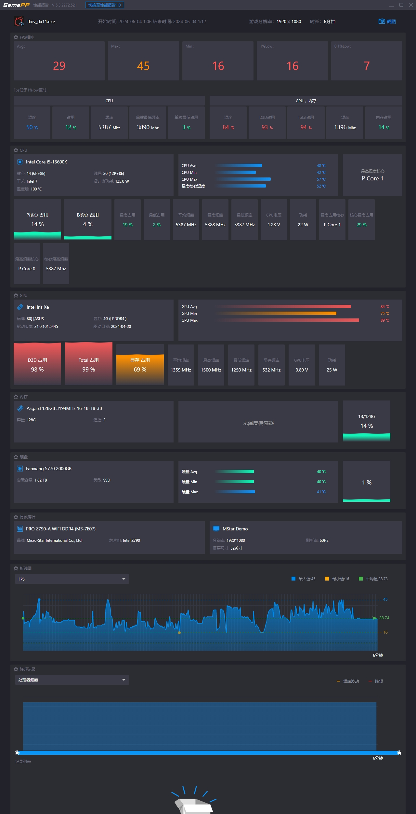
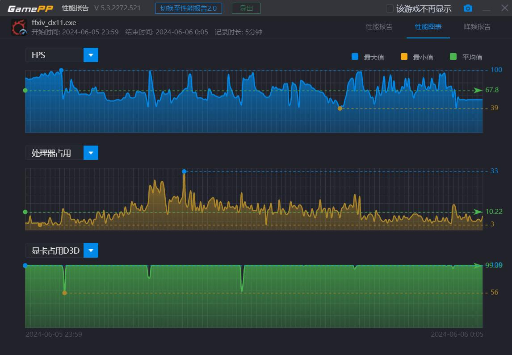

# 多图杀猫警告 非正经显卡在ff14 7.0跑分程序(ffxiv-dawntrail-bench_v11)的表现

# 前言
林林总总莫名其妙攒下了几张显卡，最近最终幻想14更新了新版本的跑分程序  
突然心血来潮就想看看手头几张卡是什么成绩  
本次测试均使用同一平台，CPU为13600K不会对显卡发挥构成瓶颈，内存肯定管够  
能构成瓶颈的卡买不起  
这就打开ffxiv-dawntrail-bench_v11，开跑  
游戏画质均选取HIGH(DESKTOP)档位  
每张卡都会分为结果展示，个人使用评价，数据展示三部分  
个人评价均为平常游玩时的体验，更多是偏向感想吐槽之类的  
至于数据分析，因为上个版本跑分的时候在群里吹水已经被狠狠打脸了，所以就不瞎分析了  
有能力的大手子可以自行分析顺便让我看看大佬们是怎么分析数据的  
# Intel(R) UHD Graphics 770
## 结果
我们的扛把子Intel桌面端核显，取得了2364分的好成绩  
total loading time是10.482  
  
  
## 个人使用评价
实际上这卡即便是开最低画质  
1080P连平时清日常打高随都不能流畅进行，挖宝都嫌弃的水平  
就算是蹲那搓收藏品，都有可能导致卡宏的存在  
但如果缩小窗口开个1280x760这样，还是可以一战的  
这卡就是纯纯陪跑图一乐的，没啥好说的  
但因为接下来两张卡与它有密不可分的关系，所以还是跑了  
## 相关数据
  
  
  

# Intel DG1
## 结果
可喜可贺，取得了4176分的好成绩  
差不多是UHD 770的两倍了  
total loading time是8.592  
  
  
  
## 个人使用评价
这卡在系统里叫Iris Xe Graphics，好像挺多卡会叫这个名字的  
虽然在7.0的跑分中表现依旧不佳  
是1080P清日常的守门员了，拿去挖挖图挖挖宝搓搓收藏品都是可以的  
甚至可以去刷刷天书之类的，不会很难受  
但注意这卡是被动散热，记得机箱风扇要开起来，不然用久了你搓收藏品还是会卡宏  
## 数据展示
  
  
  
# NVIDIA P106-090
## 结果
一代目沙场矿将，在FFXIV 7.0跑分中取得了5856的好成绩  
total loading time:9.559  
  
  
  
## 个人使用评价
矿场矿将一代目，只进过一次窑子的存在，至于现在本次测试这张，是没矿过的矿将  
至于为啥没矿过，它刚发行之后就从众多兄弟脱颖而出，栽在我手里有没有矿过我还不知道吗  
这卡吧，怎么说呢，是属于在关键地方会恶心你一下的存在  
没有视频编解码器，在你开着游戏复习攻略等鸽子进队的时候体验不会很好  
低画质会看不见学者占星白膜罩子的鬼故事历历在目  
低画质下1080P在大部分地方都能60帧流畅使用  
但你要是进高难，它恶心你的时候就到了  
比如说卡夫卡发动什么，遗弃末世啊制裁之光啊之类的，就会给你卡了  
还有hw放毒传毒的时候，就卡给你看  
还有在小火车上你也当不了SSD战士，读条时间有点久  
P106-090是一张适用于零式以下难度的卡  
注意，这里说的是P106-090，不是P106-100，这两个不是同一个东西  
## 数据展示
  
  
  
# NVIDIA GeForce GTX 1060 6G
## 结果
曾经steam的王中王，刚破一万分，取得了10017分的好成绩  
total loading time4.983  
这张卡开始，total loading time比较上文大幅降低  
  
  
  
## 个人游玩评价
这卡实际上跟P106-100是一个性能水平，但PCIe带宽大一些  
上面说的那个是P106-090不是一个东西啊  
但是毕竟是完全体，还是具备优势的，比如说有编解码器  
即便是进零式也没什么大病，不过因为这卡到手的时候已经是个T都能去当SSD战士了  
所以也不知道在魔列车上能不能当SSD战士  
这卡就是目前游玩看门的了，不知道下版本还好不好使  
本来是测P106-100的，可惜99元的它去了  
## 数据展示
  
  
  
# NVIDIA CMP 40HX
## 结果
这位新晋矿将，取得了15679的好成绩  
total loading time为5.432  
  

  
## 个人游玩评价
曾经358的真神，现在身价基本翻一番  
虽然PCIe版本是1.1，但加载时间就是比矿卡选手P106-100(未出现在本文)来得快  
这东西有编解码器，nvdec啥的都能用，一边看攻略一边等队友体验OK  
甚至还能开个录屏软件玩玩团灭复盘之类的(抓忠臣抓忠臣，玩高难就要抓忠臣)  
1080P下基本上就不存在什么问题开高画质也OK  
不过开4K就不大行了，至于2K怎么样我又没2K屏我怎么知道  
属于是那种画质可以高，分辨率不能高的偏科残疾选手，分辨率一高帧数就很难看  
是那种核心没吃满，但分辨率就是上不去的那种  
不过在这个跑分中竟然可以把dlss打开，试了一下还真能用，就很奇怪  
不是说这卡不能用dlss的么  
## 数据展示
  
  
  
# NVIDIA GeForce RTX 3070 Laptop GPU
## 结果
这位从移动端来桌面端再就业的选手，取得了19335分的好成绩  
total loading time为4.867  
  
  
  
## 个人游玩评价
1500块钱的16G显存的移动端再就业选手  
10DE 0000的全是QS卡，不信的可以去刷新的vbios，你看它会不会死给你看  
比起40HX，它的优势就是在高分辨率下使用  
其他的区别，在这游戏是真的不明显，也就这样了  
至于打一大堆画质美化mod的情况，我也没干过这事就不知道了  
## 数据展示

# 结束语
正经的卡没几个，奇怪的卡一大堆  
新版本我就拿40HX玩得了