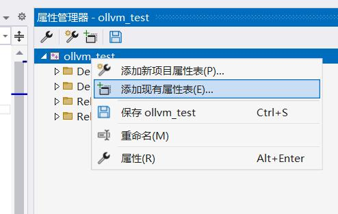
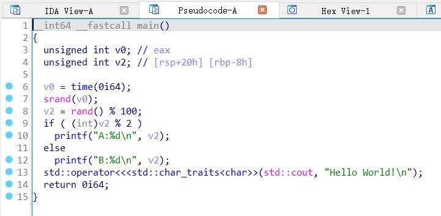

# 构建含有ollvm功能的LLVM(clang-cl)供Microsoft Visual Studio 2022使用
# 序言
OLLVM是一种在编译时对代码进行混淆的好东西，具体有啥好可以看后面

因为Microsoft Visual Studio 2022目前官方支持就是clang17  
因此本次的例子使用的llvm版本为17.0.6

各pass详细使用方法可以看这里  
https://github.com/HikariObfuscator/Hikari/wiki/Usage
# 安装Microsoft Visual Studio 2022
这个有啥说的，没有的不存在的  
# 自行构建含有OLLVM的Clang
## 安装cmake  
https://cmake.org/download/

这里以cmake-3.29.5-windows-x86_64.msi为例  
没啥好说的，一路next，不过记得  
  
这一步要点第二个，不然它不会加path，你cmd或者是powershell就找不到cmake

## 克隆仓库
找个剩余空间够大的地方  
```shell
git clone https://github.com/GreenDamTan/llvm-project_ollvm.git -b llvmorg-17.0.6_ollvm --depth 1 --recursive
```  
然后等它克隆完成  
```log
PS E:\git\GreenDamTan> git clone https://github.com/GreenDamTan/llvm-project_ollvm.git -b llvmorg-17.0.6_ollvm --depth 1 --recursive
Cloning into 'llvm-project_ollvm'...
remote: Enumerating objects: 138974, done.
remote: Counting objects: 100% (138974/138974), done.
remote: Compressing objects: 100% (107074/107074), done.
remote: Total 138974 (delta 31204), reused 88081 (delta 27760), pack-reused 0
Receiving objects: 100% (138974/138974), 200.01 MiB | 11.08 MiB/s, done.
Resolving deltas: 100% (31204/31204), done.
Updating files: 100% (132112/132112), done.

```
## 使用cmake进行configuration
https://clang.llvm.org/get_started.html  
按照官方文档指引，在目录下创建build文件夹  
随后启动`x64 Native Tools Command Prompt for VS 2022` 这玩意在开始菜单里面  
CD到build目录，执行以下命令  
```shell
cmake -DLLVM_ENABLE_PROJECTS="clang;lld;" -DLLVM_INCLUDE_TESTS=OFF -DLLVM_INCLUDE_EXAMPLES=OFF -DLLVM_INCLUDE_BENCHMARKS=OFF -G "Visual Studio 17 2022" -A x64 -Thost=x64 ..\llvm
```  
这里解释一下，我们只需要clang，不需要的可以去掉，但我这里有个人需求所以保留，至于那些OFF掉的，你们有需求可以删了保持默认ON

下面的输出仅供参考，尤其是那个plug支持，建议你抄上面的作业就好了  
<details>

<summary>
cmake日志
</summary>

```log
**********************************************************************
** Visual Studio 2022 Developer Command Prompt v17.11.0-pre.2.0
** Copyright (c) 2022 Microsoft Corporation
**********************************************************************
[vcvarsall.bat] Environment initialized for: 'x64'

C:\Program Files\Microsoft Visual Studio\2022\Preview>cd /d E:\git\GreenDamTan\llvm-project_ollvm\build

E:\git\GreenDamTan\llvm-project_ollvm\build>cmake -DLLVM_ENABLE_PROJECTS="clang;lld;" -DLLVM_INCLUDE_TESTS=OFF -DLLVM_INCLUDE_EXAMPLES=OFF -DLLVM_INCLUDE_BENCHMARKS=OFF -DLLVM_EXPORT_SYMBOLS_FOR_PLUGINS=ON -G "Visual Studio 17 2022" -A x64 -Thost=x64 ..\llvm
CMake Deprecation Warning at E:/git/GreenDamTan/llvm-project_ollvm/cmake/Modules/CMakePolicy.cmake:6 (cmake_policy):
  The OLD behavior for policy CMP0114 will be removed from a future version
  of CMake.

  The cmake-policies(7) manual explains that the OLD behaviors of all
  policies are deprecated and that a policy should be set to OLD only under
  specific short-term circumstances.  Projects should be ported to the NEW
  behavior and not rely on setting a policy to OLD.
Call Stack (most recent call first):
  CMakeLists.txt:6 (include)


CMake Deprecation Warning at E:/git/GreenDamTan/llvm-project_ollvm/cmake/Modules/CMakePolicy.cmake:11 (cmake_policy):
  The OLD behavior for policy CMP0116 will be removed from a future version
  of CMake.

  The cmake-policies(7) manual explains that the OLD behaviors of all
  policies are deprecated and that a policy should be set to OLD only under
  specific short-term circumstances.  Projects should be ported to the NEW
  behavior and not rely on setting a policy to OLD.
Call Stack (most recent call first):
  CMakeLists.txt:6 (include)


-- Selecting Windows SDK version 10.0.19041.0 to target Windows 10.0.19045.
-- The C compiler identification is MSVC 19.41.33923.0
-- The CXX compiler identification is MSVC 19.41.33923.0
-- The ASM compiler identification is MSVC
-- Found assembler: C:/Program Files/Microsoft Visual Studio/2022/Preview/VC/Tools/MSVC/14.41.33923/bin/Hostx64/x64/cl.exe
-- Detecting C compiler ABI info
-- Detecting C compiler ABI info - done
-- Check for working C compiler: C:/Program Files/Microsoft Visual Studio/2022/Preview/VC/Tools/MSVC/14.41.33923/bin/Hostx64/x64/cl.exe - skipped
-- Detecting C compile features
-- Detecting C compile features - done
-- Detecting CXX compiler ABI info
-- Detecting CXX compiler ABI info - done
-- Check for working CXX compiler: C:/Program Files/Microsoft Visual Studio/2022/Preview/VC/Tools/MSVC/14.41.33923/bin/Hostx64/x64/cl.exe - skipped
-- Detecting CXX compile features
-- Detecting CXX compile features - done
-- bolt project is disabled
-- clang project is enabled
-- clang-tools-extra project is disabled
-- compiler-rt project is disabled
-- cross-project-tests project is disabled
-- libc project is disabled
-- libclc project is disabled
-- lld project is enabled
-- lldb project is disabled
-- mlir project is disabled
-- openmp project is disabled
-- polly project is disabled
-- pstl project is disabled
-- flang project is disabled
-- Found Python3: C:/Program Files/Python310/python.exe (found suitable version "3.10.8", minimum required is "3.0") found components: Interpreter
-- Looking for dlfcn.h
-- Looking for dlfcn.h - not found
-- Looking for errno.h
-- Looking for errno.h - found
-- Looking for fcntl.h
-- Looking for fcntl.h - found
-- Looking for link.h
-- Looking for link.h - not found
-- Looking for malloc/malloc.h
-- Looking for malloc/malloc.h - not found
-- Looking for signal.h
-- Looking for signal.h - found
-- Looking for sys/ioctl.h
-- Looking for sys/ioctl.h - not found
-- Looking for sys/mman.h
-- Looking for sys/mman.h - not found
-- Looking for sys/param.h
-- Looking for sys/param.h - not found
-- Looking for sys/resource.h
-- Looking for sys/resource.h - not found
-- Looking for sys/stat.h
-- Looking for sys/stat.h - found
-- Looking for sys/time.h
-- Looking for sys/time.h - not found
-- Looking for sys/types.h
-- Looking for sys/types.h - found
-- Looking for sysexits.h
-- Looking for sysexits.h - not found
-- Looking for termios.h
-- Looking for termios.h - not found
-- Looking for unistd.h
-- Looking for unistd.h - not found
-- Looking for valgrind/valgrind.h
-- Looking for valgrind/valgrind.h - not found
-- Looking for fenv.h
-- Looking for fenv.h - found
-- Looking for FE_ALL_EXCEPT
-- Looking for FE_ALL_EXCEPT - found
-- Looking for FE_INEXACT
-- Looking for FE_INEXACT - found
-- Performing Test HAVE_BUILTIN_THREAD_POINTER
-- Performing Test HAVE_BUILTIN_THREAD_POINTER - Failed
-- Looking for mach/mach.h
-- Looking for mach/mach.h - not found
-- Looking for CrashReporterClient.h
-- Looking for CrashReporterClient.h - not found
-- Looking for pfm_initialize in pfm
-- Looking for pfm_initialize in pfm - not found
-- Could NOT find ZLIB (missing: ZLIB_LIBRARY ZLIB_INCLUDE_DIR)
-- Could NOT find LibXml2 (missing: LIBXML2_LIBRARY LIBXML2_INCLUDE_DIR)
-- Looking for xar_open in xar
-- Looking for xar_open in xar - not found
-- Looking for arc4random
-- Looking for arc4random - not found
-- Looking for backtrace
-- Looking for backtrace - not found
-- Could NOT find Backtrace (missing: Backtrace_LIBRARY Backtrace_INCLUDE_DIR)
-- Performing Test C_SUPPORTS_WERROR_UNGUARDED_AVAILABILITY_NEW
-- Performing Test C_SUPPORTS_WERROR_UNGUARDED_AVAILABILITY_NEW - Failed
-- Looking for __register_frame
-- Looking for __register_frame - not found
-- Looking for __deregister_frame
-- Looking for __deregister_frame - not found
-- Looking for __unw_add_dynamic_fde
-- Looking for __unw_add_dynamic_fde - not found
-- Looking for _Unwind_Backtrace
-- Looking for _Unwind_Backtrace - not found
-- Looking for getpagesize
-- Looking for getpagesize - not found
-- Looking for sysconf
-- Looking for sysconf - not found
-- Looking for getrusage
-- Looking for getrusage - not found
-- Looking for setrlimit
-- Looking for setrlimit - not found
-- Looking for isatty
-- Looking for isatty - not found
-- Looking for futimens
-- Looking for futimens - not found
-- Looking for futimes
-- Looking for futimes - not found
-- Looking for sigaltstack
-- Looking for sigaltstack - not found
-- Looking for mallctl
-- Looking for mallctl - not found
-- Looking for mallinfo
-- Looking for mallinfo - not found
-- Looking for mallinfo2
-- Looking for mallinfo2 - not found
-- Looking for malloc_zone_statistics
-- Looking for malloc_zone_statistics - not found
-- Looking for getrlimit
-- Looking for getrlimit - not found
-- Looking for posix_spawn
-- Looking for posix_spawn - not found
-- Looking for pread
-- Looking for pread - not found
-- Looking for sbrk
-- Looking for sbrk - not found
-- Looking for strerror_r
-- Looking for strerror_r - not found
-- Looking for strerror_s
-- Looking for strerror_s - found
-- Looking for setenv
-- Looking for setenv - not found
-- Looking for _chsize_s
-- Looking for _chsize_s - found
-- Looking for _alloca
-- Looking for _alloca - not found
-- Looking for __alloca
-- Looking for __alloca - not found
-- Looking for __chkstk
-- Looking for __chkstk - found
-- Looking for __chkstk_ms
-- Looking for __chkstk_ms - not found
-- Looking for ___chkstk
-- Looking for ___chkstk - not found
-- Looking for ___chkstk_ms
-- Looking for ___chkstk_ms - not found
-- Looking for __ashldi3
-- Looking for __ashldi3 - not found
-- Looking for __ashrdi3
-- Looking for __ashrdi3 - not found
-- Looking for __divdi3
-- Looking for __divdi3 - not found
-- Looking for __fixdfdi
-- Looking for __fixdfdi - not found
-- Looking for __fixsfdi
-- Looking for __fixsfdi - not found
-- Looking for __floatdidf
-- Looking for __floatdidf - not found
-- Looking for __lshrdi3
-- Looking for __lshrdi3 - not found
-- Looking for __moddi3
-- Looking for __moddi3 - not found
-- Looking for __udivdi3
-- Looking for __udivdi3 - not found
-- Looking for __umoddi3
-- Looking for __umoddi3 - not found
-- Looking for __main
-- Looking for __main - not found
-- Looking for __cmpdi2
-- Looking for __cmpdi2 - not found
-- Performing Test HAVE_STRUCT_STAT_ST_MTIMESPEC_TV_NSEC
-- Performing Test HAVE_STRUCT_STAT_ST_MTIMESPEC_TV_NSEC - Failed
-- Performing Test HAVE_STRUCT_STAT_ST_MTIM_TV_NSEC
-- Performing Test HAVE_STRUCT_STAT_ST_MTIM_TV_NSEC - Failed
-- Looking for __GLIBC__
-- Looking for __GLIBC__ - not found
-- Looking for proc_pid_rusage
-- Looking for proc_pid_rusage - not found
-- Performing Test LLVM_HAS_ATOMICS
-- Performing Test LLVM_HAS_ATOMICS - Success
-- Performing Test SUPPORTS_VARIADIC_MACROS_FLAG
-- Performing Test SUPPORTS_VARIADIC_MACROS_FLAG - Failed
-- Performing Test SUPPORTS_GNU_ZERO_VARIADIC_MACRO_ARGUMENTS_FLAG
-- Performing Test SUPPORTS_GNU_ZERO_VARIADIC_MACRO_ARGUMENTS_FLAG - Failed
-- Native target architecture is X86
-- Threads enabled.
-- Doxygen disabled.
-- Could NOT find OCaml (missing: OCAMLFIND OCAML_VERSION OCAML_STDLIB_PATH)
-- OCaml bindings disabled.
-- Could NOT find Python module pygments
-- Could NOT find Python module pygments.lexers.c_cpp
-- Could NOT find Python module yaml
-- LLVM host triple: x86_64-pc-windows-msvc
-- LLVM default target triple: x86_64-pc-windows-msvc
-- Looking for os_signpost_interval_begin
-- Looking for os_signpost_interval_begin - not found
-- Performing Test HAS_WERROR_GLOBAL_CTORS
-- Performing Test HAS_WERROR_GLOBAL_CTORS - Failed
-- Looking for _M_X64
-- Looking for _M_X64 - found
-- The ASM_MASM compiler identification is MSVC
-- Found assembler: C:/Program Files/Microsoft Visual Studio/2022/Preview/VC/Tools/MSVC/14.41.33923/bin/Hostx64/x64/ml64.exe
-- Found Git: D:/msys64/usr/bin/git.exe (found version "2.45.1")
-- Targeting AArch64
-- Targeting AMDGPU
-- Targeting ARM
-- Targeting AVR
-- Targeting BPF
-- Targeting Hexagon
-- Targeting Lanai
-- Targeting LoongArch
-- Targeting Mips
-- Targeting MSP430
-- Targeting NVPTX
-- Targeting PowerPC
-- Targeting RISCV
-- Targeting Sparc
-- Targeting SystemZ
-- Targeting VE
-- Targeting WebAssembly
-- Targeting X86
-- Targeting XCore
CMake Deprecation Warning at E:/git/GreenDamTan/llvm-project_ollvm/cmake/Modules/CMakePolicy.cmake:6 (cmake_policy):
  The OLD behavior for policy CMP0114 will be removed from a future version
  of CMake.

  The cmake-policies(7) manual explains that the OLD behaviors of all
  policies are deprecated and that a policy should be set to OLD only under
  specific short-term circumstances.  Projects should be ported to the NEW
  behavior and not rely on setting a policy to OLD.
Call Stack (most recent call first):
  E:/git/GreenDamTan/llvm-project_ollvm/clang/CMakeLists.txt:6 (include)


CMake Deprecation Warning at E:/git/GreenDamTan/llvm-project_ollvm/cmake/Modules/CMakePolicy.cmake:11 (cmake_policy):
  The OLD behavior for policy CMP0116 will be removed from a future version
  of CMake.

  The cmake-policies(7) manual explains that the OLD behaviors of all
  policies are deprecated and that a policy should be set to OLD only under
  specific short-term circumstances.  Projects should be ported to the NEW
  behavior and not rely on setting a policy to OLD.
Call Stack (most recent call first):
  E:/git/GreenDamTan/llvm-project_ollvm/clang/CMakeLists.txt:6 (include)


-- Looking for sys/resource.h
-- Looking for sys/resource.h - not found
-- Clang version: 17.0.6
CMake Deprecation Warning at E:/git/GreenDamTan/llvm-project_ollvm/cmake/Modules/CMakePolicy.cmake:6 (cmake_policy):
  The OLD behavior for policy CMP0114 will be removed from a future version
  of CMake.

  The cmake-policies(7) manual explains that the OLD behaviors of all
  policies are deprecated and that a policy should be set to OLD only under
  specific short-term circumstances.  Projects should be ported to the NEW
  behavior and not rely on setting a policy to OLD.
Call Stack (most recent call first):
  E:/git/GreenDamTan/llvm-project_ollvm/lld/CMakeLists.txt:6 (include)


CMake Deprecation Warning at E:/git/GreenDamTan/llvm-project_ollvm/cmake/Modules/CMakePolicy.cmake:11 (cmake_policy):
  The OLD behavior for policy CMP0116 will be removed from a future version
  of CMake.

  The cmake-policies(7) manual explains that the OLD behaviors of all
  policies are deprecated and that a policy should be set to OLD only under
  specific short-term circumstances.  Projects should be ported to the NEW
  behavior and not rely on setting a policy to OLD.
Call Stack (most recent call first):
  E:/git/GreenDamTan/llvm-project_ollvm/lld/CMakeLists.txt:6 (include)


-- LLD version: 17.0.6
-- BugpointPasses ignored -- Loadable modules not supported on this platform.
-- Configuring done (98.0s)
-- Generating done (6.3s)
-- Build files have been written to: E:/git/GreenDamTan/llvm-project_ollvm/build
```

</details>

## 使用VS2022构建llvm
随后进入build文件夹，打开生成的LLVM.sln  
  
直接构建clang即可，然后等待半小时  
  

# 我不想自己构建行不行
https://github.com/GreenDamTan/llvm-project_ollvm/releases  
直接下载构建好的，也不是不行  


# 为VS2022添加clang支持组件


如图所示，在单个组件中勾选第一个，因为我们要防止clang被莫名其妙更新，所以不勾选第二个

# 替换llvm-clang为自己编译的版本
https://github.com/llvm/llvm-project/releases/tag/llvmorg-17.0.6

首先下载官方版本的llvm17，也就是LLVM-17.0.6-win64.exe

直接一路安装就完事了，然后把构建出来的几个clang开头的exe都丢进去  
  
# 为自己的项目指定clang目录
https://learn.microsoft.com/zh-cn/cpp/build/clang-support-msbuild?view=msvc-170#custom_llvm_toolset

根据文档，我们新建`Directory.build.props`
```xml
<Project>
  <PropertyGroup>
    <LLVMInstallDir>C:\Program Files\LLVM</LLVMInstallDir>
    <LLVMToolsVersion>17.0.6</LLVMToolsVersion>
  </PropertyGroup>
</Project>
```
放在项目目录中，或者是其他可以访问到的地方

添加属性表，选择刚刚创建的文件

然后更换平台工具集至LLVM(clang-cl)

至此，基本工作已经完成

# 测试ollvm
以以下代码为例

取时间作为seed，然后生成随机数除以100取余，双数输出A，单数输出B

然后hello world

```cpp
#include <iostream>

int main()
{
    srand((unsigned)time(NULL));
    int tmo = rand() % 100;
    if (tmo %2) {
        printf("A:%d\n", tmo);
    }
    else
    {
        printf("B:%d\n", tmo);
    };
    std::cout << "Hello World!\n";
}
```
测试几个看起来明显的功能

下文给出的参数，是填进这里用的

## 未启用功能时  
  
  
## Enable Bogus Control Flow
-mllvm -enable-bcfobf  
  
  
## Enable Control Flow Flattening
-mllvm -enable-cffobf  
  
  
## Register-Based Indirect Branching
-mllvm -enable-indibran  
  
  
## Function Wrapper
-mllvm -enable-funcwra  
  
  
## 全开
-mllvm -enable-allobf  
  
  
  
# 结束语
把OLLVM打开，妈妈再也不用担心别人发现我写的代码差了