# 飞牛私有云 fnOS公测版遇到的问题(1)
# 前言
最近一款nas系统横空出世，那就是飞牛私有云 fnOS  
在体验了一阵子后，我对这东西有了个大概的评价：未来可期

对比了一下感觉过阵子群辉那个DSM就要打不过这东西了  

既然这篇文章是说问题的，那就说问题吧  
夸的话就交给其他UP了

这篇文章也不是什么文档之类的，就用比较口语的措辞来写吧
# 疑似BUG
## 下载任务展示的文件错乱
### 复现步骤
同时下载两个bt  
点击任务A后，切换至其他tab(如常规)  
点击任务B，切换回任务B  
再点击文件tab，可见文件中展示了两个任务的文件  
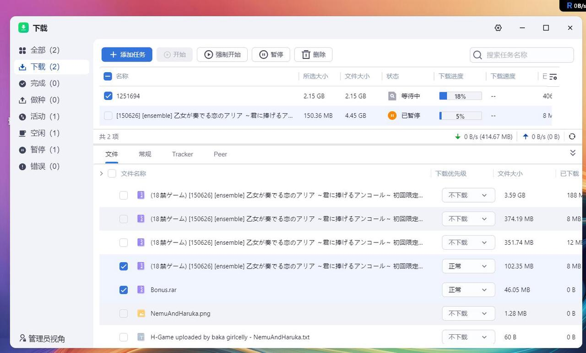  
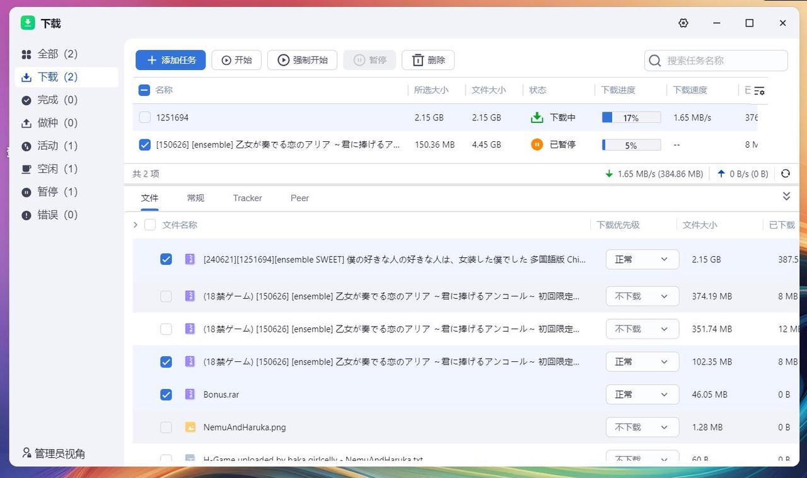  
仅选择下载任务1251694，展示了150626的文件
## 使用按钮控制下载任务，生效目标错误
这个没有视频看不出来，反馈的时候给他们那个收集页传了视频了  
大概描述一下就是，选择的是150626这个任务，点击强制开始，被操作的是1251694任务  
不过俺寻思可能是那个钩的问题，应该是改进建议吧，但感觉提一档当bug也成
  
## GPU加速打开报错
如图所示，man，what can i say  
独显不行  

核显也不行  
  
## 安装影视提示初始化脚本失败
非必现，但很高发  

## 写死了核显相关的配置
7d55是吧，其他核显用户的感受考虑一下啊  
guc=3，默认大家都用12代以上核显是吧  
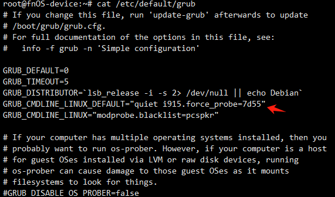  
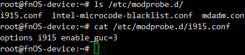  
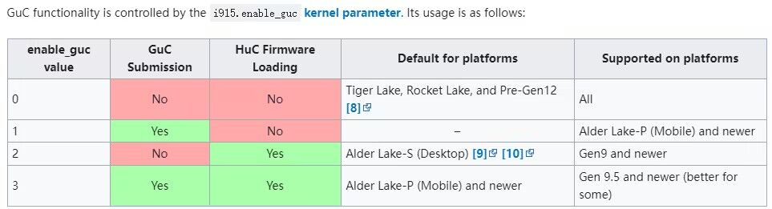  
# 改进建议
这段我觉得就不是bug了，算是建议了  
## 默认开启但拒绝一切的nfs
你默认都拒绝了，为啥默认要打开呢，nfs默认关了不就好了  
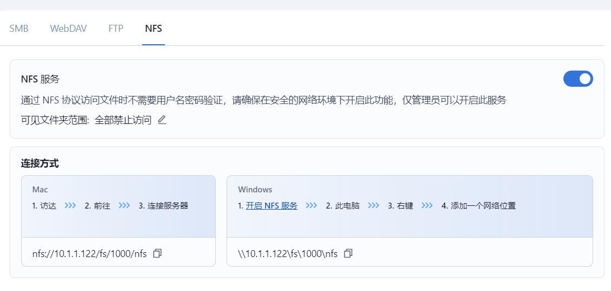  
## 系统日志未汉化完全
如图所示，有一些还是没汉化完，正常人可能看不懂  
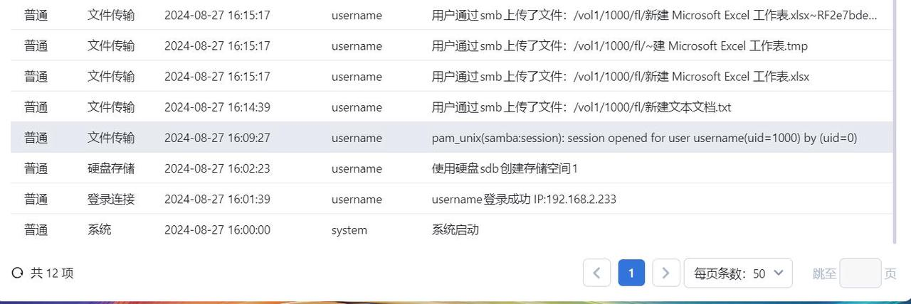
## 双击下载任务会暂停或开启任务
如图所示，双击任务会暂停或开启任务  
当你遇见一个单击会双击的烂鼠标，你就知道多痛苦了  

## 未提供内核头文件，无法适配设备
这个6.6.38-trim的内核，能不能给个头文件包啊  
不然有一些设备驱动都不好上  
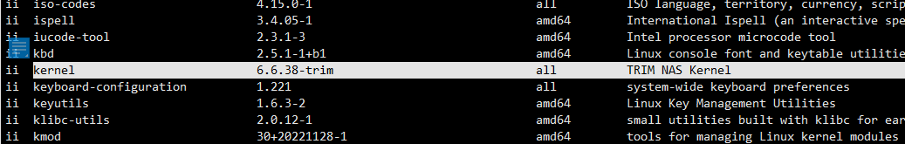
## 默认使用了nouveau驱动
这个其实不是什么大问题  
就是新N卡直接用不了罢了，默认大家都用古董亮机卡确实是个保底策略  
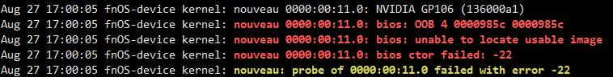
## 魔改了acl
这个没啥好放图的，魔改了记得给个文档，这个是排查io问题的时候发现的  
复现很简单，mount -o remount,rw,noacl (后面自己补)  
重新挂载完vol1，你会发现套件啥的都访问不了文件了  
## 莫名其妙带个NVIDIA的560.28.03版本的库文件
首先，这个系统目前是没有NVIDIA驱动的，但是莫名其妙带个库文件  
/usr/trim/lib/libnvidia-ml.so.560.28.03  
这玩意难不成是用来获取N卡状态的？  
然后等你好不容易把驱动干上去后  
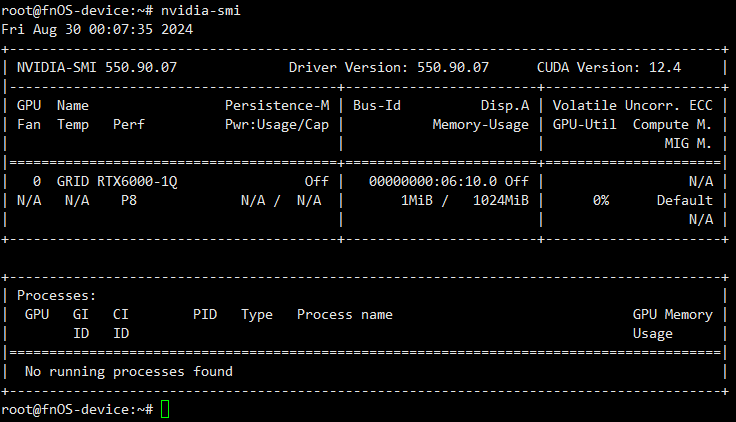  
这个报错噔噔咚好吧，还得去patch驱动的rm_perform_version_check解决  
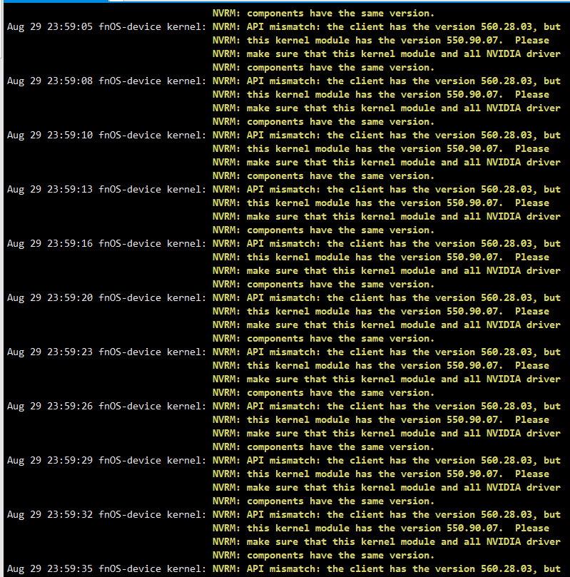  
直接这样带个某版本的库，感觉不大合适  
这个建议根据实际情况选，弄个套件之类的形式  
用开普勒以下的用R470以下的，Maxwell还有Pascal的用R535的，更新一点的用R550的，提供选择会比较好
## 没有iscsi
缺了这玩意，感觉少了很重要的东西  
## 多队列IO性能问题（存疑）  
因为fnOS目前没有虚拟机系统  
我又想试试虚拟机，就赶紧把PVE那套东西适配了上去   
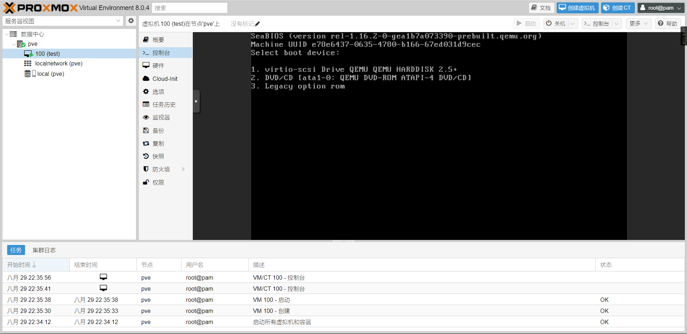  
这个Linux 6.6.35-trim的内核没割kvm好评  
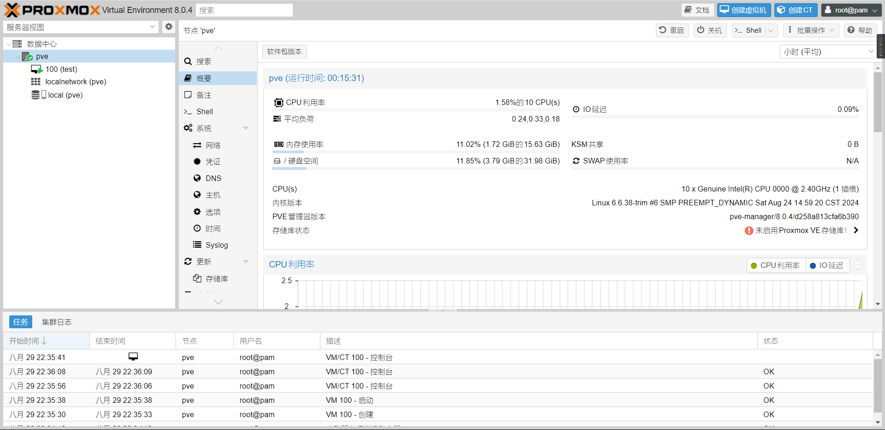  
但是在虚拟机测试IO的时候发现，IO性能有些崩  
不过也不知道是因为PVE的问题还是这个系统本身就有问题  
又或者说的我机器的问题  
# 结束语
大半夜总结了一下这两天的体验  
就这样吧，那个新游戏《旭光のマリアージュ》发布了  
我先去玩游戏了，这个nas系统体验估计先到这里了  
瑕不掩瑜啊，公测完成度挺高的啊