# 飞牛私有云fnOS公测版强塞nvidia驱动(1)
# 前言  
这几天挺多人私信我是怎么把NVIDIA驱动塞进去的  
我的建议是等官方动手，毕竟自己强塞的肯定是不如他们弄好的  
不过如果你确实是想塞，这里可以提供个思路  

最近找到工作上班去了，不是我高冷不回复啊  
写这篇随笔算是对近期bilibili的私信与评论以及群友的私聊作一个统一回复

里面的图是拿6.6.38重新补的，之前就没想着写这个随笔  
如果与文字描述不同请以文字为准

这篇东西显然不是一篇文档，文档要是写成这样可以被人喷死了  
提纲没有摘要没有，想到哪里写到哪里的那种

# 偷龙转凤搞headers
之前弄的时候是6.6.35-trim，现在是6.6.38-trim了  
fnOS官方没有提供完整的包，那就只能试试看代餐了  
反正去git之类的地方搞一份官方的linux源码，直接编译  

可以参考文档https://wiki.debian.org/BuildADebianKernelPackage

依赖之类的自己看文档解决一下  
至于.config就从fnOS里面/boot/config-$(uname -r)偷一份拿来用  
然后编译的时候记得不要自己搞config了，用旧的会保险点  
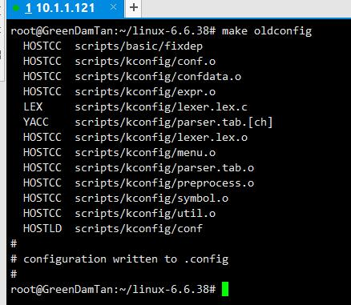  
运气好的话``make -j`nproc` bindeb-pkg``就能开始编译了  
图里的make是我今天补图的时候忘记了，应该用上面给出的这个  
大概要等五分钟这样，如果你的电脑比我好的话应该是会更短  
如果用make的话单线程估计得把时间乘以64倍了  
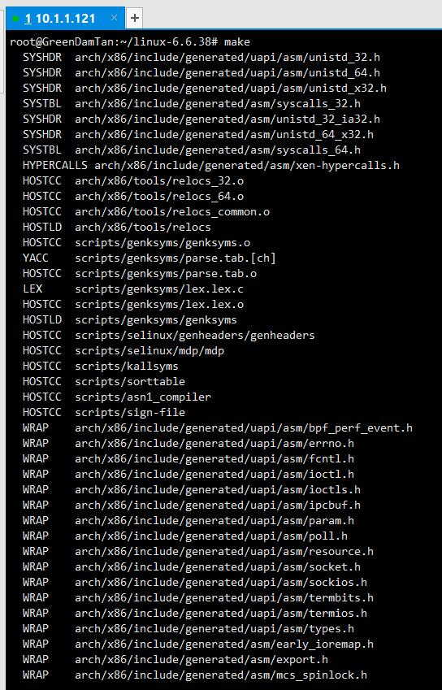  
# fnOS安装依赖与包
把那个构建出来的headers丢到fnOS里面，然后装上  
至于你是想ssh还是怎么丢都可以，我是用scp的  
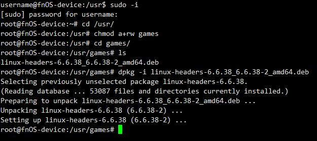  
随后尝试安装依赖，此时会有一个libc6=2.36-9+deb12u8这样的东西  
这个版本号可能在你操作的时候就变了，不要生搬硬套  
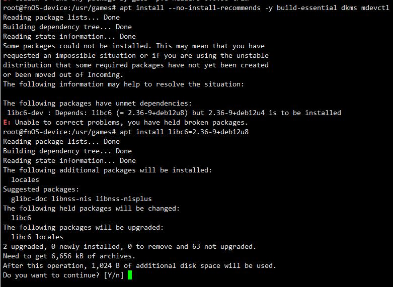  
单独把它装上再继续装build-essential dkms
# patch并安装驱动
记得去patch不然会有一堆日志报错跟你说版本不匹配之类的  
还有其他各种各样的问题，反正熟读nvidia源码的话就是见招拆招，没啥好说的  
版本那个你vi进去直接:/?关键词一下就找到了  
其他问题你看panic日志就行，vaapi那个我不建议修，egl那些你用的上就自己搞  
解压驱动可以用`--extract-only --target`  
到这里的时候选否，因为这东西在fnOS就没必要选是  
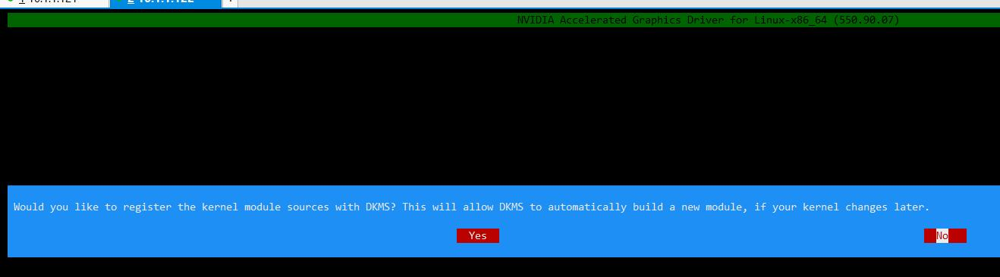
# 初步检查安装情况  
一般来说不会有什么问题，公式化的看看日志还有nvidia-smi就完事了  
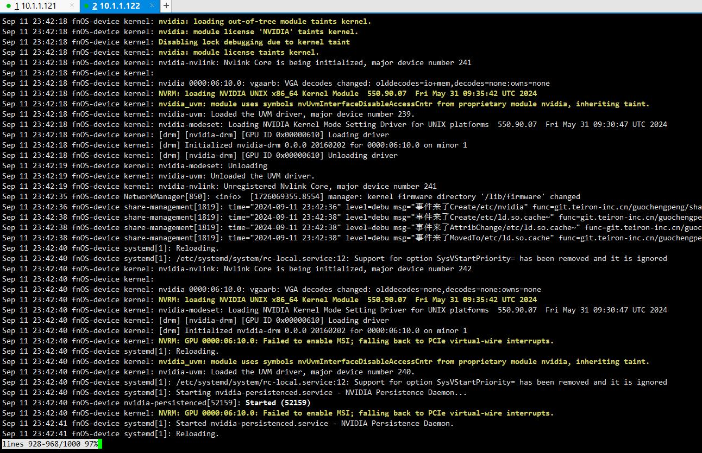  
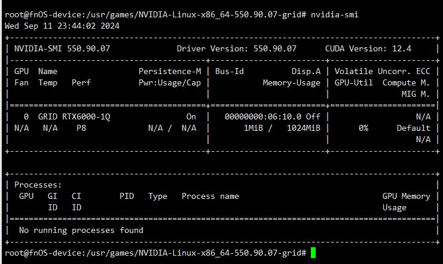
# 获取授权
如果你跟我一样是vGPU用户，那记得拿一下授权  
如果是不是虚拟出来的显卡就无需关注这步  
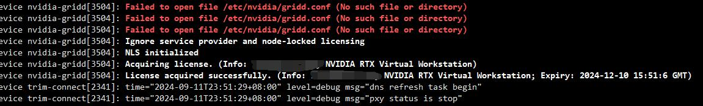  
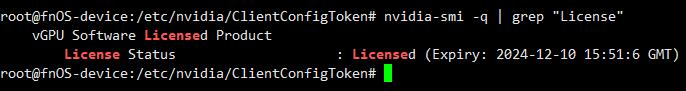  
# 负载检验
如果你看见的是这样，啥都读不到，那就要替换一下库文件  
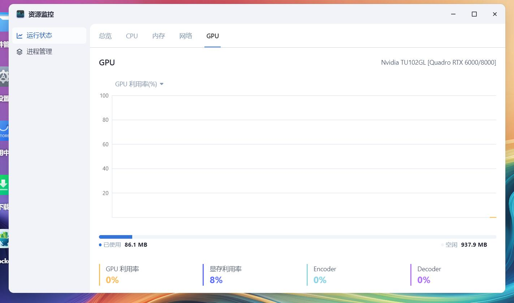  
```shell
rm /usr/trim/lib/libnvidia-ml*
ln -s /usr/lib/x86_64-linux-gnu/libnvidia-ml.so /usr/trim/lib/libnvidia-ml.so
ln -s /usr/lib/x86_64-linux-gnu/libnvidia-ml.so.1 /usr/trim/lib/libnvidia-ml.so.1
```  
替换完重启，随便给点负载，能看见它正确读到数据就行  
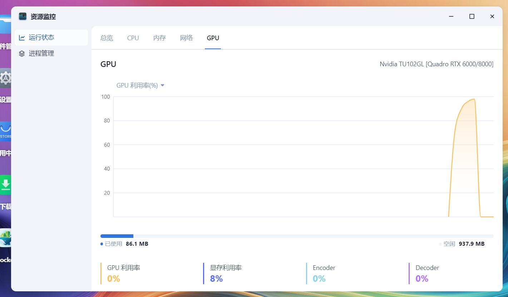  
# 未完待续？
过程大概就是这个过程，也没有啥技术含量  
有一说一驱动用--no-kernel-module安装  
把那几个构建好的ko拿出来然后手动加载那也能用，甚至不需要自己编译  
要的人多的话就丢个链接得了，主要是这玩意现在没有使用价值  
fnOS那些应用都没适配，总不能拿着与docker斗智斗勇吧  
vaapi那块我建议等他们用nvenc与nvdec，谁搁着用N卡还用vaapi那些东西啊