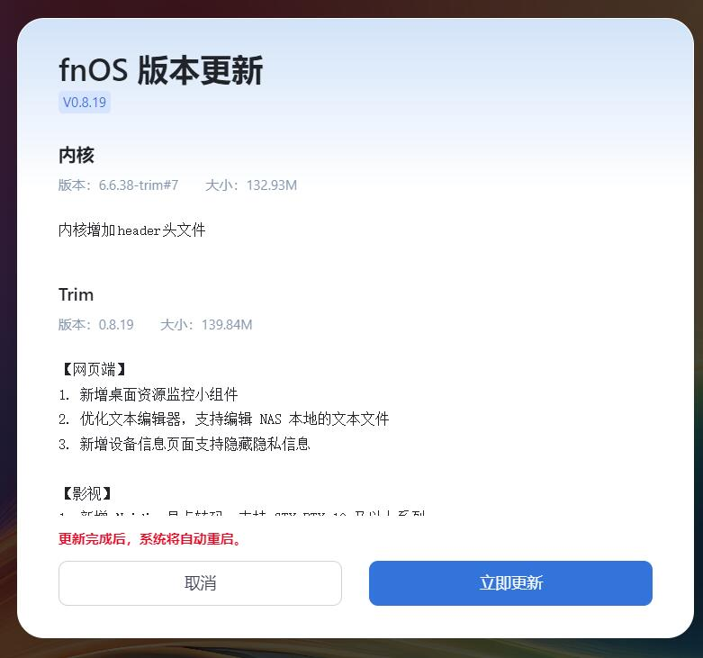

# 飞牛私有云fnOS公测版使用vGPU-Grid驱动
# 前言
近日那个突然爆火的fnOS突然支持了nvidia的GPU驱动  
驱动版本的R560这个分支的，而且还是普通驱动，因此不支持vGPU也是正常现象  
最近有许多群友说没vGPU很难受的，反正我自己也要用  
所以就尝试弄个
# 准备工作
## 提示
任何操作都是有风险的，请提前备份好自己的数据

该做的我都做了，东西编译好了  
不需要你自己下载build-essential dkms之类的依赖  
然后苦哈哈的自己弄十几分钟  

因为我现在在用Grid17.2，因此提供的就是550.90.07版本的驱动  
你需要自行检查你的宿主机驱动也是Grid17的  
如果是其他Grid版本的话，应该是用不了的  
没记错的话nv只对同一个大版本提供兼容性

如果有小朋友需要其他版本的话可以在下面留言  
需求多的情况会考虑也提供一下
## 更新系统与应用
这篇文章使用的是下面版本  
如果你的版本不一致可能会出现意料之外的情况  
  
  
不过这个fnOS一天更新三次，版本不一样也没办法  
不强求版本一致，但注意最低版本不能低于截图中的版本  
# 给虚拟机分配mdev
这里以PVE为例，向fnOS虚拟机分配一个vGPU  
  
就跟正常的虚拟机一样分配就行，这步没有特殊操作  
# 上传驱动文件  
将如下两个文件上传至fnOS中
```log
nv_grid_merge_fnOS_6.6.38-trim_ko.tar.zst
NVIDIA-Linux-x86_64-550.90.07-grid-vgpu-kvm-patched.run
```  
  
那个zst压缩的是编译好的ko驱动，虽然nvidia有Precompiled打包的方法  
[Adding Precompiled Kernel Interfaces to the Installer Package](https://download.nvidia.com/XFree86/Linux-x86_64/550.90.07/README/installdriver.html#AddingPrecompil0c783)  
但是这个方法实际上是有坑的，所以我自己是不打算用的  
# 获取驱动文件原始存储位置  
fnOS那个文件管理器的界面，可以直接复制原始路径

  
此处的zst文件在  
`/vol1/1000/fl/nv_grid_merge_fnOS_6.6.38-trim_ko.tar.zst`

  
此处的run文件在  
`/vol1/1000/fl/NVIDIA-Linux-x86_64-550.90.07-grid-vgpu-kvm-patched.run`
# 预配置
## 获取root权限
使用sudo -i即可切换到root权限  
输入你当前用户的密码即可  
输入密码时不会有显示是正常现象

有一说一我就没见过哪个发行版输入密码会有反馈的  
输入错误的话就再输入几次试试  
```log
Linux fnOS-device 6.6.38-trim #7 SMP PREEMPT_DYNAMIC Fri Sep  6 10:17:01 CST 2024 x86_64
Last login: Mon Sep 16 00:46:11 2024 from 192.168.2.233
username@fnOS-device:~$ sudo -i
[sudo] password for username: 
root@fnOS-device:~# 
```  
怎么判断是否是root权限呢？  
聪明的小朋友已经发现了  
最明显特征就是那个#号  
## 屏蔽nouveau
有一个叫nouveau的开源驱动，如果不屏蔽可能会有一些不必要的麻烦  
```log
root@fnOS-device:~# echo "blacklist nouveau" >> /etc/modprobe.d/blacklist-nouveau.conf
```
写完配置就行
# 安装驱动  
## 解压kernel module  
还记得刚刚的zst压缩包吗，这里就要用到了

先创建一个目录
```shell
mkdir -p /usr/games/6.6.38-trim_nvidia
```  
然后再把这些ko文件解压进去  
zst文件的目录小朋友要根据自己的实际情况修改哦
```shell
tar -I zstd -xvf /vol1/1000/fl/nv_grid_merge_fnOS_6.6.38-trim_ko.tar.zst -C /usr/games/6.6.38-trim_nvidia
```  
正常来说中端的回显会是像下面一样  
```log
root@fnOS-device:~# mkdir -p /usr/games/6.6.38-trim_nvidia
root@fnOS-device:~# tar -I zstd -xvf /vol1/1000/fl/nv_grid_merge_fnOS_6.6.38-trim_ko.tar.zst -C /usr/games/6.6.38-trim_nvidia
nvidia-drm.ko
nvidia.ko
nvidia-modeset.ko
nvidia-peermem.ko
nvidia-uvm.ko
nvidia-vgpu-vfio.ko
```
## 安装驱动包  
执行下面两句脚本即可  
这里的run文件位置也要按实际情况修改哦  
```shell
chmod +x /vol1/1000/fl/NVIDIA-Linux-x86_64-550.90.07-grid-vgpu-kvm-patched.run
/vol1/1000/fl/NVIDIA-Linux-x86_64-550.90.07-grid-vgpu-kvm-patched.run --no-kernel-modules
```  
因为添加了`--no-kernel-modules`  
会出现与正常安装Grid驱动不一样的地方  
  
这个是正常现象
## 替换fnOS自带的libnvidia-ml.so
使用以下的shell命令，把fnOS的libnvidia-ml替换了
```shell
rm /usr/trim/lib/{libnvidia-ml.so,libnvidia-ml.so.1}
ln -s /usr/lib/x86_64-linux-gnu/libnvidia-ml.so /usr/trim/lib/libnvidia-ml.so
ln -s /usr/lib/x86_64-linux-gnu/libnvidia-ml.so.1 /usr/trim/lib/libnvidia-ml.so.1
```  
如果不替换也可以用，但是fnOS的资源监控不能显示  
## 下载vGPU授权
这个跟正常的Grid驱动下载授权是一样的  
所以这里我们不说授权怎么搭，建议参考其他文章  
先是创建授权文件夹
```shell
mkdir -p /etc/nvidia/ClientConfigToken
```
然后下载授权文件，这步就不需要细说了  
下面直接给出终端回显供大家参考  
```log
root@fnOS-device:~# mkdir -p /etc/nvidia/ClientConfigToken
root@fnOS-device:~# curl --insecure -L -X GET https://10.1.1.1:443/-/client-token -o /etc/nvidia/ClientConfigToken/client_configuration_token_$(date '+%d-%m-%Y-%H-%M-%S').tok
  % Total    % Received % Xferd  Average Speed   Time    Time     Time  Current
                                 Dload  Upload   Total   Spent    Left  Speed
100  2694    0  2694    0     0  38915      0 --:--:-- --:--:-- --:--:-- 38485
root@fnOS-device:~# ls /etc/nvidia/ClientConfigToken
client_configuration_token_16-09-2024-01-09-34.tok
```
# 加载驱动
## 加载kernel module
只是需要使用Grid驱动功能的话是不需要加载nvidia-vgpu-vfio.ko的  
正常来说单卡机器也不需要nvidia-peermem.ko的  
使用如下insmod命令即可  
```log
modprobe video
insmod /usr/games/6.6.38-trim_nvidia/nvidia.ko
insmod /usr/games/6.6.38-trim_nvidia/nvidia-uvm.ko
insmod /usr/games/6.6.38-trim_nvidia/nvidia-modeset.ko
insmod /usr/games/6.6.38-trim_nvidia/nvidia-drm.ko
nvidia-smi -pm 1
```  
记得切换persistence mode，别忘了这个  
好多人会忘记这个的

正常来说ssh回显应该是与如下基本一致  
```log
root@fnOS-device:~# insmod /usr/games/6.6.38-trim_nvidia/nvidia.ko
root@fnOS-device:~# insmod /usr/games/6.6.38-trim_nvidia/nvidia-uvm.ko
root@fnOS-device:~# insmod /usr/games/6.6.38-trim_nvidia/nvidia-modeset.ko
root@fnOS-device:~# insmod /usr/games/6.6.38-trim_nvidia/nvidia-drm.ko
root@fnOS-device:~# nvidia-smi -pm 1
Enabled persistence mode for GPU 00000000:01:00.0.
root@fnOS-device:~# nvidia-smi
Mon Sep 16 01:14:01 2024       
+-----------------------------------------------------------------------------------------+
| NVIDIA-SMI 550.90.07              Driver Version: 550.90.07      CUDA Version: 12.4     |
|-----------------------------------------+------------------------+----------------------+
| GPU  Name                 Persistence-M | Bus-Id          Disp.A | Volatile Uncorr. ECC |
| Fan  Temp   Perf          Pwr:Usage/Cap |           Memory-Usage | GPU-Util  Compute M. |
|                                         |                        |               MIG M. |
|=========================================+========================+======================|
|   0  GRID RTX6000-1Q                Off |   00000000:06:10.0 Off |                  N/A |
| N/A   N/A    P8             N/A /  N/A  |       1MiB /   1024MiB |      0%      Default |
|                                         |                        |                  N/A |
+-----------------------------------------+------------------------+----------------------+
                                                                                         
+-----------------------------------------------------------------------------------------+
| Processes:                                                                              |
|  GPU   GI   CI        PID   Type   Process name                              GPU Memory |
|        ID   ID                                                               Usage      |
|=========================================================================================|
|  No running processes found                                                             |
+-----------------------------------------------------------------------------------------+
```  
## 加载授权
不加载授权的vGPU就是5个奥特曼，众所周知奥特曼只能活动三分钟  
这个vGPU未授权是15分钟后就不行了  
虽然可以通过配置延长到24小时，但是直接给个授权更方便  
之前我们已经把授权下载进机器里面了  
因此只需要重启服务即可  
```shell
systemctl restart nvidia-gridd
```
重启完服务后可以看看服务状态  
```shell
systemctl status nvidia-gridd
```
正常来说你的回显也应该与下面的差不多  
```log
root@fnOS-device:~# systemctl restart nvidia-gridd
root@fnOS-device:~# systemctl status nvidia-gridd
● nvidia-gridd.service - NVIDIA Grid Daemon
     Loaded: loaded (/lib/systemd/system/nvidia-gridd.service; enabled; preset: enabled)
     Active: active (running) since Mon 2024-09-16 01:16:29 CST; 11s ago
    Process: 3238 ExecStart=/usr/bin/nvidia-gridd (code=exited, status=0/SUCCESS)
   Main PID: 3239 (nvidia-gridd)
      Tasks: 4 (limit: 19156)
     Memory: 4.4M
        CPU: 511ms
     CGroup: /system.slice/nvidia-gridd.service
             └─3239 /usr/bin/nvidia-gridd

Sep 16 01:16:29 fnOS-device nvidia-gridd[3239]: Failed to open file /etc/nvidia/gridd.conf (No such file or directory)
Sep 16 01:16:29 fnOS-device nvidia-gridd[3239]: Failed to open file /etc/nvidia/gridd.conf (No such file or directory)
Sep 16 01:16:29 fnOS-device nvidia-gridd[3239]: Failed to open file /etc/nvidia/gridd.conf (No such file or directory)
Sep 16 01:16:29 fnOS-device nvidia-gridd[3239]: Failed to open file /etc/nvidia/gridd.conf (No such file or directory)
Sep 16 01:16:29 fnOS-device nvidia-gridd[3239]: Failed to open file /etc/nvidia/gridd.conf (No such file or directory)
Sep 16 01:16:29 fnOS-device nvidia-gridd[3239]: Failed to open file /etc/nvidia/gridd.conf (No such file or directory)
Sep 16 01:16:29 fnOS-device nvidia-gridd[3239]: Ignore service provider and node-locked licensing
Sep 16 01:16:29 fnOS-device nvidia-gridd[3239]: NLS initialized
Sep 16 01:16:30 fnOS-device nvidia-gridd[3239]: Acquiring license. (Info: 192.168.2.196; NVIDIA RTX Virtual Workstation)
Sep 16 01:16:31 fnOS-device nvidia-gridd[3239]: License acquired successfully. (Info: 192.168.2.196, NVIDIA RTX Virtual Workstation; Expiry: 2024-12-14 17:16:31 GMT)
```  
在nvidia-smi中也能看见授权状态  
```shell
nvidia-smi -q |grep License
```
上面这个命令的执行力回显应该与下面的结果相似  
```log
root@fnOS-device:~# nvidia-smi -q |grep License
    vGPU Software Licensed Product
        License Status                    : Licensed (Expiry: 2024-12-14 17:16:31 GMT)
```  
# 测试
首先需要将系统与影视更新到最新版本
## 测试飞牛影视
在套件中开启GPU加速  

随后尝试播放视频  
可见已经使用了vGPU进行加速  
  
如果是下图这种情况，那就是影视套件版本过低    
编码方式与解码方式都为空  


此时看看系统占用  

正常来说应该是如图所示  
# 持久化  
有一说一真没啥必要，真要做的话我习惯用service   
先写个文件加载ko的
```shell
cat <<EOF > /usr/games/6.6.38-trim_nvidia/load-nv-grid.sh
#!/bin/bash
modprobe video
insmod /usr/games/6.6.38-trim_nvidia/nvidia.ko
insmod /usr/games/6.6.38-trim_nvidia/nvidia-uvm.ko
insmod /usr/games/6.6.38-trim_nvidia/nvidia-modeset.ko
insmod /usr/games/6.6.38-trim_nvidia/nvidia-drm.ko
nvidia-smi -pm 1
systemctl restart nvidia-gridd
EOF
```  
记得给个权限
```shell
chmod +x /usr/games/6.6.38-trim_nvidia/load-nv-grid.sh
```
然后再写个服务  
```shell
cat <<EOF > /lib/systemd/system/load-nv-grid.service
[Unit]
Description=load-nv-grid
[Service]
ExecStart=/usr/games/6.6.38-trim_nvidia/load-nv-grid.sh
[Install]
WantedBy=multi-user.target
EOF
```
重载、启用、启动、查看状态，一气呵成  
```shell
systemctl daemon-reload 
systemctl enable load-nv-grid.service
systemctl start load-nv-grid.service
systemctl status load-nv-grid.service
```  
如果你本次启动已经insmod过了，服务日志有错误也是正常现象  
不过我是觉得没必要持久化的
# 移除
当你不需要这个，想转投官方套件时  
如果做了持久化，那就把服务停了删了  
然后  
```shell
NVIDIA-Linux-x86_64-550.90.07-grid-vgpu-kvm-patched.run -uninstall
```
删除文件  
再把`/usr/games/6.6.38-trim_nvidia`这个文件夹删掉  
接着还原被替换的libnvidia-ml.so链接即可

# 关于其他nvidia驱动版本
## 535.183.06 Grid 16.7
该版本已经尝试构建  
```log
root@fnOS-device:~# nvidia-smi && uname -a
Sat Oct 17 23:25:55 2024       
+---------------------------------------------------------------------------------------+
| NVIDIA-SMI 535.183.06             Driver Version: 535.183.06   CUDA Version: 12.2     |
|-----------------------------------------+----------------------+----------------------+
| GPU  Name                 Persistence-M | Bus-Id        Disp.A | Volatile Uncorr. ECC |
| Fan  Temp   Perf          Pwr:Usage/Cap |         Memory-Usage | GPU-Util  Compute M. |
|                                         |                      |               MIG M. |
|=========================================+======================+======================|
|   0  GRID P4-2Q                     On  | 00000000:02:03.0 Off |                    0 |
| N/A   N/A    P0              N/A /  N/A |    886MiB /  2048MiB |      9%      Default |
|                                         |                      |             Disabled |
+-----------------------------------------+----------------------+----------------------+
                                                                                         
+---------------------------------------------------------------------------------------+
| Processes:                                                                            |
|  GPU   GI   CI        PID   Type   Process name                            GPU Memory |
|        ID   ID                                                             Usage      |
|=======================================================================================|
|    0   N/A  N/A     10410      C   /usr/trim/bin/mediasrv                      886MiB |
+---------------------------------------------------------------------------------------+
Linux NAS-A 6.6.38-trim #34 SMP PREEMPT_DYNAMIC Wed Sep 25 16:22:17 CST 2024 x86_64 GNU/Linux
```  
  
# 结束语
这个fnOS一天三更新，不大适合自己折腾  
没准好不容易折腾完，官方就立刻跟进支持了  
或者是东西弄完，官方更新直接创死  
直接白干好吧