# 在飞牛私有云fnOS公测版中使用docker跑PVE

# 前言
当前版本的fnOS没有提供虚拟机功能  
我这种人是离开虚拟机一天就浑身难受的存在  
因此在fnOS中部署个虚拟机自然就是顺理成章的事情  

如果进行过大的修改，污染了宿主机环境可能会影响稳定性  
折中来看docker是一个比较好的隔离方案  

由于我用习惯了Proxmox VE不想用其他的，故此部署个dockerPVE也是合理的  
在之前的文章也提及了一下，但未详细说明部署的方式  
[飞牛私有云 fnOS公测版遇到的问题(1)](../010111_wrong_with_fnOS_beta_1/index.md)

这个dockerPVE在群辉里头是个鸡肋，但到了fnOS似乎就有改善了  
[在群晖中使用docker跑ProxmoxVE](../../../2022/09/050940_dockerPVE_in_ds918/index.md)  
毕竟群辉那个配置跑啥都卡  

# 准备
## 检查kvm支持
确定一下你的环境是支持kvm的

这个你要自己检查，至于用`cat /proc/cpuinfo | egrep 'vmx|svm'`  
还是什么别的方法，就看你自己了  
## 准备好docker并初始化
安装并初始化好fnOS的docker  
这个部分没什么好说的，图形化界面一步步来就是

# 修改网络配置
如虚拟机无需网络支持可以不进行本节配置  
如可接受使用qemu args添加网络也无需按本节进行配置  

## 已知问题
按本节操作配置后，在fnOS系统页面不能正常展示网络信息  
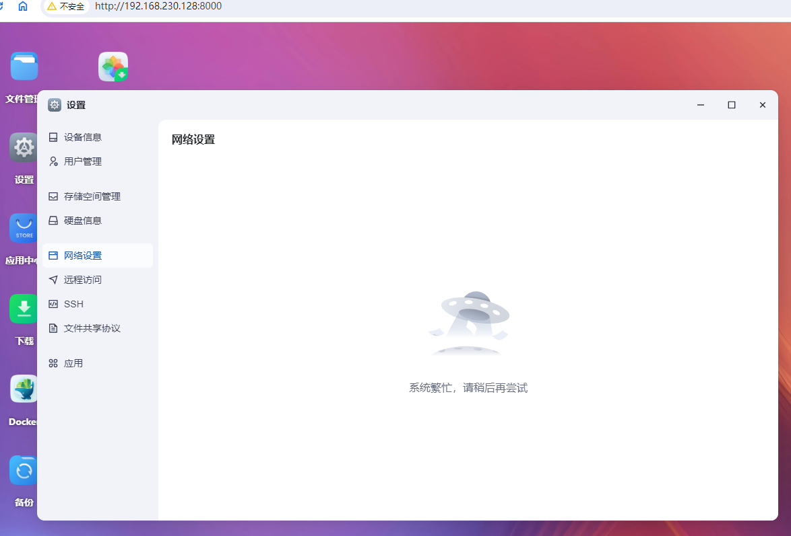

## 获取主网络接口名称与mac地址
首先获取一下你网口的mac地址  

先看看你的管理口叫什么  
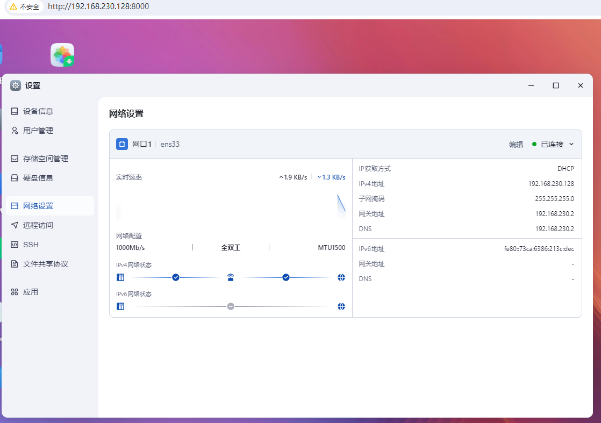  
我这里如图所示是ens33  
执行命令  
```shell
ip a
```  
命令执行的回显如下所示  
```log
username@fnos:/$ ip a
1: lo: <LOOPBACK,UP,LOWER_UP> mtu 65536 qdisc noqueue state UNKNOWN group default qlen 1000
    link/loopback 00:00:00:00:00:00 brd 00:00:00:00:00:00
    inet 127.0.0.1/8 scope host lo
       valid_lft forever preferred_lft forever
    inet6 ::1/128 scope host noprefixroute 
       valid_lft forever preferred_lft forever
2: ens33: <BROADCAST,MULTICAST,UP,LOWER_UP> mtu 1500 qdisc mq state UP group default qlen 1000
    link/ether 00:0c:29:08:af:47 brd ff:ff:ff:ff:ff:ff
    inet 192.168.230.128/24 brd 192.168.230.255 scope global dynamic noprefixroute ens33
       valid_lft 77093sec preferred_lft 77093sec
```
可得ens33接口的mac是00:0c:29:08:af:47  
## 安装ifupdown2
直接一个命令,没什么好说的  
```shell
apt install ifupdown2 bridge-utils
```  
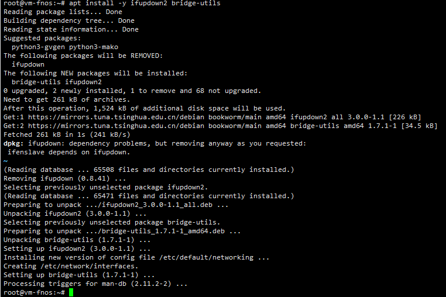

## 配置/etc/network/interfaces
使用vim或者是nano什么的，把`/etc/network/interfaces`改改  
其中的`00:0c:29:08:af:47`是我刚刚获得ens33的mac地址时记录的    
ens33是刚刚获知的主要网口名称  
```log
# interfaces(5) file used by ifup(8) and ifdown(8)
auto lo
iface lo inet loopback

auto ens33
iface ens33 inet manual

auto vmbr0
iface vmbr0 inet dhcp
	bridge-ports ens33
    hwaddress ether 00:0c:29:08:af:47 
	bridge-stp off
	bridge-fd 0
```  
随后运行`ifreload -a`再运行`reboot`重启系统  
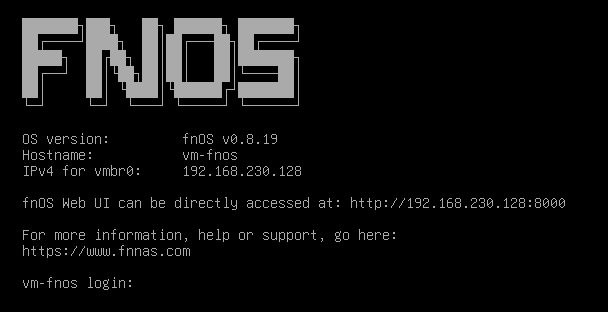  
重启后一般就会是这样  
vmbr0就是我们刚刚创建的桥  
记住画面中的这个IP：`192.168.230.128`  

如果不复用mac地址会造成dhcp获取的IP变更  
如图所示，复用mac地址后，获得的IP与之前ens33获得的IP一致  
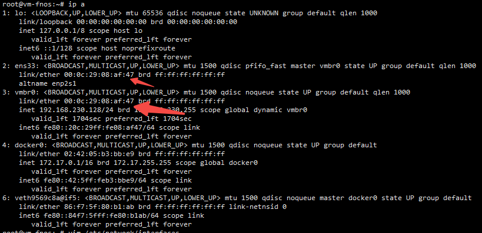
# 运行docker PVE

## 创建必要目录
如图所示，创建一个PVE文件夹  
并复制原始路径  
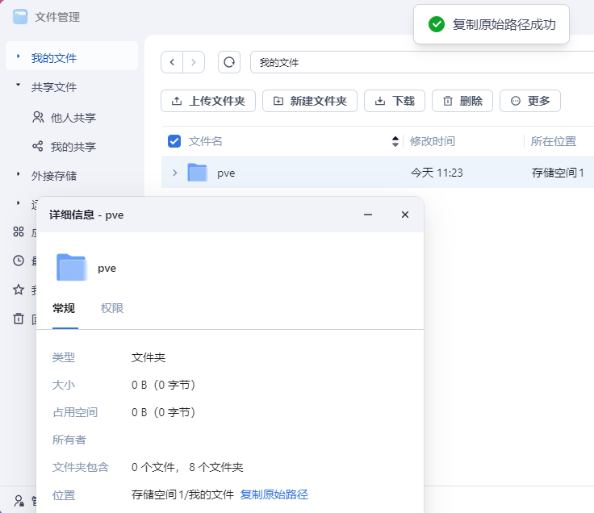  
这里的例子是`/vol1/1000/pve`  

## 运行docker PVE
如下命令根据实际情况替换  
192.168.230.128替换为你vmbr0获得的IP  
/vol1/1000/pve替换为你创建PVE文件夹后复制的原始路径  
```shell
docker run -idt --network host --privileged --name pve --add-host pve:192.168.230.128 --hostname pve -v /etc/network/interfaces:/etc/network/interfaces -v /vol1/1000/pve:/var/lib/vz  makedie/proxmox_ve:8.2.4
```  
## 创建vmbr0配置
这一节是创建vmbr0配置  
实际上也只是创建配置罢了  
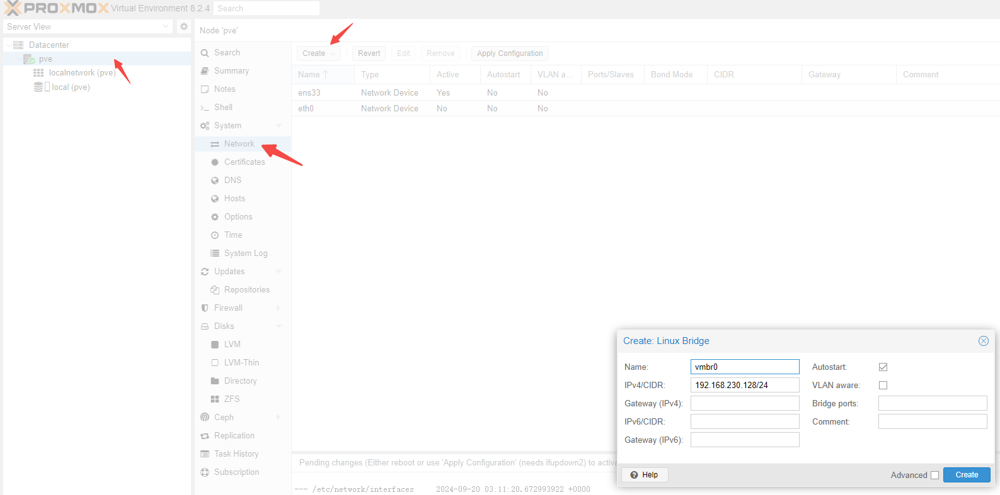  
如上图所示，创建一个vmbr配置  
但不需要点击那个`Apply Configuration`  

# 访问docker PVE
本例地址为`https://192.168.230.128:8006/`  
打开后输入用户名root，密码root后即进入PVE后台  
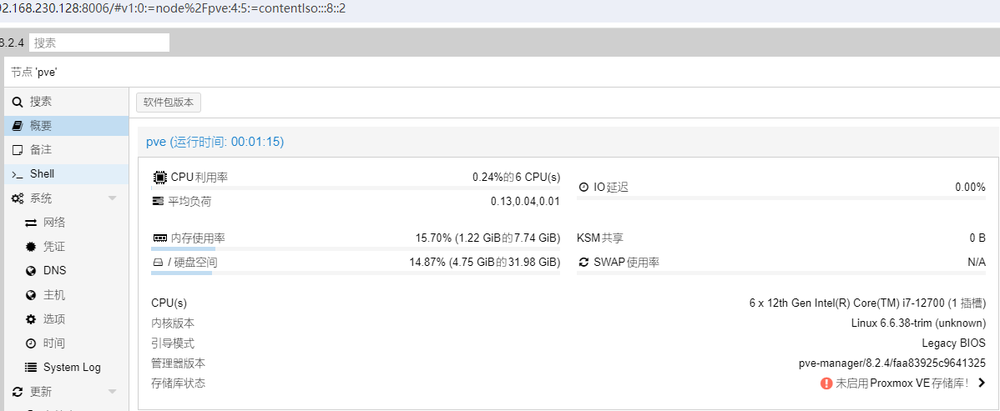
## 注意事项
由于fnOS的内核未启用iommu，故目前直通功能无法使用    
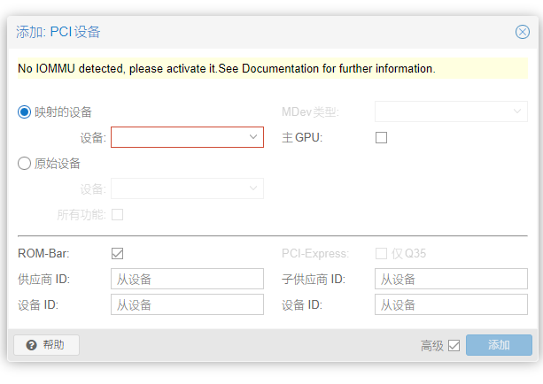  
有需要的用户可以自己试试开了搞搞，我是没有这个方面的需求

# 上传镜像
由于已经映射了`/var/lib/vz`目录  
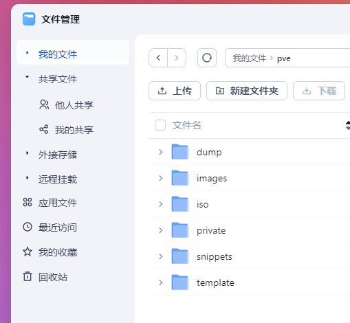  
因此直接将镜像上传至fnOS的web端文件管理中即可  
  

# 创建虚拟机
按PVE正常创建虚拟机流程创建即可  

其中初次安装系统时网卡推荐使用E1000以获得最佳兼容性  
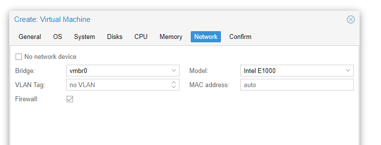  

本次案例使用一个winPE作为演示，正常系统也是可以用的  
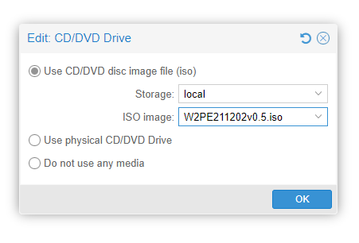

# 虚拟机验证
按PVE正常流程启动创建的虚拟机即可  
## 外部网络验通
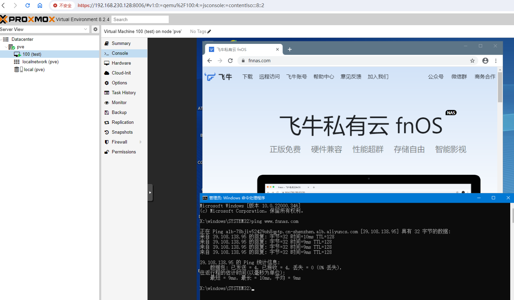
如图所示，外部网络正常访问  
## 本地回环网络验通
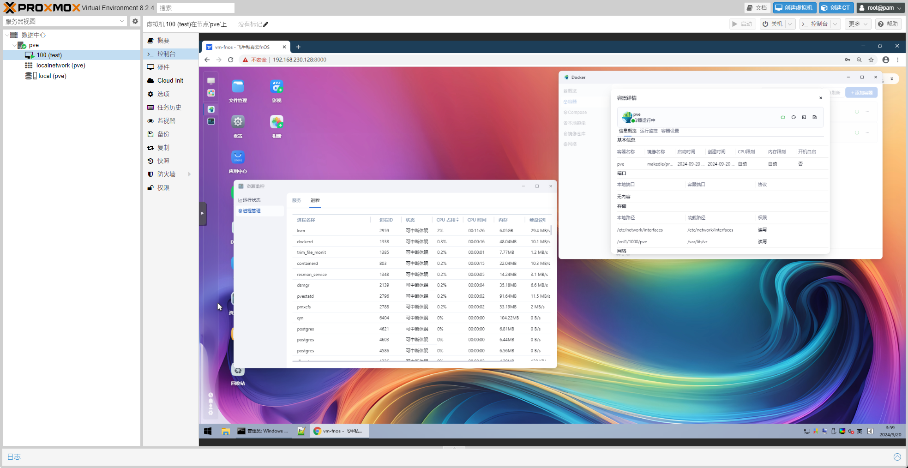  
如图所示，虚拟机内访问宿主机nas页面正常

# 结束语
终究还是PVE扛下了所有  
所以fnOS官方虚拟机功能什么时候出来