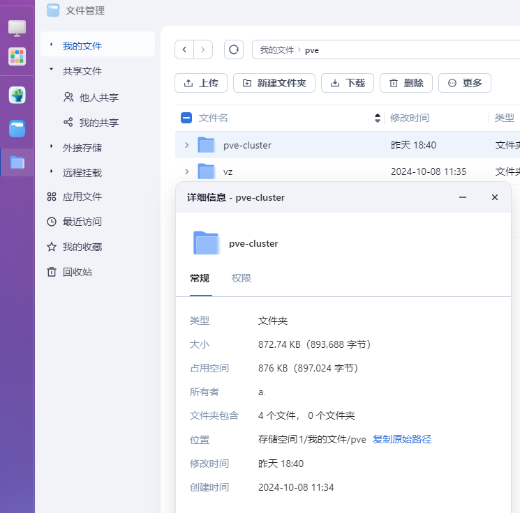
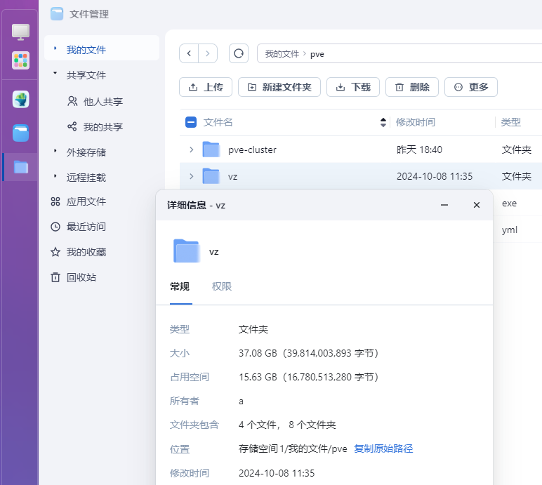
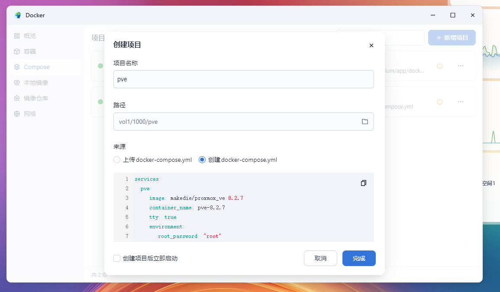
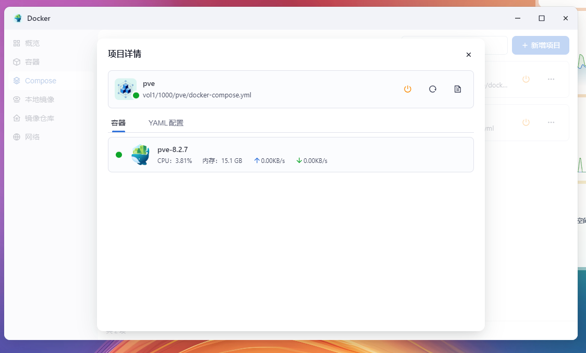
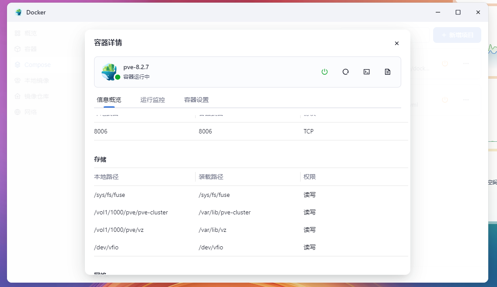
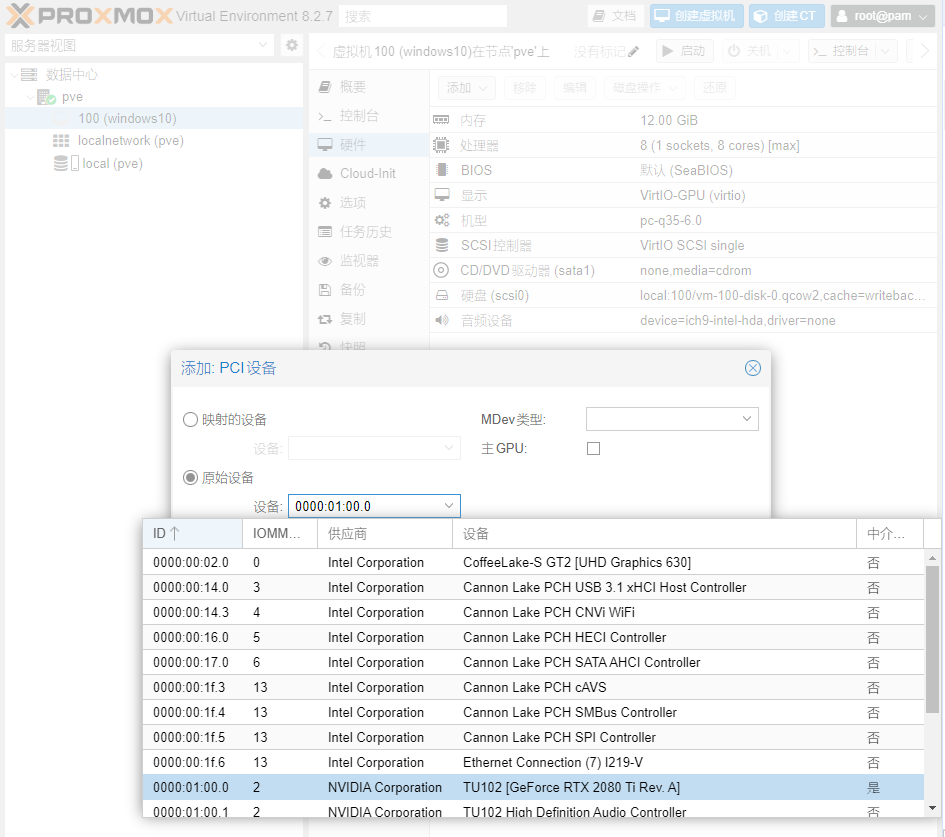
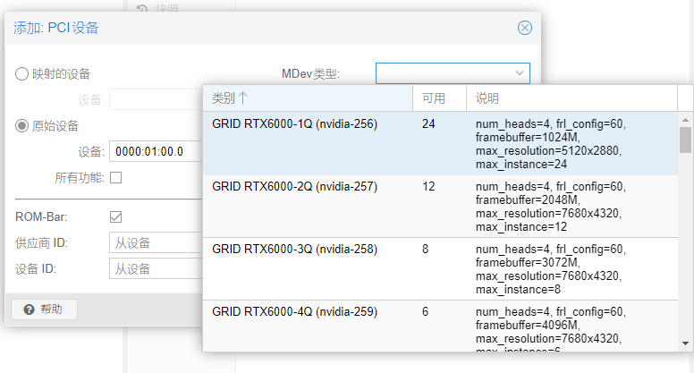
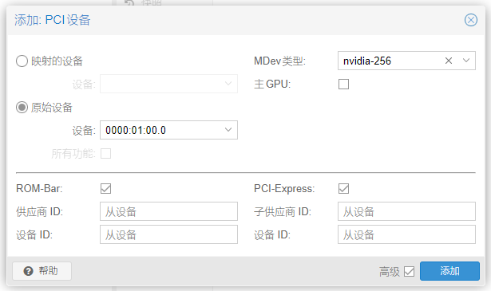
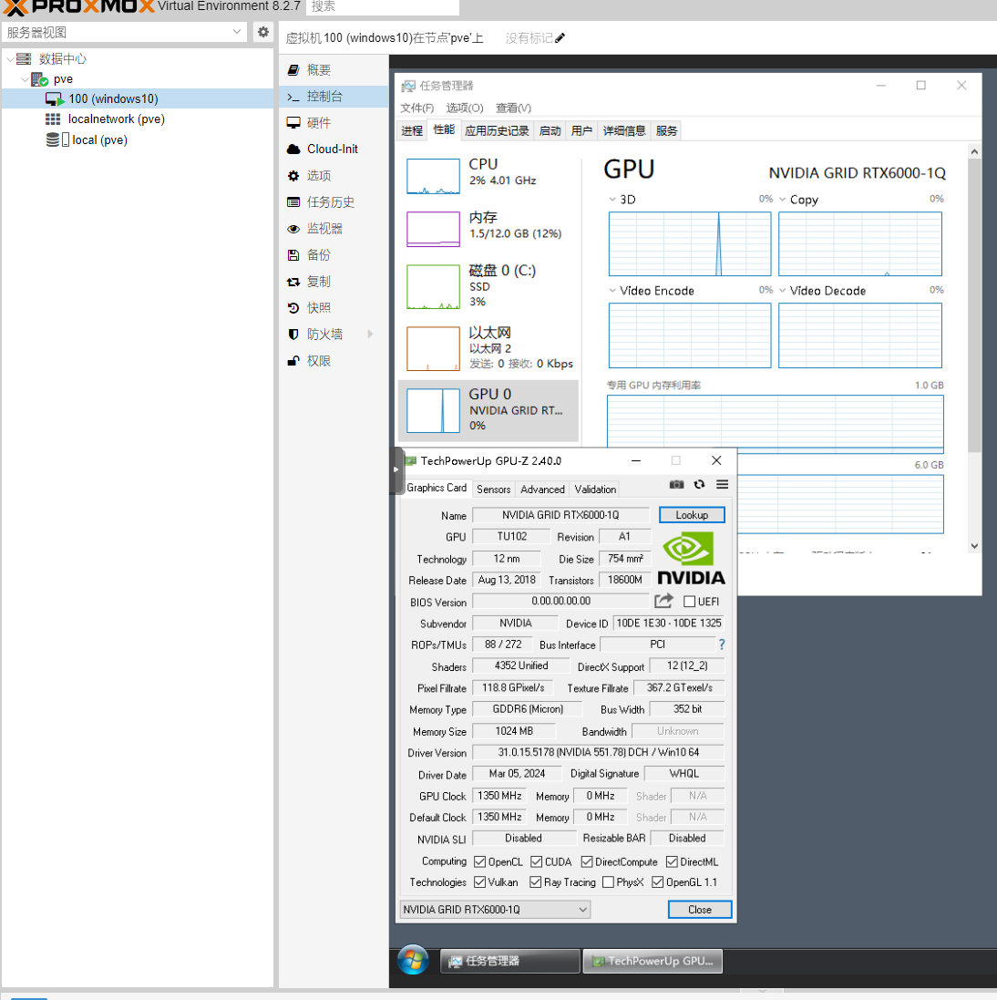

# 在fnOS中用docker PVE跑虚拟机并使用nVidia vGPU


# 在docker PVE中使用nVidia vGPU


# 前言
众所周知，PVE的一大乐趣就是拿着nVidia显卡开vGPU  
docker PVE自然也是具备开vGPU的能力  
没有GPU加速的虚拟机感觉鼠标移动都是卡的

本篇实际上是以下两篇文章的补充，在阅读本文前请先阅读下面两文  
[在飞牛私有云fnOS公测版中使用docker跑PVE](../../09/201200_run_docker_pve_in_fnos/index.md)  
[飞牛私有云fnOS公测版使用vGPU-Grid驱动](../../09/152251_use_nvidia_vgpu_grid_driver_in_fnOS/index.md)

**本文不构成医疗建议，不构成任何投资建议，也不作为任何法律法规、监管政策的依据。**    
**折腾有风险，操作需谨慎。**

# 环境配置
## 示例环境说明
本次示例使用的系统是基于Debian12的fnOS 0.8.20  
内核版本：Linux fnOS 6.6.38-trim #34 SMP PREEMPT_DYNAMIC Wed Sep 25 16:22:17 CST 2024 x86_64 GNU/Linux  
nVidia显卡是NVIDIA GeForce RTX 2080 Ti  
CPU是Intel(R) Core(TM) i9-9900KS CPU @ 4.00GHz  
bios中开启虚拟化与IOMMU

本文虽然是以fnOS作为例子  
但只要配置好宿主机驱动、iommu等配置  
是可以在其他系统上（如x86_64的openwrt）重现该操作的  
如果你使用的是其他系统，请根据实际情况自行调整

## vfio
使用如下命令将配置写入`/etc/modules`即可  
```shell
echo -e "vfio\nvfio_iommu_type1\nvfio_pci\nvfio_virqfd" >> /etc/modules
```  
## grub中加入iommu相关参数
本例中使用的内核未默认开启iommu，需要自行配置内核的cmdline以启用该特性  
使用如下命令打开vim编辑器  
```shell
vim /etc/default/grub
```  
在`GRUB_CMDLINE_LINUX_DEFAULT`加入`intel_iommu=on iommu=pt`  
就像下面这样  
```shell
GRUB_CMDLINE_LINUX_DEFAULT="quiet i915.force_probe=7d55 intel_iommu=on iommu=pt spectre_v2=off"
```  

如果你的系统使用的不是grub引导，请根据实际情况选择其他方案  
systemd-boot需要修改`/etc/kernel/cmdline`

如果你使用的是AMD平台，请将开启iommu的参数修改为对应平台的

## 更新grub
让妙妙屋出现我们必须要念奇妙的咒语  
在终端输入并执行以下命令  
```shell
update-grub && update-initramfs -u -k all && reboot
```  
等待更新grub与重启

## 重启后验证内核cmdline
使用如下命令检查内核cmdline  
```shell
cat /proc/cmdline 
```  
如果你的回显像下面这样，有出现`intel_iommu=on iommu=pt`说明内核cmdline修改成功  
```log
root@fnOS:~# cat /proc/cmdline 
BOOT_IMAGE=/boot/vmlinuz-6.6.38-trim root=UUID=800335a8-8496-44a9-ba84-1df17424f553 ro modprobe.blacklist=pcspkr quiet i915.force_probe=7d55 intel_iommu=on iommu=pt spectre_v2=off
```

# 载入nVidia vGPU驱动
首先需要按如下文章，配置好nVidia驱动  
[飞牛私有云fnOS公测版使用vGPU-Grid驱动](../../09/152251_use_nvidia_vgpu_grid_driver_in_fnOS/index.md)  
才能继续接下来的操作  
## 加载nvidia-vgpu-vfio.ko
使用如下命令，加载模块即可  
```shell
modprobe vfio-pci
modprobe vfio
modprobe mdev
insmod /usr/games/6.6.38-trim_nvidia/nvidia-vgpu-vfio.ko
```

## 重载vGPU服务  
使用如下命令，重载vGPU相关服务  
```shell
mkdir -p /etc/vgpu_unlock
echo '' >> /etc/vgpu_unlock/profile_override.toml
systemctl restart {nvidia-vgpud.service,nvidia-vgpu-mgr.service}
systemctl status {nvidia-vgpud.service,nvidia-vgpu-mgr.service}
```
systemctl status的回显大概会像下面这样  
```log
root@fnOS:~# systemctl status {nvidia-vgpud.service,nvidia-vgpu-mgr.service}
○ nvidia-vgpud.service - NVIDIA vGPU Daemon
     Loaded: loaded (/lib/systemd/system/nvidia-vgpud.service; enabled; preset: enabled)
     Active: inactive (dead) since Thu 2024-10-11 00:01:32 CST; 1s ago
    Process: 470457 ExecStart=/usr/bin/nvidia-vgpud (code=exited, status=0/SUCCESS)
   Main PID: 470457 (code=exited, status=0/SUCCESS)
        CPU: 160ms

Oct 10 19:26:32 fnOS nvidia-vgpud[470457]: Encoder Capacity: 0x64
Oct 10 19:26:32 fnOS nvidia-vgpud[470457]: BAR1 Length: 0x100
Oct 10 19:26:32 fnOS nvidia-vgpud[470457]: Frame Rate Limiter enabled: 0x1
Oct 10 19:26:32 fnOS nvidia-vgpud[470457]: Number of Displays: 1
Oct 10 19:26:32 fnOS nvidia-vgpud[470457]: Max pixels: 1310720
Oct 10 19:26:32 fnOS nvidia-vgpud[470457]: Display: width 1280, height 1024
Oct 10 19:26:32 fnOS nvidia-vgpud[470457]: Multi-vGPU Exclusive supported: 0x1
Oct 10 19:26:32 fnOS nvidia-vgpud[470457]: License: GRID-Virtual-Apps,3.0
Oct 10 19:26:32 fnOS systemd[1]: nvidia-vgpud.service: Deactivated successfully.
Oct 10 19:26:32 fnOS systemd[1]: Finished nvidia-vgpud.service - NVIDIA vGPU Daemon.

● nvidia-vgpu-mgr.service - NVIDIA vGPU Manager Daemon
     Loaded: loaded (/lib/systemd/system/nvidia-vgpu-mgr.service; enabled; preset: enabled)
     Active: active (running) since Thu 2024-10-11 00:01:32 CST; 1s ago
    Process: 470458 ExecStart=/usr/bin/nvidia-vgpu-mgr (code=exited, status=0/SUCCESS)
      Tasks: 7 (limit: 38293)
     Memory: 54.0M
        CPU: 10ms
     CGroup: /system.slice/nvidia-vgpu-mgr.service
             ├─357369 vgpu
             ├─469518 /usr/bin/nvidia-vgpu-mgr
             └─470460 /usr/bin/nvidia-vgpu-mgr

Oct 10 19:26:32 fnOS nvidia-vgpu-mgr[470460]: NvA081CtrlVgpuConfigGetVgpuTypeInfoParams: NvA081CtrlVgpuConfigGetVgpuTypeInfoParams {
                                                       vgpu_type: 442,
                                                       vgpu_type_info: NvA081CtrlVgpuInfo {
                                                           vgpu_type: 442,
                                                           vgpu_name: "GRID RTX6000-8A",
                                                           vgpu_class: "NVS",
                                                           vgpu_signature: [],
                                                           license: "GRID-Virtual-Apps,3.0",
                                                           max_instance: 3,
                                                           num_heads: 1,
                                                           max_resolution_x: 1280,
                                                           max_resolution_y: 1024,
                                                           max_pixels: 1310720,
                                                           frl_config: 60,
                                                           cuda_enabled: 0,
                                                           ecc_supported: 0,
                                                           gpu_instance_size: 0,
                                                           multi_vgpu_supported: 0,
                                                           vdev_id: 0x1e30143e,
                                                           pdev_id: 0x1e30,
                                                           profile_size: 0x200000000,
                                                           fb_length: 0x1dc000000,
                                                           gsp_heap_size: 0x0,
                                                           fb_reservation: 0x24000000,
                                                           mappable_video_size: 0x400000,
                                                           encoder_capacity: 0x64,
                                                           bar1_length: 0x100,
                                                           frl_enable: 1,
                                                           adapter_name: "GRID RTX6000-8A",
                                                           adapter_name_unicode: "GRID RTX6000-8A",
                                                           short_gpu_name_string: "TU102-A",
                                                           licensed_product_name: "NVIDIA Virtual Applications",
                                                           vgpu_extra_params: [],
                                                           ftrace_enable: 0,
                                                           gpu_direct_supported: 0,
                                                           nvlink_p2p_supported: 0,
                                                           multi_vgpu_exclusive: 1,
                                                           exclusive_type: 0,
                                                           exclusive_size: 1,
                                                           gpu_instance_profile_id: 4294967295,
                                                       },
                                                   }
```

## 列出mdev类型
首先使用apt安装mdevctl  
```shell
apt update && apt install mdevctl -y
```  
随后使用下面这个命令，查看可以创建的mdev类型  
```shell
mdevctl types
```  
以下这个例子仅供参考  
```log
root@fnOS:~# mdevctl types
0000:01:00.0
  nvidia-256
    Available instances: 23
    Device API: vfio-pci
    Name: GRID RTX6000-1Q
    Description: num_heads=4, frl_config=60, framebuffer=1024M, max_resolution=5120x2880, max_instance=24
  nvidia-257
    Available instances: 0
    Device API: vfio-pci
    Name: GRID RTX6000-2Q
    Description: num_heads=4, frl_config=60, framebuffer=2048M, max_resolution=7680x4320, max_instance=12
  nvidia-258
    Available instances: 0
    Device API: vfio-pci
    Name: GRID RTX6000-3Q
    Description: num_heads=4, frl_config=60, framebuffer=3072M, max_resolution=7680x4320, max_instance=8
  nvidia-259
    Available instances: 0
    Device API: vfio-pci
    Name: GRID RTX6000-4Q
    Description: num_heads=4, frl_config=60, framebuffer=4096M, max_resolution=7680x4320, max_instance=6
```
# docker PVE启动！
docker PVE相关详细内容可以参考这篇文章  
[在飞牛私有云fnOS公测版中使用docker跑PVE](../../09/201200_run_docker_pve_in_fnos/index.md)  

## 创建持久化目录
本次的例子是在/vol1/1000/pve/目录下分别创建两个文件夹  
用于存放虚拟机配置与虚拟机磁盘文件  
具体文件夹如图所示

/vol1/1000/pve/pve-cluster  
  

/vol1/1000/pve/vz  


## docker-compose部署docker PVE
本文提供的yaml有许多冗余部分，使用时可以自行删减  
如果要使用与我不一样的持久化目录，请自行修改

使用如下的yaml  
```yaml
services:
  pve:
    image: makedie/proxmox_ve:8.2.7
    container_name: pve-8.2.7
    tty: true
    environment:
      root_password: "root"
    devices:
      - /dev/dri
      - /dev/fuse
      - /dev/kvm
      #- /dev/vfio
      - /dev/nvidia0
      - /dev/nvidiactl
      - /dev/nvidia-uvm
      - /dev/nvidia-uvm-tools
      - /dev/nvidia-vgpu1
    cap_add:
      - SYS_ADMIN
      - NET_ADMIN
    ports:
      - 8006:8006
    volumes:
      #- /sys/fs/cgroup:/sys/fs/cgroup:ro
      #- /sys/fs/cgroup/systemd:/sys/fs/cgroup/systemd
      - /sys/fs/fuse:/sys/fs/fuse
      - /vol1/1000/pve/pve-cluster:/var/lib/pve-cluster
      - /vol1/1000/pve/vz:/var/lib/vz
      - /dev/vfio:/dev/vfio
    tmpfs:
      - /tmp
      - /var/run
      - /var/cache
      - /run/lock
    extra_hosts:
      - "shop.maurer-it.com:127.0.0.1"
    hostname: pve
    stop_grace_period: 2m
    privileged: true
```  
如图所示，在web页面中的docker部署  
  
点击完成后，等待容器创建运行  
此图是后截的，图中的资源占用是已经在运行虚拟机的情况  
  
查看容器详细信息，可以看见一些compose内配置的参数  

# 配置虚拟机
## 准备好一个可用的虚拟机
此步骤略去，与正常PVE安装系统并无区别
## 直通mdev设备
与正常PVE一样，在添加PCI设备处选择nVidia显卡  


随后选择mdev类型  


配置完成后如图所示，点击添加即可  

## 启动虚拟机
正常使用PVE，启动虚拟机并打上对应的guest驱动即可

## nvidia-smi查看信息
使用命令在终端查看，可见vGPU与fnOS的转码任务同时运行  
```shell
root@fnOS:~# uname -a && nvidia-smi && nvidia-smi vgpu
Linux fnOS 6.6.38-trim #34 SMP PREEMPT_DYNAMIC Wed Sep 25 16:22:17 CST 2024 x86_64 GNU/Linux
Thu Oct 11 00:16:54 2024       
+-----------------------------------------------------------------------------------------+
| NVIDIA-SMI 550.90.07              Driver Version: 550.90.07      CUDA Version: 12.4     |
|-----------------------------------------+------------------------+----------------------+
| GPU  Name                 Persistence-M | Bus-Id          Disp.A | Volatile Uncorr. ECC |
| Fan  Temp   Perf          Pwr:Usage/Cap |           Memory-Usage | GPU-Util  Compute M. |
|                                         |                        |               MIG M. |
|=========================================+========================+======================|
|   0  NVIDIA GeForce RTX 2080 Ti     On  |   00000000:01:00.0 Off |                  N/A |
|  0%   33C    P2             73W /  300W |    1832MiB /  11264MiB |      0%      Default |
|                                         |                        |                  N/A |
+-----------------------------------------+------------------------+----------------------+
                                                                                         
+-----------------------------------------------------------------------------------------+
| Processes:                                                                              |
|  GPU   GI   CI        PID   Type   Process name                              GPU Memory |
|        ID   ID                                                               Usage      |
|=========================================================================================|
|    0   N/A  N/A     31095    C+G   vgpu                                         1012MiB |
|    0   N/A  N/A    332351      C   /usr/trim/bin/mediasrv                        816MiB |
+-----------------------------------------------------------------------------------------+
Thu Oct 11 00:16:54 2024       
+-----------------------------------------------------------------------------+
| NVIDIA-SMI 550.90.07              Driver Version: 550.90.07                 |
|---------------------------------+------------------------------+------------+
| GPU  Name                       | Bus-Id                       | GPU-Util   |
|      vGPU ID     Name           | VM ID     VM Name            | vGPU-Util  |
|=================================+==============================+============|
|   0  NVIDIA GeForce RTX 208...  | 00000000:01:00.0             |   0%       |
|      3251634248  GRID RTX600... | c269...  windows10,debug-... |      0%    |
+---------------------------------+------------------------------+------------+
```
# 持久化
编辑`/usr/games/6.6.38-trim_nvidia/load-nv-grid.sh`加入新增的几行即可  
```log
root@fnOS:~# cat /usr/games/6.6.38-trim_nvidia/load-nv-grid.sh
#!/bin/bash
insmod /usr/games/6.6.38-trim_nvidia/nvidia.ko
insmod /usr/games/6.6.38-trim_nvidia/nvidia-uvm.ko
insmod /usr/games/6.6.38-trim_nvidia/nvidia-modeset.ko
insmod /usr/games/6.6.38-trim_nvidia/nvidia-drm.ko
modprobe vfio-pci
modprobe vfio
modprobe mdev
nvidia-smi -pm 1
insmod /usr/games/6.6.38-trim_nvidia/nvidia-vgpu-vfio.ko
systemctl restart nvidia-gridd
systemctl restart {nvidia-vgpud.service,nvidia-vgpu-mgr.service}
```

# 结束语
还是PVE好用，希望fnOS后面做的虚拟机也能跟PVE一样好用吧