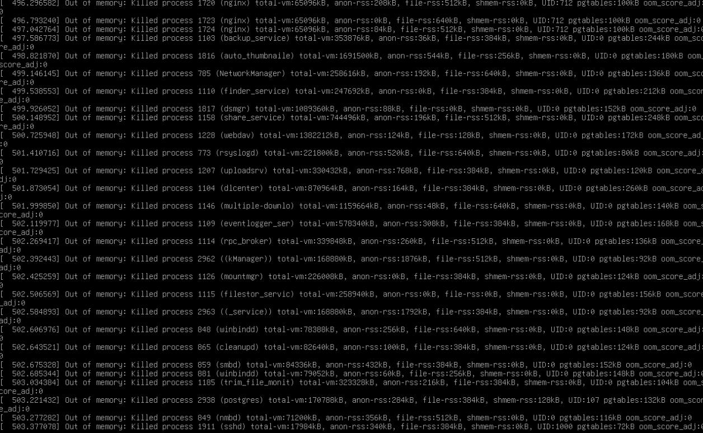
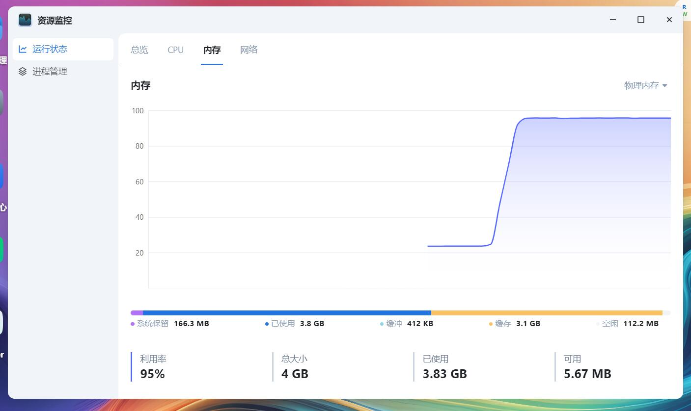
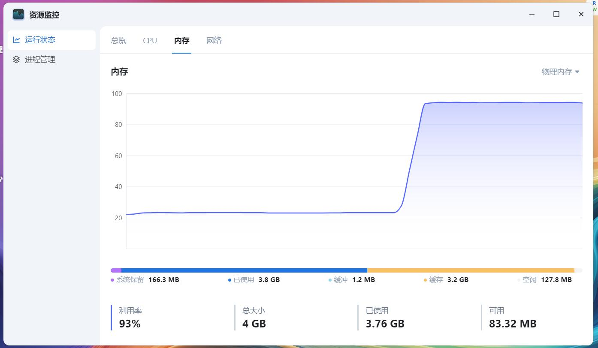
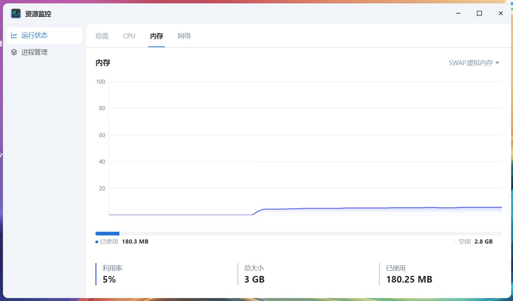

# 在fnOS中开启内存压缩

# 前言
fnOS默认情况下，为了改善小内存设备的使用体验   
该系统会在系统盘中启用swap  
但如果使用系统盘上的swap，有时会造成卡IO的情况

但如果不开，可能系统会直接寄了  


在安卓圈子中这种情况比起fnOS更严重  
劣质的emmc开启swap后不仅不能提高系统性能，反而会起反效果

有一种叫zRam的常用技法，可以在安卓系统中缓解这种现象  
经过简单的测试，这种技法在fnOS中也十分甚至九分的好用

**本文不构成医疗建议，不构成任何投资建议，也不作为任何法律法规、监管政策的依据。  
折腾有风险，操作需谨慎。**

# 开启zRam前，测试tmpfs
首先看看现在有多少内存，如图所示，当前设备合计内存为4G  
```log
root@fnOS-device:~# free -hm
               total        used        free      shared  buff/cache   available
Mem:           3.8Gi       967Mi       2.5Gi        76Mi       702Mi       2.9Gi
Swap:             0B          0B          0B
```  
此时创建一个3GB的tmpfs占用内存  
并尝试写满  
```log
root@fnOS-device:~# mkdir /tmp/memory
root@fnOS-device:~# mount -t tmpfs -o size=3072M tmpfs /tmp/memory
root@fnOS-device:~# dd if=/dev/zero of=/tmp/memory/block
6291457+0 records in
6291456+0 records out
3221225472 bytes (3.2 GB, 3.0 GiB) copied, 9.97883 s, 323 MB/s
```  
随后查看一下内存占用  
如下可见，剩余内存仅剩108M  
```log
root@fnOS-device:~# free -hm
               total        used        free      shared  buff/cache   available
Mem:           3.8Gi       3.8Gi       108Mi       3.1Gi       3.1Gi       5.4Mi
Swap:             0B          0B          0B
```
内存直接就吃饱饱了  


# 开启zRam
开启zRam只需要使用如下的命令即可开启  
以下的命令会将最大3G内存用以内存zRam，如果你需要使用更多的内存用以zRam，可以自行修改  
尽量留1G的物理内存剩余空间，避免出现不必要的麻烦  
```shell
echo "zram" > /etc/modules-load.d/zram.conf
echo 'KERNEL=="zram0", ATTR{comp_algorithm}="zstd", ATTR{disksize}="3G" RUN="/sbin/mkswap /dev/zram0", TAG+="systemd"' > /etc/udev/rules.d/99-zram.rules
echo -e "\n/dev/zram0 none swap defaults,pri=200 0 0" >> /etc/fstab
reboot
```

# 开启zRam后，测试tmpfs
开启zRam后，以同样的方式进行简单的测试  
```log
root@fnOS-device:~# free -hm
               total        used        free      shared  buff/cache   available
Mem:           3.8Gi       958Mi       2.5Gi        76Mi       696Mi       2.9Gi
Swap:          3.0Gi          0B       3.0Gi
root@fnOS-device:~# mkdir /tmp/memory
root@fnOS-device:~# mount -t tmpfs -o size=3072M tmpfs /tmp/memory
root@fnOS-device:~# dd if=/dev/zero of=/tmp/memory/block
dd: writing to '/tmp/memory/block': No space left on device
6291457+0 records in
6291456+0 records out
3221225472 bytes (3.2 GB, 3.0 GiB) copied, 10.012 s, 322 MB/s
root@fnOS-device:~# free -hm
               total        used        free      shared  buff/cache   available
Mem:           3.8Gi       3.8Gi       118Mi       3.0Gi       3.2Gi        72Mi
Swap:          3.0Gi       157Mi       2.8Gi
```  
如图所示，虽然内存被吃满了  
  
但是swap还是有许多的空余，还可以运行其他程序  
  
虽然是同样的4G内存，但经过内存压缩后可以发挥更大的力量  

# 后话
开启zRam后，可以将部分内存压缩使用  
令小内存能发挥更大的力量  
但这种力量也是有限的  
如果占用过高还是发动钞能力，给nas加内存吧