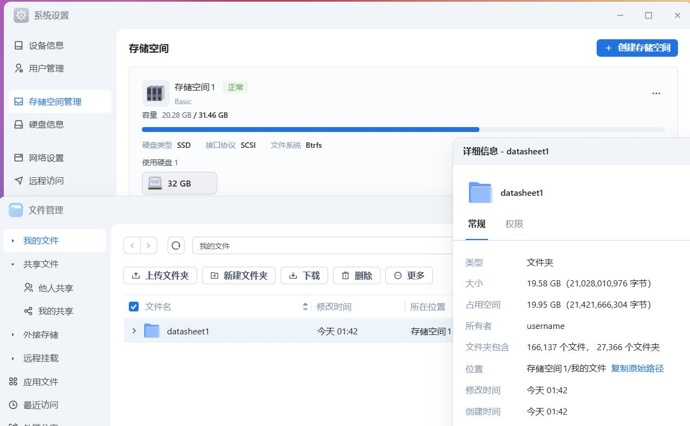
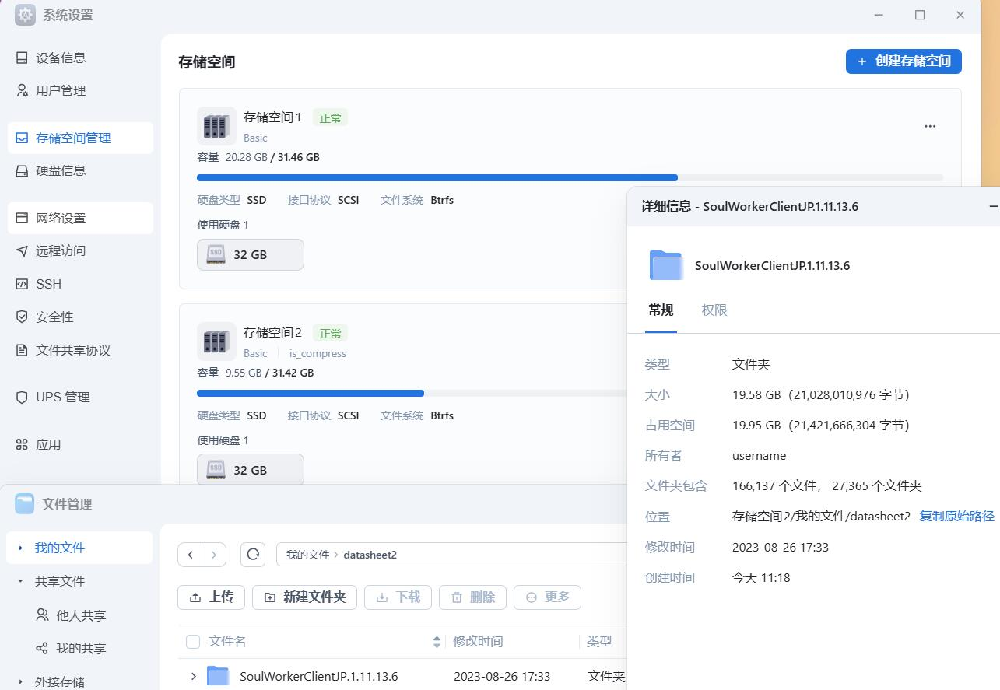
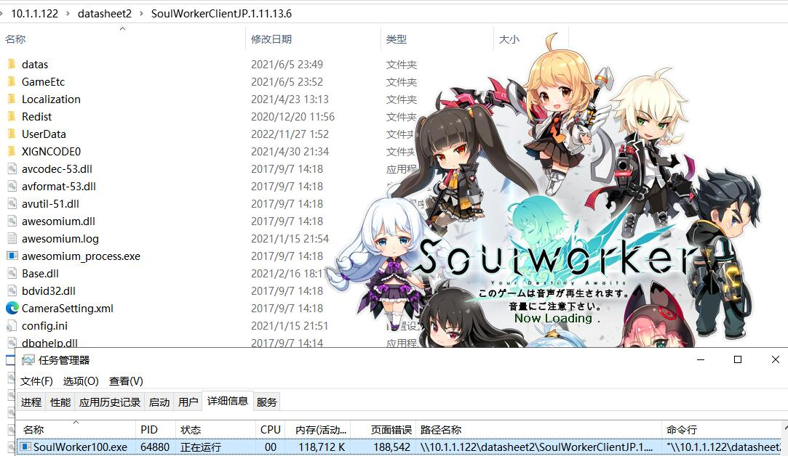

# 在fnos存储空间上开启zstd透明压缩
# 只要胆子大，空间就变大

# 需求背景
随着nas长时间使用，我们的数据逐渐会分为以下这几种：

热数据：经常需要读取的数据  
温数据：偶尔需要读取的数据  
冷数据：极少需要读取的数据，读取的时候需实时访问  
归档数据：极少要读取的数据，也不需要实时在线访问  

其中的冷数据，一定是占据大多数的  
它们可能是你之前通关的游戏，也有可能是群友分享的图包  
也有可能是屯屯鼠们下载的电视剧与电影

相对热数据与温数据，冷数据都有一个特点，那就是很少会访问到  
但相对于归档数据，冷数据又要求我们需要即用即取  
毕竟有的时候心血来潮就是想看看小电影助助兴，如果进行归档操作  
等你读取完数据，可能兴致已经消去

针对这类占据巨大空间的冷数据，我们是否有什么优化的空间  
使其既不会破坏实时访问的特性，但又可以像归档数据一样减少存储成本呢

# 透明压缩！启动！
透明压缩是成熟文件系统的一个重要功能之一  
它可以牺牲一定的读写速度与系统资源，降低文件占据的大小

在慢速设备上，透明压缩甚至可以加快读写速度  

fnOS使用的文件系统，虽然不大成熟，但是它具备了透明压缩的特性  

成文于fnOS 0.8.29版本，内容不保证在其他版本的可用性

**本文不构成医疗建议，不构成任何投资建议，也不作为任何法律法规、监管政策的依据。  
折腾有风险，操作需谨慎。**

通过一个挂载参数，就可以将这个特性启用
```shell
compress-force={压缩算法}:{压缩等级}
```  
其中的{压缩算法}可以是ZLIB、LZO、ZSTD三种：  
ZLIB的{压缩等级}默认是3，有效值是1-9  
LZO的{压缩等级}没有可以选取的数值  
ZSTD的{压缩等级}默认是3，也被zfs等文件系统称为zstd-fast

# 各压缩算法等级的选型与测试
略，有兴趣的可以自行对比 写、读、IO、CPU、内存 的使用情况

# 对照组：无压缩的存储空间1
本次我们仅记录存储空间占用的大小  
测试使用的数据是一款叫SoulWorker的网络游戏  
将其存入32G的存储空间1中  
  
可见其占用空间

# 重挂载存储空间2，开启zstd-15透明压缩
需要注意，透明压缩仅在开启后写入的文件中生效  
对存储空间2启用压缩，仅需要在ssh中运行如下命令即可  
```shell
mount -o remount,compress-force=zstd:15 /vol2
```  

随后我们可以通过命令查看挂载参数的变化  
```log
root@fnOS-device:~# mount |grep vol
/dev/mapper/trim_f20c24dd_ed61_417a_b2c5_99399b10312e-0 on /vol1 type btrfs (rw,relatime,ssd,discard=async,space_cache=v2,subvolid=5,subvol=/)
/dev/mapper/trim_1577fdae_2adf_48a7_8b5e_3978ae9b0209-0 on /vol2 type btrfs (rw,relatime,ssd,discard=async,space_cache=v2,subvolid=5,subvol=/)
root@fnOS-device:~# mount -o remount,compress-force=zstd:15 /vol2
root@fnOS-device:~# mount |grep vol
/dev/mapper/trim_f20c24dd_ed61_417a_b2c5_99399b10312e-0 on /vol1 type btrfs (rw,relatime,ssd,discard=async,space_cache=v2,subvolid=5,subvol=/)
/dev/mapper/trim_1577fdae_2adf_48a7_8b5e_3978ae9b0209-0 on /vol2 type btrfs (rw,relatime,compress-force=zstd:15,ssd,discard=async,space_cache=v2,subvolid=5,subvol=/)
```  
可见挂载参数加上了我们要的压缩参数  

dmesg也有了相关信息  
```log
[23343.913881]  sdc: sdc1
[23345.940229] md/raid1:md1: active with 1 out of 1 mirrors
[23345.942342] md1: detected capacity change from 0 to 67069952
[23351.559121] BTRFS: device fsid 327d5b8e-3ce7-4097-b6b6-45a94935f900 devid 1 transid 6 /dev/dm-1 scanned by mkfs.btrfs (52132)
[23353.626625] BTRFS info (device dm-1): first mount of filesystem 327d5b8e-3ce7-4097-b6b6-45a94935f900
[23353.626676] BTRFS info (device dm-1): using crc32c (crc32c-intel) checksum algorithm
[23353.626680] BTRFS info (device dm-1): using free space tree
[23353.630617] BTRFS info (device dm-1): enabling ssd optimizations
[23353.630620] BTRFS info (device dm-1): auto enabling async discard
[23353.630980] BTRFS info (device dm-1): checking UUID tree
[34193.825285] BTRFS info (device dm-1): qgroup scan completed (inconsistency flag cleared)
[34209.374175] systemd[74907]: memfd_create() called without MFD_EXEC or MFD_NOEXEC_SEAL set
[34464.931298] BTRFS info (device dm-1: state M): setting incompat feature flag for COMPRESS_ZSTD (0x10)
[34464.931304] BTRFS info (device dm-1: state M): force zstd compression, level 15
```
# 实验组：ZSTD-15压缩开启后的存储空间2
将同样的文件放入到开启ZSTD-15压缩的存储空间2  
如图所示，可以直观的感受到压缩带来的占用缩减  
占用直接就少了一半，这就是透明压缩给我带来的自信  
  
```log
root@fnOS-device:~# df -h
Filesystem                                               Size  Used Avail Use% Mounted on
udev                                                     7.8G     0  7.8G   0% /dev
tmpfs                                                    1.6G  159M  1.5G  10% /run
/dev/sdb2                                                 16G  4.5G   11G  31% /
tmpfs                                                    7.9G  1.4M  7.9G   1% /dev/shm
tmpfs                                                    5.0M     0  5.0M   0% /run/lock
trimafs                                                   64G   30G   34G  48% /fs
/dev/mapper/trim_f20c24dd_ed61_417a_b2c5_99399b10312e-0   32G   21G   12G  65% /vol1
/dev/mapper/trim_1577fdae_2adf_48a7_8b5e_3978ae9b0209-0   32G  9.6G   22G  31% /vol2
tmpfs                                                    1.6G     0  1.6G   0% /run/user/1000
```  
经由SMB共享也能直接正常打开游戏  


# 结束语
通过大胆地开启透明压缩，成功地让fnOS的存储空间腾出了更多的空间  
成熟的文件系统、成熟的NAS基本上都有透明压缩功能  
期待有一天这个养成系的nas系统可以成熟  
届时由飞牛官方给我们带来透明压缩的支持