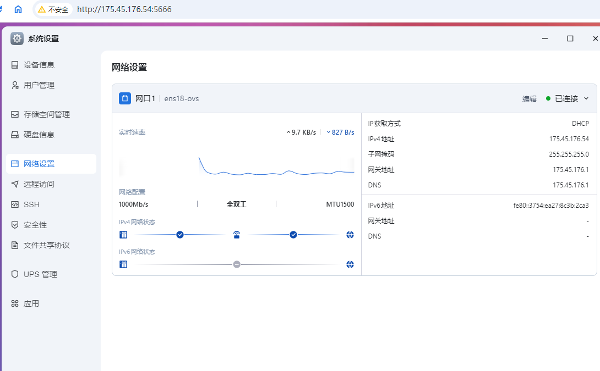
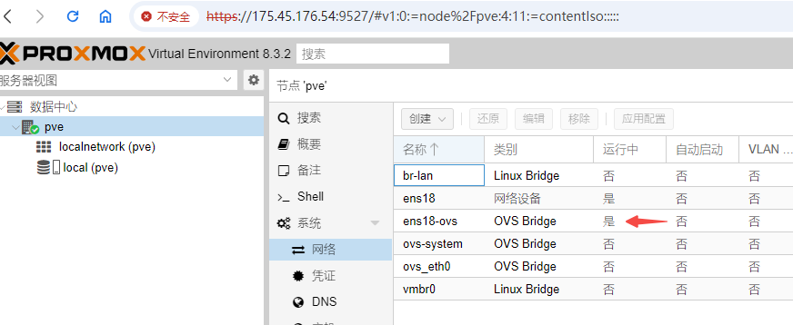

# 借鸡生蛋，使用fnos的openvswitch打通dockerPVE网络

# 前言
本次fnOS的0.8.31版本更新了OVS相关的支持，于是乎docker PVE的网桥就有着落了  
免费的ovs网桥不用白不用  
（这里配一张更新的图）  
之前已经写过docker PVE相关的文章，本次就这飞牛OS的更新同步修正一下  
由于之前为适配前期，故此文章会有一些谬误，如果操作与本文冲突请以本文为准
## 之前飞牛相关的docker PVE文章
[在飞牛私有云fnOS公测版中使用docker跑PVE](2024/09/201200_run_docker_pve_in_fnos/index.md)

[在docker PVE中使用nVidia vGPU](2024/10/102050_run_vgpu_with_docker_pve_in_fnos/index.md)

# 开启ovs
目前fnOS的0.8.31版本没有直接开启ovs的方法，只能使用虚拟机应用触发  
我们先在应用商店下载飞牛官方的虚拟机应用  


随后打开虚拟机应用，激活ovs网桥功能  


当观察到网口名称增加了ovs的后缀，表明已经激活了ovs网桥功能  


# 部署docker-compose
## yaml文件
这个是yaml文件，需要进行修改部分在本节会说明
```yaml
services:
  pve:
    image: makedie/proxmox_ve:8.3.2
    container_name: pve-8.3.2
    tty: true
    environment:
      root_password: "root"
      port: 9527
    devices:
      - /dev/dri
      - /dev/fuse
      - /dev/kvm
      - /dev/nvidia0
      - /dev/nvidiactl
      - /dev/nvidia-uvm
      - /dev/nvidia-uvm-tools
      - /dev/nvidia-vgpu1
    cap_add:
      - NET_ADMIN
    network_mode: host
    volumes:
      - /sys/fs/fuse:/sys/fs/fuse
      - /dev/vfio:/dev/vfio
      - /var/run/openvswitch:/host/var/run/openvswitch
      - /vol1/1000/pve/pve-cluster:/var/lib/pve-cluster
      - /vol1/1000/pve/vz:/var/lib/vz
    tmpfs:
      - /tmp
      - /var/run
      - /var/cache
      - /run/lock
    extra_hosts:
      - "shop.maurer-it.com:127.0.0.1"
      - "pve:175.45.176.54"
    hostname: pve
    stop_grace_period: 2m
    privileged: true
```
## 指定PVE端口
由于fnOS官方应用会使用8006端口，因此需要做出避让  
如下所示，本compose会使用9527替代之  
如果你有其他需要可以自行修改该端口为其他数值  
```yaml
    environment:
      port: 9527
```
## 修改持久化存储位置
如图所示，我在存储空间1创建了一个pve文件夹  
并建立了两个子文件夹  
分别是虚拟机配置，以及虚拟机磁盘、ISO镜像等   
你需要根据你的实际情况修改此处  
后续你在dockerPVE的虚拟机会持久化固定在这里  
当然你也可以自行映射其他文件夹，并在dockerPVE内配置目录存储  
```yaml
    volumes:
      - /vol1/1000/pve/pve-cluster:/var/lib/pve-cluster
      - /vol1/1000/pve/vz:/var/lib/vz
```
  
## 指定PVE使用的IP
如图所示，我访问fnos的IP是175.45.176.54  
你需要将docker-compose的IP自行更换成你访问fnOS的IP  
```yaml
    extra_hosts:
      - "pve:175.45.176.54"
```


# 启动docker PVE
如果compose文件无误，你就可以启动compose的构建了  
耐心等待几分钟，docker PVE会自行启动  
如果docker拉取失败，请检查你的网络是否能正常连接国际互联网  


等待几分钟后，待docker容器成功运行起来  
观察到日志的端口为8006，但因为避让飞牛官方应用，我们修改了端口  
观察docker配置，我们使用的是9527端口，因此也需要用这个端口访问  


# 使用docker PVE
正常使用 https://175.45.176.54:9527 访问即可
## 观察生效的ovs-bridge
如正常的PVE后台一样，点击节点后，观察系统下的网络  
注意是否有OVS Bridge类别的网桥，且状态必须是运行中的  
  
如果没有，那说明操作有误，需重新检查前面的操作
## 使用ovs-bridge创建虚拟机
与正常PVE创建虚拟机一致，但网络处选择桥接接口时，应选取运行中的ovs网桥  

## 启动虚拟机
正常开启虚拟机，并使用命令观察即可看见，虚拟机已经接入了ovs网桥中  
  

随后可以再简单验证一下网络是否联通、CPU性能是否正常  
由于目标机器在下东西，带宽被占用，故此数据不大好看  
不过只是为了验证网络是否接通因此就不再去关下载截图了  
CPU的损失基本不大，可以视为硬件虚拟机KVM正常运作  


# 后话
在适配docker PVE的过程中，我感受到了飞牛官方对开发者的包容  
在后期的针对fnOS的适配中提供了大量的技术支持  
希望其他nas厂商也可以为我们第三方开发者提供一定的帮助  
国产NAS生态的维护，若厂商与开发者能双向奔赴是最好的  
冷冰冰的拒绝，只会寒了第三方开发者的心  
