# 在飞牛虚拟机上使用nvidia vGPU共享显卡

# 前言
nvidia的vGPU方案可以实现多个虚拟机使用同一块显卡  
经过小patch后，也可以实现宿主机与虚拟机同时使用一块显卡  
本文将会演示，如何在fnOS上的虚拟机使用nvidia vGPU

本文使用的飞牛OS版本为0.8.36  
内核版本为Linux fnOS-device 6.6.38-trim #80 SMP PREEMPT_DYNAMIC Tue Dec 10 20:45:43 CST 2024 x86_64 GNU/Linux  
宿主机驱动版本为550.90.07  
虚拟机驱动版本为552.55  
显卡为NVIDIA Corporation TU117 [GeForce GTX 1650] [10de:1f82]

若你使用的版本与本文提及的版本不同，请自行见机行事  
若你使用的显卡为RTX 6000ada等型号，请使用SRIOV启用vGPU技术  
nvidia官方支持的设备列表如下所示，如果你的设备不在支持列表内，也可以尝试使用我之前提供的驱动  
[https://docs.nvidia.com/vgpu/gpus-supported-by-vgpu.html](https://docs.nvidia.com/vgpu/gpus-supported-by-vgpu.html)

驱动的安装可以参考我之前的文章，这里不再重复说明  
本文操作均只使用我自己构建的驱动，飞牛应用中心那个驱动没有完整功能大概率是不能用vGPU的

# 检查驱动是否安装正常
首先使用`nvidia-smi`查看是否正确安装nvidia驱动  
如果展示类似如下，可以出现显卡名称与驱动版本号，那么驱动与设备可以视为安装成功  
```log
root@fnOS-device:~# nvidia-smi
Wed Jan 22 12:15:44 2025       
+-----------------------------------------------------------------------------------------+
| NVIDIA-SMI 550.90.07              Driver Version: 550.90.07      CUDA Version: 12.4     |
|-----------------------------------------+------------------------+----------------------+
| GPU  Name                 Persistence-M | Bus-Id          Disp.A | Volatile Uncorr. ECC |
| Fan  Temp   Perf          Pwr:Usage/Cap |           Memory-Usage | GPU-Util  Compute M. |
|                                         |                        |               MIG M. |
|=========================================+========================+======================|
|   0  NVIDIA GeForce GTX 1650        On  |   00000000:81:00.0 Off |                  N/A |
| 53%   52C    P2             N/A /   75W |     726MiB /   4096MiB |      0%      Default |
|                                         |                        |                  N/A |
+-----------------------------------------+------------------------+----------------------+
                                                                                         
+-----------------------------------------------------------------------------------------+
| Processes:                                                                              |
|  GPU   GI   CI        PID   Type   Process name                              GPU Memory |
|        ID   ID                                                               Usage      |
|=========================================================================================|
|    0   N/A  N/A     11048      C   trim.face_det                                 498MiB |
|    0   N/A  N/A     11672      C   /usr/trim/bin/mediasrv                        224MiB |
+-----------------------------------------------------------------------------------------+
```

随后使用`nvidia-smi vgpu`查看内核驱动是否激活了vGPU功能  
```log
root@fnOS-device:~# nvidia-smi vgpu 
Wed Jan 22 12:15:46 2025       
+-----------------------------------------------------------------------------+
| NVIDIA-SMI 550.90.07              Driver Version: 550.90.07                 |
|---------------------------------+------------------------------+------------+
| GPU  Name                       | Bus-Id                       | GPU-Util   |
|      vGPU ID     Name           | VM ID     VM Name            | vGPU-Util  |
|=================================+==============================+============|
|   0  NVIDIA GeForce GTX 1650    | 00000000:81:00.0             |   0%       |
+---------------------------------+------------------------------+------------+
```

最后使用`mdevctl types`查看是否有正确的mdev配置出现  
这里为了方便发出来，使用了head -11只展示前11行，正常查看并不需要如此  
你甚至应该记录一份，以备后面的步骤使用  
```shell
root@fnOS-device:~# mdevctl types| head -11
0000:81:00.0
  nvidia-256
    Available instances: 24
    Device API: vfio-pci
    Name: GRID RTX6000-1Q
    Description: num_heads=4, frl_config=60, framebuffer=1024M, max_resolution=5120x2880, max_instance=24
  nvidia-257
    Available instances: 12
    Device API: vfio-pci
    Name: GRID RTX6000-2Q
    Description: num_heads=4, frl_config=60, framebuffer=2048M, max_resolution=7680x4320, max_instance=12
```

整个流程的画面是这样的  
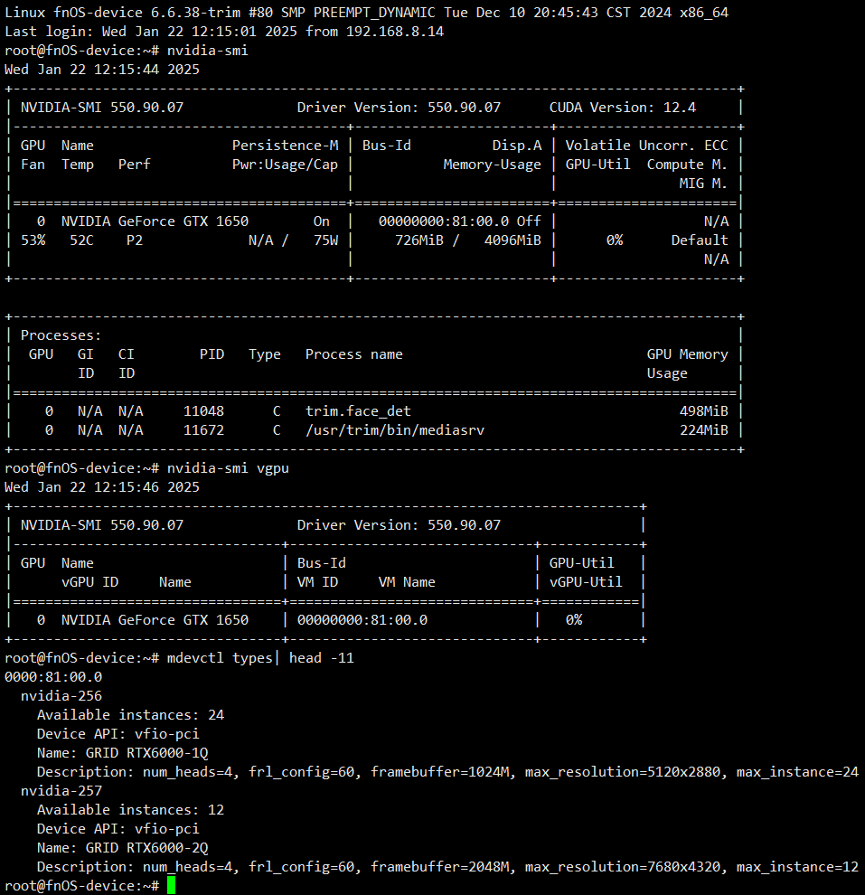

# 配置libvirt设备定义
## 定义mdev设备
刚刚记录的mdev名称，现在就可以用到了  
如下所示，写一个xml配置，本例命名为`vgpu_0001_256.xml`  
这里的`pci_0000_81_00_0`需要按上面nvidia-smi对应的`00000000:81:00.0`修改  
然后`nvidia-256`是mdev类型，你需要在之前列出的类型中选一个你喜欢的  
```xml
<device>
    <parent>pci_0000_81_00_0</parent>
    <capability type="mdev">
        <type id="nvidia-256"/>
        <uuid>00000000-0000-0000-0000-000000000001</uuid>
    </capability>
</device>
```

将xml文件上传到飞牛nas上，使用如下命令创建该设备定义  
```shell
virsh nodedev-define vgpu_0001_256.xml
```  
执行命令后会有如下的内容展示  
```log
root@fnOS-device:~# virsh nodedev-define vgpu_0001_256.xml 
Node device 'mdev_00000000_0000_0000_0000_000000000001_0000_81_00_0' defined from 'vgpu_0001_256.xml'
```  

## 查询mdev设备
如下所示，查一下刚才的注册操作是否成功  
```shell
root@fnOS-device:~# virsh nodedev-info mdev_00000000_0000_0000_0000_000000000001_0000_81_00_0
Name:           mdev_00000000_0000_0000_0000_000000000001_0000_81_00_0
Parent:         pci_0000_81_00_0
Active:         no
Persistent:     yes
Autostart:      no
```
这里我们不开启mdev设备自动启动，有需要的用户可以使用`virsh nodedev-autostart`自行启用
## 启用mdev设备
使用如下命令启用mdev设备  
这里的start后接的参数，就是创建设备定义时返回的那一串  
```shell
virsh nodedev-start mdev_00000000_0000_0000_0000_000000000001_0000_81_00_0
```
回显如下  
```shell
root@fnOS-device:~# virsh nodedev-start mdev_00000000_0000_0000_0000_000000000001_0000_81_00_0
Device mdev_00000000_0000_0000_0000_000000000001_0000_81_00_0 started
root@fnOS-device:~# virsh nodedev-info mdev_00000000_0000_0000_0000_000000000001_0000_81_00_0
Name:           mdev_00000000_0000_0000_0000_000000000001_0000_81_00_0
Parent:         pci_0000_81_00_0
Active:         yes
Persistent:     yes
Autostart:      no
```

# 修改虚拟机libvirt配置

## 寻找虚拟机名称
这里有一个小技巧，打开飞牛虚拟机页面，同时按F12启用浏览器开发者工具  
点击对应的虚拟机，在开发者工具抓到的网络请求就可以知道虚拟机的真实名称  
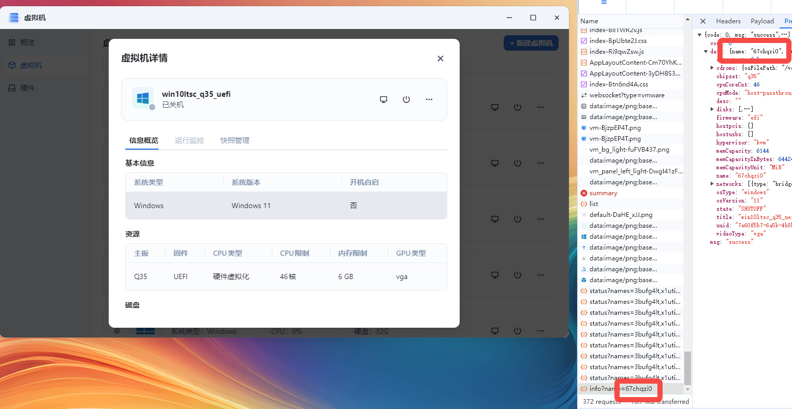  
图中展示的虚拟机名称为67chqzi0

## 编辑虚拟机xml配置
可以参考下面这份配置，自行修改uuid为你创建时使用的uuid  
这是一份比较通用的配置，如果你需要配置为PCIe设备，或者是配置ramfb请自行修改  
```xml
<hostdev mode='subsystem' type='mdev' managed='no' model='vfio-pci'>
  <source>
    <address uuid='00000000-0000-0000-0000-000000000001'/>
  </source>
</hostdev>
```
使用如下命令打开虚拟机配置进行编辑  
记得将虚拟机名称替换为刚刚找到的的名称  
```shell
virsh edit 67chqzi0
```
大概在这个地方插入设备配置  
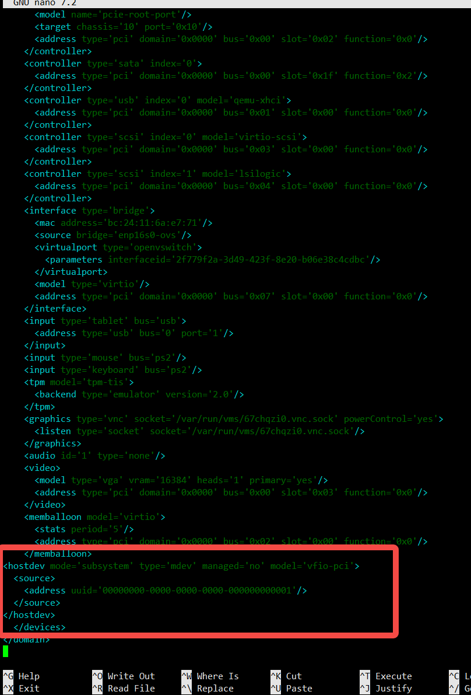  
进行保存后，若有类似如下提示，直接按i键  
```log
root@fnOS-device:~# virsh edit 67chqzi0
error: XML document failed to validate against schema: Unable to validate doc against /usr/share/libvirt/schemas/domain.rng
Extra element devices in interleave
Element domain failed to validate content

Failed. Try again? [y,n,i,f,?]: 
```  
会忽略格式问题进行保存，出现如下的回显  
```log
Domain '67chqzi0' XML configuration edited.
```

# 启动虚拟机
## 观察设备信息
如下图所示，在设备管理器中可以看见一个没有打驱动的显示设备  
设备ID中包含10DE  
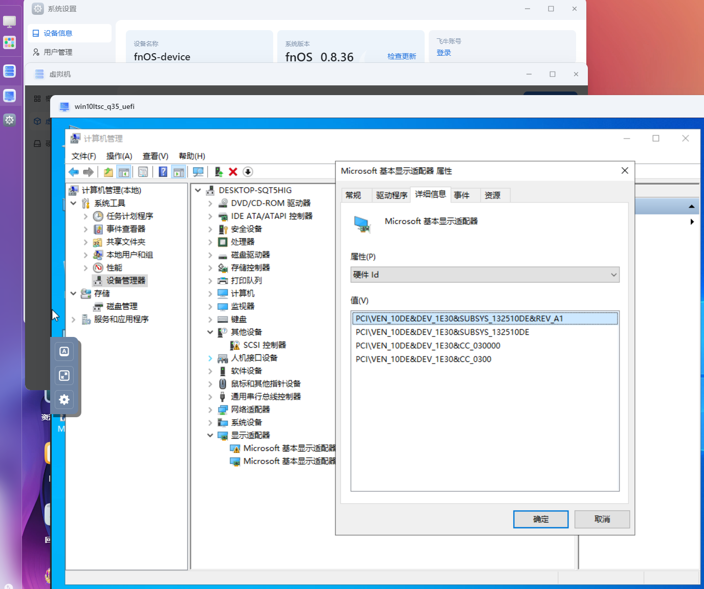
## 打驱动
这一步没什么好说的，把对应版本的Grid驱动打上就行  
Grid驱动版本尽量使用宿主机驱动对应的版本  
本例宿主机使用的驱动版本为550.90.07，那么对应的Grid驱动版本就是552.55  
这些版本信息可以在这里查到  
[https://docs.nvidia.com/vgpu/index.html#driver-versions](https://docs.nvidia.com/vgpu/index.html#driver-versions)
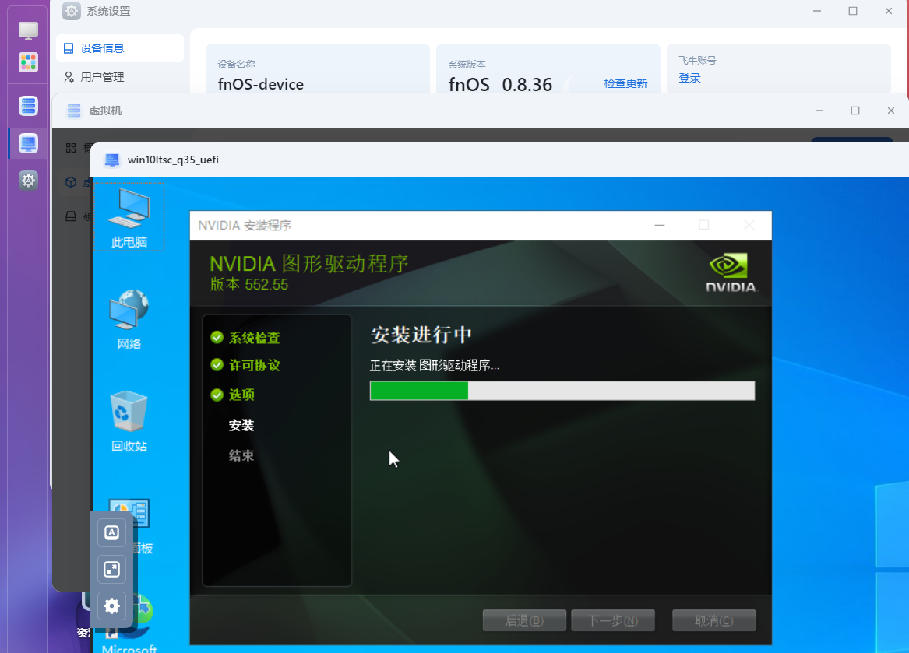
## 切换显示器
驱动安装完毕后，可能会出现VNC被挤占到2号显示器的情况  
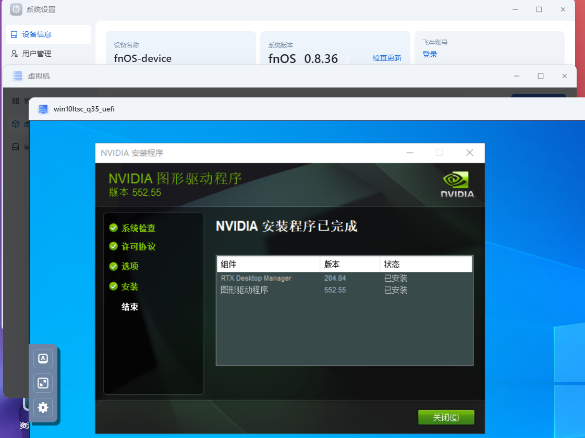
此时可以使用热键 Win+P切换显示器  
具体步骤就是按下VNC上的Win键，然后再按下键盘的P键  
盲按几次，一般都能切回主显示器显示  
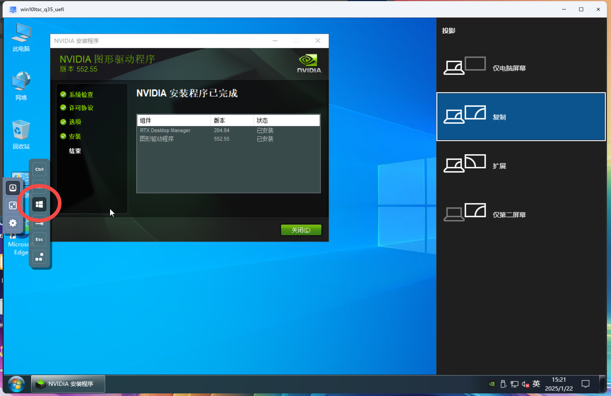
## 激活vGPU授权
获取vGPU授权的部分可以参考其他文章，本文不再赘述  
获取这个授权的难度就跟激活Windows那个KMS一样，堪称有手就行
## 验证vGPU功能
在虚拟机随便播个视频  
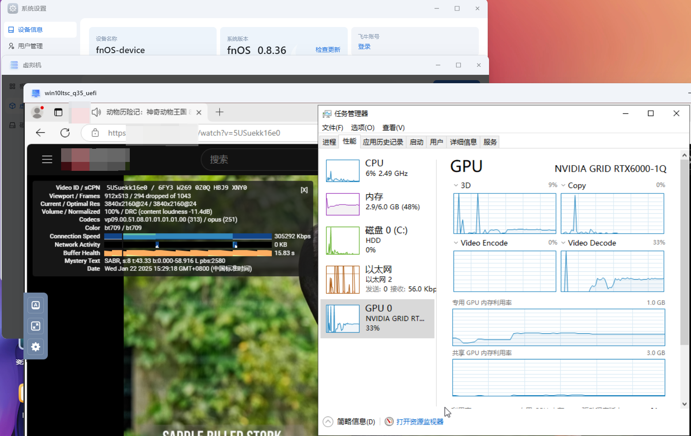
在虚拟机随便跑跑图形负载  
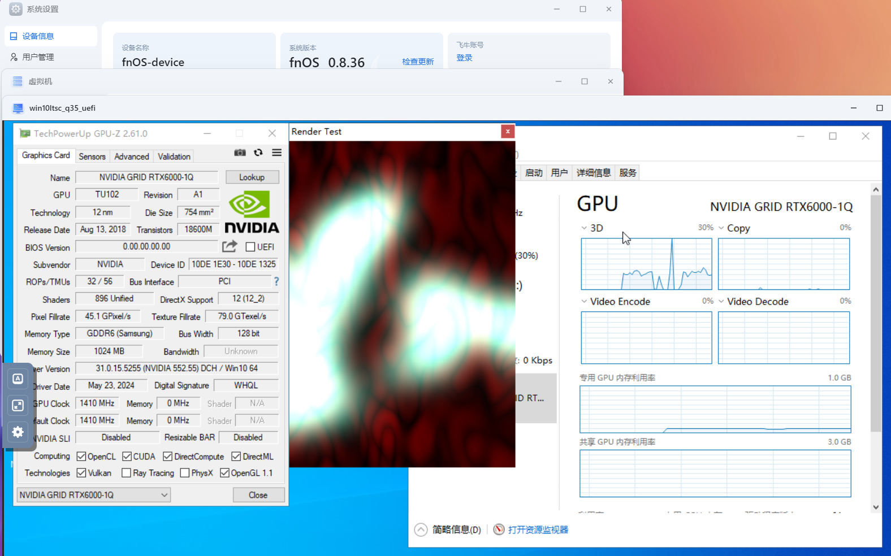
在虚拟机看看nvidia-smi  
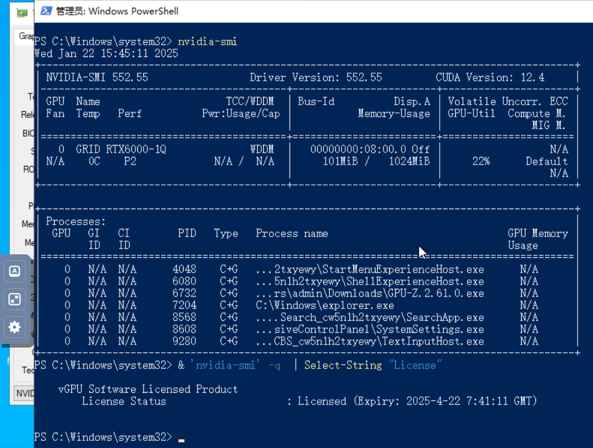
看看宿主机负载
```log
root@fnOS-device:~# uname -a
Linux fnOS-device 6.6.38-trim #80 SMP PREEMPT_DYNAMIC Tue Dec 10 20:45:43 CST 2024 x86_64 GNU/Linux
root@fnOS-device:~# nvidia-smi
Wed Jan 22 15:43:45 2025       
+-----------------------------------------------------------------------------------------+
| NVIDIA-SMI 550.90.07              Driver Version: 550.90.07      CUDA Version: 12.4     |
|-----------------------------------------+------------------------+----------------------+
| GPU  Name                 Persistence-M | Bus-Id          Disp.A | Volatile Uncorr. ECC |
| Fan  Temp   Perf          Pwr:Usage/Cap |           Memory-Usage | GPU-Util  Compute M. |
|                                         |                        |               MIG M. |
|=========================================+========================+======================|
|   0  NVIDIA GeForce GTX 1650        On  |   00000000:81:00.0 Off |                  N/A |
| 20%   63C    P2             N/A /   75W |    1240MiB /   4096MiB |     46%      Default |
|                                         |                        |                  N/A |
+-----------------------------------------+------------------------+----------------------+
                                                                                         
+-----------------------------------------------------------------------------------------+
| Processes:                                                                              |
|  GPU   GI   CI        PID   Type   Process name                              GPU Memory |
|        ID   ID                                                               Usage      |
|=========================================================================================|
|    0   N/A  N/A     40848    C+G   vgpu                                         1012MiB |
|    0   N/A  N/A     49548      C   /usr/trim/bin/mediasrv                        224MiB |
+-----------------------------------------------------------------------------------------+
root@fnOS-device:~# nvidia-smi vgpu
Wed Jan 22 15:43:48 2025       
+-----------------------------------------------------------------------------+
| NVIDIA-SMI 550.90.07              Driver Version: 550.90.07                 |
|---------------------------------+------------------------------+------------+
| GPU  Name                       | Bus-Id                       | GPU-Util   |
|      vGPU ID     Name           | VM ID     VM Name            | vGPU-Util  |
|=================================+==============================+============|
|   0  NVIDIA GeForce GTX 1650    | 00000000:81:00.0             |  39%       |
|      3251634811  GRID RTX600... | 7e60...  67chqzi0            |     38%    |
+---------------------------------+------------------------------+------------+
```
至此，我们的虚拟机功能验证就结束了

# 后记
一顿操作猛如虎，不如换用dockerPVE  
网页上点一点就能开vGPU简直轻轻松松  
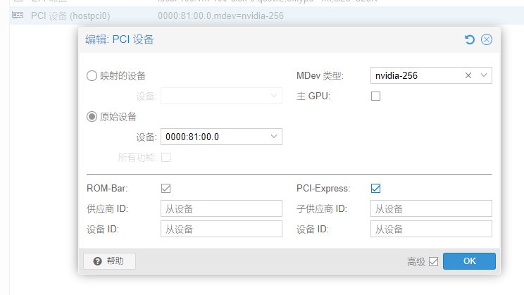  
希望飞牛官方早日支持在web端创建添加mdev设备吧