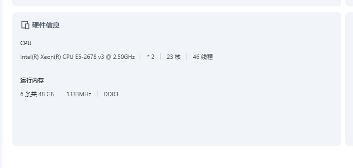
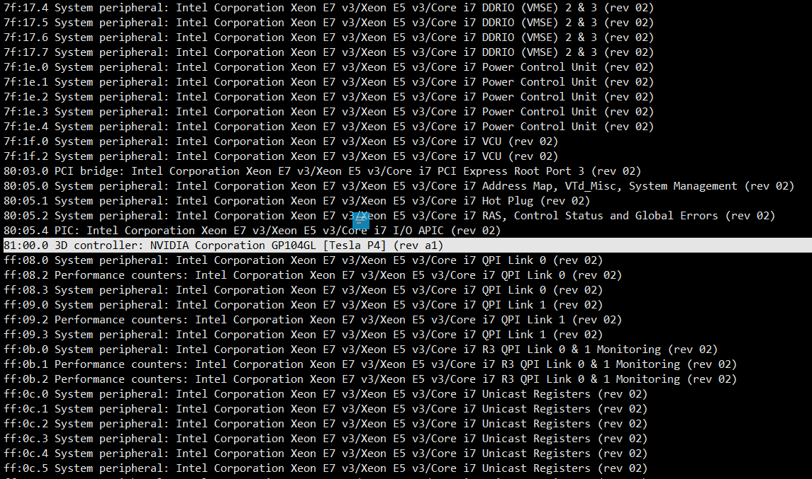
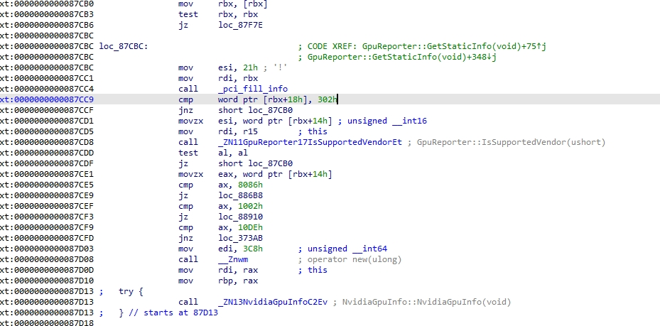
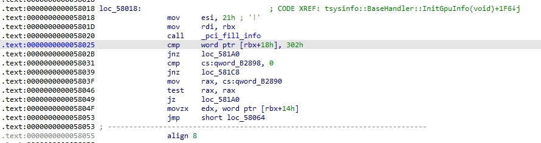
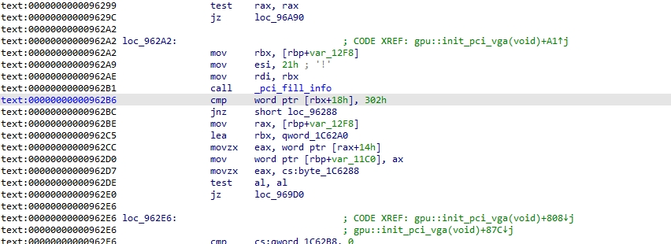
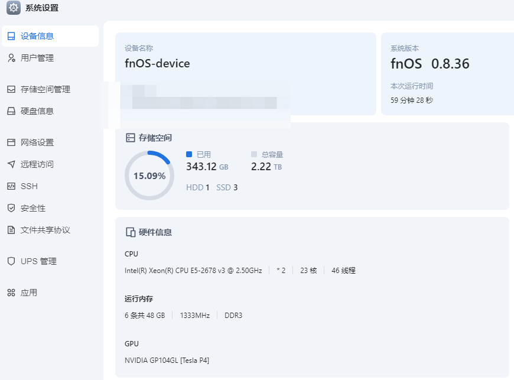
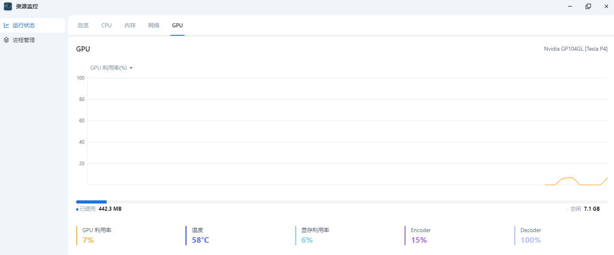
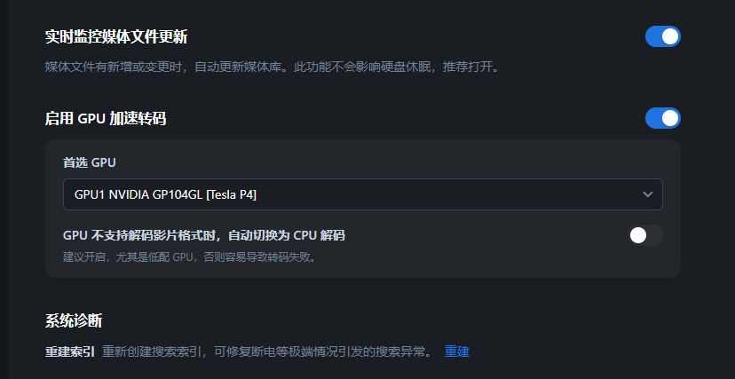
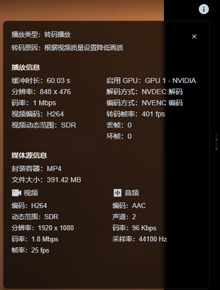

# 让飞牛影视支持Tesla P4编解码

# 现象
当前Tesla P4这张卡插进飞牛OS中，除了耗电并没有什么用  
  
系统、资源监控、影视，都不展示这张卡  
但是lspci是有这张卡的  


# 分析
略，反正写了你们肯定不会看的  
不会真有人喜欢看IDA还有动态调试那些东西吧  
想看的人可以在底下留言  
简单说说就是飞牛官方的代码目前仅兼容VGA compatible controller [0300]设备  
我们的TeslaP4属于3D controller [0302]设备  
因此不被支持  

# 修改点
以fnOS 0.8.36版本为例  
以下几处修改就是强行将判断VGA设备改为3D控制器设备  
至于为什么300改为302，是00 30改为02 03，这就涉及一个大小端问题，写了估计也么人看  
改完之后只认3D控制器，反而会不认VGA设备  
改CMP跳转不是不行，但我就是懒，你们有兴趣的可以自己加油  
## resmon_service
打开文件 /usr/trim/bin/resmon_service  
将如下部分，进行patch  
此处影响资源监控  
```asm
.text:0000000000087CC9                 cmp     word ptr [rbx+18h], 300h
```
将300修改为302
  

对应的Hex
```hex
48 8B 1B 48 85 DB 0F 84  C2 02 00 00 BE 21 00 00
00 48 89 DF E8 D7 AE FA  FF 66 81 7B 18 00 03 75
DF 0F B7 73 14 4C 89 FF  E8 E3 FC FF FF 84 C0 74
```  
将其中第二行的 00 03 修改为 02 03

替换文件后重启系统服务
```shell
systemctl restart resmon_service.service
```

## sysinfo_service
打开文件/usr/trim/bin/sysinfo_service  
将如下部分，进行patch  
此处影响，系统设置-硬件信息-GPU
```asm
.text:0000000000058025                 cmp     word ptr [rbx+18h], 300h
```
将300修改为302  


对应的Hex
```hex
00 0F 1F 80 00 00 00 00  BE 21 00 00 00 48 89 DF
E8 9B 1A FD FF 66 81 7B  18 00 03 0F 85 6F 01 00
00 48 83 3D 5F A8 05 00  00 0F 85 89 01 00 00 48
```
将其中第二行的 00 03 修改为 02 03

替换文件后重启系统服务  
```shell
systemctl restart sysinfo_service.service
```

## mediasrv
打开文件/usr/trim/bin/mediasrv  
将如下部分，进行patch  
此处影响，飞牛影视-设置-启用GPU加速转码  
```asm
.text:00000000000962B6                 cmp     word ptr [rbx+18h], 300h
```
将300修改为302  


```hex
00 00 48 8B 9D 08 ED FF  FF BE 21 00 00 00 48 89
DF E8 DA 43 FB FF 66 81  7B 18 00 03 75 CA 48 8B
85 08 ED FF FF 48 8D 1D  D4 FF 12 00 0F B7 40 14
```
将其中第二行的 00 03 修改为 02 03

替换文件后重启系统服务
```shell
systemctl restart mediasrv
```

# 验证
观察 系统设置-硬件信息 正确出现Tesla P4显卡  


观察 资源监控-GPU 应出现Tesla P4显卡  


观察 飞牛影视-设置-启用GPU加速转码，应出现大宝贝显卡  


播放视频，观察编解码信息，应为NVDEC与NVENC  


播放视频时，终端命令观察，编解码服务正常运行在Tesla P4上
```log
root@fnOS-device:~# nvidia-smi 
Wed Jan 22 19:23:55 2025       
+-----------------------------------------------------------------------------------------+
| NVIDIA-SMI 550.90.07              Driver Version: 550.90.07      CUDA Version: 12.4     |
|-----------------------------------------+------------------------+----------------------+
| GPU  Name                 Persistence-M | Bus-Id          Disp.A | Volatile Uncorr. ECC |
| Fan  Temp   Perf          Pwr:Usage/Cap |           Memory-Usage | GPU-Util  Compute M. |
|                                         |                        |               MIG M. |
|=========================================+========================+======================|
|   0  Tesla P4                       On  |   00000000:81:00.0 Off |                    0 |
| N/A   67C    P8             12W /   75W |     362MiB /   7680MiB |      0%      Default |
|                                         |                        |                  N/A |
+-----------------------------------------+------------------------+----------------------+
                                                                                         
+-----------------------------------------------------------------------------------------+
| Processes:                                                                              |
|  GPU   GI   CI        PID   Type   Process name                              GPU Memory |
|        ID   ID                                                               Usage      |
|=========================================================================================|
|    0   N/A  N/A     17806      C   /usr/trim/bin/mediasrv                        359MiB |
+-----------------------------------------------------------------------------------------+
root@fnOS-device:~# lspci -nnk -s 00000000:81:00.0
81:00.0 3D controller [0302]: NVIDIA Corporation GP104GL [Tesla P4] [10de:1bb3] (rev a1)
	Subsystem: NVIDIA Corporation GP104GL [Tesla P4] [10de:11d8]
	Kernel driver in use: nvidia
	Kernel modules: nouveau, nvidia_drm, nvidia_vgpu_vfio, nvidia
```

# 特殊情况处理
没有报错就不需要看这个章节
## MMU Fault: ENGINE CE0 HUBCLIENT_HSCE0 faulted
如果强行启用后，dmesg会出现  
```MMU Fault: ENGINE CE0 HUBCLIENT_HSCE0 faulted```  
新增驱动参数，重启即可
```shell
echo "options nvidia NVreg_EnableMSI=1 NVreg_PreserveVideoMemoryAllocations=1 vup_swrlwar=1" > /etc/modprobe.d/nvidia.conf
```

## MMU Fault: ENGINE GRAPHICS HUBCLIENT_FECS faulted
如果强行启用后，dmesg会出现如下这种报错  
```log
Jan 22 18:38:35 fnOS-device kernel: NVRM: GPU at PCI:0000:81:00: GPU-71dcdf29-68ae-87d1-b57b-86d9f8f01ffc
Jan 22 18:38:35 fnOS-device kernel: NVRM: GPU Board Serial Number: 0422318024689
Jan 22 18:38:35 fnOS-device kernel: NVRM: Xid (PCI:0000:81:00): 31, pid='<unknown>', name=<unknown>, Ch 00000016, intr 10000000. MMU Fault: ENGINE GRAPHICS HUBCLIENT_FECS faulted @ 0x0_00000000. Fault is of type FAULT_PDE ACCESS_TYPE_READ
Jan 22 18:38:35 fnOS-device kernel: nvrm-nvlog: CwAAAAAECAAIAQQCAAAAAAAAAAAdklRmGCSHamm5x7t02nF+AAAAAAAAAAAAAAAA
Jan 22 18:38:35 fnOS-device kernel: nvrm-nvlog: UBUAAAAAAAAAAAAAAAAAAAAAAAAAAAAAAAAAAAAAAAAAAAAAAAAAAAAAAAAAAAAA
Jan 22 18:38:35 fnOS-device kernel: nvrm-nvlog: AAAAAAAAAAAAAAAAAAAAAAAAAAAAAAAAAAAAAAAAAAAAAAAAAAAAAAAAAAAAAAAA
Jan 22 18:38:35 fnOS-device kernel: nvrm-nvlog: AAAAAAAAAAAAAAAAAAAAAAAAAAAAAAAAAAAAAAAAAAAAAAAAAAAAAAAAAAAAAAAA
Jan 22 18:38:35 fnOS-device kernel: nvrm-nvlog: AAAAAAAAAAAAAAAAAAAAAAAAAAAAAAAAAAAAAAAAAAAAAAAAAAAAAAAAAAAAAAAA
Jan 22 18:38:35 fnOS-device kernel: nvrm-nvlog: AAAAAAAAAAAAAAAAAAAAAAAAAAAAAAAAAAAAAAAAAAAAAAAAAAAAAAAAAAAAAAAA
Jan 22 18:38:35 fnOS-device kernel: nvrm-nvlog: AAAAAAAAAAAAAAAAAAAAAAAAAAAAAAAAsPoAoAAAAAABAAAAAgAAAAAAAAAAAAAA
Jan 22 18:38:35 fnOS-device kernel: nvrm-nvlog: AAAAAAAAAAAAAAAAAQAAAA==
Jan 22 18:38:35 fnOS-device kernel: nvrm-nvlog: oDpvwf////8A6AMAMXBydLAAAAA8CAAAAAAAAAAAAACPypBnyZikv3kAAMAAAAAA
Jan 22 18:38:35 fnOS-device kernel: nvrm-nvlog: j8qQZ7niP7+HAwTAj8qQZ4JPKb8zAADABgAAAI/KkGcpb3a/ggcEwJDKkGcIPY+/
Jan 22 18:38:35 fnOS-device kernel: nvrm-nvlog: igwAwJDKkGeU7cW/6AMAwJDKkGdl5O+g3wQAwJDKkGflrK2/4AQAwKDgGQQAAAAA
Jan 22 18:38:35 fnOS-device kernel: nvrm-nvlog: YOAJBAAAAABAAAAAAAAAAJDKkGflrK2/4wQYwAcAAABg4A0EAAAAACDgCQQAAAAA
Jan 22 18:38:35 fnOS-device kernel: nvrm-nvlog: kMqQZxlwL6AYAhTAGAAAAJDKkGfeZkagjAAEwP8AAACQypBn3mZGoI0ABMAAAAAA
```
说明驱动没有工作在正确的模式下  
需要编辑grid配置，先经由模板文件创建配置    
```shell
cp /etc/nvidia/gridd.conf.template /etc/nvidia/gridd.conf
```
随后将该文件FeatureType调整为2  
```
# Description: Set Feature to be enabled
# Data type: integer
# Possible values:
#    0 => for unlicensed state
#    1 => for NVIDIA vGPU (Optional, autodetected as per vGPU type)
#    2 => for NVIDIA RTX Virtual Workstation
#    4 => for NVIDIA Virtual Compute Server
# All other values reserved
FeatureType=2
```

如果有需要的话，可以再将授权文件下载到指定目录  
```shell
curl --insecure -L -X GET https://授权服务器/-/client-token -o /etc/nvidia/ClientConfigToken/client_configuration_token_$(date '+%d-%m-%Y-%H-%M-%S').tok
```
再重启服务
```shell
service nvidia-gridd restart
```
服务输出以下日志即可  
```log
Jan 22 19:18:41 fnOS-device nvidia-gridd[17534]: Started (17534)
Jan 22 19:18:41 fnOS-device nvidia-gridd[17534]: vGPU Software package (0)
Jan 22 19:18:41 fnOS-device nvidia-gridd[17534]: Ignore service provider and node-locked licensing
Jan 22 19:18:41 fnOS-device nvidia-gridd[17534]: NLS initialized
Jan 22 19:18:41 fnOS-device nvidia-gridd[17534]: Acquiring license. (Info: 192.168.9.136; NVIDIA RTX Virtual Workstation)
Jan 22 19:18:43 fnOS-device nvidia-gridd[17534]: License acquired successfully. (Info: 192.168.9.136, NVIDIA RTX Virtual Workstation; Expiry: 2025-4-22 11:18:43 GMT)
```

# 结束语
经过一顿猛如虎的操作，终于让我们的TeslaP4在飞牛中跑起了编解码  
希望飞牛官方早日支持3D controller以及Display controller  
不要让我们闲置设备吃灰