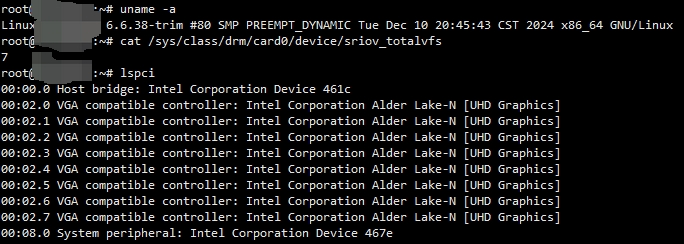
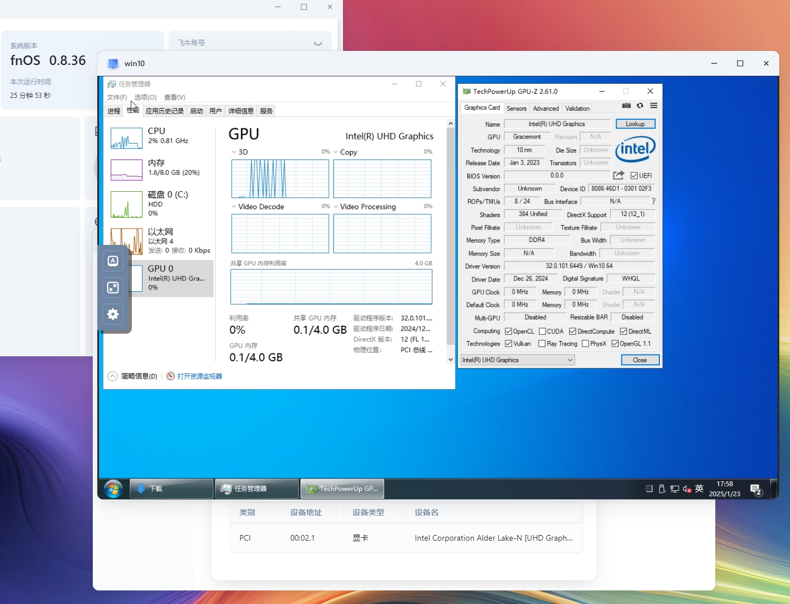

# 飞牛虚拟机让Intel N100核显SR-IOV大败而归

# 前言
直通核显加速虚拟机图形性能，会让宿主机失去核显使用权  
包括但不限于飞牛影视等应用的使用体验会直线下降

那么有没有什么方法可以解决这个问题呢

如果你使用的是Intel的Xe架构核显，那就有福啦  
SR-IOV技术可以解决你的烦恼

# i915.ko
## 安装驱动
在启用IOMMU的基础上，同行内追加```i915.enable_guc=3 i915.max_vfs=7```  
至于如何开启IOMMU请参考其他文章

下载预先编译好的驱动，放到任意目录下  

随后启用树外驱动的命令参考以下命令逐行执行  
注意此处的i915.ko就是刚才提及的驱动，你需要先cd到对应目录才能进行复制  
```shell
mkdir -p /lib/modules/6.6.38-trim/updates/dkms/
cp i915.ko /lib/modules/6.6.38-trim/updates/dkms/
chmod a+r /lib/modules/6.6.38-trim/updates/dkms/i915.ko
depmod
update-grub
```
随后重启fnos即可  

## 启用sriov vf
驱动正确启用后，运行以下命令即可创建核显vf  
```shell
echo 7 > /sys/class/drm/card0/device/sriov_numvfs
```

启用vf后，观察lspci，可以观察到多个vf设备出现

第一个.0为PF设备，其余几个均为VF设备  
注意不要直通PF

# 验证VF设备
将vf正确配置直通入虚拟机，并正确安装驱动
