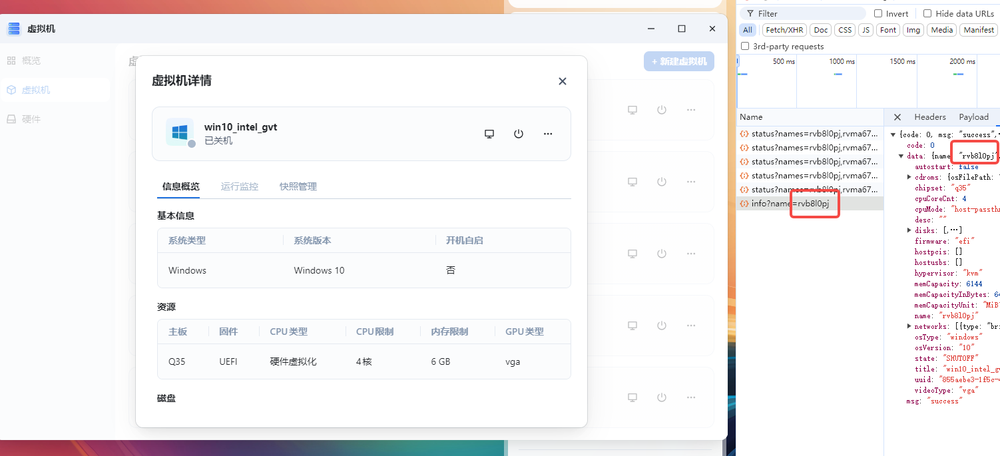
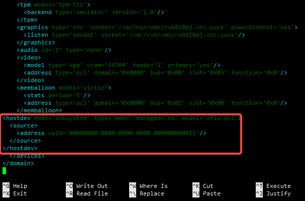
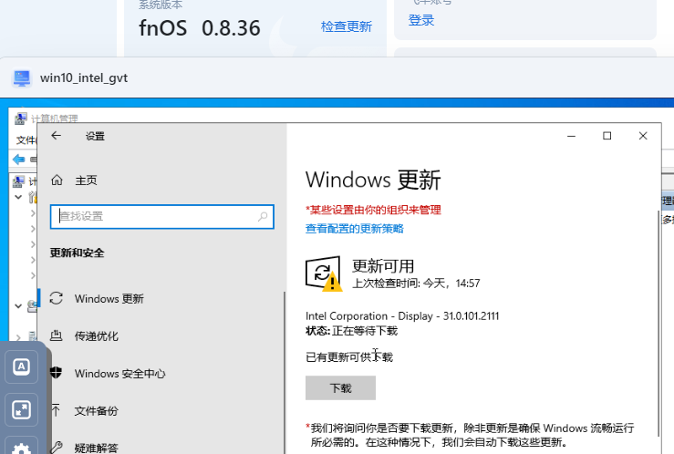
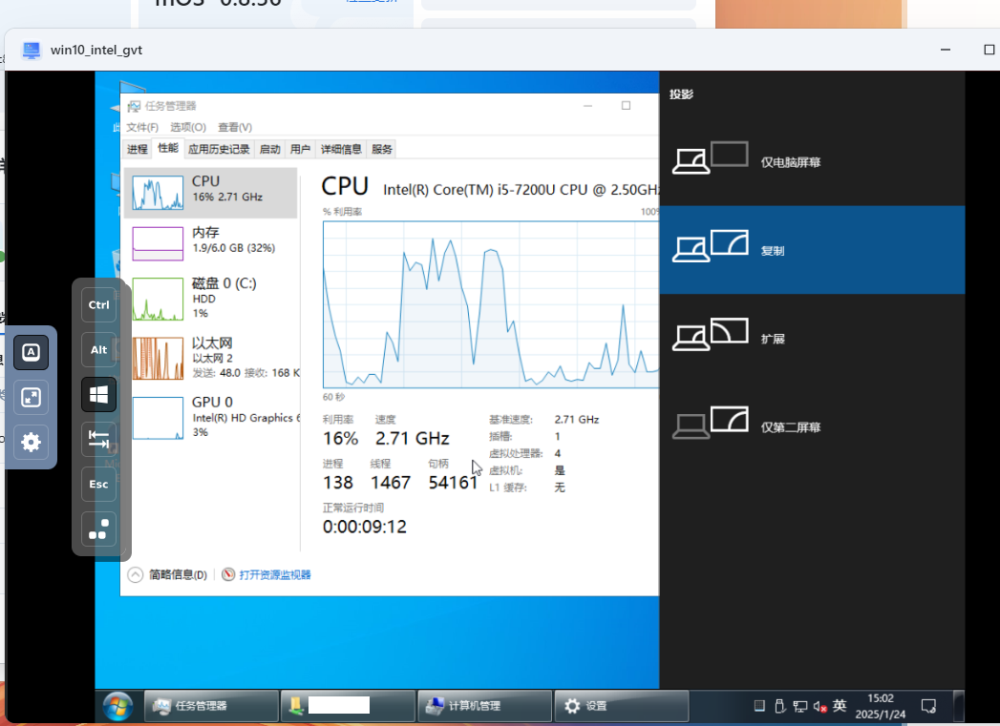
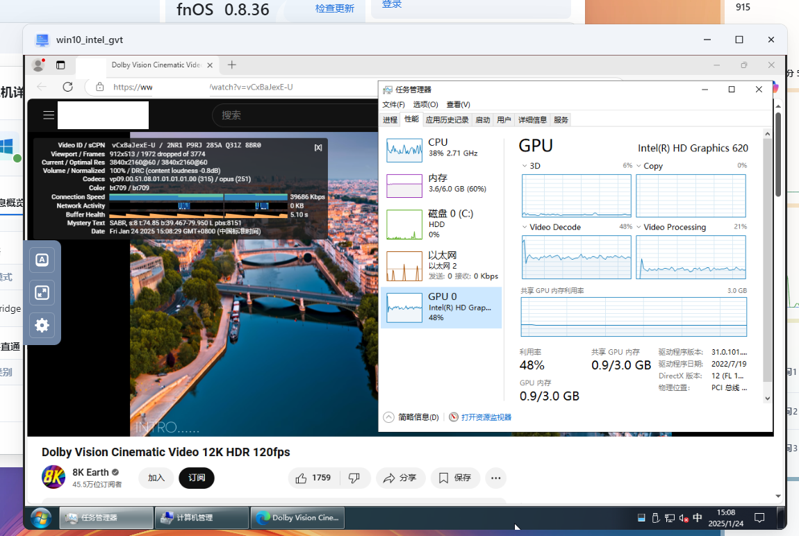
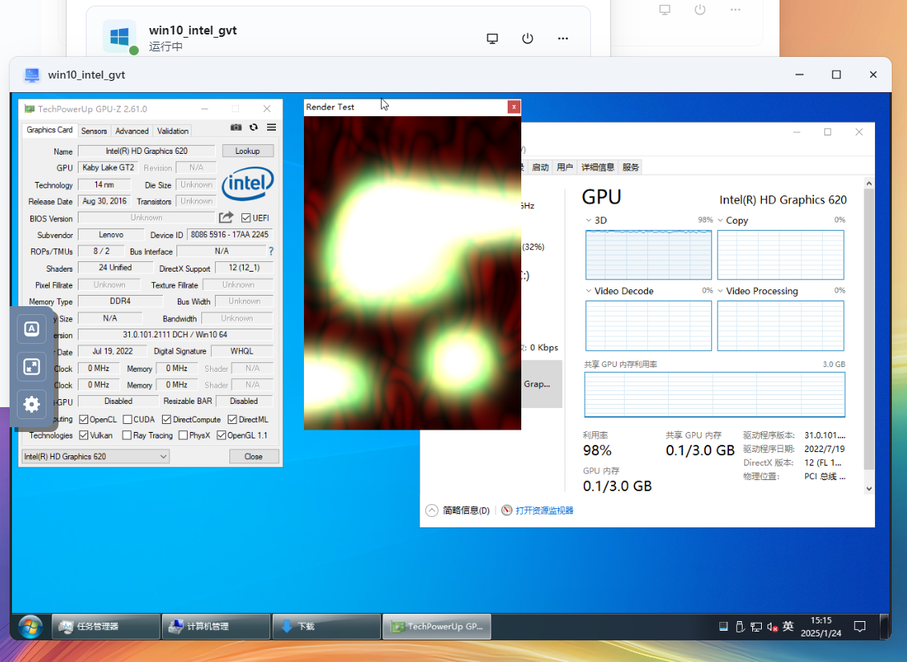
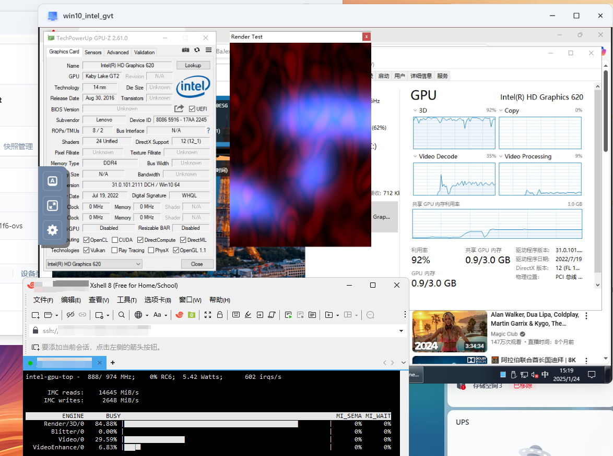
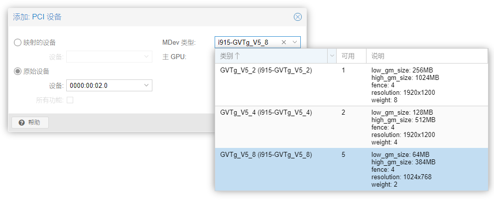

# 在飞牛虚拟机上使用Intel GVT-g共享显卡

# 前言
Intel GVT-g方案可以实现多个虚拟机使用同一块显卡  
本文将会演示，如何在fnOS上的虚拟机使用Intel GVT-g

本文使用的飞牛OS版本为0.8.36  
内核版本为`Linux fnOS-device 6.6.38-trim #80 SMP PREEMPT_DYNAMIC Tue Dec 10 20:45:43 CST 2024 x86_64 GNU/Linux`  
显卡为`VGA compatible controller [0300]: Intel Corporation HD Graphics 620 [8086:5916]`

若你使用的版本与本文提及的版本不同，请自行见机行事  
若你使用的显卡为Xe架构及更新的型号，请使用SR-IOV技术而非GVT-g技术  

# 支持范围
GVT-g支持的处理器架构为  
```shell
BROADWELL
SKYLAKE
KABYLAKE
BROXTON
COFFEELAKE
COMETLAKE
```
具体信息可以阅读源代码了解  
https://github.com/torvalds/linux/blob/bc8198dc7ebc492ec3e9fa1617dcdfbe98e73b17/drivers/gpu/drm/i915/intel_gvt.c#L52

# 准备与配置

## /etc/modules
写入配置即可  
```shell
echo -e "vfio\nvfio_iommu_type1\nvfio_pci\nvfio_virqfd\nmdev\nkvmgt" >> /etc/modules
```
## grub
在开启IOMMU时，追加内核启动参数  
如下所示  
```shell
intel_iommu=on iommu=pt i915.enable_gvt=1
```

## update-grub
完成以上操作后，使用命令更新grub，并重启系统
```shell
update-grub
```

# 检查宿主机状态
## /proc/cmdline
使用命令，查看内核启动参数
```shell
cat /proc/cmdline
```
如下所示，出现了刚刚加入的参数视为正确
```log
BOOT_IMAGE=/boot/vmlinuz-6.6.38-trim root=UUID=2a3a8241-129b-4fd2-bbff-915be052784d ro modprobe.blacklist=pcspkr quiet i915.force_probe=7d55 intel_iommu=on iommu=pt i915.enable_gvt=1
```
## lsmod
使用命令，检查系统模块加载正确  
```shell
lsmod |grep -e vfio -e i915 -e kvmgt -e mdev
```
可参考如下结果，关键模块有出现就行，不需要全部一致  
```log
kvmgt                 417792  0
mdev                   20480  1 kvmgt
kvm                  1318912  2 kvmgt,kvm_intel
i915                 3911680  19 kvmgt
drm_buddy              20480  1 i915
drm_display_helper    221184  1 i915
cec                    65536  2 drm_display_helper,i915
ttm                   102400  1 i915
drm_kms_helper        245760  2 drm_display_helper,i915
i2c_algo_bit           12288  1 i915
vfio_pci               16384  0
vfio_pci_core          86016  1 vfio_pci
irqbypass              12288  2 vfio_pci_core,kvm
vfio_iommu_type1       45056  0
vfio                   61440  4 vfio_pci_core,kvmgt,vfio_iommu_type1,vfio_pci
drm                   749568  8 drm_kms_helper,kvmgt,drm_display_helper,drm_buddy,thinkpad_acpi,i915,ttm
video                  73728  2 thinkpad_acpi,i915
```
## mdev支持类型
因为核显地址基本上都一样，如果不一样你需要自己该成你核显的pci位置  
使用命令查看支持的mdev类型  
```shell
ls -l /sys/devices/pci0000:00/0000:00:02.0/mdev_supported_types
```
可以参考以下结果，至少要有一个mdev类型才能正常使用  
记录mdev类型的名称，留待后面使用  
```shell
total 0
drwxr-xr-x 3 root root 0 Jan 24 11:30 i915-GVTg_V5_2
drwxr-xr-x 3 root root 0 Jan 24 11:30 i915-GVTg_V5_4
drwxr-xr-x 3 root root 0 Jan 24 11:30 i915-GVTg_V5_8
```

# 配置libvirt设备定义
## 定义mdev设备
刚刚记录的mdev名称，现在就可以用到了  
如下所示，写一个xml配置，本例命名为`gvtg_0002_915_5_8.xml`  
这里的`pci_0000_00_02_0`是核显的pci地址  
然后`i915-GVTg_V5_8`是mdev类型，你需要在之前列出的类型中选一个  
```xml
<device>
    <parent>pci_0000_00_02_0</parent>
    <capability type="mdev">
        <type id="i915-GVTg_V5_8"/>
        <uuid>00000000-0000-0000-0000-000000000011</uuid>
    </capability>
</device>
```

将xml文件上传到飞牛nas上，使用如下命令创建该设备定义
```shell
virsh nodedev-define gvtg_0002_915_5_8.xml
```  
执行命令后会有如下的内容展示
```log
root@fnOS-device:~# virsh nodedev-define gvtg_0001_256.xml 
Node device 'mdev_00000000_0000_0000_0000_000000000011_0000_00_02_0' defined from 'gvtg_0002_915_5_8.xml
```  

## 查询mdev设备
如下所示，查一下刚才的注册操作是否成功
```shell
root@fnOS-device:~# virsh nodedev-info mdev_00000000_0000_0000_0000_000000000011_0000_00_02_0
Name:           mdev_00000000_0000_0000_0000_000000000011_0000_00_02_0
Parent:         pci_0000_00_02_0
Active:         no
Persistent:     yes
Autostart:      no
```
这里我们不开启mdev设备自动启动，有需要的用户可以使用`virsh nodedev-autostart`自行启用
## 启用mdev设备
使用如下命令启用mdev设备  
这里的start后接的参数，就是创建设备定义时返回的那一串
```shell
virsh nodedev-start mdev_00000000_0000_0000_0000_000000000011_0000_00_02_0
```
回显如下
```shell
root@fnOS-device:~# virsh nodedev-start mdev_00000000_0000_0000_0000_000000000011_0000_00_02_0
Device mdev_00000000_0000_0000_0000_000000000011_0000_00_02_0 started
root@fnOS-device:~# virsh nodedev-info mdev_00000000_0000_0000_0000_000000000011_0000_00_02_0
Name:           mdev_00000000_0000_0000_0000_000000000011_0000_00_02_0
Parent:         pci_0000_00_02_0
Active:         yes
Persistent:     yes
Autostart:      no
```

# 修改虚拟机libvirt配置

## 寻找虚拟机名称
这里有一个小技巧，打开飞牛虚拟机页面，同时按F12启用浏览器开发者工具  
点击对应的虚拟机，在开发者工具抓到的网络请求就可以知道虚拟机的真实名称  
  
图中展示的虚拟机名称为rvb8l0pj

## 编辑虚拟机xml配置
可以参考下面这份配置，自行修改uuid为你创建时使用的uuid  
这是一份比较通用的配置，如果你需要配置为PCIe设备，或者是配置ramfb请自行修改
```xml
<hostdev mode='subsystem' type='mdev' managed='no' model='vfio-pci'>
  <source>
    <address uuid='00000000-0000-0000-0000-000000000011'/>
  </source>
</hostdev>
```
使用如下命令打开虚拟机配置进行编辑  
记得将虚拟机名称替换为刚刚找到的的名称
```shell
virsh edit rvb8l0pj
```
大概在这个地方插入设备配置  
  
进行保存后，若有类似如下提示，直接按i键
```log
root@fnOS-device:~# virsh edit rvb8l0pj
error: XML document failed to validate against schema: Unable to validate doc against /usr/share/libvirt/schemas/domain.rng
Extra element devices in interleave
Element domain failed to validate content

Failed. Try again? [y,n,i,f,?]: 
```  
会忽略格式问题进行保存，出现如下的回显
```log
Domain 'rvb8l0pj' XML configuration edited.
```

# 启动虚拟机
## 观察设备信息
如下图所示，在设备管理器中可以看见一个没有打驱动的显示设备  
设备ID中包含8086  

## 打驱动
这步没什么好说的，一般来说Windows更新会自己检查驱动  
  
直接下载等他自动安装完成即可
## 切换显示器
驱动安装完毕后，可能会出现VNC被挤占到2号显示器的情况  
此时可以使用热键 Win+P切换显示器  
具体步骤就是按下VNC上的Win键，然后再按下键盘的P键  
盲按几次，一般都能切回主显示器显示  

## 验证GVT-g功能
### 在虚拟机随便播个视频  

### 在虚拟机随便跑跑图形负载  

#### 观察宿主机负载
##### 安装intel-gpu-tools  
```log
root@fnOS-device:~# apt install intel-gpu-tools
Reading package lists... Done
Building dependency tree... Done
Reading state information... Done
The following packages were automatically installed and are no longer required:
  libclang-cpp14 libid3tag0 libigc1 libigdfcl1 libllvmspirvlib14 libopencl-clang14
Use 'apt autoremove' to remove them.
The following NEW packages will be installed:
  intel-gpu-tools
0 upgraded, 1 newly installed, 0 to remove and 9 not upgraded.
Need to get 792 kB of archives.
After this operation, 4,237 kB of additional disk space will be used.
Get:1 https://mirrors.ustc.edu.cn/debian bullseye/main amd64 intel-gpu-tools amd64 1.25-2.1 [792 kB]
Fetched 792 kB in 1s (950 kB/s)         
Selecting previously unselected package intel-gpu-tools.
(Reading database ... 72486 files and directories currently installed.)
Preparing to unpack .../intel-gpu-tools_1.25-2.1_amd64.deb ...
Unpacking intel-gpu-tools (1.25-2.1) ...
Setting up intel-gpu-tools (1.25-2.1) ...
Processing triggers for man-db (2.11.2-2) ...
Processing triggers for libc-bin (2.36-9+deb12u4) ...
ldconfig: /usr/local/lib/libzmq.so.5 is not a symbolic link
```
##### 查看intel_gpu_top

至此，我们的虚拟机功能验证就结束了

# 后记
一顿操作猛如虎，不如换用dockerPVE  
网页上点一点就能开GVT-g简直轻轻松松  

希望飞牛官方早日支持在web端创建添加mdev设备吧
