# 如何给NVIDIA的vgpu-kvm驱动打补丁强开vGPU

# 前言
因为nvidia的vGPU是越来越没有折腾的价值的  
新款GPU据说都走上了SR-IOV的道路  
我是没有钱买新卡的，现在还在用老款呢

Maxwell、Pascal 和 Volta 这几个老架构也准备放弃支持了  
估计是全部要转向用GSP那些东西了

我看互联网上好像没有人说这个驱动应该怎么patch，都是直接给成品的  
因为可能是最后同步更新新版本的vGPU了，故此最后做个笔记  
反正接下来的版本估计是没有新特性了  
后来人如果想接着更新也可以有点参考

本文不包括`libvgpu_unlock_rs.so`修改配置与伪装的部分  
这个部分有开源代码可以直接自己阅读

杂种驱动以及集成`libvgpu_unlock_rs.so`的包后续再写文章，不然本篇就太长了

## 关于新款
很久以前咸鱼搞了张3070M碰过一阵子，然后没玩几天卡就去世了  
只能说大魔改矿卡寿命堪忧  
3070M魔改卡，打起游戏来比我1060还有P106舒服多了  
首先要patch后切换gpumode为compute  
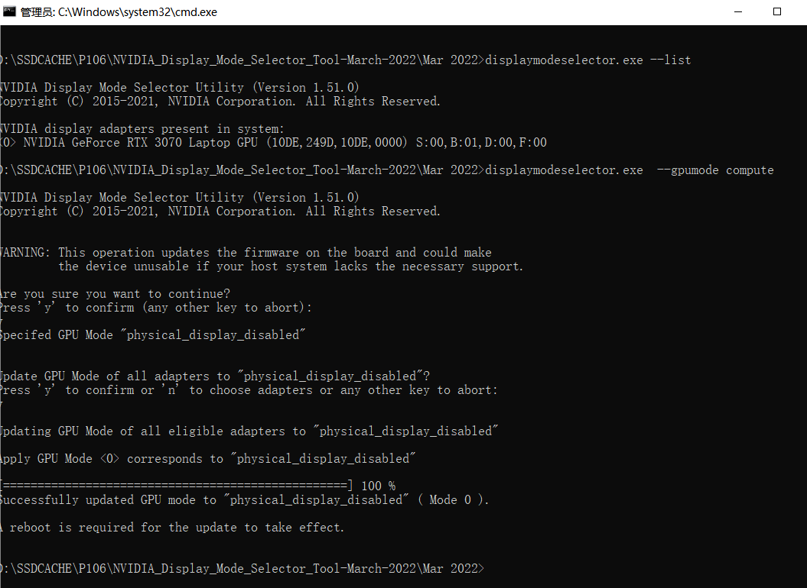  
然后才是去尝试弄vGPU  
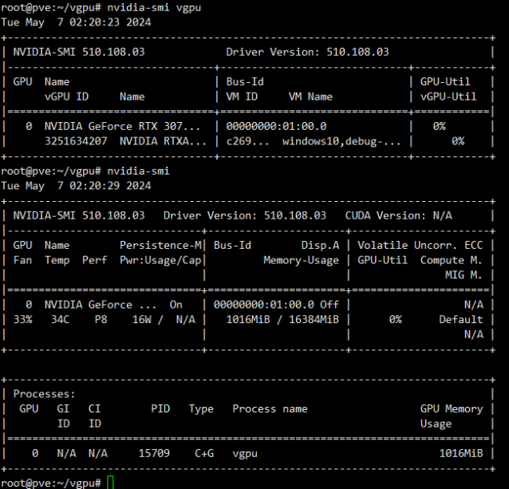  
后面卡去世了就没接着弄了

# 版本说明
本文使用的vGPU包文件为  
NVIDIA-Linux-x86_64-550.144.02-vgpu-kvm

如果版本不同的话可以自己变通一下

# 解包
反正就是，文件拖下来  
给个可执行权限  
使用`--extract-only --target`参数解压  
没什么好说的
```log
root@pve:~/vgpu# wget http://fnos.makedie.net.kp:5244/d/volume1/OpenFolder/P106/kvm/17.5/NVIDIA-Linux-x86_64-550.144.02-vgpu-kvm.run
--2025-01-27 14:54:41--  http://fnos.makedie.net.kp:5244/d/volume1/OpenFolder/P106/kvm/17.5/NVIDIA-Linux-x86_64-550.144.02-vgpu-kvm.run
Resolving fnos.makedie.net.kp (fnos.makedie.net.kp)... 175.45.178.214
Connecting to fnos.makedie.net.kp (fnos.makedie.net.kp)|175.45.178.214|:5244... connected.
HTTP request sent, awaiting response... 200 OK
Length: 53064480 (51M) [text/plain]
Saving to: ‘NVIDIA-Linux-x86_64-550.144.02-vgpu-kvm.run’

NVIDIA-Linux-x86_64-550.144.02-vgpu 100%[================================================================>]  50.61M   108MB/s    in 0.5s    

2025-01-27 14:54:42 (108 MB/s) - ‘NVIDIA-Linux-x86_64-550.144.02-vgpu-kvm.run’ saved [53064480/53064480]

root@pve:~/vgpu# chmod a+x NVIDIA-Linux-x86_64-550.144.02-vgpu-kvm.run 
root@pve:~/vgpu# ./NVIDIA-Linux-x86_64-550.144.02-vgpu-kvm.run  --extract-only --target NVIDIA-Linux-x86_64-550.144.02-vgpu-kvm
Creating directory NVIDIA-Linux-x86_64-550.144.02-vgpu-kvm
Verifying archive integrity... OK
Uncompressing NVIDIA Accelerated Graphics Driver for Linux-x86_64 550.144.02.............................................................................................................................................................................................................................................................................................................................................................................................................................................................................
```

# patch
## nvidia-vgpud
这个文件就在根目录，不需要找  
这一步主要是支持TeslaP4之类的显卡，可以将旧配置丢进去直接用  
这个文件在`NVIDIA-Linux-x86_64-550.144.02-vgpu-kvm/nvidia-vgpud`  
定位到这里  
```log
.text:0000000000402F8A                 jz      loc_403665
``` 
此处有一个跳转  
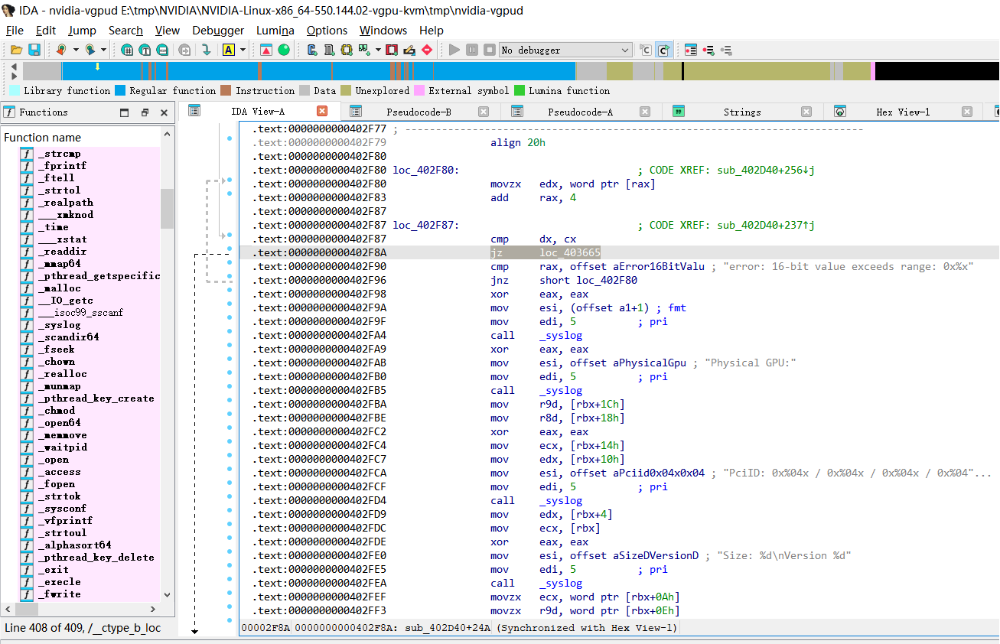  
查看graph的话是这样的，对部分人来说可能看图更好辨识吧  
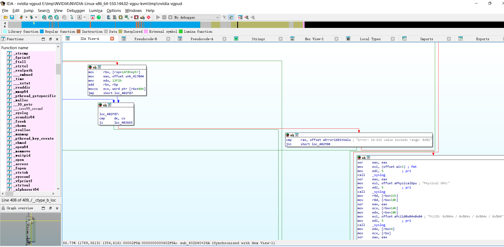  

将此处直接nop掉就行了  
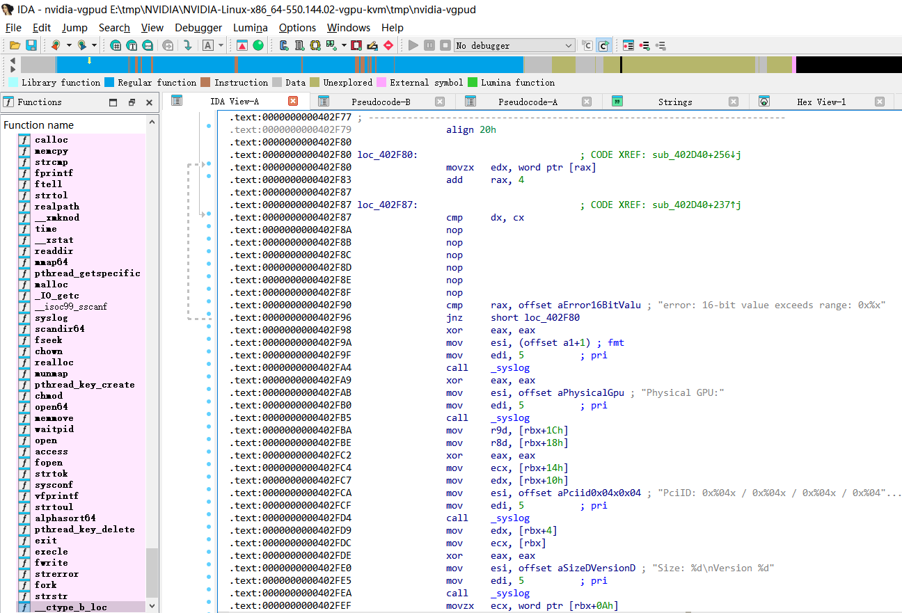

保存后会有提示，记得看一眼别改完了忘记保存  
然后出问题了排查一整天也没有头绪  
```yaml
Applied 6/6 patch(es)
```
## nv-kernel.o_binary
这个文件在包里有两个，此处指的是  
```log
NVIDIA-Linux-x86_64-550.144.02-vgpu-kvm\kernel\nvidia\nv-kernel.o_binary
```
### 第一处
我们先看看此处  
```cp

/*!
 * @brief   This command is used to check if vGPU Software licensing is supported on
 *          the system and to fetch the list of feature(s) that can be licensed
 *          on the system.
 *          Note: This command also returns a dynamic signature that is used in
 *          the computation of response signature passed back in a subsequent
 *          command to enable vGPU software license.
 *
 * @return :
 *    NV_OK                     Success
 *
 */
NV_STATUS
subdeviceCtrlCmdGpuGetLicensableFeatures_IMPL
(
    Subdevice *pSubdevice,
    NV2080_CTRL_GPU_GET_LICENSABLE_FEATURES_PARAMS *pParams
)
{
    OBJGPU *pGpu = GPU_RES_GET_GPU(pSubdevice);
    NvU32 chipID;
    NV_GRID_LICENSE_FEATURE_CODE enabledFeature;

    portMemSet(pParams, 0, sizeof(NV2080_CTRL_GPU_GET_LICENSABLE_FEATURES_PARAMS));

    if (IS_GRID_LICENSED_FEATURES_DISABLED(pGpu))
    {
        pParams->isLicenseSupported = NV_FALSE;
    }
    else
    {
        pParams->isLicenseSupported = isGridLicenseSupported(pGpu);
    }

    if (!pParams->isLicenseSupported)
    {
        NV_PRINTF(LEVEL_INFO,
                  "vGPU Software Licensing not supported on GPU with PCI Device ID: %x\n",
                  pGpu->idInfo.PCIDeviceID);
        return NV_OK;
    }

    enabledFeature = s_enabledGridFeatureState[pGpu->gpuInstance].enabledFeature;

    chipID = DRF_VAL(_PCI, _DEVID, _DEVICE, pGpu->idInfo.PCIDeviceID);

    /* vGPU Software Licensing is supported. Fill in the licensable feature
       codes and corresponding license info */

    if (IS_GRID_FEATURE_VGPU_SUPPORTED(pGpu))
    {
        VGPU_STATIC_INFO *pVSI = GPU_GET_STATIC_INFO(pGpu);

        if (pVSI != NULL)
        {
            pParams->licensableFeatures[pParams->licensableFeaturesCount].featureCode      = NV_GRID_LICENSE_FEATURE_CODE_VGPU;
            pParams->licensableFeatures[pParams->licensableFeaturesCount].isFeatureEnabled = (enabledFeature == NV_GRID_LICENSE_FEATURE_CODE_VGPU);
            pParams->licensableFeatures[pParams->licensableFeaturesCount].isLicensed       = (s_enabledGridFeatureState[pGpu->gpuInstance].bIsLicensed &&
                                                                                              (enabledFeature == NV_GRID_LICENSE_FEATURE_CODE_VGPU));
#if RMCFG_FEATURE_ENABLED(GRID_LICENSE_MANAGER) && !defined(NV_MODS)
            _getLicenseExpiryInfo(pParams, pGpu->gpuId, NV_GRID_LICENSE_FEATURE_CODE_VGPU);
#endif

            portMemCopy(pParams->licensableFeatures[pParams->licensableFeaturesCount].licenseInfo,
                        (NV_GRID_LICENSE_INFO_MAX_LENGTH - 1),
                        pVSI->licenseEdition,
                        (NV_GRID_LICENSE_INFO_MAX_LENGTH - 1));
            portMemCopy(&pParams->licensableFeatures[pParams->licensableFeaturesCount].productName,
                        (NV_GRID_LICENSE_INFO_MAX_LENGTH - 1),
                        pVSI->licensedProductName,
                        (NV_GRID_LICENSE_INFO_MAX_LENGTH - 1));
            pParams->licensableFeaturesCount++;
        }
    }

    if (IS_GRID_FEATURE_QUADRO_SUPPORTED(pGpu) && _isGridFeatureSupportedOnSKU(chipID, NV_GRID_LICENSE_FEATURE_CODE_QUADRO))
    {
        pParams->licensableFeatures[pParams->licensableFeaturesCount].featureCode      = NV_GRID_LICENSE_FEATURE_CODE_QUADRO;
        pParams->licensableFeatures[pParams->licensableFeaturesCount].isFeatureEnabled = (enabledFeature == NV_GRID_LICENSE_FEATURE_CODE_QUADRO);
        pParams->licensableFeatures[pParams->licensableFeaturesCount].isLicensed       = (s_enabledGridFeatureState[pGpu->gpuInstance].bIsLicensed &&
                                                                                          (enabledFeature == NV_GRID_LICENSE_FEATURE_CODE_QUADRO));
#if RMCFG_FEATURE_ENABLED(GRID_LICENSE_MANAGER) && !defined(NV_MODS)
        _getLicenseExpiryInfo(pParams, pGpu->gpuId, NV_GRID_LICENSE_FEATURE_CODE_QUADRO);
#endif

        portMemCopy(&pParams->licensableFeatures[pParams->licensableFeaturesCount].licenseInfo,
                    (NV_GRID_LICENSE_INFO_MAX_LENGTH - 1),
                    NV_GRID_LICENSE_FEATURE_VIRTUAL_WORKSTATION_EDITION,
                    (NV_GRID_LICENSE_INFO_MAX_LENGTH - 1));
        portMemCopy(&pParams->licensableFeatures[pParams->licensableFeaturesCount].productName,
                    (NV_GRID_LICENSE_INFO_MAX_LENGTH - 1),
                    NV_GRID_LICENSED_PRODUCT_VWS,
                    (NV_GRID_LICENSE_INFO_MAX_LENGTH - 1));
        pParams->licensableFeaturesCount++;
    }

    if (IS_GRID_FEATURE_GEFORCE_SUPPORTED(pGpu) && _isGridFeatureSupportedOnSKU(chipID, NV_GRID_LICENSE_FEATURE_CODE_GAMING))
    {
        pParams->licensableFeatures[pParams->licensableFeaturesCount].featureCode      = NV_GRID_LICENSE_FEATURE_CODE_GAMING;
        pParams->licensableFeatures[pParams->licensableFeaturesCount].isFeatureEnabled = (enabledFeature == NV_GRID_LICENSE_FEATURE_CODE_GAMING);
        pParams->licensableFeatures[pParams->licensableFeaturesCount].isLicensed       = (s_enabledGridFeatureState[pGpu->gpuInstance].bIsLicensed &&
                                                                                          (enabledFeature == NV_GRID_LICENSE_FEATURE_CODE_GAMING));
#if RMCFG_FEATURE_ENABLED(GRID_LICENSE_MANAGER) && !defined(NV_MODS)
        _getLicenseExpiryInfo(pParams, pGpu->gpuId, NV_GRID_LICENSE_FEATURE_CODE_GAMING);
#endif

        portMemCopy(&pParams->licensableFeatures[pParams->licensableFeaturesCount].licenseInfo,
                    (NV_GRID_LICENSE_INFO_MAX_LENGTH - 1),
                    NV_GRID_LICENSE_FEATURE_GAMING_EDITION,
                    (NV_GRID_LICENSE_INFO_MAX_LENGTH - 1));
        portMemCopy(&pParams->licensableFeatures[pParams->licensableFeaturesCount].productName,
                    (NV_GRID_LICENSE_INFO_MAX_LENGTH - 1),
                    NV_GRID_LICENSED_PRODUCT_GAMING,
                    (NV_GRID_LICENSE_INFO_MAX_LENGTH - 1));
        pParams->licensableFeaturesCount++;
    }

    if (IS_GRID_FEATURE_COMPUTE_SUPPORTED(pGpu) && _isGridFeatureSupportedOnSKU(chipID, NV_GRID_LICENSE_FEATURE_CODE_COMPUTE))
    {
        pParams->licensableFeatures[pParams->licensableFeaturesCount].featureCode      = NV_GRID_LICENSE_FEATURE_CODE_COMPUTE;
        pParams->licensableFeatures[pParams->licensableFeaturesCount].isFeatureEnabled = (enabledFeature == NV_GRID_LICENSE_FEATURE_CODE_COMPUTE);
        pParams->licensableFeatures[pParams->licensableFeaturesCount].isLicensed       = (s_enabledGridFeatureState[pGpu->gpuInstance].bIsLicensed &&
                                                                                          (enabledFeature == NV_GRID_LICENSE_FEATURE_CODE_COMPUTE));
#if RMCFG_FEATURE_ENABLED(GRID_LICENSE_MANAGER) && !defined(NV_MODS)
        _getLicenseExpiryInfo(pParams, pGpu->gpuId, NV_GRID_LICENSE_FEATURE_CODE_COMPUTE);
#endif

        portMemCopy(&pParams->licensableFeatures[pParams->licensableFeaturesCount].licenseInfo,
                    (NV_GRID_LICENSE_INFO_MAX_LENGTH - 1),
                    NV_GRID_LICENSE_FEATURE_COMPUTE_EDITION,
                    (NV_GRID_LICENSE_INFO_MAX_LENGTH - 1));
        portMemCopy(&pParams->licensableFeatures[pParams->licensableFeaturesCount].productName,
                    (NV_GRID_LICENSE_INFO_MAX_LENGTH - 1),
                    NV_GRID_LICENSED_PRODUCT_COMPUTE,
                    (NV_GRID_LICENSE_INFO_MAX_LENGTH - 1));
        pParams->licensableFeaturesCount++;
    }

    // Fill in the signature - TBD.
    return NV_OK;
}
```  
从这很容易找到引用  
```cpp
/* License info string for GPU Passthrough case. */
#define NV_GRID_LICENSE_FEATURE_VIRTUAL_WORKSTATION_EDITION "Quadro-Virtual-DWS,5.0;GRID-Virtual-WS,2.0;GRID-Virtual-WS-Ext,2.0"
```
我们再看看此处  
```cpp
# integdev_gpu_drv/integ/gpu_drv/stage_rel/drivers/resman/src/kernel/virtualization/grid/grid_features.c
NvBool
isGridLicenseSupported(OBJGPU *pGpu)
{
    NvU32 chipID = DRF_VAL(_PCI, _DEVID, _DEVICE, pGpu->idInfo.PCIDeviceID);
    NvU32 subID  = DRF_VAL(_PCI, _DEVID, _DEVICE, pGpu->idInfo.PCISubDeviceID);
    NvBool gridLicenseSupport = NV_FALSE;

    if (!(IS_SILICON(pGpu)))
        return NV_TRUE;

    switch (chipID)
    {
        case NV_PCI_DEVID_DEVICE_PG402_SKU40       : //Tesla M60
        case NV_PCI_DEVID_DEVICE_P2754_SKU200      : //Tesla M6
        case NV_PCI_DEVID_DEVICE_PG610_SKU200      : //Tesla P40
        case NV_PCI_DEVID_DEVICE_PG414_SKU200      : //Tesla P4
        case NV_PCI_DEVID_DEVICE_PG418_SKU200      : //Tesla P6
        case NV_PCI_DEVID_DEVICE_PH400_SKU202      : //Tesla P100 PCIE 12GB
        case NV_PCI_DEVID_DEVICE_PH400_SKU201      : //Tesla P100 PCIE 16GB
        case NV_PCI_DEVID_DEVICE_PH403_SKU201      : //Tesla P100 SXM2 16GB
        case NV_PCI_DEVID_DEVICE_PG610_SKU210      : //Tesla P10
        case NV_PCI_DEVID_DEVICE_PG503_SKU201      : //Tesla V100 SXM2 16GB
        case NV_PCI_DEVID_DEVICE_PG500_SKU200      : //Tesla V100 16GB
        case NV_PCI_DEVID_DEVICE_PG502_SKU200      : //Tesla V100 FHHL 16GB
        case NV_PCI_DEVID_DEVICE_PG500_SKU202      : //Tesla V100 PCIE 32GB
        case NV_PCI_DEVID_DEVICE_PG503_SKU203      : //Tesla V100 SXM2 32GB
        case NV_PCI_DEVID_DEVICE_PG183_SKU200      : //Tesla T4
        case NV_PCI_DEVID_DEVICE_PG183_SKU205      : //Tesla T4G
        case NV_PCI_DEVID_DEVICE_PG150_SKU210      : //GFN TU102 SKU210
        case NV_PCI_DEVID_DEVICE_PG150_SKU220_215  : //GFN TU102 SKU220 and SKU215
        case NV_PCI_DEVID_DEVICE_PG500_SKU212      : //Tesla V100S PCIe 32GB
        case NV_PCI_DEVID_DEVICE_PG506_SKU200_202  : //NVIDIA A100
        case NV_PCI_DEVID_DEVICE_P1001_SKU200_210  : //NVIDIA A100 PCIE
        case NV_PCI_DEVID_DEVICE_PG133_SKU500      : //NVIDIA RTX A6000
        case NV_PCI_DEVID_DEVICE_PG133_SKU200      : //NVIDIA A40
        case NV_PCI_DEVID_DEVICE_PG133_SKU215      : //NVIDIA A10
        case NV_PCI_DEVID_DEVICE_PG506_SKU210_212  : //NVIDIA A100 SXM4 - SKU 210 and SKU 212
        case NV_PCI_DEVID_DEVICE_PG133_SKU210      : //NVIDIA A10G
        case NV_PCI_DEVID_DEVICE_PG132_SKU500      : //NVIDIA A5000
        case NV_PCI_DEVID_DEVICE_PG132_SKU520      : //NVIDIA A5500
        case NV_PCI_DEVID_DEVICE_P1001_SKU230      : //NVIDIA A100 PCIE 80G
        case NV_PCI_DEVID_DEVICE_P1004_SKU230      : //NVIDIA A100X PCIE 80G
        case NV_PCI_DEVID_DEVICE_P1001_SKU205      : //NVIDIA A30
        case NV_PCI_DEVID_DEVICE_P1004_SKU205      : //NVIDIA A30X
        case NV_PCI_DEVID_DEVICE_PG171_SKU200_TS1  : //NVIDIA A16 TS1
        case NV_PCI_DEVID_DEVICE_PG171_SKU200_PG179_SKU220 : //NVIDIA A16 / A2
        case NV_PCI_DEVID_DEVICE_PG133_SKU230      : // NVIDIA A10M
        case 0x20BF:
            gridLicenseSupport = NV_TRUE;
            break;
        case NV_PCI_DEVID_DEVICE_TU102_PG150_SKU510_875  : //Quadro RTX 6000 and RTX 8000
        case NV_PCI_DEVID_DEVICE_TU102_PG150_SKU231_895  : //Quadro RTX 6000P and RTX 8000P
            if (gpuIsGridswOnQuadroSupported(pGpu))
            {
                gridLicenseSupport = NV_TRUE;
            }
            break;
        case NV_PCI_DEVID_DEVICE_P2405_SKU40   :
            // check for the 4-part IDs of GRID M40 and M40-SP
            // so that they don't get listed as gridLicenseSupported
            if ( (subID != NV_PCI_SUBID_DEVICE_GM107_P2405_SKU40) &&
                 (subID != NV_PCI_SUBID_DEVICE_GM107_P2405_SKUS40) )
                gridLicenseSupport = NV_TRUE;    // Tesla M10 pGPU and all its vGPU configs
            break;
        default:
            if (IsVOLTAorBetter(pGpu))
            {
#if RMCFG_MODULE_ENABLED(VBIOS)
                OBJVBIOS *pVbios          = GPU_GET_VBIOS(pGpu);

                if (pVbios && ((pVbios->InternalUseFlags3) & (NV_BIT_DATA_INTERNAL_V2_BFLAG3_COMPUTE_ONLY)) &&
                     (BRANDING_TYPE_VGX == gpuDetectVgxBranding(pGpu)))
                {
                    gridLicenseSupport = NV_TRUE;
                }
#endif
            }
            break;
    }
    return gridLicenseSupport;
}
```  
所以可以顺藤摸瓜把isGridLicenseSupported找到，然后patch  

根据上面的代码，我们很容易就从引用处找到nv032696rm就是要patch的方法  
不信我们可以进去看看  
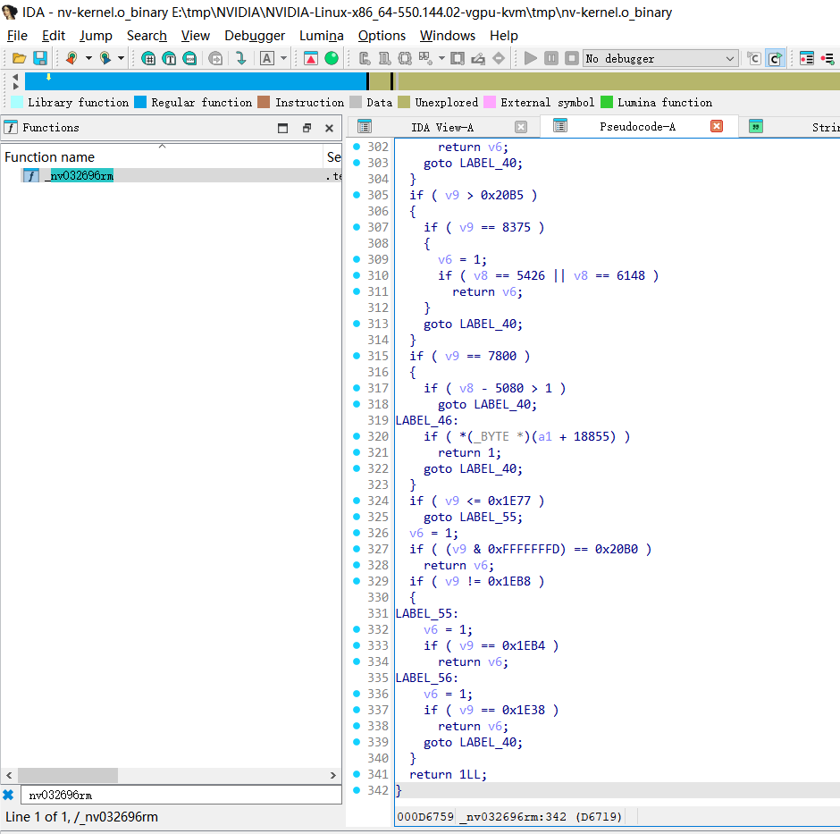  
这一堆的硬件ID，你跟我不是我都不信好吧  
虽然上面的代码已经有些旧了，但是这相似度还是很高的  

这个地方也特别好patch  
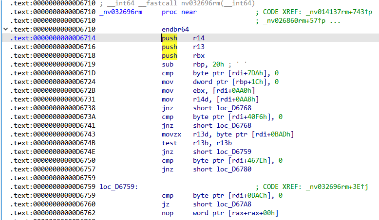  
这个地方直接patch成  
```asm
mov eax,1
retn
```
对应的16进制patch就是这个地方  
```
00 44 89 E0 41 5C 41 5D  41 5E C3 0F 1F 44 00 00
F3 0F 1E FA 41 56 41 55  53 48 83 ED 20 80 BF DA
07 00 00 00 C7 45 1C 00  00 00 00 8B 9F A0 0A 00
```
41 56 41 55 53 48 -> B8 01 00 00 00 C3

### 第二处
第二处地方，因为快吃饭了，简单写写  
在`nv026424rm`这里  
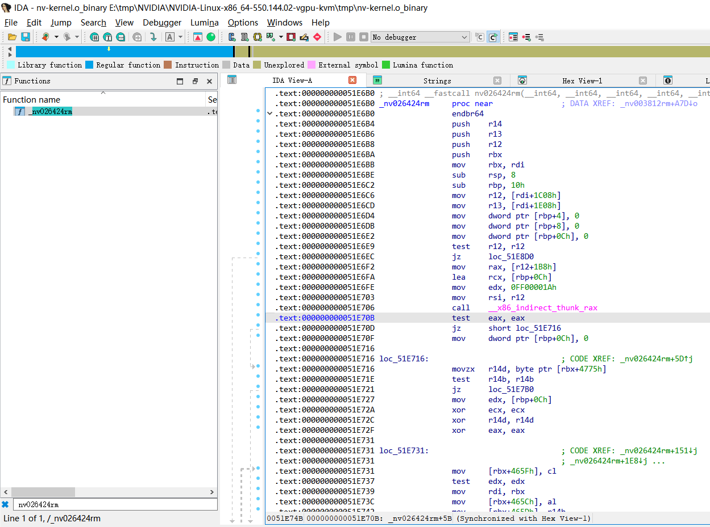
这俩地方直接nop掉  
```
.text:000000000051E70B                 test    eax, eax
.text:000000000051E70D                 jz      short loc_51E716
```
这处将0改为1  
```
.text:000000000051E70F                 mov     dword ptr [rbp+0Ch], 0
```
结果就是  
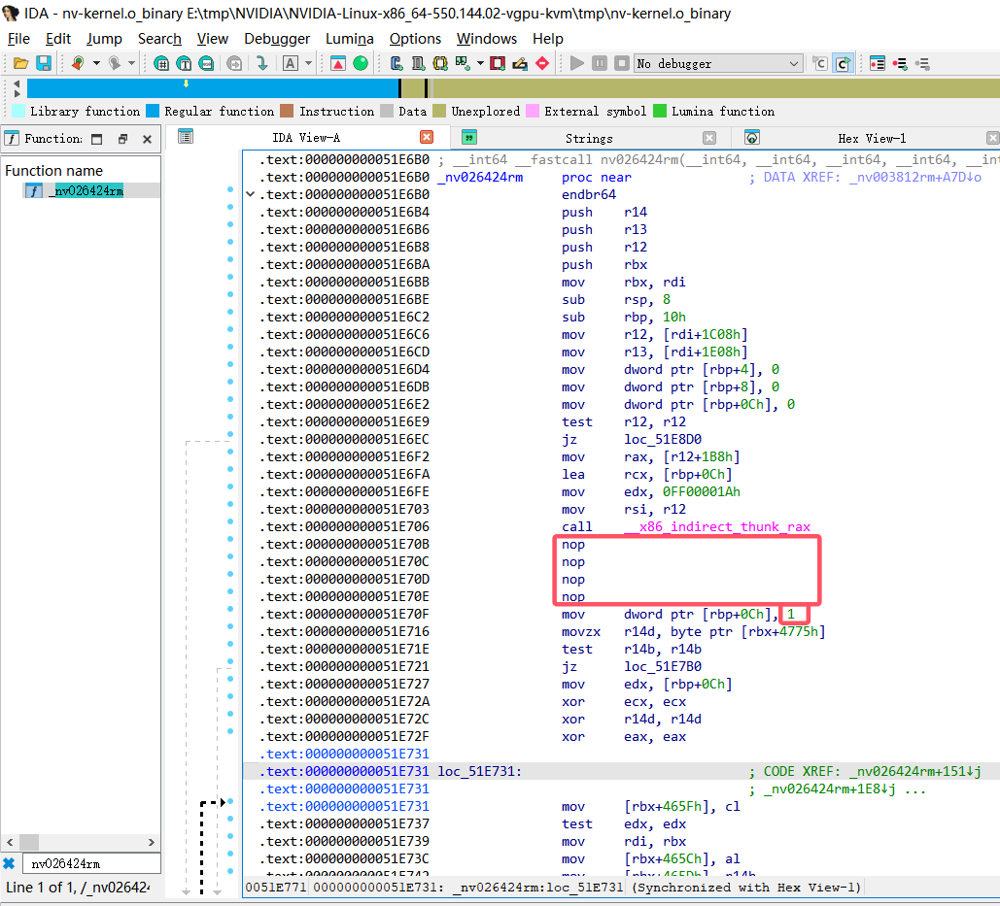
对应16进制的patch就是这个地方  
```
00 00 49 8B 84 24 B8 01  00 00 48 8D 4D 0C BA 1A
00 00 FF 4C 89 E6 E8 AD  22 C3 02 85 C0 74 07 C7
45 0C 00 00 00 00 44 0F  B6 B3 75 47 00 00 45 84
```
85 C0 74 07 ?? ?? ?? 00 -> 90 90 90 90 ?? ?? ?? 01
# 安装验证
## 安装
将两个文件替换掉就可以了  
然后使用命令安装  
注意这个`-m kernel`
```yaml
root@pve:~/vgpu/NVIDIA-Linux-x86_64-550.144.02-vgpu-kvm# ./nvidia-installer -m kernel
```
## 验证内核驱动
老样子，输入命令验证，没有报错说明内核驱动的patch没问题  
```log
root@pve:~/vgpu/NVIDIA-Linux-x86_64-550.144.02-vgpu-kvm# uname -a
Linux pve 6.8.12-5-pve #1 SMP PREEMPT_DYNAMIC PMX 6.8.12-5 (2024-12-03T10:26Z) x86_64 GNU/Linux
root@pve:~/vgpu/NVIDIA-Linux-x86_64-550.144.02-vgpu-kvm# nvidia-smi
Mon Jan 27 17:31:11 2025       
+-----------------------------------------------------------------------------------------+
| NVIDIA-SMI 550.144.02             Driver Version: 550.144.02     CUDA Version: N/A      |
|-----------------------------------------+------------------------+----------------------+
| GPU  Name                 Persistence-M | Bus-Id          Disp.A | Volatile Uncorr. ECC |
| Fan  Temp   Perf          Pwr:Usage/Cap |           Memory-Usage | GPU-Util  Compute M. |
|                                         |                        |               MIG M. |
|=========================================+========================+======================|
|   0  NVIDIA GeForce GTX 1060 6GB    Off |   00000000:01:00.0 Off |                  N/A |
|  0%   41C    P0             30W /  120W |      29MiB /   6144MiB |      1%      Default |
|                                         |                        |                  N/A |
+-----------------------------------------+------------------------+----------------------+
                                                                                         
+-----------------------------------------------------------------------------------------+
| Processes:                                                                              |
|  GPU   GI   CI        PID   Type   Process name                              GPU Memory |
|        ID   ID                                                               Usage      |
|=========================================================================================|
|  No running processes found                                                             |
+-----------------------------------------------------------------------------------------+
root@pve:~/vgpu/NVIDIA-Linux-x86_64-550.144.02-vgpu-kvm# nvidia-smi vgpu
Mon Jan 27 17:31:24 2025       
+-----------------------------------------------------------------------------+
| NVIDIA-SMI 550.144.02             Driver Version: 550.144.02                |
|---------------------------------+------------------------------+------------+
| GPU  Name                       | Bus-Id                       | GPU-Util   |
|      vGPU ID     Name           | VM ID     VM Name            | vGPU-Util  |
|=================================+==============================+============|
|   0  NVIDIA GeForce GTX 106...  | 00000000:01:00.0             |   0%       |
+---------------------------------+------------------------------+------------+
root@pve:~/vgpu/NVIDIA-Linux-x86_64-550.144.02-vgpu-kvm# 
```
## mdev配置修改
但是我们的设备依旧没有mdev出现  
这是因为我们的卡没有vGPU配置，如果使用了`libvgpu_unlock_rs.so`会帮你做这一步  
平时你没有感知是因为驱动包已经集成了这个插件  
这里直接按那个项目说明手动部署，把配置与so丢到正确的地方  
```log
mkdir /etc/vgpu_unlock
touch /etc/vgpu_unlock/profile_override.toml
mkdir /etc/systemd/system/{nvidia-vgpud.service.d,nvidia-vgpu-mgr.service.d}
echo -e "[Service]\nEnvironment=LD_PRELOAD=/opt/vgpu_unlock-rs/target/release/libvgpu_unlock_rs.so" > /etc/systemd/system/nvidia-vgpud.service.d/vgpu_unlock.conf
echo -e "[Service]\nEnvironment=LD_PRELOAD=/opt/vgpu_unlock-rs/target/release/libvgpu_unlock_rs.so" > /etc/systemd/system/nvidia-vgpu-mgr.service.d/vgpu_unlock.conf
cat /etc/systemd/system/{nvidia-vgpud.service.d,nvidia-vgpu-mgr.service.d}/*
[Service]
Environment=LD_PRELOAD=/opt/vgpu_unlock-rs/target/release/libvgpu_unlock_rs.so
[Service]
Environment=LD_PRELOAD=/opt/vgpu_unlock-rs/target/release/libvgpu_unlock_rs.so
```
创建好目录把`libvgpu_unlock_rs.so`丢进去  
```shell
mkdir -p /opt/vgpu_unlock-rs/target/release
cp libvgpu_unlock_rs.so /opt/vgpu_unlock-rs/target/release/
```  
随后重载服务并重启服务  
```shell
systemctl daemon-reload
systemctl restart {nvidia-vgpud.service,nvidia-vgpu-mgr.service}
```  
这个时候我们的mdev设备就应该出来了  
```shell
root@pve:~# mdevctl types
0000:01:00.0
  nvidia-760
    Available instances: 24
    Device API: vfio-pci
    Name: NVIDIA RTXA5500-1B
    Description: num_heads=4, frl_config=45, framebuffer=1024M, max_resolution=5120x2880, max_instance=24
  nvidia-761
    Available instances: 12
    Device API: vfio-pci
    Name: NVIDIA RTXA5500-2B
    Description: num_heads=4, frl_config=45, framebuffer=2048M, max_resolution=5120x2880, max_instance=12
```
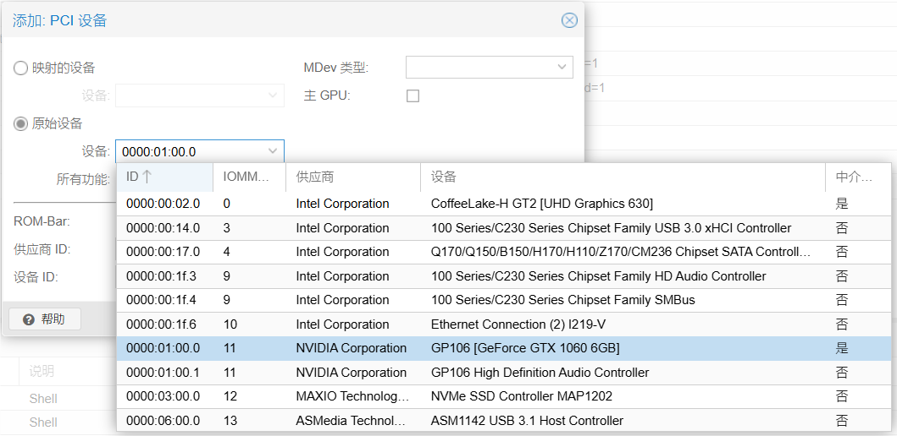  
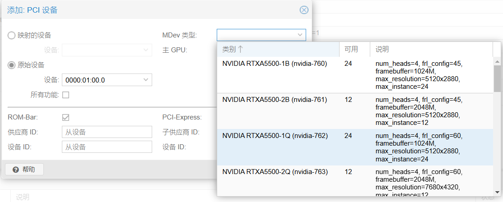

## 虚拟机内验证
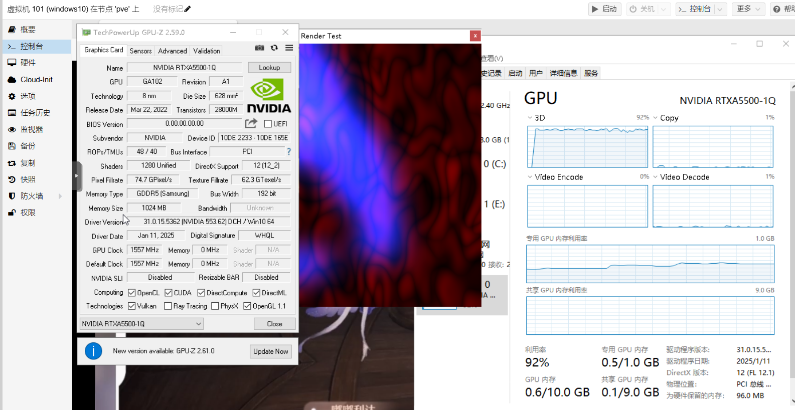
```log
root@pve:~# uname -a
Linux pve 6.8.12-5-pve #1 SMP PREEMPT_DYNAMIC PMX 6.8.12-5 (2024-12-03T10:26Z) x86_64 GNU/Linux
root@pve:~# nvidia-smi
Mon Jan 27 18:14:22 2025       
+-----------------------------------------------------------------------------------------+
| NVIDIA-SMI 550.144.02             Driver Version: 550.144.02     CUDA Version: N/A      |
|-----------------------------------------+------------------------+----------------------+
| GPU  Name                 Persistence-M | Bus-Id          Disp.A | Volatile Uncorr. ECC |
| Fan  Temp   Perf          Pwr:Usage/Cap |           Memory-Usage | GPU-Util  Compute M. |
|                                         |                        |               MIG M. |
|=========================================+========================+======================|
|   0  NVIDIA GeForce GTX 1060 6GB    On  |   00000000:01:00.0 Off |                  N/A |
| 27%   53C    P0             69W /  120W |    1043MiB /   6144MiB |     92%      Default |
|                                         |                        |                  N/A |
+-----------------------------------------+------------------------+----------------------+
                                                                                         
+-----------------------------------------------------------------------------------------+
| Processes:                                                                              |
|  GPU   GI   CI        PID   Type   Process name                              GPU Memory |
|        ID   ID                                                               Usage      |
|=========================================================================================|
|    0   N/A  N/A     60395    C+G   vgpu                                         1014MiB |
+-----------------------------------------------------------------------------------------+
root@pve:~# nvidia-smi vgpu
Mon Jan 27 18:14:24 2025       
+-----------------------------------------------------------------------------+
| NVIDIA-SMI 550.144.02             Driver Version: 550.144.02                |
|---------------------------------+------------------------------+------------+
| GPU  Name                       | Bus-Id                       | GPU-Util   |
|      vGPU ID     Name           | VM ID     VM Name            | vGPU-Util  |
|=================================+==============================+============|
|   0  NVIDIA GeForce GTX 106...  | 00000000:01:00.0             |  92%       |
|      3251634247  NVIDIA RTXA... | c269...  windows10,debug-... |     90%    |
+---------------------------------+------------------------------+------------+
```

# 示例patch
在附件中我提供了一个patch，作为示例  
将`NVIDIA_550.144.02_vGPU.patch`丢到与`NVIDIA-Linux-x86_64-550.144.02-vgpu-kvm.run`同目录下  
然后执行脚本，它自己会把补丁打上  
```shell
./NVIDIA-Linux-x86_64-550.144.02-vgpu-kvm.run --apply-patch NVIDIA_550.144.02_vGPU.patch
```  
等待它打补丁即可  
```shell
root@pve:~/vgpu# ./NVIDIA-Linux-x86_64-550.144.02-vgpu-kvm.run --apply-patch NVIDIA_550.144.02_vGPU.patch
Verifying archive integrity... OK
Uncompressing NVIDIA Accelerated Graphics Driver for Linux-x86_64 550.144.02.............................................................................................................................................................................................................................................................................................................................................................................................................................................................................
patching file nvidia-vgpud
patching file kernel/nvidia/nv-kernel.o_binary
chmod: cannot access './NVIDIA-Linux-x86_64-550.144.02-vgpu-kvm-custom/pkg-history.txt': No such file or directory
Adding files to archive named "NVIDIA-Linux-x86_64-550.144.02-vgpu-kvm-custom.run"...
./makeself-help-script.sh
./libglvnd_install_checker/
./libglvnd_install_checker/glvnd_check
./libglvnd_install_checker/libGLX_installcheck.so.0
./libglvnd_install_checker/egl_dummy_vendor.json
./nvidia-xid-logd
./firmware/
./firmware/gsp_tu10x.bin
./firmware/gsp_ga10x.bin
./nvidia-vgpu-mgr
./systemd/
./systemd/nvidia-sleep.sh
./systemd/system-sleep/
./systemd/system-sleep/nvidia
./.manifest
./kernel/
./kernel/count-lines.mk
./kernel/common/
./kernel/common/inc/
./kernel/common/inc/nvstatuscodes.h
./kernel/common/inc/nv-pci.h
./kernel/common/inc/nvCpuUuid.h
./kernel/common/inc/conftest.h
./kernel/common/inc/nv-msi.h
./kernel/common/inc/nv_uvm_interface.h
./kernel/common/inc/nv-procfs.h
./kernel/common/inc/nv-ioctl.h
./kernel/common/inc/nv-timer.h
./kernel/common/inc/nvmisc.h
./kernel/common/inc/nv-gpu-info.h
./kernel/common/inc/nvtypes.h
./kernel/common/inc/nv-firmware-registry.h
./kernel/common/inc/cpuopsys.h
./kernel/common/inc/nv.h
./kernel/common/inc/nv-pgprot.h
./kernel/common/inc/os/
./kernel/common/inc/os/nv_memory_type.h
./kernel/common/inc/nv-memdbg.h
./kernel/common/inc/nv-pci-types.h
./kernel/common/inc/nv-lock.h
./kernel/common/inc/nvstatus.h
./kernel/common/inc/nv-kernel-interface-api.h
./kernel/common/inc/nv-linux.h
./kernel/common/inc/nvgputypes.h
./kernel/common/inc/nv-kref.h
./kernel/common/inc/nv-kthread-q.h
./kernel/common/inc/nv-chardev-numbers.h
./kernel/common/inc/nv-hash.h
./kernel/common/inc/os-interface.h
./kernel/common/inc/nv-kthread-q-os.h
./kernel/common/inc/rm-gpu-ops.h
./kernel/common/inc/nv-modeset-interface.h
./kernel/common/inc/nv_uvm_types.h
./kernel/common/inc/nv-firmware.h
./kernel/common/inc/nv-retpoline.h
./kernel/common/inc/nv-caps.h
./kernel/common/inc/nv-ioctl-numbers.h
./kernel/common/inc/nv-list-helpers.h
./kernel/common/inc/nvlimits.h
./kernel/common/inc/nv-ioctl-numa.h
./kernel/common/inc/nv_stdarg.h
./kernel/common/inc/nv_speculation_barrier.h
./kernel/common/inc/nv-procfs-utils.h
./kernel/common/inc/nv-hypervisor.h
./kernel/common/inc/nv-time.h
./kernel/common/inc/nv-proto.h
./kernel/common/inc/nv-vgpu-vfio-interface.h
./kernel/common/inc/nv-dmabuf.h
./kernel/common/inc/nv-mm.h
./kernel/conftest.sh
./kernel/header-presence-tests.mk
./kernel/Makefile
./kernel/nvidia/
./kernel/nvidia/nvlink_linux.c
./kernel/nvidia/linux_nvswitch.h
./kernel/nvidia/nv-reg.h
./kernel/nvidia/nv-modeset-interface.c
./kernel/nvidia/nv-memdbg.c
./kernel/nvidia/libspdm_ec.c
./kernel/nvidia/nv-dma.c
./kernel/nvidia/nv-report-err.h
./kernel/nvidia/hal/
./kernel/nvidia/hal/library/
./kernel/nvidia/hal/library/cryptlib/
./kernel/nvidia/hal/library/cryptlib/cryptlib_sm2.h
./kernel/nvidia/hal/library/cryptlib/cryptlib_dh.h
./kernel/nvidia/hal/library/cryptlib/cryptlib_rng.h
./kernel/nvidia/hal/library/cryptlib/cryptlib_ec.h
./kernel/nvidia/hal/library/cryptlib/cryptlib_rsa.h
./kernel/nvidia/hal/library/cryptlib/cryptlib_ecd.h
./kernel/nvidia/hal/library/cryptlib/cryptlib_mac.h
./kernel/nvidia/hal/library/cryptlib/cryptlib_aead.h
./kernel/nvidia/hal/library/cryptlib/cryptlib_cert.h
./kernel/nvidia/hal/library/cryptlib/cryptlib_hkdf.h
./kernel/nvidia/hal/library/cryptlib/cryptlib_hash.h
./kernel/nvidia/libspdm_ecc.c
./kernel/nvidia/ioctl_nvswitch.h
./kernel/nvidia/nv-mmap.c
./kernel/nvidia/i2c_nvswitch.c
./kernel/nvidia/nv-ibmnpu.h
./kernel/nvidia/libspdm_aead.c
./kernel/nvidia/nvlink_export.h
./kernel/nvidia/export_nvswitch.h
./kernel/nvidia/nv_uvm_interface.c
./kernel/nvidia/os-usermap.c
./kernel/nvidia/nv-pci-table.h
./kernel/nvidia/nv_gpu_ops.h
./kernel/nvidia/nv-caps-imex.h
./kernel/nvidia/nvidia.Kbuild
./kernel/nvidia/nvidia-sources.Kbuild
./kernel/nvidia/nv-pat.h
./kernel/nvidia/nv-vm.c
./kernel/nvidia/internal/
./kernel/nvidia/internal/libspdm_lib_config.h
./kernel/nvidia/nv-procfs.c
./kernel/nvidia/nvlink_pci.h
./kernel/nvidia/library/
./kernel/nvidia/library/spdm_lib_config.h
./kernel/nvidia/library/cryptlib.h
./kernel/nvidia/ioctl_common_nvswitch.h
./kernel/nvidia/nv-p2p.h
./kernel/nvidia/libspdm_hkdf.c
./kernel/nvidia/nv-cray.c
./kernel/nvidia/detect-self-hosted.h
./kernel/nvidia/nv-caps.c
./kernel/nvidia/libspdm_sha.c
./kernel/nvidia/nv-rsync.h
./kernel/nvidia/nv-nano-timer.c
./kernel/nvidia/libspdm_hkdf_sha.c
./kernel/nvidia/libspdm_x509.c
./kernel/nvidia/libspdm_internal_crypt_lib.c
./kernel/nvidia/nvlink_caps.h
./kernel/nvidia/nvlink_errors.h
./kernel/nvidia/nv-ibmnpu.c
./kernel/nvidia/libspdm_hmac_sha.c
./kernel/nvidia/nv-usermap.c
./kernel/nvidia/libspdm_shash.c
./kernel/nvidia/nv-report-err.c
./kernel/nvidia/nv-dmabuf.c
./kernel/nvidia/libspdm_rand.c
./kernel/nvidia/nvlink_common.h
./kernel/nvidia/libspdm_rsa_ext.c
./kernel/nvidia/nv-pci.c
./kernel/nvidia/internal_crypt_lib.h
./kernel/nvidia/libspdm_aead_aes_gcm.c
./kernel/nvidia/nv-msi.c
./kernel/nvidia/nvlink_linux.h
./kernel/nvidia/rmp2pdefines.h
./kernel/nvidia/linux_nvswitch.c
./kernel/nvidia/libspdm_rsa.c
./kernel/nvidia/nv-rsync.c
./kernel/nvidia/nv-vtophys.c
./kernel/nvidia/nvlink_caps.c
./kernel/nvidia/nvspdm_cryptlib_extensions.h
./kernel/nvidia/nv-vgpu-vfio-interface.c
./kernel/nvidia/nv-kthread-q.c
./kernel/nvidia/nv-acpi.c
./kernel/nvidia/os-registry.c
./kernel/nvidia/os-mlock.c
./kernel/nvidia/nv-p2p.c
./kernel/nvidia/os-pci.c
./kernel/nvidia/nvlink_proto.h
./kernel/nvidia/os-interface.c
./kernel/nvidia/nv-pat.c
./kernel/nvidia/procfs_nvswitch.c
./kernel/nvidia/nv-kernel.o_binary
./kernel/nvidia/nv-i2c.c
./kernel/nvidia/nvlink_os.h
./kernel/nvidia/nv-pci-table.c
./kernel/nvidia/nv-caps-imex.c
./kernel/nvidia/nv.c
./kernel/dkms.conf
./kernel/nvidia-vgpu-vfio/
./kernel/nvidia-vgpu-vfio/nvidia-vgpu-vfio-sources.Kbuild
./kernel/nvidia-vgpu-vfio/nv-pci-table.c
./kernel/nvidia-vgpu-vfio/nv-vgpu-ioctl.h
./kernel/nvidia-vgpu-vfio/vgpu-ctldev.c
./kernel/nvidia-vgpu-vfio/vgpu-devices.h
./kernel/nvidia-vgpu-vfio/nvidia-vgpu-vfio.h
./kernel/nvidia-vgpu-vfio/vgpu-vfio-mdev.c
./kernel/nvidia-vgpu-vfio/nv-pci-table.h
./kernel/nvidia-vgpu-vfio/nvidia-vgpu-vfio.Kbuild
./kernel/nvidia-vgpu-vfio/vgpu-vfio-pci-core.c
./kernel/nvidia-vgpu-vfio/vgpu-devices.c
./kernel/nvidia-vgpu-vfio/nvidia-vgpu-vfio.c
./kernel/Kbuild
./nvidia-vgpud
./nvidia-debugdump
./init-scripts/
./init-scripts/pre-uninstall
./init-scripts/common.sh
./init-scripts/upstart/
./init-scripts/upstart/nvidia-vgpu-mgr.conf
./init-scripts/upstart/nvidia-vgpud.conf
./init-scripts/systemd/
./init-scripts/systemd/nvidia-vgpu-mgr.service
./init-scripts/systemd/nvidia-vgpud.service
./init-scripts/systemd/nvidia-xid-logd.service
./init-scripts/sysv/
./init-scripts/sysv/nvidia-vgpu-mgr
./init-scripts/sysv/nvidia-xid-logd
./init-scripts/sysv/nvidia-vgpud
./init-scripts/post-install
./init-scripts/pre-unload
./nvidia-smi
./nvidia-installer
./nvidia-modprobe
./kernel-open/
./kernel-open/header-presence-tests.mk
./kernel-open/Kbuild
./kernel-open/Makefile
./kernel-open/count-lines.mk
./kernel-open/nvidia-vgpu-vfio/
./kernel-open/nvidia-vgpu-vfio/vgpu-ctldev.c
./kernel-open/nvidia-vgpu-vfio/vgpu-devices.h
./kernel-open/nvidia-vgpu-vfio/nv-vgpu-ioctl.h
./kernel-open/nvidia-vgpu-vfio/nvidia-vgpu-vfio.Kbuild
./kernel-open/nvidia-vgpu-vfio/vgpu-vfio-mdev.c
./kernel-open/nvidia-vgpu-vfio/nvidia-vgpu-vfio.c
./kernel-open/nvidia-vgpu-vfio/nv-pci-table.c
./kernel-open/nvidia-vgpu-vfio/vgpu-devices.c
./kernel-open/nvidia-vgpu-vfio/nvidia-vgpu-vfio-sources.Kbuild
./kernel-open/nvidia-vgpu-vfio/nv-pci-table.h
./kernel-open/nvidia-vgpu-vfio/nvidia-vgpu-vfio.h
./kernel-open/nvidia-vgpu-vfio/vgpu-vfio-pci-core.c
./kernel-open/nvidia/
./kernel-open/nvidia/os-pci.c
./kernel-open/nvidia/os-mlock.c
./kernel-open/nvidia/nv-p2p.c
./kernel-open/nvidia/libspdm_rsa.c
./kernel-open/nvidia/nv-rsync.c
./kernel-open/nvidia/nv-procfs.c
./kernel-open/nvidia/libspdm_rand.c
./kernel-open/nvidia/linux_nvswitch.h
./kernel-open/nvidia/libspdm_hkdf_sha.c
./kernel-open/nvidia/libspdm_internal_crypt_lib.c
./kernel-open/nvidia/nv-report-err.c
./kernel-open/nvidia/nvidia-sources.Kbuild
./kernel-open/nvidia/nv_uvm_interface.c
./kernel-open/nvidia/nvlink_common.h
./kernel-open/nvidia/rmp2pdefines.h
./kernel-open/nvidia/nvlink_linux.h
./kernel-open/nvidia/nv-pat.c
./kernel-open/nvidia/nvlink_errors.h
./kernel-open/nvidia/libspdm_rsa_ext.c
./kernel-open/nvidia/ioctl_nvswitch.h
./kernel-open/nvidia/nv-i2c.c
./kernel-open/nvidia/nv-usermap.c
./kernel-open/nvidia/libspdm_shash.c
./kernel-open/nvidia/nv.c
./kernel-open/nvidia/internal_crypt_lib.h
./kernel-open/nvidia/nv-kthread-q.c
./kernel-open/nvidia/nvlink_proto.h
./kernel-open/nvidia/nv-memdbg.c
./kernel-open/nvidia/os-interface.c
./kernel-open/nvidia/libspdm_aead_aes_gcm.c
./kernel-open/nvidia/nv-acpi.c
./kernel-open/nvidia/os-registry.c
./kernel-open/nvidia/nvlink_caps.c
./kernel-open/nvidia/nv-pci.c
./kernel-open/nvidia/procfs_nvswitch.c
./kernel-open/nvidia/nv-vtophys.c
./kernel-open/nvidia/nv-caps-imex.c
./kernel-open/nvidia/nv-ibmnpu.h
./kernel-open/nvidia/nv-pci-table.c
./kernel-open/nvidia/ioctl_common_nvswitch.h
./kernel-open/nvidia/nv-msi.c
./kernel-open/nvidia/nvlink_linux.c
./kernel-open/nvidia/nv-pat.h
./kernel-open/nvidia/internal/
./kernel-open/nvidia/internal/libspdm_lib_config.h
./kernel-open/nvidia/nv-mmap.c
./kernel-open/nvidia/nv-vm.c
./kernel-open/nvidia/detect-self-hosted.h
./kernel-open/nvidia/nvlink_export.h
./kernel-open/nvidia/nv-kernel.o_binary
./kernel-open/nvidia/libspdm_ecc.c
./kernel-open/nvidia/nvspdm_cryptlib_extensions.h
./kernel-open/nvidia/nv-report-err.h
./kernel-open/nvidia/nv-rsync.h
./kernel-open/nvidia/linux_nvswitch.c
./kernel-open/nvidia/libspdm_ec.c
./kernel-open/nvidia/i2c_nvswitch.c
./kernel-open/nvidia/nv-p2p.h
./kernel-open/nvidia/libspdm_aead.c
./kernel-open/nvidia/library/
./kernel-open/nvidia/library/spdm_lib_config.h
./kernel-open/nvidia/library/cryptlib.h
./kernel-open/nvidia/nvlink_os.h
./kernel-open/nvidia/nv-modeset-interface.c
./kernel-open/nvidia/nv-nano-timer.c
./kernel-open/nvidia/nvlink_caps.h
./kernel-open/nvidia/nv-caps-imex.h
./kernel-open/nvidia/nv-ibmnpu.c
./kernel-open/nvidia/nv-pci-table.h
./kernel-open/nvidia/export_nvswitch.h
./kernel-open/nvidia/libspdm_sha.c
./kernel-open/nvidia/nv-caps.c
./kernel-open/nvidia/nv-dmabuf.c
./kernel-open/nvidia/nv-reg.h
./kernel-open/nvidia/nv-cray.c
./kernel-open/nvidia/libspdm_hkdf.c
./kernel-open/nvidia/nvlink_pci.h
./kernel-open/nvidia/libspdm_hmac_sha.c
./kernel-open/nvidia/hal/
./kernel-open/nvidia/hal/library/
./kernel-open/nvidia/hal/library/cryptlib/
./kernel-open/nvidia/hal/library/cryptlib/cryptlib_dh.h
./kernel-open/nvidia/hal/library/cryptlib/cryptlib_mac.h
./kernel-open/nvidia/hal/library/cryptlib/cryptlib_ec.h
./kernel-open/nvidia/hal/library/cryptlib/cryptlib_hkdf.h
./kernel-open/nvidia/hal/library/cryptlib/cryptlib_ecd.h
./kernel-open/nvidia/hal/library/cryptlib/cryptlib_hash.h
./kernel-open/nvidia/hal/library/cryptlib/cryptlib_rsa.h
./kernel-open/nvidia/hal/library/cryptlib/cryptlib_cert.h
./kernel-open/nvidia/hal/library/cryptlib/cryptlib_aead.h
./kernel-open/nvidia/hal/library/cryptlib/cryptlib_rng.h
./kernel-open/nvidia/hal/library/cryptlib/cryptlib_sm2.h
./kernel-open/nvidia/nv-dma.c
./kernel-open/nvidia/nvidia.Kbuild
./kernel-open/nvidia/nv-vgpu-vfio-interface.c
./kernel-open/nvidia/libspdm_x509.c
./kernel-open/nvidia/os-usermap.c
./kernel-open/nvidia/nv_gpu_ops.h
./kernel-open/dkms.conf
./kernel-open/common/
./kernel-open/common/inc/
./kernel-open/common/inc/nv-mm.h
./kernel-open/common/inc/nv-hypervisor.h
./kernel-open/common/inc/nv-procfs.h
./kernel-open/common/inc/nv-timer.h
./kernel-open/common/inc/nv-gpu-info.h
./kernel-open/common/inc/nv-ioctl.h
./kernel-open/common/inc/nv-firmware-registry.h
./kernel-open/common/inc/conftest.h
./kernel-open/common/inc/nv-chardev-numbers.h
./kernel-open/common/inc/nv-ioctl-numa.h
./kernel-open/common/inc/nv.h
./kernel-open/common/inc/nvCpuUuid.h
./kernel-open/common/inc/os/
./kernel-open/common/inc/os/nv_memory_type.h
./kernel-open/common/inc/nvmisc.h
./kernel-open/common/inc/nv-memdbg.h
./kernel-open/common/inc/nv-retpoline.h
./kernel-open/common/inc/nvtypes.h
./kernel-open/common/inc/nv-pgprot.h
./kernel-open/common/inc/nv-kernel-interface-api.h
./kernel-open/common/inc/os-interface.h
./kernel-open/common/inc/nv-pci.h
./kernel-open/common/inc/nv_uvm_types.h
./kernel-open/common/inc/nv-ioctl-numbers.h
./kernel-open/common/inc/nv-msi.h
./kernel-open/common/inc/nv-kthread-q.h
./kernel-open/common/inc/cpuopsys.h
./kernel-open/common/inc/nv-lock.h
./kernel-open/common/inc/nv-list-helpers.h
./kernel-open/common/inc/nv-pci-types.h
./kernel-open/common/inc/nv_uvm_interface.h
./kernel-open/common/inc/nv-hash.h
./kernel-open/common/inc/nv-kref.h
./kernel-open/common/inc/nv-firmware.h
./kernel-open/common/inc/nvgputypes.h
./kernel-open/common/inc/nv-procfs-utils.h
./kernel-open/common/inc/rm-gpu-ops.h
./kernel-open/common/inc/nv-linux.h
./kernel-open/common/inc/nvstatus.h
./kernel-open/common/inc/nv-dmabuf.h
./kernel-open/common/inc/nv-caps.h
./kernel-open/common/inc/nv-proto.h
./kernel-open/common/inc/nv-kthread-q-os.h
./kernel-open/common/inc/nv-vgpu-vfio-interface.h
./kernel-open/common/inc/nvstatuscodes.h
./kernel-open/common/inc/nv-time.h
./kernel-open/common/inc/nv_speculation_barrier.h
./kernel-open/common/inc/nvlimits.h
./kernel-open/common/inc/nv-modeset-interface.h
./kernel-open/common/inc/nv_stdarg.h
./kernel-open/conftest.sh
./nvidia-smi.1.gz
./vgpuConfig.xml
./LICENSE
./libnvidia-vgpu.so.550.144.02
./html/
./html/faq.html
./html/selectdriver.html
./html/displaydevicenames.html
./html/ngx.html
./html/profiles.html
./html/depth30.html
./html/gpunames.html
./html/nvidia-persistenced.html
./html/acknowledgements.html
./html/wayland-issues.html
./html/xineramaglx.html
./html/randr14.html
./html/installedcomponents.html
./html/addtlresources.html
./html/minimumrequirements.html
./html/glxsupport.html
./html/newusertips.html
./html/dma_issues.html
./html/powermanagement.html
./html/commonproblems.html
./html/egpu.html
./html/sli.html
./html/gsp.html
./html/flippingubb.html
./html/framelock.html
./html/nvidiasettings.html
./html/introduction.html
./html/nvidia-debugdump.html
./html/procinterface.html
./html/xwayland.html
./html/dynamicboost.html
./html/nvidia-peermem.html
./html/dynamicpowermanagement.html
./html/index.html
./html/i2c.html
./html/primerenderoffload.html
./html/xcompositeextension.html
./html/openglenvvariables.html
./html/configmultxscreens.html
./html/kernel_open.html
./html/knownissues.html
./html/retpoline.html
./html/nvidia-smi.html
./html/editxconfig.html
./html/xrandrextension.html
./html/vdpausupport.html
./html/audiosupport.html
./html/kms.html
./html/supportedchips.html
./html/installdriver.html
./html/gbm.html
./html/configtwinview.html
./html/addressingcapabilities.html
./html/configlaptop.html
./html/installationandconfiguration.html
./html/dpi.html
./html/nvidia-ml.html
./html/programmingmodes.html
./html/xconfigoptions.html
./html/optimus.html
./html/appendices.html
./GRID_LICENSE
./nvidia-modprobe.1.gz
./nvidia-bug-report.sh
./makeself.sh
./libnvidia-ml.so.550.144.02
./is_vgpu_host_package.txt
./libnvidia-vgxcfg.so.550.144.02
./supported-gpus/
./supported-gpus/supported-gpus.json
./supported-gpus/LICENSE
./nvidia-installer.1.gz
./grid-third-party-licenses.txt
./pkg-history.txt
./README.txt
./NVIDIA_Changelog
./README.vgpu
./sriov-manage

-e CRC: 528540921
MD5: 4066672be59420b2f412f626b4e80329

Self-extractible archive "NVIDIA-Linux-x86_64-550.144.02-vgpu-kvm-custom.run" successfully created.
```
随后就会生成处打好补丁的`NVIDIA-Linux-x86_64-550.144.02-vgpu-kvm-custom.run`  
随后按正常驱动方法安装即可，记得加参数不要忘记了

# 结束语
这回是估计是最后折腾这个vGPU了  
新卡看看什么时候有钱买，旧卡感觉也就是这样了  
等有钱买新卡了再去挑战一下新卡

我是觉得新卡应该是有搞头的，毕竟那3070M都出mdev了，其他卡说不定也可以呢？