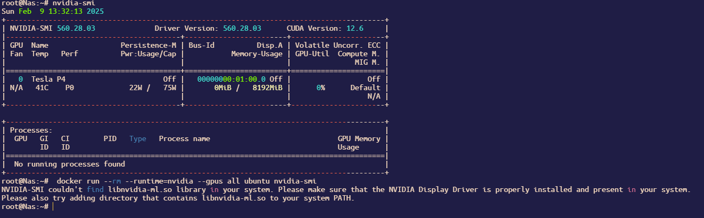
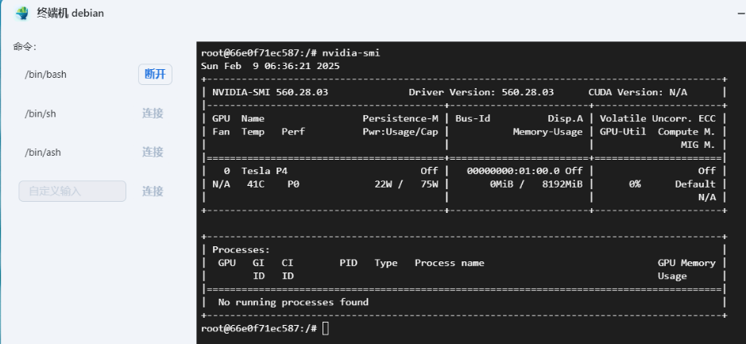
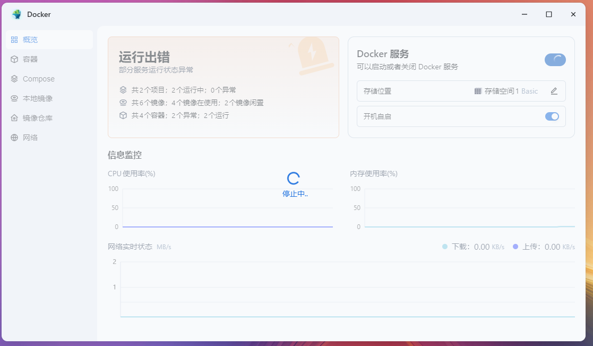
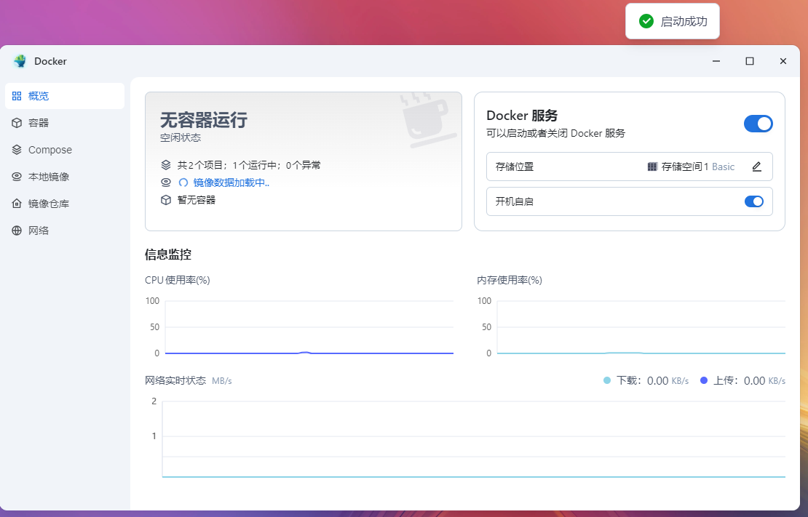
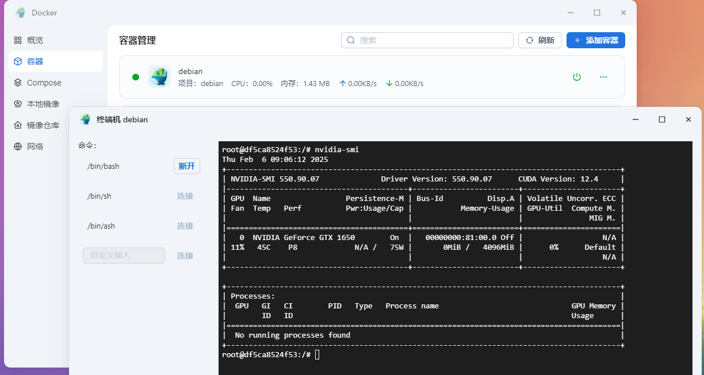
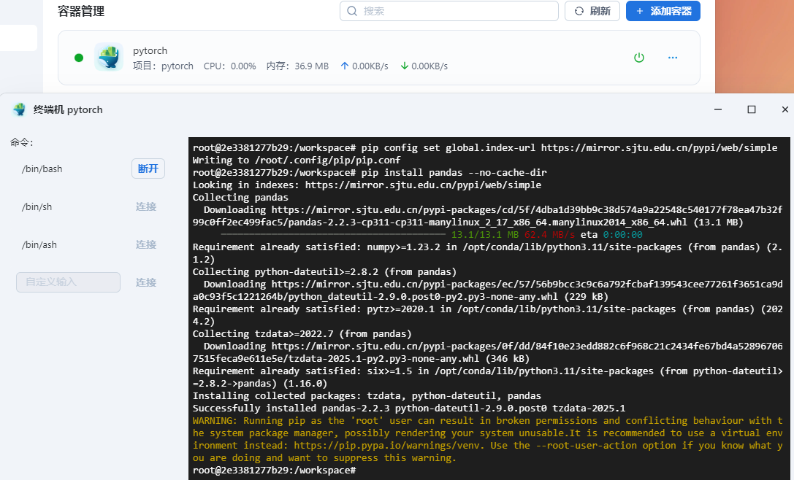
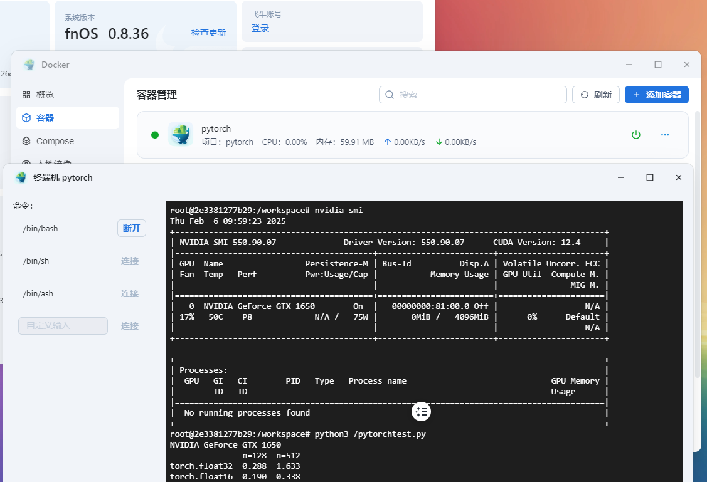
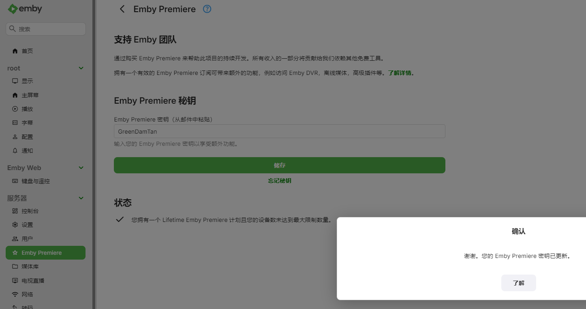
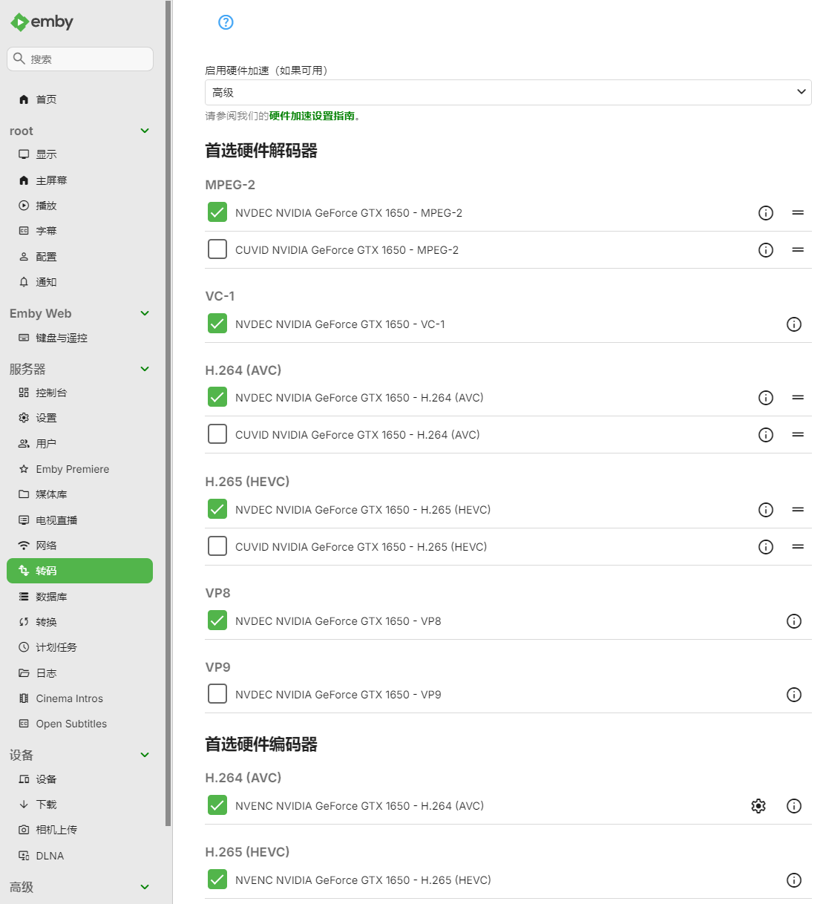
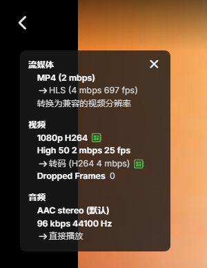

# 在飞牛OS使用libnvidia-container让docker容器支持NVIDIA GPU加速

# 背景故事
近期的deepseek十分甚至九分的高热度，直接部署deepseek的ollama稍有不慎忘记加参数就容易干爆系统盘  
AI绘画的stable diffusion直接部署在系统内也十分甚至九分的不便  
使用emby之类的第三方影视工具时，激活硬件加速也需要cuda相关功能

飞牛的docker默认情况下不带libnvidia-container，因此无法使用NVIDIA GPU  
自己从宿主机映射cuda相关库与设备不是不行，就是挺麻烦还容易漏

在这个系统中，GPU只用来给飞牛影视编解码或是给飞牛相册跑人脸识别，除此之外并无用处  
长时间闲置GPU显得十分浪费

今天就带大家安装一个libnvidia-container，用于给docker提供cuda环境
# 安装libnvidia-container
安装时建议使用下面这个国内源，不要使用nvidia官方源，那个很慢的  
https://mirrors.ustc.edu.cn/help/libnvidia-container.html

首先在ssh中，以root权限运行如下命令，添加apt仓库
```shell
curl -fsSL https://nvidia.github.io/libnvidia-container/gpgkey | sudo gpg --dearmor -o /usr/share/keyrings/nvidia-container-toolkit-keyring.gpg \
  && curl -s -L https://mirrors.ustc.edu.cn/libnvidia-container/stable/deb/nvidia-container-toolkit.list | \
    sed 's#deb https://nvidia.github.io#deb [signed-by=/usr/share/keyrings/nvidia-container-toolkit-keyring.gpg] https://mirrors.ustc.edu.cn#g' | \
    tee /etc/apt/sources.list.d/nvidia-container-toolkit.list
```
随后直接安装这个软件包就ok了  
```shell
sudo apt update && sudo apt install nvidia-container-toolkit
```
执行命令如无异常会像下面这样输出  
```log
root@fnOS-device:~# sudo apt update && sudo apt install nvidia-container-toolkit
Get:1 https://mirrors.ustc.edu.cn/libnvidia-container/stable/deb/amd64  InRelease [1,477 B]
Get:2 https://mirrors.ustc.edu.cn/libnvidia-container/stable/deb/amd64  Packages [16.7 kB]
Get:3 https://mirrors.tuna.tsinghua.edu.cn/debian bookworm InRelease [151 kB]            
Get:4 https://mirrors.tuna.tsinghua.edu.cn/debian bookworm-updates InRelease [55.4 kB]   
Get:5 https://mirrors.tuna.tsinghua.edu.cn/debian bookworm-backports InRelease [59.0 kB]
Get:6 https://mirrors.tuna.tsinghua.edu.cn/debian-security bookworm-security InRelease [48.0 kB]
Get:7 https://mirrors.tuna.tsinghua.edu.cn/docker-ce/linux/debian bookworm InRelease [43.3 kB]
Get:8 https://mirrors.tuna.tsinghua.edu.cn/debian bookworm/main amd64 Packages [8,792 kB]
Get:9 https://pkg.ltec.ch/public focal InRelease [2,880 B]
Get:10 https://mirrors.tuna.tsinghua.edu.cn/debian bookworm/main Translation-en [6,109 kB]
Get:11 https://pkg.ltec.ch/public focal/main amd64 Packages [428 B]                     
Get:12 https://mirrors.tuna.tsinghua.edu.cn/debian bookworm/contrib amd64 Packages [54.1 kB]       
Get:13 https://mirrors.tuna.tsinghua.edu.cn/debian bookworm/contrib Translation-en [48.8 kB]
Get:14 https://mirrors.tuna.tsinghua.edu.cn/debian bookworm/non-free amd64 Packages [97.3 kB]
Get:15 https://mirrors.tuna.tsinghua.edu.cn/debian bookworm/non-free Translation-en [67.0 kB]
Get:16 https://mirrors.tuna.tsinghua.edu.cn/debian bookworm/non-free-firmware amd64 Packages [6,240 B]
Get:17 https://mirrors.tuna.tsinghua.edu.cn/debian bookworm/non-free-firmware Translation-en [20.9 kB]
Get:18 https://mirrors.tuna.tsinghua.edu.cn/debian bookworm-updates/main amd64 Packages [13.5 kB]
Get:19 https://mirrors.tuna.tsinghua.edu.cn/debian bookworm-updates/main Translation-en [16.0 kB]
Get:20 https://mirrors.tuna.tsinghua.edu.cn/debian bookworm-updates/contrib amd64 Packages [768 B]
Get:21 https://mirrors.tuna.tsinghua.edu.cn/debian bookworm-updates/contrib Translation-en [408 B]
Get:22 https://mirrors.tuna.tsinghua.edu.cn/debian bookworm-updates/non-free amd64 Packages [12.8 kB]
Get:23 https://mirrors.tuna.tsinghua.edu.cn/debian bookworm-updates/non-free Translation-en [7,744 B]
Get:24 https://mirrors.tuna.tsinghua.edu.cn/debian bookworm-updates/non-free-firmware amd64 Packages [616 B]
Get:25 https://mirrors.tuna.tsinghua.edu.cn/debian bookworm-updates/non-free-firmware Translation-en [384 B]
Get:26 https://mirrors.tuna.tsinghua.edu.cn/debian bookworm-backports/main amd64 Packages [282 kB]
Get:27 https://mirrors.tuna.tsinghua.edu.cn/debian bookworm-backports/main Translation-en [235 kB]
Get:28 https://mirrors.tuna.tsinghua.edu.cn/debian bookworm-backports/contrib amd64 Packages [5,616 B]
Get:29 https://mirrors.tuna.tsinghua.edu.cn/debian bookworm-backports/contrib Translation-en [5,448 B]
Get:30 https://mirrors.tuna.tsinghua.edu.cn/debian bookworm-backports/non-free amd64 Packages [11.1 kB]
Get:31 https://mirrors.tuna.tsinghua.edu.cn/debian bookworm-backports/non-free Translation-en [7,320 B]
Get:32 https://mirrors.tuna.tsinghua.edu.cn/debian bookworm-backports/non-free-firmware amd64 Packages [3,852 B]
Get:33 https://mirrors.tuna.tsinghua.edu.cn/debian bookworm-backports/non-free-firmware Translation-en [2,848 B]
Get:34 https://mirrors.tuna.tsinghua.edu.cn/debian-security bookworm-security/main amd64 Packages [243 kB]
Get:35 https://mirrors.tuna.tsinghua.edu.cn/debian-security bookworm-security/main Translation-en [144 kB]
Get:36 https://mirrors.tuna.tsinghua.edu.cn/debian-security bookworm-security/contrib amd64 Packages [644 B]
Get:37 https://mirrors.tuna.tsinghua.edu.cn/debian-security bookworm-security/contrib Translation-en [372 B]
Get:38 https://mirrors.tuna.tsinghua.edu.cn/debian-security bookworm-security/non-free-firmware amd64 Packages [688 B]
Get:39 https://mirrors.tuna.tsinghua.edu.cn/debian-security bookworm-security/non-free-firmware Translation-en [472 B]
Get:40 https://mirrors.tuna.tsinghua.edu.cn/docker-ce/linux/debian bookworm/stable amd64 Packages [34.9 kB]
Fetched 16.6 MB in 4s (4,133 kB/s)                          
Reading package lists... Done
Building dependency tree... Done
Reading state information... Done
205 packages can be upgraded. Run 'apt list --upgradable' to see them.
Reading package lists... Done
Building dependency tree... Done
Reading state information... Done
The following additional packages will be installed:
  libnvidia-container-tools libnvidia-container1 nvidia-container-toolkit-base
The following NEW packages will be installed:
  libnvidia-container-tools libnvidia-container1 nvidia-container-toolkit nvidia-container-toolkit-base
0 upgraded, 4 newly installed, 0 to remove and 205 not upgraded.
Need to get 5,805 kB of archives.
After this operation, 27.7 MB of additional disk space will be used.
Do you want to continue? [Y/n] Y
Get:1 https://mirrors.ustc.edu.cn/libnvidia-container/stable/deb/amd64  libnvidia-container1 1.17.4-1 [925 kB]
Get:2 https://mirrors.ustc.edu.cn/libnvidia-container/stable/deb/amd64  libnvidia-container-tools 1.17.4-1 [20.2 kB]
Get:3 https://mirrors.ustc.edu.cn/libnvidia-container/stable/deb/amd64  nvidia-container-toolkit-base 1.17.4-1 [3,672 kB]
Get:4 https://mirrors.ustc.edu.cn/libnvidia-container/stable/deb/amd64  nvidia-container-toolkit 1.17.4-1 [1,188 kB]
Fetched 5,805 kB in 1s (5,828 kB/s)                 
Selecting previously unselected package libnvidia-container1:amd64.
(Reading database ... 76516 files and directories currently installed.)
Preparing to unpack .../libnvidia-container1_1.17.4-1_amd64.deb ...
Unpacking libnvidia-container1:amd64 (1.17.4-1) ...
Selecting previously unselected package libnvidia-container-tools.
Preparing to unpack .../libnvidia-container-tools_1.17.4-1_amd64.deb ...
Unpacking libnvidia-container-tools (1.17.4-1) ...
Selecting previously unselected package nvidia-container-toolkit-base.
Preparing to unpack .../nvidia-container-toolkit-base_1.17.4-1_amd64.deb ...
Unpacking nvidia-container-toolkit-base (1.17.4-1) ...
Selecting previously unselected package nvidia-container-toolkit.
Preparing to unpack .../nvidia-container-toolkit_1.17.4-1_amd64.deb ...
Unpacking nvidia-container-toolkit (1.17.4-1) ...
Setting up nvidia-container-toolkit-base (1.17.4-1) ...
Setting up libnvidia-container1:amd64 (1.17.4-1) ...
Setting up libnvidia-container-tools (1.17.4-1) ...
Setting up nvidia-container-toolkit (1.17.4-1) ...
Processing triggers for libc-bin (2.36-9+deb12u4) ...
ldconfig: /usr/local/lib/libzmq.so.5 is not a symbolic link
```
# 修改/etc/docker/daemon.json配置
直接使用nvidia-ctk修改配置即可  
```shell
nvidia-ctk runtime configure --runtime=docker --config=/etc/docker/daemon.json
```
一般来说会出现下面这样的回显  
```log
root@fnOS-device:~# nvidia-ctk runtime configure --runtime=docker --config=/etc/docker/daemon.json
INFO[0000] Loading config from /etc/docker/daemon.json  
INFO[0000] Wrote updated config to /etc/docker/daemon.json 
INFO[0000] It is recommended that docker daemon be restarted.
```
检查一下配置是否已经被修改成功，注意我的镜像源是自己换过的  
飞牛自带那个经常是用不了的  
```shell
root@fnOS-device:~# cat /etc/docker/daemon.json
{
    "data-root": "/vol1/docker",
    "insecure-registries": [
        "127.0.0.1:19827"
    ],
    "live-restore": true,
    "registry-mirrors": [
        "https://docker.1ms.run"
    ],
    "runtimes": {
        "nvidia": {
            "args": [],
            "path": "nvidia-container-runtime"
        }
    }
}
```
# 检查处理驱动问题
如果驱动是使用飞牛应用商店那个有问题的驱动，需要自行修复库链接  
已知两个问题会有这样的问题 "libcuda.so.1.1", "libnvidia-ml.so.1"  
否则会出现图中这种情况，该问题由飞牛商店驱动缺陷所致  
  
如果经过检查，以下两个库不是以链接呈现  
```log
root@Nas:~# ls -lh /usr/lib/x86_64-linux-gnu/libnvidia-ml.so*
-rwxr-xr-x 1 root root 2.1M Sep  6 14:48 /usr/lib/x86_64-linux-gnu/libnvidia-ml.so
-rwxr-xr-x 1 root root 2.1M Sep  6 14:48 /usr/lib/x86_64-linux-gnu/libnvidia-ml.so.1
-rwxr-xr-x 1 root root 2.1M Sep  6 14:48 /usr/lib/x86_64-linux-gnu/libnvidia-ml.so.560.28.03
```
```log
root@Nas:~# ls -lh /usr/lib/x86_64-linux-gnu/libcuda.so*
-rwxr-xr-x 1 root root 34M Sep  6 14:48 /usr/lib/x86_64-linux-gnu/libcuda.so
-rwxr-xr-x 1 root root 34M Sep  6 14:48 /usr/lib/x86_64-linux-gnu/libcuda.so.1
-rwxr-xr-x 1 root root 34M Sep  6 14:48 /usr/lib/x86_64-linux-gnu/libcuda.so.560.28.03
```
而是如上所示，则需要自行修复  
```log
root@Nas:~# mv /usr/lib/x86_64-linux-gnu/libnvidia-ml.so.1 /usr/lib/x86_64-linux-gnu/libnvidia-ml.so.1.bak
root@Nas:~# mv /usr/lib/x86_64-linux-gnu/libnvidia-ml.so /usr/lib/x86_64-linux-gnu/libnvidia-ml.so.bak
root@Nas:~# ln -sf /usr/lib/x86_64-linux-gnu/libnvidia-ml.so.560.28.03 /usr/lib/x86_64-linux-gnu/libnvidia-ml.so.1
root@Nas:~# ln -sf /usr/lib/x86_64-linux-gnu/libnvidia-ml.so.560.28.03 /usr/lib/x86_64-linux-gnu/libnvidia-ml.so
root@Nas:~# ls -lh /usr/lib/x86_64-linux-gnu/libnvidia-ml.so*
```
```log
root@Nas:~# mv /usr/lib/x86_64-linux-gnu/libcuda.so /usr/lib/x86_64-linux-gnu/libcuda.so.bak
root@Nas:~# mv /usr/lib/x86_64-linux-gnu/libcuda.so.1 /usr/lib/x86_64-linux-gnu/libcuda.so.1.bak
root@Nas:~# ln -sf /usr/lib/x86_64-linux-gnu/libcuda.so.560.28.03 /usr/lib/x86_64-linux-gnu/libcuda.so
root@Nas:~# ln -sf /usr/lib/x86_64-linux-gnu/libcuda.so.560.28.03 /usr/lib/x86_64-linux-gnu/libcuda.so.1
```
以确保这两个地方是链接而不是文件  
```shell
root@Nas:~# ls -lh /usr/lib/x86_64-linux-gnu/libnvidia-ml.so*
lrwxrwxrwx 1 root root   51 Feb  9 14:35 /usr/lib/x86_64-linux-gnu/libnvidia-ml.so -> /usr/lib/x86_64-linux-gnu/libnvidia-ml.so.560.28.03
lrwxrwxrwx 1 root root   51 Feb  9 14:35 /usr/lib/x86_64-linux-gnu/libnvidia-ml.so.1 -> /usr/lib/x86_64-linux-gnu/libnvidia-ml.so.560.28.03
-rwxr-xr-x 1 root root 2.1M Sep  6 14:48 /usr/lib/x86_64-linux-gnu/libnvidia-ml.so.1.bak
-rwxr-xr-x 1 root root 2.1M Sep  6 14:48 /usr/lib/x86_64-linux-gnu/libnvidia-ml.so.560.28.03
-rwxr-xr-x 1 root root 2.1M Sep  6 14:48 /usr/lib/x86_64-linux-gnu/libnvidia-ml.so.bak
```  
```shell
root@Nas:~# ls -lh /usr/lib/x86_64-linux-gnu/libcuda.so*
lrwxrwxrwx 1 root root  46 Feb  9 14:39 /usr/lib/x86_64-linux-gnu/libcuda.so -> /usr/lib/x86_64-linux-gnu/libcuda.so.560.28.03
lrwxrwxrwx 1 root root  46 Feb  9 14:39 /usr/lib/x86_64-linux-gnu/libcuda.so.1 -> /usr/lib/x86_64-linux-gnu/libcuda.so.560.28.03
-rwxr-xr-x 1 root root 34M Sep  6 14:48 /usr/lib/x86_64-linux-gnu/libcuda.so.1.bak
-rwxr-xr-x 1 root root 34M Sep  6 14:48 /usr/lib/x86_64-linux-gnu/libcuda.so.560.28.03
-rwxr-xr-x 1 root root 34M Sep  6 14:48 /usr/lib/x86_64-linux-gnu/libcuda.so.bak
```  
才能正常在docker使用飞牛的官方驱动  
  

如在使用中发现其他库也有问题，可能也需进行上述的处理

# 重启飞牛docker服务
打开飞牛的docker，点一下docker服务旁边的开关，关闭docker服务  
  
随后再点击一次，打开docker服务  


# 验证飞牛docker的cuda功能
## 简单的debian验证
直接使用下面的docker-compose创建debian容器
```yaml
services:
  debian:
    container_name: debian
    tty: true
    image: debian:bookworm-20250203
    runtime: nvidia
    environment:
      - NVIDIA_VISIBLE_DEVICES=all
```
随后打开这个容器的终端，输入nvidia-smi，查看是否正确返回GPU信息  


## pytorch验证
使用如下docker-compose创建测试容器  
```yaml
services:
  pytorch:
    container_name: pytorch
    tty: true
    image: pytorch/pytorch:2.5.1-cuda11.8-cudnn9-runtime
    runtime: nvidia
    environment:
      - NVIDIA_VISIBLE_DEVICES=all
    volumes:
      - /vol1/1000/docker/pytorch/pytorchtest.py:/pytorchtest.py:ro
```  
验证脚本/vol1/1000/docker/pytorch/pytorchtest.py的内容为  
```python
import inspect
from collections import defaultdict
import pandas as pd
from torch.utils import benchmark
import torch

pd.options.display.precision = 3


def var_dict(*args):
    callers_local_vars = inspect.currentframe().f_back.f_locals.items()
    return dict([(name, val) for name, val in callers_local_vars if val is arg][0]
                for arg in args)


def walltime(stmt, arg_dict, duration=3):
    return benchmark.Timer(stmt=stmt, globals=arg_dict).blocked_autorange(
        min_run_time=duration).median

print(torch.cuda.get_device_name(0))
matmul_tflops = defaultdict(lambda: {})
for n in [128, 512]:
    for dtype in (torch.float32, torch.float16):
        a = torch.randn(n, n, dtype=dtype).cuda()
        b = torch.randn(n, n, dtype=dtype).cuda()
        t = walltime('a @ b', var_dict(a, b))
        matmul_tflops[f'n={n}'][dtype] = 2 * n ** 3 / t / 1e12
        del a, b

print(pd.DataFrame(matmul_tflops))
```

进入容器中分别运行以下命令安装依赖   
```shell
pip config set global.index-url https://mirror.sjtu.edu.cn/pypi/web/simple
pip install pandas --no-cache-dir
```
  

随后进行测试  
测试会输出显卡名称与矩阵计算速度  


## emby编解码验证
使用如下的docker-compose创建emby容器
```yaml
services:
  emby:
    container_name: emby
    tty: true
    image: 	amilys/embyserver:4.8.9.0
    runtime: nvidia
    environment:
      - NVIDIA_VISIBLE_DEVICES=all
    devices:
      - /dev/dri:/dev/dri
    volumes:
      - /vol1/1000/movie:/host/vol1/1000/movie:ro
    ports:
      - 8096:8096
```
以上这个compose仅用于验证cuda编解码功能  
未包含配置持久化等部分，请参考其他部署emby的教程进行部署  

验证编解码功能前，记得激活Emby Premiere  


可以在转码页的高级中看见nvidia显卡  


播放视频时可以看见使用了nvenc/nvdec的硬件编解码  
  
在飞牛的ssh可以看见ffmpeg使用情况  
```log
root@9-136-test-vm:~# nvidia-smi
Thu Feb  6 17:37:41 2025       
+-----------------------------------------------------------------------------------------+
| NVIDIA-SMI 550.90.07              Driver Version: 550.90.07      CUDA Version: 12.4     |
|-----------------------------------------+------------------------+----------------------+
| GPU  Name                 Persistence-M | Bus-Id          Disp.A | Volatile Uncorr. ECC |
| Fan  Temp   Perf          Pwr:Usage/Cap |           Memory-Usage | GPU-Util  Compute M. |
|                                         |                        |               MIG M. |
|=========================================+========================+======================|
|   0  NVIDIA GeForce GTX 1650        On  |   00000000:81:00.0 Off |                  N/A |
| 26%   65C    P2             N/A /   75W |     182MiB /   4096MiB |     24%      Default |
|                                         |                        |                  N/A |
+-----------------------------------------+------------------------+----------------------+
                                                                                         
+-----------------------------------------------------------------------------------------+
| Processes:                                                                              |
|  GPU   GI   CI        PID   Type   Process name                              GPU Memory |
|        ID   ID                                                               Usage      |
|=========================================================================================|
|    0   N/A  N/A    110276      C   /bin/ffmpeg                                   178MiB |
+-----------------------------------------------------------------------------------------+
```

# 结束语
经过一顿猛如虎的操作，成功的在fnOS的docker中添加nvidia的cuda支持  
希望飞牛官方早日进行支持，充分利用插在飞牛OS中的NVIDIA显卡