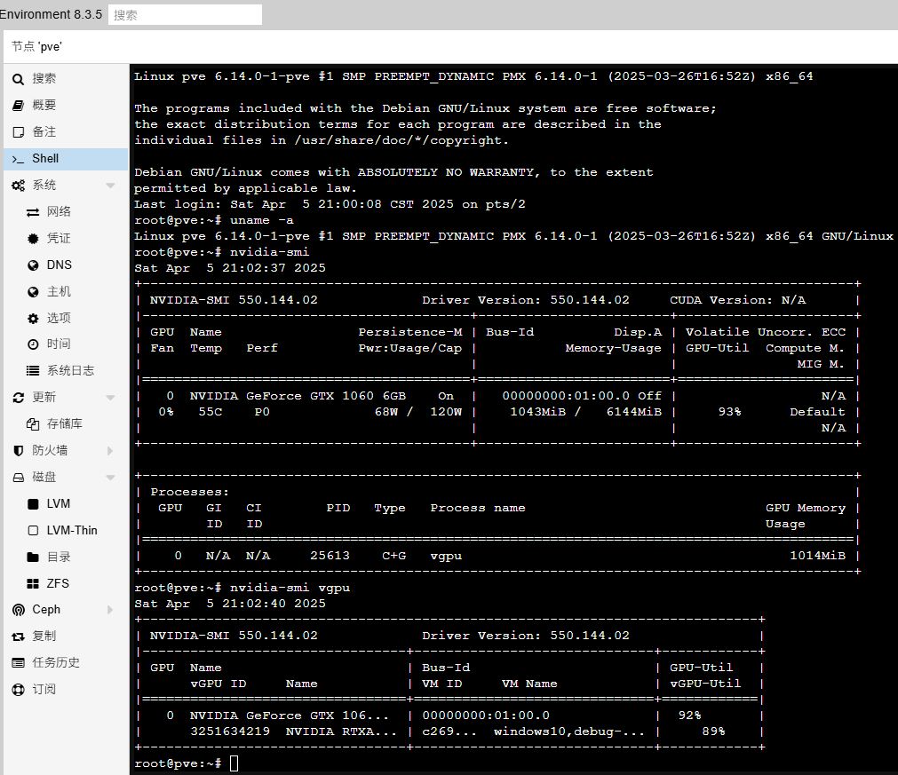

# 在linux 6.12版本(6.14.0-1-pve内核也能用)内核中使用vGPU Grid 17.2 (550.144.02) 

# 问题描述
最近Proxmox VE内核更新至6.14后，许多人反馈nvidia的vGPU驱动无法正常编译安装  
https://forum.proxmox.com/threads/opt-in-linux-6-14-kernel-for-proxmox-ve-8-available-on-test-no-subscription.164497/


# 日志特征
```shell
cat /var/log/nvidia-installer.log
```
展示的日志包括  
```log
   nvidia-vgpu-vfio/nvidia-vgpu-vfio.c:4783:18: error: 'no_llseek' undeclared here (not in a function); did you mean 'noop_llseek'?
    4783 |        .llseek = no_llseek,
         |                  ^~~~~~~~~
         |                  noop_llseek
```
# 问题成因
本次造成vGPU驱动无法正常工作，主要是改动了no_llseek  
https://github.com/torvalds/linux/commit/cb787f4ac0c2e439ea8d7e6387b925f74576bdf8

按提交记录的说法在两年前这个东西就已经被定义为NULL了  
https://github.com/torvalds/linux/commit/868941b14441282ba08761b770fc6cad69d5bdb7

所以这个版本干脆就移除掉了

# 问题修正思路

## no_llseek
使用命令把全部`no_llseek`相关去掉就行
```shell
sed -e "s/.llseek = no_llseek,//g"  kernel/nvidia-vgpu-vfio/nvidia-vgpu-vfio.c
```
至于为啥这样改，因为linux内核对应源码就是应该这样改的啊  
不过保险起见你也可以自己定义一下
```cpp
#define no_llseek NULL
```  
不过我试了一下，直接删了确实也没啥影响

## output_poll_changed
至于这个`output_poll_changed `，是你用guest驱动才会遇到的  
如果遇到的话就这样改改代码  
```shell
sed -e "s/.output_poll_changed = nv_drm_output_poll_changed,//g" -i kernel/nvidia-drm/nvidia-drm-drv.c
```  
至于为啥这样改  
https://github.com/torvalds/linux/commit/a0634663d09abcda84eae37e9817490628a034c9  
因为linux内核源码就是要这样改

# 最终修复patch
根据上面的修复思路，直接的修复补丁节选如下  
本补丁仅用于解决NVIDA vGPU GRID 17.5(即550.144.02)使用linux 6.12内核的问题  
当然，也可以在PVE换用6.14.0-1-pve内核后出现的问题时解决同样的问题
```patch
--- kernel/nvidia-vgpu-vfio/nvidia-vgpu-vfio.c
+++ kernel/nvidia-vgpu-vfio/nvidia-vgpu-vfio.c
@@ -4780,14 +4780,18 @@
        .unlocked_ioctl = vgpu_precopy_ioctl,
 #endif
        .release = vgpu_release_file_cb,
+#if LINUX_VERSION_CODE < KERNEL_VERSION(6,12,0)
        .llseek = no_llseek,
+#endif
 };
 
 static const struct file_operations vgpu_resume_fops = {
        .owner = THIS_MODULE,
        .write = vgpu_resume_write,
        .release = vgpu_release_file_cb,
+#if LINUX_VERSION_CODE < KERNEL_VERSION(6,12,0)
        .llseek = no_llseek,
+#endif
 };
 
 static NV_STATUS
```
完整的patch请参考这个文件
[NVIDIA_550.144.02_vGPU_kernel_6.12_also_6.14.patch](NVIDIA_550.144.02_vGPU_kernel_6.12_also_6.14.patch)

使用方法依旧是
```
./NVIDIA-Linux-x86_64-550.144.02-vgpu-kvm.run --apply-patch NVIDIA_550.144.02_vGPU_kernel_6.12_also_6.14.patch
```

然后依旧是使用这个命令安装打好补丁的驱动
```shell
./NVIDIA-Linux-x86_64-550.144.02-vgpu-kvm-custom.run -m kernel
```

完整的带patch驱动依旧在老地方，这次的文件名是  
不想自己打补丁也可以直接用这个
```log
NVIDIA-Linux-x86_64-550.144.02-vgpu-kvm-custom_kerl6.12_and_6.14.run
```
# 修复结果验证
如图所示，在PVE 8.3.5上，已经可以使用6.14.0-1-pve内核运行GRID 17.5(550.144.02)版本的vGPU
