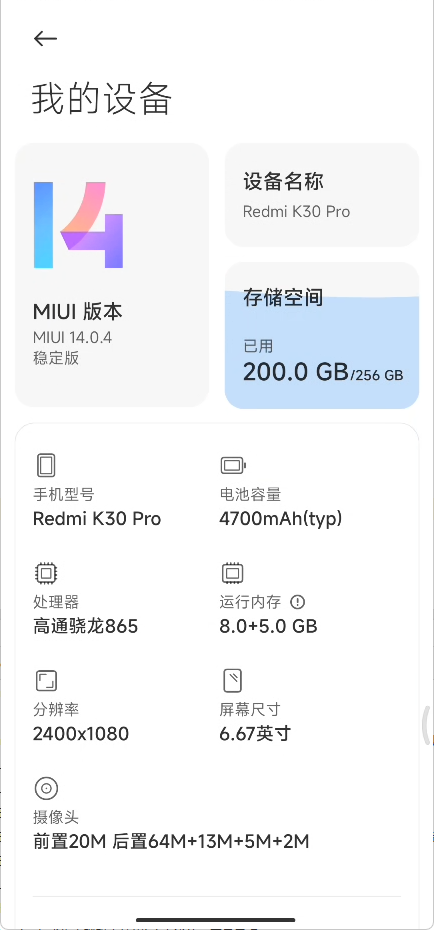
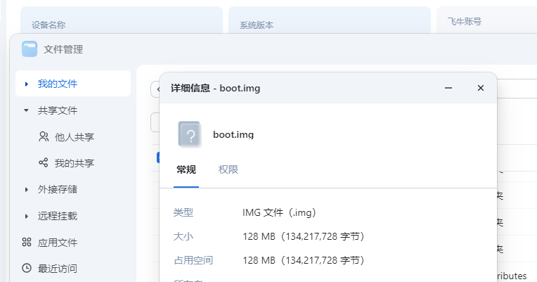
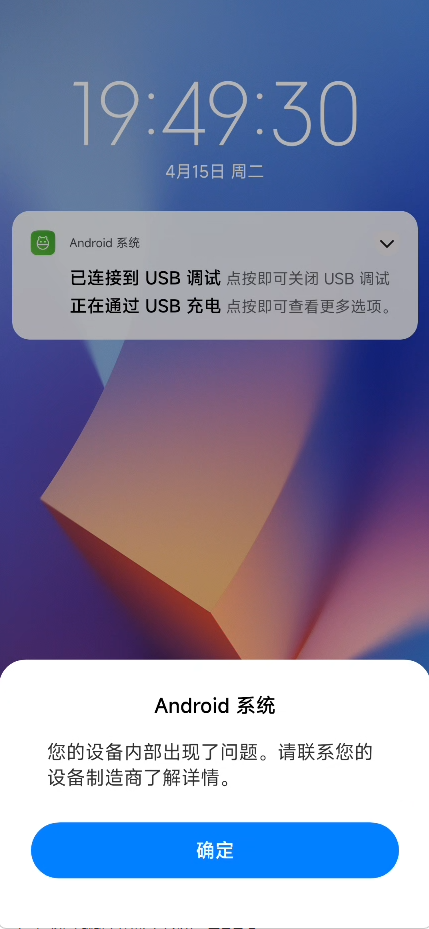
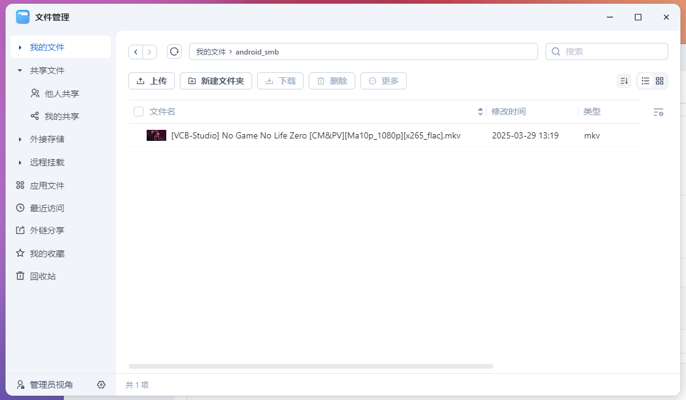
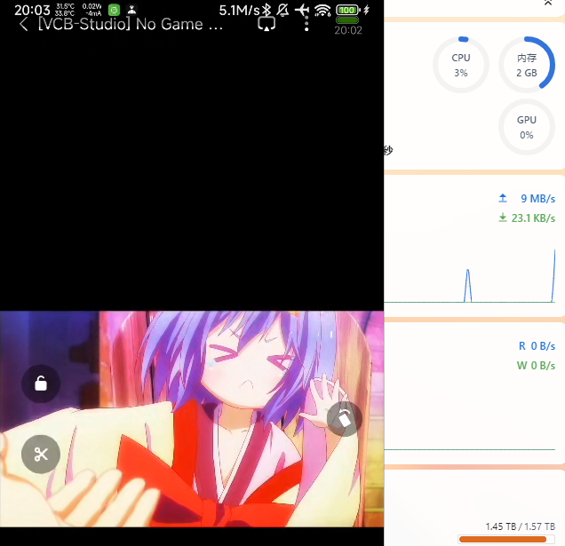

# 在安卓手机上挂载NAS的SMB共享

# 前言
本文为整活操作，实际上没有什么实用价值  
真要访问NAS内的文件，可以直接用NAS厂商的APP端或者是MT管理器之类的第三方工具  
直接挂SMB的最大优点大概就是应用程序可以直接使用这个空间，但是只要离开NAS所在的局域网就立马趴窝  
本文使用的设备为 红米K30Pro 系统为MIUI 14.0.4  
  
文中提到的adb、fastboot工具需自行准备  

# 检查安卓内核
首先检查自己的安卓内核是否支持CIFS文件系统  
在`adb shell`中使用如下命令即可
```shell
cat /proc/filesystems
```
如果你的设备跟我的一样，没有CIFS相关内容  
```log
D:\software\scrcpy-win64-v2.7>adb shell
lmi:/ $ cat /proc/filesystems
nodev   sysfs
nodev   rootfs
nodev   tmpfs
nodev   bdev
nodev   proc
nodev   cpuset
nodev   cgroup
nodev   cgroup2
nodev   configfs
nodev   debugfs
nodev   tracefs
nodev   sockfs
nodev   bpf
nodev   pipefs
nodev   ramfs
nodev   devpts
        ext3
        ext2
        ext4
        vfat
        msdos
nodev   ecryptfs
nodev   sdcardfs
        fuseblk
nodev   fuse
nodev   fusectl
nodev   overlay
nodev   incremental-fs
        f2fs
nodev   selinuxfs
nodev   binder
nodev   pstore
        exfat
nodev   functionfs
```
恭喜你，你需要自行构建内核添加CIFS支持

# 引导自定义内核
## 构建内核
每台手机构建内核的方法都各不相同，因此这一步没有通用步骤  
这里给出在本例中使用的手机，lmi_defconfig新增的配置  
这个文件在内核源码的`arch/arm64/configs/lmi_defconfig`目录  
以下配置是一股脑加上的，有没有多余的不知道  
```config
CONFIG_CIFS=y
CONFIG_CIFS_SMB2=y
CONFIG_CIFS_WEAK_PW_HASH=y
CONFIG_CIFS_STATS2=y
CONFIG_CIFS_ALLOW_INSECURE_LEGACY=y
CONFIG_CIFS_DEBUG=y
CONFIG_SMBFS=y
CONFIG_CIFS_FSCACHE=y
```  
但至少`CONFIG_CIFS`肯定不是多余的  
添加完成后，正常构建内核即可  
我是直接在NAS上构建的，反正四舍五入NAS也是个Linux环境  
  
把构建好的内核下载下来待用

## 引导内核
构建结束后，会有一个boot.img，不要急着刷入    
可以使用下面的命令，进入fastboot模式  
```shell
adb reboot bootloader
```
然后直接引导内核，先验证内核是否可用  
```shell
fastboot boot D:\lmi\boot.img
```
命令行会出现，没有报错才是正常的  
```log
Sending 'boot.img' (131072 KB)                     OKAY [  2.968s]
Booting                                            OKAY [  0.115s]
Finished. Total time: 3.137s
```
随后等待开机即可  

如果开机后出现如下提示，不需要特别处理，忽略即可  


## 检查支持的文件系统
依旧是在`adb shell`中，使用如下命令检查  
```shell
cat /proc/filesystems
```  
如果回显结果如同下面这个例子一样，出现cifs  
说明成功构建了包含CIFS支持的内核  
```log
D:\software\scrcpy-win64-v2.7>adb shell
lmi:/ $ cat /proc/filesystems
nodev   sysfs
nodev   rootfs
nodev   tmpfs
nodev   bdev
nodev   proc
nodev   cpuset
nodev   cgroup
nodev   cgroup2
nodev   configfs
nodev   tracefs
nodev   sockfs
nodev   bpf
nodev   pipefs
nodev   ramfs
nodev   devpts
        ext3
        ext2
        ext4
        vfat
        msdos
        exfat
nodev   ecryptfs
nodev   sdcardfs
nodev   cifs
nodev   smb3
        ntfs
        fuseblk
nodev   fuse
nodev   fusectl
nodev   overlay
nodev   incremental-fs
        f2fs
        erofs
nodev   selinuxfs
nodev   binder
nodev   pstore
nodev   functionfs
```

# 挂载SMB共享
在adb shell 中执行如下命令  
命令中的用户名、密码、IP与共享文件夹需要自行更换  
```shell
mount -vvv -o username=用户名,password=密码,rw,vers=3.1.1,noatime,noperm,noacl,nounix,serverino,mapposix,rsize=4194304,wsize=4194304,echo_interval=10,actimeo=10,file_mode=0777,dir_mode=0777,context=u:object_r:sdcardfs:s0,uid=0,gid=9997 -t cifs //192.168.1.254/android_smb /mnt/runtime/full/emulated/0/android_smb
```
命令回显如下，没有报错的话基本上就挂载成功了  
```log
try '//192.168.1.254/android_smb' type 'cifs' on '/mnt/runtime/full/emulated/0/android_smb'
```
随后我们可以打开系统自带的文件管理器看看  
  

可以看见，安卓端展示了挂载的文件  
终端中检查权限正常
```log
lmi:/ # ls -lh /mnt/runtime/full/emulated/0/android_smb/
total 549M
-rwxrwxrwx 1 root everybody 549M 2025-03-29 13:19 [VCB-Studio]\ No\ Game\ No\ Life\ Zero\ [CM&PV][Ma10p_1080p][x265_flac].mkv
```
尝试使用小米视频播放该影片  


# 取消SMB共享挂载
执行如下命令，即可取消上述的挂载
```shell
umount /mnt/runtime/full/emulated/0/android_smb
```