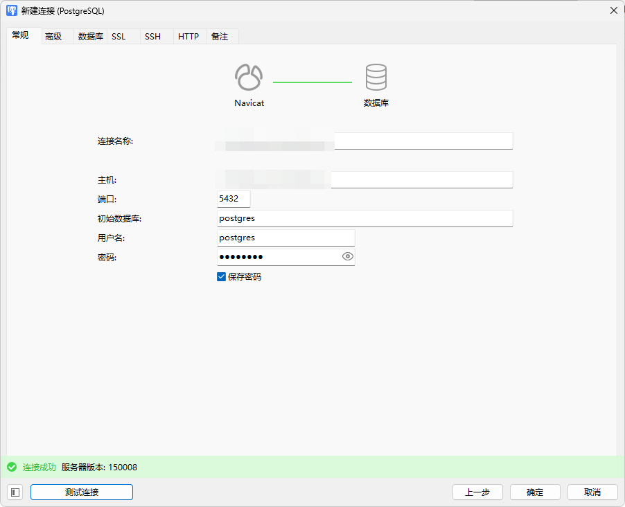
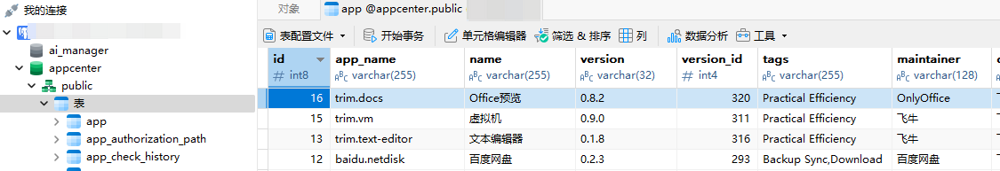
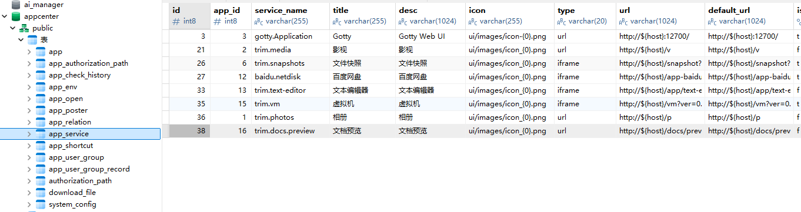
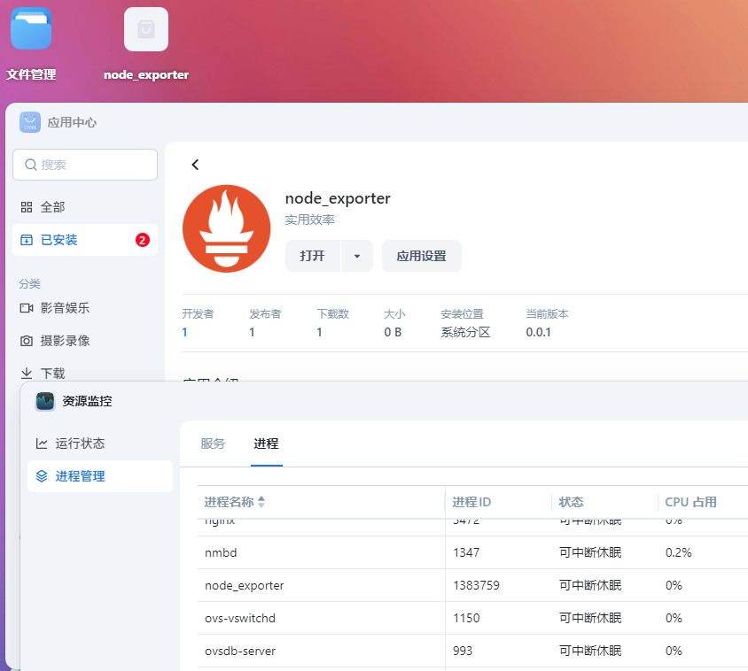
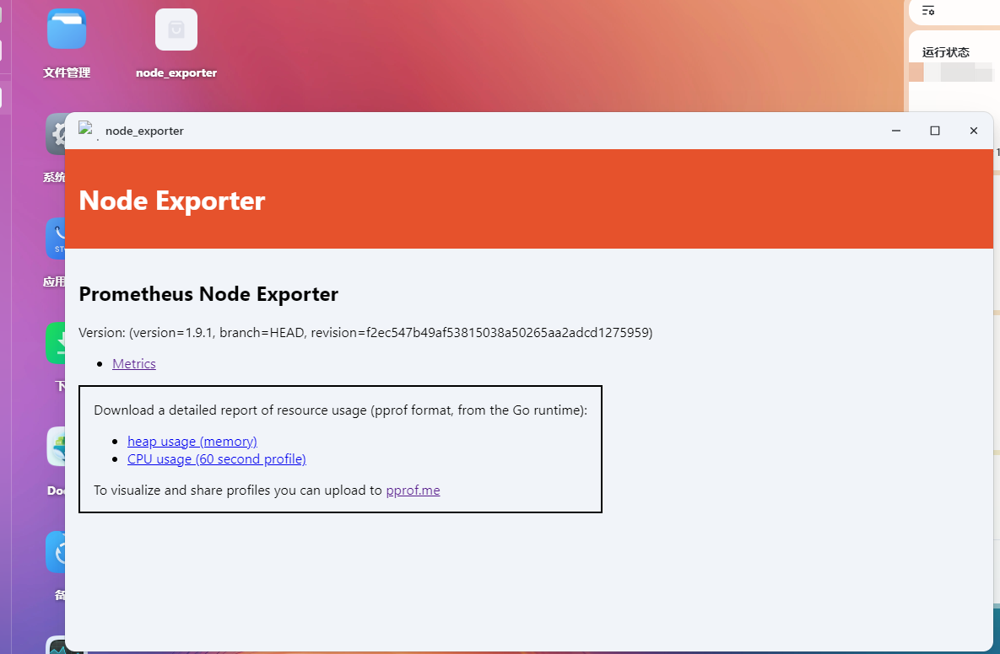
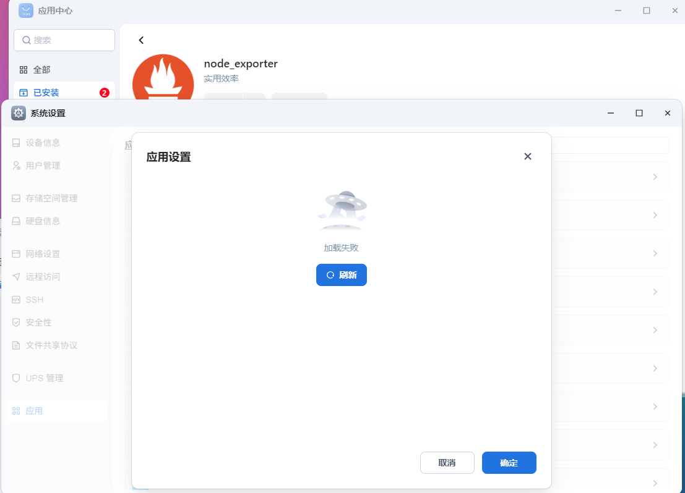
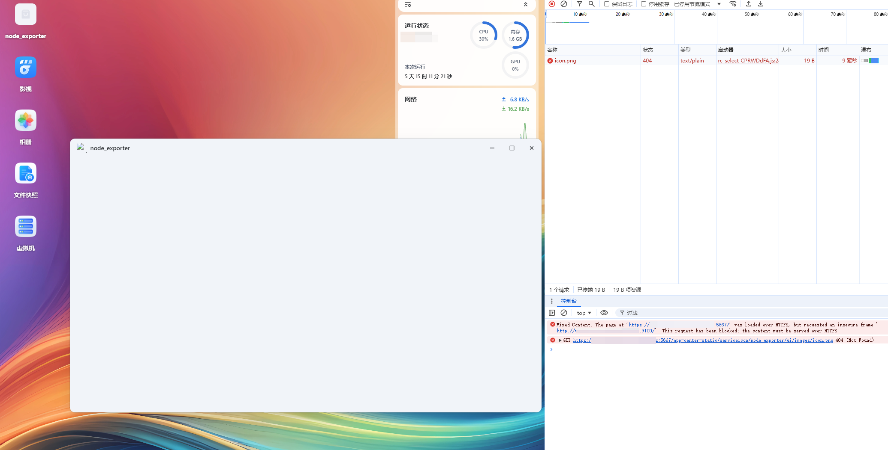
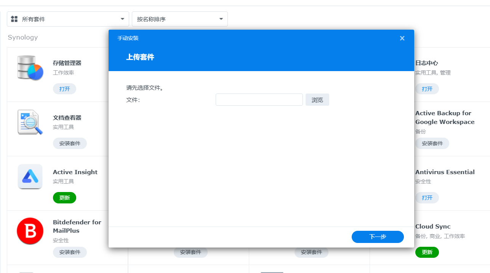

# 探索在飞牛nas系统手动安装自制应用

# 前言
飞牛nas功能强大，但封闭的应用商店限制了它的强大  
本次以 https://github.com/prometheus/node_exporter 为例  
探索如何在飞牛nas中部署自制应用node_exporter  
流程不完善，权当抛砖引玉，希望有大佬出手搞定它  
**如果你对照本文搞出问题了，请不要联系飞牛技术处理，自己吃哑巴亏就好**  
也不要找我，我也不会  
  
本文使用的系统为0.9.4，其他版本的不一定适用  

如果有不清楚的内容可以问，但我也不懂

这篇文章内容凌磨两可的原因就是，我也不会

# 分享包文件结构
首先我们选取一个已安装的应用，例如虚拟机应用，尝试分析结构
```shell
root@fnos:/var/apps/trim.vm# tree .
.
├── cmd
│   ├── common
│   ├── config
│   ├── install_callback
│   ├── install_init
│   ├── main
│   ├── package
│   ├── service
│   ├── uninstall_callback
│   ├── uninstall_init
│   ├── upgrade_callback
│   └── upgrade_init
├── config
│   ├── privilege
│   └── resource
├── etc -> /usr/local/apps/@appconf/trim.vm
├── home -> /usr/local/apps/@apphome/trim.vm
├── ICON_256.PNG
├── ICON.PNG
├── manifest
├── meta -> /vol1/@appmeta/trim.vm
├── poster
│   ├── 23af9d8f4cec556350e9d879ec9114f1.png
│   └── 3c54b236937ffd206b33b9a954f3bad7.png
├── target -> /usr/local/apps/@appcenter/trim.vm
├── tmp -> /usr/local/apps/@apptemp/trim.vm
├── var -> /usr/local/apps/@appdata/trim.vm
└── wizard
    └── uninstall
```
如上所示，只要我们仿造着搞一个，岂不是就能自己塞一个应用进去？

# 开启postgresql远程访问
通过修改postgresql配置文件，可以开启远程无密码访问，这个设置建议不要在生产环境中使用  
但我这个飞牛是在内网跑的，没有IPv4公网就不是很担心这个  
```shell
echo "host all all 0.0.0.0/0 trust" >> /etc/postgresql/15/main/pg_hba.conf
echo "listen_addresses = '*'" >> /etc/postgresql/15/main/postgresql.conf
systemctl restart postgresql.service
```
用工具测试一下，马上就连上了


# 在appcenter库中插入数据
如图所示，我们可以仿造其他应用，给我们自己的应用插入一条数据  
假装已经安装完毕了  
虽然各字段目前具体含义不明，但不妨碍对照着抄着玩  
### app表
  
```postgresql
INSERT INTO "public"."app" ("id", "app_name", "name", "version", "version_id", "tags", "maintainer", "distributor", "download_count", "install_type", "path", "install_volume_id", "data_share_volume_id", "data_volume_id", "manual_install", "is_stop", "is_uninstall", "is_beta", "is_docker", "min_size", "service_url", "source", "source_id", "status", "is_non_manual_stop", "is_systemd_uint", "disable_authorization_path", "features", "micro_app", "native_app", "created_at", "updated_at", "file_types") VALUES (17, 'node_exporter', 'node_exporter', '0.0.1', 1, 'Practical Efficiency', '1', '1', 1, 'root', '/var/apps/node_exporter', 0, 0, 1, 'f', 't', 't', 'f', 'f', 0, NULL, 'official', '17', 'running', 'f', 'f', 'f', '{}', 't', 'f', '2025-05-20 20:47:08+08', '2025-05-20 20:53:50.431768+08', NULL);
```
### app_service表

```postgresql
INSERT INTO "public"."app_service" ("id", "app_id", "service_name", "title", "desc", "icon", "type", "url", "default_url", "is_admin", "control", "full_url", "created_at", "updated_at", "no_display", "file_types") VALUES (39, 17, 'node_exporter', 'node_exporter', 'node_exporter', 'ui/images/icon.png', 'iframe', 'http://${host}:9100/', 'http://${host}:9100/', 'f', '{"show":0,"showRoute":0,"auth":0,"port":1,"path":0,"fullUrl":0,"accessPerm":"editable","portPerm":"readonly","pathPerm":"editable","fullUrlPerm":"editable"}', '', '2025-05-20 20:43:17+08', '2025-05-20 20:43:14+08', 'f', '[]');
```
# 创建应用文件
还记得上面的目录结构吗，我们也创建一个，并创建链接  
```shell
mkdir -p /var/apps/node_exporter/cmd
mkdir -p /var/apps/node_exporter/app
mkdir -p /var/apps/node_exporter/app/ui
mkdir -p /var/apps/node_exporter/config
ln -s /var/apps/node_exporter /usr/local/apps/@appcenter/node_exporter
ln -s /var/apps/node_exporter/app/ui /var/apps_ui/node_exporter
```
别忘了给app中要执行的可执行文件，与cmd中的main脚本给予权限  
以下是几个重要的文件，剩下的抄虚拟机应用的就行  
把需要的文件仿造目录结构丢进去  
## 目录结构
这里的app/node_exporter是本次的可执行文件  
```text
root@fnos:/var/apps/node_exporter# tree .
.
├── app
│   ├── node_exporter
│   └── ui
│       ├── config
│       └── images
│           └── icon.png
├── cmd
│   └── main
├── config
│   ├── privilege
│   └── resource
├── ICON_256.PNG
├── ICON.PNG
└── manifest
```
## /var/apps/node_exporter/manifest
```inf
version="1.9.1-1"
appname="node_exporter"
desc="node_exporter"
display_name="node_exporter"
maintainer="prometheus"
arch="x86_64"
maintainer_url="https://github.com/prometheus/node_exporter"
distributor=""
distributor_url=""
os_min_ver="0.8.0"
desktop_uidir="app/ui"
desktop_appname="node_exporter"
changelog=""
source="thirdparty"
install_type="root"
checkport="false"
service_port="9100"
disable_authorization_path="true"
```
## /var/apps/node_exporter/cmd/main
这个main文件还是挺有说法的  
如果status不能返回正确的状态，它不会真的去执行start而是直接变成运行中的状态  
以下这个main，抄了点虚拟机的，抄了点驱动的  
反正就是能跑，无所谓了  
```shell
#!/bin/bash

echo -e "$(date +'%Y/%m/%d %H:%M:%S')\t" $0 $*
PACKAGE_BASE=${TRIM_APPDEST}
EXEC_BIN="${PACKAGE_BASE}/app/node_exporter"
EXEC_ARGS=" --collector.processes --collector.interrupts --collector.wifi --collector.tcpstat"
LOG_FILE="/var/log/node_exporter.log"

EXEC_CMDLINE="${EXEC_BIN} ${EXEC_ARGS}"

case $1 in
start)
    processNum=`ps -fe | grep app/node_exporter | grep -v grep | grep -v tail | wc -l`
    if [[ ! $processNum -eq 0 ]];then
            echo "is already running"
            exit 0
    else
            echo "${EXEC_CMDLINE}"
            nohup ${EXEC_CMDLINE} >> ${LOG_FILE} 2>&1 &
            RETVAL=$?
            if [ $RETVAL -eq 0 ];then
                exit 0
            else
                exit 1
            fi
    fi
    ;;
stop)
	pkill -9  node_exporter
    ;;
status)
    processNum=`ps -fe | grep app/node_exporter | grep -v grep | grep -v tail | wc -l`
    if [[ ! $processNum -eq 0 ]];then
            echo "is already running"
            exit 0
    else
        exit 3
    fi
    ;;
*)
    exit 1
    ;;
esac
```
## /var/apps/node_exporter/app/ui/config
这个文件经过观察  
如果是type是iframe，它就会开一个小窗打开  
如果type是url，它就会开一个新页面打开  
但实际生效的时候要不要改app_service表，我没有试过，反正我是一起改的  
```json
{
    ".url": {
        "node_exporter": {
            "title": "node_exporter",
            "desc": "node_exporter desc",
            "icon": "images/icon.png",
            "type": "iframe",
            "protocol": "http",
            "port": "9100",
            "url": ":9100/",
            "allUsers": true
        }
    }
}
```  
# 重启应用中心服务
不知道为什么，要重启一下这个service，桌面才会出现图标入口  
```shell
systemctl restart trim_app_center.service
```

# 开启应用
把应用停止后再开一次，它就能起来了  
可以可见我们的进程node_exporter出现在了进程列表中  
  
打开看看，小窗中显示了应用内容  


如果操作失败了，可以观察日志自己处理  
应用中心日志：  
```shell
tail -f /var/log/trim_app_center/*
```
cmd/main脚本日志：  
```shell
tail -f /var/log/apps/node_exporter.log
```
# 待处理的点
## 设置未能正常使用

## https混合内容不能正常使用
在https下访问http内容无法打开  


# 结束语
本次对自行在飞牛私有云中自行安装app的简单探索无疾而终  
并没有什么有用的结论  
希望官方重视第三方应用的安装使用体验  
能像群晖一样放开自行安装应用的入口  
这样自己打包上传安装，多方便啊  
