# 创建在可在内存中运行的飞牛fnOS系统镜像

# 前言
想必大家以前用过dockerPVE、livePVE、docker飞牛  
与livePVE不同，本文不具备任何使用价值  
livePVE具备远端引导等特性，可以在计算节点引导并加入集群同步虚拟机，节省一个系统盘  
也可以作为体验PVE特性的简易部署方案

但创建一个类似WinPE的飞牛镜像，并没有任何优势  
Windows安装十分不易，WinPE是系统维护的一大利器  
飞牛本来就可以装在USB设备中，并没有创建这种系统的必要  
但既然它可以装在squashfs中，那创建阵列并将系统装到raid1阵列中实现高可用也是可行的，这个我们后面再说  

本文实操于飞牛fnOS 0.9.12版本，内核为  
Linux fnOS-device 6.12.18-trim #5 SMP PREEMPT_DYNAMIC Thu Mar 27 10:30:00 CST 2025 x86_64 GNU/Linux  

下文操作的位置均为/vol1/1000/workspace目录

飞牛私有云改名叫飞牛fnOS了，读起来就很拗口，不信你们继续读读本文

# 安装依赖
首先老样子，先把依赖装上  
```shell
apt install 7zip squashfs-tools xorriso isolinux mtools
apt install live-boot live-boot-initramfs-tools
```

在执行第二行命令的时候，会将live-boot需要的部分植入到initramfs  
请确保此步骤没有任何报错，否则后续内核将不能引导(没有可能两个字)  
具体的终端回显可以参考以下内容  
```log
root@fnOS-device:/vol1/1000/workspace# apt install live-boot live-boot-initramfs-tools
Reading package lists... Done
Building dependency tree... Done
Reading state information... Done
The following packages were automatically installed and are no longer required:
  libclang-cpp14 libigc1 libigdfcl1 libllvmspirvlib14 libopencl-clang14
Use 'apt autoremove' to remove them.
The following additional packages will be installed:
  live-boot-doc live-tools
Suggested packages:
  cryptsetup curlftpfs httpfs2 debian-installer-launcher
The following NEW packages will be installed:
  live-boot live-boot-doc live-boot-initramfs-tools live-tools
0 upgraded, 4 newly installed, 0 to remove and 154 not upgraded.
Need to get 109 kB of archives.
After this operation, 326 kB of additional disk space will be used.
Do you want to continue? [Y/n] Y
Get:1 https://mirrors.ustc.edu.cn/debian bookworm/main amd64 live-boot-initramfs-tools all 1:20230131+deb12u1 [5,908 B]
Get:2 https://mirrors.ustc.edu.cn/debian bookworm/main amd64 live-boot all 1:20230131+deb12u1 [29.0 kB]
Get:3 https://mirrors.ustc.edu.cn/debian bookworm/main amd64 live-boot-doc all 1:20230131+deb12u1 [48.4 kB]
Get:4 https://mirrors.ustc.edu.cn/debian bookworm/main amd64 live-tools all 1:20190831.1 [26.1 kB]
Fetched 109 kB in 0s (243 kB/s)       
Selecting previously unselected package live-boot-initramfs-tools.
(Reading database ... 73108 files and directories currently installed.)
Preparing to unpack .../live-boot-initramfs-tools_1%3a20230131+deb12u1_all.deb ...
Unpacking live-boot-initramfs-tools (1:20230131+deb12u1) ...
Selecting previously unselected package live-boot.
Preparing to unpack .../live-boot_1%3a20230131+deb12u1_all.deb ...
Unpacking live-boot (1:20230131+deb12u1) ...
Selecting previously unselected package live-boot-doc.
Preparing to unpack .../live-boot-doc_1%3a20230131+deb12u1_all.deb ...
Unpacking live-boot-doc (1:20230131+deb12u1) ...
Selecting previously unselected package live-tools.
Preparing to unpack .../live-tools_1%3a20190831.1_all.deb ...
Unpacking live-tools (1:20190831.1) ...
Setting up live-tools (1:20190831.1) ...
update-rc.d: warning: start and stop actions are no longer supported; falling back to defaults
update-rc.d: warning: start runlevel arguments (none) do not match live-tools Default-Start values (S)
Created symlink /etc/systemd/system/multi-user.target.wants/live-tools.service → /lib/systemd/system/live-tools.service.
Setting up live-boot-initramfs-tools (1:20230131+deb12u1) ...
update-initramfs: deferring update (trigger activated)
Setting up live-boot-doc (1:20230131+deb12u1) ...
Setting up live-boot (1:20230131+deb12u1) ...
Processing triggers for man-db (2.11.2-2) ...
Processing triggers for initramfs-tools (0.142) ...
update-initramfs: Generating /boot/initrd.img-6.12.18-trim
live-boot: core filesystems dm-verity devices utils udev blockdev dns.

```
# 准备文件
## 解压ISO镜像
我们使用7z工具，解压飞牛的安装镜像  
这一步主要是为了提取trimfs.tgz文件作为rootfs  
以解压fnos-0.9.12-965.iso为例  
```shell
7zz x fnos-0.9.12-965.iso -ofniso
```  
回显如下  
```log
root@fnOS-device:/vol1/1000/workspace# 7zz x fnos-0.9.12-965.iso -ofniso

7-Zip (z) 22.01 (x64) : Copyright (c) 1999-2022 Igor Pavlov : 2022-07-15
 64-bit locale=en_US.UTF-8 Threads:10

Scanning the drive for archives:
1 file, 2195668992 bytes (2094 MiB)

Extracting archive: fnos-0.9.12-965.iso

WARNINGS:
There are data after the end of archive

--
Path = fnos-0.9.12-965.iso
Type = Iso
WARNINGS:
There are data after the end of archive
Physical Size = 2194290688
Tail Size = 1378304
Created = 2025-06-25 20:59:24.00
Modified = 2025-06-25 20:59:24.00

Everything is Ok     

Archives with Warnings: 1

Warnings: 1
Folders: 11
Files: 560
Size:       2198645525
Compressed: 2195668992
```  
解压完了可以在飞牛fnOS的文件管理看一眼  
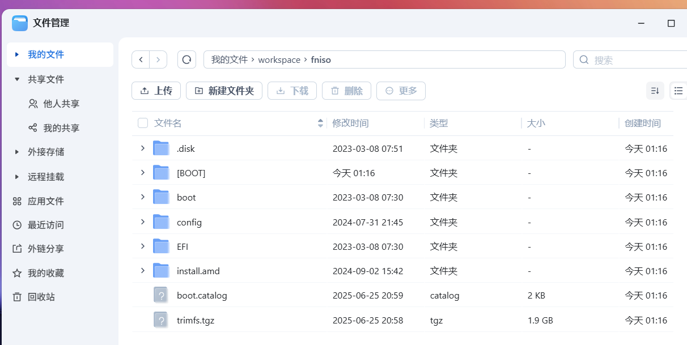

## 解压trimfs.tgz
执行如下命令，会解压这个压缩包  
```shell
mkdir rootfs
tar -xzvf fniso/trimfs.tgz -C rootfs
```

解压完成后，可以去飞牛的文件管理观察一下  
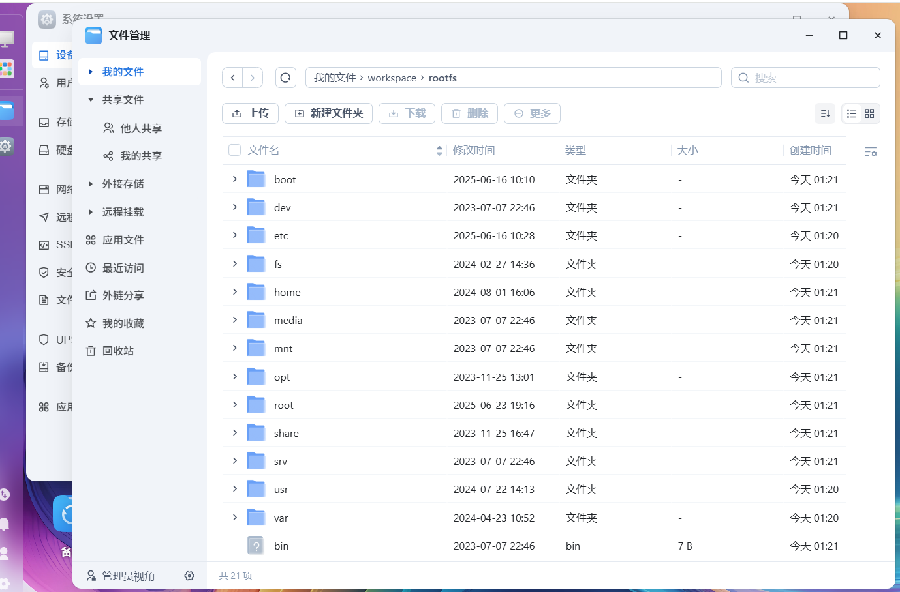

# 添加驱动及固件
若有添加驱动或固件，可以提前复制进去  
这一步不需要可以不做  
以下是将运行中系统内驱动及固件复制进rootfs的例子  
```shell
cp -rnv /lib/modules/`uname -r`/updates rootfs/lib/modules/`uname -r`/updates
cp -rnv /usr/lib/firmware rootfs/usr/lib/firmware
```

# 定制rootfs
执行如下命令，进入chroot中  
```shell
chroot rootfs /usr/bin/bash
```  
可以看见此时我们的根目录已经切换到了需要修改的飞牛rootfs中  
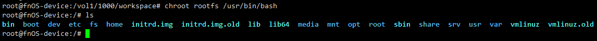

如需要修改网卡命名方式则需要修改`/etc/systemd/network/99-default.link`
```text
[Match]
OriginalName=*

[Link]
NamePolicy=mac
MACAddressPolicy=persistent
```

依次执行如下命令，下面的命令会打开ssh服务及postgresql访问，并将root密码设置为root  
创建一个128MB大小的内存盘，用来安装影视应用  
这里有一个坑，飞牛的trimfs.tgz自带一个错误的fstab，需要删除  
脚本如下  
```shell
sed -i "s/.*PasswordAuthentication.*/PasswordAuthentication yes/g" /etc/ssh/sshd_config
sed -i "s/.*PermitRootLogin.*/PermitRootLogin yes/g" /etc/ssh/sshd_config
sed -i "s/.*HandleLidSwitch=.*/HandleLidSwitch=ignore/g" /etc/systemd/logind.conf
systemctl enable ssh
echo "root:root"|chpasswd
echo "host all all 0.0.0.0/0 trust" >> /etc/postgresql/15/main/pg_hba.conf
echo "listen_addresses = '*'" >> /etc/postgresql/15/main/postgresql.conf
systemctl disable docker dsmgr apparmor
systemctl mask sleep.target suspend.target hibernate.target hybrid-sleep.target
sed -i '/^ExecStart=\/usr\/trim\/bin\/triminit/a ExecStartPost=modprobe scsi_debug inq_product=GreenDamTan dev_size_mb=128' /etc/systemd/system/trim_init.service
rm /etc/fstab
depmod
exit
```  
回显如下  
```log
root@fnOS-device:/# sed -i "s/.*PasswordAuthentication.*/PasswordAuthentication yes/g" /etc/ssh/sshd_config
root@fnOS-device:/# sed -i "s/.*PermitRootLogin.*/PermitRootLogin yes/g" /etc/ssh/sshd_config
root@fnOS-device:/# systemctl enable ssh
Synchronizing state of ssh.service with SysV service script with /lib/systemd/systemd-sysv-install.
Executing: /lib/systemd/systemd-sysv-install enable ssh
Created symlink /etc/systemd/system/sshd.service → /lib/systemd/system/ssh.service.
Created symlink /etc/systemd/system/multi-user.target.wants/ssh.service → /lib/systemd/system/ssh.service.
root@fnOS-device:/# echo "root:root"|chpasswd
root@fnOS-device:/# echo "host all all 0.0.0.0/0 trust" >> /etc/postgresql/15/main/pg_hba.conf
root@fnOS-device:/# echo "listen_addresses = '*'" >> /etc/postgresql/15/main/postgresql.conf
root@fnOS-device:/# systemctl disable docker
root@fnOS-device:/# sed -i '/^ExecStart=\/usr\/trim\/bin\/triminit/a ExecStartPost=modprobe scsi_debug inq_product=GreenDamTan dev_size_mb=128' /etc/systemd/system/trim_init.service
root@fnOS-device:/# rm /etc/fstab
root@fnOS-device:/# exit
```

# 配置引导及squashfs

## 打包squashfs
首先提前创建需要的目录  
```shell
mkdir -p {staging/{EFI/BOOT,boot/grub/x86_64-efi,isolinux,live},tmp}
```

并将rootfs打包为squashfs
```shell
mksquashfs rootfs staging/live/filesystem.squashfs -comp zstd -processors `nproc` -no-xattrs -e boot
```

期间如下例，会有大量Unrecognised问题，不需要理会  
```log
Unrecognised xattr prefix system.posix_acl_access
Unrecognised xattr prefix system.posix_acl_default
Unrecognised xattr prefix system.posix_acl_access
[==================================================================================================================================================================================================================/] 104753/104753 100%

Exportable Squashfs 4.0 filesystem, gzip compressed, data block size 131072
	compressed data, compressed metadata, compressed fragments,
	compressed xattrs, compressed ids
	duplicates are removed
Filesystem size 1668396.73 Kbytes (1629.29 Mbytes)
	32.22% of uncompressed filesystem size (5178091.75 Kbytes)
Inode table size 928174 bytes (906.42 Kbytes)
	30.79% of uncompressed inode table size (3014514 bytes)
Directory table size 838605 bytes (818.95 Kbytes)
	40.90% of uncompressed directory table size (2050236 bytes)
Number of duplicate files found 5796
Number of inodes 86728
Number of files 72254
Number of fragments 6571
Number of symbolic links 7678
Number of device nodes 9
Number of fifo nodes 0
Number of socket nodes 0
Number of directories 6787
Number of hard-links 0
Number of ids (unique uids + gids) 26
Number of uids 13
	root (0)
	_apt (42)
	polkitd (995)
	postgres (107)
	tss (112)
	username (1000)
	unknown (3064)
	www-data (712)
	uuidd (111)
	libvirt-qemu (64055)
	statd (106)
	systemd-timesync (997)
	Debian-exim (102)
Number of gids 19
	root (0)
	dip (30)
	Debian-exim (109)
	shadow (42)
	nut (116)
	messagebus (107)
	postgres (113)
	ssl-cert (112)
	crontab (101)
	mail (8)
	_ssh (108)
	unknown (1199)
	staff (50)
	uuidd (117)
	libvirt-qemu (64055)
	nogroup (65534)
	sambashare (996)
	winbindd_priv (993)
	systemd-timesync (997)
```

## 复制内核
这个就是刚刚置入live-boot的内核，将它复制  
```shell
cp /boot/*trim staging/live/
```

## 创建传统isolinux引导
如图所示，创建cfg配置  
此处需要注意指定RESOLUTION，否则在部分机器看不到画面  
```shell
cat <<'EOF' > "staging/isolinux/isolinux.cfg"
UI menu.c32

MENU TITLE Boot Menu
DEFAULT linux
TIMEOUT 600
MENU RESOLUTION 640 480
TIMEOUT 50

LABEL linux
  MENU LABEL FNOS Live [BIOS/ISOLINUX]
  MENU DEFAULT
  KERNEL /live/vmlinuz-6.12.18-trim
  APPEND initrd=/live/initrd.img-6.12.18-trim quiet splash boot=live pci=nomsi pcie_aspm=off spectre_v2=off
  
LABEL linux
  MENU LABEL FNOS Live DEBUG [BIOS/ISOLINUX]
  MENU DEFAULT
  KERNEL /live/vmlinuz-6.12.18-trim
  APPEND initrd=/live/initrd.img-6.12.18-trim boot=live debug=1 console=tty0 console=ttyS0,115200 pci=nomsi pcie_aspm=off spectre_v2=off
  
LABEL linux toram
  MENU LABEL FNOS Live [BIOS/ISOLINUX] (toram)
  MENU DEFAULT
  KERNEL /live/vmlinuz-6.12.18-trim
  APPEND initrd=/live/initrd.img-6.12.18-trim quiet splash boot=live toram=filesystem.squashfs pci=nomsi pcie_aspm=off spectre_v2=off
  
LABEL linux toram
  MENU LABEL FNOS Live DEBUG [BIOS/ISOLINUX] (toram)
  MENU DEFAULT
  KERNEL /live/vmlinuz-6.12.18-trim
  APPEND initrd=/live/initrd.img-6.12.18-trim boot=live debug=1 toram=filesystem.squashfs console=tty0 console=ttyS0,115200 pci=nomsi pcie_aspm=off spectre_v2=off
EOF
```

## 创建EFI引导的grub.cfg
如下所示，创建grub.cfg引导  
因为EFI目前没有分辨率问题，不需要指定分辨率  
但如果你后续觉得分辨率太大不好看也可以自行调整  
```shell
cat <<'EOF' > "staging/boot/grub/grub.cfg"
insmod gzio
insmod iso9660
insmod fat

set timeout=5
set gfxmode=auto
set gfxpayload=keep
set gfxmode=800x600
insmod all_video
insmod gfxterm

terminal_output gfxterm

search --file --set=root /live/filesystem.squashfs

menuentry "FNOS Live" {
    echo 'Loading vmlinuz'
    linux ($root)/live/vmlinuz-6.12.18-trim quiet splash boot=live pci=nomsi pcie_aspm=off spectre_v2=off
    echo 'Loading initrd'
    initrd ($root)/live/initrd.img-6.12.18-trim
}

menuentry "FNOS Live Verbose" {
    echo 'Loading vmlinuz'
    linux ($root)/live/vmlinuz-6.12.18-trim boot=live debug=1 console=tty0 console=ttyS0,115200 pci=nomsi pcie_aspm=off spectre_v2=off
    echo 'Loading initrd'
    initrd ($root)/live/initrd.img-6.12.18-trim
}

menuentry "FNOS Live toRam" {
    echo 'Loading vmlinuz'
    linux ($root)/live/vmlinuz-6.12.18-trim quiet splash boot=live toram=filesystem.squashfs pci=nomsi pcie_aspm=off spectre_v2=off
    echo 'Loading initrd'
    initrd ($root)/live/initrd.img-6.12.18-trim
}

menuentry "FNOS Live toRam Verbose" {
    echo 'Loading vmlinuz'
    linux ($root)/live/vmlinuz-6.12.18-trim boot=live debug=1 toram=filesystem.squashfs console=tty0 console=ttyS0,115200 pci=nomsi pcie_aspm=off spectre_v2=off
    echo 'Loading initrd'
    initrd ($root)/live/initrd.img-6.12.18-trim
}
EOF
```

```shell
cat <<'EOF' > "staging/EFI/BOOT/grub.cfg"
search --file --set=root /live/filesystem.squashfs
set prefix=($root)/boot/grub
source $prefix/x86_64-efi/grub.cfg
EOF
```

## 创建早期引导配置
这个配置的作用是，丢在EFI分区，来引导grub  
```shell
cat <<'EOF' > "tmp/grub-embed.cfg"
if ! [ -d "$cmdpath" ]; then
    if regexp --set=1:isodevice '^(\([^)]+\))\/?[Ee][Ff][Ii]\/[Bb][Oo][Oo][Tt]\/?$' "$cmdpath"; then
        cmdpath="${isodevice}/EFI/BOOT"
    fi
fi
configfile "${cmdpath}/grub.cfg"
EOF
```

## 复制legacy所需文件
复制文件就完事了
```shell
cp /usr/lib/ISOLINUX/isolinux.bin "staging/isolinux/" && \
cp /usr/lib/syslinux/modules/bios/* "staging/isolinux/"
```

## 复制EFI启动所需文件
也是复制就完事了，注意如果被制作的版本不一致的时候  
这个文件应该从宿主机获取，本次制作的版本是一致的所以就从rootfs拿了  
原则上应该从被复制内核的机器上获取的  
```shell
cp -r rootfs/usr/lib/grub/x86_64-efi staging/boot/grub/
```

```shell
cat <<'EOF' > "staging/boot/grub/x86_64-efi/grub.cfg"
insmod part_acorn
insmod part_amiga
insmod part_apple
insmod part_bsd
insmod part_dfly
insmod part_dvh
insmod part_gpt
insmod part_msdos
insmod part_plan
insmod part_sun
insmod part_sunpc
source /boot/grub/grub.cfg
EOF
```


## 创建可引导EFI的grub镜像
因为飞牛系统是64位，所以只需要创建64位的就行了  
i386-efi是不需要的
```shell
grub-mkstandalone -O x86_64-efi \
    --modules="part_gpt part_msdos fat iso9660" \
    --locales="" \
    --themes="" \
    --fonts="" \
    --output="staging/EFI/BOOT/BOOTx64.EFI" \
    "boot/grub/grub.cfg=tmp/grub-embed.cfg"
```

## 创建FAT16 UEFI可引导镜像
```shell
(cd "staging" && \
    dd if=/dev/zero of=efiboot.img bs=1M count=20 && \
    mkfs.vfat efiboot.img && \
    mmd -i efiboot.img ::/EFI ::/EFI/BOOT && \
    mcopy -vi efiboot.img \
        "/vol1/1000/workspace/staging/EFI/BOOT/BOOTx64.EFI" \
        "/vol1/1000/workspace/staging/EFI/BOOT/grub.cfg" \
        ::/EFI/BOOT/
)
```  
终端回显如下
```log
20+0 records in
20+0 records out
20971520 bytes (21 MB, 20 MiB) copied, 0.039375 s, 533 MB/s
mkfs.fat 4.2 (2021-01-31)
Copying BOOTx64.EFI
Copying grub.cfg
```
## 打包ISO镜像文件
执行如下命令，创建可引导的ISO镜像  
```shell
xorriso \
    -as mkisofs \
    -iso-level 3 \
    -o "fnos-custom.iso" \
    -full-iso9660-filenames \
    -volid "FNOS_LIVE" \
    --mbr-force-bootable -partition_offset 16 \
    -joliet -joliet-long -rational-rock \
    -isohybrid-mbr /usr/lib/ISOLINUX/isohdpfx.bin \
    -eltorito-boot \
        isolinux/isolinux.bin \
        -no-emul-boot \
        -boot-load-size 4 \
        -boot-info-table \
    -eltorito-alt-boot \
        -e --interval:appended_partition_2:all:: \
        -no-emul-boot \
        -isohybrid-gpt-basdat \
    -append_partition 2 C12A7328-F81F-11D2-BA4B-00A0C93EC93B staging/efiboot.img \
    "staging"
```
终端回显可参考  
```log
xorriso 1.5.4 : RockRidge filesystem manipulator, libburnia project.

Drive current: -outdev 'stdio:fnos-custom.iso'
Media current: stdio file, overwriteable
Media status : is blank
Media summary: 0 sessions, 0 data blocks, 0 data,  112g free
Added to ISO image: directory '/'='/vol1/1000/workspace/staging'
xorriso : UPDATE :     365 files added in 1 seconds
xorriso : UPDATE :     365 files added in 1 seconds
xorriso : NOTE : Copying to System Area: 432 bytes from file '/usr/lib/ISOLINUX/isohdpfx.bin'
libisofs: NOTE : Automatically adjusted MBR geometry to 1023/112/32
libisofs: NOTE : Aligned image size to cylinder size by 594 blocks
xorriso : UPDATE :  6.98% done
xorriso : UPDATE :  79.82% done
ISO image produced: 927014 sectors
Written to medium : 927014 sectors at LBA 0
Writing to 'stdio:fnos-custom.iso' completed successfully.

```
# 引导测试
## 传统legacy引导测试
### 创建虚拟机
我们直接使用飞牛fnOS自带的虚拟机进行测试
如正常Linux一样配置引导即可  
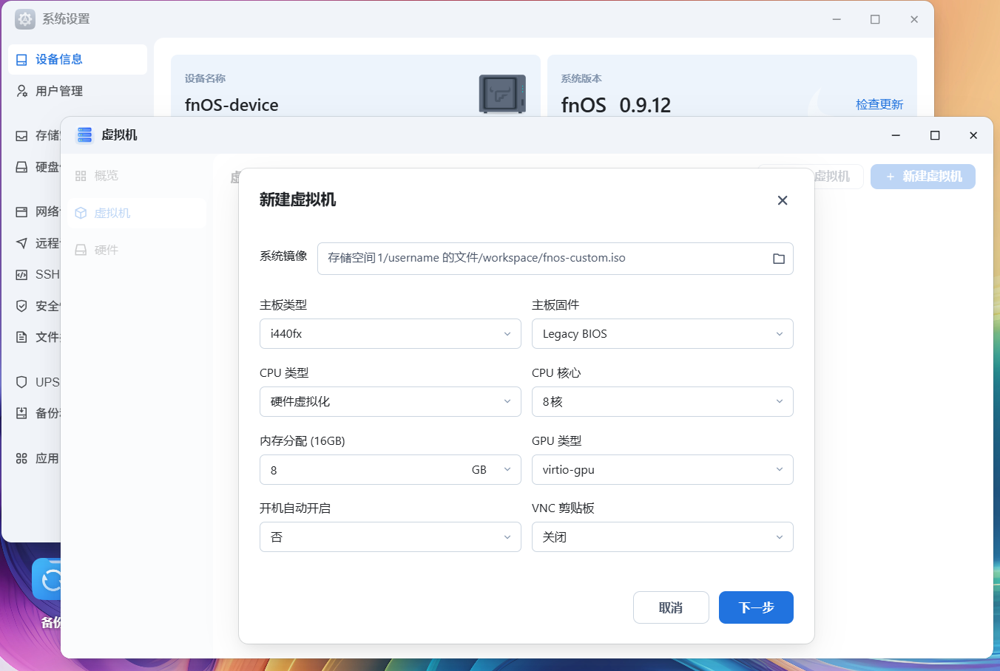
## 开机并引导
开机后可见如下画面，这次我们选择第一项，不选择toram  
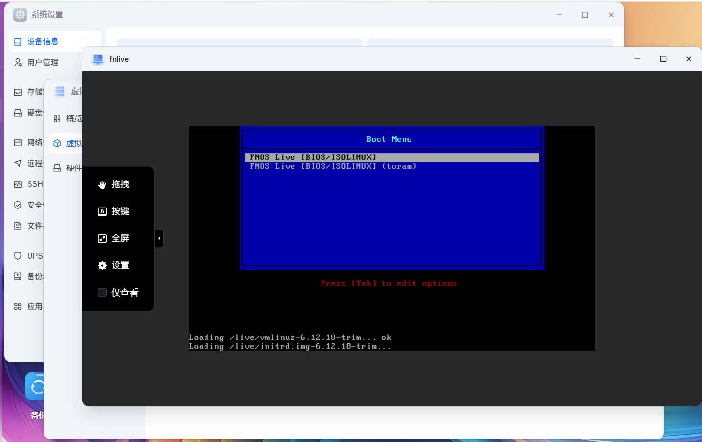

稍等片刻就会出现熟悉的界面  
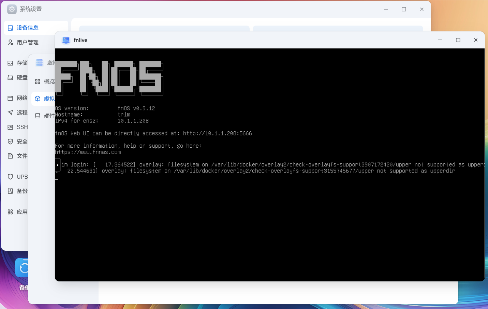
## 初始化并简单测试
这一步没什么好说的，就正常初始化飞牛fnOS系统，并创建个存储空间试试
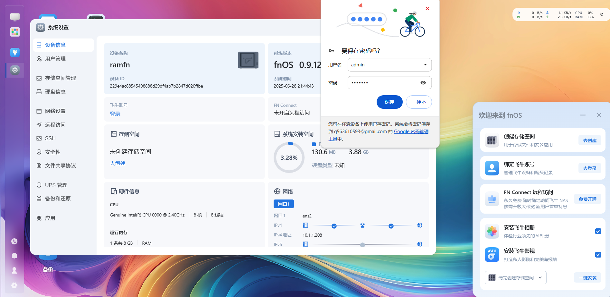  
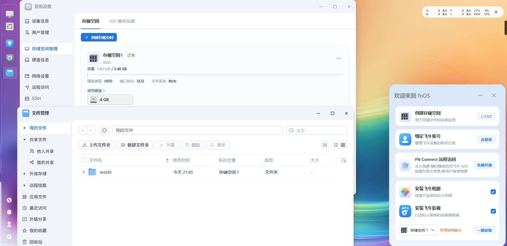
由于本次引导没有选择toram，squashfs不会被加载进内存  
这个模式表现类似Windows的统一写入筛选器(UWF)  
会将新写入的部分留存至内存中，其余部分从squashfs读取  
因此消耗内存并不高，但不能离开引导盘  


## EFI引导测试
### 创建虚拟机
正常创建虚拟机，但引导要选择Q35 UEFI
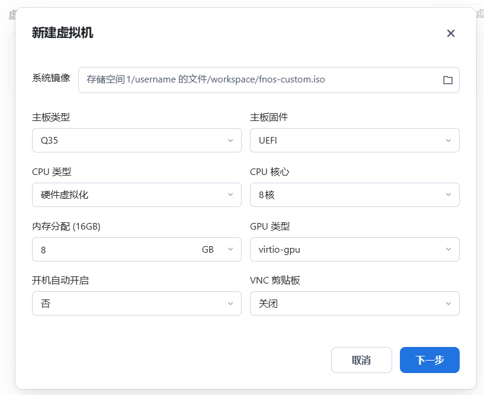
这次我们选择toram进行测试  
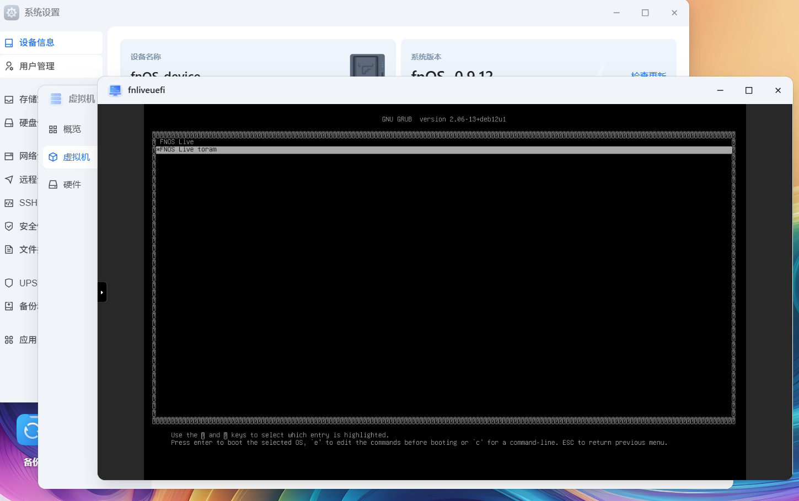
### 简单观察
如图所示，引导后占用的内存较大  
squashfs被加载入内存中  
这个模式下类似WindowsPE的RamDisk模式，会将WIM完全加载进内存运行  
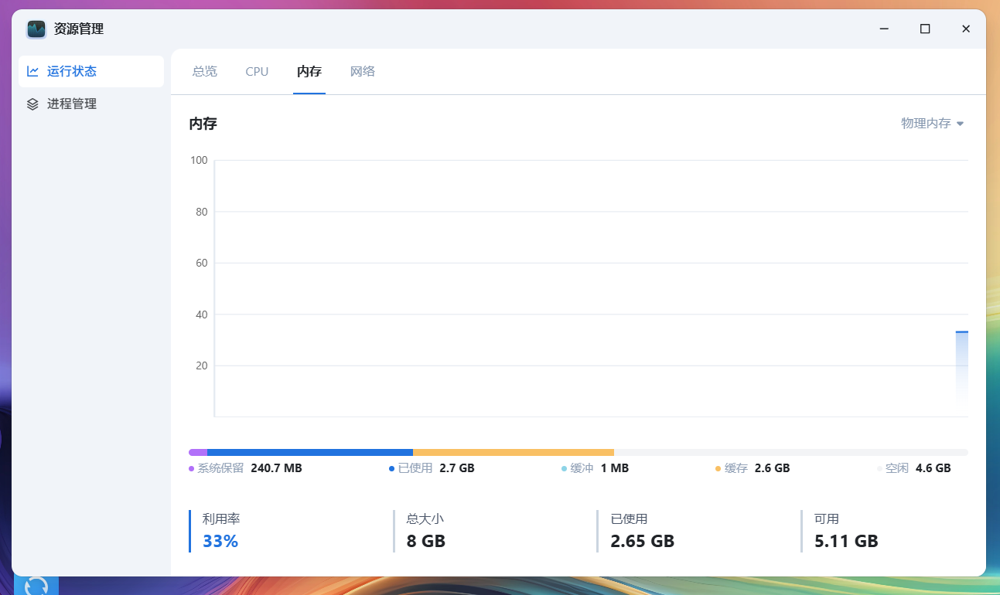
### 看看mount
直接用用户名root，密码root登入  
然后看看mount  
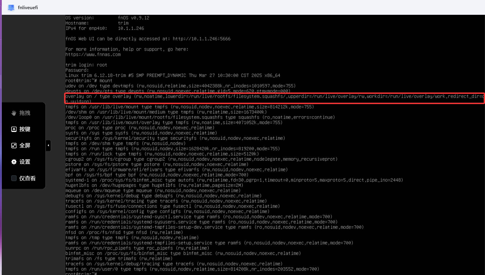

# 结束语
一顿操作猛如虎，不如把飞牛直接装在U盘  
想体验的直接下载成品ISO就好，不要自己去打包，真没必要  
https://s.fnnas.net/s/652dd824b178443588  
不过飞牛那个fn connect分享文件慢得很，你要下载多久我就不知道了  