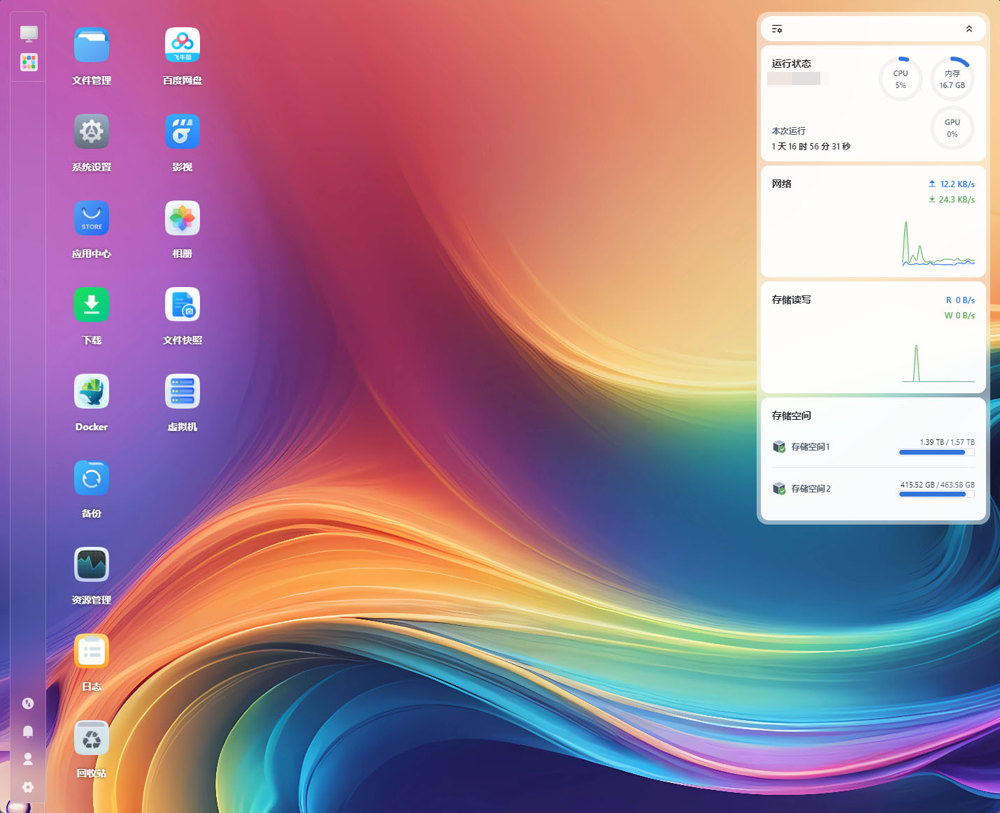
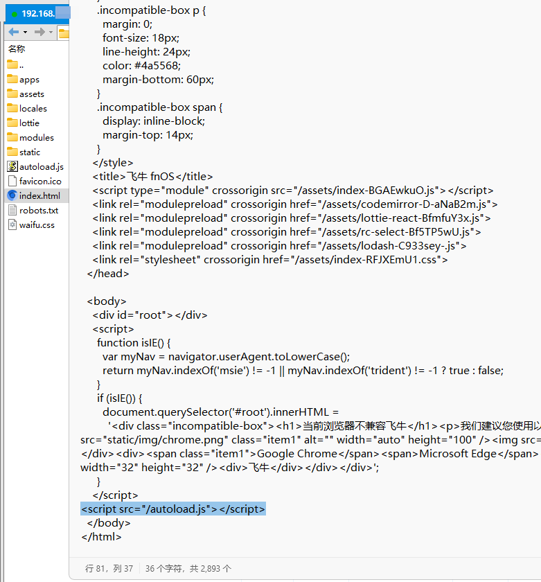
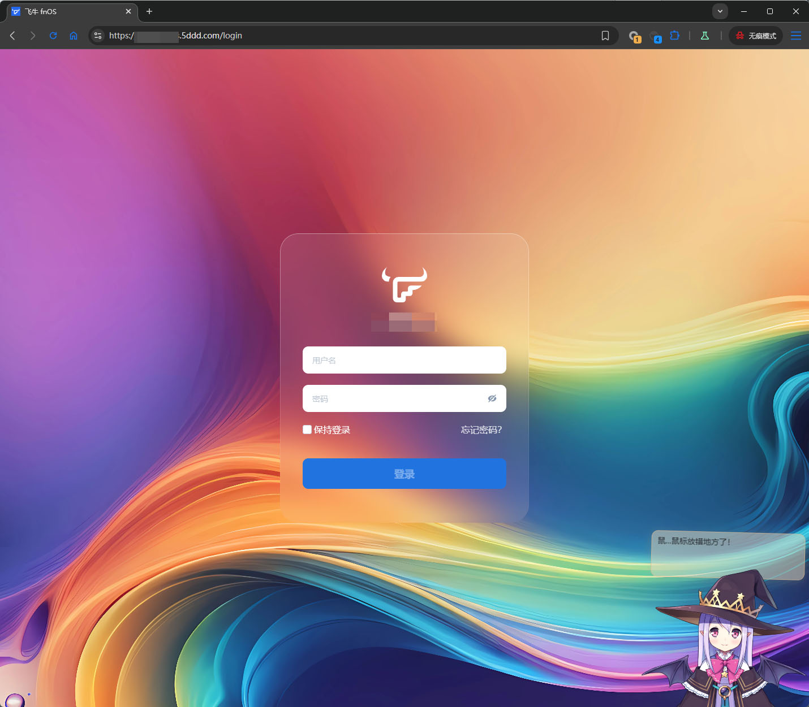
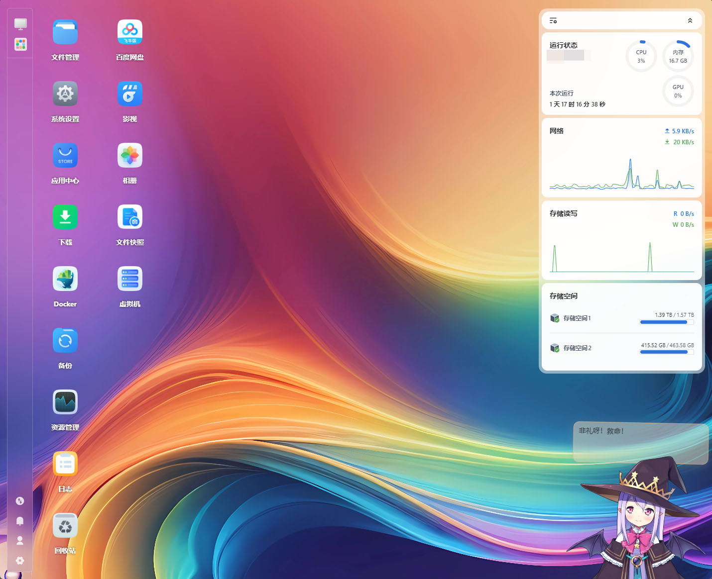

# 在飞牛fnOS Web端右下角加入看板娘

# 前言
飞牛fnOS的Web界面，左侧是图标及bar区域，左上是运行状态区域，左下角没有任何东西，看起来就很膈应  

总感觉左下角应该有点什么东西才对  
在访问别人的博客时，经常发现右下角有个看板娘，感觉飞牛也应该有一个  
这个项目看起来就很不错，可以尝试引入到飞牛里面  
```text
https://github.com/stevenjoezhang/live2d-widget
```
本文写于fnOS 0.9.18，其他版本需自行测试

# 解除trim_nginx限制
飞牛的nginx为防止小白用户误操作，具有自动回滚的特性  
但对于极客用户这个不是什么大问题，飞牛对极客用户也没有加特别多的限制  
这个不是本期重点，就粗略的说一下，属于是有手就行的东西
## 构建劫持库
```shell
gcc -fPIC -shared -o preload_inotify.so preload_inotify.c -ldl
```
## 添加 LD_PRELOAD
```shell
vim /etc/systemd/system/trim_nginx.service
```
在[Service]一节新增
```text
Environment=LD_PRELOAD=/root/preload_inotify.so
```
## 重启服务
```shell
systemctl daemon-reload
systemctl restart trim_nginx.service
```

# 启用live2d-widgets
## 下载文件
进入/usr/trim/www，然后将需要的文件下载下来
```shell
wget https://fastly.jsdelivr.net/npm/live2d-widgets@1.0.0-rc.6/dist/autoload.js
wget https://fastly.jsdelivr.net/npm/live2d-widgets@1.0.0-rc.6/dist/waifu.css
```
## 调整样式
编辑autoload.js，将live2d_path替换为'/'
```js
 loadExternalResource('/' + 'waifu.css', 'css')
```
由于我们希望让看板娘在右侧展示，需要将left改为right
```css
#waifu {
	bottom: -500px;
	right: 0;
	position: fixed;
	transform: translateY(25px);
	transition: transform .3s ease-in-out, bottom 3s ease-in-out;
	z-index: 1;
}
```
## 修改index.html
编辑/usr/trim/www/index.html
在图中的这个位置  
  
加入一行
```html
<script src="/autoload.js"></script>
```

# 刷新页面并查看效果
引入完js后，就可以刷新页面了  
看板娘，可爱滴捏！
## 登入页面

## 主页面


# 结束语
希望飞牛早日能在右下角放点什么东西，不然看着难受