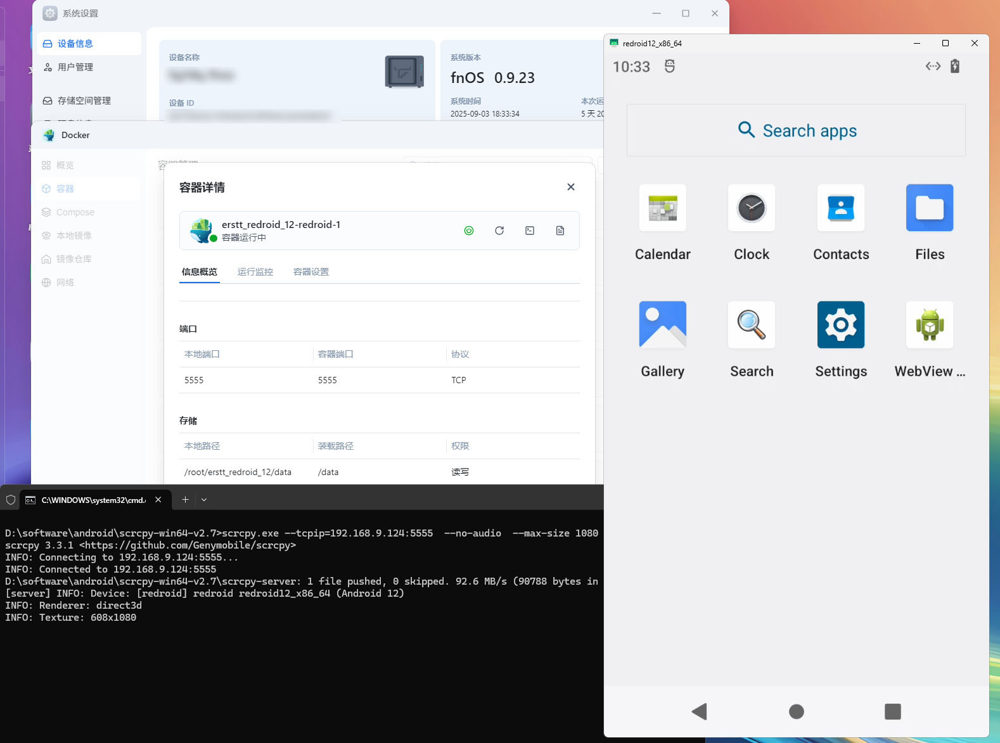
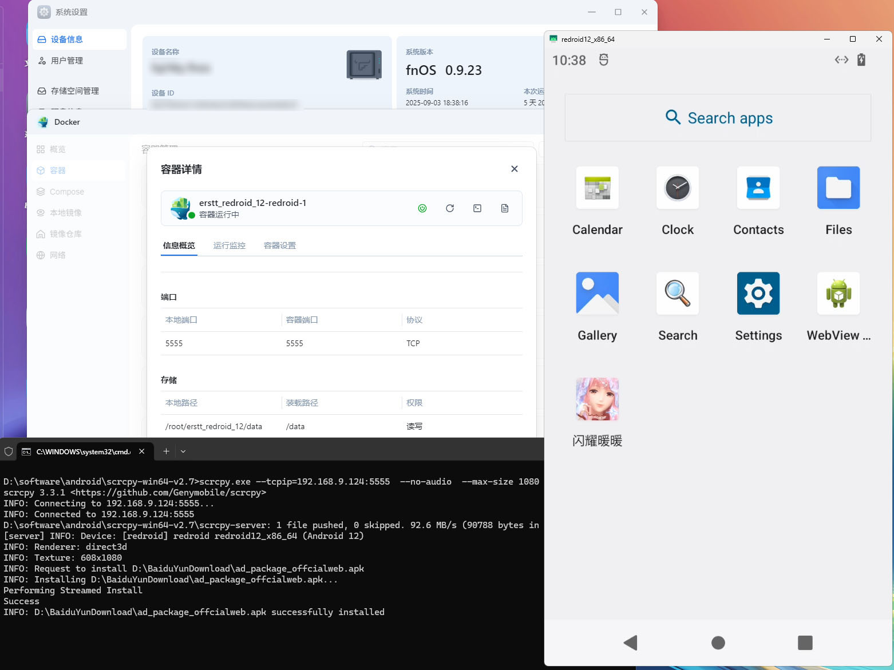
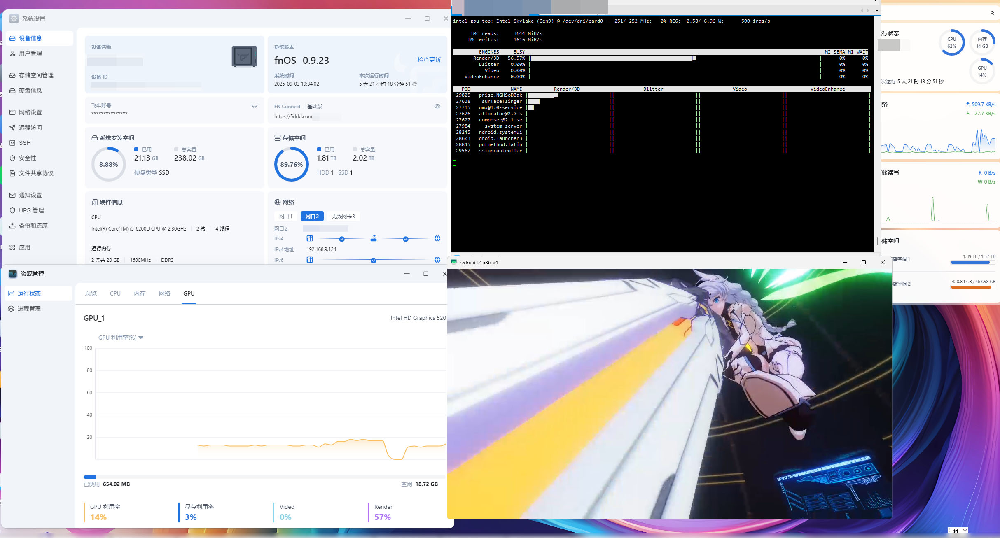

# 在docker容器中运行安卓系统redroid

# 前言
在Linux中运行安卓系统有各种各样的方案  
重量级一点就是直接拿虚拟机跑一个，轻量级一点就是用应用框架直接跑apk  
但综合来说性能与兼容性最佳的方案应该是以redroid为代表的容器化运行安卓系统的方案

# 塞驱动
redroid运行前需要加载几个驱动
## ashmem
这个驱动在高版本Linux内核已经被废弃，移植成本较高，可以直接放弃  
改用`androidboot.use_memfd=memfd`替代即可
## binder_linux

在编译这个驱动之前，先修改一下源码避免后续权限不对造成的麻烦

我们需要新增一行`binder_device->miscdev.mode  = 0777;`  
代码节选大概就是这个样子  
https://github.com/torvalds/linux/blob/v6.12/drivers/android/binder.c  
上面这个链接就是原始代码，下面的是改完的样子，可以自行对比init_binder_device  
```c
static int __init init_binder_device(const char *name)
{
	int ret;
	struct binder_device *binder_device;

	binder_device = kzalloc(sizeof(*binder_device), GFP_KERNEL);
	if (!binder_device)
		return -ENOMEM;

	binder_device->miscdev.fops = &binder_fops;
	binder_device->miscdev.minor = MISC_DYNAMIC_MINOR;
	binder_device->miscdev.name = name;
	binder_device->miscdev.mode  = 0777;

	refcount_set(&binder_device->ref, 1);
	binder_device->context.binder_context_mgr_uid = INVALID_UID;
	binder_device->context.name = name;
	mutex_init(&binder_device->context.context_mgr_node_lock);

	ret = misc_register(&binder_device->miscdev);
	if (ret < 0) {
		kfree(binder_device);
		return ret;
	}

	hlist_add_head(&binder_device->hlist, &binder_devices);

	return ret;
}
```  
新建如下文件夹
```shell
mkdir -p /lib/modules/6.12.18-trim/updates/dkms/android
```  
编译完成后，将构建产物 `binder_linux.ko` 丢进去
```shell
cp ./binder_linux.ko /lib/modules/6.12.18-trim/updates/dkms/android/
depmod
modprobe -D binder_linux
```  
如果没有异常，会返回驱动模块的目录  
```text
root@fnnas:~# modprobe -D binder_linux 
insmod /lib/modules/6.12.18-trim/updates/dkms/android/binder_linux.ko
```

随后就可以加载模块了
```shell
modprobe -v binder_linux devices="binder,hwbinder,vndbinder"
lsmod |grep bin
```  
回显大概是这样的  
```text
root@fnnas:~# modprobe -v binder_linux devices="binder,hwbinder,vndbinder"
insmod /lib/modules/6.12.18-trim/updates/dkms/android/binder_linux.ko devices=binder,hwbinder,vndbinder
root@fnnas:~# lsmod |grep bin
binder_linux          229376  0
binfmt_misc            28672  1
```

# 拉容器
redroid有非常多的衍生版本，你可以自己选择喜欢的  
这里以 `https://hub.docker.com/r/erstt/redroid` 为例
```shell
docker pull erstt/redroid:12.0.0_houdini_WSA
```  
回显如下
```text
root@fnnas:~# docker pull erstt/redroid:12.0.0_houdini_WSA
12.0.0_houdini_WSA: Pulling from erstt/redroid
88f77cbe3f40: Pull complete 
68544e4d7ea6: Pull complete 
Digest: sha256:7c1f4355fa245e55cc15fa46ff3be8c347cee73c3eeb5c8b7a6def93013eb54d
Status: Downloaded newer image for erstt/redroid:12.0.0_houdini_WSA
docker.io/erstt/redroid:12.0.0_houdini_WSA
```

# 创建docker-compose
可以参考以下的文件，并自行修改  
如果不明白以下选项的作用建议直接抄作业  
反馈问题前，请使用该compose先进行验证  
```yaml
services:
  redroid:
    image: erstt/redroid:12.0.0_houdini_WSA
    tty: true
    stdin_open: true
    privileged: true
    devices:
      - /dev/dri
      - /dev/binder
    networks:
      - main
    ports:
      - 5555:5555
    volumes:
      - /root/erstt_redroid_12/data:/data
    command:
      - androidboot.redroid_gpu_mode=host
      - androidboot.use_memfd=1
      - ro.enable.native.bridge.exec64=1
      - ro.dalvik.vm.native.bridge=libhoudini.so
networks:
  main:
    driver: bridge
    name: main
```  
redroid_gpu_mode需要根据你机器上是否有支持GPU选择guest或host  
ro.enable.native.bridge.exec64与ro.dalvik.vm.native.bridge需要根据兼容转换层调整  
详细信息可以查看文档`https://github.com/remote-android/redroid-doc`

使用docker-compose创建容器后，就可以去连接容器了
# 安卓，启动！
接下来简单介绍如何访问这个安卓容器
## 远程连接
开启安卓容器后，我们可以使用远程工具连接  
这里以scrcpy为例，连接IP 192.168.9.124  
因为我的设备没有接入耳机，因此开启了no-audio  
你需要根据你的实际情况，选择合适的工具与命令行参数  
该远程工具文档及可执行文件可以在这里找到 `https://github.com/Genymobile/scrcpy`  
```shell
scrcpy.exe --tcpip=192.168.9.124:5555  --no-audio  --max-size 1080 --video-bit-rate=2M
```
  
连接完成后，就可以直接操作容器内的安卓系统

## 安装应用
安装应用可以使用adb，也可以直接将应用拖入画面中  
  
稍等片刻即可安装完毕，如果安装失败也可以看看日志返回了什么

## 打打游戏
为了监视GPU性能，可以安装以下软件包  
实际使用的时候并不需要这个软件包  
```shell
apt update & apt install intel-gpu-tools -y
```  
安装完软件后，可以使用命令查看GPU使用情况  
```shell
intel_gpu_top
```  
  
如图所示，《崩坏3rd》正常运行

# 结束语
其实，最适合跑容器安卓的东西，是绿联的RK3588那款nas，可惜我没钱买  
飞牛跑这东西，没有什么实际意义，但可以作为一种特别的玩法