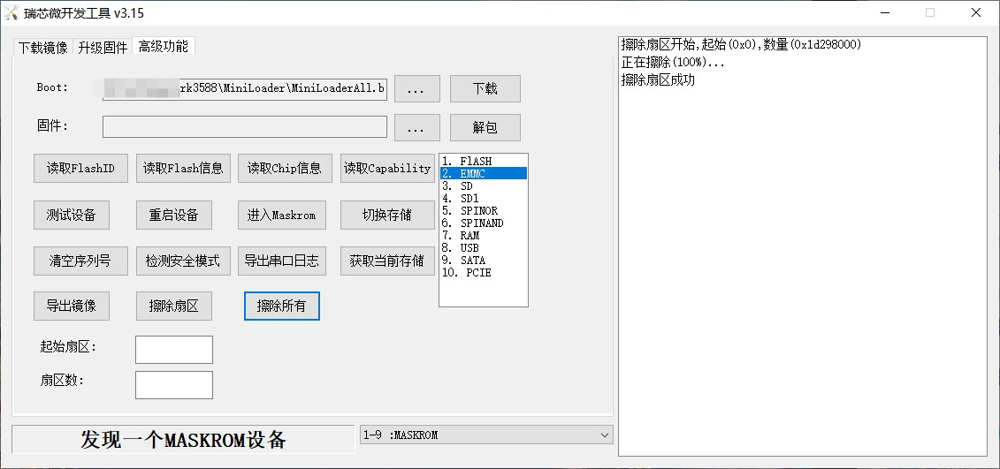
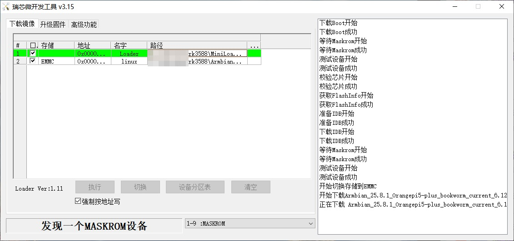
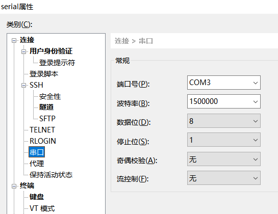
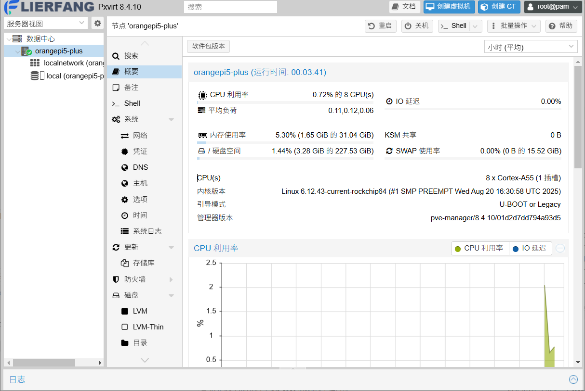
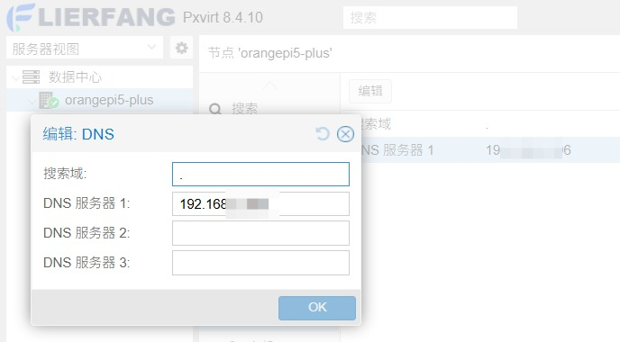
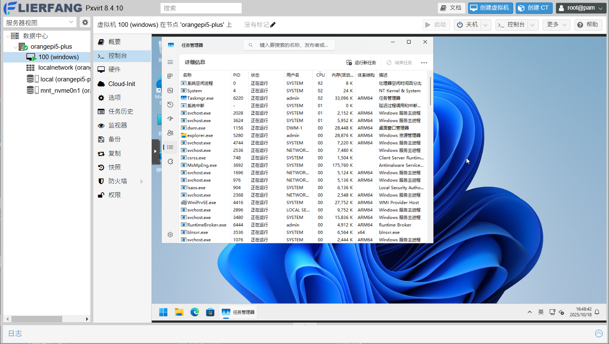

# 在RK3588的armbian电视盒子中安装Proxmox社区版pxvirt

# 前言
之前有一块紫光的虎贲T310板子用了两年扑街了，于是就购入了一个成品RK3588电视盒子作为替代  
至于虎贲T310上面那些外设接口，除了刚拿到的几个月，十个有九个没碰过，暴殄天物了属于是  
我使用虚拟机的场景主要是过一下自己写的小工具在WindowsARM下的兼容性  
以及尝鲜某些不希望直接在主机上跑的linux arm系统  
因为平时就有在用Proxmox，自然pxvirt就成为了我的首选，用libvirt我觉得太麻烦了  
没有多系统需求的建议直接在机器上跑就行，最多再加个docker

# 刷开发板(其实是电视盒子)
这部分内容实际上各个板子都不大一样，参考一下就行  
之前的虎贲T310处理器的板子还要签名才能刷写，建议这部分内容以官方文档为准  
我手里的这块盒子看了一下方案，与orangepi5-plus很相似，但这东西不是orangepi5-plus  
只有少数地方的定义不大一样，但如果不是要玩什么GPIO或者是其他接口，只是安装armbian是没有影响的  
不过这电视盒子基本上除了当电视盒子以外也没有其他用途的可能，毕竟接口基本上都没引出  
什么MIPI屏啊之类的统统没有  
系统就直接使用orangepi5-plus的armbian系统，如果是其他设备需要自行变通一下  
比如说自己定制dtb什么什么的  
如果差异太大千万不要硬刷，会烧外设、EMMC那些东西的
## 使用瑞芯微开发工具刷写armbian
本例使用EMMC作为系统盘，如果你有其他想法，想从SD或者是其他设备启动  
也可以自己看看官方文档改改  

首先为了避免发生奇怪的事情，先抹一次EMMC  


随后，再将armbian烧写进去


这板子的串口波特率是1500000，而不是常见的115200  
需要自己手动改一下  


如果可以正常连接上，说明串口配置正确，且刷写的系统运行正常  
连接串口不是必要步骤，但如果后面配置网络时出现问题连不上，有串口可以救一下系统  
```text
Connecting to COM3...
Connected.

DDR 9fa84341ce typ 24/09/06-09:51:11,fwver: v1.18
ch0 ttot10
ch1 ttot10
ch2 ttot10
ch3 ttot10
ch0 ttot18
LPDDR4X, 2112MHz
channel[0] BW=16 Col=10 Bk=8 CS0 Row=18 CS1 Row=18 CS=2 Die BW=8 Size=8192MB
ch1 ttot16
channel[1] BW=16 Col=10 Bk=8 CS0 Row=18 CS1 Row=18 CS=2 Die BW=8 Size=8192MB
ch2 ttot16
channel[2] BW=16 Col=10 Bk=8 CS0 Row=18 CS1 Row=18 CS=2 Die BW=8 Size=8192MB
ch3 ttot16
channel[3] BW=16 Col=10 Bk=8 CS0 Row=18 CS1 Row=18 CS=2 Die BW=8 Size=8192MB
Manufacturer ID:0xff
DQS rds:l0,l0 
CH0 RX Vref:28.9%, TX Vref:22.8%,22.8%
DQ rds:h2 l0 h2 h1 h1 l1 h2 h6, h1 h4 h2 h1 h7 l0 h1 l1 

DQS rds:h2,l0 
CH1 RX Vref:28.5%, TX Vref:23.8%,23.8%
DQ rds:h1 l0 l0 h1 h1 h4 h1 h2, h4 h1 h2 h1 l0 h6 h3 h2 

DQS rds:l0,l0 
CH2 RX Vref:29.3%, TX Vref:21.8%,21.8%
DQ rds:h1 h1 l0 l0 h1 h6 h5 h1, h2 h1 h1 l0 h2 l0 l0 l0 

DQS rds:l0,h1 
CH3 RX Vref:29.3%, TX Vref:24.8%,22.8%
DQ rds:h4 l0 h3 h2 h2 h2 h3 h1, h2 l0 h6 h3 l0 h1 l0 h4 

stride=0x2, ddr_config=0x4
hash ch_mask0-1 0x20 0x40, bank_mask0-3 0xa00 0x1400 0x2800 0x0, rank_mask0 0x401000
change to F1: 528MHz
ch0 ttot10
ch1 ttot10
ch2 ttot10
ch3 ttot10
change to F2: 1068MHz
ch0 ttot12
ch1 ttot12
ch2 ttot12
ch3 ttot12
change to F3: 1560MHz
ch0 ttot14
ch1 ttot14
ch2 ttot14
ch3 ttot14
change to F0: 2112MHz
ch0 ttot18
ch1 ttot18
ch2 ttot18
ch3 ttot16
out

U-Boot SPL 2025.04 (Apr 02 2024 - 10:58:58 +0000)
Trying to boot from MMC2
Card did not respond to voltage select! : -110
spl: mmc init failed with error: -95
Error: -95
Trying to boot from MMC1
## Checking hash(es) for config config-1 ... OK
## Checking hash(es) for Image atf-1 ... sha256+ OK
## Checking hash(es) for Image u-boot ... sha256+ OK
## Checking hash(es) for Image fdt-1 ... sha256+ OK
## Checking hash(es) for Image atf-2 ... sha256+ OK
## Checking hash(es) for Image atf-3 ... sha256+ OK
INFO:    Preloader serial: 2
NOTICE:  BL31: v2.3():v2.3-868-g040d2de11:derrick.huang, fwver: v1.48
NOTICE:  BL31: Built : 15:02:44, Dec 19 2024
INFO:    spec: 0x1
INFO:    code: 0x88
INFO:    ext 32k is not valid
INFO:    ddr: stride-en 4CH
INFO:    GICv3 without legacy support detected.
INFO:    ARM GICv3 driver initialized in EL3
INFO:    valid_cpu_msk=0xff bcore0_rst = 0x0, bcore1_rst = 0x0
INFO:    l3 cache partition cfg-0
INFO:    system boots from cpu-hwid-0
INFO:    bypass memory repair
INFO:    idle_st=0x21fff, pd_st=0x11fff9, repair_st=0xfff70001
INFO:    dfs DDR fsp_params[0].freq_mhz= 2112MHz
INFO:    dfs DDR fsp_params[1].freq_mhz= 528MHz
INFO:    dfs DDR fsp_params[2].freq_mhz= 1068MHz
INFO:    dfs DDR fsp_params[3].freq_mhz= 1560MHz
INFO:    BL31: Initialising Exception Handling Framework
INFO:    BL31: Initializing runtime services
WARNING: No OPTEE provided by BL2 boot loader, Booting device without OPTEE initialization. SMC`s destined for OPTEE will return SMC_UNK
ERROR:   Error initializing runtime service opteed_fast
INFO:    BL31: Preparing for EL3 exit to normal world
INFO:    Entry point address = 0xa00000
INFO:    SPSR = 0x3c9


U-Boot 2024.10-rc3-armbian-2024.10-rc3-Sd11a-Pe466-H89d7-V74ff-Bb703-R448a-dirty (Aug 06 2025 - 04:29:12 +0000)

Model: Xunlong Orange Pi 5 Plus
DRAM:  32 GiB (effective 31.7 GiB)
Core:  331 devices, 30 uclasses, devicetree: separate
MMC:   mmc@fe2c0000: 1, mmc@fe2e0000: 0
Loading Environment from nowhere... OK
In:    serial@feb50000
Out:   serial@feb50000
Err:   serial@feb50000
Model: Xunlong Orange Pi 5 Plus
rockchip_dnl_key_pressed: no saradc device found
Net:   No ethernet found.
Hit any key to stop autoboot:  0 
Scanning for bootflows in all bootdevs
Seq  Method       State   Uclass    Part  Name                      Filename
---  -----------  ------  --------  ----  ------------------------  ----------------
Scanning global bootmeth 'efi_mgr':
Card did not respond to voltage select! : -110
No EFI system partition
No EFI system partition
Failed to persist EFI variables
No EFI system partition
Failed to persist EFI variables
No EFI system partition
Failed to persist EFI variables
  0  efi_mgr      ready   (none)       0  <NULL>                    
** Booting bootflow '<NULL>' with efi_mgr
Loading Boot0000 'mmc 0' failed
EFI boot manager: Cannot load any image
Boot failed (err=-14)
Scanning bootdev 'mmc@fe2c0000.bootdev':
Card did not respond to voltage select! : -110
Scanning bootdev 'mmc@fe2e0000.bootdev':
  1  script       ready   mmc          1  mmc@fe2e0000.bootdev.part /boot/boot.scr
** Booting bootflow 'mmc@fe2e0000.bootdev.part_1' with script
Boot script loaded from mmc 0:1
249 bytes read in 12 ms (19.5 KiB/s)
16740000 bytes read in 110 ms (145.1 MiB/s)
38341120 bytes read in 230 ms (159 MiB/s)
169499 bytes read in 55 ms (2.9 MiB/s)
Working FDT set to 12000000
Trying kaslrseed command... Info: Unknown command can be safely ignored since kaslrseed does not apply to all boards.
Unknown command 'kaslrseed' - try 'help'
## Loading init Ramdisk from Legacy Image at 12180000 ...
   Image Name:   uInitrd
   Image Type:   AArch64 Linux RAMDisk Image (gzip compressed)
   Data Size:    16739936 Bytes = 16 MiB
   Load Address: 00000000
   Entry Point:  00000000
   Verifying Checksum ... OK
## Flattened Device Tree blob at 12000000
   Booting using the fdt blob at 0x12000000
Working FDT set to 12000000
   Loading Ramdisk to ebbbe000, end ecbb4e60 ... OK
   Loading Device Tree to 00000000ebb2c000, end 00000000ebbbdfff ... OK
Working FDT set to ebb2c000

Starting kernel ...


Armbian 25.8.1 Bookworm ttyS2 

orangepi5-plus login: 

```

## SSH连接armbian系统
直接使用ssh连接即可，至于IP怎么找  
你可以从串口连接输入`ip a`，也可以去路由器上看DHCP获取到了什么IP  
如下所示，直接SSH走IP就能连上  
```text
Connecting to 192.168.2.2:22...
Connection established.
To escape to local shell, press 'Ctrl+Alt+]'.

    _             _    _           
   /_\  _ _ _ __ | |__(_)__ _ _ _  
  / _ \| '_| '  \| '_ \ / _` | ' \ 
 /_/ \_\_| |_|_|_|_.__/_\__,_|_||_|
                                   
 v25.8.1 for Orange Pi 5 Plus running Armbian Linux 6.12.43-current-rockchip64

 Packages:     Debian stable (bookworm), possible distro upgrade (trixie)
 Updates:      Kernel upgrade enabled and 4 packages available for upgrade 
 IPv4:         (LAN) 192.168.2.2 (WAN) 
 IPv6:         2409:: (WAN) 2409:: 

 Performance:  

 Load:         1%           	 Uptime:       0 min	
 Memory usage: 1% of 31.04G 	
 CPU temp:     37°C           	 Usage of /:   1% of 228G   	

 Commands: 

 Configuration : armbian-config
 Upgrade       : armbian-upgrade
 Monitoring    : htop

Last login: Sat Oct 18 14:18:11 2025
root@orangepi5-plus:~# echo 90 > /sys/devices/platform/pwm-fan/hwmon/hwmon*/pwm1
root@orangepi5-plus:~# 
```  
因为这电视盒子的一些地方还是跟orangepi5-plus不一样，此处使用了命令重新调整了风扇  
如果你的板子没有发出十分甚至九分大的声音，就不需要像示例一样调整风扇
# 配置软件源
## 配置debian镜像源
debian相关的源，我这里是选择使用ustc的，但如果你有更好的也可以自己选取其他的  
https://mirrors.ustc.edu.cn/help/debian.html

这里先给出默认的源的配置
```text
root@orangepi5-plus:~# cat /etc/apt/sources.list.d/armbian.sources 
Types: deb
URIs: http://apt.armbian.com
Suites: bookworm
Components: main bookworm-utils bookworm-desktop
Signed-By: /usr/share/keyrings/armbian-archive-keyring.gpg
```

```text
root@orangepi5-plus:~# cat /etc/apt/sources.list.d/debian.sources 
Types: deb
URIs: http://deb.debian.org/debian
Suites: bookworm bookworm-updates bookworm-backports
Components: main contrib non-free non-free-firmware
Signed-By: /usr/share/keyrings/debian-archive-keyring.gpg

Types: deb
URIs: http://security.debian.org/
Suites: bookworm-security
Components: main contrib non-free non-free-firmware
Signed-By: /usr/share/keyrings/debian-archive-keyring.gpg
```

如上所示，如果我们需要修改源可以直接用下面的命令  
```shell
sed -i 's/apt.armbian.com/mirrors.ustc.edu.cn\/armbian/g' /etc/apt/sources.list.d/armbian.sources
sed -i 's/deb.debian.org/mirrors.ustc.edu.cn/g' /etc/apt/sources.list.d/debian.sources
sed -i 's/security.debian.org/mirrors.ustc.edu.cn\/debian-security/g' /etc/apt/sources.list.d/debian.sources
```  
有的地方会有http劫持，可以考虑换成https  
但有的机器armbian默认不带https的ca证书，改了会连不上，要不要改https取决于自己  
```shell
sed -i 's/http/https/g' /etc/apt/sources.list.d/armbian.sources /etc/apt/sources.list.d/debian.sources
```

改完了跑一下`apt update`没问题就可以继续了  
```text
root@orangepi5-plus:~# apt update
Get:1 https://github.armbian.com/configng stable InRelease [5,467 B]
Get:2 https://mirrors.ustc.edu.cn/armbian bookworm InRelease [63.0 kB]
Get:3 https://mirrors.ustc.edu.cn/debian bookworm InRelease [151 kB]  
Get:4 https://mirrors.ustc.edu.cn/debian bookworm-updates InRelease [55.4 kB]
Get:5 https://mirrors.ustc.edu.cn/debian bookworm-backports InRelease [59.4 kB]
Get:6 https://mirrors.ustc.edu.cn/debian-security bookworm-security InRelease [48.0 kB]
Get:7 https://mirrors.ustc.edu.cn/armbian bookworm/bookworm-utils arm64 Packages [367 kB]
Get:8 https://mirrors.ustc.edu.cn/armbian bookworm/main arm64 Packages [2,139 kB]     
Get:9 https://mirrors.ustc.edu.cn/armbian bookworm/bookworm-desktop arm64 Packages [16.0 kB]
Get:10 https://mirrors.ustc.edu.cn/armbian bookworm/bookworm-desktop all Packages [9,869 B]
Get:11 https://mirrors.ustc.edu.cn/armbian bookworm/main all Packages [21.8 kB]   
Get:12 https://mirrors.ustc.edu.cn/armbian bookworm/bookworm-utils all Packages [11.7 kB]
Get:13 https://mirrors.ustc.edu.cn/debian bookworm/non-free-firmware arm64 Packages [6,407 B]
Get:14 https://mirrors.ustc.edu.cn/debian bookworm/contrib arm64 Packages [54.5 kB]
Get:15 https://github.armbian.com/configng stable/main arm64 Packages [427 B]
Get:16 https://mirrors.ustc.edu.cn/debian bookworm/non-free arm64 Packages [93.9 kB]
Get:17 https://mirrors.ustc.edu.cn/debian bookworm/main arm64 Packages [11.9 MB]
Get:18 https://mirrors.ustc.edu.cn/debian bookworm-updates/main arm64 Packages [6,936 B]
Get:19 https://mirrors.ustc.edu.cn/debian bookworm-backports/non-free-firmware arm64 Packages [3,832 B]
Get:20 https://mirrors.ustc.edu.cn/debian bookworm-backports/non-free arm64 Packages [12.6 kB]
Get:21 https://mirrors.ustc.edu.cn/debian bookworm-backports/contrib arm64 Packages [5,180 B]
Get:22 https://mirrors.ustc.edu.cn/debian bookworm-backports/main arm64 Packages [293 kB]
Get:23 https://mirrors.ustc.edu.cn/debian-security bookworm-security/contrib arm64 Packages [508 B]
Get:24 https://mirrors.ustc.edu.cn/debian-security bookworm-security/main arm64 Packages [278 kB]
Fetched 15.6 MB in 6s (2,548 kB/s)                                                                                                                                                                                                      
Reading package lists... Done
Building dependency tree... Done
Reading state information... Done
59 packages can be upgraded. Run 'apt list --upgradable' to see them.
```
## 配置pxvirt源并安装
这个东西在pxvirt官方文档有详细说明  
https://docs.pxvirt.lierfang.com/zh/installfromdebian.html

这一节内容大部分与官方文档一致，小部分有点自己的小想法  
建议直接看着上面那个链接，进官方文档抄作业  

### 添加软件源
下载gpg  
```shell
curl -L https://mirrors.lierfang.com/pxcloud/lierfang.gpg -o /etc/apt/trusted.gpg.d/lierfang.gpg
```
将软件源添加到list中  
```text
source /etc/os-release
echo "deb  https://mirrors.lierfang.com/pxcloud/pxvirt $VERSION_CODENAME main">/etc/apt/sources.list.d/pxvirt-sources.list
```

### 修改主机名
这里把IP改成你的访问IP，直接这样写进hosts就行  
```shell
echo "192.168.9.2 $(uname -n)" >> /etc/hosts
```  

PVE有一个判断hosts要有一个不是127开头的本主机IPv4的IP才能工作  
但至于是什么IP不影响PVE单节点启动  
至于为什么这里节选一下两处代码自行赏析  
pve-cluster/src/pmxcfs/pmxcfs.c  
```cpp
    cfs.nodename = g_strdup(utsname.nodename);

    if (!(cfs.ip = lookup_node_ip(cfs.nodename))) {
        cfs_critical(
            "Unable to resolve node name '%s' to a non-loopback IP address - missing entry in"
            " '/etc/hosts' or DNS?",
            cfs.nodename
        );
        qb_log_fini();
        exit(-1);
    }
```  
```cpp
static char *lookup_node_ip(const char *nodename) {
    char buf[INET6_ADDRSTRLEN];
    struct addrinfo *ainfo;
    struct addrinfo ahints = {
        .ai_flags = AI_V4MAPPED | AI_ALL,
    };
    if (getaddrinfo(nodename, NULL, &ahints, &ainfo)) {
        return NULL;
    }

    char *res = NULL;
    for (struct addrinfo *addr = ainfo; addr != NULL; addr = addr->ai_next) {
        if (addr->ai_family == AF_INET) {
            struct sockaddr_in *sa = (struct sockaddr_in *)addr->ai_addr;
            inet_ntop(addr->ai_family, &sa->sin_addr, buf, sizeof(buf));
            if (strncmp(buf, "127.", 4) != 0) {
                res = g_strdup(buf);
                goto ret;
            }
        } else if (addr->ai_family == AF_INET6) {
            struct sockaddr_in6 *sa = (struct sockaddr_in6 *)addr->ai_addr;
            inet_ntop(addr->ai_family, &sa->sin6_addr, buf, sizeof(buf));
            if (strcmp(buf, "::1") != 0) {
                res = g_strdup(buf);
                goto ret;
            }
        }
    }

ret:
    freeaddrinfo(ainfo);

    return res;
}
```

写完之后hosts是这样的  
```text
root@orangepi5-plus:~# cat /etc/hosts
127.0.0.1   localhost
127.0.1.1   orangepi5-plus
::1         localhost orangepi5-plus ip6-localhost ip6-loopback
fe00::0     ip6-localnet
ff00::0     ip6-mcastprefix
ff02::1     ip6-allnodes
ff02::2     ip6-allrouters
192.168.9.2 orangepi5-plus
```

### 安装ifupdown2
官方文档是这样描述的  
```text
pve使用ifupdown2来进行网络配置，可能某些发行版安装了NetworkManager，因此我们需要禁用其服务。
```
但实际上我这个armbian没有这个服务，不过执行下也不会有什么问题就是  
```shell
systemctl disable NetworkManager
systemctl stop NetworkManager
```

随后执行命令  
```shell
apt update
apt install ifupdown2 -y
rm /etc/network/interfaces.new
```

回显大概如下  
```text
root@orangepi5-plus:~# apt update
Hit:1 https://mirrors.ustc.edu.cn/armbian bookworm InRelease
Hit:2 https://mirrors.ustc.edu.cn/debian bookworm InRelease
Hit:3 https://mirrors.ustc.edu.cn/debian bookworm-updates InRelease
Hit:4 https://mirrors.ustc.edu.cn/debian bookworm-backports InRelease
Hit:5 https://mirrors.ustc.edu.cn/debian-security bookworm-security InRelease
Hit:6 https://github.armbian.com/configng stable InRelease
Reading package lists... Done
Building dependency tree... Done
Reading state information... Done
59 packages can be upgraded. Run 'apt list --upgradable' to see them.
root@orangepi5-plus:~# apt install ifupdown2 -y
Reading package lists... Done
Building dependency tree... Done
Reading state information... Done
Suggested packages:
  isc-dhcp-client bridge-utils python3-gvgen python3-mako
The following NEW packages will be installed:
  ifupdown2
0 upgraded, 1 newly installed, 0 to remove and 59 not upgraded.
Need to get 226 kB of archives.
After this operation, 1,611 kB of additional disk space will be used.
Get:1 https://mirrors.ustc.edu.cn/debian bookworm/main arm64 ifupdown2 all 3.0.0-1.1 [226 kB]
Fetched 226 kB in 1s (189 kB/s)   
Selecting previously unselected package ifupdown2.
(Reading database ... 26772 files and directories currently installed.)
Preparing to unpack .../ifupdown2_3.0.0-1.1_all.deb ...
Unpacking ifupdown2 (3.0.0-1.1) ...
Setting up ifupdown2 (3.0.0-1.1) ...
find: ‘/var/lib/dhcp/’: No such file or directory
Creating /etc/network/interfaces.
Created symlink /etc/systemd/system/basic.target.wants/networking.service → /lib/systemd/system/networking.service.
Created symlink /etc/systemd/system/network.target.wants/networking.service → /lib/systemd/system/networking.service.
Created symlink /etc/systemd/system/shutdown.target.wants/networking.service → /lib/systemd/system/networking.service.
Processing triggers for man-db (2.11.2-2) ...

```  

使用ifupdown2配置静态ip，可以通过`ip link show`查看你的网卡
```shell
ip link show
```
```text
root@orangepi5-plus:~# ip link show
1: lo: <LOOPBACK,UP,LOWER_UP> mtu 65536 qdisc noqueue state UNKNOWN mode DEFAULT group default qlen 1000
    link/loopback 00:00:00:00:00:00 brd 00:00:00:00:00:00
2: enP4p65s0: <BROADCAST,MULTICAST,UP,LOWER_UP> mtu 1500 qdisc pfifo_fast state UP mode DEFAULT group default qlen 1000
    link/ether 00:e0:4c:00:00:01 brd ff:ff:ff:ff:ff:ff
3: enP2p33s0: <NO-CARRIER,BROADCAST,MULTICAST,UP> mtu 1500 qdisc pfifo_fast state DOWN mode DEFAULT group default qlen 1000
    link/ether 00:e0:4c:00:00:02 brd ff:ff:ff:ff:ff:ff
4: wlP3p49s0: <BROADCAST,MULTICAST> mtu 1500 qdisc noop state DOWN mode DEFAULT group default qlen 1000
    link/ether c8:26:e2:00:00:03 brd ff:ff:ff:ff:ff:ff
```
我这个网卡为`enP4p65s0`  
直接往`/etc/network/interfaces`写就好，免得后面还得自己配  
```shell
cat << EOF >> /etc/network/interfaces

auto enP4p65s0
iface enP4p65s0 inet manual

auto enP2p33s0 
iface enP2p33s0 inet manual

iface wlP3p49s0 inet manual

auto vmbr0
iface vmbr0 inet static
address 192.168.2.2/24
gateway 192.168.2.1
bridge-ports enP4p65s0
bridge-stp off
bridge-fd 0
EOF
```

写完之后的前后对比内容大概是这样的  
```text
root@orangepi5-plus:~# cat /etc/network/interfaces
# interfaces(5) file used by ifup(8) and ifdown(8)
auto lo
iface lo inet loopback
```  

写完后  
```text
root@orangepi5-plus:~# cat /etc/network/interfaces
# interfaces(5) file used by ifup(8) and ifdown(8)
auto lo
iface lo inet loopback

auto enP4p65s0
iface enP4p65s0 inet manual

auto enP2p33s0 
iface enP2p33s0 inet manual

iface wlP3p49s0 inet manual

auto vmbr0
iface vmbr0 inet static
address 192.168.2.2/24
gateway 192.168.2.1
bridge-ports enP4p65s0
bridge-stp off
bridge-fd 0
```
配置完`/etc/network/interfaces`，就可以重启试试了  
如果连不上了就接串口再改改，也不是什么大事

再配置个DNS  
```shell
echo "nameserver 223.5.5.5" >>/etc/resolv.conf
```

如果想使用DHCP，可以安装这个包，然后再把配置加上
```shell
apt install -y isc-dhcp-client
```
```text
auto vmbr1
iface vmbr1 inet dhcp
bridge-ports enP2p33s0
bridge-stp off
bridge-fd 0
```

### 安装pxvirt
使用以下命令安装pxvirt  
```shell
apt update
apt install proxmox-ve pve-manager qemu-server pve-cluster
```
回显大概是这样的，按下y就开始安装了  
中间遇到什么东西直接默认就完事了  
```text
root@orangepi5-plus:~# apt install proxmox-ve pve-manager qemu-server pve-cluster
Reading package lists... Done
Building dependency tree... Done
Reading state information... Done
The following additional packages will be installed:
  adwaita-icon-theme apparmor at-spi2-common attr bcache-tools binutils binutils-aarch64-linux-gnu binutils-common bridge-utils bzip2 ceph-common ceph-fuse cifs-utils corosync criu cstream curl dconf-gsettings-backend dconf-service
  dmeventd dmidecode dtach ebtables faketime file fontconfig fontconfig-config fonts-dejavu-core fonts-font-awesome fonts-font-logos fonts-glyphicons-halflings fuse gdisk genisoimage glusterfs-client glusterfs-common gnutls-bin
  gtk-update-icon-cache hdparm hicolor-icon-theme ipset iptables iso-codes jc kexec-tools keyutils libaio1 libanyevent-http-perl libanyevent-perl libappconfig-perl libapt-pkg-perl libarchive13 libasyncns0 libatk-bridge2.0-0
  libatk1.0-0 libatspi2.0-0 libauthen-pam-perl libavahi-client3 libavahi-common-data libavahi-common3 libbabeltrace1 libbinutils libbytes-random-secure-perl libcairo-gobject2 libcairo2 libcephfs2 libcfg7 libclone-perl libcmap4
  libcolord2 libcommon-sense-perl libconvert-asn1-perl libcorosync-common4 libcpg4 libcrypt-openssl-bignum-perl libcrypt-openssl-random-perl libcrypt-openssl-rsa-perl libcrypt-random-seed-perl libcrypt-ssleay-perl libctf-nobfd0
  libctf0 libcups2 libcurl3-gnutls libcurl4 libdatrie1 libdbi1 libdconf1 libdeflate0 libdevel-cycle-perl libdevmapper-event1.02.1 libdigest-hmac-perl libdouble-conversion3 libdrm-common libdrm2 libdw1 libencode-locale-perl
  libepoxy0 libevent-2.1-7 libevent-core-2.1-7 libfaketime libfile-chdir-perl libfile-listing-perl libfile-readbackwards-perl libfile-slurp-perl libfilesys-df-perl libflac12 libfmt9 libfontconfig1 libfreetype6 libfribidi0 libfuse2
  libfuse3-3 libgbm1 libgdk-pixbuf-2.0-0 libgdk-pixbuf2.0-common libgfapi0 libgfchangelog0 libgfrpc0 libgfxdr0 libglusterd0 libglusterfs0 libgnutls-dane0 libgnutlsxx30 libgoogle-perftools4 libgprofng0 libgraphite2-3
  libgstreamer-plugins-base1.0-0 libgstreamer1.0-0 libgtk-3-0 libgtk-3-common libharfbuzz0b libhtml-parser-perl libhtml-tagset-perl libhtml-tree-perl libhttp-cookies-perl libhttp-daemon-perl libhttp-date-perl libhttp-message-perl
  libhttp-negotiate-perl libibverbs1 libicu72 libinih1 libio-html-perl libio-multiplex-perl libio-socket-ssl-perl libio-stringy-perl libip6tc2 libipset13 libiscsi7 libjansson4 libjbig0 libjpeg62-turbo libjs-bootstrap libjs-extjs
  libjs-jquery libjs-qrcodejs libjs-sencha-touch libjson-glib-1.0-0 libjson-glib-1.0-common libjson-perl libjson-xs-perl libknet1 liblcms2-2 libldb2 liblerc4 liblinux-inotify2-perl liblmdb0 liblttng-ust-common1 liblttng-ust-ctl5
  liblttng-ust1 liblua5.3-0 liblvm2cmd2.03 liblwp-mediatypes-perl liblwp-protocol-https-perl libmagic-mgc libmagic1 libmath-random-isaac-perl libmime-base32-perl libmp3lame0 libmpg123-0 libncurses6 libnet-dbus-perl libnet-dns-perl
  libnet-http-perl libnet-ip-perl libnet-ldap-perl libnet-ssleay-perl libnet-subnet-perl libnet1 libnetaddr-ip-perl libnetfilter-conntrack3 libnetfilter-log1 libnfnetlink0 libnfsidmap1 libnftables1 libnftnl11 libnozzle1 libnspr4
  libnss3 libnuma1 liboath0 libogg0 libopus0 liborc-0.4-0 libpango-1.0-0 libpangocairo-1.0-0 libpangoft2-1.0-0 libpci3 libpcre2-16-0 libperl5.36 libpixman-1-0 libpng16-16 libposix-strptime-perl libprotobuf-c1 libprotobuf32
  libproxmox-acme-perl libproxmox-acme-plugins libproxmox-backup-qemu0 libproxmox-rs-perl libpulse0 libpve-access-control libpve-apiclient-perl libpve-cluster-api-perl libpve-cluster-perl libpve-common-perl libpve-guest-common-perl
  libpve-http-server-perl libpve-network-api-perl libpve-network-perl libpve-notify-perl libpve-rs-perl libpve-storage-perl libpve-u2f-server-perl libqb100 libqrencode4 libqt5core5a libqt5dbus5 libqt5network5 libquorum5
  librabbitmq4 librados2 librados2-perl libradosstriper1 librbd1 librdkafka1 librdmacm1 libregexp-ipv6-perl librgw2 librrd8 librrds-perl libslirp0 libsmbclient libsnappy1v5 libsndfile1 libsocket6-perl libspice-server1 libsqlite3-0
  libstatgrab10 libstring-shellquote-perl libsubid4 libtalloc2 libtcmalloc-minimal4 libtdb1 libtemplate-perl libterm-readline-gnu-perl libtevent0 libthai-data libthai0 libthrift-0.17.0 libtiff6 libtimedate-perl libtpms0
  libtry-tiny-perl libtypes-serialiser-perl libu2f-server0 libunbound8 libunwind8 liburcu8 liburi-perl liburing2 libusbredirparser1 libuuid-perl libva-drm2 libva2 libvirglrenderer1 libvorbis0a libvorbisenc2 libvotequorum8
  libvulkan1 libwayland-client0 libwayland-cursor0 libwayland-egl1 libwayland-server0 libwbclient0 libwebp7 libwww-perl libwww-robotrules-perl libx11-6 libx11-data libx11-xcb1 libxau6 libxcb-render0 libxcb-shm0 libxcb1
  libxcomposite1 libxcursor1 libxdamage1 libxdmcp6 libxencall1 libxendevicemodel1 libxenevtchn1 libxenforeignmemory1 libxengnttab1 libxenhypfs1 libxenmisc4.17 libxenstore4 libxentoolcore1 libxentoollog1 libxext6 libxfixes3 libxi6
  libxinerama1 libxkbcommon0 libxml-libxml-perl libxml-namespacesupport-perl libxml-parser-perl libxml-sax-base-perl libxml-sax-perl libxml-twig-perl libxml2 libxrandr2 libxrender1 libxslt1.1 libyajl2 libyaml-libyaml-perl lvm2
  lxc-pve lxcfs lzop nfs-common novnc-pve pci.ids pciutils perl perl-base perl-modules-5.36 perl-openssl-defaults postfix proxmox-archive-keyring proxmox-backup-client proxmox-backup-file-restore proxmox-kernel-helper
  proxmox-mail-forward proxmox-mini-journalreader proxmox-termproxy proxmox-websocket-tunnel proxmox-widget-toolkit pve-container pve-docs pve-edk2-firmware pve-edk2-firmware-aarch64 pve-edk2-firmware-legacy
  pve-edk2-firmware-loongarch64 pve-edk2-firmware-ovmf pve-edk2-firmware-riscv pve-firewall pve-ha-manager pve-i18n pve-lxc-syscalld pve-qemu-kvm pve-xtermjs python3-ceph-argparse python3-ceph-common python3-cephfs python3-certifi
  python3-chardet python3-charset-normalizer python3-idna python3-jwt python3-prettytable python3-protobuf python3-rados python3-rbd python3-requests python3-rgw python3-ruamel.yaml python3-ruamel.yaml.clib python3-six
  python3-urllib3 python3-wcwidth python3-xmltodict qrencode rpcbind rrdcached samba-common samba-libs sgml-base shared-mime-info smartmontools smbclient socat spiceterm sqlite3 ssl-cert swtpm swtpm-libs swtpm-tools
  thin-provisioning-tools uidmap vncterm xfsprogs xsltproc xz-utils zstd
Suggested packages:
  apparmor-profiles-extra apparmor-utils binutils-doc bzip2-doc ceph-base ceph-mds winbind wodim cdrkit-doc firewalld isoquery libev-perl libevent-perl libio-async-perl libpoe-perl libtask-weaken-perl lrzip colord cups-common
  libpadwalker-perl fuse3 dns-root-data libvisual-0.4-plugins gstreamer1.0-tools gvfs libdata-dump-perl liblcms2-utils iwatch libauthen-sasl-perl libtext-soundex-perl opus-tools pulseaudio frr-pythontools dnsmasq
  gstreamer1.0-plugins-ugly libtemplate-plugin-gd-perl libtemplate-plugin-xml-perl libsub-name-perl libbusiness-isbn-perl libauthen-ntlm-perl libunicode-map8-perl libunicode-string-perl xml-twig-tools open-iscsi watchdog perl-doc
  make libtap-harness-archive-perl debhelper procmail postfix-mysql postfix-pgsql postfix-ldap postfix-pcre postfix-lmdb postfix-sqlite sasl2-bin | dovecot-common libsasl2-modules | dovecot-common postfix-cdb mail-reader
  postfix-mta-sts-resolver ufw postfix-doc systemd-boot libgl1 python3-crypto python3-cryptography python3-openssl python3-socks python-requests-doc python3-brotli pxvirt-spdk sgml-base-doc gsmartcontrol smart-notifier mailx
  | mailutils heimdal-clients sqlite3-doc trousers xfsdump acl quota
Recommended packages:
  librsvg2-common powermgmt-base nftables libasync-interrupt-perl libev-perl | libevent-perl libguard-perl at-spi2-core libgdk-pixbuf2.0-bin gstreamer1.0-plugins-base libgtk-3-bin libhtml-format-perl ibverbs-providers
  javascript-common libmath-random-isaac-xs-perl libgpm2 libdigest-bubblebabble-perl libnet-dns-sec-perl libnet-libidn2-perl | libnet-libidn-perl libperl4-corelibs-perl libgssapi-perl idn pve-esxi-import-tools zfs-zed
  qttranslations5-l10n gstreamer1.0-libav gstreamer1.0-plugins-good va-driver-all | va-driver mesa-vulkan-drivers | vulkan-icd libdata-dump-perl libhtml-form-perl libmailtools-perl libxml-sax-expat-perl libtie-ixhash-perl
  libxml-xpathengine-perl | libxml-xpath-perl proxmox-backup-restore-image proxmox-firewall proxmox-offline-mirror-helper pve-nvidia-vgpu-helper numactl python3-cryptography virtiofsd samba-common-bin
The following NEW packages will be installed:
  adwaita-icon-theme apparmor at-spi2-common attr bcache-tools binutils binutils-aarch64-linux-gnu binutils-common bridge-utils bzip2 ceph-common ceph-fuse cifs-utils corosync criu cstream dconf-gsettings-backend dconf-service
  dmeventd dmidecode dtach ebtables faketime file fontconfig fontconfig-config fonts-dejavu-core fonts-font-awesome fonts-font-logos fonts-glyphicons-halflings fuse gdisk genisoimage glusterfs-client glusterfs-common gnutls-bin
  gtk-update-icon-cache hdparm hicolor-icon-theme ipset iptables iso-codes jc kexec-tools keyutils libaio1 libanyevent-http-perl libanyevent-perl libappconfig-perl libapt-pkg-perl libarchive13 libasyncns0 libatk-bridge2.0-0
  libatk1.0-0 libatspi2.0-0 libauthen-pam-perl libavahi-client3 libavahi-common-data libavahi-common3 libbabeltrace1 libbinutils libbytes-random-secure-perl libcairo-gobject2 libcairo2 libcephfs2 libcfg7 libclone-perl libcmap4
  libcolord2 libcommon-sense-perl libconvert-asn1-perl libcorosync-common4 libcpg4 libcrypt-openssl-bignum-perl libcrypt-openssl-random-perl libcrypt-openssl-rsa-perl libcrypt-random-seed-perl libcrypt-ssleay-perl libctf-nobfd0
  libctf0 libcups2 libcurl3-gnutls libdatrie1 libdbi1 libdconf1 libdeflate0 libdevel-cycle-perl libdevmapper-event1.02.1 libdigest-hmac-perl libdouble-conversion3 libdrm-common libdrm2 libdw1 libencode-locale-perl libepoxy0
  libevent-2.1-7 libevent-core-2.1-7 libfaketime libfile-chdir-perl libfile-listing-perl libfile-readbackwards-perl libfile-slurp-perl libfilesys-df-perl libflac12 libfmt9 libfontconfig1 libfreetype6 libfribidi0 libfuse2 libfuse3-3
  libgbm1 libgdk-pixbuf-2.0-0 libgdk-pixbuf2.0-common libgfapi0 libgfchangelog0 libgfrpc0 libgfxdr0 libglusterd0 libglusterfs0 libgnutls-dane0 libgnutlsxx30 libgoogle-perftools4 libgprofng0 libgraphite2-3
  libgstreamer-plugins-base1.0-0 libgstreamer1.0-0 libgtk-3-0 libgtk-3-common libharfbuzz0b libhtml-parser-perl libhtml-tagset-perl libhtml-tree-perl libhttp-cookies-perl libhttp-daemon-perl libhttp-date-perl libhttp-message-perl
  libhttp-negotiate-perl libibverbs1 libicu72 libinih1 libio-html-perl libio-multiplex-perl libio-socket-ssl-perl libio-stringy-perl libip6tc2 libipset13 libiscsi7 libjansson4 libjbig0 libjpeg62-turbo libjs-bootstrap libjs-extjs
  libjs-jquery libjs-qrcodejs libjs-sencha-touch libjson-glib-1.0-0 libjson-glib-1.0-common libjson-perl libjson-xs-perl libknet1 liblcms2-2 libldb2 liblerc4 liblinux-inotify2-perl liblmdb0 liblttng-ust-common1 liblttng-ust-ctl5
  liblttng-ust1 liblua5.3-0 liblvm2cmd2.03 liblwp-mediatypes-perl liblwp-protocol-https-perl libmagic-mgc libmagic1 libmath-random-isaac-perl libmime-base32-perl libmp3lame0 libmpg123-0 libncurses6 libnet-dbus-perl libnet-dns-perl
  libnet-http-perl libnet-ip-perl libnet-ldap-perl libnet-ssleay-perl libnet-subnet-perl libnet1 libnetaddr-ip-perl libnetfilter-conntrack3 libnetfilter-log1 libnfnetlink0 libnfsidmap1 libnftables1 libnftnl11 libnozzle1 libnspr4
  libnss3 libnuma1 liboath0 libogg0 libopus0 liborc-0.4-0 libpango-1.0-0 libpangocairo-1.0-0 libpangoft2-1.0-0 libpci3 libpcre2-16-0 libpixman-1-0 libpng16-16 libposix-strptime-perl libprotobuf-c1 libprotobuf32 libproxmox-acme-perl
  libproxmox-acme-plugins libproxmox-backup-qemu0 libproxmox-rs-perl libpulse0 libpve-access-control libpve-apiclient-perl libpve-cluster-api-perl libpve-cluster-perl libpve-common-perl libpve-guest-common-perl
  libpve-http-server-perl libpve-network-api-perl libpve-network-perl libpve-notify-perl libpve-rs-perl libpve-storage-perl libpve-u2f-server-perl libqb100 libqrencode4 libqt5core5a libqt5dbus5 libqt5network5 libquorum5
  librabbitmq4 librados2 librados2-perl libradosstriper1 librbd1 librdkafka1 librdmacm1 libregexp-ipv6-perl librgw2 librrd8 librrds-perl libslirp0 libsmbclient libsnappy1v5 libsndfile1 libsocket6-perl libspice-server1 libstatgrab10
  libstring-shellquote-perl libsubid4 libtalloc2 libtcmalloc-minimal4 libtdb1 libtemplate-perl libterm-readline-gnu-perl libtevent0 libthai-data libthai0 libthrift-0.17.0 libtiff6 libtimedate-perl libtpms0 libtry-tiny-perl
  libtypes-serialiser-perl libu2f-server0 libunbound8 libunwind8 liburcu8 liburi-perl liburing2 libusbredirparser1 libuuid-perl libva-drm2 libva2 libvirglrenderer1 libvorbis0a libvorbisenc2 libvotequorum8 libvulkan1
  libwayland-client0 libwayland-cursor0 libwayland-egl1 libwayland-server0 libwbclient0 libwebp7 libwww-perl libwww-robotrules-perl libx11-6 libx11-data libx11-xcb1 libxau6 libxcb-render0 libxcb-shm0 libxcb1 libxcomposite1
  libxcursor1 libxdamage1 libxdmcp6 libxencall1 libxendevicemodel1 libxenevtchn1 libxenforeignmemory1 libxengnttab1 libxenhypfs1 libxenmisc4.17 libxenstore4 libxentoolcore1 libxentoollog1 libxext6 libxfixes3 libxi6 libxinerama1
  libxkbcommon0 libxml-libxml-perl libxml-namespacesupport-perl libxml-parser-perl libxml-sax-base-perl libxml-sax-perl libxml-twig-perl libxml2 libxrandr2 libxrender1 libxslt1.1 libyajl2 libyaml-libyaml-perl lvm2 lxc-pve lxcfs
  lzop nfs-common novnc-pve pci.ids pciutils perl-openssl-defaults postfix proxmox-archive-keyring proxmox-backup-client proxmox-backup-file-restore proxmox-kernel-helper proxmox-mail-forward proxmox-mini-journalreader
  proxmox-termproxy proxmox-ve proxmox-websocket-tunnel proxmox-widget-toolkit pve-cluster pve-container pve-docs pve-edk2-firmware pve-edk2-firmware-aarch64 pve-edk2-firmware-legacy pve-edk2-firmware-loongarch64
  pve-edk2-firmware-ovmf pve-edk2-firmware-riscv pve-firewall pve-ha-manager pve-i18n pve-lxc-syscalld pve-manager pve-qemu-kvm pve-xtermjs python3-ceph-argparse python3-ceph-common python3-cephfs python3-certifi python3-chardet
  python3-charset-normalizer python3-idna python3-jwt python3-prettytable python3-protobuf python3-rados python3-rbd python3-requests python3-rgw python3-ruamel.yaml python3-ruamel.yaml.clib python3-six python3-urllib3
  python3-wcwidth python3-xmltodict qemu-server qrencode rpcbind rrdcached samba-common samba-libs sgml-base shared-mime-info smartmontools smbclient socat spiceterm sqlite3 ssl-cert swtpm swtpm-libs swtpm-tools
  thin-provisioning-tools uidmap vncterm xfsprogs xsltproc xz-utils zstd
The following packages will be upgraded:
  curl libcurl4 libperl5.36 libsqlite3-0 perl perl-base perl-modules-5.36
7 upgraded, 411 newly installed, 0 to remove and 53 not upgraded.
Need to get 322 MB of archives.
After this operation, 1,969 MB of additional disk space will be used.
Do you want to continue? [Y/n] 

```

# 使用pxvirt
安装完了重启下，访问板子的IP就可以打开pxvirt的后台了  
记得加端口号8006  

  
32G内存，orangepi5-plus最大应该是只有16G吧

如果连不上网可以检查一下DNS，有问题就改改  


这东西跟Proxmox基本上没有什么大区别，该怎么用就怎么用  
至于怎么安装Windows或者是其他虚拟机，就不是这篇笔记的内容了  
怎么开启KSM之类的优化，以后再写一篇笔记记录吧  
