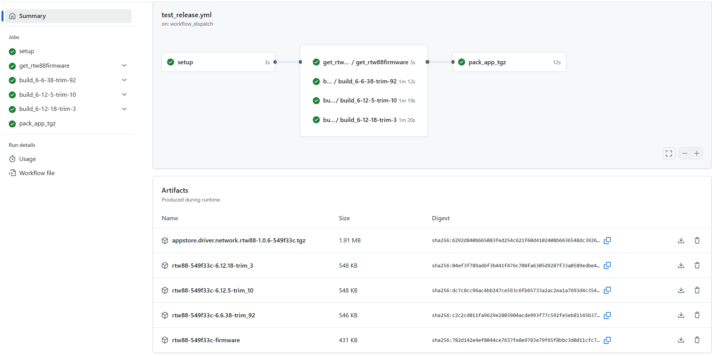
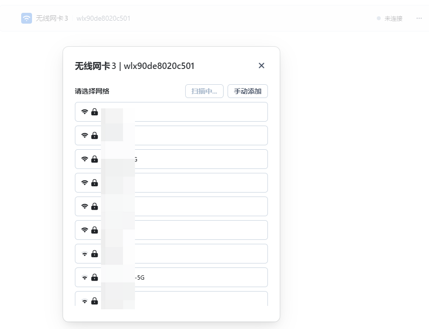
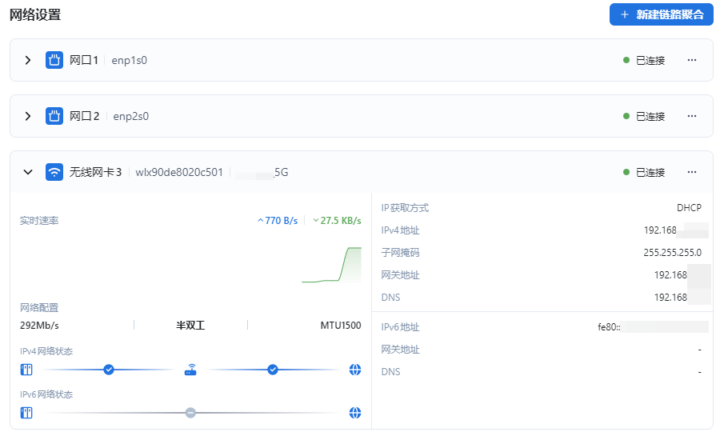

# 为x86_64版本飞牛OS构建rtw88无线驱动_1

# 前言
其实这个事情，有手就行，资深的Linux用户估计已经玩烂了  
但飞牛这东西吧，有一点自己的怪癖，因此在探路过程中发现一些坑  
比如说飞牛在更新时有时会将/lib/modules/*/updates整个移除之类的  
比如说如果在飞牛系统内直接安装构建依赖会导致后续系统更新失败之类的  
本篇抛砖引玉希望能探索出一个最佳实践  

本例会提供一个github action脚本作为集成的例子  
不过github action这东西属于是会用的人会用，不会用的人一头乱麻  
可以去抄下其他项目的git action，本文不会过多讲述这东西的使用

本篇为驱动构建的第一篇，主要以rtw88驱动为例讲述构建部分  
应用打包部分会在下篇说明  
Broadcom这种以deb包形式分发的，以及nvidia grid这种包括大量用户空间工具库的  
柿子挑软的捏，那些在后续构建篇章再说

你都自行构建驱动了，我可以认为你有相应知识，也具备自行收拾残局的能力  
不能自己解决的建议给大佬们寄送设备，然后等大佬发力  

# 省流
如果看完下面这一行你已经知道是什么东西了，那你可以直接关闭本页  
将驱动构建移入docker中避免污染，并使用github action进行编译集成

# 探索官方驱动(本节不发，写了也没人看，干脆别写)
在构建rtw88驱动之前，应用商店内实际存在两个驱动  
分别是皮蛋熊的dg1驱动，以及nvidia显卡的R560驱动  
通过解包Nvidia-Driver-560-1.0.13-tpk及intel_i915_dg1两个包  
我们不妨发现飞牛最早上架的两个驱动，均通过安装deb包将文件直接释放至指定目录  
dg1驱动将驱动本体、固件分为多个包，nvidia驱动则是全部打包在一起  
## main
```shell
SVC_SETUP=$(dirname $0)"/service-setup"
if [ -r "${SVC_SETUP}" ]; then
    . "${SVC_SETUP}"
fi
```
## intel_i915_dg1\cmd\service-setup
```shell
FRIMWARE_PATH="${TRIM_APPDEST}/i915-firmware-trim-1.0.0.deb"
MOD_PATH="${TRIM_APPDEST}/intel-i915-v3.deb"


service_postinst ()
{
	dpkg  -i $FRIMWARE_PATH >> $LOG_FILE 2>&1
	dpkg  -i $MOD_PATH >> $LOG_FILE 2>&1
}
```
## Nvidia-Driver-560-1.0.13\cmd\service-setup
```shell
### Generic variables and functions
### -------------------------------

### Package specific variables and functions
### ----------------------------------------


DEB_PATH="${TRIM_APPDEST}/nvidia-driver-trim.560.28.03.deb"

service_postinst ()
{
	dpkg --force-overwrite -i $DEB_PATH >> $LOG_FILE 2>&1
}
```

# 准备构建环境
飞牛目前x86_64的内核版本仅有以下几个  
`"6.6.38-trim" "6.12.5-trim" "6.12.18-trim"`  
如果需要完全兼容所有飞牛设备，驱动需要在这几个版本上进行构建  
在github的action中构建时若每次都将依赖装一遍，就显得十分蠢  
如果依赖的包不见了，那就直接成小丑了  
准备一个docker镜像是最方便的  

至于为什么不将全部需要的依赖打成一个镜像，然后编译时指定版本  
那我只能说你愿意去改第三方驱动那些makefile，或者是重打包dpkg安装的dkms驱动  
你喜欢就好，到时候一堆版本你不做CI，断手了别叫  

以下的基础镜像集成了构建驱动需要的依赖，当然这个还是缺点东西，发现了再补就是  
构建本文提到的驱动肯定是够用的  
## 基础镜像
```dockerfile
FROM debian:bookworm-20250224

LABEL GreenDamTan="GreenDamTan"
LABEL maintainer="github.com/GreenDamTan"
LABEL git="github.com/GreenDamTan/DockerFile"

ENV DEBIAN_FRONTEND=noninteractive
ENV container=docker

RUN echo 'APT::Install-Recommends "0";' >> /etc/apt/apt.conf.d/00-custom && \
    echo 'APT::Install-Suggests "0";' >> /etc/apt/apt.conf.d/00-custom

RUN sed -i 's/deb.debian.org/mirrors.ustc.edu.cn/g' /etc/apt/sources.list.d/debian.sources &&\
    sed -i 's|security.debian.org/debian-security|mirrors.ustc.edu.cn/debian-security|g' /etc/apt/sources.list.d/debian.sources &&\
    echo "root:root"|chpasswd && \
    apt-get update &&\
    apt-get install -y --no-install-recommends ca-certificates apt-utils &&\
    apt-get clean &&\
    sed -i 's/http:/https:/g' /etc/apt/sources.list.d/debian.sources &&\
    apt-get update &&\
    apt-get clean &&\
    rm -rf /var/lib/apt/lists/*

RUN apt-get update &&\
    apt-get install -y --no-install-recommends wget curl screen vim busybox pciutils git python3 &&\
    apt-get install -y dkms build-essential libelf-dev bc cpio libpopt0 rsync bison flex dwarves ruby libncurses-dev libssl-dev lzma devscripts debhelper dh-dkms &&\
    apt-get install -y libncurses5-dev libncursesw5-dev &&\
    busybox --install &&\
    update-pciids &&\
    apt-get clean &&\
    rm -rf /var/lib/apt/lists/*
```
## 假uname脚本
```shell
#!/bin/bash
case $1 in
-r)
        echo "$(echo "$fake_uname_a" | sed -E 's/^[^ ]+ [^ ]+ ([^ ]+) .*/\1/')"
;;
-a)
        echo "$fake_uname_a"
;;
-v)
        echo "$(echo "$fake_uname_a" | sed -E 's/^[^ ]+ [^ ]+ [^ ]+ (.*)/\1/')"
;;
-m)
        echo x86_64
;;
-p)
	echo x86_64
;;
-i)
	echo x86_64
;;
-s)
	echo Linux
;;
-o)
	echo "GNU/Linux"
;;
-n)
	hostname
;;
esac

if [ -z $1 ]; then
	echo Linux
fi
```
## 6.6.38-trim#92.dockerfile
```dockerfile
FROM makedie/fnos:kernHead-baseEnv

RUN PKG=linux-headers-6.6.38-trim_6.6.38-trim-92_amd64.deb &&\
    wget https://download.liveupdate.fnnas.com/x86_64/kernel/${PKG} &&\
    dpkg -i --force-all ${PKG} &&\
    rm -f ${PKG}

ENV fake_uname_a="Linux 6-6-38-trim-92 6.6.38-trim #92 SMP PREEMPT_DYNAMIC Tue Mar 11 17:22:50 CST 2025 x86_64 GNU/Linux"
COPY script/uname /tmp
RUN mv -f /tmp/uname /usr/bin/uname && \
    chmod a+x /usr/bin/uname &&\
    uname -r &&\
    uname -v &&\
    uname -a
```
## 6.12.5-trim#10.dockerfile
```dockerfile
FROM makedie/fnos:kernHead-baseEnv

RUN PKG=linux-headers-6.12.5-trim_6.12.5-trim-10_amd64.deb &&\
    wget https://download.liveupdate.fnnas.com/x86_64/kernel/${PKG} &&\
    dpkg -i --force-all ${PKG} &&\
    rm -f ${PKG}

ENV fake_uname_a="Linux kerl-6-12-5-10 6.12.5-trim #10 SMP PREEMPT_DYNAMIC Tue Mar 11 18:01:25 CST 2025 x86_64 GNU/Linux"
COPY script/uname /tmp
RUN mv -f /tmp/uname /usr/bin/uname && \
    chmod a+x /usr/bin/uname &&\
    uname -r &&\
    uname -v &&\
    uname -a
```
## 6.12.18-trim#3.dockerfile
这个6.12.18-trim#3版本的deb包内，缺一个.config文件  
构建诸如iwlwifi之类的驱动会报错，但rtw88不会，需要用到的时候再说  
```dockerfile
FROM makedie/fnos:kernHead-baseEnv

RUN PKG=linux-headers-6.12.18-trim_6.12.18-trim-3_amd64.deb &&\
    wget https://download.liveupdate.fnnas.com/x86_64/kernel/${PKG} &&\
    dpkg -i --force-all ${PKG} &&\
    rm -f ${PKG}

ENV fake_uname_a="Linux fake-env 6.12.18-trim #3 SMP PREEMPT_DYNAMIC Fri Mar 14 18:19:59 CST 2025 x86_64 GNU/Linux"
COPY script/uname /tmp
RUN mv -f /tmp/uname /usr/bin/uname && \
    chmod a+x /usr/bin/uname &&\
    uname -r &&\
    uname -v &&\
    uname -a
```

# 构建rtw88驱动
这个驱动项目地址在这里  
https://github.com/lwfinger/rtw88  
驱动包括内核模块源码及firmware  
只需要写个脚本，把固件下载打包好，再把内核模块构建并打包好就行  
直接搞个github action用起来是十分甚至九分的方便  

## 获取firmware
直接`git clone https://github.com/lwfinger/rtw88` 然后再将firmware内文件拷出来就行  
对应的git action节选就是  
```shell
jobs:
  get_rtw88firmware:
    runs-on: ubuntu-latest
    steps:
      - name: Check out repository code
        run: |
          git clone https://github.com/lwfinger/rtw88
          cd rtw88 && git reset --hard ${{ inputs.rtw88_commit_sha }}
      - name: upload firmware
        uses: actions/upload-artifact@master
        with:
          name: ${{ inputs.proj_name }}-${{ inputs.rtw88_commit_sha }}-firmware
          path: rtw88/firmware
```
## 构建驱动模块
因为先前已经构建好带环境的docker容器  
只需要使用对应docker，直接把项目clone下来，然后build就行  
手动进行构建就是在容器内执行如下命令，记得将容器内文件夹映射出来  
```shell
git clone https://github.com/lwfinger/rtw88
cd rtw88 && make -j`nproc`
```

以kernel-6.12.18-trim-3.yml为例，写成git action可以参考如下yaml  
```yaml
jobs:
  build_6-12-18-trim-3:
    runs-on: ubuntu-latest
    container:
      image: makedie/fnos:kernHead-6.12.18-trim-3
      options: -v ${{ github.workspace }}:${{ github.workspace }}
    env:
      kernel_name: "6.12.18-trim_3"
    steps:
      - name: Check out repository code
        run: |
          git clone https://github.com/lwfinger/rtw88
          cd rtw88 && git reset --hard ${{ inputs.rtw88_commit_sha }}
      - name: build ko
        run: |
          cd rtw88 && make -j`nproc`
      - name: copy ko
        run: |
          mkdir -p upload/${{ inputs.proj_name }}_${{ env.kernel_name }}
          cp rtw88/*.ko upload/${{ inputs.proj_name }}_${{ env.kernel_name }}/
      - name: upload ko
        uses: actions/upload-artifact@master
        with:
          name: ${{ inputs.proj_name }}-${{ inputs.rtw88_commit_sha }}-${{ env.kernel_name }}
          path: upload
```

# 手动部署
## firmware
安装驱动时想个办法将firmware文件夹内的固件文件，全部丢到`/usr/lib/firmware/rtw88`目录下就OK  
对应安装脚本部分就是  
```shell
rtw88_firmware_dir="/usr/lib/firmware/rtw88"
    mkdir -p ${rtw88_firmware_dir}
    cp -rf ${PACKAGE_BASE}/app/rtw88firmware/* ${rtw88_firmware_dir}/
```
## kernel module
在容器外，将ko文件丢过去  
如果需要判断多个版本，选择丢哪些文件，可以用shell写个case判断  
然后在应用启动的时候把文件丢过去再拉起来，就可以有效解决系统更新删驱动的问题  
只要版本对得上，就不会有什么问题  
手动部署大概脚本如下  
```shell
mkdir -p /lib/modules/`uname -r`/updates/dkms/rtw88
cp rtw88/*.ko /lib/modules/`uname -r`/updates/dkms/rtw88/
depmod
```

# 验证
重启后，把USB网卡插进去，看一眼驱动加载情况  
```shell
modprob -D rtw_8812au
```  
```text
root@fnos:~# modprobe -D rtw_8812au
insmod /lib/modules/6.12.18-trim/kernel/drivers/usb/common/usb-common.ko 
insmod /lib/modules/6.12.18-trim/kernel/drivers/usb/core/usbcore.ko 
insmod /lib/modules/6.12.18-trim/kernel/net/rfkill/rfkill.ko 
insmod /lib/modules/6.12.18-trim/kernel/net/wireless/cfg80211.ko 
insmod /lib/modules/6.12.18-trim/kernel/lib/crypto/libarc4.ko 
insmod /lib/modules/6.12.18-trim/kernel/net/mac80211/mac80211.ko 
insmod /lib/modules/6.12.18-trim/updates/dkms/rtw88/rtw_core.ko 
insmod /lib/modules/6.12.18-trim/updates/dkms/rtw88/rtw_usb.ko 
insmod /lib/modules/6.12.18-trim/updates/dkms/rtw88/rtw_88xxa.ko 
insmod /lib/modules/6.12.18-trim/updates/dkms/rtw88/rtw_8812a.ko 
insmod /lib/modules/6.12.18-trim/updates/dkms/rtw88/rtw_8812au.ko
```  
再把网卡插入，康康内核日志  
```shell
dmesg
```  
```text
[323016.495221] usb 3-3: new high-speed USB device number 3 using xhci_hcd
[323016.631569] usb 3-3: New USB device found, idVendor=0bda, idProduct=1a2b, bcdDevice= 2.00
[323016.631574] usb 3-3: New USB device strings: Mfr=1, Product=2, SerialNumber=0
[323016.631575] usb 3-3: Product: DISK
[323016.631576] usb 3-3: Manufacturer: Realtek
[323016.632712] usb-storage 3-3:1.0: USB Mass Storage device detected
[323016.632988] scsi host5: usb-storage 3-3:1.0
[323017.251912] usb 3-3: USB disconnect, device number 3
[323017.627242] usb 3-3: new high-speed USB device number 4 using xhci_hcd
[323017.763628] usb 3-3: New USB device found, idVendor=0bda, idProduct=c811, bcdDevice= 2.00
[323017.763632] usb 3-3: New USB device strings: Mfr=1, Product=2, SerialNumber=3
[323017.763634] usb 3-3: Product: 802.11ac NIC
[323017.763635] usb 3-3: Manufacturer: Realtek
[323017.763636] usb 3-3: SerialNumber: 123456
[323176.898013] cfg80211: Loading compiled-in X.509 certificates for regulatory database
[323176.911199] Loaded X.509 cert 'sforshee: 00b28ddf47aef9cea7'
[323176.911388] Loaded X.509 cert 'wens: 61c038651aabdcf94bd0ac7ff06c7248db18c600'
[323176.915589] cfg80211: loaded regulatory.db is malformed or signature is missing/invalid
[323176.971305] rtw_core: loading out-of-tree module taints kernel.
[323176.979237] usbcore: registered new interface driver rtw_8812au
[323287.431450] usb 3-3: USB disconnect, device number 4
[323288.575811] usb 3-3: new high-speed USB device number 5 using xhci_hcd
[323288.712159] usb 3-3: New USB device found, idVendor=0bda, idProduct=1a2b, bcdDevice= 2.00
[323288.712163] usb 3-3: New USB device strings: Mfr=1, Product=2, SerialNumber=0
[323288.712164] usb 3-3: Product: DISK
[323288.712165] usb 3-3: Manufacturer: Realtek
[323288.713267] usb-storage 3-3:1.0: USB Mass Storage device detected
[323288.713435] scsi host5: usb-storage 3-3:1.0
[323289.292430] usb 3-3: USB disconnect, device number 5
[323289.667842] usb 3-3: new high-speed USB device number 6 using xhci_hcd
[323289.804267] usb 3-3: New USB device found, idVendor=0bda, idProduct=c811, bcdDevice= 2.00
[323289.804271] usb 3-3: New USB device strings: Mfr=1, Product=2, SerialNumber=3
[323289.804273] usb 3-3: Product: 802.11ac NIC
[323289.804274] usb 3-3: Manufacturer: Realtek
[323289.804275] usb 3-3: SerialNumber: 123456
[323289.817349] rtw_8821cu 3-3:1.0: Firmware version 24.11.0, H2C version 12
[323289.963454] usbcore: registered new interface driver rtw_8821cu
[323289.968406] rtw_8821cu 3-3:1.0 wlx90de8020c501: renamed from wlan0
```

然后将WiFi连上看看能不能正常工作  
  

# 后续预告
这篇文章仅快速地讲述了构建部分  
剩余的应用中心打包，得等应用中心包写完了再写会更好点  

如何构建内核内已有但飞牛内核未构建的驱动(如binder，含lz4的zram)  
如何构建deb包安装的dkms驱动(如博通系列)  
如何构建打包含有大量库及工具的驱动(如nvidia显卡)  

以上这些东西会根据反馈，在后续更新时进行行文调整  
也希望有经验的人士提供一些指引与灵感