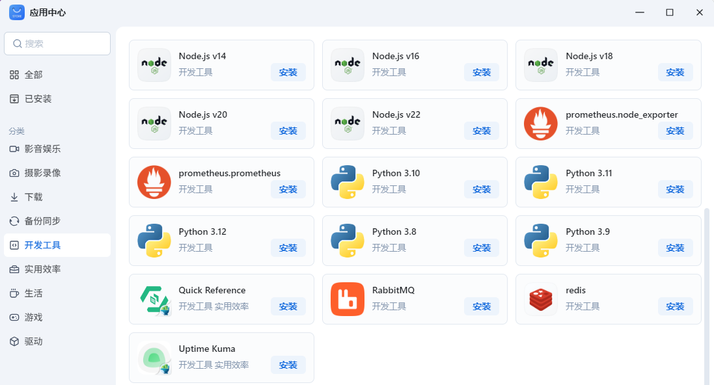
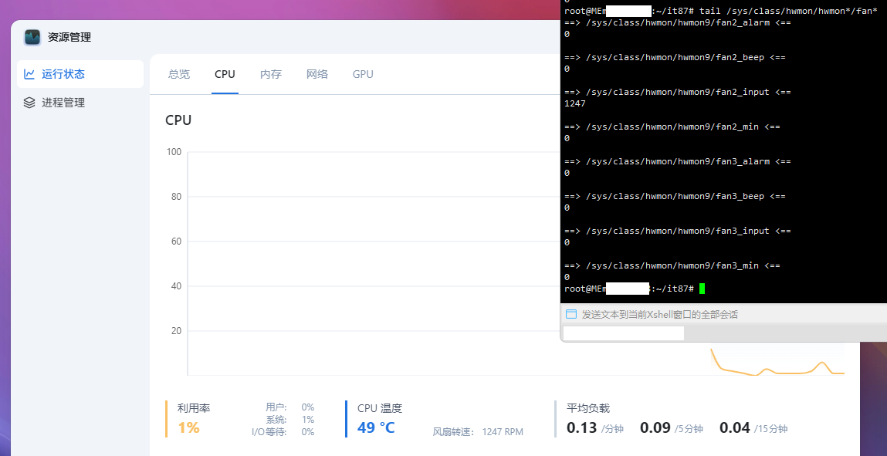
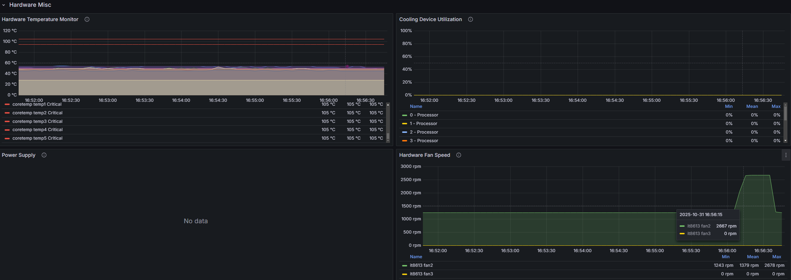

# 给飞牛OS编译it87驱动

# 前言
飞牛的硬件联盟中，有一款物理意义上炙手可热的产品  
它就是MEmini，它使用了ITE IT86系列的芯片  
但在飞牛系统中，没有集成该芯片的驱动，以至于在`/sys/class/hwmon`不能获取风扇转速等信息  
虽然在飞牛系统中的资源监控可以查看到CPU风扇转速，但资源监控不会保留历史记录  
在应用中心上架的普罗米修斯套装，可以弥补这一点，但它依赖hwmon获取硬件信息  
因此补足该驱动显得十分重要  


# 克隆驱动项目
直接从GitHub一把梭就完事了，这个仓库archlinux也在用  
https://aur.archlinux.org/packages/it87-dkms-git  
```shell
git clone https://github.com/frankcrawford/it87
```

# 构建驱动
本次构建，来点不一样的  
传统构建方式，需要在系统中使用`apt install`安装`dkms cmake gcc`等依赖  
但在飞牛系统中，对软件包进行任何操作都是高危行为，极有可能会导致后续系统更新失败，甚至会导致nas服务不可用  
额外开虚拟机进行编译成本较高，因此在docker中构建是一个好办法  
使用docker固定好构建环境也方便后续上CI  
## 拉取镜像
此处以飞牛的6.12.18版本内核为例  
```shell
docker pull docker.1ms.run/makedie/fnos:kernHead-6.12.18-trim-3
```  
使用以上命令拉取提前准备好的容器，该命令使用了1ms镜像，如果你的网络可以直接拉取，可以考虑不使用镜像  
```text
root@MEmini-2CC8:~/it87# docker pull docker.1ms.run/makedie/fnos:kernHead-6.12.18-trim-3
kernHead-6.12.18-trim-3: Pulling from makedie/fnos
155ad54a8b28: Pull complete 
c718e0133362: Pull complete 
bc4d23c514ac: Pull complete 
c0ff601b77ba: Pull complete 
069e2ca7137c: Pull complete 
e1ae79da3633: Pull complete 
c6d9c0f84d0c: Pull complete 
Digest: sha256:5d83a8fb52dcc3a3c9df47ac66f4dc4944464a6a5160c8c82738ef07ce44d582
Status: Downloaded newer image for docker.1ms.run/makedie/fnos:kernHead-6.12.18-trim-3
docker.1ms.run/makedie/fnos:kernHead-6.12.18-trim-3
```

## 构建驱动
构建驱动时，需要确保驱动源码已经下载完成  
构建时切换至驱动源码所在目录，后使用如下命令进行构建  
因为这个驱动够小所以不需要开多核心编译  
```shell
docker run --rm -v ${PWD}/:/workspace docker.1ms.run/makedie/fnos:kernHead-6.12.18-trim-3 bash -c "cd workspace && make"
```  
等待构建完成即可  
```text
root@MEmini-2CC8:~/it87# ls
 compat.h   debian   dkms.conf   dkms-install.sh   dkms-remove.sh   ISSUES   it87-517.patch   it87.c   it87-roeck.patch   Makefile   README   Research  'Sensors configs'
root@MEmini-2CC8:~/it87# docker run --rm -v ${PWD}/:/workspace docker.1ms.run/makedie/fnos:kernHead-6.12.18-trim-3 bash -c "cd workspace && make"
warning: the compiler differs from the one used to build the kernel
  The kernel was built by: gcc (Debian 12.2.0-14) 12.2.0
  You are using:           gcc (Debian 12.2.0-14+deb12u1) 12.2.0
  CC [M]  /workspace/it87.o
  MODPOST /workspace/Module.symvers
  CC [M]  /workspace/it87.mod.o
  CC [M]  /workspace/.module-common.o
  LD [M]  /workspace/it87.ko

```

# 加载驱动
该驱动依赖hwmon_vid驱动，需要提前加载  
```text
root@MEmini-2CC8:~/it87# modprobe -D hwmon-vid 
insmod /lib/modules/6.12.18-trim/kernel/drivers/hwmon/hwmon-vid.ko 
root@MEmini-2CC8:~/it87# modprobe -v hwmon_vid
insmod /lib/modules/6.12.18-trim/kernel/drivers/hwmon/hwmon-vid.ko 
```  
然后使用`insmod it87.ko`加载构建好的驱动文件  
```text
root@MEmini-2CC8:~/it87# insmod it87.ko
root@MEmini-2CC8:~/it87# dmesg |grep it87
[778885.317294] it87: it87 driver version v1.0-204-g60d9def.20251006
[778885.317536] it87: Found IT8613E chip at 0xa30, revision 12
[778885.317601] it87: Beeping is supported
```

# 检查传感器
我们的目标很明确，就是获取之前获取不到的风扇数据  
因此简单的使用下面的命令找找看风扇相关的东西，就知道哪个是IT8613E的数据了  
```shell
ls /sys/class/hwmon/hwmon*/fan*_input
```  
可见hwmon9就是我们的目标  
```text
root@MEmini-2CC8:~/it87# ls /sys/class/hwmon/hwmon*/fan*_input
/sys/class/hwmon/hwmon9/fan2_input  /sys/class/hwmon/hwmon9/fan3_input
root@MEmini-2CC8:~/it87# tail /sys/class/hwmon/hwmon*/fan*_input
==> /sys/class/hwmon/hwmon9/fan2_input <==
1271

==> /sys/class/hwmon/hwmon9/fan3_input <==
0
```  
再结合飞牛的资源监控看一眼，可见fan2_input就是我们的CPU风扇转速了  


## 看看都有什么数据
使用`tail /sys/class/hwmon/hwmon9/*`看看  
似乎还有电流之类的其他数据，不过我不关心这些  
有需要的人可以自己加点监控  
```text
root@MEmini-2CC8:~/it87# tail /sys/class/hwmon/hwmon9/*
==> /sys/class/hwmon/hwmon9/alarms <==
16

==> /sys/class/hwmon/hwmon9/device <==
tail: error reading '/sys/class/hwmon/hwmon9/device': Is a directory

==> /sys/class/hwmon/hwmon9/fan2_alarm <==
0

==> /sys/class/hwmon/hwmon9/fan2_beep <==
0

==> /sys/class/hwmon/hwmon9/fan2_input <==
1250

==> /sys/class/hwmon/hwmon9/fan2_min <==
0

==> /sys/class/hwmon/hwmon9/fan3_alarm <==
0

==> /sys/class/hwmon/hwmon9/fan3_beep <==
0

==> /sys/class/hwmon/hwmon9/fan3_input <==
0

==> /sys/class/hwmon/hwmon9/fan3_min <==
0

==> /sys/class/hwmon/hwmon9/in0_alarm <==
0

==> /sys/class/hwmon/hwmon9/in0_beep <==
0

==> /sys/class/hwmon/hwmon9/in0_input <==
726

==> /sys/class/hwmon/hwmon9/in0_max <==
2805

==> /sys/class/hwmon/hwmon9/in0_min <==
0

==> /sys/class/hwmon/hwmon9/in1_alarm <==
0

==> /sys/class/hwmon/hwmon9/in1_beep <==
0

==> /sys/class/hwmon/hwmon9/in1_input <==
1111

==> /sys/class/hwmon/hwmon9/in1_max <==
2805

==> /sys/class/hwmon/hwmon9/in1_min <==
0

==> /sys/class/hwmon/hwmon9/in2_alarm <==
0

==> /sys/class/hwmon/hwmon9/in2_beep <==
0

==> /sys/class/hwmon/hwmon9/in2_input <==
2530

==> /sys/class/hwmon/hwmon9/in2_max <==
2805

==> /sys/class/hwmon/hwmon9/in2_min <==
0

==> /sys/class/hwmon/hwmon9/in4_alarm <==
0

==> /sys/class/hwmon/hwmon9/in4_beep <==
0

==> /sys/class/hwmon/hwmon9/in4_input <==
2541

==> /sys/class/hwmon/hwmon9/in4_max <==
2805

==> /sys/class/hwmon/hwmon9/in4_min <==
0

==> /sys/class/hwmon/hwmon9/in5_alarm <==
0

==> /sys/class/hwmon/hwmon9/in5_beep <==
0

==> /sys/class/hwmon/hwmon9/in5_input <==
2530

==> /sys/class/hwmon/hwmon9/in5_max <==
2805

==> /sys/class/hwmon/hwmon9/in5_min <==
0

==> /sys/class/hwmon/hwmon9/in7_alarm <==
0

==> /sys/class/hwmon/hwmon9/in7_beep <==
0

==> /sys/class/hwmon/hwmon9/in7_input <==
3520

==> /sys/class/hwmon/hwmon9/in7_label <==
3VSB

==> /sys/class/hwmon/hwmon9/in7_max <==
5610

==> /sys/class/hwmon/hwmon9/in7_min <==
0

==> /sys/class/hwmon/hwmon9/in8_input <==
3124

==> /sys/class/hwmon/hwmon9/in8_label <==
Vbat

==> /sys/class/hwmon/hwmon9/in9_input <==
3256

==> /sys/class/hwmon/hwmon9/in9_label <==
+3.3V

==> /sys/class/hwmon/hwmon9/intrusion0_alarm <==
1

==> /sys/class/hwmon/hwmon9/name <==
it8613

==> /sys/class/hwmon/hwmon9/power <==
tail: error reading '/sys/class/hwmon/hwmon9/power': Is a directory

==> /sys/class/hwmon/hwmon9/pwm2 <==
80

==> /sys/class/hwmon/hwmon9/pwm2_auto_channels_temp <==
1

==> /sys/class/hwmon/hwmon9/pwm2_auto_point1_temp <==
30000

==> /sys/class/hwmon/hwmon9/pwm2_auto_point1_temp_hyst <==
26000

==> /sys/class/hwmon/hwmon9/pwm2_auto_point2_temp <==
35000

==> /sys/class/hwmon/hwmon9/pwm2_auto_point3_temp <==
60000

==> /sys/class/hwmon/hwmon9/pwm2_auto_slope <==
16

==> /sys/class/hwmon/hwmon9/pwm2_auto_start <==
80

==> /sys/class/hwmon/hwmon9/pwm2_enable <==
2

==> /sys/class/hwmon/hwmon9/pwm2_freq <==
23437

==> /sys/class/hwmon/hwmon9/pwm3 <==
90

==> /sys/class/hwmon/hwmon9/pwm3_auto_channels_temp <==
2

==> /sys/class/hwmon/hwmon9/pwm3_auto_point1_temp <==
25000

==> /sys/class/hwmon/hwmon9/pwm3_auto_point1_temp_hyst <==
25000

==> /sys/class/hwmon/hwmon9/pwm3_auto_point2_temp <==
45000

==> /sys/class/hwmon/hwmon9/pwm3_auto_point3_temp <==
70000

==> /sys/class/hwmon/hwmon9/pwm3_auto_slope <==
16

==> /sys/class/hwmon/hwmon9/pwm3_auto_start <==
90

==> /sys/class/hwmon/hwmon9/pwm3_enable <==
2

==> /sys/class/hwmon/hwmon9/pwm3_freq <==
23437

==> /sys/class/hwmon/hwmon9/pwm5 <==
127

==> /sys/class/hwmon/hwmon9/pwm5_auto_channels_temp <==
1

==> /sys/class/hwmon/hwmon9/pwm5_auto_point1_temp <==
25000

==> /sys/class/hwmon/hwmon9/pwm5_auto_point1_temp_hyst <==
25000

==> /sys/class/hwmon/hwmon9/pwm5_auto_point2_temp <==
45000

==> /sys/class/hwmon/hwmon9/pwm5_auto_point3_temp <==
70000

==> /sys/class/hwmon/hwmon9/pwm5_auto_slope <==
0

==> /sys/class/hwmon/hwmon9/pwm5_enable <==
1

==> /sys/class/hwmon/hwmon9/pwm5_freq <==
23437

==> /sys/class/hwmon/hwmon9/subsystem <==
tail: error reading '/sys/class/hwmon/hwmon9/subsystem': Is a directory

==> /sys/class/hwmon/hwmon9/temp1_alarm <==
0

==> /sys/class/hwmon/hwmon9/temp1_beep <==
0

==> /sys/class/hwmon/hwmon9/temp1_input <==
46000

==> /sys/class/hwmon/hwmon9/temp1_max <==
127000

==> /sys/class/hwmon/hwmon9/temp1_min <==
-128000

==> /sys/class/hwmon/hwmon9/temp1_offset <==
99000

==> /sys/class/hwmon/hwmon9/temp1_type <==
4

==> /sys/class/hwmon/hwmon9/temp2_alarm <==
0

==> /sys/class/hwmon/hwmon9/temp2_beep <==
0

==> /sys/class/hwmon/hwmon9/temp2_input <==
55000

==> /sys/class/hwmon/hwmon9/temp2_max <==
127000

==> /sys/class/hwmon/hwmon9/temp2_min <==
-128000

==> /sys/class/hwmon/hwmon9/temp2_offset <==
0

==> /sys/class/hwmon/hwmon9/temp2_type <==
4

==> /sys/class/hwmon/hwmon9/temp3_alarm <==
0

==> /sys/class/hwmon/hwmon9/temp3_beep <==
0

==> /sys/class/hwmon/hwmon9/temp3_input <==
55000

==> /sys/class/hwmon/hwmon9/temp3_max <==
127000

==> /sys/class/hwmon/hwmon9/temp3_min <==
-128000

==> /sys/class/hwmon/hwmon9/temp3_offset <==
0

==> /sys/class/hwmon/hwmon9/uevent <=
```

# 持久化
驱动如果只是编译后用insmod加载，在下一次系统重启后将会失效  
如有需要，则需要将该驱动模块丢到如下目录，并刷新模块相关信息  
飞牛更新内核时，也需要重新丢一次  
```text
root@MEmini-2CC8:~/it87# mkdir -p /lib/modules/6.12.18-trim/updates/dkms/it87
root@MEmini-2CC8:~/it87# cp it87.ko /lib/modules/6.12.18-trim/updates/dkms/it87/
root@MEmini-2CC8:~/it87# depmod -a
root@MEmini-2CC8:~/it87# modprobe -D it87
insmod /lib/modules/6.12.18-trim/kernel/drivers/hwmon/hwmon-vid.ko 
insmod /lib/modules/6.12.18-trim/updates/dkms/it87/it87.ko
```

# 结束语
一顿操作猛如虎，终于可以看见并记录风扇转速了  
配合上自己写的风扇控制程序，总算是压住这个暖手宝了  
不过这东西用的人应该不多，估计也没必要申请上应用中心  
