# 替换飞牛安装ISO镜像rootfs实现系统分区备份转移

# 前言
在使用飞牛一段时间后，可能会发现之前准备的系统盘过大，或者是准备的系统盘过小  
这个时候就想要替换系统盘  
而飞牛官方提供的备份与还原功能形同鸡肋，只能备份一些配置  
最重要的影视、相册以及其他应用没有提供转移方法  

系统迁移从小盘迁移至大盘，只需要dd一下，随后再把剩余空间分配一下就好  
但如果从大盘迁移至小盘，问题就多了  
如果是从传统启动的机器迁移至UEFI机器，或者是反过来，问题也是比较大的  

如果把飞牛安装时释放的系统，换成自己正在用的，想必是可以直接了断的解决问题的

本文使用的镜像为`fnos-1.0.0-1326.iso`  
其他版本镜像请自行调整  

# 观察ISO并注意到
观察并注意到，注意不到就是你注意力不集中
## trimfs.tgz
观察并注意到，显然这个文件就是安装时释放的rootfs
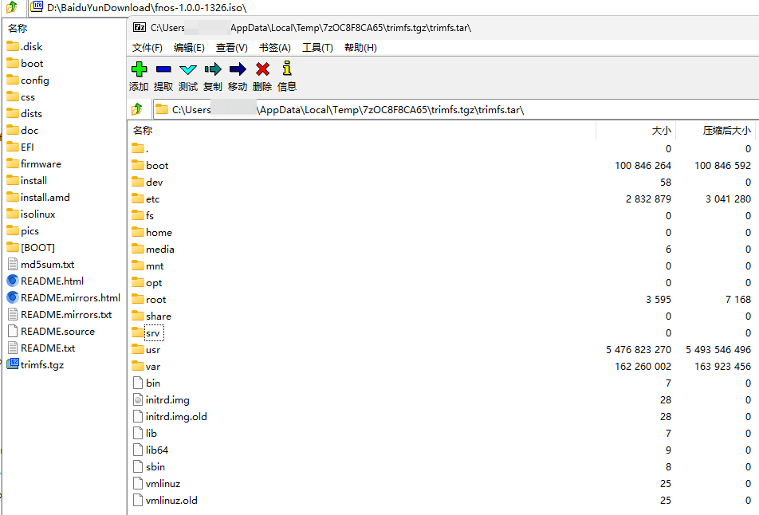
## config/trimfs.conf
观察并注意到，显然这个文件就是trimfs.tgz的信息
```text
trimfs_version=V1.0.0
trimfs_size=5807872000
trimfs_tgz_size=2163563334
```

# 在被迁移系统的操作
## 开启SSH
首先在系统设置里，把ssh开了  
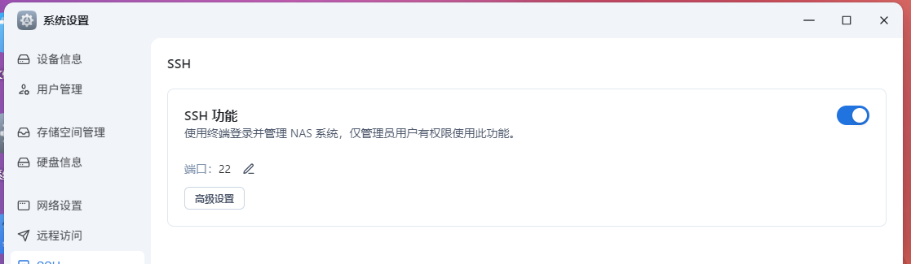
随后连上SSH，并切换到root权限  
```shell
Linux mov 6.12.18-trim #100008 SMP PREEMPT_DYNAMIC Fri Nov  7 15:07:53 CST 2025 x86_64
/usr/bin/xauth:  file /home/admin/.Xauthority does not exist
admin@mov:~$ sudo -i
[sudo] password for admin: 
root@mov:~# 
```
## 关闭swap
由于飞牛安装时，默认会开启swap  
如果迁移时带着swap文件迁移，那rootfs会比较大  
还是删了会比较好，而且飞牛的安装程序也会自己创建swap  

首先看看现在开启的swap状态  
```shell
root@mov:~# swapon -s
Filename				Type		Size		Used		Priority
/swapfile                               file		4194300		326632		-2
```

移除/etc/fstab中的swapfile挂载配置  
使用你喜欢的文本编辑器，把这行删了  
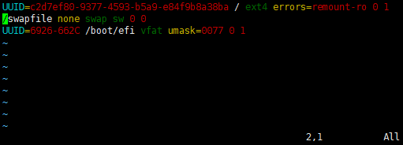

把swap关了，再把swapfile删了  
```shell
root@mov:~# swapoff /swapfile
root@mov:~# swapon -s
root@mov:~# rm /swapfile
```
观察swap状态  
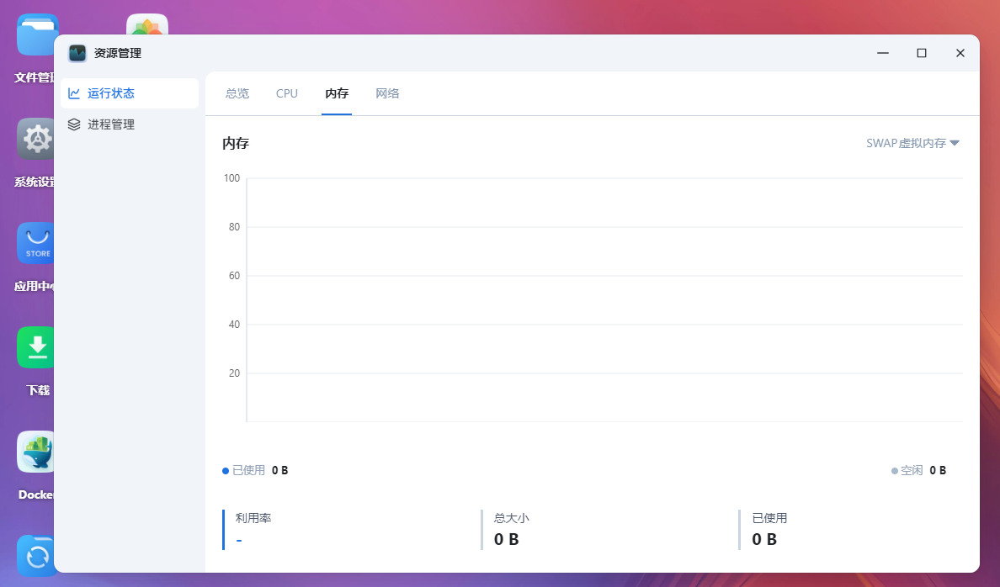

# 检查被迁移系统的数据
## 相册
先检查已有的人脸识别及智能搜索数据  
截图并记录  
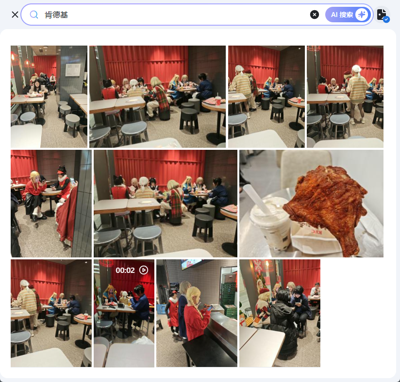


然后关掉AI，以免迁移后分不清数据是迁移前生成的还是迁移后的
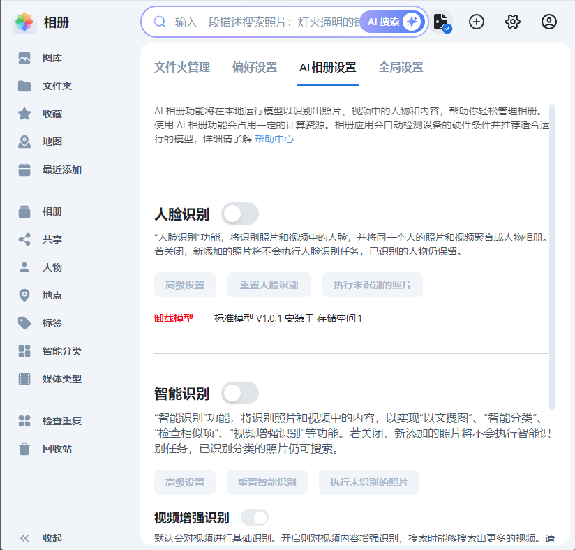
## 影视
截图并记录影视的刮削信息  

## 硬盘信息
这个是虚拟机，所以信息没什么用  
但如果是真机，截个图避免到时候拔错盘装错盘什么的  
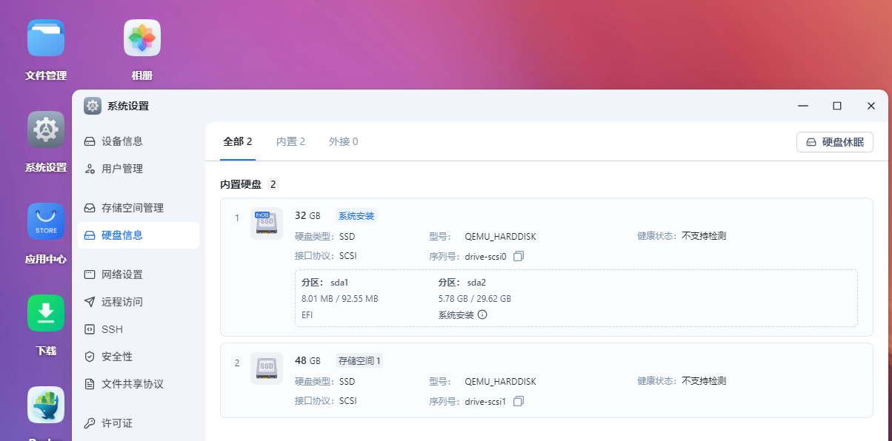

# 中间系统
中间系统可以选用之前的liveFNOS，或者是用U盘装一个临时用也行  
主要是飞牛系统会自动挂载，有webui，用起来十分的方便  

如果是使用liveFNOS，在内存引导飞牛系统后，webui展示硬盘信息为unknown为正常现象
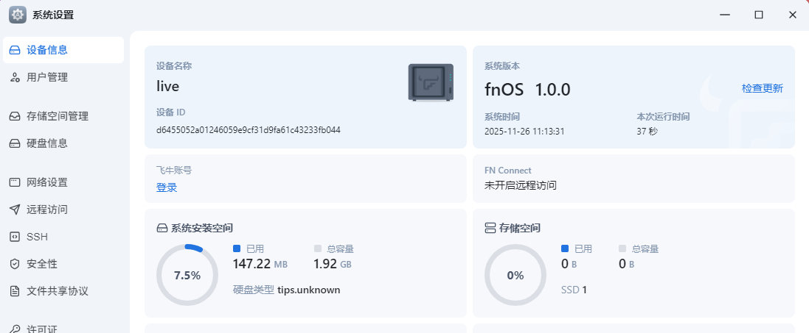

## 确认roofs
如图所示，飞牛会把被迁移系统的系统盘，自动挂载  
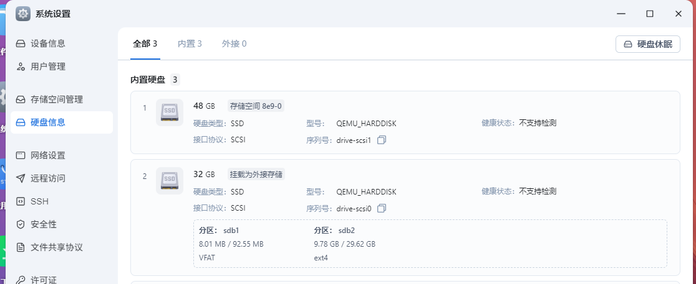

通过文件管理，可以很快地找到挂载目录  
实在不知道目录可以点一下右键菜单里的详细信息，再点一下复制原始路径  
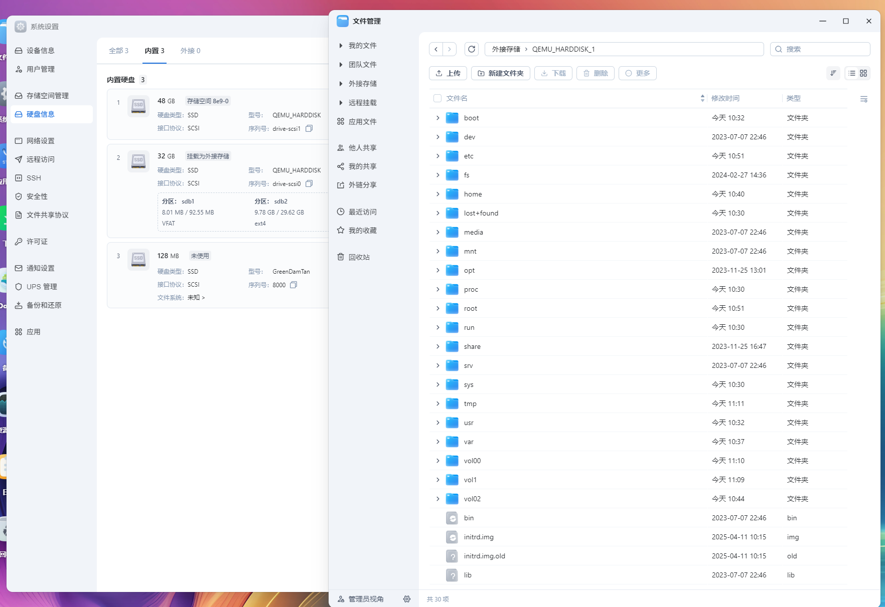

## 离线修改rootfs
此时可以cd到被迁移系统的rootfs中，进行修改  
假如之前没有删除swap挂载信息及swapfile，可以现在操作  
也可以往里面塞病毒与木马还有广告  
```shell
Linux live 6.12.18-trim #100008 SMP PREEMPT_DYNAMIC Fri Nov  7 15:07:53 CST 2025 x86_64
Could not chdir to home directory /home/admin: No such file or directory
admin@live:/$ sudo -i
[sudo] password for admin: 
root@live:~# cd /vol00/QEMU_HARDDISK_1/boot
root@live:/vol00/QEMU_HARDDISK_1/boot# cd ..
root@live:/vol00/QEMU_HARDDISK_1# ls
bin   dev  fs    initrd.img      lib    lost+found  mnt  proc  run   share  swapfile  tmp  var      vmlinuz.old  vol02
boot  etc  home  initrd.img.old  lib64  media       opt  root  sbin  srv    sys       usr  vmlinuz  vol00        vol1
root@live:/vol00/QEMU_HARDDISK_1# cp ./etc/fstab ./etc/fstab.bak
root@live:/vol00/QEMU_HARDDISK_1# rm swapfile 
```
## 打包rootfs
使用以下命令打包  
```shell
root@live:/vol00/QEMU_HARDDISK_1# tar zcvf /vol1/1000/trimfs.tgz *
```
这个打包目录你可以自己指定，怎么方便怎么来  
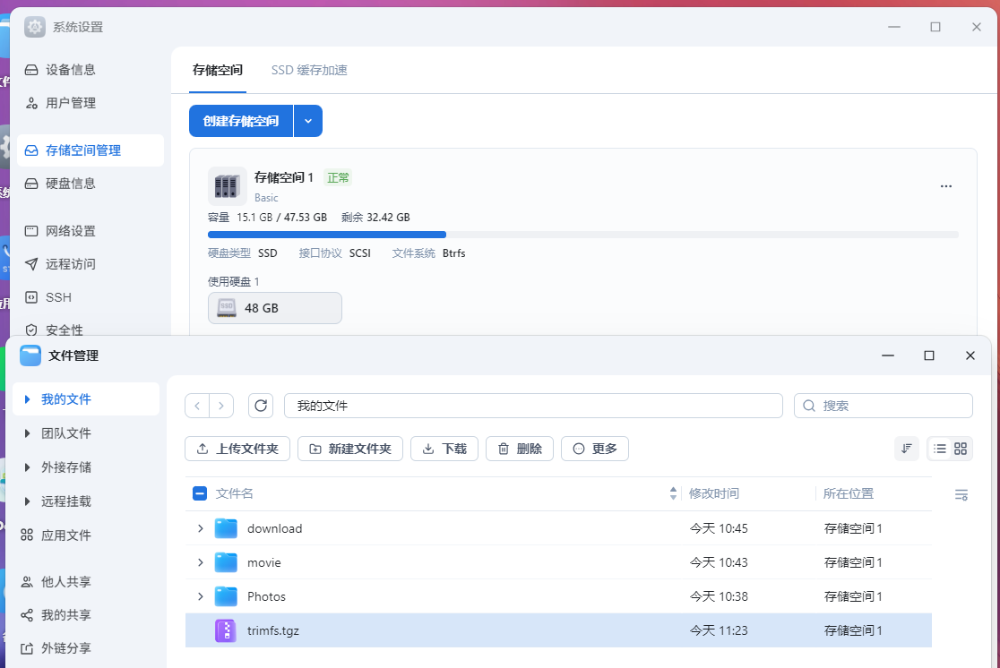

## 修改 config/trimfs.conf
如下获取以下这个trimfs.tgz包的信息
```shell
root@live:/vol00/QEMU_HARDDISK_1# gzip -l /vol1/1000/trimfs.tgz
         compressed        uncompressed  ratio uncompressed_name
         2251359286          6055188480  62.8% /vol1/1000/trimfs.tar
```

然后编辑系统安装镜像ISO包中的`config/trimfs.conf`文件
把原始内容  
```text
trimfs_version=V1.0.0
trimfs_size=5807872000
trimfs_tgz_size=2163563334
```
替换为  
```text
trimfs_version=V1.0.0
trimfs_size=6055188480
trimfs_tgz_size=2251359286
```

# 重打包ISO
这个没啥好说的，找个顺手的工具  
把两个文件`config/trimfs.conf`与`trimfs.tgz`给替换掉  
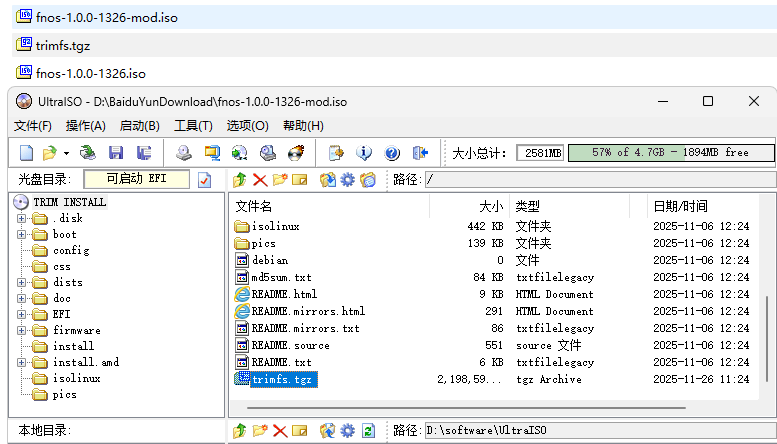

# 重新安装系统
如图所示，将系统重新安装在一块比原系统盘更小的硬盘上
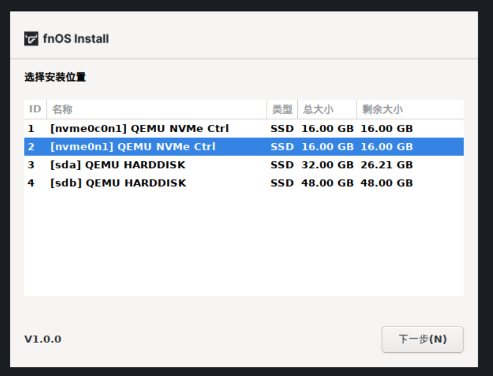

由于系统盘变小了swap就不使用默认值了  
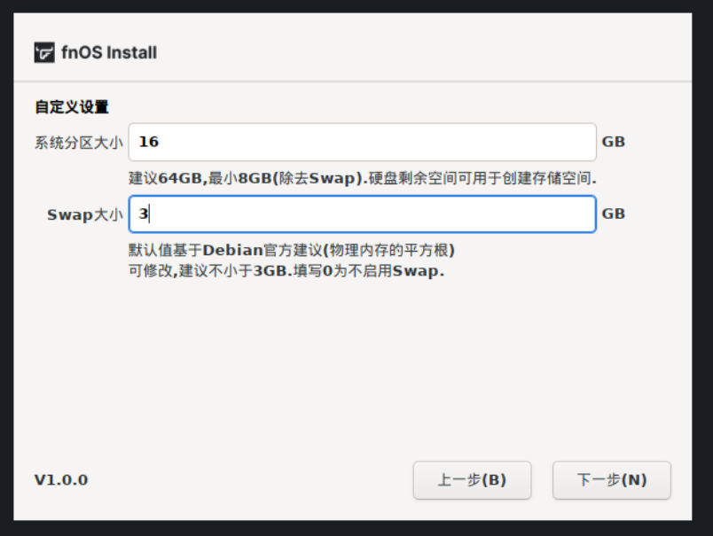

# 安装后验证
安装完毕后，挂载原存储空间即可进入验证阶段  
可以看见，系统安装完就有我们之前安装的影视及相册  
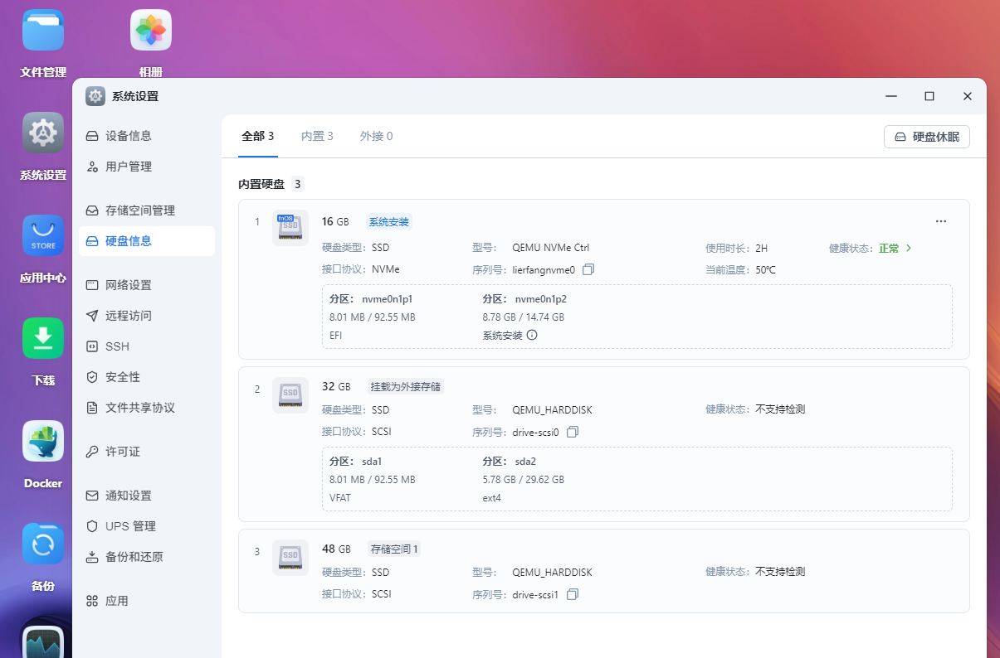

swap大小可见是我们安装时输入的大小  
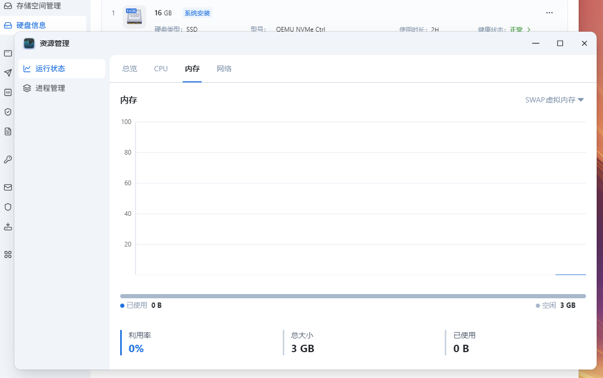

其余部分如相册及影视也可以自己对照截图再去看看，以验证迁移情况  
建议原系统盘保留至少一周，以备不时之需

# 结束语
如果不是用作迁移系统，而是直接修改rootfs插入广告或木马病毒，再把ISO分享出去，那会如何？