# zettos 1.3.1-alpha获取root shell

# 系统版本观察
系统版本为 zettos 1.3.1-alpha
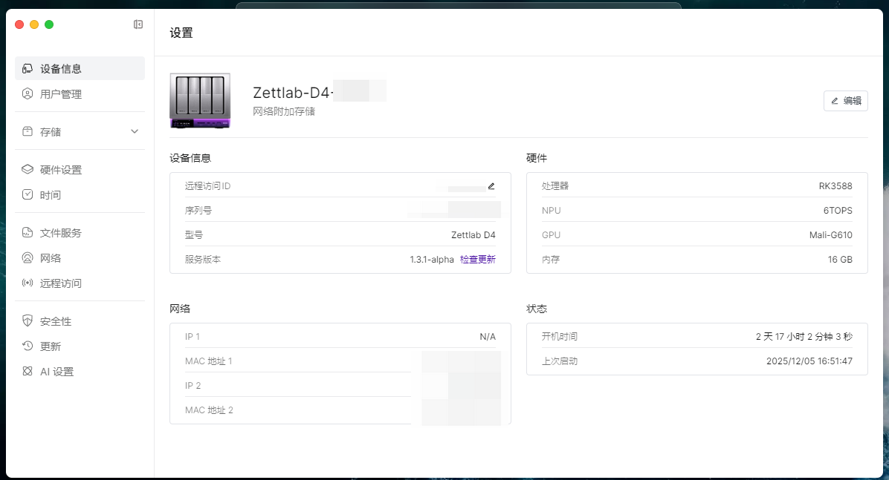

# 设置观察
设置内无SSH入口或SSH开关  
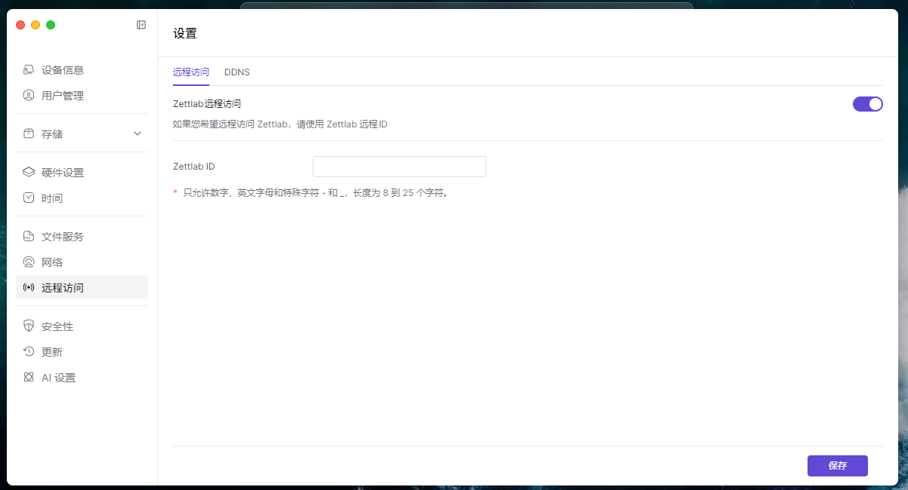

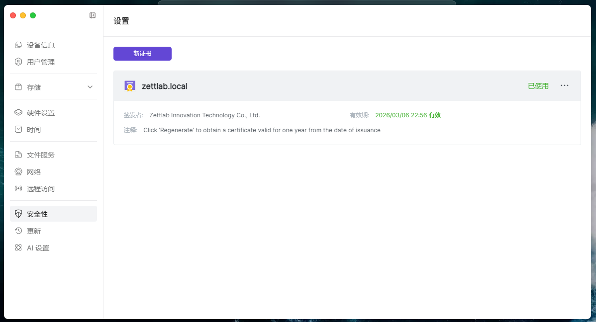

# 偷袭docker的privileged容器
准备一个arm的镜像，最好是自带远程shell的  
我熟PVE就用PVE，你喜欢openwrt那些也行  
```yaml
services:
  pve:
    image: makedie/proxmox_ve:pxvirt-8.4.10-arm64
    container_name: makedie_proxmox_ve
    tty: true
    environment:
      root_password: "root"
      port: 8006
    ports:
      - 8006:8006
    privileged: true
```

把这个compose拉起来  
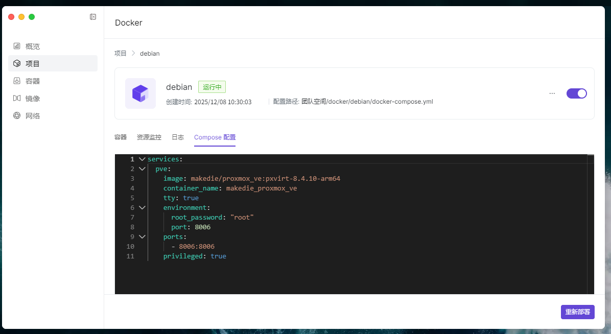

随后进入webshell，挂载/dev/mmcblk0p9  
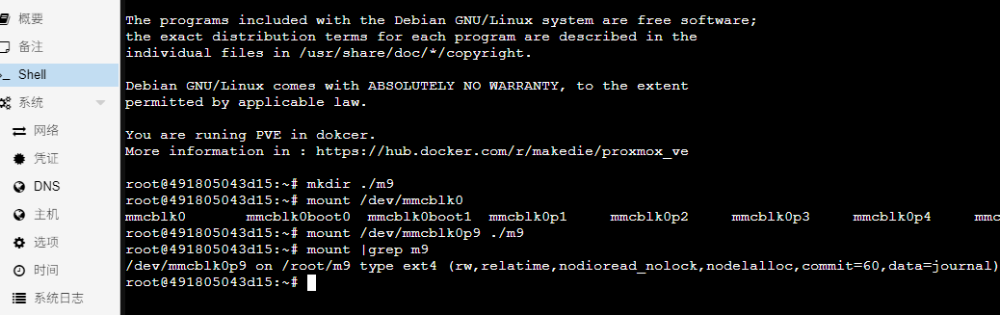

往挂载分区的./rw/zettos/emmc/bin/gotty 塞个gotty  
```text
root@491805043d15:~/m9/rw/zettos/emmc/bin# ls -la
total 606000
drwxr-xr-x  4 root root     4096 Dec  8 10:39 .
drwxr-xr-x 15 root root     4096 Dec  5 14:17 ..
-rwxr-xr-x  1 root root  8752488 Dec  5 16:48 gotty
drwxr-xr-x  2 root root     4096 Oct 31 21:33 nsq
drwxr-xr-x  2 root root     4096 Mar  6  2025 p2p
-rwxr-xr-x  1 root root    69696 Oct 24 12:35 zettaccel-cli
-rwxr-xr-x  1 root root  1076104 Oct 24 12:35 zettos-acceld
-rwxr-xr-x  1 root root 23265464 Oct 31 20:55 zettos-ai
-rwxr-xr-x  1 root root 29700936 Oct 31 20:58 zettos-ai-engine-go
-rwxr-xr-x  1 root root 94437560 Oct 31 20:55 zettos-app-store
-rwxr-xr-x  1 root root    23896 Oct 24 12:35 zettos-boot-upgrade
-rwxr-xr-x  1 root root 29588784 Oct 31 20:55 zettos-clip
-rwxr-xr-x  1 root root 20054200 Oct 31 20:58 zettos-creator-studio
-rwxr-xr-x  1 root root    89016 Oct 24 12:35 zettos-digest
-rwxr-xr-x  1 root root    27000 Oct 24 12:35 zettos-disk-monitor
-rwxr-xr-x  1 root root    18800 Oct 24 12:35 zettos-factory-tool
-rwxr-xr-x  1 root root 22937784 Oct 31 20:55 zettos-gateway
-rwxr-xr-x  1 root root    14592 Oct 24 12:35 zettos-gen-p2p
-rwxr-xr-x  1 root root 42907120 Oct 31 20:55 zettos-kocard
-rwxr-xr-x  1 root root  2097760 Oct 31 20:56 zettos-lcd-display
-rwxr-xr-x  1 root root 61807056 Oct 31 20:55 zettos-main
-rwxr-xr-x  1 root root   310488 Oct 31 20:56 zettos-middle-layer
-rwxr-xr-x  1 root root 13224808 Oct 31 20:55 zettos-monitor
-rwxr-xr-x  1 root root 27243240 Oct 31 20:56 zettos-ota
-rwxr-xr-x  1 root root  9013128 Oct 31 20:58 zettos-ota-slave
-rwxr-xr-x  1 root root      307 Dec  8 10:39 zettos-p2p.sh
-rwxr-xr-x  1 root root 46868304 Oct 31 20:58 zettos-photos
lrwxrwxrwx  1 root root       13 Oct 24 12:35 zettos-raw -> zettaccel-cli
-rwxr-xr-x  1 root root 79851133 Oct 31 20:56 zettos-rclone
-rwxr-xr-x  1 root root 25448892 Oct 31 20:58 zettos-syncthing
-rwxr-xr-x  1 root root 51804656 Oct 31 20:56 zettos-task
-rwxr-xr-x  1 root root 29830568 Oct 31 20:58 zettos-vm
-rwxr-xr-x  1 root root     1606 Oct 24 12:35 zettos-vmtouch.sh
```

再往挂载分区的./rw/zettos/emmc/bin/zettos-p2p.sh 写入  
```text
/zettos/emmc/bin/gotty -w -p 9527 /bin/bash > /zettos/emmc/www/1.txt &
```

写完之后是这样的  
```text
root@491805043d15:~/m9/rw/zettos/emmc/bin# cat zettos-p2p.sh 
#!/bin/bash
/zettos/emmc/bin/gotty -w -p 9527 /bin/bash > /zettos/emmc/www/1.txt &
MAIN_NAME=pgTunnelStatic
while [ 1 ]
do
    pids=$(ps -ef | grep "$MAIN_NAME" | grep -v 'grep' | awk '{print $2}')
    if [ -n "$pids" ]; then
        sleep 2
    else
        /zettos/emmc/bin/p2p/pgTunnelStatic
    fi
done
```
重启系统即可  
# 访问shell
然后gotty就被拉起来了，没什么好说的  
selinux之类的东西也没有，一切都很美好  
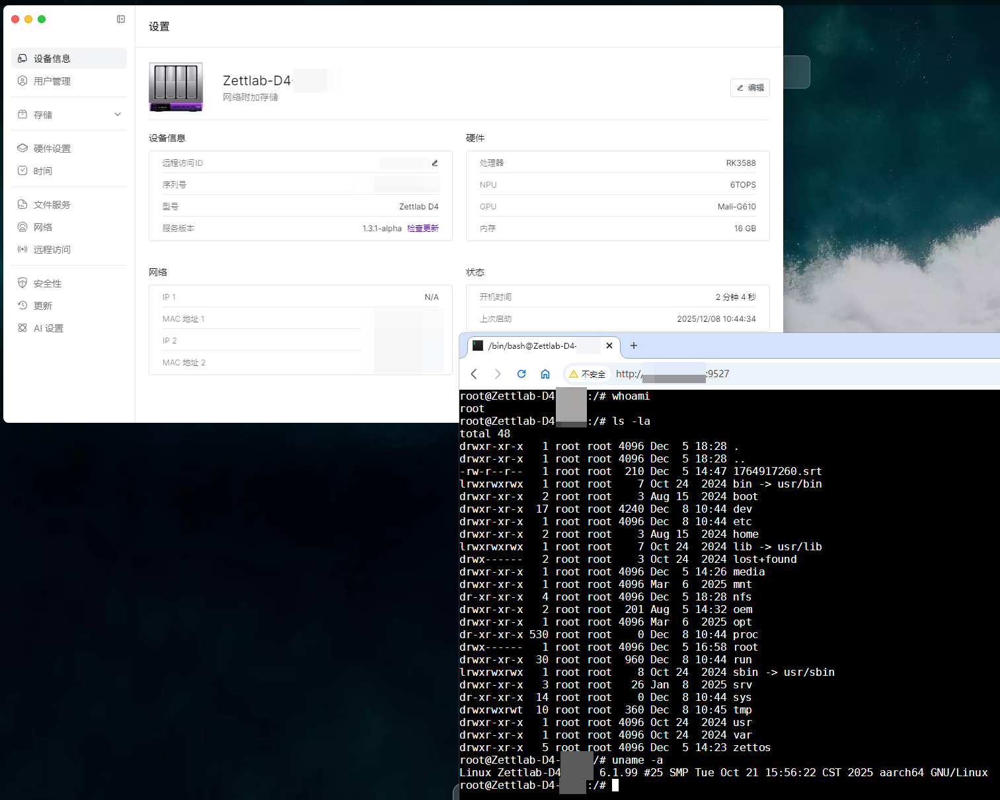

# 可能的QA
## 为什么要这样搞
手痒，新玩具想摸，不摸不舒服  
## 为什么要有远程shell的容器
它的docker面板没有提供shell  
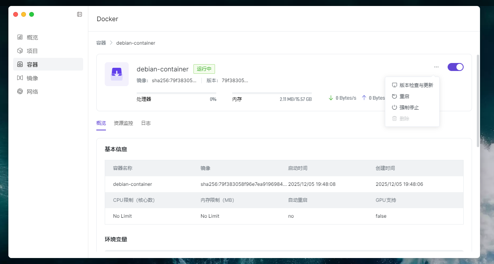
## 为什么不直接挂载rootfs到容器直接改
你能想到他想不到吗  
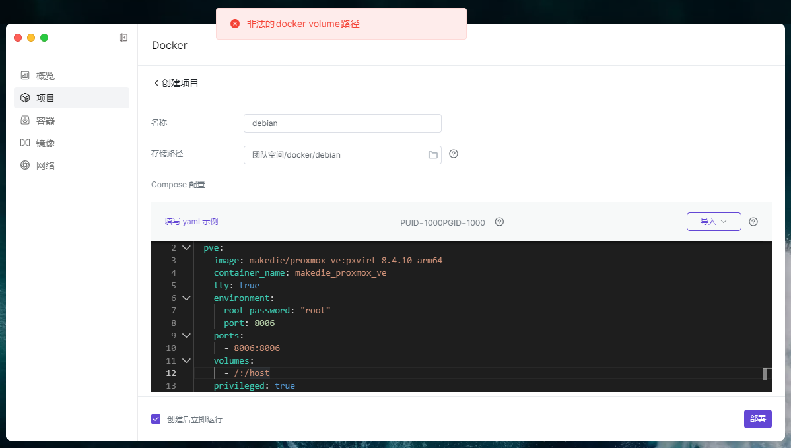
## 为什么不直接启动ssh
你拉起来他会给你杀了，估计是防一些远程执行之类的漏洞，但它这也没防住
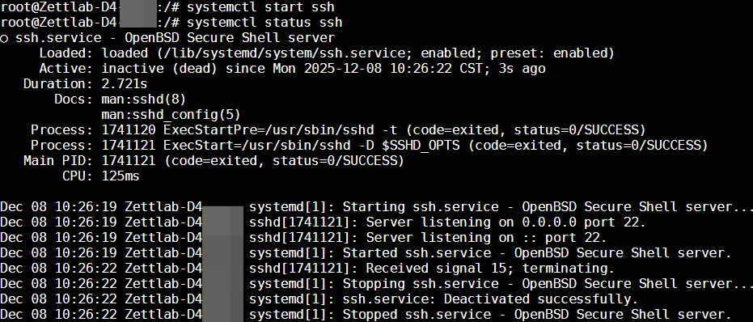
## 为什么不去改系统分区
一般来说嵌入式设备，在没有把握的情况下，不要动boot，如果有squashfs分区需要小心有没有avb之类的东西  
动了有可能触发安全启动相关检查导致机器再也开不起来  
如果确认无安全启动，可以使用kernelpatch，修改initramfs或rootfs，组合进行持久化修改  
https://github.com/bmax121/KernelPatch/  
一般来说按这些人的习惯，都会准备一个所谓回写用分区，专门存放用户数据  
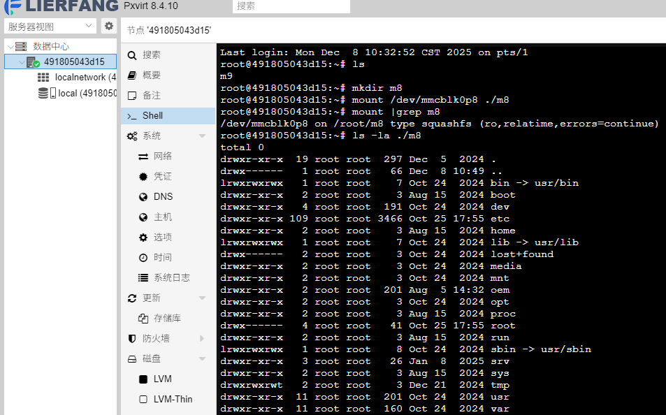
## 为什么不走其他路子
有兴趣可以自己去摸，我是发现docker那边可以直接写连写保护都没有就不继续摸了
docker带privileged时还能通过修改ns直接跨越到宿主机
其他路子估计是有的，只要摸一个远程执行，就能执行任意脚本，连文件注入的事儿都省了
用户自行上传的文件居然带可执行，而创建docker-compose，文件落地居然是root用户  
且覆盖文件时会继承之前存在文件的权限，selinux也没有
大概的思路要不就是ftp远程执行，更新脚本，接口注入之类的老伙计
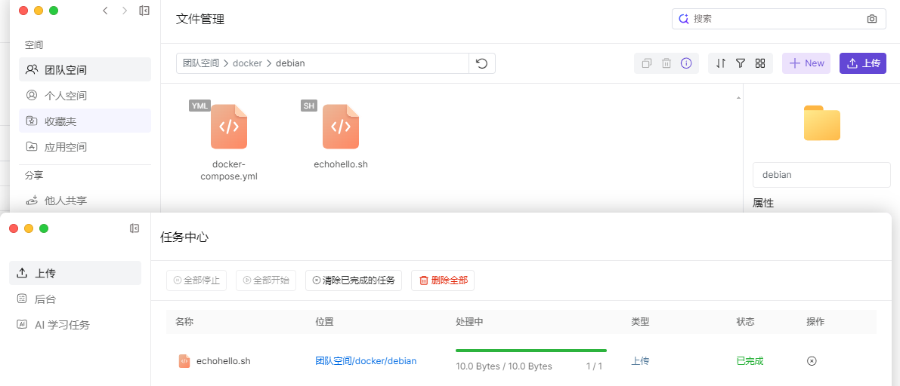  
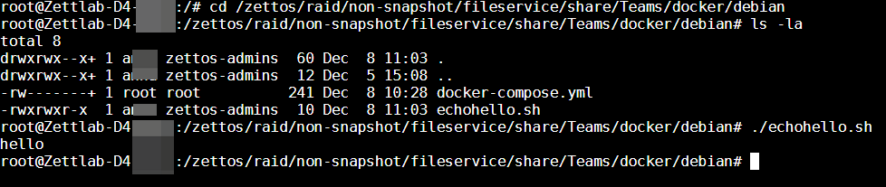
# 安全加固建议
- 启用selinux
- 数据回写分区加密
- 上传文件去掉可执行属性
  - 此改动需回归SMB可执行软件情况
- 系统服务进行适当的权限降级
- 加固docker降级privileged访问
  - 此改动可能破坏docker可用性，但本来这系统的docker可用性就不高