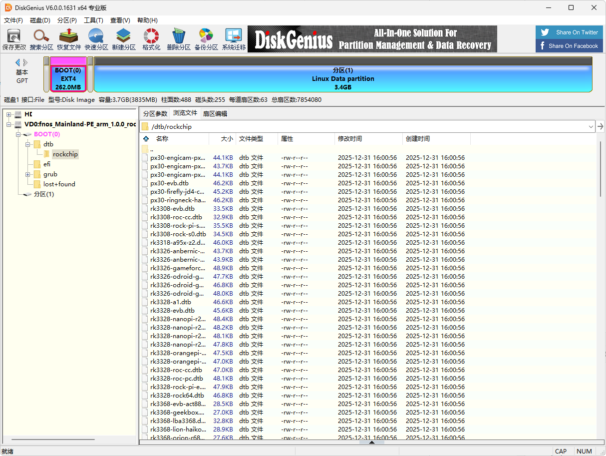
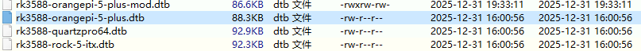
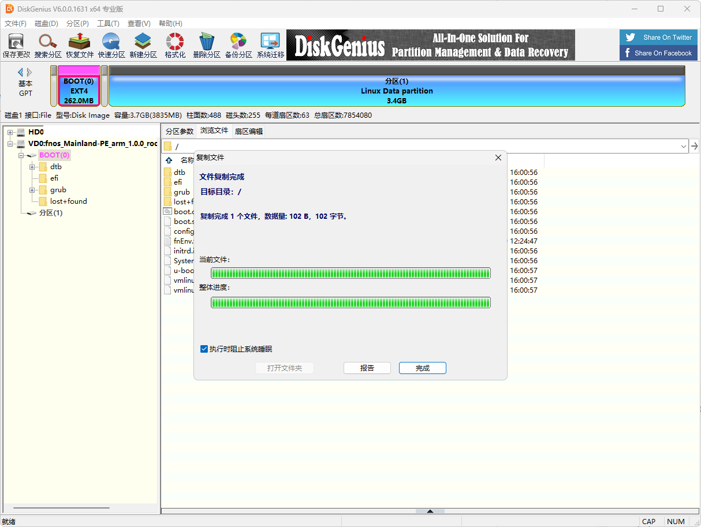
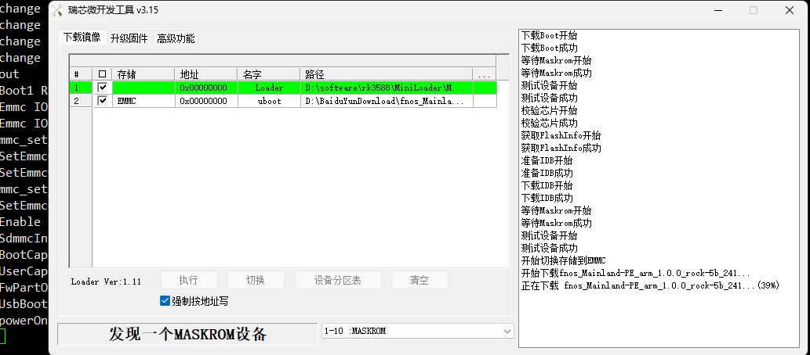
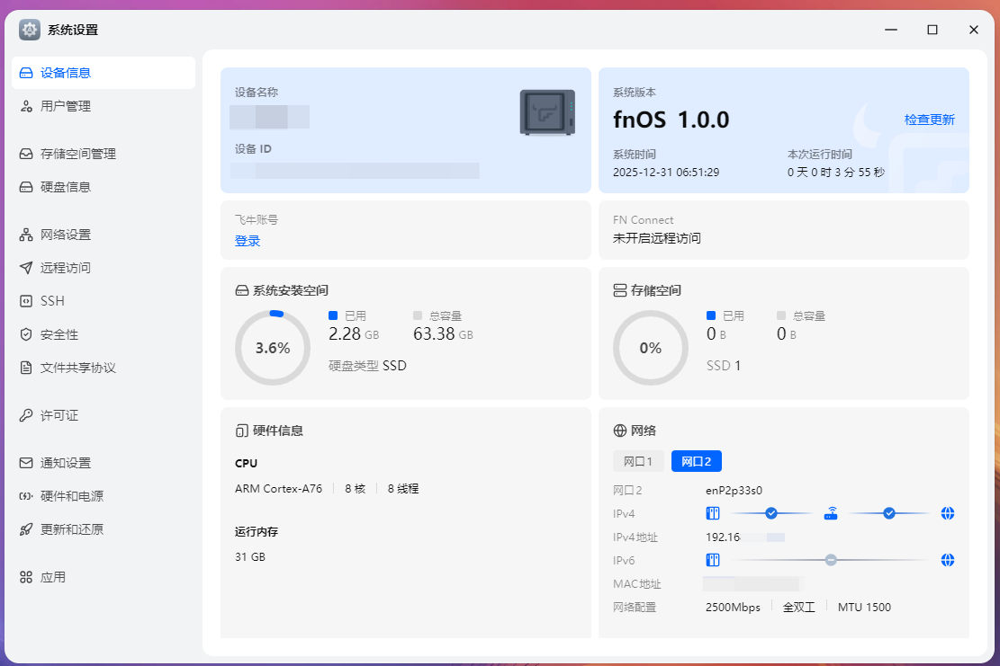
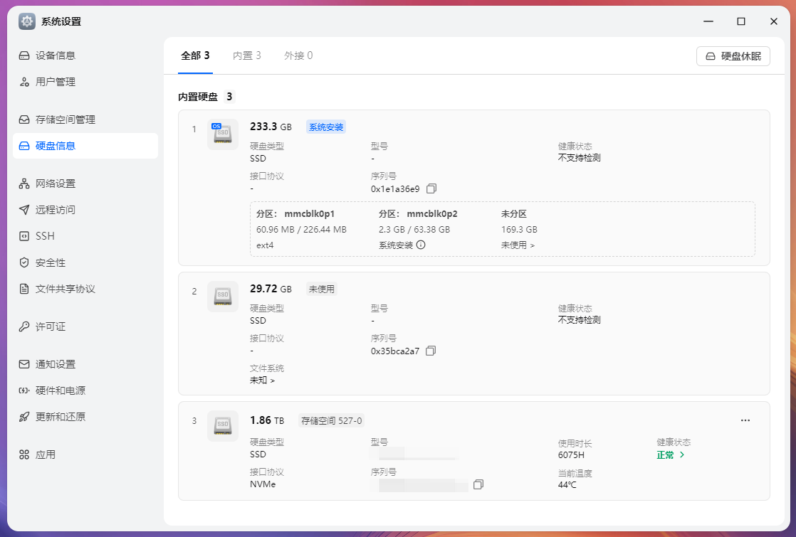

# 替换飞牛ARM版本镜像dtb启动自己的设备

# 前言
最近飞牛出了个arm版本，当前版本适配的设备寥寥无几  
但是只要有合适的设备树文件，同一个芯片家族的方案有自行“适配”的希望  
比如说RK35XX系列，看起来就很有希望  
如果你的设备已经在包内有dtb甚至完全不需要脑子，改个fnEnv.txt里的文件名大胆刷  

不过要注意别把某个臭名昭著的带锁设备固件刷进去了  
听说不少人刷完之后U被锁了，喜提板砖  

# /boot/dtb/rockchip 已有设备
目前固件内已有的dtb如下列，大家可以查查看自己的设备在不在其中  
```text
px30-engicam-px30-core-ctouch2.dtb       rk3399-gru-scarlet-kd.dtb         rk3566-box-demo.dtb            rk3568-rock-3b.dtb
px30-engicam-px30-core-ctouch2-of10.dtb  rk3399-hugsun-x99.dtb             rk3566-lckfb-tspi.dtb          rk3568-roc-pc.dtb
px30-engicam-px30-core-edimm2.2.dtb      rk3399-khadas-edge-captain.dtb    rk3566-lubancat-1.dtb          rk3568-wolfvision-pf5-display-vz.dtbo
px30-evb.dtb                             rk3399-khadas-edge.dtb            rk3566-nanopi-r3s.dtb          rk3568-wolfvision-pf5.dtb
px30-firefly-jd4-core-mb.dtb             rk3399-khadas-edge-v.dtb          rk3566-nanopi-r3s-lts.dtb      rk3568-wolfvision-pf5-io-expander.dtbo
px30-ringneck-haikou.dtb                 rk3399-kobol-helios64.dtb         rk3566-odroid-m1s.dtb          rk3576-nanopi-m5.dtb
rk3308-evb.dtb                           rk3399-leez-p710.dtb              rk3566-onethingcloud-oec.dtb   rk3576-nanopi-r76s.dtb
rk3308-roc-cc.dtb                        rk3399-nanopc-t4.dtb              rk3566-orangepi-3b-v1.1.dtb    rk3576-rock-4d.dtb
rk3308-rock-pi-s.dtb                     rk3399-nanopi-m4b.dtb             rk3566-orangepi-3b-v2.1.dtb    rk3582-radxa-e52c.dtb
rk3308-rock-s0.dtb                       rk3399-nanopi-m4.dtb              rk3566-pinenote-v1.1.dtb       rk3582-radxa-e54c.dtb
rk3318-a95x-z2.dtb                       rk3399-nanopi-neo4.dtb            rk3566-pinenote-v1.2.dtb       rk3588-armsom-sige7.dtb
rk3326-anbernic-rg351m.dtb               rk3399-nanopi-r4s.dtb             rk3566-pinetab2-v0.1.dtb       rk3588-coolpi-cm5-evb.dtb
rk3326-anbernic-rg351v.dtb               rk3399-nanopi-r4s-enterprise.dtb  rk3566-pinetab2-v2.0.dtb       rk3588-coolpi-cm5-genbook.dtb
rk3326-gameforce-chi.dtb                 rk3399-orangepi.dtb               rk3566-powkiddy-rgb10max3.dtb  rk3588-cyber3588-aib.dtb
rk3326-odroid-go2.dtb                    rk3399-pinebook-pro.dtb           rk3566-powkiddy-rgb30.dtb      rk3588-edgeble-neu6a-io.dtb
rk3326-odroid-go2-v11.dtb                rk3399-pinephone-pro.dtb          rk3566-powkiddy-rk2023.dtb     rk3588-edgeble-neu6a-wifi.dtbo
rk3326-odroid-go3.dtb                    rk3399pro-rock-pi-n10.dtb         rk3566-powkiddy-x55.dtb        rk3588-edgeble-neu6b-io.dtb
rk3328-a1.dtb                            rk3399-puma-haikou.dtb            rk3566-quartz64-a.dtb          rk3588-evb1-v10.dtb
rk3328-evb.dtb                           rk3399-rock-4c-plus.dtb           rk3566-quartz64-b.dtb          rk3588-friendlyelec-cm3588-nas.dtb
rk3328-nanopi-r2c.dtb                    rk3399-rock-4se.dtb               rk3566-radxa-cm3-io.dtb        rk3588-jaguar.dtb
rk3328-nanopi-r2c-plus.dtb               rk3399-rock960.dtb                rk3566-radxa-zero-3e.dtb       rk3588-nanopc-t6.dtb
rk3328-nanopi-r2s.dtb                    rk3399-rock-pi-4a.dtb             rk3566-radxa-zero-3w.dtb       rk3588-nanopc-t6-lts.dtb
rk3328-nanopi-r2s-plus.dtb               rk3399-rock-pi-4a-plus.dtb        rk3566-rock-3c.dtb             rk3588-ok3588-c.dtb
rk3328-orangepi-r1-plus.dtb              rk3399-rock-pi-4b.dtb             rk3566-roc-pc.dtb              rk3588-orangepi-5-plus.dtb
rk3328-orangepi-r1-plus-lts.dtb          rk3399-rock-pi-4b-plus.dtb        rk3566-soquartz-blade.dtb      rk3588-quartzpro64.dtb
rk3328-roc-cc.dtb                        rk3399-rock-pi-4c.dtb             rk3566-soquartz-cm4.dtb        rk3588-rock-5b.dtb
rk3328-rock64.dtb                        rk3399-rockpro64.dtb              rk3566-soquartz-model-a.dtb    rk3588-rock-5b-pcie-ep.dtbo
rk3328-rock-pi-e.dtb                     rk3399-rockpro64-v2.dtb           rk3568-9tripod-x3568-v4.dtb    rk3588-rock-5b-pcie-srns.dtbo
rk3328-roc-pc.dtb                        rk3399-roc-pc.dtb                 rk3568-bpi-r2-pro.dtb          rk3588-rock-5b-plus.dtb
rk3368-evb-act8846.dtb                   rk3399-roc-pc-mezzanine.dtb       rk3568-easepi-r1.dtb           rk3588-rock-5-itx.dtb
rk3368-geekbox.dtb                       rk3399-roc-pc-plus.dtb            rk3568-evb1-v10.dtb            rk3588-rock-5t.dtb
rk3368-lba3368.dtb                       rk3399-sapphire.dtb               rk3568-fastrhino-r66s.dtb      rk3588s-coolpi-4b.dtb
rk3368-lion-haikou.dtb                   rk3399-sapphire-excavator.dtb     rk3568-fastrhino-r68s.dtb      rk3588s-gameforce-ace.dtb
rk3368-orion-r68-meta.dtb                rk3528-radxa-e20c.dtb             rk3568-hnas.dtb                rk3588s-indiedroid-nova.dtb
rk3368-px5-evb.dtb                       rk3528-radxa-e24c.dtb             rk3568-linkfog-ala1.dtb        rk3588s-khadas-edge2.dtb
rk3368-r88.dtb                           rk3528-rock-2a.dtb                rk3568-lubancat-2.dtb          rk3588s-nanopi-r6c.dtb
rk3399-eaidk-610.dtb                     rk3528-rock-2f.dtb                rk3568-mecsbc.dtb              rk3588s-nanopi-r6s.dtb
rk3399-evb.dtb                           rk3566-anbernic-rg353p.dtb        rk3568-nanopi-r5c.dtb          rk3588s-odroid-m2.dtb
rk3399-ficus.dtb                         rk3566-anbernic-rg353ps.dtb       rk3568-nanopi-r5s.dtb          rk3588s-orangepi-5.dtb
rk3399-firefly.dtb                       rk3566-anbernic-rg353v.dtb        rk3568-odroid-m1.dtb           rk3588s-rock-5a.dtb
rk3399-gru-bob.dtb                       rk3566-anbernic-rg353vs.dtb       rk3568-photonicat.dtb          rk3588s-rock-5c.dtb
rk3399-gru-kevin.dtb                     rk3566-anbernic-rg503.dtb         rk3568-qnap-ts433.dtb          rk3588-tiger-haikou.dtb
rk3399-gru-scarlet-dumo.dtb              rk3566-anbernic-rg-arc-d.dtb      rk3568-radxa-e25.dtb           rk3588-toybrick-x0.dtb
rk3399-gru-scarlet-inx.dtb               rk3566-anbernic-rg-arc-s.dtb      rk3568-rock-3a.dtb             rk3588-turing-rk1.dtb
```


# 从dts构建dtb
不需要自行构建dtb的直接跳过  
我这个电视盒子dtb可以看见orangepi-5-plus的字样，这个盒子与香橙派5Plus高度相似  
不过少数接口不一样，还有部分脚位被定义去做了风扇  
电视盒子自带系统提取到dtb，但不同版本内核的dtb大概率不能混用  
需要反编译dtb后，对比主线6.12内核的dts删除增补部分东西  
随后只需要再次编译即可

这一节基本上属于会的不用看不会的看不懂  
裁剪接口与调整GPIO那些每个方案都不一样  

这里的环境我选取跟飞牛官方一致的内核版本  
```text
Linux kirakira 6.12.41-trim #1 SMP PREEMPT Wed Dec 31 02:09:11 UTC 2025 aarch64 GNU/Linux
```
```shell
wget wget https://cdn.kernel.org/pub/linux/kernel/v6.x/linux-6.12.41.tar.xz
tar -xvf linux-6.12.
cp /lib/modules/$(uname -r)/build/Module.symvers ./Module.symvers
cp /boot/config-6.12.41-trim ./.config
```
基础的环境准备完了就将dts丢到`linux-6.12.41/arch/arm64/boot/dts/rockchip`

```shell
vim arch/arm64/boot/dts/rockchip/Makefile
```
新增一行  
```text
dtb-$(CONFIG_ARCH_ROCKCHIP) += rk3588-orangepi-5-plus-mod.dtb
```
开始编译  
```shell
make ARCH=arm64 dtbs -j`nproc`
```
然后等结果出来把文件拿走就行  
```shell
root@arm:/vol1/1000/workspace/linux-6.12.41# make ARCH=arm64 dtbs -j`nproc`
  DTC     arch/arm64/boot/dts/rockchip/rk3588-orangepi-5-plus-mod.dtb
```

# 替换dtb
如果你的设备在这里已经有了dtb，那就不需要丢东西进来这个目录  

如果没有就要跟我一样，把自己编译的dtb丢进来  


# 修改 fnEnv.txt
如下所示，修改fnEnv.txt文件中的dtb文件名  
```text
verbosity=1
bootlogo=false
console=both
extraargs=cma=256M
fdtfile=rockchip/rk3588-orangepi-5-plus-mod.dtb
```
然后再丢回去覆盖  


# 刷入固件
每个机器刷机方式都不大一样，但你都玩arm了想必一定是会的  
我这个RK3588终归是要进MASKROM  

正常的等刷完就行

# 观察uboot日志
观察串口的uboot日志，等Starting kernel出现接下来就到linux内核部分了  
```text
U-Boot 2025.10-gb264c65f983a (Dec 29 2025 - 04:25:09 +0000), Build: jenkins-uboot-fnos-51

Model: Radxa ROCK 5B
SoC:   RK3588
DRAM:  32 GiB (total 31.7 GiB)
fusb302 usb-typec@22: cannot write 0x01 to 0x0c, ret=-121
fusb302 usb-typec@22: cannot sw reset the fusb302: -121
fusb302 usb-typec@22: cannot read 07, ret=-121
fusb302 usb-typec@22: cannot read 07, ret=-121
fusb302 usb-typec@22: cannot read 07, ret=-121
fusb302 usb-typec@22: cannot flush pd rx buffer: -121
fusb302 usb-typec@22: cannot read 03, ret=-121
fusb302 usb-typec@22: cannot read 03, ret=-121
fusb302 usb-typec@22: cannot read 03, ret=-121
fusb302 usb-typec@22: unable to set pd header sink, device, ret=-121
fusb302 usb-typec@22: cannot read 06, ret=-121
fusb302 usb-typec@22: cannot read 06, ret=-121
fusb302 usb-typec@22: cannot read 06, ret=-121
fusb302 usb-typec@22: unable to set src current rd, ret=-121fusb302 usb-typec@22: cannot read 08, ret=-121
fusb302 usb-typec@22: cannot read 08, ret=-121
fusb302 usb-typec@22: cannot read 08, ret=-121
fusb302 usb-typec@22: cannot set toggling mode: -121
Core:  380 devices, 34 uclasses, devicetree: separate
MMC:   mmc@fe2c0000: 1, mmc@fe2d0000: 2, mmc@fe2e0000: 0
Loading Environment from nowhere... OK
In:    serial@feb50000
Out:   serial@feb50000
Err:   serial@feb50000
Model: Radxa ROCK 5B
SoC:   RK3588
Net:   No ethernet found.
Hit any key to stop autoboot: 0
Scanning for bootflows in all bootdevs
Seq  Method       State   Uclass    Part  Name                      Filename
---  -----------  ------  --------  ----  ------------------------  ----------------
Scanning global bootmeth 'efi_mgr':
Card did not respond to voltage select! : -110
Cannot persist EFI variables without system partition
  0  efi_mgr      ready   (none)       0  <NULL>                    
** Booting bootflow '<NULL>' with efi_mgr
Loading Boot0000 'mmc 1' failed
Loading Boot0001 'mmc 0' failed
EFI boot manager: Cannot load any image
Boot failed (err=-14)
USB EHCI 1.00
USB OHCI 1.0
USB EHCI 1.00
USB OHCI 1.0
Register 2000140 NbrPorts 2
Starting the controller
USB XHCI 1.10
Register 2000140 NbrPorts 2
Starting the controller
USB XHCI 1.10
Bus usb@fc800000: 1 USB Device(s) found
Bus usb@fc840000: 1 USB Device(s) found
Bus usb@fc880000: 2 USB Device(s) found
Bus usb@fc8c0000: 1 USB Device(s) found
Bus usb@fcd00000: 1 USB Device(s) found
Bus usb@fc400000: 4 USB Device(s) found
Scanning bootdev 'mmc@fe2c0000.bootdev':
Scanning bootdev 'mmc@fe2e0000.bootdev':
  1  script       ready   mmc          1  mmc@fe2e0000.bootdev.part /boot.scr
** Booting bootflow 'mmc@fe2e0000.bootdev.part_1' with script
Boot script loaded from mmc 0:1
106 bytes read in 6 ms (16.6 KiB/s)
13301671 bytes read in 88 ms (144.2 MiB/s)
88631 bytes read in 47 ms (1.8 MiB/s)
Working FDT set to 12000000
   Uncompressing Kernel Image to 0
## Flattened Device Tree blob at 12000000
   Booting using the fdt blob at 0x12000000
Working FDT set to 12000000
   Loading Device Tree to 00000000ecb32000, end 00000000ecbaffff ... OK
Working FDT set to ecb32000

Starting kernel ...

```

# 观察kernel日志
这里主要观察Machine model是不是你选取的dtb内的model，避免手滑弄成名字相似的  
然后就是观察有无致命错误，有的话就要判断是不是dtb的问题，如果不是建议等飞牛更新，如果是就去自己修dts  
```text
[    0.000000] Booting Linux on physical CPU 0x0000000000 [0x412fd050]
[    0.000000] Linux version 6.12.41-trim (root@142ffc47bedf) (aarch64-linux-gnu-gcc (Debian 12.2.0-14) 12.2.0, GNU ld (GNU Binutils for Debian) 2.40) #1 SMP PREEMPT Wed Dec 31 02:09:11 UTC 2025
[    0.000000] KASLR enabled
[    0.000000] Machine model: Xunlong Orange Pi 5 Plus modify
[    0.000000] efi: UEFI not found.
[    0.000000] OF: reserved mem: 0x000000000010f000..0x000000000010f0ff (0 KiB) nomap non-reusable shmem@10f000
[    0.000000] NUMA: Faking a node at [mem 0x0000000000200000-0x00000007ffffffff]
[    0.000000] NODE_DATA(0) allocated [mem 0x7fbfe77c0-0x7fbfe9f3f]
[    0.000000] Zone ranges:
[    0.000000]   DMA      [mem 0x0000000000200000-0x00000000ffffffff]
[    0.000000]   DMA32    empty
[    0.000000]   Normal   [mem 0x0000000100000000-0x00000007ffffffff]
[    0.000000] Movable zone start for each node
[    0.000000] Early memory node ranges
[    0.000000]   node   0: [mem 0x0000000000200000-0x00000000efffffff]
[    0.000000]   node   0: [mem 0x0000000100000000-0x00000003fbffffff]
[    0.000000]   node   0: [mem 0x00000003fc500000-0x00000003ffefffff]
[    0.000000]   node   0: [mem 0x0000000400000000-0x00000007ffffffff]
[    0.000000] Initmem setup node 0 [mem 0x0000000000200000-0x00000007ffffffff]
[    0.000000] On node 0, zone DMA: 512 pages in unavailable ranges
[    0.000000] On node 0, zone Normal: 1280 pages in unavailable ranges
[    0.000000] On node 0, zone Normal: 256 pages in unavailable ranges
[    0.000000] cma: Reserved 256 MiB at 0x00000000dca00000 on node -1
[    0.000000] psci: probing for conduit method from DT.
[    0.000000] psci: PSCIv1.1 detected in firmware.
[    0.000000] psci: Using standard PSCI v0.2 function IDs
[    0.000000] psci: MIGRATE_INFO_TYPE not supported.
[    0.000000] psci: SMC Calling Convention v1.2
[    0.000000] percpu: Embedded 34 pages/cpu s99352 r8192 d31720 u139264
[    0.000000] pcpu-alloc: s99352 r8192 d31720 u139264 alloc=34*4096
[    0.000000] pcpu-alloc: [0] 0 [0] 1 [0] 2 [0] 3 [0] 4 [0] 5 [0] 6 [0] 7 
[    0.000000] Detected VIPT I-cache on CPU0
[    0.000000] CPU features: detected: GIC system register CPU interface
[    0.000000] CPU features: detected: Virtualization Host Extensions
[    0.000000] CPU features: kernel page table isolation forced ON by KASLR
[    0.000000] CPU features: detected: Kernel page table isolation (KPTI)
[    0.000000] CPU features: detected: Qualcomm erratum 1009, or ARM erratum 1286807, 2441009
[    0.000000] CPU features: detected: ARM errata 1165522, 1319367, or 1530923
[    0.000000] alternatives: applying boot alternatives
[    0.000000] Kernel command line: root=PARTUUID=e347af3b-e393-4c65-ad97-53f727b6a2da rootwait rw rootfstype=btrfs,ext4 splash=verbose console=ttyS2,1500000 console=tty1 consoleblank=0 loglevel=1 ubootpart=9a88151a-a88c-4303-97a3-f54a77e28f0c usb-storage.quirks= cma=256M  cgroup_enable=cpuset cgroup_memory=1 cgroup_enable=memory
[    0.000000] Unknown kernel command line parameters "splash=verbose ubootpart=9a88151a-a88c-4303-97a3-f54a77e28f0c cgroup_enable=memory cgroup_memory=1", will be passed to user space.
[    0.000000] Dentry cache hash table entries: 4194304 (order: 13, 33554432 bytes, linear)
[    0.000000] Inode-cache hash table entries: 2097152 (order: 12, 16777216 bytes, linear)
[    0.000000] Fallback order for Node 0: 0 
[    0.000000] Built 1 zonelists, mobility grouping on.  Total pages: 8321024
[    0.000000] Policy zone: Normal
[    0.000000] mem auto-init: stack:all(zero), heap alloc:on, heap free:off
[    0.000000] software IO TLB: area num 8.
[    0.000000] software IO TLB: mapped [mem 0x00000000d8a00000-0x00000000dca00000] (64MB)
[    0.000000] SLUB: HWalign=64, Order=0-3, MinObjects=0, CPUs=8, Nodes=1
[    0.000000] rcu: Preemptible hierarchical RCU implementation.
[    0.000000] rcu: 	RCU event tracing is enabled.
[    0.000000] rcu: 	RCU restricting CPUs from NR_CPUS=256 to nr_cpu_ids=8.
[    0.000000] 	Trampoline variant of Tasks RCU enabled.
[    0.000000] 	Tracing variant of Tasks RCU enabled.
[    0.000000] rcu: RCU calculated value of scheduler-enlistment delay is 25 jiffies.
[    0.000000] rcu: Adjusting geometry for rcu_fanout_leaf=16, nr_cpu_ids=8
[    0.000000] RCU Tasks: Setting shift to 3 and lim to 1 rcu_task_cb_adjust=1 rcu_task_cpu_ids=8.
[    0.000000] RCU Tasks Trace: Setting shift to 3 and lim to 1 rcu_task_cb_adjust=1 rcu_task_cpu_ids=8.
[    0.000000] NR_IRQS: 64, nr_irqs: 64, preallocated irqs: 0
[    0.000000] GICv3: GIC: Using split EOI/Deactivate mode
[    0.000000] GICv3: 480 SPIs implemented
[    0.000000] GICv3: 0 Extended SPIs implemented
[    0.000000] GICv3: MBI range [424:479]
[    0.000000] GICv3: Using MBI frame 0x00000000fe610000
[    0.000000] Root IRQ handler: gic_handle_irq
[    0.000000] GICv3: GICv3 features: 16 PPIs
[    0.000000] GICv3: GICD_CTRL.DS=0, SCR_EL3.FIQ=1
[    0.000000] GICv3: CPU0: found redistributor 0 region 0:0x00000000fe680000
[    0.000000] ITS [mem 0xfe640000-0xfe65ffff]
[    0.000000] GIC: enabling workaround for ITS: Rockchip erratum RK3588001
[    0.000000] ITS@0x00000000fe640000: allocated 8192 Devices @100450000 (indirect, esz 8, psz 64K, shr 0)
[    0.000000] ITS@0x00000000fe640000: allocated 32768 Interrupt Collections @100460000 (flat, esz 2, psz 64K, shr 0)
[    0.000000] ITS: using cache flushing for cmd queue
[    0.000000] ITS [mem 0xfe660000-0xfe67ffff]
[    0.000000] GIC: enabling workaround for ITS: Rockchip erratum RK3588001
[    0.000000] ITS@0x00000000fe660000: allocated 8192 Devices @100480000 (indirect, esz 8, psz 64K, shr 0)
[    0.000000] ITS@0x00000000fe660000: allocated 32768 Interrupt Collections @100490000 (flat, esz 2, psz 64K, shr 0)
[    0.000000] ITS: using cache flushing for cmd queue
[    0.000000] GICv3: using LPI property table @0x00000001004a0000
[    0.000000] GIC: using cache flushing for LPI property table
[    0.000000] GICv3: CPU0: using allocated LPI pending table @0x00000001004b0000
[    0.000000] GICv3: GIC: PPI partition interrupt-partition-0[0] { /cpus/cpu@0[0] /cpus/cpu@100[1] /cpus/cpu@200[2] /cpus/cpu@300[3] }
[    0.000000] GICv3: GIC: PPI partition interrupt-partition-1[1] { /cpus/cpu@400[4] /cpus/cpu@500[5] /cpus/cpu@600[6] /cpus/cpu@700[7] }
[    0.000000] rcu: srcu_init: Setting srcu_struct sizes based on contention.
[    0.000000] arch_timer: cp15 timer(s) running at 24.00MHz (phys).
[    0.000000] clocksource: arch_sys_counter: mask: 0xffffffffffffff max_cycles: 0x588fe9dc0, max_idle_ns: 440795202592 ns
[    0.000001] sched_clock: 56 bits at 24MHz, resolution 41ns, wraps every 4398046511097ns
[    0.001059] Console: colour dummy device 80x25
[    0.001075] printk: legacy console [tty1] enabled
[    0.001299] Calibrating delay loop (skipped), value calculated using timer frequency.. 48.00 BogoMIPS (lpj=96000)
[    0.001318] pid_max: default: 32768 minimum: 301
[    0.001414] LSM: initializing lsm=capability,yama,apparmor
[    0.001493] Yama: becoming mindful.
[    0.001770] AppArmor: AppArmor initialized

```
# 初始化并观察
由于飞牛的ARM版本还处于初期阶段，只要能开机就是胜利  
检查一下EMMC、SD卡、NVME之类的外设接口有没有大问题就行  
风扇传感器之类的也可以自己检查下  
至于mali核显那些能不能用，等飞牛适配工作结束后的正式版再检查也不迟  



