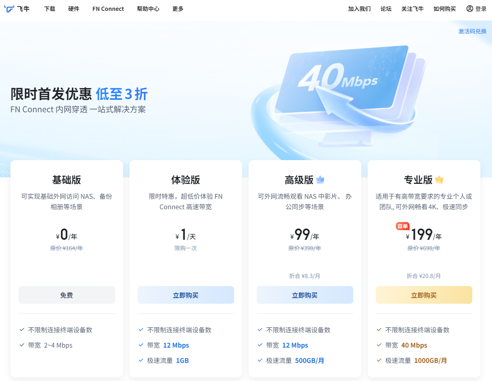
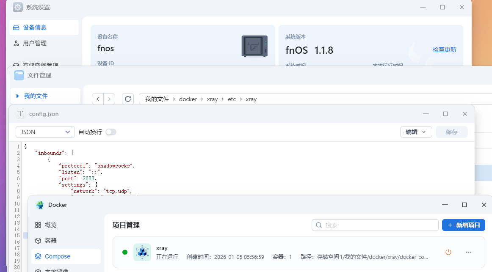
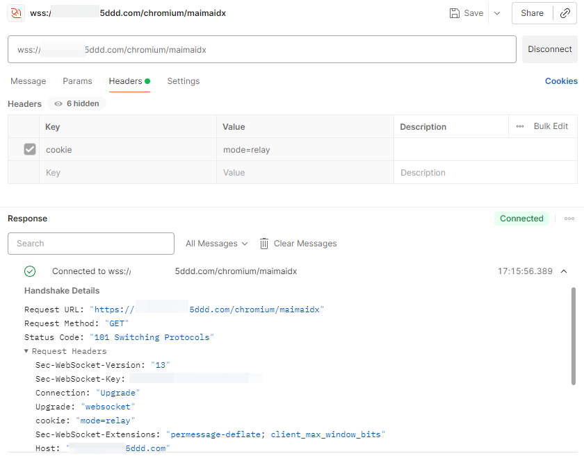

# 使用飞牛OS的fn connect访问家中网络

# 前言
国产新势力飞牛nas提供了免费的内网穿透服务  
  
那自然是要物尽其用，人尽其才的  
尤其是每个月中转流量都没用完的时候，更是有一种亏了的感觉  
这就探索一下这个fn connect的其他使用场景

出门在外想连回家，市面上的服务五花八门  
今天就以飞牛nas作为主角，进行一次简单的探索  

# trim_chromium.conf
观察并注意到，`/usr/trim/nginx/conf/conf.d/`目录下有一个叫`trim_chromium.conf`的配置  
这个系统自带的配置中有一行  
```text
proxy_pass               http://127.0.0.1:3000;
```
目前这个端口是由应用中心的浏览器应用使用，但如果我们不安装浏览器，而是使用自己的服务占用这个3000号端口  
trim_nginx也会忠实地帮助我们转发流量  
```text
root@fnos:~# cat /usr/trim/nginx/conf/conf.d/trim_chromium.conf 
location ^~ /chromium/ {
    proxy_http_version      1.1;
    proxy_set_header        Host $host;
    proxy_set_header        Upgrade $http_upgrade;
    proxy_set_header        Connection "upgrade";
    proxy_set_header        X-Real-IP $remote_addr;
    proxy_set_header        X-Forwarded-For $proxy_add_x_forwarded_for;
    proxy_set_header        X-Forwarded-Proto $scheme;
    proxy_set_header        Cookie "";
    proxy_read_timeout      3600s;
    proxy_send_timeout      3600s;
    add_header              'Access-Control-Allow-Origin' '*' always;
    add_header              'Access-Control-Allow-Methods' 'GET, POST, OPTIONS';
    add_header              'Access-Control-Allow-Headers' 'Authorization,Content-Type,Accept,Origin,User-Agent,DNT,Cache-Control,X-Mx-ReqToken,Keep-Alive,X-Requested-With,If-Modified-Since';
    add_header              'Access-Control-Allow-Credentials' 'true';
    add_header              'Cross-Origin-Embedder-Policy' 'require-corp';
    add_header              'Cross-Origin-Opener-Policy' 'same-origin';
    add_header              'Cross-Origin-Resource-Policy' 'same-site';
    proxy_pass               http://127.0.0.1:3000;
    proxy_buffering          off;
    #proxy_pass http://127.0.0.1:3000;
}

```

# server side xray config
如下编写一套xray配置并命名为config.json，就可以在3000端口，使用websocket流量承载数据  
```json
{
    "inbounds": [
        {
            "protocol": "shadowsocks",
            "listen": "::",
            "port": 3000,
            "settings": {
                "network": "tcp,udp",
                "method": "aes-128-gcm",
                "password": "password"
            },
            "streamSettings": {
                "network": "ws",
                "wsSettings": {
                    "path": "/chromium/maimaidx"
                }
            }
        }
    ],
    "outbounds": [
        {
            "protocol": "Freedom"
        }
    ]
}

```

# dokcer-compose
编写如下的compose文件，并将刚刚写完的配置文件config.json，丢进如下目录  
/vol1/1000/docker/xray/etc/xray/  
如果你需要调整目录，记得同步修改compose的映射  
```yaml
services:
  xray:
    container_name: xray
    tty: true
    image: teddysun/xray:25.12.8
    ports:
      - 3000:3000
    volumes:
    - /vol1/1000/docker/xray/etc/xray:/etc/xray
```
如图所示，把这个容器跑起来  


# 验通
这里使用常用的http协议测试工具进行验证  
记得手动新增请求头cookie:"mode=relay"  
只要websocket是通的说明fn connect穿透可以正常工作  


# client side xray config
根据你使用的不同客户端，配置均有不同  
但核心配置就是"Cookie": "mode=relay;"这个头一定要有  
这个示例配置会在端口1080开启监听服务  
以如下配置启动xray客户端并配置好浏览器的socket5就可以使用了  
其他应用比如说samba之类的也可以使用tun之类的虚拟网卡解决  
```json
{
    "inbounds": [
        {
            "listen": "::",
            "port": 1080,
            "protocol": "socks",
            "settings": {
                "auth": "noauth",
                "udp": true
            }
        }
    ],
    "outbounds": [
        {
            "protocol": "shadowsocks",
            "settings": {
                "servers": [
                    {
                        "address": "你的fnconnect.5ddd.com",
                        "port": 443,
                        "method": "aes-128-gcm",
                        "password": "password"
                    }
                ]
            },
            "streamSettings": {
                "network": "ws",
                "security": "tls",
                "wsSettings": {
                    "path": "/chromium/maimaidx",
                    "host": "你的fnconnect.5ddd.com",
                    "headers": {
                        "Cookie": "mode=relay;"
                    }
                }
            }
        }
    ]
}
```
# 结束语
希望飞牛官方早日在应用中心上架一个内网穿透回家服务  
这样在外面出行的时候也能连回自己家里的机器  
话又说回来，你家是不是在国外有一台飞牛nas？