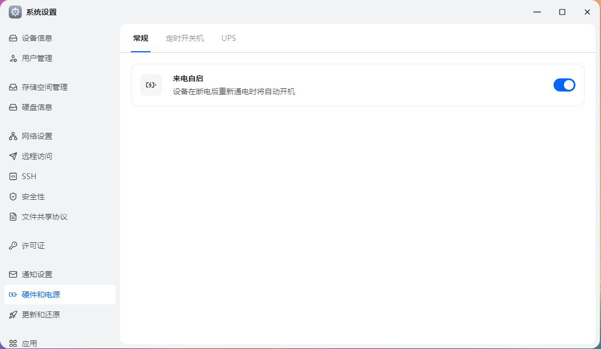
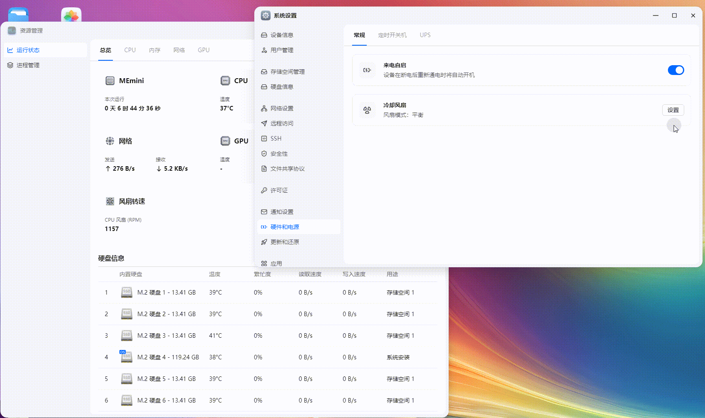

# 给MEMini飞牛联名款开启风扇控制功能

# 前言
零刻ME Mini这东西上市已经很久了，不知道为什么风扇控制功能一直没有跟上  
  
我手里的这台是联名刚出的时候搞来当影视播放器的，听说后面的还有其他改款  
今天就给大家带来在1.1.18版本系统开启风扇控制功能的方法  
如果系统版本不同或者是机型不同不能保证我这个方法也能用哦  
看里面的东西，好像后期还有一个v1.1机型，symbol与nr_iomap_table与我手上这个不同  
v1.1的机器比起首发款加了许多的定制功能，不过我没有机器，有的你们可以看一下是不是

# 准备脚本 patch.py
脚本如下，作用大概就是patch这个库的两个导出函数  
替换一下symbol  
以及修正一下`struct trim_dev // sizeof=0x190`里面  
那个叫`int nr_iomap_table;`的东西  
```python
import lief
import struct

binary = "/usr/trim/lib/libtrim_machine.so.0.5"
out    = "/usr/trim/lib/libtrim_machine.so.0.5"

elf = lief.parse(binary)

old_sym = elf.get_symbol("azw_mini_table")
new_sym = elf.get_symbol("azw_mini_evo_table")

if not old_sym or not new_sym:
    raise RuntimeError("table symbol not found")

reloc_cnt = 0
for reloc in elf.relocations:
    if reloc.symbol == old_sym:
        reloc.symbol = new_sym
        reloc_cnt += 1

print(f"[+] patched relocations: {reloc_cnt}")

def patch_return_imm(func_name, imm32):
    sym = elf.get_symbol(func_name)
    if not sym:
        raise RuntimeError(f"symbol not found: {func_name}")

    addr = sym.value
    code = b"\xB8" + struct.pack("<I", imm32) + b"\xC3"
    elf.patch_address(addr, list(code))

    print(f"[+] patch {func_name} @ 0x{addr:x} -> return 0x{imm32:x}")


patch_return_imm("trim_machine_type_get", 7)
patch_return_imm("trim_machine_feature_get", 0x1C05)

pattern_from = bytes.fromhex(
    "07 00 00 00 01 00 00 00 09 00 00 00 00 00 00 00"
)

pattern_to = bytes.fromhex(
    "07 00 00 00 01 00 00 00 16 00 00 00 00 00 00 00"
)

patched = 0

for sec in elf.sections:
    if not sec.content:
        continue

    content = bytes(sec.content)
    idx = 0

    while True:
        pos = content.find(pattern_from, idx)
        if pos == -1:
            break

        va = sec.virtual_address + pos
        elf.patch_address(va, list(pattern_to))
        patched += 1

        print(f"[+] pattern patched @ 0x{va:x} in section {sec.name}")
        idx = pos + len(pattern_from)

print(f"[+] total pattern patches: {patched}")

elf.write(out)
print("[+] output:", out)

```
# 运行脚本
运行脚本之前，请自行备份好文件  
```/usr/trim/lib/libtrim_machine.so.0.5```  

把上面这个脚本命名为patch.py  
切换至root用户安装依赖并运行脚本即可  
```text
python3 -m venv venv
venv/bin/pip install lief
venv/bin/python3 patch.py 
```
如无意外，脚本会自动帮你patch好  
```text
root@MEmini:~# vim patch.py
root@MEmini:~# python3 -m venv venv
venv/bin/pip install lief
venv/bin/python3 patch.py
Collecting lief
  Using cached lief-0.17.3-cp311-cp311-manylinux_2_28_x86_64.whl (3.4 MB)
Installing collected packages: lief
Successfully installed lief-0.17.3
[+] patched relocations: 1
[+] patch trim_machine_type_get @ 0x11b90 -> return 0x7
[+] patch trim_machine_feature_get @ 0x11b70 -> return 0x1c05
[+] pattern patched @ 0x1c9a0 in section .data
[+] total pattern patches: 1
[+] output: /usr/trim/lib/libtrim_machine.so.0.5
root@MEmini:~# 
```

随后重启这两个服务即可  
```text
systemctl restart sysinfo_service.service
systemctl restart resmon_service.service
```

# 风扇控制演示
试试看，patch完了能不能用  


# 为什么是0x1C05与0x7
飞牛保留了编译的符号，所以注意力稍微集中一下就能注意到，注意不到是你注意力不集中
## trim_machine_feature_get 为什么是1C05
打开resmon_service可以简单看出函数  
`__int64 __fastcall resmon::FanCtrl::Start(resmon::FanCtrl *__hidden this)`  
其中关键跳转  
```asm
.text:00000000001A5D50 loc_1A5D50:                             ; CODE XREF: resmon::FanCtrl::Start(void)+2D↑j
.text:00000000001A5D50                 lea     rdi, [rbp+var_538]
.text:00000000001A5D57                 call    _trim_fan_get_all
.text:00000000001A5D5C                 movsxd  rbx, eax
.text:00000000001A5D5F                 test    ebx, ebx
.text:00000000001A5D61                 jle     short loc_1A5D3F
.text:00000000001A5D63                 cmp     [rbp+var_538], 0
.text:00000000001A5D6B                 jz      short loc_1A5D3F
.text:00000000001A5D6D                 call    _trim_machine_feature_get
.text:00000000001A5D72                 mov     r12, rax
.text:00000000001A5D75                 call    _trim_machine_type_get
.text:00000000001A5D7A                 test    r12d, 1400h
.text:00000000001A5D81                 jz      short loc_1A5D3F
.text:00000000001A5D83                 mov     rsi, r12
.text:00000000001A5D86                 shl     eax, 8
.text:00000000001A5D89                 and     r12d, 1000h
.text:00000000001A5D90                 mov     rdi, [rbp+var_538]
.text:00000000001A5D97                 mov     [rbp+var_564], eax
.text:00000000001A5D9D                 and     esi, 400h
.text:00000000001A5DA3                 lea     rax, ds:0[rbx*8]
.text:00000000001A5DAB                 mov     [rbp+var_578], r12
.text:00000000001A5DB2                 xor     r12d, r12d
.text:00000000001A5DB5                 mov     [rbp+var_570], rsi
.text:00000000001A5DBC                 mov     [rbp+var_560], rax
.text:00000000001A5DC3                 jmp     short loc_1A5DEC
```

可以看出libtrim_machine.so.0.5的MEMini配置是0x805  
```text
.data:000000000001C920 trim_machine_azw_mini trim_dev <<0>, <<0>, <0>, <0>>, 0, 0, 805h, offset azw_mini_table, \
```

想要正确跳转，如下表所示，简单计算得0x1C05

| Hex  | Bin              |
|------|------------------|
| 0805 | 0000100000000101 |
| 1400 | 0001010000000000 |
| 1C05 | 0001110000000101 |

## 为什么trim_machine_type_get是0x7
观察到resmon_service的sub_121E40函数，内有几种风扇策略  
其中0x7的风扇策略我感觉最适合这个设备，你要是觉得不合适可以自己改该脚本换其他的  

# 课后作业
小朋友们，开动你们的小脑筋，给非联名款也开启风扇控制功能吧！