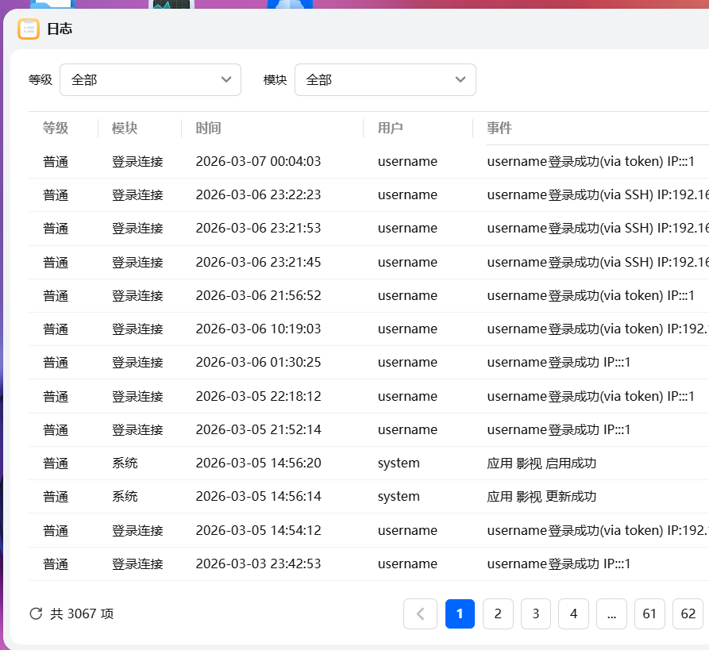

在飞牛OS部署MCP服务拉取系统日志
---

# 前言
最近 AI 再次成为热点，而 MCP 的出现在一定程度上弥补了大模型与外部系统交互能力的不足。  
借助 MCP，模型不再只是生成文本，而是可以直接调用外部服务，从而真正参与到实际系统的操作与管理中。

本文通过一个简单示例，演示如何部署一个 MCP 服务，并为 AI 提供获取飞牛系统日志的能力。

# 服务代码
<details>

<summary>被折叠的代码</summary>

```python
#!/usr/bin/env python3
# -*- coding: utf-8 -*-
"""
trimrpc MCP Server — fnOS 系统管理 MCP 工具服务
================================================

通过 Streamable HTTP 传输提供 fnOS 系统管理能力的 MCP 工具服务器。
内置 trimrpc 二进制协议栈，通过 Unix Domain Socket 与本机 fnOS
RPC 服务通信。零外部依赖，仅使用 Python 标准库。

可用工具:
  get_system_logs    获取系统事件日志 (登录、配置变更、SSH 等)
  trimrpc_call       通用 trimrpc RPC 调用 (任意服务/方法)
  discover_services  发现可用的 RPC 服务

用法:
  python3 report-trimrpc-mcp-202603062124.py                  # 默认 0.0.0.0:9800
  python3 report-trimrpc-mcp-202603062124.py --port 8080      # 自定义端口
  python3 report-trimrpc-mcp-202603062124.py --host 127.0.0.1 # 仅本机
  python3 report-trimrpc-mcp-202603062124.py --list-tools     # 列出工具
  python3 report-trimrpc-mcp-202603062124.py -v               # 调试日志

MCP 客户端配置 (Claude Code settings / .mcp.json):
  {
    "mcpServers": {
      "fnos": {
        "url": "http://<fnOS-IP>:9800/mcp"
      }
    }
  }
"""

import sys
import json
import struct
import socket
import os
import time
import uuid
import threading
import logging
from http.server import HTTPServer, BaseHTTPRequestHandler
from socketserver import ThreadingMixIn

# ═══════════════════════════════════════════════════════════════════
# 日志
# ═══════════════════════════════════════════════════════════════════

logging.basicConfig(
    stream=sys.stderr,
    level=logging.INFO,
    format='[trimrpc-mcp] %(levelname)s %(message)s',
)
log = logging.getLogger('trimrpc-mcp')


# ═══════════════════════════════════════════════════════════════════
# trimrpc 二进制协议核心
#
# 协议格式: 30 字节固定头部 + 4 段变长数据
# 传输层:   Unix Domain Socket (AF_UNIX, SOCK_STREAM)
# ═══════════════════════════════════════════════════════════════════

CPRT_MAGIC       = 0x54525043       # "CPRT" little-endian
PROTOCOL_VERSION = 1
HEADER_SIZE      = 30

BROKER_SERVICE   = "com.trim.rpcbroker"
BROKER_UDS_PATHS = [
    "/run/trim_app_cgi/rpcbroker",
]
DEFAULT_TIMEOUT      = 10
SERVICE_PREFIX       = "com."
MAX_SERVICE_NAME_LEN = 128

_sid_counter = 0
_sid_lock    = threading.Lock()


def _next_session_id():
    global _sid_counter
    with _sid_lock:
        _sid_counter += 1
        return _sid_counter


class RpcPacket:
    """
    trimrpc 二进制数据包。

    头部 (30 字节, little-endian):
      magic(4) + version(2) + session_id(8) +
      data_len(2) + token_len(2) +
      extra_data_len(4) + reserved(4) + extra_data2_len(4)

    数据段: [data] + [token] + [extra_data(JSON 载荷)] + [extra_data2]
    """
    HEADER_FMT = '<IHQHHIII'

    def __init__(self):
        self.magic = CPRT_MAGIC
        self.version = PROTOCOL_VERSION
        self.session_id = 0
        self.data = b''          # Section 0: 调用方 UUID
        self.token = b''         # Section 1: 认证令牌
        self.extra_data = b''    # Section 2: JSON 载荷
        self.extra_data2 = b''   # Section 3: 扩展数据

    def serialize(self):
        header = struct.pack(
            self.HEADER_FMT,
            self.magic, self.version, self.session_id,
            len(self.data), len(self.token),
            len(self.extra_data), 0, len(self.extra_data2),
        )
        return header + self.data + self.token + self.extra_data + self.extra_data2

    @classmethod
    def deserialize(cls, raw):
        if len(raw) < HEADER_SIZE:
            raise ValueError(f"数据不足: 需要 {HEADER_SIZE} 字节, 实际 {len(raw)}")
        pkt = cls()
        (
            pkt.magic, pkt.version, pkt.session_id,
            d_len, t_len, e_len, _, e2_len,
        ) = struct.unpack(cls.HEADER_FMT, raw[:HEADER_SIZE])
        if pkt.magic != CPRT_MAGIC:
            raise ValueError(f"协议魔数不匹配: 0x{pkt.magic:08X}")
        off = HEADER_SIZE
        pkt.data        = raw[off:off + d_len];  off += d_len
        pkt.token       = raw[off:off + t_len];  off += t_len
        pkt.extra_data  = raw[off:off + e_len];  off += e_len
        pkt.extra_data2 = raw[off:off + e2_len]
        return pkt

    def get_json_payload(self):
        if self.extra_data:
            return self.extra_data.decode('utf-8', errors='replace')
        if self.data:
            return self.data.decode('utf-8', errors='replace')
        return ''


def _recv_all(sock, size, timeout=DEFAULT_TIMEOUT):
    sock.settimeout(timeout)
    buf = b''
    while len(buf) < size:
        try:
            chunk = sock.recv(size - len(buf))
        except socket.timeout:
            raise TimeoutError(f"接收超时 ({timeout}s): {len(buf)}/{size} 字节")
        if not chunk:
            raise ConnectionError(f"连接断开: {len(buf)}/{size} 字节")
        buf += chunk
    return buf


def send_rpc_packet(uds_path, packet, timeout=DEFAULT_TIMEOUT):
    """通过 Unix Domain Socket 发送 RpcPacket 并接收响应"""
    sock = socket.socket(socket.AF_UNIX, socket.SOCK_STREAM)
    sock.settimeout(timeout)
    try:
        sock.connect(uds_path)
        sock.sendall(packet.serialize())
        resp_header = _recv_all(sock, HEADER_SIZE, timeout)
        (
            _, _, _, d_len, t_len, e_len, _, e2_len,
        ) = struct.unpack(RpcPacket.HEADER_FMT, resp_header)
        total = d_len + t_len + e_len + e2_len
        resp_body = _recv_all(sock, total, timeout) if total > 0 else b''
        return RpcPacket.deserialize(resp_header + resp_body)
    except FileNotFoundError:
        raise ConnectionError(f"UDS 不存在: {uds_path} (RPC 服务可能未运行)")
    except PermissionError:
        raise ConnectionError(f"无权限连接: {uds_path}")
    finally:
        sock.close()


def build_reqid():
    ts = int(time.time() * 1000000)
    return format(ts & 0xFFFFFFFFFFFFFFFF, '016x')


def build_rpc_request(service, method, params=None, caller_uuid=None):
    if len(service) > MAX_SERVICE_NAME_LEN:
        raise ValueError(f"服务名超过 {MAX_SERVICE_NAME_LEN} 字节")
    if not service.startswith(SERVICE_PREFIX):
        raise ValueError(f'服务名必须以 "{SERVICE_PREFIX}" 开头')

    json_payload = {
        "data": {
            "req": f"{service}.{method}",
            "pid": os.getpid(),
            "reqid": build_reqid(),
        }
    }
    if params:
        json_payload["data"].update(params)

    pkt = RpcPacket()
    pkt.session_id = _next_session_id()
    pkt.data = (caller_uuid or str(uuid.uuid4()).upper()).encode('utf-8')
    pkt.extra_data = json.dumps(json_payload, separators=(',', ':')).encode('utf-8')
    return pkt


class RpcClient:
    """trimrpc RPC 客户端 — 自动服务发现与调用"""

    def __init__(self, caller_uuid=None, caller_service="com.trim.pyclient",
                 timeout=DEFAULT_TIMEOUT, broker_uds=None):
        self.uuid = caller_uuid or str(uuid.uuid4()).upper()
        self.caller_service = caller_service
        self.timeout = timeout
        self.broker_uds = broker_uds or self._find_broker()
        self.services = {
            BROKER_SERVICE: {"name": BROKER_SERVICE, "uds": self.broker_uds},
        }

    def _find_broker(self):
        for p in BROKER_UDS_PATHS:
            if os.path.exists(p):
                return p
        return BROKER_UDS_PATHS[0]

    def apply_permission(self, target_services):
        if isinstance(target_services, str):
            target_services = [target_services]
        pkt = build_rpc_request(
            BROKER_SERVICE, "apply",
            {"services": target_services},
            caller_uuid=self.uuid,
        )
        resp_pkt = send_rpc_packet(self.broker_uds, pkt, self.timeout)
        resp_str = resp_pkt.get_json_payload()
        if not resp_str:
            raise RuntimeError("Broker 返回空响应")
        resp = json.loads(resp_str)
        resp_data = resp.get("data", resp)
        if resp_data.get("result") != "succ":
            raise RuntimeError(
                f"ApplyPermission 失败: {json.dumps(resp_data, ensure_ascii=False)}"
            )
        for svc in resp_data.get("data", []):
            sid = svc.get("id", "")
            if sid:
                self.services[sid] = svc
        return resp_data.get("data", [])

    def call(self, service, method, params=None):
        svc_info = self.services.get(service)
        if not svc_info:
            self.apply_permission([service])
            svc_info = self.services.get(service)
            if not svc_info:
                raise RuntimeError(f"服务未找到: {service}")
        uds_path = svc_info.get("uds", "")
        if not uds_path:
            raise RuntimeError(f"服务 {service} 无 UDS 路径")
        pkt = build_rpc_request(service, method, params, caller_uuid=self.uuid)
        token = svc_info.get("token", "")
        if token:
            pkt.token = token.encode('utf-8')
        resp_pkt = send_rpc_packet(uds_path, pkt, self.timeout)
        resp_str = resp_pkt.get_json_payload()
        return json.loads(resp_str) if resp_str else {}


# ═══════════════════════════════════════════════════════════════════
# MCP 工具定义与实现
# ═══════════════════════════════════════════════════════════════════

MCP_TOOLS = [
    {
        "name": "get_system_logs",
        "description": (
            "获取 fnOS 系统事件日志。返回系统操作记录，包括用户登录、"
            "系统配置变更、SSH 连接等事件。支持分页和按模块筛选。"
        ),
        "inputSchema": {
            "type": "object",
            "properties": {
                "page": {
                    "type": "integer",
                    "description": "页码，从 1 开始",
                    "default": 1,
                },
                "pageSize": {
                    "type": "integer",
                    "description": "每页条数，范围 1-100",
                    "default": 20,
                },
                "module": {
                    "type": "integer",
                    "description": "模块筛选: -1 表示全部模块",
                    "default": -1,
                },
            },
        },
    },
    {
        "name": "trimrpc_call",
        "description": (
            "通用 fnOS trimrpc RPC 调用。通过 RPC Broker 调用 fnOS 上的"
            "任意已注册 RPC 服务。服务名必须以 'com.' 开头。"
            "示例: service='com.trim.storage', method='get_info'"
        ),
        "inputSchema": {
            "type": "object",
            "properties": {
                "service": {
                    "type": "string",
                    "description": "目标服务名，如 'com.trim.storage'",
                },
                "method": {
                    "type": "string",
                    "description": "方法名，如 'get_info' 或 'common.list'",
                },
                "params": {
                    "type": "object",
                    "description": "调用参数",
                    "default": {},
                },
            },
            "required": ["service", "method"],
        },
    },
    {
        "name": "discover_services",
        "description": (
            "发现 fnOS 上可用的 RPC 服务。查询 RPC Broker 获取服务路由信息，"
            "包括 UDS 路径、IP、类型、认证令牌等。"
        ),
        "inputSchema": {
            "type": "object",
            "properties": {
                "services": {
                    "type": "array",
                    "items": {"type": "string"},
                    "description": (
                        "要查询的服务名列表。"
                        "示例: ['com.trim.storage', 'com.trim.main']"
                    ),
                    "default": [],
                },
            },
        },
    },
]

# ── 全局 RPC 客户端 ──

_rpc_client = None
_rpc_client_lock = threading.Lock()
_broker_uds_override = None  # 由 --broker-uds 设置


def _get_client():
    global _rpc_client
    with _rpc_client_lock:
        if _rpc_client is None:
            _rpc_client = RpcClient(broker_uds=_broker_uds_override)
            log.info(f"RPC 客户端初始化, Broker: {_rpc_client.broker_uds}")
        return _rpc_client


# ── 工具处理函数 ──

def tool_get_system_logs(arguments):
    page      = max(1, arguments.get("page", 1))
    page_size = max(1, min(100, arguments.get("pageSize", 20)))
    module    = arguments.get("module", -1)

    result = _get_client().call(
        "com.trim.eventlogger",
        "common.list",
        {"pageSize": page_size, "page": page, "module": module},
    )
    return json.dumps(result, indent=2, ensure_ascii=False)


def tool_trimrpc_call(arguments):
    service = arguments.get("service", "")
    method  = arguments.get("method", "")
    params  = arguments.get("params", {})
    if not service:
        raise ValueError("缺少必填参数 'service'")
    if not method:
        raise ValueError("缺少必填参数 'method'")

    result = _get_client().call(service, method, params if params else None)
    return json.dumps(result, indent=2, ensure_ascii=False)


def tool_discover_services(arguments):
    services = arguments.get("services", [])
    client = _get_client()

    if not services:
        try:
            pkt = build_rpc_request(
                BROKER_SERVICE, "list", {}, caller_uuid=client.uuid,
            )
            resp_pkt = send_rpc_packet(client.broker_uds, pkt, client.timeout)
            resp_str = resp_pkt.get_json_payload()
            if resp_str:
                return json.dumps(json.loads(resp_str), indent=2, ensure_ascii=False)
        except Exception:
            pass
        services = [BROKER_SERVICE]

    result = client.apply_permission(services)
    return json.dumps(result, indent=2, ensure_ascii=False)


TOOL_HANDLERS = {
    "get_system_logs":   tool_get_system_logs,
    "trimrpc_call":      tool_trimrpc_call,
    "discover_services": tool_discover_services,
}


# ═══════════════════════════════════════════════════════════════════
# MCP JSON-RPC 处理
# ═══════════════════════════════════════════════════════════════════

MCP_PROTOCOL_VERSION = "2024-11-05"
SERVER_INFO = {"name": "trimrpc-mcp", "version": "1.0.0"}


def process_jsonrpc(msg):
    """
    处理一条 JSON-RPC 2.0 消息，返回响应 dict 或 None (通知无需响应)。
    """
    msg_id = msg.get("id")
    method = msg.get("method", "")
    params = msg.get("params") or {}

    # 通知 (无 id) 不需要回复
    if msg_id is None:
        log.debug(f"通知: {method}")
        return None

    def _result(result):
        return {"jsonrpc": "2.0", "id": msg_id, "result": result}

    def _error(code, message):
        return {"jsonrpc": "2.0", "id": msg_id, "error": {"code": code, "message": message}}

    if method == "initialize":
        return _result({
            "protocolVersion": MCP_PROTOCOL_VERSION,
            "capabilities": {"tools": {}},
            "serverInfo": SERVER_INFO,
        })

    if method == "ping":
        return _result({})

    if method == "tools/list":
        return _result({"tools": MCP_TOOLS})

    if method == "tools/call":
        tool_name = params.get("name", "")
        arguments = params.get("arguments", {})
        handler = TOOL_HANDLERS.get(tool_name)
        if not handler:
            return _error(-32602, f"未知工具: {tool_name}")
        try:
            text = handler(arguments)
            return _result({"content": [{"type": "text", "text": text}]})
        except Exception as e:
            log.error(f"工具 {tool_name} 执行失败: {e}")
            return _result({
                "content": [{"type": "text", "text": f"错误: {e}"}],
                "isError": True,
            })

    return _error(-32601, f"方法不存在: {method}")


# ═══════════════════════════════════════════════════════════════════
# HTTP 传输层 (Streamable HTTP)
#
# POST /mcp → 发送 JSON-RPC 请求, 直接返回 JSON 响应
# ═══════════════════════════════════════════════════════════════════


class ThreadedHTTPServer(ThreadingMixIn, HTTPServer):
    daemon_threads = True
    allow_reuse_address = True


class McpRequestHandler(BaseHTTPRequestHandler):

    def log_message(self, fmt, *args):
        log.debug(f"{self.client_address[0]} {fmt % args}")

    def _cors_headers(self):
        self.send_header('Access-Control-Allow-Origin', '*')
        self.send_header('Access-Control-Allow-Methods', 'GET, POST, DELETE, OPTIONS')
        self.send_header('Access-Control-Allow-Headers', 'Content-Type')

    def _json_response(self, code, obj):
        body = json.dumps(obj, ensure_ascii=False).encode('utf-8')
        self.send_response(code)
        self.send_header('Content-Type', 'application/json')
        self.send_header('Content-Length', str(len(body)))
        self._cors_headers()
        self.end_headers()
        self.wfile.write(body)

    def do_OPTIONS(self):
        self.send_response(200)
        self._cors_headers()
        self.end_headers()

    def do_DELETE(self):
        self.send_response(200)
        self._cors_headers()
        self.end_headers()

    def do_GET(self):
        self._json_response(200, {
            "name": SERVER_INFO["name"],
            "version": SERVER_INFO["version"],
            "status": "running",
            "tools": [t["name"] for t in MCP_TOOLS],
        })

    def do_POST(self):
        content_len = int(self.headers.get('Content-Length', 0))
        if content_len == 0:
            self._json_response(400, {"error": "Empty body"})
            return

        try:
            body = self.rfile.read(content_len)
            msg = json.loads(body)
        except (json.JSONDecodeError, UnicodeDecodeError) as e:
            self._json_response(400, {"error": f"Invalid JSON: {e}"})
            return

        log.debug(f"← {msg.get('method', '?')} (id={msg.get('id')})")
        response = process_jsonrpc(msg)
        if response is not None:
            self._json_response(200, response)
        else:
            self.send_response(202)
            self._cors_headers()
            self.end_headers()


# ═══════════════════════════════════════════════════════════════════
# 入口
# ═══════════════════════════════════════════════════════════════════

def main():
    import argparse
    parser = argparse.ArgumentParser(
        description="trimrpc MCP Server — fnOS 系统管理工具",
        formatter_class=argparse.RawDescriptionHelpFormatter,
        epilog="""
示例:
  %(prog)s                          # 默认 0.0.0.0:9800
  %(prog)s --port 8080              # 自定义端口
  %(prog)s --host 127.0.0.1         # 仅允许本机访问
  %(prog)s --broker-uds /tmp/rpc/rpcbroker

MCP 配置:
  {"mcpServers": {"fnos": {"url": "http://<IP>:9800/mcp"}}}
""",
    )
    parser.add_argument('--host', default='0.0.0.0', help='监听地址 (默认: 0.0.0.0)')
    parser.add_argument('--port', type=int, default=9800, help='监听端口 (默认: 9800)')
    parser.add_argument('--broker-uds', default=None, help='指定 RPC Broker UDS 路径')
    parser.add_argument('--list-tools', action='store_true', help='列出可用工具并退出')
    parser.add_argument('-v', '--verbose', action='store_true', help='调试日志')
    args = parser.parse_args()

    if args.verbose:
        logging.getLogger().setLevel(logging.DEBUG)

    if args.list_tools:
        print("trimrpc MCP Server 可用工具:\n")
        for t in MCP_TOOLS:
            print(f"  {t['name']}")
            print(f"    {t['description']}")
            schema = t.get("inputSchema", {})
            props = schema.get("properties", {})
            if props:
                print("    参数:")
                for k, v in props.items():
                    req = "必填" if k in schema.get("required", []) else "可选"
                    desc = v.get("description", "")
                    default = v.get("default")
                    default_str = f", 默认={default}" if default is not None else ""
                    print(f"      {k} ({req}{default_str}): {desc}")
            print()
        return

    global _broker_uds_override
    _broker_uds_override = args.broker_uds

    server = ThreadedHTTPServer((args.host, args.port), McpRequestHandler)
    host_display = args.host if args.host != '0.0.0.0' else '<IP>'
    print(f"trimrpc MCP Server 已启动")
    print(f"  监听: http://{args.host}:{args.port}")
    print(f"  端点: POST http://{host_display}:{args.port}/mcp")
    print(f"  工具: {', '.join(t['name'] for t in MCP_TOOLS)}")
    if args.broker_uds:
        print(f"  Broker: {args.broker_uds}")
    print(f'\n  MCP 配置: {{"mcpServers": {{"fnos": {{"url": "http://{host_display}:{args.port}/mcp"}}}}}}')
    print()

    try:
        server.serve_forever()
    except KeyboardInterrupt:
        print("\n正在关闭...")
        server.shutdown()


if __name__ == '__main__':
    main()

```

</details>
# 部署
将代码复制到任意可执行目录中，这里文件名为：

`report-trimrpc-mcp-202603062124.py`

直接运行即可：
```text
Linux fnos 6.12.18-trim #211 SMP PREEMPT_DYNAMIC Fri Jan 30 17:47:53 CST 2026 x86_64
Last login: Fri Mar  6 23:21:46 2026 from 192.168.2.12
username@fnos:~$ python3 report-trimrpc-mcp-202603062124.py 
trimrpc MCP Server 已启动
  监听: http://0.0.0.0:9800
  端点: POST http://<IP>:9800/mcp
  工具: get_system_logs, trimrpc_call, discover_services

  MCP 配置: {"mcpServers": {"fnos": {"url": "http://<IP>:9800/mcp"}}}

```
启动后，一个简单的 MCP HTTP 服务就已经运行，并对外提供三个工具接口：

get_system_logs：获取系统日志  
trimrpc_call：通用 RPC 调用  
discover_services：发现可用 RPC 服务  

# 给AI配置MCP
使用 Claude CLI 添加 MCP 服务：
```shell
claude mcp add --transport http fnos http://192.168.2.254:9800/mcp
```
执行命令后，CLI 会将 MCP 配置写入本地配置文件：
```text
PS C:\> claude mcp add --transport http fnos http://192.168.2.254:9800/mcp
Added HTTP MCP server fnos with URL: http://192.168.2.254:9800/mcp to local config
File modified: C:\Users\admin\.claude.json [project: C:\]
PS C:\> claude mcp get fnos
fnos:
  Scope: Local config (private to you in this project)
  Status: ✗ Failed to connect
  Type: http
  URL: http://192.168.2.254:9800/mcp

To remove this server, run: claude mcp remove "fnos" -s local
Assertion failed: !(handle->flags & UV_HANDLE_CLOSING), file src\win\async.c, line 76
```

# 调用MCP能力
我们先看看当前的日志  


配置完成后，在 Claude CLI 中即可直接调用 MCP 提供的能力：  
让我们直接获取一下日志信息

```text
PS E:\workspace\fnos\demod1> claude

╭─── Claude Code v2.1.70 ───────────────────────────────────────────────────────────────────────────────────────────╮
│                                               │ Tips for getting started                                          │
│                 Welcome back!                 │ Run /init to create a CLAUDE.md file with instructions for Claude │
│                                               │ ───────────────────────────────────────────────────────────────── │
│                                               │ Recent activity                                                   │
│                    ▐▛███▜▌                    │ No recent activity                                                │
│                   ▝▜█████▛▘                   │                                                                   │
│                     ▘▘ ▝▝                     │                                                                   │
│   Opus 4.6 (1M context) · API Usage Billing   │                                                                   │
│           E:\workspace\fnos\demod1            │                                                                   │
╰───────────────────────────────────────────────────────────────────────────────────────────────────────────────────╯

  Welcome to Opus 4.6

❯ /mcp
  ⎿  MCP dialog dismissed

❯ 获取fnos的mcp全部功能，以列表形式列出

● Based on the available MCP tools, here are all fnOS MCP functions:

  ┌─────┬──────────────────────────────┬──────────────────────────────────────────────────────────────────────────────────────────────────────────────┐
  │  #  │           Function           │                                                 Description                                                  │
  ├─────┼──────────────────────────────┼──────────────────────────────────────────────────────────────────────────────────────────────────────────────┤
  │ 1   │ mcp__fnos__get_system_logs   │ 获取 fnOS 系统事件日志。返回系统操作记录，包括用户登录、系统配置变更、SSH 连接等事件。支持分页和按模块筛选。 │
  ├─────┼──────────────────────────────┼──────────────────────────────────────────────────────────────────────────────────────────────────────────────┤
  │ 2   │ mcp__fnos__trimrpc_call      │ 通用 fnOS trimrpc RPC 调用。通过 RPC Broker 调用 fnOS 上的任意已注册 RPC 服务。服务名必须以 com. 开头。      │
  ├─────┼──────────────────────────────┼──────────────────────────────────────────────────────────────────────────────────────────────────────────────┤
  │ 3   │ mcp__fnos__discover_services │ 发现 fnOS 上可用的 RPC 服务。查询 RPC Broker 获取服务路由信息，包括 UDS 路径、IP、类型、认证令牌等。         │
  └─────┴──────────────────────────────┴──────────────────────────────────────────────────────────────────────────────────────────────────────────────┘

  参数详情

  get_system_logs:
  - module (int, 默认 -1) — 模块筛选，-1 表示全部模块
  - page (int, 默认 1) — 页码，从 1 开始
  - pageSize (int, 默认 20) — 每页条数，范围 1-100

  trimrpc_call:
  - service (string, 必填) — 目标服务名，如 com.trim.storage
  - method (string, 必填) — 方法名，如 get_info
  - params (object, 默认 {}) — 调用参数

  discover_services:
  - services (string[], 默认 []) — 要查询的服务名列表，如 ['com.trim.storage']

  核心能力是通过 discover_services 发现可用服务，再通过 trimrpc_call 调用具体服务方法，以及通过 get_system_logs 查看系统日志。

❯  获取最新的12条日志

● fnos - get_system_logs (MCP)(page: 1, pageSize: 12)
  ⎿  {
       "data": {
         "data": {
     … +73 lines (ctrl+o to expand)

● 最新 12 条系统日志（共 3067 条）：

  ┌─────┬─────────────────────┬──────────┬──────┬──────────────────────────────────────┐
  │  #  │        时间         │   用户   │ 模块 │               事件内容               │
  ├─────┼─────────────────────┼──────────┼──────┼──────────────────────────────────────┤
  │ 1   │ 2026-03-04 18:44:03 │ username │ 登录 │ 登录成功(via token) IP:::1           │
  ├─────┼─────────────────────┼──────────┼──────┼──────────────────────────────────────┤
  │ 2   │ 2026-03-04 18:02:23 │ username │ 登录 │ 登录成功(via SSH) IP:192.168.2.12    │
  ├─────┼─────────────────────┼──────────┼──────┼──────────────────────────────────────┤
  │ 3   │ 2026-03-04 18:01:53 │ username │ 登录 │ 登录成功(via SSH) IP:192.168.2.12    │
  ├─────┼─────────────────────┼──────────┼──────┼──────────────────────────────────────┤
  │ 4   │ 2026-03-04 18:01:45 │ username │ 登录 │ 登录成功(via SSH) IP:192.168.2.12    │
  ├─────┼─────────────────────┼──────────┼──────┼──────────────────────────────────────┤
  │ 5   │ 2026-03-04 16:36:52 │ username │ 登录 │ 登录成功(via token) IP:::1           │
  ├─────┼─────────────────────┼──────────┼──────┼──────────────────────────────────────┤
  │ 6   │ 2026-03-04 04:59:03 │ username │ 登录 │ 登录成功(via token) IP:192.168.2.12  │
  ├─────┼─────────────────────┼──────────┼──────┼──────────────────────────────────────┤
  │ 7   │ 2026-03-03 20:10:25 │ username │ 登录 │ 登录成功 IP:::1                      │
  ├─────┼─────────────────────┼──────────┼──────┼──────────────────────────────────────┤
  │ 8   │ 2026-03-03 16:58:12 │ username │ 登录 │ 登录成功(via token) IP:::1           │
  ├─────┼─────────────────────┼──────────┼──────┼──────────────────────────────────────┤
  │ 9   │ 2026-03-03 16:32:14 │ username │ 登录 │ 登录成功 IP:::1                      │
  ├─────┼─────────────────────┼──────────┼──────┼──────────────────────────────────────┤
  │ 10  │ 2026-03-03 09:36:20 │ system   │ 系统 │ 应用 影视 启用成功                   │
  ├─────┼─────────────────────┼──────────┼──────┼──────────────────────────────────────┤
  │ 11  │ 2026-03-03 09:36:14 │ system   │ 系统 │ 应用 影视 更新成功                   │
  ├─────┼─────────────────────┼──────────┼──────┼──────────────────────────────────────┤
  │ 12  │ 2026-03-03 09:34:12 │ username │ 登录 │ 登录成功(via token) IP:192.168.2.217 │
  └─────┴─────────────────────┴──────────┴──────┴──────────────────────────────────────┘

❯ discover_services

● fnos - discover_services (MCP)
  ⎿  {
       "data": {
         "errno": 100000004,
     … +6 lines (ctrl+o to expand)

● 空列表查询失败，让我尝试查询一些常见的 fnOS 服务。

● fnos - discover_services (MCP)(services: ["com.trim.storage","com.trim.main","com.trim.eventlogger","com.trim.docker","com.trim.network","com.trim.user","com.trim.system
                                ","com.trim.app","com.trim.filemanager","com.trim.share","com.trim.rpcbroker","com.trim.notify","com.trim.backup","com.trim.disk","com.trim
                                .power","com.trim.update","com.trim.samba","com.trim.nfs","com.trim.webdav","com.trim.ddns"])
  ⎿  [
       {
         "id": "com.trim.main",
     … +31 lines (ctrl+o to expand)

● 发现了部分服务，让我再探索更多。

● fnos - discover_services (MCP)(services: ["com.trim.storage.manager","com.trim.usb","com.trim.raid","com.trim.smart","com.trim.ftp","com.trim.rsync","com.trim.vpn","com.
                                trim.firewall","com.trim.dns","com.trim.certificate","com.trim.task","com.trim.cron","com.trim.log","com.trim.monitor","com.trim.alert","co
                                m.trim.plugin","com.trim.appstore","com.trim.vm","com.trim.photo","com.trim.music"])
  ⎿  []

● fnos - discover_services (MCP)(services: ["com.trim.filemanager.ui","com.trim.file","com.trim.smb","com.trim.afp","com.trim.iscsi","com.trim.power.manager","com.trim.acc
                                ount","com.trim.auth","com.trim.gateway","com.trim.proxy","com.trim.scheduler","com.trim.media","com.trim.download","com.trim.sync","com.tr
                                im.cloud","com.trim.notification","com.trim.hardware","com.trim.firmware","com.trim.config","com.trim.service"])
  ⎿  []

● 以下是在 fnOS 上发现的可用 RPC 服务：

  ┌─────┬──────────────────────┬─────────────────────────┬───────────────────────────────┬──────┐
  │  #  │       服务 ID        │          名称           │           UDS 路径            │ 类型 │
  ├─────┼──────────────────────┼─────────────────────────┼───────────────────────────────┼──────┤
  │ 1   │ com.trim.main        │ TRIM Service            │ /run/trim_srv.socket          │ 1    │
  ├─────┼──────────────────────┼─────────────────────────┼───────────────────────────────┼──────┤
  │ 2   │ com.trim.eventlogger │ Logger Service          │ /run/trim_app_cgi/eventlogger │ 0    │
  ├─────┼──────────────────────┼─────────────────────────┼───────────────────────────────┼──────┤
  │ 3   │ com.trim.network     │ Network Manager Service │ /run/trim_app_cgi/network     │ 0    │
  ├─────┼──────────────────────┼─────────────────────────┼───────────────────────────────┼──────┤
  │ 4   │ com.trim.share       │ Share File Service      │ /run/trim_app_cgi/share       │ 0    │
  └─────┴──────────────────────┴─────────────────────────┴───────────────────────────────┴──────┘

  共发现 4 个已注册的 RPC 服务：
  - com.trim.main — 核心主服务
  - com.trim.eventlogger — 事件日志服务（系统日志查询）
  - com.trim.network — 网络管理服务
  - com.trim.share — 文件共享服务

───────────────────────────────────────────────────────────────────────────────────────────────────────────────────────────────────────────────────────────────────── ▪▪▪ ─
❯ 调用 com.trim.main 的方法看看有哪些功能
───────────────────────────────────────────────────────────────────────────────────────────────────────────────────────────────────────────────────────────────────────────
  ? for shortcuts
```

# 结束语
MCP 的出现，使大模型具备了调用外部服务的能力。  
从某种意义上来说，这让模型不再只是“回答问题”，而是开始具备与真实系统交互的能力。

不过，这也带来了新的问题。

如果某一天 AI 误操作，或者逻辑出现偏差，通过 MCP 调用接口删除了系统中的关键数据，该如何处理？

在无法很好解决这种风险之前，大模型与现实系统之间的深度交互，仍然需要谨慎对待。

不过在考虑AI之前，不知道本地应用如果直接调用trimrpc会有应用中心上架的合规风险吗？  
```text
username@fnos:~$ ls -la /run/trim_app_cgi/rpcbroker
srwxrw-rw- 1 root root 0 Feb 27 10:37 /run/trim_app_cgi/rpcbroker
```
<details>

<summary>这些都是废话，不建议浪费时间看</summary>

# trimrpc

## 0. 术语缩写

| 缩写 | 含义 |
|------|------|
| SSO | Small String Optimization, libstdc++ 在 `sizeof(std::string) = 32` 时内联 15 字节以下字符串 |
| RB-tree | `std::_Rb_tree`, GCC libstdc++ 红黑树实现, 用于 `std::map` |
| DCL | Double-Checked Locking, 双重检查锁定单例模式 |
| UDS | Unix Domain Socket |
| vtable | C++ 虚函数表, 通过 `[rdi]` 间接调用 |
| PLT/GOT | Procedure Linkage Table / Global Offset Table, ELF 延迟绑定机制 |

---

## 1. 体系结构概述

trimrpc 是 fnOS 自研的本地 IPC 框架。客户端通过 `RpcClient` API 向目标服务发起 RPC 调用, 底层通过 UDS 传输二进制编码的数据包。框架支持双协议栈: **RpcPacket** (30 字节固定头, 面向 AppCgi 型服务, `ServiceType=0`) 和 **TrimSrv** (12 字节头, 面向 TrimSrv 型服务, `ServiceType=1`)。

所有服务通过中央 Broker (`/run/trim_app_cgi/rpcbroker`) 进行注册与发现。客户端先向 Broker 申请权限获取目标服务的 UDS 路径和服务类型, 随后直连目标服务进行 RPC 通信 — 这是服务发现模式, Broker 不参与后续数据转发。

```
            调用层                                    传输层
 ┌───────────────────────┐            ┌──────────────────────────────┐
 │  RpcClient  (0x259b0) │            │  RpcConnections  (singleton) │
 │    ├ Call()   0x25bf0  │ ─Caller──▶│    ├ Init()    0x196b0       │
 │    ├ Apply() 0x27740  │  0x15480   │    ├ Connect() 0x1a920       │
 │    └ Verify  0x256c0  │            │    ├ Send()    0x192d0       │
 └───────────────────────┘            │    └ OnRecv()  0x17490       │
                                      └───────────┬────────────────┘
                                                   │ ne* 网络引擎
                                                   ▼
                                        Unix Domain Socket
                                      /var/run/rpc/<service>
```

---

## 2. RpcPacket 二进制协议解析

### 2.1 RpcPacket::RpcPacket() — 构造函数 @ 0x1DDF0

此函数初始化一个 0xA8 字节的 RpcPacket 对象, 写入 magic 常量和协议版本, 并设置四个 SSO 字符串的内联指针。

```asm
; trimrpc::RpcPacket::RpcPacket(void)
; 对象大小 = 0xA8 (168 字节)
; rdi = this 指针

_ZN7trimrpc9RpcPacketC2Ev:
  1ddf0  mov  rax, cs:_ZTVN7trimrpc9RpcPacketE_ptr  ; 加载 RpcPacket vtable 地址
  1ddf7  mov  dword ptr [rdi+8], 54525043h           ; [this+0x08] = magic = 0x54525043
                                                      ;   即 ASCII "CPRT" (little-endian)
  1ddfe  mov  qword ptr [rdi+10h], 0                 ; [this+0x10] = session_id = 0
  1de06  add  rax, 10h                               ; 跳过 RTTI 偏移, 指向第一个虚函数
  1de0a  mov  qword ptr [rdi+18h], 0                 ; [this+0x18] = data_len/token_len = 0
  1de12  mov  [rdi], rax                             ; [this+0x00] = vtable 指针

  ; version 字段 (2 字节)
  1de15  mov  eax, 1
  1de1a  mov  [rdi+0Ch], ax                          ; [this+0x0C] = version = 1

  ; 初始化四个 SSO 字符串的内联缓冲区指针
  ; 每个 std::string 占 32 字节: [ptr(8) + size(8) + inline_buf(16)]
  1de1e  lea  rax, [rdi+38h]                         ; data 字符串的内联缓冲区
  1de22  mov  [rdi+28h], rax                         ; [this+0x28].ptr = &this->inline_buf_data
  1de26  lea  rax, [rdi+58h]                         ; token 字符串
  1de2a  mov  [rdi+48h], rax                         ; [this+0x48].ptr = &this->inline_buf_token
  1de2e  lea  rax, [rdi+78h]                         ; extra_data 字符串
  1de32  mov  [rdi+68h], rax                         ; [this+0x68].ptr = &this->inline_buf_extra
  1de36  lea  rax, [rdi+98h]                         ; extra_data2 字符串
  1de3d  mov  [rdi+88h], rax                         ; [this+0x88].ptr = &this->inline_buf_extra2

  ; reserved 字段
  1de44  mov  eax, cs:dword_315F4                    ; 加载全局默认 reserved 值
  1de4a  mov  dword ptr [rdi+24h], 0                 ; [this+0x24] = extra_data2_len = 0

  ; 将四个字符串置空 (size=0, inline_buf[0]='\0')
  1de51  mov  qword ptr [rdi+30h], 0                 ; data.size = 0
  1de59  mov  byte ptr [rdi+38h], 0                  ; data.inline_buf[0] = '\0'
  1de5d  mov  qword ptr [rdi+50h], 0                 ; token.size = 0
  1de65  mov  byte ptr [rdi+58h], 0                  ; token.inline_buf[0] = '\0'
  1de69  mov  qword ptr [rdi+70h], 0                 ; extra_data.size = 0
  1de71  mov  byte ptr [rdi+78h], 0                  ; extra_data.inline_buf[0] = '\0'
  1de75  mov  qword ptr [rdi+90h], 0                 ; extra_data2.size = 0
  1de80  mov  byte ptr [rdi+98h], 0                  ; extra_data2.inline_buf[0] = '\0'
  1de87  mov  [rdi+20h], eax                         ; [this+0x20] = reserved (从全局)
  1de8a  retn
```

**对象内存布局 (0xA8 字节)**:

```
偏移      大小  字段
───────── ───── ──────────────────────────────
0x00      8     vtable*
0x08      4     magic           = 0x54525043 ("CPRT")
0x0C      2     version         = 1
0x0E      2     (padding)
0x10      8     session_id      (8 字节会话标识)
0x18      2     data_len
0x1A      2     token_len
0x1C      4     extra_data_len
0x20      4     reserved
0x24      4     extra_data2_len
0x28      32    std::string data       (JSON 请求/响应)
0x48      32    std::string token      (UUID / 认证令牌)
0x68      32    std::string extra_data
0x88      32    std::string extra_data2
```

### 2.2 RpcPacket::DeserializeHeader() @ 0x1DEA0

解析 30 字节的网络字节流到 RpcPacket 对象的头部字段。

```asm
; trimrpc::RpcPacket::DeserializeHeader(const char* buf, uint len)
; rdi = this, rsi = buf 指向 30 字节原始头部

_ZN7trimrpc9RpcPacket17DeserializeHeaderEPKcj:
  1dea0  mov  eax, [rsi]             ; eax = *(uint32_t*)(buf+0) = magic
  1dea2  mov  [rdi+8], eax           ; this->magic = magic

  1dea5  movzx eax, word ptr [rsi+4] ; eax = *(uint16_t*)(buf+4) = version
  1dea9  mov  [rdi+0Ch], ax          ; this->version = version

  1dead  mov  rax, [rsi+6]           ; rax = *(uint64_t*)(buf+6) = session_id
  1deb1  mov  [rdi+10h], rax         ; this->session_id = session_id

  1deb5  movzx eax, word ptr [rsi+0Eh] ; eax = *(uint16_t*)(buf+14) = data_len
  1deb9  mov  [rdi+18h], ax            ; this->data_len = data_len

  1debd  movzx eax, word ptr [rsi+10h] ; eax = *(uint16_t*)(buf+16) = token_len
  1dec1  mov  [rdi+1Ah], ax            ; this->token_len = token_len

  1dec5  mov  eax, [rsi+12h]          ; eax = *(uint32_t*)(buf+18) = extra_data_len
  1dec8  mov  [rdi+1Ch], eax          ; this->extra_data_len = extra_data_len

  1decb  mov  eax, [rsi+16h]          ; eax = *(uint32_t*)(buf+22) = reserved/flags
  1dece  mov  [rdi+20h], eax          ; this->reserved = reserved

  1ded1  mov  eax, [rsi+1Ah]          ; eax = *(uint32_t*)(buf+26) = extra_data2_len
  1ded4  mov  [rdi+24h], eax          ; this->extra_data2_len = extra_data2_len

  1ded7  retn
```

**头部线格式 (30 字节, 无对齐填充)**:

```
Byte:  0  1  2  3  4  5  6  7  8  9  A  B  C  D  E  F 10 11 12 13 14 15 16 17 18 19 1A 1B 1C 1D
       ├──magic──┤ ├vers┤ ├───────session_id────────┤ ├dlen┤ ├tlen┤ ├─extra_len─┤ ├─reserved──┤ ├─extra2_len┤
```

### 2.3 RpcPacket::Serialize() @ 0x1DC30

将 RpcPacket 对象序列化为网络传输的二进制字符串: 30 字节头 + data + token + extra_data + extra_data2。

```asm
; trimrpc::RpcPacket::Serialize(void) -> std::string
; rdi = 返回值 (std::string*), rsi = this

_ZN7trimrpc9RpcPacket9SerializeB5cxx11Ev:
  1dc30  push r12
  1dc32  push rbp
  1dc33  mov  rbp, rdi                ; rbp = 返回 string 对象指针
  1dc36  push rbx
  1dc37  mov  rbx, rsi                ; rbx = this (RpcPacket*)

  ; 将各数据段长度写入头部字段
  1dc3a  mov  rax, [rsi+30h]          ; rax = data.size()
  1dc3e  mov  rcx, [rsi+50h]          ; rcx = token.size()
  1dc42  mov  rdi, [rbx]              ; rdi = vtable*
  1dc45  mov  [rsi+18h], ax           ; this->data_len = (uint16_t)data.size()
  1dc49  mov  rdx, [rbx+70h]          ; rdx = extra_data.size()
  1dc4d  mov  [rsi+1Ah], cx           ; this->token_len = (uint16_t)token.size()
  1dc51  mov  r8, [rdi+28h]           ; r8 = vtable->data_length (虚函数指针)
  1dc55  lea  rdi, data_length_func   ; rdi = &RpcPacket::data_length 静态地址
  1dc5c  mov  rsi, [rsi+90h]          ; rsi = extra_data2.size()
  1dc63  mov  [rbx+1Ch], edx          ; this->extra_data_len = extra_data.size()
  1dc66  mov  [rbx+24h], esi          ; this->extra_data2_len = extra_data2.size()

  ; 检查是否是基类的 data_length 实现 (非虚覆盖)
  1dc69  cmp  r8, rdi
  1dc6c  jnz  loc_1DDD0              ; 若被覆盖, 走虚调用路径

  ; 计算总长度 = 0x1E + data_len + token_len + extra_data_len + extra_data2_len
  1dc72  movzx eax, ax               ; data_len
  1dc75  movzx ecx, cx               ; token_len
  1dc78  add  edx, esi               ; extra_data_len + extra_data2_len
  1dc7a  add  eax, ecx               ; data_len + token_len
  1dc7c  add  eax, edx               ; + extra sizes
  1dc7e  lea  rdi, [rbp+10h]         ; rdi = 返回 string 的内联缓冲区
  1dc82  lea  r12d, [rax+1Eh]        ; r12 = total_len = payload + 30 字节头
  1dc86  mov  [rbp+0], rdi           ; string.ptr = inline buf (SSO 尝试)
  1dc8a  cmp  r12, 0Fh
  1dc8e  ja   loc_1DDA0              ; 超过 15 字节, 堆分配

  ; 分配完毕后填充 30 字节头部
  1dcaa  mov  eax, [rbx+8]           ; magic
  1dcad  add  rdi, 1Eh               ; rdi 指向头部之后 = 数据区起始
  1dcb1  mov  [rdi-1Eh], eax         ; 写入 magic @ offset 0
  1dcb4  movzx eax, word ptr [rbx+0Ch]
  1dcb8  mov  [rdi-1Ah], ax          ; 写入 version @ offset 4
  1dcbc  mov  rax, [rbx+10h]
  1dcc0  mov  [rdi-18h], rax         ; 写入 session_id @ offset 6
  1dcc4  movzx eax, word ptr [rbx+18h]
  1dcc8  mov  rdx, [rbx+30h]         ; rdx = data.size()
  1dccc  mov  [rdi-10h], ax          ; 写入 data_len @ offset 14
  1dcd0  movzx eax, word ptr [rbx+1Ah]
  1dcd4  mov  [rdi-0Eh], ax          ; 写入 token_len @ offset 16
  1dcd8  mov  eax, [rbx+1Ch]
  1dcdb  mov  [rdi-0Ch], eax         ; 写入 extra_data_len @ offset 18
  1dcde  mov  eax, [rbx+20h]
  1dce1  mov  [rdi-8], eax           ; 写入 reserved @ offset 22
  1dce4  mov  eax, [rbx+24h]
  1dce7  mov  [rdi-4], ax            ; 写入 extra_data2_len @ offset 26
                                      ; (注: 仅写 2 字节, 高 2 字节来自对齐)

  ; 依次 memcpy 四个数据段
  1dceb  test rdx, rdx               ; data.size() == 0?
  1dcee  jnz  loc_1DD80              ; 有数据则 memcpy data.c_str()

  1dcf4  mov  rdx, [rbx+50h]         ; token.size()
  1dcf8  test rdx, rdx
  1dcfb  jnz  loc_1DD60              ; memcpy token

  1dcfd  mov  rdx, [rbx+70h]         ; extra_data.size()
  1dd01  test rdx, rdx
  1dd04  jnz  loc_1DD38              ; memcpy extra_data

  1dd06  mov  rdx, [rbx+90h]         ; extra_data2.size()
  1dd0d  test rdx, rdx
  1dd10  jnz  loc_1DD20              ; memcpy extra_data2

  1dd12  mov  rax, rbp               ; 全部为空, 直接返回
  1dd15  pop  rbx
  1dd16  pop  rbp
  1dd17  pop  r12
  1dd19  retn
```

### 2.4 TrimSrvResponsePacket::DeserializeHeader() @ 0x21320

TrimSrv 协议的 12 字节头部解析。协议设计极简 — 无魔数校验, 无版本字段。

```asm
; trimrpc::TrimSrvResponsePacket::DeserializeHeader(const char* buf, uint len)
; rdi = this, rsi = buf (12 字节), edx = len

_ZN7trimrpc21TrimSrvResponsePacket17DeserializeHeaderEPKcj:
  21320  push r14
  21322  push r13
  21324  push r12
  21326  mov  r12d, edx              ; r12d = len (保存用于后续 memcpy)
  21329  push rbp
  2132a  mov  rbp, rsi               ; rbp = buf
  2132d  push rbx
  2132e  mov  rbx, rdi               ; rbx = this

  ; 解析 12 字节头部:
  ;   [0..3]  uint32 packet_size — 整包大小(含头部 12 字节)
  ;   [4..11] uint64 session_id
  21335  mov  rax, [rsi+4]           ; rax = *(uint64_t*)(buf+4) = session_id
  21339  mov  r13d, [rsi]            ; r13d = *(uint32_t*)(buf+0) = packet_size
  21341  mov  [rdi+28h], rax         ; this->session_id = session_id (offset 0x28)

  ; 将 packet_size 转换为字符串存入 this->data
  ; (后续通过 data_length() 虚函数返回 packet_size - 12)
  ; ... SSO 字符串赋值逻辑 ...
  21345  lea  r14, [rsp+48h+src+8]
  21349  cmp  r13, 0Fh
  2134d  ja   loc_21408             ; 大于 SSO 阈值则堆分配

  ; ... 字符串赋值与 memcpy 完成 ...

  ; 最终将原始 buf 数据 memcpy 到 this->data 区
  213ca  add  rsp, 20h
  213ce  mov  edx, r12d              ; n = len
  213d1  mov  rsi, rbp               ; src = buf
  213d4  pop  rbx
  213dc  jmp  _memcpy               ; 尾调用 memcpy
```

### 2.5 TrimSrvRequestPacket::Serialize() @ 0x163E0

TrimSrv 请求包的序列化极其简单 — 直接返回内部 data 字符串的拷贝, 无额外包装。

```asm
; trimrpc::TrimSrvRequestPacket::Serialize(void) -> std::string
; rdi = 返回 string*, rsi = this

_ZN7trimrpc20TrimSrvRequestPacket9SerializeB5cxx11Ev:
  163e0  push r12
  163e2  push rbp
  163e3  push rbx
  163e4  mov  rbp, [rsi+10h]         ; rbp = this->data.size() (offset 0x10)
  163e8  mov  rbx, rdi               ; rbx = 返回值指针
  163eb  add  rdi, 10h
  163ef  mov  [rbx], rdi              ; return_string.ptr = &inline_buf
  163f2  mov  r12, [rsi+8]           ; r12 = this->data.c_str() (offset 0x08)
  163f6  cmp  rbp, 0Fh
  163fa  ja   loc_16448              ; 大于 15 字节 → 堆分配

  163fc  cmp  rbp, 1
  16400  jnz  loc_16420              ; != 1 → 可能为 0 或需 memcpy

  ; 单字节快速路径
  16402  movzx eax, byte ptr [r12]   ; 读取唯一字节
  16407  mov  [rbx+10h], al          ; 写入内联缓冲区
  1640a  mov  [rbx+8], rbp           ; return_string.size = 1
  1640e  mov  rax, rbx
  16411  mov  byte ptr [rdi+rbp], 0  ; 追加 '\0'
  16415  pop  rbx
  16416  pop  rbp
  16417  pop  r12
  16419  retn

  ; 多字节路径
  16420  test rbp, rbp               ; size == 0?
  16423  jz   loc_1640A              ; 是, 直接设 size=0
  16425  mov  rdx, rbp               ; n = size
  16428  mov  rsi, r12               ; src = data.c_str()
  1642b  call _memcpy               ; memcpy(inline_buf, src, n)
  16430  mov  rdi, [rbx]
  16433  mov  [rbx+8], rbp           ; return_string.size = n
  16437  mov  rax, rbx
  1643a  mov  byte ptr [rdi+rbp], 0  ; 追加 '\0'
  1643e  pop  rbx
  1643f  pop  rbp
  16440  pop  r12
  16442  retn

  ; 堆分配路径 (size > 15)
  16448  test rbp, rbp
  1644b  js   loc_1647D              ; 负值 → basic_string::_M_create 异常
  1644d  mov  rdi, rbp
  16450  add  rdi, 1                 ; 分配 size+1 字节
  16456  call __Znwm                 ; operator new(size+1)
  1645b  mov  [rbx+10h], rbp         ; capacity = size
  1645f  mov  rdx, rbp
  16462  mov  rsi, r12
  16465  mov  [rbx], rax             ; ptr = heap_buf
  16468  mov  rdi, rax
  1646b  call _memcpy
  16470  mov  rdi, [rbx]
  16473  jmp  loc_16433              ; 设 size 并追加 '\0'
```

---

## 3. RpcClient — 公共 API 层

### 3.1 RpcClient::RpcClient() 构造函数 @ 0x259B0

```asm
; trimrpc::RpcClient::RpcClient(const string& uuid, const string& service_name)
; rdi = this (0x88 字节), rsi = &uuid, rdx = &service_name

_ZN7trimrpc9RpcClientC2ERKNSt7__cxx1112basic_stringIcSt11char_traitsIcESaIcEEES8_:
  259b0  push r15
  259b2  push r14
  259b4  lea  r14, [rdi+18h]         ; r14 → this->uuid 的内联缓冲区
  259b8  push r13
  259ba  mov  r13, rdx               ; r13 = &service_name
  259bd  push r12
  259bf  mov  r12, rsi               ; r12 = &uuid
  259c2  push rbp
  259c3  push rbx
  259c4  mov  rbx, rdi               ; rbx = this
  259c7  sub  rsp, 8

  ; 初始化 caller 指针为 NULL
  259cb  mov  rbp, [rsi+8]           ; rbp = uuid.size()
  259cf  mov  [rdi+8], r14           ; this->uuid.ptr = &inline_buf
  259d3  mov  qword ptr [rdi], 0     ; this->caller_ = nullptr (offset 0)
  259da  mov  r15, [rsi]             ; r15 = uuid.data()
  259dd  cmp  rbp, 0Fh
  259e1  ja   loc_25B20              ; uuid > 15 字节 → 堆分配

  ; uuid SSO 拷贝 (size == 1 快速路径)
  259e7  cmp  rbp, 1
  259eb  jnz  loc_25B10
  259f1  movzx eax, byte ptr [r15]
  259f5  mov  [rdi+18h], al          ; inline_buf[0] = uuid[0]

  259f8  mov  rax, r14
  259fb  mov  [rbx+10h], rbp         ; this->uuid.size = 1
  259ff  mov  byte ptr [rax+rbp], 0  ; '\0' 终止

  ; 拷贝 service_name 到 this+0x28
  25a03  lea  rbp, [rbx+38h]         ; service_name 内联缓冲区
  25a07  mov  [rbx+28h], rbp
  25a0b  mov  r15, [r13+0]           ; service_name.data()
  25a0f  mov  r13, [r13+8]           ; service_name.size()
  ; ... SSO 拷贝逻辑同上 ...

  ; 分配内部 Caller 对象 (0xD0 字节)
  25a3d  pxor xmm0, xmm0
  25a42  mov  edi, 0D0h              ; sizeof(Caller) = 208
  ; ... call operator new + Caller::Caller() ...
  ; 最终 this->caller_ = new Caller(uuid)

  ; 初始化其余字段
  ; [this+0x48] = error_code = 0
  ; [this+0x50] = response_string (SSO 空串)
  ; [this+0x70] = response shared_ptr = {nullptr, nullptr}
  ; [this+0x84] = pid = getpid()
```

**RpcClient 对象布局 (0x88 = 136 字节)**:

```
偏移      大小  字段
───────── ───── ──────────────────────────
0x00      8     Caller*         指向内部 Caller 对象
0x08      32    std::string     uuid
0x28      32    std::string     service_name
0x48      4     int32_t         error_code
0x4C      4     (padding)
0x50      32    std::string     response_string
0x70      16    shared_ptr      response (Response 对象)
0x80      4     int32_t         last_call_error
0x84      4     int32_t         pid (= getpid())
```

### 3.2 RpcClient::VerifyServiceId() @ 0x256C0

验证 RPC 目标服务名的合法性。仅执行两项检查: 长度上限和固定前缀。

```asm
; trimrpc::RpcClient::VerifyServiceId(const string& service_name)
; rdi = this, rsi = &service_name
; 返回: eax = 1 (合法) 或 0 (非法, 并设置 error_code)

_ZN7trimrpc9RpcClient15VerifyServiceIdERKNSt7__cxx1112basic_stringIcSt11char_traitsIcESaIcEEE:
  256c0  sub  rsp, 8

  ; —— 检查 1: 长度 ≤ 128 ——
  256c4  mov  rax, [rsi+8]           ; rax = service_name.size()
  256c8  cmp  rax, 80h               ; 与 128 比较
  256ce  ja   loc_25718              ; 超过 → 错误码 5

  ; —— 检查 2: 前缀 "com." ——
  256d0  mov  rdx, [rsi]             ; rdx = service_name.data()
  256d3  cmp  rax, 3                 ; size <= 3 → 不可能以 "com." 开头
  256d7  ja   loc_25700              ; size >= 4, 可以检查

  ; 验证失败 → 错误码 6
  256d9  mov  dword ptr [rdi+80h], 6 ; this->last_call_error = 6
  256e3  lea  rsi, aInvalidClientN  ; "Invalid client name"
  256ea  mov  edi, 3                 ; LOG_ERR
  256ef  xor  eax, eax
  256f1  call _syslog               ; syslog(LOG_ERR, "Invalid client name")
  256f6  xor  eax, eax              ; return 0 (验证失败)
  256f8  add  rsp, 8
  256fc  retn

  ; 检查前 4 字节 == "com." (0x2E6D6F63, little-endian)
  25700  cmp  dword ptr [rdx], 2E6D6F63h  ; *(uint32_t*)data == "com."
  25706  jnz  loc_256D9                    ; 不匹配 → 错误码 6
  25708  mov  eax, 1                       ; return 1 (验证通过)
  2570d  add  rsp, 8
  25711  retn

  ; 长度超限 → 错误码 5
  25718  mov  dword ptr [rdi+80h], 5       ; this->last_call_error = 5
  25722  lea  rsi, aInvalidClientI         ; "Invalid client id, exceed the maximum..."
  25729  mov  edi, 3                       ; LOG_ERR
  2572e  xor  eax, eax
  25730  call _syslog
  25735  jmp  loc_256F6                    ; return 0
```

**要点**: `0x2E6D6F63` 按小端序分解为 `63 6F 6D 2E` = `c o m .`。验证逻辑仅检查前 4 字节与长度, 不做任何 ACL 或命名空间隔离。

### 3.3 RpcClient::Call(service, method, data) @ 0x25BF0

核心调用入口。验证服务名后委托 `Caller::Call`, 然后根据 `ServiceType` 创建对应的 `Response` 对象。

```asm
; trimrpc::RpcClient::Call(const string& service, const string& method, const string& data)
; rdi = this, rsi = &service, rdx = &method, rcx = &data

_ZN7trimrpc9RpcClient4CallERKNSt7__cxx1112basic_stringIcSt11char_traitsIcESaIcEEES8_S8_:
  25bf0  push r15
  25bf2  push r14
  25bf4  push r13
  25bf6  mov  r13, rcx               ; r13 = &data
  25bf9  push r12
  25bfb  mov  r12, rsi               ; r12 = &service
  25bfe  push rbp
  25bff  mov  rbp, rdx               ; rbp = &method
  25c02  push rbx
  25c03  mov  rbx, rdi               ; rbx = this (RpcClient*)
  25c06  sub  rsp, 48h

  ; 步骤 1: 验证服务名
  25c0a  call _ZN7trimrpc9RpcClient15VerifyServiceIdE...  ; VerifyServiceId(service)
  25c0f  test al, al
  25c11  jz   loc_25E80              ; 验证失败 → 直接返回错误

  ; 步骤 2: 调用 Caller::Call
  25c17  mov  rdi, [rbx]             ; rdi = this->caller_
  25c1a  mov  rcx, r13               ; arg4 = data
  25c1d  mov  rdx, rbp               ; arg3 = method
  25c20  mov  rsi, r12               ; arg2 = service
  25c23  lea  r13, [rsp+78h+src+8]
  25c28  call _ZN7trimrpc6Caller4CallE...  ; Caller::Call(service, method, data)

  ; 步骤 3: 保存错误码, 拷贝响应字符串
  25c31  mov  [rbx+80h], eax         ; this->last_call_error = Caller 返回值
  25c37  mov  rax, [rbx]             ; rax = caller_
  25c3a  mov  rbp, [rax+50h]         ; rbp = caller->response_data.size()
  25c3e  mov  r14, [rax+48h]         ; r14 = caller->response_data.data()
  ; ... 拷贝 caller->response_data 到 this->response_string (offset 0x50) ...

  ; 步骤 4: 获取 ServiceType → 创建 Response
  25cd3  mov  r13, cs:_ZN7trimrpc14RpcConnections9instance_E_ptr
  25cda  mov  rbp, [r13+0]           ; rbp = RpcConnections::instance_
  25ce2  test rax, rax
  25ce5  jz   loc_25EC8              ; 单例不存在 → DCL 创建

  ; 拷贝 service_name, 调用 GetServiceType
  ; ...
  25d32  call _ZN7trimrpc14RpcConnections14GetServiceTypeE...  ; GetServiceType(service)
  25d37  mov  rdi, [rsp+78h+var_58]
  25d3c  mov  ebp, eax               ; ebp = service_type

  ; 步骤 5: Response::Create(type, response_string)
  25d51  movzx esi, bp               ; arg2 = service_type
  25d54  mov  rdx, r14               ; arg3 = &response_string
  25d57  mov  rdi, r12               ; arg1 = 输出 shared_ptr
  25d5a  call _ZN7trimrpc8Response6CreateE...  ; Response::Create(type, data)

  ; 将 shared_ptr 移入 this->response (offset 0x70)
  25d5f  movdqa xmm0, xmmword ptr [rsp+78h+var_58]
  25d65  mov  rbp, [rbx+78h]         ; 旧的 shared_ptr 控制块
  25d69  pxor xmm1, xmm1
  25d6d  movaps xmmword ptr [rsp+78h+var_58], xmm1  ; 清零临时 shared_ptr
  25d72  movups xmmword ptr [rbx+70h], xmm0          ; this->response = 新 shared_ptr
  ; ... 释放旧 shared_ptr 引用 ...
```

### 3.4 RpcClient::Call(Request) @ 0x261E0

高层调用入口, 接受 `trimrpc::Request` 对象。

```asm
; trimrpc::RpcClient::Call(const Request& req)
; rdi = this (RpcClient*), rsi = &req

_ZN7trimrpc9RpcClient4CallERKNS_7RequestE:
  261e0  push r14
  261e2  mov  r14, rdi               ; r14 = this
  261e5  push r13
  261e7  push r12
  261e9  push rbp
  261ea  push rbx
  261eb  mov  rbx, rsi               ; rbx = &req
  261ee  sub  rsp, 60h

  ; 步骤 1: 序列化请求
  261f2  mov  rbp, rsp
  261f5  mov  rdi, rbp               ; rdi = 栈上 string (返回值)
  261f8  call _ZNK7trimrpc7Request5BuildB5cxx11Ev  ; req.Build() → string

  ; 步骤 2: 检查 Build 结果
  261fd  cmp  [rsp+var_s8], 0        ; Build 结果的 size == 0?
  26203  jnz  loc_26215              ; 非空 → 继续

  ; Build 返回空串 → 检查 error_no
  26205  mov  rdi, rbx               ; rdi = &req
  26208  call _ZNK7trimrpc7Request8error_noEv  ; req.error_no()
  2620d  test eax, eax
  2620f  jnz  loc_262B0              ; error_no != 0 → 直接返回错误

  ; 步骤 3: 提取 method 和 service
  26215  lea  r13, [rsp+var_s40]
  2621a  mov  rsi, rbx
  2621d  mov  rdi, r13
  26220  call _ZNK7trimrpc7Request6methodB5cxx11Ev  ; req.method() → string

  26225  lea  r12, [rsp+var_s20]
  2622a  mov  rsi, rbx
  2622d  mov  rdi, r12
  26230  call _ZNK7trimrpc7Request7serviceB5cxx11Ev ; req.service() → string

  ; 步骤 4: 委托给 Call(service, method, data)
  26235  mov  rcx, rbp               ; data (Build 输出)
  26238  mov  rdx, r13               ; method
  2623b  mov  rsi, r12               ; service
  2623e  mov  rdi, r14               ; this
  26241  call _ZN7trimrpc9RpcClient4CallE...  ; Call(service, method, data)
  26246  mov  rdi, [rsp+var_s20]
  2624b  mov  ebx, eax               ; 保存返回值

  ; 清理三个临时 string
  ; ... operator delete × 3 ...

  2629e  add  rsp, 60h
  262a2  mov  eax, ebx               ; return error_code
  262ac  retn
```

---

## 4. Caller — 内部调用核心

### 4.1 Caller::NotifyResult() 回调 @ 0x12860

当 `ne*` 网络引擎接收到响应数据后, 通过此回调唤醒等待中的 `CallOutInSync`。

```asm
; trimrpc::Caller::NotifyResult(ulong session, int error_code, const string& data)
; rdi = this (Caller*), rsi = session_id, edx = error_code, rcx = &data

_ZN7trimrpc6Caller12NotifyResultEmiRKNSt7__cxx1112basic_stringIcSt11char_traitsIcESaIcEEE:
  12860  push r15
  12862  push r14
  12864  lea  r14, [rdi+78h]         ; r14 = &this->mutex (offset 0x78)
  12868  push r13
  1286a  mov  r13d, edx              ; r13d = error_code
  1286d  push r12
  1286f  push rbp
  12870  mov  rbp, rcx               ; rbp = &data (响应字符串)
  12873  push rbx
  12874  mov  rbx, rdi               ; rbx = this

  ; 加锁
  12877  mov  rdi, r14               ; mutex
  1287a  sub  rsp, 18h
  1287e  call _pthread_mutex_lock
  12883  test eax, eax
  12885  jnz  loc_12996              ; 加锁失败 → throw system_error

  ; 拷贝响应数据到 this->response_data (offset 0x48)
  1288b  lea  rax, [rbx+48h]         ; rax = &this->response_data
  1288f  cmp  rbp, rax               ; 自赋值检查
  12892  jz   loc_128C4              ; 是同一个对象 → 跳过拷贝

  ; std::string 赋值操作 (SSO-aware)
  12894  mov  rax, [rbx+48h]         ; rax = response_data.ptr
  12898  lea  r15, [rbx+58h]         ; r15 = response_data 内联缓冲区
  1289c  mov  r12, [rbp+8]           ; r12 = data.size()
  128a0  cmp  rax, r15               ; 当前是否使用堆内存?
  128a3  jz   loc_12978              ; 使用 SSO → 容量固定 15

  128a9  mov  rdx, [rbx+58h]         ; rdx = 当前容量
  128ad  cmp  rdx, r12               ; 容量 >= 新数据大小?
  128b0  jb   loc_128F0              ; 容量不足 → 重新分配

  ; 容量足够, 直接 memcpy
  128b2  test r12, r12
  128b5  jnz  loc_12945              ; size > 0 → memcpy

  ; size == 0 → 直接截断
  128bb  mov  [rbx+50h], r12         ; response_data.size = 0
  128bf  mov  byte ptr [rax+r12], 0  ; '\0' 终止

  ; 设置 error_code 并唤醒等待线程
  128c4  mov  [rbx+68h], r13d        ; this->error_code = error_code (offset 0x68)
  128c8  lea  rdi, [rbx+0A0h]       ; rdi = &this->cond_var (offset 0xA0)
  128cf  call std::condition_variable::notify_one()  ; 唤醒 CallOutInSync

  ; 解锁
  128d4  add  rsp, 18h
  128d8  mov  rdi, r14               ; mutex
  128db  pop  rbx
  ; ... 寄存器恢复 ...
  128e5  jmp  _pthread_mutex_unlock  ; 尾调用 unlock

  ; memcpy 路径 (size == 1 快速路径)
  12945  mov  rsi, [rbp+0]           ; src = data.data()
  12949  cmp  r12, 1
  1294d  jz   loc_12988              ; 单字节
  1294f  mov  rdx, r12               ; n
  12952  mov  rdi, rax               ; dest
  12955  call _memcpy
  1295a  mov  rax, [rbx+48h]
  1295e  jmp  loc_128BB              ; 设 size 并 '\0'

  12988  movzx edx, byte ptr [rsi]   ; 读取单字节
  1298b  mov  [rax], dl              ; 写入
  1298d  mov  rax, [rbx+48h]
  12991  jmp  loc_128BB
```

### 4.2 Caller::BuildTrimSrvPacket() @ 0x12D20

构建 TrimSrv 协议请求包。

```asm
; trimrpc::Caller::BuildTrimSrvPacket(const string& service, const string& method)
; 返回: shared_ptr<BasePacket> 通过 rdi (隐式返回值指针)
; rdi = 返回值指针, rsi = this (Caller*), rdx = &service, rcx = &method

_ZN7trimrpc6Caller18BuildTrimSrvPacketE...:
  12d20  push r15
  12d22  push r14
  12d24  push r13
  12d26  mov  r13, rsi               ; r13 = this (Caller*)
  12d29  push r12
  12d2b  mov  r12, rdi               ; r12 = 返回值指针
  12d2e  mov  rdi, rcx               ; rdi = &method
  12d31  push rbp
  12d32  mov  rbp, rdx               ; rbp = &service (未使用, TrimSrv 不需要)
  12d35  push rbx
  12d36  sub  rsp, 8

  ; 步骤 1: 查询命令 ID
  12d3a  call TrimSrvCommand::GetCommandId  ; GetCommandId(method)
  12d3f  mov  edi, 48h               ; 分配 0x48 = 72 字节
  12d44  mov  r14d, eax              ; r14d = command_id
  12d47  call __Znwm                 ; operator new(72)

  ; 步骤 2: 初始化 TrimSrvRequestPacket (控制块 + 对象)
  12d4c  mov  r15, [rbp+0]           ; r15 = service.data() (保存备用)
  12d50  mov  rbp, [rbp+8]           ; rbp = service.size()
  12d54  mov  rbx, rax               ; rbx = 新分配的内存

  ; 设置 shared_ptr 控制块
  12d57  mov  rax, cs:qword_29990    ; 初始引用计数 = {1, 1}
  12d5e  lea  rdi, [rbx+28h]         ; 内联缓冲区地址
  12d62  mov  [rbx+8], rax           ; control_block.ref_counts = {1, 1}
  12d66  mov  rax, cs:counted_ptr_inplace_vtable
  12d6d  mov  [rbx+18h], rdi         ; data.ptr = &inline_buf
  12d71  add  rax, 10h
  12d75  mov  [rbx], rax             ; control_block.vtable = counted_ptr_inplace_vtable
  12d78  mov  rax, cs:TrimSrvRequestPacket_vtable
  12d7f  add  rax, 10h
  12d83  mov  [rbx+10h], rax         ; packet.vtable = TrimSrvRequestPacket vtable

  ; 步骤 3: 拷贝 method 字符串到 packet.data
  12d87  cmp  rbp, 0Fh
  12d8b  ja   loc_12E20              ; > 15 字节 → 堆分配
  12d91  cmp  rbp, 1
  12d95  jnz  loc_12E00              ; != 1
  12d97  movzx eax, byte ptr [r15]   ; 单字节拷贝
  12d9b  mov  [rbx+28h], al

  ; 步骤 4: 设置其余字段
  12d9e  mov  [rbx+20h], rbp         ; data.size
  12da2  mov  rdx, cs:Caller::session_id_ptr  ; 全局 session_id 原子计数器
  12da9  mov  eax, 1
  12dae  mov  byte ptr [rdi+rbp], 0  ; 追加 '\0'
  12db2  lea  rbp, [rbx+10h]         ; rbp = packet 指针
  12db6  mov  qword ptr [rbx+38h], 0 ; packet.data_length = 0
  12dbe  mov  [rbx+40h], r14d        ; packet.command_id = command_id

  ; 步骤 5: 原子递增 session_id
  12dc2  lock xadd [rdx], rax        ; session_id_ = atomic_fetch_add(1)
  12dc7  add  rax, 1                 ; rax = 新 session_id
  12dcb  mov  rdi, rbp               ; rdi = packet
  12dce  mov  [r13+70h], rax         ; caller->session_id = new_session_id
  12dd2  mov  rsi, [r13+70h]
  12dd6  call TrimSrvRequestPacket::SetSession  ; packet->SetSession(session_id)

  ; 步骤 6: 构造返回的 shared_ptr
  12ddb  mov  [r12], rbp             ; return.ptr = packet
  12ddf  mov  rax, r12
  12de2  mov  [r12+8], rbx           ; return.control_block = allocated memory
  12de7  add  rsp, 8
  ; ... 寄存器恢复 ...
  12df5  retn
```

### 4.3 Caller::BuildRpcPacket() @ 0x14840 (部分)

构建 RpcPacket 协议请求包, 包含 JSON 序列化和原子 session_id 递增。

```asm
; trimrpc::Caller::BuildRpcPacket(const string& service, const string& method, const string& data)
; rdi = 返回值指针, rsi = this, rdx = &service, rcx = &method, r8 = &data(token)

_ZN7trimrpc6Caller14BuildRpcPacketE...:
  14840  push r15
  14842  mov  r15, rsi               ; r15 = this (Caller*)
  14845  push r14
  14847  push r13
  14849  mov  r13, rdx               ; r13 = &service
  1484c  push r12
  1484e  mov  r12, rcx               ; r12 = &method
  14851  push rbp
  14852  mov  rbp, r8                ; rbp = &data (token/extra)
  14855  push rbx
  14856  sub  rsp, 118h

  ; 步骤 1: 分配 shared_ptr<RpcPacket> (0xB8 = 16 控制块 + 0xA8 对象)
  14862  mov  edi, 0B8h
  14867  call __Znwm                 ; operator new(0xB8)
  1486c  mov  rbx, rax               ; rbx = 分配的内存

  ; 步骤 2: 初始化控制块和 RpcPacket
  1486f  mov  rax, cs:qword_29990    ; {1, 1} 引用计数
  14876  mov  [rbx+8], rax
  1487a  mov  rax, cs:counted_ptr_inplace_vtable_RpcPacket
  14881  add  rax, 10h
  14885  mov  [rbx], rax             ; control_block vtable
  14888  lea  rax, [rbx+10h]         ; 对象起始地址
  1488f  mov  [rsp+148h+var_130], rax
  14894  call _ZN7trimrpc9RpcPacketC2Ev  ; RpcPacket::RpcPacket()
                                         ;   → magic=0x54525043, version=1

  ; 步骤 3: 如果有 token, 拷贝到 packet->token 字段
  14899  mov  r14, [rbp+8]           ; r14 = token.size()
  1489d  test r14, r14
  148a0  jz   loc_14990              ; 无 token → 跳到 JSON 构建

  ; 拷贝 token 到 [rbx+0x78] (即 packet.token, offset 0x48 相对于 packet)
  ; ... SSO-aware string assign ...
  14900  mov  [rbx+2Ch], r14d        ; 同时设置 reserved 字段 = token.size()

  ; 步骤 4: 构建 JSON 请求
  ; (走 loc_14990 路径)
  14990  lea  r14, [rsp+148h+var_E0]
  14998  call PPJson::MutDocument::MutDocument()     ; 创建 JSON 文档
  149a2  lea  rax, [rsp+148h+var_88]
  149b5  call PPJson::MutValue::MutValue(MutDocument&)  ; 创建根节点

  ; 连接 service + "." + method → "service.method" 字符串
  ; 构建 JSON: {"data":{"req":"<service>.<method>","pid":<pid>,"reqid":"<hex_ts>"}}
  ; ... 大量字符串拼接代码 ...

  ; 步骤 5: PPJson::MutDocument::write() → 序列化 JSON 字符串
  ; 步骤 6: 设置为 packet.data 字段

  ; 步骤 7: 原子递增 session_id
  14949  mov  rdx, cs:Caller::session_id_ptr
  14950  mov  eax, 1
  14955  lock xadd [rdx], rax        ; atomic_fetch_add(&session_id_, 1)
  1495a  mov  rdx, [rsp+148h+var_130]
  1495f  add  rax, 1                 ; new_session_id = old + 1
  14963  mov  [r15+70h], rax         ; caller->session_id = new_session_id
  14967  mov  rax, [r15+70h]
  1496b  mov  [rbx+20h], rax         ; packet->session_id = new_session_id

  ; 步骤 8: 构造返回 shared_ptr
  1496f  mov  rax, [rsp+148h+var_140]
  14974  mov  [rax], rdx             ; return.ptr = &packet
  14977  mov  [rax+8], rbx           ; return.control_block = allocation
  1497b  add  rsp, 118h
  1498c  retn
```

### 4.4 Caller::Call() @ 0x15480

核心调用编排器: 获取连接 → 构建数据包 → 同步等待响应。

```asm
; trimrpc::Caller::Call(const string& service, const string& method, const string& data)
; rdi = this, rsi = &service, rdx = &method, rcx = &data

_ZN7trimrpc6Caller4CallE...:
  15480  push r15
  15482  push r14
  15484  mov  r14, rcx               ; r14 = &data
  15487  push r13
  15489  mov  r13, rsi               ; r13 = &service
  1548c  push r12
  1548e  push rbp
  1548f  mov  rbp, rdi               ; rbp = this (Caller*)
  15492  push rbx
  15493  sub  rsp, 58h

  ; 检查 response_data 是否为空 (旧数据清理)
  15497  cmp  qword ptr [rdi+50h], 0 ; this->response_data.size == 0?
  1549c  mov  [rsp+88h+var_80], rdx
  154a1  jnz  loc_156E0              ; 非空 → 清理旧响应数据

  ; 初始化 error_code = -1
  154a7  mov  dword ptr [rbp+68h], 0FFFFFFFFh  ; this->error_code = -1

  ; ---- 步骤 1: 获取/创建 RpcConnections 单例 ----
  154ae  mov  r12, cs:RpcConnections::instance_ptr
  154b5  mov  rbx, [r12]             ; rbx = instance_
  154b9  mov  rax, [r12]
  154bd  test rax, rax
  154c0  jz   loc_15730              ; 单例不存在 → DCL 创建

  ; ---- 步骤 2: 建立连接 ----
  154c6  mov  rsi, r13               ; &service
  154c9  mov  rdi, rbx               ; RpcConnections*
  154cc  call RpcConnections::Connect  ; Connect(service)
  154d1  test eax, eax
  154d3  jz   loc_154E8             ; 0 = 成功
  154d5  ; 非零 → 返回连接错误码 (3 或 4)
         add  rsp, 58h
         ; ... retn

  ; ---- 步骤 3: 获取 ServiceType ----
  154e8  mov  rbx, [r12]             ; 重新加载 instance
  ; ... 拷贝 service 到栈上 string ...
  15542  call RpcConnections::GetServiceType  ; GetServiceType(service) → eax
  15547  mov  rdi, [rsp+88h+var_58]
  1554c  mov  ebx, eax               ; ebx = service_type (uint16_t)

  ; ---- 步骤 4: 根据类型构建数据包 ----
  1556a  cmp  bx, 1                  ; service_type == 1?
  1556e  jz   loc_15AA0              ; TrimSrv → BuildTrimSrvPacket

  ; AppCgi (type != 1) → BuildRpcPacket
  15574  mov  rcx, [rsp+88h+var_80]  ; &method
  15579  mov  rdi, [rsp+88h+src]     ; 返回值指针
  1557e  mov  r8, r14                ; &data
  15581  mov  rdx, r13               ; &service
  15584  mov  rsi, rbp               ; this
  15587  call Caller::BuildRpcPacket ; BuildRpcPacket(service, method, data)

  ; ---- 步骤 5: CallOutInSync ----
  ; ... shared_ptr 引用计数管理 ...
  15636  lea  rdx, [rsp+88h+var_68]  ; &packet (shared_ptr)
  1563b  mov  rsi, r13               ; &service
  1563e  mov  rdi, rbp               ; this
  15641  call Caller::CallOutInSync  ; CallOutInSync(service, packet)

  ; ---- 步骤 6: CancelByPacket 清理 ----
  15646  mov  r13, [r12]
  15657  mov  rdi, qword ptr [rsp+88h+var_68]  ; packet*
  1565c  mov  rax, [rdi]
  1565f  call qword ptr [rax+18h]    ; packet->session() 虚调用
  15662  mov  rsi, rax
  15665  mov  rdi, r13
  15668  call RpcConnections::CancelByPacket  ; CancelByPacket(session_id)

  ; 检查 TrimSrv 错误映射
  1566d  cmp  bx, 1                  ; 是 TrimSrv 协议?
  15671  jz   loc_15AC0              ; 是 → 检查 error 8 → 202 映射

  ; 返回 error_code
  1567c  mov  eax, [rbp+68h]         ; eax = this->error_code
  ; ... 释放 shared_ptr ...
  154d5  add  rsp, 58h
         ; ... retn

  ; ---- DCL 单例创建路径 (loc_15730) ----
  15730  mov  r15, cs:mutex           ; 全局互斥锁
  15737  mov  rdi, r15
  1573a  call _pthread_mutex_lock
  ; ...
  15758  mov  edi, 168h               ; sizeof(RpcConnections) = 360 字节
  1575d  call __Znwm                  ; operator new(360)
  ; ... 初始化 RB-tree 头节点 × 5 ...
  ; ... 调用 RpcConnections::Init(10, thread_count) ...
  ; ... 存储到全局 instance_ ...
  ; ... pthread_mutex_unlock ...
```

### 4.5 Caller::CallOutInSync() @ 0x13CB0 (部分)

同步阻塞等待 RPC 响应, 使用 `pthread_cond_clockwait` 实现超时控制。

```asm
; trimrpc::Caller::CallOutInSync(const string& service, shared_ptr<BasePacket>& packet)
; rdi = this, rsi = &service, rdx = &packet

_ZN7trimrpc6Caller13CallOutInSyncE...:
  13cb0  push r15
  13cb2  mov  r15, rsi               ; r15 = &service
  13cb5  push r14
  13cb7  lea  r14, [rdi+78h]         ; r14 = &this->mutex
  13cbb  push r13
  13cbd  mov  r13, rdx               ; r13 = &packet
  13cc0  push r12
  13cc2  push rbp
  13cc3  mov  rbp, rdi               ; rbp = this (Caller*)
  13cc9  push rbx
  13cca  sub  rsp, 48h

  ; 加锁
  13cce  call _pthread_mutex_lock
  13cd3  test eax, eax
  13cd5  jnz  loc_141FD              ; 失败 → throw

  ; 获取连接句柄
  13cdb  mov  r12, cs:RpcConnections::instance_ptr
  13ce2  mov  rbx, [r12]
  13cf3  mov  rsi, r15               ; &service
  13cf6  mov  rdi, rbx
  13cf9  call RpcConnections::Get    ; Get(service) → handle (rax)
  13cfe  mov  rbx, [r12]
  13d02  mov  r15, rax               ; r15 = connection_handle

  ; 构建回调: std::bind(&Caller::NotifyResult, this, _1, _2, _3)
  13d16  mov  edi, 18h               ; 分配 24 字节给 bind 对象
  13d32  call __Znwm
  13d37  mov  rdx, cs:Caller::NotifyResult_ptr  ; 成员函数指针
  13d44  mov  qword ptr [rax+8], 0   ; padding
  13d54  mov  [rax+10h], rbp         ; 捕获 this 指针
  13d58  mov  [rax], rdx             ; 存储函数指针

  ; 调用 RpcConnections::Send(handle, packet, callback)
  13d94  lea  rdx, [rsp+78h+var_68]  ; &packet
  13d99  mov  rsi, r15               ; handle
  13d9c  mov  rdi, rbx               ; RpcConnections*
  13d9f  mov  rcx, r12               ; callback
  13da2  call RpcConnections::Send

  ; 计算超时绝对时间
  13e05  mov  r13d, [rbp+40h]        ; r13d = this->timeout (秒, offset 0x40)
  13e09  call steady_clock::now()    ; 获取当前时间
  13e0e  lea  rdi, [rbp+0A0h]       ; rdi = &this->cond_var
  13e1b  imul r13, 3B9ACA00h        ; timeout * 10^9 (纳秒)
  13e22  add  r13, rax              ; deadline = now + timeout_ns
  ; ... 转换为 timespec {秒, 纳秒} ...

  ; 等待条件变量 (带超时)
  13e52  mov  edx, 1                ; CLOCK_MONOTONIC = 1
  13e5c  call _pthread_cond_clockwait  ; 阻塞等待

  ; 检查是否超时
  13e61  call steady_clock::now()
  13e66  cmp  r13, rax              ; deadline <= now ?
  13e69  jle  loc_13E88             ; 是 → 超时

  ; 未超时 → 正常返回
  13e6b  add  rsp, 48h
  13e6f  mov  rdi, r14               ; mutex
  13e7c  jmp  _pthread_mutex_unlock  ; 尾调用 unlock + return

  ; 超时处理
  13e88  mov  dword ptr [rbp+68h], 64h  ; this->error_code = 100 (0x64)
  13e8f  jmp  loc_13E6B                 ; 解锁并返回
```

---

## 5. RpcConnections — 单例连接管理器

### 5.1 Init() @ 0x196B0

```asm
; trimrpc::RpcConnections::Init(uint max_connections, uint thread_count)
; rdi = this, esi = max_connections, edx = thread_count

_ZN7trimrpc14RpcConnections4InitEjj:
  196b0  cmp  qword ptr [rdi], 0     ; ne_instance 已初始化?
  196b4  jz   loc_196C0
  196b6  xor  eax, eax               ; 已初始化 → return 0
  196b8  retn

  196c0  push r12
  196c2  mov  r12d, esi              ; r12d = max_connections
  196c5  push rbp
  196c6  mov  ebp, edx               ; ebp = thread_count
  196c8  push rbx
  196c9  mov  rbx, rdi               ; rbx = this

  ; 查询 CPU 核心数
  196cc  call std::thread::hardware_concurrency()
  196d1  mov  edi, r12d              ; max_connections
  196d4  cmp  eax, 2
  196d7  mov  eax, 1
  196dc  cmovbe ebp, eax             ; if (cores <= 2) thread_count = 1

  ; 创建网络引擎实例
  196df  mov  esi, ebp
  196e1  call neCreateInstance        ; neCreateInstance(max_conn, threads)
  196e6  mov  rdx, cs:OnConnected_ptr
  196ed  mov  esi, 1                 ; event_type = 1 (OnConnected)
  196f2  mov  [rbx], rax             ; this->ne_instance = result
  196f5  mov  rdi, rax
  196f8  call neSetCallback          ; neSetCallback(inst, 1, OnConnected)

  196fd  mov  rdi, [rbx]
  19700  mov  esi, 4                 ; event_type = 4 (OnConnectError)
  19705  mov  rdx, cs:OnConnectError_ptr
  1970c  call neSetCallback

  19711  mov  rdi, [rbx]
  19714  mov  esi, 2                 ; event_type = 2 (OnReceived)
  19719  mov  rdx, cs:OnReceived_ptr
  19720  call neSetCallback

  19725  mov  rdi, [rbx]
  19728  mov  esi, 5                 ; event_type = 5 (OnSendError)
  1972d  mov  rdx, cs:OnSendError_ptr
  19734  call neSetCallback

  19739  mov  rdi, [rbx]
  1973c  mov  esi, 3                 ; event_type = 3 (OnDisconnected)
  19741  mov  rdx, cs:OnDisconnected_ptr
  19748  call neSetCallback

  ; 注册默认服务
  1974d  mov  rdi, rbx
  19750  call RpcConnections::InitServiceMap()
  19755  pop  rbx
  19756  xor  eax, eax               ; return 0
  1975b  retn
```

### 5.2 InitServiceMap() @ 0x19520

预注册 RPC Broker 为默认已知服务。

```asm
; trimrpc::RpcConnections::InitServiceMap(void)
; rdi = this

_ZN7trimrpc14RpcConnections14InitServiceMapEv:
  19520  push r15
  19522  xor  eax, eax
  ; ... 栈帧设置 ...

  ; 构造 ServiceInfo 结构体
  ; name 字段: "Broker" (6 字节)
  195a0  mov  dword ptr [rsp+var_B8], 6B6F7242h   ; "Brok" (LE)
  195a8  mov  word ptr [rsp+var_B8+4], 7265h       ; "er"
  195ad  mov  [rsp+var_C0], 6                      ; name.size = 6
  195b6  mov  [rsp+var_B8+6], 0                    ; '\0' 终止

  ; UDS 路径: 从 .rodata 中加载 (通过 xmmword 批量复制)
  195bb  call __Znwm                               ; 分配 0x1F 字节给路径字符串
  195c0  movdqa xmm0, cs:xmmword_29B90             ; 加载 UDS 路径前 16 字节
  195c8  mov  rdi, [rsp+var_A8]
  195cd  movups [rax], xmm0                        ; 写入前 16 字节
  195d0  movdqa xmm0, cs:xmmword_29BA0             ; 加载后续字节
  195d8  movups [rax+0Bh], xmm0                    ; 写入 (有重叠)

  ; 插入到 service_map (RB-tree), key = "com.trim.rpcbroker"
  19611  lea  rsi, aComTrimRpcbrok                 ; "com.trim.rpcbroker" (18 字节)
  19618  mov  [rsp+var_A8], rax
  19622  call std::_Rb_tree::_M_emplace_unique     ; 插入到 [this+0x90] 的 RB-tree

  ; 清理临时字符串 (逆序释放)
  ; ... operator delete × 4 ...
  1968a  add  rsp, 0A8h
  1969b  retn
```

### 5.3 Send() @ 0x192D0

发送数据包, 包含回调注册、序列化和单次重试逻辑。

```asm
; trimrpc::RpcConnections::Send(ulong handle, shared_ptr<BasePacket> packet,
;                                function<void(ulong,int,string)> callback)
; rdi = this, rsi = handle, rdx = &packet, rcx = &callback

_ZN7trimrpc14RpcConnections4SendE...:
  192d0  push r15
  192d2  lea  r15, [rdi+118h]        ; r15 = &this->send_mutex (offset 0x118)
  192d9  push r14
  192db  push r13
  192dd  mov  r13, rcx               ; r13 = &callback
  192e0  push r12
  192e2  mov  r12, rdx               ; r12 = &packet
  192e5  push rbp
  192e6  mov  rbp, rsi               ; rbp = handle
  192e9  push rbx
  192ea  mov  rbx, rdi               ; rbx = this
  192ed  mov  rdi, r15

  ; 加锁 send_mutex
  192f4  call _pthread_mutex_lock
  192f9  test eax, eax
  192fb  jnz  loc_194EC              ; 失败 → throw

  ; 加锁 callback_mutex (offset 0x140)
  19301  lea  r14, [rbx+140h]
  19308  mov  rdi, r14
  1930b  call _pthread_mutex_lock
  19310  test eax, eax
  19312  jnz  loc_194E5

  ; 获取 packet 的 session_id (通过虚函数)
  19318  mov  rdi, [r12]             ; rdi = packet.get()
  1931c  mov  rax, [rdi]             ; rax = vtable
  1931f  call qword ptr [rax+18h]    ; packet->session() → rax
  19322  mov  rsi, [rbx+0D0h]       ; RB-tree root
  19329  mov  [rsp+var_58], rax      ; 保存 session_id

  ; 在 callback RB-tree 中查找/插入
  ; (RB-tree at offset 0xC0, 按 session_id 索引)
  ; ... 红黑树遍历代码 ...
  194a8  lea  rdx, [rsp+var_58]      ; session_id
  194ad  lea  rdi, [rbx+0C0h]       ; &callback_tree
  194b4  mov  rcx, r13               ; &callback
  194b7  call _Rb_tree::_M_emplace_hint_unique  ; 插入 {session_id, callback}

  ; 解锁 callback_mutex
  19396  mov  rdi, r14
  19399  call _pthread_mutex_unlock

  ; 序列化数据包
  1939e  mov  rsi, [r12]             ; packet.get()
  193a2  lea  rdi, [rsp+var_78]      ; 栈上 string (输出)
  193a7  mov  rax, [rsi]             ; vtable
  193aa  call qword ptr [rax+10h]    ; packet->Serialize() → string

  ; 第一次 SendPacket
  193ad  mov  ecx, [rsp+var_70]      ; len = serialized.size() (uint32)
  193b1  mov  rdx, [rsp+var_78]      ; data = serialized.data()
  193b6  mov  rsi, rbp               ; handle
  193b9  mov  rdi, rbx               ; this
  193bc  call RpcConnections::SendPacket
  193c1  mov  rdx, [rsp+var_78]
  193c6  test al, al
  193c8  jnz  loc_194C8              ; 成功 → 清理并退出

  ; 重试一次 (第二次 SendPacket)
  193ce  mov  ecx, [rsp+var_70]
  193d2  mov  rsi, rbp
  193d5  mov  rdi, rbx
  193d8  call RpcConnections::SendPacket
  193dd  mov  rdx, [rsp+var_78]
  193e2  test al, al
  193e4  jnz  loc_194C8              ; 成功 → 清理

  ; 完全失败: syslog + callback(session, 102, "")
  193ea  mov  rdx, rbp               ; handle
  193ed  lea  rsi, aSendErrorSessi   ; "send error:session:0x%0lx"
  193f4  mov  edi, 3                 ; LOG_ERR
  193fb  call _syslog

  ; 构造空字符串, 设 error_code = 102 (0x66)
  19400  mov  rdi, [r12]
  1941c  mov  rax, [rdi]
  1941f  call qword ptr [rax+18h]    ; packet->session()
  19427  mov  [rsp+var_80], rax       ; session_id
  1942c  mov  [rsp+var_84], 66h      ; error_code = 102
  ; ... 调用 callback(session, 102, "") ...

  ; 解锁 send_mutex
  19489  mov  rdi, r15
  19496  jmp  _pthread_mutex_unlock   ; 尾调用
```

### 5.4 OnReceived() 回调 @ 0x17490 (部分)

```asm
; trimrpc::RpcConnections::OnReceived(ulong handle, char* data, ulong len, void* ctx)
; (ne* 网络引擎回调, 静态函数)

_ZN7trimrpc14RpcConnections10OnReceivedE...:
  17490  push r15
  17492  lea  rax, [rdi+0C8h]        ; rax = &callback_tree_end (哨兵节点)
  17499  push r14
  ; ... 保存寄存器 ...

  ; ctx (r8) 是 PacketProcessor 指针
  174a9  test r8, r8
  174ac  jz   loc_17615              ; ctx == null → 返回

  174b2  mov  rbp, r8                ; rbp = PacketProcessor*
  174b5  mov  rsi, rdx               ; data
  174bb  mov  rdx, rcx               ; len
  174be  mov  rax, [rbp+0]           ; vtable
  174c2  mov  rdi, rbp
  174c5  call qword ptr [rax]        ; PacketProcessor::AppendAndParse(data, len)
  174c7  test al, al                 ; 解析出完整包?
  174c9  jz   loc_17615              ; 否 → 等待更多数据

  ; 成功解析出完整包
  174d0  mov  rax, [rbp+0]           ; vtable
  174d9  mov  rsi, rbp
  174dc  call qword ptr [rax+8]      ; PacketProcessor::GetPacket() → shared_ptr

  174df  mov  rsi, [rsp+var_88]      ; packet*
  174e9  mov  rax, [rsi]
  174ec  call qword ptr [rax+20h]    ; packet->data() → string

  ; 锁定 callback_mutex, 在 RB-tree 中按 session_id 查找回调
  174ef  lea  r13, [r14+140h]
  174f9  call _pthread_mutex_lock

  17506  mov  rdi, [rsp+var_88]
  1750b  mov  rax, [rdi]
  1750e  call qword ptr [rax+18h]    ; packet->session() → session_id

  ; RB-tree 查找 (session_id → callback)
  17511  mov  rbx, [r14+0D0h]        ; rbx = tree root
  17518  test rbx, rbx
  1751b  jz   loc_17573              ; 树空 → 跳过
  ; ... 标准 RB-tree 中序查找 ...
  ; 找到后调用 callback(session_id, error_code, data_string)
```

### 5.5 AddService() @ 0x1A0E0

```asm
; trimrpc::RpcConnections::AddService(string service_name, const ServiceInfo& info)
; rdi = this, rsi = &service_name, rdx = &info

_ZN7trimrpc14RpcConnections10AddServiceE...:
  1a0e0  push r15
  1a0e2  lea  rax, [rdi+0F0h]       ; rax = &this->service_mutex (offset 0xF0)
  ; ... 保存寄存器 ...
  1a0fd  call _pthread_mutex_lock    ; 加锁 service_mutex

  ; 在 service_map RB-tree (offset 0x90) 中查找
  1a119  mov  rax, [rsp+var_60]
  1a11e  mov  rbp, [rax+0A0h]       ; rbp = tree root (offset 0x90+0x10)
  1a125  lea  rbx, [rax+98h]        ; rbx = tree end 哨兵
  1a131  test rbp, rbp
  1a134  jz   loc_1A210             ; 空树 → 直接插入

  ; RB-tree 查找 (按 string key 比较)
  1a13a  mov  rax, [rsp+var_58]
  1a145  mov  r12, [rax]             ; r12 = search_key.data()
  1a148  mov  r14, [rax+8]           ; r14 = search_key.size()
  1a159  mov  r15, [rbp+28h]         ; r15 = node->key.size()
  1a160  mov  rdi, [rbp+20h]         ; node->key.data()
  1a164  cmp  r15, r14
  1a167  cmovbe rdx, r15             ; min(node_len, search_len)
  1a170  mov  rsi, r12               ; search_key.data()
  1a173  call _memcmp               ; memcmp(node_key, search_key, min_len)
  ; ... 标准 BST 比较与左/右子树遍历 ...

  ; 找到匹配 → 不插入, 直接返回 (解锁)
  1a1f1  mov  rdi, [rsp+mutex]
  1a204  jmp  _pthread_mutex_unlock

  ; 未找到 → 插入新节点
  1a210  mov  rdi, [rsp+var_60]
  1a215  mov  rcx, [rsp+var_40]      ; &info
  1a21d  mov  rdx, [rsp+var_58]      ; &service_name
  1a222  add  rdi, 90h               ; &service_map (RB-tree)
  1a229  call _Rb_tree::_M_emplace_hint_unique  ; 插入 {name, info}
  1a22e  jmp  loc_1A1F1              ; 解锁
```

---

## 6. PacketProcessor — 数据流解析器

### 6.1 RpcPacketProcessor::AppendAndParse() @ 0x1CEC0 (部分)

处理 RpcPacket 协议的流式解析: 缓冲数据 → 检查 30 字节头 → 等待所有数据段。

```asm
; trimrpc::RpcPacketProcessor::AppendAndParse(char* data, ulong len)
; rdi = this, rsi = data, rdx = len
; this->state (offset 0x10): 0=等待头部, 1=等待数据
; this->packet (offset 0x1A0): shared_ptr<RpcPacket>

_ZN7trimrpc18RpcPacketProcessor14AppendAndParseEPcm:
  1cec0  push r14
  1cec2  push r13
  1cec4  lea  r13, [rdi+28h]         ; r13 = &this->ostream (std::ostream at offset 0x28)
  1cecc  mov  rbx, rdi               ; rbx = this

  ; 若有新数据, 先写入 ostream 缓冲区
  1ced3  test rsi, rsi
  1ced6  jz   loc_1CEE4
  1ced8  mov  r12, rdx               ; r12 = len
  1cede  jnz  loc_1D080              ; 有数据 → ostream.write(data, len)

  ; 计算缓冲区中可用数据量
  1cee4  lea  r14, [rbx+18h]         ; r14 = &this->istream (offset 0x18)
  1cee8  mov  rdi, r14
  1ceeb  call std::istream::tellg()  ; 读位置
  1cef0  mov  rdi, r13
  1cef3  mov  r12, rax
  1cef6  call std::ostream::tellp()  ; 写位置
  1cefb  sub  rax, r12               ; available = write_pos - read_pos
  1cefe  mov  rbp, rax

  ; 根据状态分发
  1cf01  mov  eax, [rbx+10h]         ; state
  1cf04  test eax, eax
  1cf06  jnz  loc_1CFB0              ; state != 0 → 等待数据

  ; ---- state 0: 等待 30 字节头部 ----
  1cf0c  cmp  rbp, 1Dh              ; available > 29 ?
  1cf10  jg   loc_1CF28
  1cf12  ; 数据不足 → 返回 false
         xor  eax, eax
         retn

  ; 头部完整, 读取 30 字节
  1cf28  mov  edi, 1Fh
  1cf37  call __Znwm                 ; 分配 31 字节缓冲区
  1cf40  mov  edx, 1Eh               ; 读 30 字节
  1cf48  mov  rsi, rax               ; buf
  1cf4f  movups [rax], xmm0          ; 清零缓冲区
  1cf52  movups [rax+0Eh], xmm0
  1cf56  mov  [rsp+var_48], rax      ; 保存 buf 指针
  1cf6d  call std::istream::read     ; istream.read(buf, 30)

  ; 反序列化头部到 this->packet (RpcPacket 对象)
  1cf72  mov  rdi, [rbx+1A0h]       ; rdi = this->packet (RpcPacket*)
  1cf79  mov  rsi, [rsp+var_48]      ; buf
  1cf7e  mov  edx, 1Eh
  1cf83  call RpcPacket::DeserializeHeader  ; 解析 30 字节头部

  ; 切换到 state 1 (等待数据)
  1cf8d  mov  dword ptr [rbx+10h], 1 ; this->state = 1
  1cf94  sub  rbp, 1Eh               ; available -= 30

  ; ---- state 1: 等待完整数据段 ----
  1cfb0  mov  rdi, [rbx+1A0h]       ; packet*
  1cfb7  mov  rax, [rdi]             ; vtable
  1cfba  call qword ptr [rax+28h]    ; packet->data_length() (虚调用)
                                      ; → 返回 data_len + token_len + extra_data_len + extra_data2_len
  1cfbd  mov  eax, eax               ; 零扩展
  1cfbf  cmp  rax, rbp               ; total_data_len > available ?
  1cfc2  jg   loc_1CF12              ; 是 → 返回 false, 等待更多数据

  ; 所有数据就绪, 读取并反序列化
  ; ... 读取 data_length 字节 ...
  ; ... 调用 RpcPacket::DeserializeData() ...
  ; ... 重置 state = 0 ...
  ; ... 返回 true ...
```

### 6.2 TrimSrvPacketProcessor::AppendAndParse() @ 0x1D4B0 (部分)

```asm
; trimrpc::TrimSrvPacketProcessor::AppendAndParse(char* data, ulong len)

_ZN7trimrpc22TrimSrvPacketProcessor14AppendAndParseEPcm:
  1d4b0  push r15
  1d4b8  lea  r12, [rdi+28h]         ; r12 = &ostream

  ; 有新数据时写入 ostream
  1d4c5  test rsi, rsi
  1d4c8  jz   loc_1D4D2
  1d4d0  jnz  loc_1D510              ; → ostream.seekp(0, end); ostream.write(data, len)

  ; 计算可用数据量
  1d4d2  lea  rbp, [rbx+18h]         ; &istream
  1d4d9  call std::istream::tellg()
  1d4e4  call std::ostream::tellp()
  1d4e9  sub  rax, r13               ; available
  1d4ec  mov  r12, rax

  ; 需要至少 12 字节 (TrimSrv 头部大小)
  1d4f1  cmp  r12, 0Bh              ; available > 11 ?
  1d4f5  jg   loc_1D538
  1d4f7  ; 数据不足 → 返回 false
         xor  eax, eax
         retn

  ; 读取 12 字节头部
  1d538  lea  r13, [rsp+var_88]
  1d53d  mov  edx, 0Ch               ; 12 字节
  1d545  mov  qword ptr [rsp+var_88], 0  ; 清零缓冲区
  1d551  mov  [rsp+var_98], r13
  1d56c  call std::istream::read     ; istream.read(buf, 12)

  ; 调用 TrimSrvResponsePacket::DeserializeHeader
  1d571  mov  rdi, [rbx+1A0h]       ; this->packet (TrimSrvResponsePacket*)
  1d578  mov  rsi, [rsp+var_98]      ; buf
  1d57d  mov  edx, 0Ch
  1d582  call TrimSrvResponsePacket::DeserializeHeader

  ; 计算 data_length = packet_size - 12
  1d587  mov  rdi, [rbx+1A0h]
  1d593  mov  r14, cs:data_length_vfunc_ptr
  1d5a6  cmp  rax, r14               ; 虚函数指针比较 (内联优化检查)
  1d5af  mov  rax, [rdi+10h]         ; packet_size (从对象字段直接读)
  1d5b3  sub  eax, 0Ch               ; data_length = packet_size - 12
  1d5b6  lea  r15, [rsp+var_68]
  1d5bb  mov  r12d, eax              ; r12d = data_length

  ; 分配缓冲区, 读取 data_length 字节
  ; ... istream.read(buf, data_length) ...
  ; 调用 TrimSrvResponsePacket::DeserializeData(buf, data_length)
  ; 验证实际读取量 == 预期量
  ; 成功后重置 stringstream 状态
```

---

## 7. TrimSrvCommand — 命令路由哈希表

### 7.1 GetCommandId() @ 0x1FEF0

在全局命令映射表中查找方法名对应的命令 ID。支持两种查找策略: 小表线性遍历和大表布谷哈希。

```asm
; trimrpc::TrimSrvCommand::GetCommandId(const string& method_name)
; rdi = &method_name
; 返回: eax = command_id (未找到返回 0)

_ZN7trimrpc14TrimSrvCommand12GetCommandIdE...:
  1fef0  push r15
  1fef2  push r14
  1fef4  push r13
  1fef6  push r12
  1fef8  mov  r12, rdi               ; r12 = &method_name
  1fefc  push rbx
  1fefd  sub  rsp, 8

  ; 加载全局 CommandMap 对象
  1ff01  mov  rbx, cs:obj            ; rbx = &CommandMap (全局单例)
  1ff08  cmp  qword ptr [rbx+18h], 14h  ; CommandMap.count > 20 ?
  1ff0d  ja   loc_1FF88                 ; 是 → 大表, 用布谷哈希

  ; ======== 小表路径: 线性遍历链表 ========
  1ff0f  mov  rbx, [rbx+10h]        ; rbx = 链表头节点
  1ff13  test rbx, rbx
  1ff16  jz   loc_20011              ; 空表 → return 0

  1ff1c  mov  rbp, [rdi+8]           ; rbp = method_name.size()
  1ff20  mov  r13, [rdi]             ; r13 = method_name.data()
  1ff23  test rbp, rbp
  1ff26  jz   loc_1FF7C              ; size==0 → 特殊处理

  ; 链表遍历循环
  1ff28  mov  rsi, [rbx+8]           ; node->name.data()
  1ff2c  cmp  [rbx+10h], rbp         ; node->name.size() == method_name.size() ?
  1ff30  jz   loc_1FF4E              ; 长度匹配 → memcmp

  1ff38  mov  rbx, [rbx]             ; rbx = node->next
  1ff3b  test rbx, rbx
  1ff3e  jz   loc_20011              ; 链表结束 → return 0
  1ff44  mov  rsi, [rbx+8]
  1ff48  cmp  [rbx+10h], rbp
  1ff4c  jnz  loc_1FF38              ; 长度不匹配 → 继续

  ; 长度匹配, 做内容比较
  1ff4e  mov  rdx, rbp               ; n = size
  1ff51  mov  rdi, r13               ; s1 = method_name.data()
  1ff54  call _memcmp
  1ff59  test eax, eax
  1ff5b  jnz  loc_1FF38              ; 不匹配 → 继续遍历

  ; 找到匹配节点 → 返回 command_id
  1ff5d  mov  eax, [rbx+28h]         ; eax = node->command_id (offset 0x28)
  1ff60  add  rsp, 8
  ; ... 寄存器恢复 ...
  1ff6e  retn

  ; ======== 大表路径: 布谷哈希 ========
  1ff88  mov  rsi, [rdi+8]           ; method_name.size()
  1ff8c  mov  rdi, [rdi]             ; method_name.data()
  1ff8f  mov  edx, 0C70F6907h        ; hash_seed = 0xC70F6907
  1ff94  call std::_Hash_bytes       ; hash(data, size, seed)

  1ff99  mov  rbp, [rbx+8]           ; rbp = bucket_count
  1ff9d  xor  edx, edx
  1ff9f  mov  r13, rax               ; r13 = hash_value
  1ffa2  div  rbp                    ; rdx = hash % bucket_count
  1ffa5  mov  rax, [rbx]             ; rax = buckets 数组
  1ffa8  mov  r14, [rax+rdx*8]       ; r14 = bucket[hash % count] (链表头)
  1ffac  mov  r15, rdx               ; r15 = bucket_index

  1ffaf  test r14, r14
  1ffb2  jz   loc_20011              ; 空桶 → return 0

  ; 布谷哈希链遍历
  1ffb4  mov  rbx, [r14]             ; rbx = 链表第一个节点
  1ffb7  mov  rcx, [rbx+30h]         ; rcx = node->cached_hash

  1ffdf  cmp  r13, rcx               ; 哈希值匹配?
  1ffe2  jnz  loc_1FFC0              ; 不匹配 → 下一个节点

  ; 哈希匹配, 做精确比较
  1ffe4  mov  rdx, [r12+8]           ; method_name.size()
  1ffe9  cmp  rdx, [rbx+10h]         ; == node->name.size() ?
  1ffed  jnz  loc_1FFC0
  1ffef  test rdx, rdx
  1fff2  jz   loc_20005              ; 两者都是空串 → 匹配
  1fff4  mov  rsi, [rbx+8]           ; node->name.data()
  1fff8  mov  rdi, [r12]             ; method_name.data()
  1fffc  call _memcmp
  20001  test eax, eax
  20003  jnz  loc_1FFC0              ; 不匹配 → 继续

  ; 找到 → 取 command_id
  20005  mov  rbx, [r14]
  20008  test rbx, rbx
  2000b  jnz  loc_1FF5D              ; 返回 node->command_id

  ; 未找到
  20011  xor  eax, eax               ; return 0
  20017  pop  rbx
  ; ... 恢复 ...
  20021  retn
```

**关键常量**: 布谷哈希种子 `0xC70F6907`, 通过 `std::_Hash_bytes` (MurmurHash 变体) 计算桶索引。

---

## 8. Response 工厂

### 8.1 Response::Create() @ 0x23B80

根据 `ServiceType` 分配不同大小的响应子类对象。

```asm
; trimrpc::Response::Create(int service_type, const string& data)
; rdi = 输出 shared_ptr 指针, esi = service_type, rdx = &data

_ZN7trimrpc8Response6CreateE...:
  23b80  push r15
  23b82  pxor xmm0, xmm0
  23b86  push r14
  23b8c  mov  r12, rdx               ; r12 = &data
  23b91  mov  rbx, rdi               ; rbx = 输出指针
  23b98  movups [rdi], xmm0          ; 初始化 shared_ptr = {null, null}

  ; 分发 service_type
  23b9b  test esi, esi
  23b9d  jz   loc_23C50              ; type == 0 → AppCgiResponse
  23ba3  cmp  esi, 1
  23ba6  jz   loc_23CF0              ; type == 1 → TrimSrvResponse

  ; ---- 默认: RawResponse (0x90 = 144 字节) ----
  23bac  mov  edi, 90h
  23bb1  call __Znwm                 ; operator new(144)
  23bb6  mov  rbp, rax
  ; ... 设置 vtable, 引用计数 ...
  23be8  mov  rax, cs:RawResponse_vtable_ptr
  23bef  add  rax, 10h
  23bf3  mov  [rbp+10h], rax         ; packet.vtable = RawResponse vtable
  ; ... 拷贝 data 字符串, 初始化 PPJson ...
  23c25  call PPJson::MutDocument::MutDocument()
  23c2a  lea  rdi, [rbp+40h]
  23c31  call PPJson::MutValue::MutValue(PPJson::MutDocument&)

  ; 设置返回的 shared_ptr
  23c3a  mov  [rbx], r14             ; ptr = &packet
  23c3d  mov  [rbx+8], rbp           ; control_block = allocation

  ; ---- type 0: AppCgiResponse (0xE0 = 224 字节) ----
  23c50  mov  edi, 0E0h
  23c55  call __Znwm
  23c5a  mov  rbp, rax
  23c64  mov  rsi, r12               ; &data
  23c79  add  rax, 10h
  23c7d  mov  [rbp+0], rax           ; counted_ptr vtable
  23c81  call AppCgiResponse::AppCgiResponse(const string&)  ; 构造函数
  23c8a  mov  [rbx], r13             ; ptr
  23c8d  mov  [rbx+8], rbp           ; control_block

  ; ---- type 1: TrimSrvResponse (0xB0 = 176 字节) ----
  ; (类似逻辑, 在 loc_23CF0)
```

---

## 9. 常量与关键魔数速查

| 值 | 类型 | 语义 | 出现位置 |
|-----|------|------|----------|
| `0x54525043` | uint32 | RpcPacket magic "CPRT" (LE) | 0x1DDF7, DeserializeHeader |
| `0x2E6D6F63` | uint32 | 服务名前缀 "com." (LE) | 0x25700 VerifyServiceId |
| `0xC70F6907` | uint32 | 布谷哈希种子 | 0x1FF8F GetCommandId |
| `0x1E` (30) | 头部大小 | RpcPacket 固定头长度 | Serialize/AppendAndParse |
| `0x0C` (12) | 头部大小 | TrimSrv 固定头长度 | TrimSrvPacketProcessor |
| `0x0A` (10) | 默认秒数 | RPC 调用超时 | Caller 构造函数 |
| `0x80` (128) | 长度上限 | 服务名最大字节数 | VerifyServiceId |
| `0x64` (100) | 错误码 | 同步等待超时 | CallOutInSync 0x13E88 |
| `0x66` (102) | 错误码 | 发送完全失败 | Send 0x1942C |
| `0xD0` (208) | 对象大小 | sizeof(Caller) | RpcClient 构造函数 |
| `0xA8` (168) | 对象大小 | sizeof(RpcPacket) | BuildRpcPacket 0x14862 |
| `0xB8` (184) | 分配大小 | RpcPacket + 控制块 (16+168) | BuildRpcPacket |
| `0x48` (72) | 分配大小 | TrimSrvRequestPacket + 控制块 | BuildTrimSrvPacket |
| `0x168` (360) | 对象大小 | sizeof(RpcConnections) | Caller::Call DCL 路径 |
| `0x1B0` (432) | 对象大小 | sizeof(PacketProcessor) | Connect |
| `0x88` (136) | 对象大小 | sizeof(RpcClient) | 构造函数 |
| `0xE0` (224) | 对象大小 | sizeof(AppCgiResponse) | Response::Create |
| `0xB0` (176) | 对象大小 | sizeof(TrimSrvResponse) | Response::Create |
| `0x90` (144) | 对象大小 | sizeof(RawResponse) | Response::Create |

---

## 10. 错误码映射表

| 码 | 十六进制 | 语义 | 产生函数 | 地址 |
|----|---------|------|----------|------|
| 0 | 0x00 | 成功 | 各处 | — |
| 1 | 0x01 | HandleServiceInfo 服务数量不匹配 | HandleServiceInfo | 0x26330 |
| 3 | 0x03 | neCreateSocket 失败 | RpcConnections::Connect | 0x1A920 |
| 4 | 0x04 | neConnect 失败 / 轮询超时 | RpcConnections::Connect | 0x1A920 |
| 5 | 0x05 | 服务名超过 128 字节 | VerifyServiceId | 0x25718 |
| 6 | 0x06 | 服务名不以 "com." 开头 | VerifyServiceId | 0x256D9 |
| -1 | 0xFFFFFFFF | 初始值 (调用前) | Caller::Call | 0x154A7 |
| 100 | 0x64 | pthread_cond_clockwait 超时 | CallOutInSync | 0x13E88 |
| 102 | 0x66 | SendPacket 两次重试均失败 | RpcConnections::Send | 0x1942C |
| 200 | 0xC8 | HandleServiceInfo JSON 解析失败 | HandleServiceInfo | 0x26330 |
| 201 | 0xC9 | TrimSrvRequest::Build 失败 | TrimSrvRequest::Build | 0x23510 |
| 202 | 0xCA | TrimSrv error 8 重映射 | Caller::Call | 0x15480 |

---

## 11. 函数地址完整索引

### RpcClient (API 层)

| 地址 | 大小 | 函数签名 |
|------|------|----------|
| `0x259b0` | 0x23D | `RpcClient::RpcClient(const string& uuid, const string& service_name)` |
| `0x256c0` | 0x77 | `RpcClient::VerifyServiceId(const string& service)` |
| `0x25bf0` | 0x5F0 | `RpcClient::Call(const string& service, const string& method, const string& data)` |
| `0x261e0` | 0xF4 | `RpcClient::Call(const Request& req)` |
| `0x262e0` | 0x4F | `RpcClient::Call(const string& service, const string& method)` |
| `0x25740` | 0x166 | `RpcClient::Call(const string&, const string&, const string&, function<>)` |
| `0x27740` | 0x8FF | `RpcClient::ApplyPermission(const vector<string>& services)` |
| `0x28040` | 0x232 | `RpcClient::ApplyPermission(const string& service)` |
| `0x26330` | 0x140A | `RpcClient::HandleServiceInfo(const string& response, uint count)` |
| `0x258b0` | 0x4 | `RpcClient::SetTimeOut(uint seconds)` |
| `0x258c0` | 0x7 | `RpcClient::error_no()` |
| `0x25980` | 0x2E | `RpcClient::response()` |

### Caller (调用核心)

| 地址 | 大小 | 函数签名 |
|------|------|----------|
| `0x12b60` | 0x111 | `Caller::Caller(const string& uuid)` |
| `0x12c80` | 0x1A | `Caller::Caller(const string& uuid, uint timeout)` |
| `0x15480` | 0x8F7 | `Caller::Call(const string& service, const string& method, const string& data)` |
| `0x14840` | 0xC38 | `Caller::BuildRpcPacket(const string& service, const string& method, const string& data)` |
| `0x12d20` | 0x159 | `Caller::BuildTrimSrvPacket(const string& service, const string& method)` |
| `0x13cb0` | 0x58A | `Caller::CallOutInSync(const string& service, shared_ptr<BasePacket>& packet)` |
| `0x14240` | 0x5F8 | `Caller::CallOutWithFuture(const string& service, shared_ptr<BasePacket>& packet)` |
| `0x12860` | 0x151 | `Caller::NotifyResult(ulong session, int error, const string& data)` |
| `0x12ca0` | 0x73 | `Caller::Wait()` |

### RpcConnections (连接管理)

| 地址 | 大小 | 函数签名 |
|------|------|----------|
| `0x196b0` | 0xAC | `RpcConnections::Init(uint max_conn, uint threads)` |
| `0x19520` | 0x17C | `RpcConnections::InitServiceMap()` |
| `0x1a920` | ~0x700 | `RpcConnections::Connect(const string& service)` |
| `0x192d0` | 0x244 | `RpcConnections::Send(ulong handle, shared_ptr<BasePacket>, function<> callback)` |
| `0x17490` | ~0x300 | `RpcConnections::OnReceived(ulong, char*, ulong, void*)` |
| `0x1a0e0` | 0x15C | `RpcConnections::AddService(string name, const ServiceInfo& info)` |
| `0x1a730` | — | `RpcConnections::GetServiceType(string service)` |
| `0x17440` | 0x50 | `RpcConnections::SendPacket(ulong handle, const char* data, uint len)` |

### 协议层

| 地址 | 大小 | 函数签名 |
|------|------|----------|
| `0x1ddf0` | 0x9B | `RpcPacket::RpcPacket()` |
| `0x1dc30` | 0x1BC | `RpcPacket::Serialize() → string` |
| `0x1dea0` | 0x38 | `RpcPacket::DeserializeHeader(const char*, uint)` |
| `0x1dee0` | 0x670 | `RpcPacket::DeserializeData(const char*, uint)` |
| `0x163e0` | 0xA9 | `TrimSrvRequestPacket::Serialize() → string` |
| `0x21320` | 0x17C | `TrimSrvResponsePacket::DeserializeHeader(const char*, uint)` |
| `0x1cec0` | ~0x2C0 | `RpcPacketProcessor::AppendAndParse(char*, ulong)` |
| `0x1d4b0` | ~0x2C0 | `TrimSrvPacketProcessor::AppendAndParse(char*, ulong)` |
| `0x1fef0` | 0x132 | `TrimSrvCommand::GetCommandId(const string&)` |

### Request/Response

| 地址 | 大小 | 函数签名 |
|------|------|----------|
| `0x21680` | — | `Request::Request(const string& service, const string& method, const string& extra)` |
| `0x23510` | — | `TrimSrvRequest::Build()` |
| `0x21c70` | — | `AppCgiRequest::Build()` |
| `0x23b80` | ~0x230 | `Response::Create(int type, const string& data) → shared_ptr` |
| `0x24c20` | — | `AppCgiResponse::error_no()` |
| `0x252f0` | — | `TrimSrvResponse::error_no()` |

---

</details>