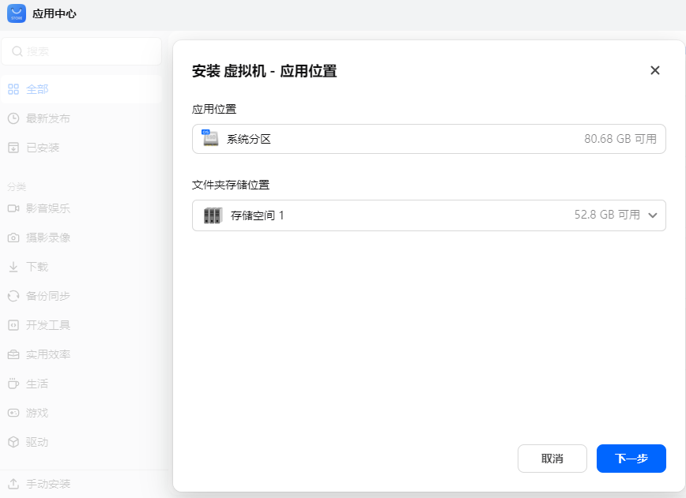
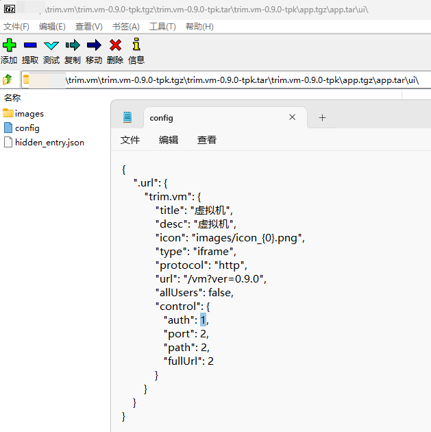
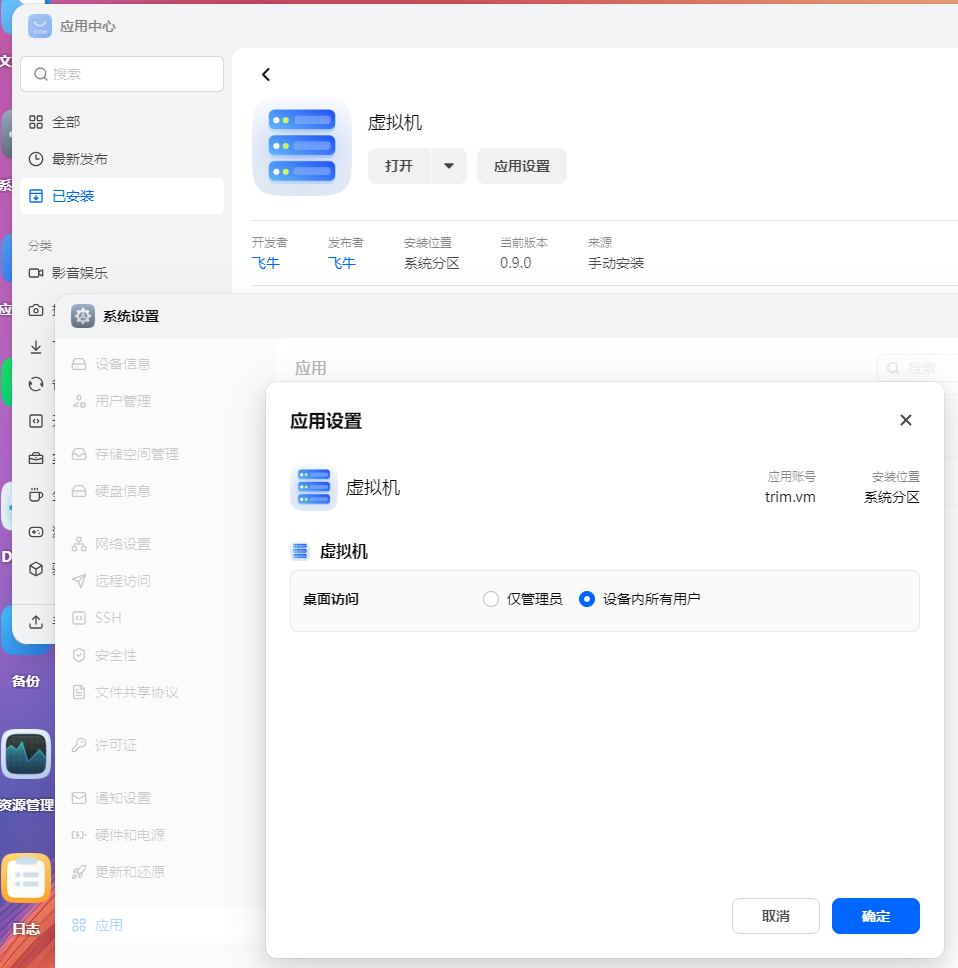
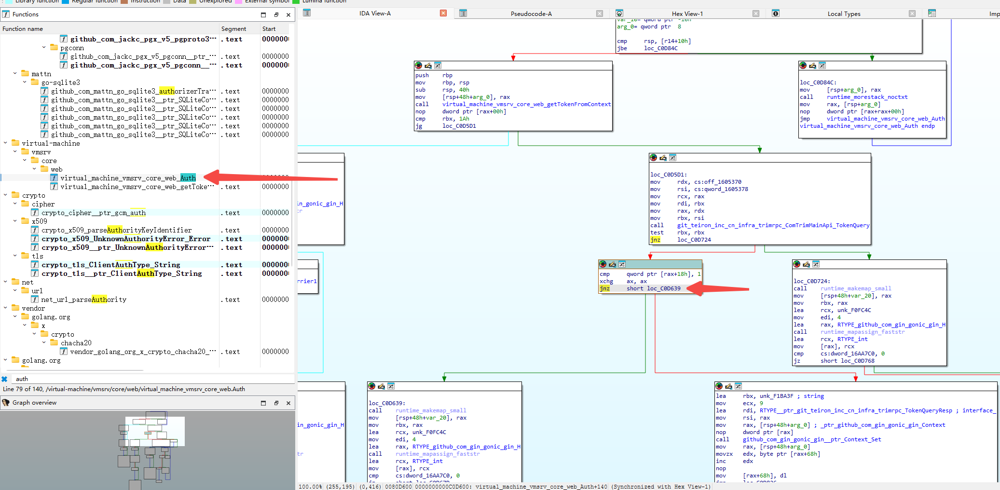
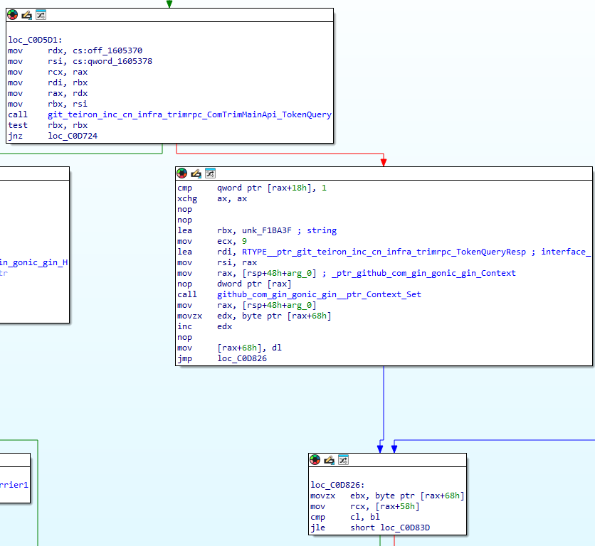
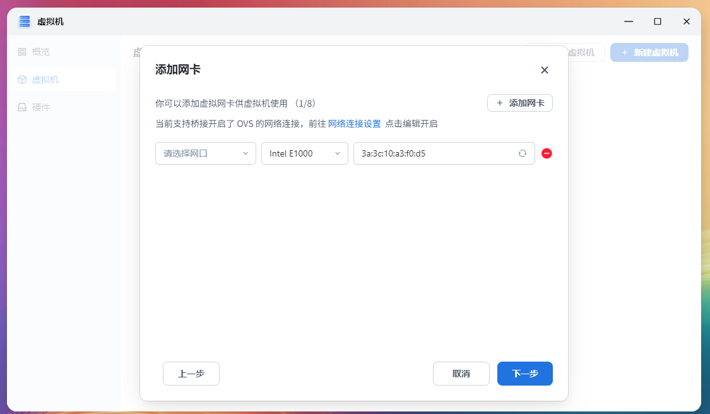
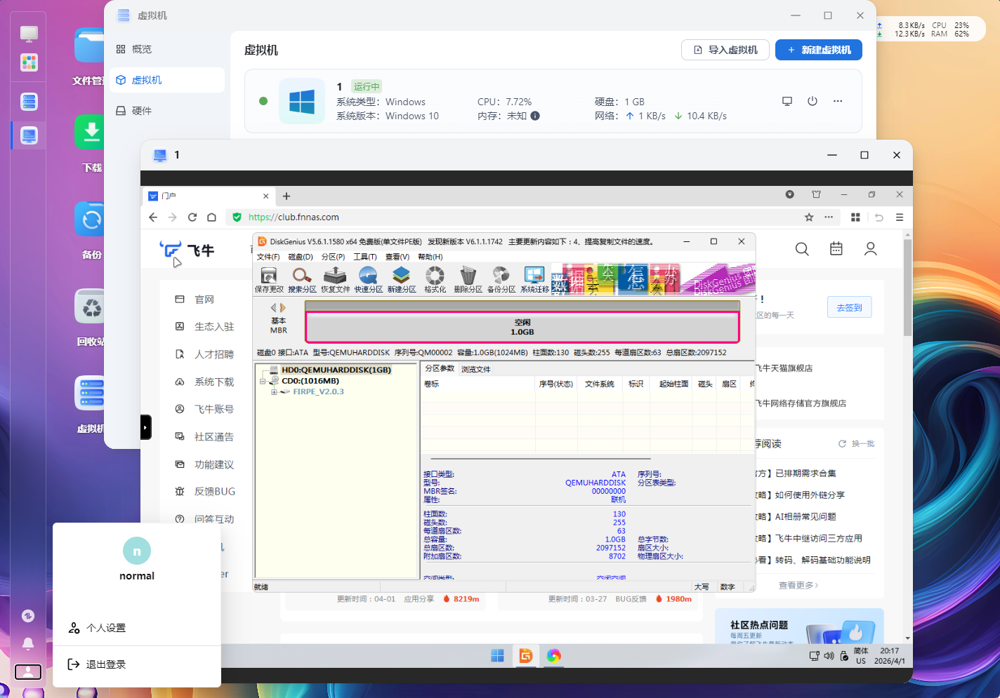

# 普通用户使用飞牛虚拟机

# 前言
经常看见不少人想让普通用户也能使用虚拟机  
虽然不知道使用场景是什么，为什么要把这么危险的东西给普通用户  

但是有需求自然可以搞一个  
本文基于飞牛虚拟机版本0.9.0编写

# 获取安装包
在应用中心点击安装按钮，等待出现如下画面  


进入SSH中，从如下目录提取虚拟机安装包
```text
root@MEmini:~# cd /tmp/appcenter/
root@MEmini:/tmp/appcenter# ls
trim.vm-0.9.0-tpk
root@MEmini:/tmp/appcenter# tar -czvf trim.vm-0.9.0-tpk.tgz trim.vm-0.9.0-tpk
trim.vm-0.9.0-tpk/
trim.vm-0.9.0-tpk/app.tgz
trim.vm-0.9.0-tpk/ICON_256.PNG
trim.vm-0.9.0-tpk/config/
trim.vm-0.9.0-tpk/config/resource
trim.vm-0.9.0-tpk/config/privilege
trim.vm-0.9.0-tpk/cmd/
trim.vm-0.9.0-tpk/cmd/upgrade_init
trim.vm-0.9.0-tpk/cmd/uninstall_init
trim.vm-0.9.0-tpk/cmd/package
trim.vm-0.9.0-tpk/cmd/main
trim.vm-0.9.0-tpk/cmd/common
trim.vm-0.9.0-tpk/cmd/config
trim.vm-0.9.0-tpk/cmd/upgrade_callback
trim.vm-0.9.0-tpk/cmd/uninstall_callback
trim.vm-0.9.0-tpk/cmd/install_init
trim.vm-0.9.0-tpk/cmd/service
trim.vm-0.9.0-tpk/cmd/install_callback
trim.vm-0.9.0-tpk/ICON.PNG
trim.vm-0.9.0-tpk/manifest
trim.vm-0.9.0-tpk/wizard/
trim.vm-0.9.0-tpk/wizard/uninstall
root@MEmini:/tmp/appcenter# ls 
trim.vm-0.9.0-tpk  trim.vm-0.9.0-tpk.tgz
root@MEmini:/tmp/appcenter# mv trim.vm-0.9.0-tpk.tgz /vol1/1000/workspace/
```

# 修改应用桌面访问入口权限
修改安装包内如下文件  
`trim.vm-0.9.0-tpk.tgz\trim.vm-0.9.0-tpk.tar\trim.vm-0.9.0-tpk\app.tgz\app.tar\ui\config`
将图中示意的1改为0，替换元文件即可  
  
```json
{
    ".url": {
        "trim.vm": {
            "title": "虚拟机",
            "desc": "虚拟机",
            "icon": "images/icon_{0}.png",
            "type": "iframe",
            "protocol": "http",
            "url": "/vm?ver=0.9.0",
            "allUsers": false,
            "control": {
               "auth": 0,
               "port": 2,
               "path": 2,
               "fullUrl": 2
            }
        }
    }
}
```  
修改后效果如下，可正常给所有用户开启桌面入口  

# 修改权限校验
修改安装包内如下文件  
`trim.vm-0.9.0-tpk.tgz\trim.vm-0.9.0-tpk.tar\trim.vm-0.9.0-tpk\app.tgz\app.tar\vm`  
搜索auth关键词，找到方法  
  
将如图所示的jnz，使用两个nop替换  
  
回封安装包即可

# 已知问题
因为普通用户无系统设置权限，OVS必须由管理员开启  
普通用户点击此处蓝色的 网络连接设置 无反映  


# 普通用户测试虚拟机功能
如图所示，普通用户此时也可以使用飞牛虚拟机了  


# 结束语
等普通用拿虚拟机把宿主机搞挂带走，就知道飞牛为什么要限制只有管理员能用了