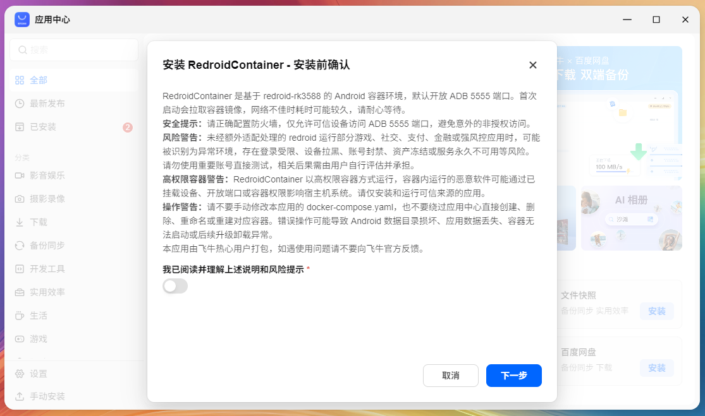
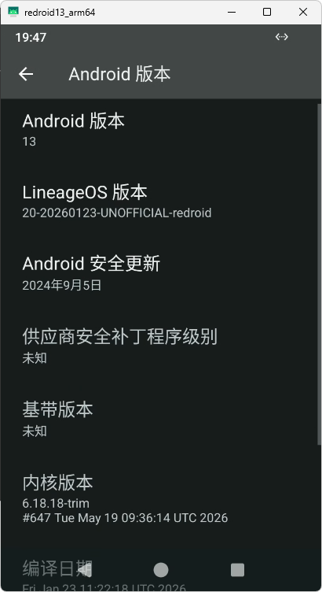

# 将redroid-rk3588容器封装为飞牛应用中心应用

# 前言
之前写过一篇在x86版本飞牛的docker容器中运行安卓系统redroid的文章  
现在飞牛出arm版本了，按理来说应该炒冷饭再写一篇水文章，不过没什么新意，还是整个活打个包  

大致流程本质上就是准备好binder相关环境，写一个docker-compose，然后用scrcpy或者adb连进去  
这样跑肯定是能跑，但对普通用户来说还是太难了，你看那个评论区就知道

如果每次都要用户自己去复制compose、创建目录、检查端口、配置存储位置，那还是太难了  
现在飞牛内核都集成binder驱动了，想必官方的配套安卓容器也快有了  

既然飞牛应用中心现在已经有第三方应用开发文档了，那就把这个redroid容器照着官方格式抢先打一个fpk包

本文以当前这个仓库[appstore.games.redroid](https://github.com/fnnas/appstore.games.redroid)为例  
它封装的是基于`redroid-rk3588`的Android容器环境，目标平台是arm，也就是主要给RK3588这类机器玩的  
`.github`目录则放了自动打包和测试发布用的流水线

如果你只是想跑redroid，不一定要看这篇，直接去release下载安装就完事了  
如果你想把一个docker-compose包装成飞牛应用中心里的应用，那这篇应该还能参考一点

# 先看官方对Docker应用的定义
官方文档已经把Docker应用的目录结构说得很清楚了  
这里直接引用原文，文档在这：  
https://developer.fnnas.com/docs/core-concepts/docker/

> 使用 `fnpack create my-app -t docker` 命令创建应用目录，my-app 请自行替换为你的应用名。  
> 创建后的应用目录结构如下：
>
> ```text
> my-app/
> ├── app/                            # 🗂️ 应用可执行文件目录
> │   ├── docker/                     # 🗂️ Docker 资源目录
> │   │   └── docker-compose.yaml     # Docker Compose 编排文件
> │   ├── ui/                         # 🗂️ 应用入口及视图
> │   │   ├── images/                 # 🗂️ 应用图标及图片资源目录
> │   │   └── config                  # 应用入口配置文件
> ├── manifest                        # 应用包基本信息描述文件
> ├── cmd/                            # 🗂️ 应用生命周期管理脚本
> │   ├── main                        # 应用主脚本，用于启动、停止、检查应用状态
> │   ├── install_init                # 应用安装初始化脚本
> │   ├── install_callback            # 应用安装回调脚本
> │   ├── uninstall_init              # 应用卸载初始化脚本
> │   ├── uninstall_callback          # 应用卸载回调脚本
> │   ├── upgrade_init                # 应用更新初始化脚本
> │   ├── upgrade_callback            # 应用更新回调脚本
> │   ├── config_init                 # 应用配置初始化脚本
> │   └── config_callback             # 应用配置回调脚本
> ├── config/                         # 🗂️ 应用配置目录
> │   ├── privilege                   # 应用权限配置
> │   └── resource                    # 应用资源配置
> ├── wizard/                         # 🗂️ 应用向导目录
> ├── LICENSE                         # 应用许可证文件
> ├── ICON.PNG                        # 应用包 64*64 图标文件
> └── ICON_256.PNG                    # 应用包 256*256 图标文件
> ```

所以一个飞牛Docker应用，本质上就是一个符合应用中心目录结构的包  
真正的容器编排放在`app/docker/docker-compose.yaml`  
应用中心负责执行compose，`cmd/main`主要用来告诉应用中心这个东西现在是不是运行中  
至于其他那些start还有stop都是无效的
```shell
start)
    # run start command. exit 0 if success, exit 1 if failed
    # do nothing, docker application will be started by appcenter
    exit 0
    ;;
stop)
    # run stop command. exit 0 if success, exit 1 if failed
    # do nothing, docker application will be stopped by appcenter
    exit 0
    ;;
```

官方也明确说了这一点

> 系统将根据 `docker-compose.yaml` 创建和启动容器编排。详细 compose 使用方法可移步 [Docker Compose Quickstart](https://docs.docker.com/compose/gettingstarted/)
>
> `docker-compose.yaml` 允许使用环境变量，在执行前将进行替换，相关环境变量可参考`环境变量指南`

这段对应的就是main脚本启停无效，这tm是个大坑来的，但它就是这样

> 默认情况下，无需定义启停逻辑，因为 Docker 应用的启停均由应用中心执行 compose 来管理。
>
> 然而，依然需要定义 Docker 应用是否在运行中，脚本中默认选择第一个容器的状态作为应用的启停状态，如不符合期望，可自行修改高亮部分。

也就是说，这次封装redroid的重点不是写一个多复杂的启动脚本  
而是把这些文件按应用中心要求摆好，再把compose和状态检查处理对

只能说不如打成普通应用，这样还不用去dockerhub拉镜像，直接把容器导出到包里，安装的时候再导入体验更佳  
毕竟电脑上GitHub拉包简单，nas上dockerhub拉镜像难

# 应用包目录
当前包目录是`package_aarch64`，主要结构如下

```text
package_aarch64
├── app
│   ├── docker
│   │   └── docker-compose.yaml
│   └── ui
│       ├── config
│       └── images
│           ├── icon_256.png
│           └── icon_64.png
├── cmd
│   ├── config_callback
│   ├── config_init
│   ├── install_callback
│   ├── install_init
│   ├── main
│   ├── uninstall_callback
│   ├── uninstall_init
│   ├── upgrade_callback
│   └── upgrade_init
├── config
│   ├── privilege
│   └── resource
├── manifest
├── wizard
│   └── install
├── ICON.PNG
└── ICON_256.PNG
```

看起来文件不少，但真正有内容的就几个  
`manifest`声明应用的一些元数据  
`config/resource`告诉应用中心这是一个docker项目  
`config/privilege`声明脚本运行权限  
`app/docker/docker-compose.yaml`是真正的redroid容器compose  
`cmd/main`只负责状态检查  
`wizard/install`安装向导，这里用于展示包信息，因为手动安装的时候应用中心不会展示manifest的信息

剩下那几个生命周期脚本目前基本都是`exit 0`  
Docker应用的启停已经交给应用中心去做了，没法精确控制一些东西

# 写manifest
先看官方对manifest的说法，文档在这：  
https://developer.fnnas.com/docs/core-concepts/manifest/

> manifest 文件就像是应用的"身份证"，它告诉飞牛 fnOS 系统您的应用是谁、需要什么、怎么运行。这个文件必须放在应用包的根目录下，文件名就叫 `manifest`（没有扩展名）。

官方还把一些基本字段解释得很明白

> - `appname` - 应用的唯一标识符，就像人的身份证号一样，在整个系统中必须是唯一的
> - `version` - 应用版本号，格式为 x[.y[.z]][-build]，例如：1.0.0、2.1.3-beta
> - `display_name` - 在应用中心和应用设置中显示的名称，用户看到的就是这个名字
> - `desc` - 应用的详细介绍，支持 HTML 格式，可以包含链接、图片等

这个redroid包的`manifest`如下

```text
appname               = appstore-games-redroid
version               = lineage-20-1
display_name          = RedroidContainer
desc                  = 基于 redroid-rk3588 的 Android 容器环境，默认开放 ADB 5555 端口。<br>风险警告：未经额外适配处理的 redroid 运行部分游戏、社交、支付、金融或强风控应用时，可能被识别为异常环境，存在登录受限、设备拉黑、账号封禁、资产冻结或服务永久不可用等风险。<br>请勿使用重要账号直接测试，相关后果需由用户自行评估并承担。<br>首次启动会拉取容器镜像，网络不佳时耗时可能较久，请耐心等待。<br>请正确配置防火墙，仅允许可信设备访问该端口，避免意外的非授权访问。<br>本应用由飞牛热心用户打包，如遇使用问题请不要向飞牛官方反馈。
platform              = arm
source                = thirdparty
os_min_version        = 1.1.3100
#install_dep_apps      = binder_linux_driver
maintainer            = cnflysky
maintainer_url        = https://github.com/CNflysky/redroid-rk3588
distributor           = GreenDamTan
distributor_url       = https://github.com/fnnas/appstore.games.redroid
service_port          = 5555
disable_authorization_path = true
```

这里有几个点要注意

首先是`platform = arm`  
官方文档里对`platform`的解释如下

> - `platform` - 架构类型，缺省时默认值： x86，（⚠️注意：不支持多个值填写）New!V1.1.8+
    >     - 声明为 x86 时，应用仅支持 x86 架构
>     - 声明为 arm 时，应用仅支持 arm 架构
>     - 声明为 all 时，表示应用支持所有架构，不区分平台，所有平台都可以下载安装。例如Docker应用。

虽然官方说Docker应用可以声明为`all`，但这个包是给arm用的  
因为这里用的是`redroid-rk3588`相关镜像，还挂载了`/dev/mali0`  
这东西本来就不是给x86机器准备的，所以老老实实写`arm`

然后是`service_port = 5555`  
redroid默认开放ADB端口，后续scrcpy或者adb都靠它连接  
官方对端口字段的说明是这样的

> - `service_port` - 应用监听的端口号
    >     - 系统会在启动应用前检查这个端口是否被占用
>     - 目前只支持单个端口设置
> - `checkport` - 是否启用端口检查，默认为 true
    >     - 设置为 false 时，系统不会检查端口占用情况
>     - 适用于不需要固定端口的应用

这里没有写`checkport=false`，也就是说默认会检查5555端口  
不然别的ADB服务已经占了5555，安装完才发现连不上，那就很扑街了

`disable_authorization_path = true`则表示不需要用户授权目录  
redroid的数据靠Docker卷保存，不需要让用户在飞牛文件管理里给它额外授权目录

`manifest`写`maintainer=cnflysky`和`maintainer_url=https://github.com/CNflysky/redroid-rk3588` 没什么好说的

人原作者GPL了都  
`https://github.com/CNflysky/redroid-rk3588/blob/main/LICENSE`

# 配置resource
官方对resource的解释如下，文档在这：  
https://developer.fnnas.com/docs/core-concepts/resource/

> 资源就像是应用的"能力清单"，告诉系统您的应用需要哪些额外的功能和权限。在 `config/resource` 文件中，您可以声明应用需要的扩展能力，比如数据共享、系统集成、容器支持等。

对于Docker应用，最关键的是`docker-project`  
官方原文如下

> Docker 项目支持让您的应用可以基于 Docker Compose 运行，支持复杂的容器编排和多服务架构。

配置示例官方也给了

> ```json
> {
>     "docker-project": {
>         "projects": [
>             {
>                 "name": "myapp-stack",
>                 "path": "docker"
>             }
>         ]
>     }
> }
> ```
>
> ### 配置说明
>
> - name - Docker Compose 项目的名称，用于标识和管理
> - path - 相对于 app 目录的路径，指向包含 docker-compose.yaml 的文件夹

所以本包的`config/resource`就非常简单

```json
{
    "docker-project":
    {
        "projects":
        [
            {
                "name": "appstore-games-redroid",
                "path": "docker"
            }
        ]
    }
}
```

`path`写的是`docker`  
对应的实际文件就是`package_aarch64/app/docker/docker-compose.yaml`

这里不要写成`app/docker`  
官方已经说了它是“相对于 app 目录的路径”  
写错后应用中心找不到compose，那后面就不用玩了

还有就是飞牛应用中心会以这个name作为compose名字，所以这个名字要符合compose名称规则  
https://docs.docker.com/compose/how-tos/project-name/

> ## Set a project name
>
> Project names must contain only lowercase letters, decimal digits, dashes, and underscores, and must begin with a lowercase letter or decimal digit. If the base name of the project directory or current directory violates this constraint, alternative mechanisms are available.

# 配置privilege
官方文档里对权限的说明是这样的，文档在这：  
https://developer.fnnas.com/docs/core-concepts/privilege/

> 权限就像是应用的"权限清单"，决定了应用在系统中能做什么、不能做什么。在 `config/privilege` 文件中，您可以定义应用运行时的权限级别和用户身份。

默认权限模式这段也值得讲一下

> 大多数应用都使用默认权限模式，这是最安全的运行方式：
>
> ### 应用用户运行
>
> 应用默认以**应用用户**的身份运行，这意味着：
>
> - 系统会为您的应用创建一个专用的用户和用户组
> - 所有应用进程都以这个专用用户身份运行
> - 应用文件的所有者也是这个专用用户
> - 应用只能访问自己的目录和系统允许的公共资源

官方还特别警告了root权限

> Root 权限模式仅适用于飞牛官方合作的企业开发者。第三方应用默认无法在应用中心发布需要 root 权限的应用。

所以这里的`config/privilege`没有写root

```json
{
    "defaults":
    {
        "run-as": "package"
    },
    "username": "docker-appstore-games-redroid",
    "groupname": "docker-appstore-games-redroid"
}
```

需要注意的是，redroid容器内部确实是`privileged: true`运行  
这是Docker容器配置里的特权容器，不是说应用中心生命周期脚本要以root身份跑  
这两个概念别混在一起，但也就是这个原因这个应用过不了审上不了应用中心  
回头看看能不能给绿联那边的RK3588搞一个，不知道那边卡不卡审核

特权容器本身依然是高风险的  
所以后面安装向导里专门写了高权限容器警告  
用户如果往Android里装一堆来路不明的东西，有极大可能被干穿到宿主机  
因为飞牛内核有关闭selinux这个缺陷在，所以拿到adb等于拿到了宿主机root  
有兴趣可以参考 `https://github.com/vvb2060/Magica`

# 写docker-compose
这个包真正运行redroid的是`app/docker/docker-compose.yaml`

```yaml
services:
  redroid:
    image: makedie/redroid:cnflysky-redroid-rk3588-lineage-20-202601241104
    container_name: redroid
    privileged: true
    ports:
      - "5555:5555"
    volumes:
      - "redroid-data:/data"
      - "/dev/mali0:/dev/mali0"
    command:
      - "androidboot.redroid_width=1080"
      - "androidboot.redroid_height=1920"
      - "androidboot.redroid_magisk=1"
      - "androidboot.redroid_fake_wifi=1"
      - "androidboot.redroid_fake_wifi_ssid=fnnas"
      - "ro.build.characteristics=default"

volumes:
  redroid-data:
    name: appstore-games-redroid12-data
```

这个compose里主要就几部分

`image`使用的是`makedie/redroid:cnflysky-redroid-rk3588-lineage-20-202601241104`

`container_name: redroid`是为了让`cmd/main`能通过compose里的`container_name`找到容器状态  
如果改了这个名字，状态检查逻辑也要跟着确认

`privileged: true`基本是redroid这类容器安卓绕不开的点  
它需要访问宿主机设备和一些内核能力  
这也是为什么安装前一定要提示用户风险

`ports`把宿主机5555映射到容器5555  
后面连接时就是连飞牛设备IP的5555端口  
例如在电脑上用adb或者scrcpy连接

```shell
adb connect 飞牛IP:5555
scrcpy --tcpip=飞牛IP:5555 --no-audio --max-size 1080 --video-bit-rate=2M
```

`/dev/mali0:/dev/mali0`是RK3588这类设备上给Mali GPU用的  
如果你的机器没有这个设备，那这个包本来就不是给你准备的，估计是你dtb不对之类的

`redroid-data:/data`则是这次封装里很重要的一点  
之前直接写宿主机路径也能用，比如`/root/xxx/data:/data`  
但打成飞牛应用之后，路径由应用中心和Docker环境管理，直接使用命名卷更稳一点  
这里命名卷固定为`appstore-games-redroid12-data`  
卸载应用时不主动删这个卷，后面重新安装还有机会保留Android数据

而且自从飞牛1.2.xx改了文件系统的ACL之后，docker相关就被破坏的很严重，所以还是老老实实用卷吧  
你要是想用`/root`之类的目录也不是不行，你想想看arm设备根分区一个个才多大吧

# 编写cmd/main
前面引用过官方文档，Docker应用不用自己写启动停止逻辑  
但必须告诉应用中心状态  
本包的`cmd/main`如下

```bash
#!/bin/bash

FILE_PATH="${TRIM_APPDEST}/docker/docker-compose.yaml"

is_docker_running () {
    DOCKER_NAME=""

    if [ -f "$FILE_PATH" ]; then
        DOCKER_NAME=$(cat $FILE_PATH | grep "container_name" | awk -F ':' '{print $2}' | xargs)
        echo "DOCKER_NAME is set to: $DOCKER_NAME"
    fi

    if [ -n "$DOCKER_NAME" ]; then
        docker inspect $DOCKER_NAME | grep -q "\"Status\": \"running\"," || exit 1
        return
    fi
}

case $1 in
start)
    # run start command. exit 0 if success, exit 1 if failed
    # do nothing, docker application will be started by appcenter
    exit 0
    ;;
stop)
    # run stop command. exit 0 if success, exit 1 if failed
    # do nothing, docker application will be stopped by appcenter
    exit 0
    ;;
status)
    # check application status command. exit 0 if running, exit 3 if not running
    # check first container by default, you cound modify it by yourself 
    if is_docker_running; then
        exit 0
    else
        exit 3
    fi
    ;;
*)
    exit 1
    ;;
esac
```

这里的思路很朴素，就基本上没改过  
从`docker-compose.yaml`里找`container_name`  
然后`docker inspect`看这个容器是不是`running`  
运行中就返回0，不运行就返回3

其他操作都不支持，纯纯就是摆设

# 安装向导里写清楚风险
飞牛应用支持安装、卸载、更新、配置等向导  
官方文档原文如下，文档在这：  
https://developer.fnnas.com/docs/core-concepts/wizard/

> 向导就像是应用的"引导员"，帮助用户一步步完成应用的安装、配置和卸载。通过设计友好的向导界面，您可以收集用户的选择和配置，让应用能够更好地满足用户的需求。

支持的向导类型也写得很明确

> 飞牛 fnOS 支持四种类型的向导：
>
> - 安装向导 (wizard/install) - 应用安装时的配置界面
> - 卸载向导 (wizard/uninstall) - 应用卸载时的确认界面
> - 更新向导 (wizard/upgrade) - 应用更新时的配置界面
> - 配置向导 (wizard/config) - 应用设置时的配置界面

本包目前只写了`wizard/install`  
目的不是收集什么复杂配置，而是在安装前把风险说清楚(锅甩干净)，毕竟手动安装在安装前不展示包信息

```json
[
    {
        "stepTitle": "安装前确认",
        "items": [
            {
                "type": "tips",
                "helpText": "RedroidContainer 是基于 redroid-rk3588 的 Android 容器环境，默认开放 ADB 5555 端口。首次启动会拉取容器镜像，网络不佳时耗时可能较久，请耐心等待。"
            },
            {
                "type": "tips",
                "helpText": "<strong>安全提示：</strong>请正确配置防火墙，仅允许可信设备访问 ADB 5555 端口，避免意外的非授权访问。"
            },
            {
                "type": "tips",
                "helpText": "<strong>风险警告：</strong>未经额外适配处理的 redroid 运行部分游戏、社交、支付、金融或强风控应用时，可能被识别为异常环境，存在登录受限、设备拉黑、账号封禁、资产冻结或服务永久不可用等风险。请勿使用重要账号直接测试，相关后果需由用户自行评估并承担。"
            },
            {
                "type": "tips",
                "helpText": "<strong>高权限容器警告：</strong>RedroidContainer 以高权限容器方式运行，容器内运行的恶意软件可能通过已挂载设备、开放端口或容器权限影响宿主机系统。请仅安装和运行可信来源的应用。"
            },
            {
                "type": "tips",
                "helpText": "<strong>操作警告：</strong>请不要手动修改本应用的 docker-compose.yaml，也不要绕过应用中心直接创建、删除、重命名或重建对应容器。错误操作可能导致 Android 数据目录损坏、应用数据丢失、容器无法启动或后续升级卸载异常。"
            },
            {
                "type": "tips",
                "helpText": "本应用由飞牛热心用户打包，如遇使用问题请不要向飞牛官方反馈。"
            },
            {
                "type": "switch",
                "field": "wizard_risk_acknowledged",
                "label": "我已阅读并理解上述说明和风险提示",
                "rules": [
                    {
                        "required": true,
                        "message": "请先确认已阅读并理解说明和风险提示"
                    }
                ]
            }
        ]
    }
]
```  
最终安装时会长这样  



官方对向导文件结构也有说明

> 每个向导文件都是一个 JSON 数组，包含多个步骤页面：
>
> ```json
> [
>     {
>         "stepTitle": "第一步标题",
>         "items": [
>             // 表单项列表
>         ]
>     },
>     {
>         "stepTitle": "第二步标题",
>         "items": [
>             // 表单项列表
>         ]
>     }
> ]
> ```

以及用户输入会变成环境变量

> 用户在向导中的选择会变成环境变量，您可以在相应的脚本中获取：
>
> ### 环境变量命名
>
> - 字段名直接作为环境变量名使用
> - 例如：wizard_admin_username 对应环境变量 wizard_admin_username

不过这次的`wizard_risk_acknowledged`并没有拿去脚本里做额外处理  
它只是一个安装前确认  
如果后面想让用户选择分辨率、是否启用Magisk、ADB端口之类的东西，也可以继续往向导里加字段，再在compose里用环境变量替换

# 应用入口这次故意留空
官方对应用入口的解释是这样的，文档在这：  
https://developer.fnnas.com/docs/core-concepts/app-entry/

> 应用入口就像是应用的"大门"，用户通过这些入口来访问您的应用。一个应用可以定义多个入口，每个入口都有不同的功能、图标和访问方式，让用户能够方便地使用应用的各种功能。

入口配置文件的位置也有明确要求

> 应用入口通过 `config` 文件定义，该文件需要放在 UI 目录下。假设您的 `manifest` 中 `desktop_uidir` 设置为 `ui`，那么配置文件路径就是 `app/ui/config`。

正常Web应用可以在`app/ui/config`里写一个`.url`入口  
比如官方示例里有`title`、`icon`、`type`、`protocol`、`port`、`url`这些字段

但这个redroid包目前的`app/ui/config`是空入口

```json
{
    ".url": {
    }
}
```

原因也很简单  
redroid不是一个传统Web服务  
它开放的是ADB 5555端口，用户一般通过adb、scrcpy或其他远程安卓工具连接  
硬塞一个桌面Web入口没有意义

当然，也不是不能做  
如果后续加一个Web版控制页，比如展示连接命令、容器状态、风险说明，甚至集成一个Web远程桌面，那就可以再把入口补上  
现在先不画这个饼

# 环境变量和路径
飞牛应用中心会给脚本注入很多环境变量  
官方文档原文如下，文档在这：  
https://developer.fnnas.com/docs/core-concepts/environment-variables/

> 环境变量就像是应用运行时的"工具箱"，里面装着各种有用的信息。当您的应用在飞牛 fnOS 系统中运行时，系统会自动提供这些环境变量，让您能够了解应用的状态、获取系统信息、访问各种路径等。

来源也写清楚了

> 环境变量主要来自两个地方：
>
> - manifest 文件：您在 manifest 中定义的字段会自动转换为环境变量
> - 用户向导：用户在安装、配置等向导中的选择也会变成环境变量

这次`cmd/main`里用到的是`TRIM_APPDEST`  
官方对路径变量的说明如下

> - TRIM_APPDEST - 应用可执行文件目录路径（target 文件夹）
> - TRIM_PKGETC - 配置文件目录路径（etc 文件夹）
> - TRIM_PKGVAR - 动态数据目录路径（var 文件夹）
> - TRIM_PKGTMP - 临时文件目录路径（tmp 文件夹）
> - TRIM_PKGHOME - 用户数据目录路径（home 文件夹）
> - TRIM_PKGMETA - 元数据目录路径（meta 文件夹）
> - TRIM_APPDEST_VOL - 应用安装的存储空间路径

所以`FILE_PATH="${TRIM_APPDEST}/docker/docker-compose.yaml"`这个路径不是随便写的  
应用安装后，`app`目录里的内容会成为应用可执行文件目录  
因此compose就在`$TRIM_APPDEST/docker/docker-compose.yaml`

# 打包
官方文档里对`fnpack`的定义如下，文档在这：  
https://developer.fnnas.com/docs/cli/fnpack/

> `fnpack` 是飞牛 fnOS 应用打包的便利工具，它帮助您快速创建应用项目结构并将应用打包成可安装的 `fpk` 文件。无论您是初学者还是经验丰富的开发者，这个工具都能让应用开发变得更加简单高效。

创建Docker模板的命令官方也写了

> ```bash
> # 创建 Docker 应用项目
> fnpack create <appname> --template docker
> # 无应用访问入口Docker应用，使用纯服务类型的项目
> fnpack create <appname> --template docker --without-ui true
> ```

打包命令也很简单

> 使用 `fnpack build` 命令将应用打包成 `fpk` 文件
>
> ```bash
> # 在应用目录中执行打包
> cd myapp
> fnpack build
> 
> ## 指定打包的目录
> fnpack build --directory <path>
> ```

官方还列了打包校验规则

> | 路径 | 类型 | 校验规则 |
> | --- | --- | --- |
> | `manifest` | 文件 | 必须存在，且必选字段存在 |
> | `config/privilege` | 文件 | 必须存在，且符合 `JSON` 格式 |
> | `config/resource` | 文件 | 必须存在，且符合 `JSON` 格式 |
> | `ICON.PNG` | 文件 | 必须存在 |
> | `ICON_256.PNG` | 文件 | 必须存在 |
> | `app/` | 目录 | 必须存在 |
> | `cmd/` | 目录 | 必须存在 |
> | `wizard/` | 目录 | 必须存在 |
> | `app/{manifest.desktop_uidir}/` | 目录 | 若有定义，则目录必须存在 |

如果在本地手动打包，大概就是这样

```shell
cd package_aarch64
fnpack build
```

不过当前仓库没有完全依赖本地手动打包  
而是写了一个GitHub Actions工作流

# GitHub Actions流水线
`.github/workflows/test_release.yml`只是给这个包做自动检查和自动出包用的  
不会还有人手动打包吧，不会吧不会吧

它主要做几件事：  
检查`cmd`目录下的shell脚本语法  
检查`config/resource`、`config/privilege`、`app/ui/config`和`wizard`里的JSON能不能正常解析  
检查`manifest`、图标、compose等关键文件是否存在  
把`package_aarch64`整理成fpk产物  
如果手动运行流水线时勾选`make_release`，就顺手创建GitHub Release并上传产物

产物名会从`manifest`里读取`appname`和`version`，再拼上提交hash和架构，大概长这样

```text
appstore-games-redroid-lineage-20-1-提交短hash-aarch64.tgz.fpk
```

这个流水线不能替代真机安装测试，但可以挡住一些很低级的问题  
例如JSON写炸了、脚本语法炸了、关键文件漏传了

# 安装测试
直接在应用中心手动安装就完事了

安装后第一次启动会拉取镜像  
如果网络很慢，看起来就像卡住了一样  
这不是redroid有问题，是Docker在拉镜像，拉不下来是你网有问题

启动后可以在电脑上用scrcpy连接

```shell
scrcpy --tcpip=飞牛IP:5555 --no-audio --max-size 1080 --video-bit-rate=2M
```  


如果连不上，先不要急着重装  
可以按顺序检查

```shell
docker ps | grep redroid
docker inspect redroid | grep '"Status"'
docker logs redroid
```

还不行就进容器里面，用`logcat`看看发生了什么，是mali固件不对还是什么其他原因

记得检查5555端口是不是被防火墙或者别的服务挡住了，别自己搞自己


# 结束语
回头看看绿联那边应用中心怎么投稿，看看能不能上那边应用中心

只能说rk3588是一个好平台，飞牛系统是个好系统，但redroid与应用中心上架要求水土不服

回头拉一下安卓源码整个重新构建一下redroid，waydroid那边有几个很有意思的patch感觉可以合进去