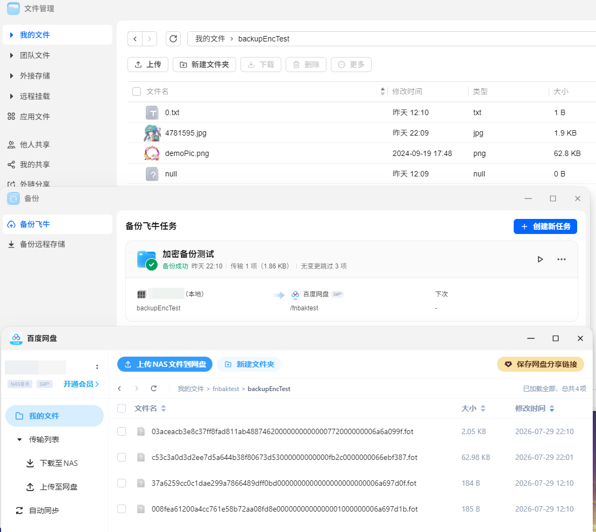

# 飞牛加密备份 FOT 文件解密记录

# 前言

前段时间飞牛更新了加密备份的功能，最终会产生一批扩展名为 `.fot` 的加密文件。  
文件开头能认出固定格式。再往后只有少量可读内容，余下的字节基本看不懂。
飞牛官方没有提供离线解密工具，这使我不安desu。

于是打算摸一下看看能不能离线解密它们，连群晖都有离线解密的工具，为啥飞牛就不提供呢？  
[Synology Cloud Sync Decryption Tool](https://kb.synology.cn/zh-cn/DSM/help/SynologyCloudSyncDecryptionTool/synologycloudsyncdecryptiontool?version=7)

这次用到的样本都在图里，加密口令设成 `0`。  
小文件方便摸清结构，其中两份还能玩一下已知明文与密文反推 KEY，大文件拿来测试实际解密负载。


被分析的程序信息如下

| 属性      | 结果                                                                 |
|---------|--------------------------------------------------------------------|
| 文件类型    | ELF 64-bit LSB executable                                          |
| CPU 架构  | AArch64 / ARM64                                                    |
| 构建语言    | Go 1.23.0                                                          |
| 应用模块    | `git.teiron-inc.cn/services/backup-cloud`                          |
| SHA-256 | `3d1a7833d7478203d8de5d6c818d6cf7a68f6c0edfb568c998b749b27697208d` |

# 大概解密流程

被分析程序`backup_cloud`是一个 ARM64 Linux 上的 Go 备份程序。  
至于为啥是它……你觉得还有其他文件比这个更合理吗  
`.fot` 文件会交给一组解密 Reader。  
固定头和 metadata 验完以后，正文才开始流式解密。

数据从 `.fot` 到原文件的变化如下：

```text
FOT 原始字节流
    │
    ▼
FOT 头 / metadata / 正文密文 / 尾部 tag
    │
    ▼
解密 Reader
    │
    ▼
原始文件名 + 原始文件正文
```

恢复时不会从 `.fot` 文件名推回原名，我之前还以为它就是加密后的文件名。  
原名存在 FOT metadata 里，验证通过后才会解出，并用来建立最终输出路径。

<div style="border:1px solid #888;border-radius:8px;padding:14px;margin:16px 0;background:#fafafa">
  <strong>恢复链路的四种数据身份</strong><br>
  <code>.fot 文件名</code>：用于识别待恢复的加密文件<br>
  <code>FOT 字节流</code>：格式头、metadata、正文密文、尾 tag<br>
  <code>verified_filename</code>：通过 HMAC 后得到的原文件名<br>
  <code>plaintext</code>：通过正文 tag 后可以提交的原文件内容
</div>

# FOT 文件结构
先拿两个最小的文件看结构。

先看固定头。当前格式的固定头长度是 45 bytes，后面跟变长 metadata、正文密文和最后的 16 bytes 认证标签。

```text
0x00                                                        total_len
┌────────┬───────┬────────────┬───────────┬──────┬─────┬───────────┬────────────┐
│ magic  │ ver   │ header_len │ total_len │  IV  │salt │ metadata  │ ciphertext │ tag │
│ 8 byte │1 byte │ 2 byte BE  │ 8 byte BE │16 B  │ 9 B │ variable  │  variable  │16 B │
└────────┴───────┴────────────┴───────────┴──────┴─────┴───────────┴────────────┘
   0       8        9            11          19    35      45      header_len  total_len-16
```

固定 magic 是：

```text
46 4f 54 a3 1c 77 00 5e
```

两个实际对象的前 64 bytes 如下。几份样本都是版本 1，`header_len` 都是 `0x00a8`，也就是 168 bytes。

对象大小分别是 184 和 185 bytes，所以一个正文长度为 0，另一个正文长度为 1。

这两个文件正好对应 `null` 和 `1.txt` 的加密产物。

```text
00000000: 46 4f 54 a3 1c 77 00 5e 01 00 a8 00 00 00 00 00  FOT..w.^........
00000010: 00 00 b8 be 34 35 08 0a 0b 18 83 9c 74 4f 0d 6d  ....45......tO.m
00000020: 6e 80 b7 0b 60 17 4d 0a 02 68 a6 93 ca 00 54 09  n...`.M..h....T.
00000030: 75 73 61 62 69 6c 69 74 79 65 38 4f 49 38 39 47  usabilitye8OI89G

00000000: 46 4f 54 a3 1c 77 00 5e 01 00 a8 00 00 00 00 00  FOT..w.^........
00000010: 00 00 b9 2a 12 95 a5 82 e6 2e 7e ec 55 08 08 7a  ...*......~.U..z
00000020: 8d f3 b8 4b 7d ea 39 60 33 e5 2b d8 6d 00 54 09  ...K}.9`3.+.m.T.
00000030: 75 73 61 62 69 6c 69 74 79 2f 6a 48 54 61 53 71  usability/jHTaSq
```

## metadata

`header_len` 之后才是正文。固定头中从偏移 45 开始的部分是一串变长条目，编码方式如下：

```text
uint16_be entry_len | uint8 key_len | key[key_len] | value[entry_len - 3 - key_len]
```

解析条目不能只看 key。`entry_len` 必须落在 `header_len` 内，`key_len` 也不能越过当前 entry，否则截断的 FOT 文件可能会把正文密文混进 metadata。

恢复流程会处理两个特殊 key：

| key | value 的外层形式 | 解码后的用途 |
|---|---|---|
| `usability` | Base64 | 独立 16-byte IV + 固定检查值密文；没有独立 HMAC。 |
| `filename` | Base64 | 文件名密文 + 16-byte 截断 HMAC。 |

正文不在 metadata 里，范围从 `header_len` 到 `total_len - 16`。末尾 16 bytes 保存正文 HMAC-SHA256 的前 16 bytes。

```text
ciphertext = blob[header_len : total_len - 16]
body_tag   = blob[total_len - 16 : total_len]
```

# 正文 tag 认证了哪一段

`DecryptSliceReader.Read` 已经给出了尾部 tag 的认证范围。`0x7253b0` 把 ciphertext chunk 写入 HMAC，`0x725390` 对同一块数据执行 CTR。

```text
body_tag = HMAC-SHA256(content_key, ciphertext)[:16]
```

正文 HMAC 的输入是 **ciphertext**。数据是否完整、口令是否正确，都由末尾的 16 bytes tag 验证；CTR 本身不给出校验结果。

# PBKDF2 参数

口令会和文件头里的 salt 组合，分别做三次 PBKDF2-HMAC-SHA256，不会直接拿去做 AES。

```text
有效 PBKDF2 salt = 3c a1 5e f9 d2 07 6b || file_salt[9]
输出长度          = 32 bytes
哈希             = SHA-256
```

三组参数见表：

|    轮数 | 用途                 | 结果                         |
|------:|--------------------|----------------------------|
|   100 | `usability` 快速口令检查 | AES-256-CTR key            |
|  1000 | `filename`         | AES-256-CTR key + HMAC key |
| 10000 | 正文                 | AES-256-CTR key + HMAC key |

```text
password + KDF_PREFIX + file_salt
                 │
     ┌───────────┼───────────┐
     ▼           ▼           ▼
 PBKDF2(100) PBKDF2(1000) PBKDF2(10000)
     │           │           │
 usability    filename       body
  CTR check   CTR + HMAC   CTR + HMAC
```

当前设置的密码是：

```python
RECOVERY_PASSWORD = b"0"
```

`usability` 用来快速拒绝错误口令。它的 Base64 内容以 16-byte CTR IV 开头，剩余部分由 100 次 PBKDF2 派生的 key 解密。明文必须严格等于这个内置检查值：

```text
teirenfeiniuyunpanbeifencryptoencrypto
```

`usability` 没有额外 HMAC。两个样本中 Base64 解码后的长度都是 54 bytes，正好是：

```text
16-byte IV + 38-byte fixed-check ciphertext
```

# 解密器名称和地址速查表

后文同时使用二进制保留的 Go 原始符号和便于阅读的分析名。表中只列解析、解密 FOT 的四个函数；文件从哪里取得不影响格式分析。

|         地址 | 原始 Go 符号 / 反编译中的名称                  | 文中分析名                                        | 在解密流程里的职责                                           |
|-----------:|-------------------------------------|----------------------------------------------|-----------------------------------------------------|
| `0x7240e0` | `crypto.NewDecryptReader`           | `fot_new_decrypt_reader`                     | 外层 Reader 构造器；解析第一个对象并保存底层 Reader、口令与元信息。           |
| `0x724220` | `crypto.NewDecryptSliceReader`      | `fot_parse_header_and_create_decrypt_reader` | 读取 FOT 头、解析 metadata、验证口令/文件名、建立正文 CTR/HMAC Reader。 |
| `0x724fa0` | `crypto.(*DecryptReader).Read`      | `DecryptReader.Read`                         | 调度当前子 Reader；仅在当前对象 EOF 后尝试衔接下一个 FOT 对象。            |
| `0x725100` | `crypto.(*DecryptSliceReader).Read` | `fot_decrypt_reader_read_and_verify_tag`     | 读取正文密文，更新 HMAC、CTR 解密，并在流末验证 16-byte tag。           |

这些地址只适用于本文分析的版本。换版本后地址可能整体移动，找函数时应优先对照关键字符串、PBKDF2 参数和 Reader 数据流。  
不过有一说一golang这玩意即便上不会动符号表，动这东西的测试成本太高了。之后的版本根据名称直接找就是。

# 拿 `4781595.jpg` 跑一遍

被加密文件是  
```text
03aceacb3e8c37ff8fad811ab48874620000000000000772000000006a6a099f.fot
```

它的 SHA-256 是：

```text
8b36db3766ba752c45e350f777494ed8c14275db8d6c7a197bb5718eeb4114e1
```

这份 FOT 长 2,098 bytes，恢复后应得到大小为 1,906 bytes 的 `4781595.jpg`。本节列出的数值和解密结果都取自这份样本。

```text
FOT 文件总长度：2,098 bytes
├── [0, 45)       固定头
├── [45, 176)     metadata：usability + filename
├── [176, 2082)   正文 ciphertext：1,906 bytes
└── [2082, 2098)  body tag：16 bytes
```

## 数据结构定义

反编译里的 Reader 状态由一串偏移和 Go 接口字段组成，直接当结构体看很费劲。  
下面按用途整理成阅读用状态视图，字段名和排布是本文的归纳，不能拿它当原始 Go 源码或精确内存布局。

```go
type FOTHeaderView struct {
    Magic        [8]byte
    Version      byte
    HeaderLength uint16 // 文件里是 big-endian
    TotalLength  uint64 // 文件里是 big-endian
    DataIV       [16]byte
    Salt         [9]byte
    Padding      byte
    Metadata     map[string][]byte
}

type DecryptSliceReaderView struct {
    Reader          io.Reader      // FOT 文件字节流 reader
    BodyReader      io.LimitedReader
    CTR             cipher.Stream
    BodyHMAC        hash.Hash
    Remain          int64          // 只计算 ciphertext，不包含尾 tag
    Verified        bool
    Filename        string         // filename HMAC 成功后才填入
    CipherLength    int64
    PlainLength     int64
}
```

## 固定头 `[0, 45)`

前 45 bytes 解析为：

| 文件范围       | 原始值                                               | 解析结果              | 后续用途                              |
|------------|---------------------------------------------------|-------------------|-----------------------------------|
| `[0, 8)`   | `46 4f 54 a3 1c 77 00 5e`                         | FOT magic         | 先确认不是别的格式。                        |
| `[8, 9)`   | `01`                                              | version = 1       | 当前 Reader 只接受这个版本。                |
| `[9, 11)`  | `00 b0`                                           | header_len = 176  | metadata 到 offset 176 截止；正文从这里开始。 |
| `[11, 19)` | `00 00 00 00 00 00 08 32`                         | total_len = 2,098 | 最后 16 bytes 是 tag，因此正文末尾是 2,082。  |
| `[19, 35)` | `b5 61 b6 17 78 ed 6d 5c 61 7e de 08 d4 7d 02 f2` | `data_iv`         | 文件名和正文的 CTR IV。                   |
| `[35, 44)` | `6f 0e 31 5e c8 54 1e d9 7b`                      | file salt         | 与固定前缀拼接后进入三组 PBKDF2。              |
| `[44, 45)` | `1b`                                              | padding           | 当前恢复路径不把它作为 key/IV/tag 使用。        |

下面是这 176 bytes header 的原始 HEX 视图。
```text
00000000: 46 4f 54 a3 1c 77 00 5e 01 00 b0 00 00 00 00 00  FOT..w.^........
00000010: 00 08 32 b5 61 b6 17 78 ed 6d 5c 61 7e de 08 d4  ..2.a..x.m\a~...
00000020: 7d 02 f2 6f 0e 31 5e c8 54 1e d9 7b 1b 00 54 09  }..o.1^.T..{..T.
00000030: 75 73 61 62 69 6c 69 74 79 78 2f 4e 2b 56 6a 33  usabilityx/N+Vj3
00000040: 41 67 37 70 4f 47 2b 61 37 37 6a 5a 57 44 33 32  Ag7pOG+a77jZWD32
00000050: 62 6b 33 77 44 37 52 65 4f 31 63 65 4a 58 4a 71  bk3wD7ReO1ceJXJq
00000060: 68 57 39 41 46 4a 56 66 57 6e 49 51 5a 36 49 45  hW9AFJVfWnIQZ6IE
00000070: 6e 39 79 74 4b 44 4e 38 31 35 70 2f 62 2b 67 48  n9ytKDN815p/b+gH
00000080: 43 00 2f 08 66 69 6c 65 6e 61 6d 65 49 31 62 36  C./.filenameI1b6
00000090: 35 66 6d 59 36 66 36 75 44 6a 63 72 79 74 2b 65  5fmY6f6uDjcryt+e
000000a0: 50 5a 2f 79 55 7a 45 6f 44 32 41 54 6a 45 62 69  PZ/yUzEoD2ATjEbi
```

这一步对应 `fot_parse_header_and_create_decrypt_reader`，读取范围分成 `[0, 19)` 和 `[19, 176)`。  
完成后 reader 停在正文起点 176，正文和输出文件都还没动。

```text
input reader offset: 0
  ├─ ReadAtLeast(19)  → magic/version/header_len/total_len
  ├─ ReadAtLeast(157) → 补齐 [19, 176) 的 header 剩余部分
  └─ reader offset: 176，下一次读才会拿到正文 ciphertext
```

## metadata `[45, 176)`

这份样本有两个条目，共 131 bytes metadata：

| entry 范围     | `entry_len` | key         | value 长度 | value 的含义                                        |
|--------------|------------:|-------------|---------:|--------------------------------------------------|
| `[45, 129)`  |          84 | `usability` |       72 | Base64 文本，解码后是 54-byte 的“独立 IV + 检查值密文”。         |
| `[129, 176)` |          47 | `filename`  |       36 | Base64 文本，解码后是 11-byte 文件名密文 + 16-byte HMAC tag。 |

`usability` 的 value 是：

```text
x/N+Vj3Ag7pOG+a77jZWD32bk3wD7ReO1ceJXJqhW9AFJVfWnIQZ6IEn9ytKDN815p/b+gHC
```

Base64 解码后为 54 bytes，按字段切开如下：

```text
usability_iv [16]
c7 f3 7e 56 3d c0 83 ba 4e 1b e6 bb ee 36 56 0f

usability_ciphertext [38]
7d 9b 93 7c 03 ed 17 8e d5 c7 89 5c 9a a1 5b d0
05 25 57 d6 9c 84 19 e8 81 27 f7 2b 4a 0c df 35
e6 9f db fa 01 c2
```

前 16 bytes 是 `usability_iv`，剩余 38 bytes 才是固定检查值的密文。

`filename` 的 value 是：

```text
I1b65fmY6f6uDjcryt+ePZ/yUzEoD2ATjEbi
```

Base64 解码后为：

```text
23 56 fa e5 f9 98 e9 fe ae 0e 37 | 2b ca df 9e 3d 9f f2 53 31 28 0f 60 13 8c 46 e2
 └─────── 文件名密文[11] ───────┘   └─────────── 16-byte filename tag ────────────┘
```

parser 此时拿到的仍是两个 `[]byte` value，先把它们存在 metadata map 里。  
口令检查与 filename tag 验证通过后，`Filename` 字段才会写入可用于输出路径的 `4781595.jpg`。

## 三组 key 从 password/salt 变成解密状态

当前验证口令是 `0`。对于这份样本，三次派生的有效 salt 都是：

```text
3c a1 5e f9 d2 07 6b || 6f 0e 31 5e c8 54 1e d9 7b
```

也就是 16 bytes：

```text
3c a1 5e f9 d2 07 6b 6f 0e 31 5e c8 54 1e d9 7b
```

派生结果如下：

| 用途        | PBKDF2 rounds | key[0:16]                                         | key[16:32]                                        |
|-----------|--------------:|---------------------------------------------------|---------------------------------------------------|
| usability |           100 | `20 db 99 27 bc 00 3f 76 b0 a9 fe ab b7 34 b7 4d` | `12 42 32 ca 1b e3 c4 75 87 46 17 c6 70 23 fc c5` |
| filename  |          1000 | `13 06 2c 4f 4a af 26 57 51 df 36 ce b2 36 b2 87` | `98 53 23 fd f8 4d 83 04 d7 36 f2 18 f9 ec 89 f5` |
| body      |         10000 | `ac 0e 82 2e c2 d0 54 f4 ae 93 cb 91 00 d8 29 bf` | `7d f9 e8 86 d0 87 b3 c5 9d 41 7d 5c 5d a5 df b7` |

`usability` 路径用第一把 key 和自己的 IV 解密，得到：

```text
teirenfeiniuyunpanbeifencryptoencrypto
```

严格相等以后，口令才被接受。

## 文件名 metadata [129, 176)

这条 `filename` entry 位于 `[129, 176)`：

```text
[129, 131)  00 2f       entry_len = 47
[131, 132)  08          key_len = 8
[132, 140)  66 69 6c 65 6e 61 6d 65
                        ASCII "filename"
[140, 176)  I1b65fmY6f6uDjcryt+ePZ/yUzEoD2ATjEbi
                        Base64 value，长度 36 bytes
```

Base64 解码后，恢复器按最后 16 bytes 切开：

```text
packed filename bytes (27 bytes)
23 56 fa e5 f9 98 e9 fe ae 0e 37 | 2b ca df 9e 3d 9f f2 53 31 28 0f 60 13 8c 46 e2
└─────────── ct[11] ───────────┘   └──────────── tag[16] ────────────────────────┘
```

用 filename 的 1000 次 PBKDF2 key 对左侧 11 bytes 做 HMAC：

```text
HMAC-SHA256(
    13062c4f4aaf265751df36ceb236b287985323fdf84d8304d736f218f9ec89f5,
    23 56 fa e5 f9 98 e9 fe ae 0e 37,
)[:16]
= 2b ca df 9e 3d 9f f2 53 31 28 0f 60 13 8c 46 e2
```

计算结果和右侧 tag 完全一致，这个 metadata value 才通过认证。  
当前实现随后执行 CTR，解出的文件名会作为 Go string 写入 Reader。

本例文件名的 CTR 变换可以把每一个 byte 对上：

```text
filename_key  = 13 06 2c 4f 4a af 26 57 51 df 36 ce b2 36 b2 87 ...
data_iv       = b5 61 b6 17 78 ed 6d 5c 61 7e de 08 d4 7d 02 f2
CTR keystream = 17 61 c2 d4 cc a1 dc d0 c4 7e 50
ciphertext    = 23 56 fa e5 f9 98 e9 fe ae 0e 37
plaintext     = 34 37 38 31 35 39 35 2e 6a 70 67
                4  7  8  1  5  9  5  .  j  p  g
```

文件名和正文共用固定头里的 `data_iv`。两组 PBKDF2 轮数不同，所以 CTR key 也不同。

认证得到 `4781595.jpg` 后，原程序这样处理路径：

```text
.fot 目标路径
   │
   ├─ filepath.Dir(...)                         // 保留恢复目录
   │
verified filename = "4781595.jpg"
   │
   └─ filepath.Join(directory, "4781595.jpg") // 0x74f49c
        │
        └─ os.OpenFile(..., 0x241, 0x1b6)       // 0x74f4d0
             │
             └─ 后续 CopyBuffer 把正文 plaintext 写入这个文件
```


## 正文 `[176, 2082)` 和 tag `[2082, 2098)`

正文长 1,906 bytes。这里保留首尾各 32 bytes 和 tag：

```text
ciphertext 起始窗口（正文相对偏移）:
0000: 36 70 db e3 f3 ac 60 b6 ca 93 50 e1 9b c0 0c 17
0010: 71 03 95 fe 5f 38 b8 45 25 e5 0d 34 25 4d f9 f7

ciphertext 结束窗口（最后 32 bytes）:
-020: e0 b2 1e 21 ec 35 68 aa 1b d0 17 bc 41 ab de 02
-010: 43 27 cd 4d d3 35 f7 18 aa f0 19 6d 7a 51 91 08

body tag [16]:
6e f6 47 ff 1e 15 0f 21  e3 7c 53 99 99 43 4f 46
```

Reader 建好后的状态如下：

```text
底层 reader offset: 176
LimitedReader.N:    1922  （正文 1906 bytes + 尾 tag 16 bytes）
Remain:              1906  （只允许 CTR/HMAC 正文分支消费这部分）
CTR:        AES-256-CTR(body_key, data_iv)
BodyHMAC:   HMAC-SHA256(body_key)，初始为空
Verified:   false
```

`LimitedReader.N` 包含尾部 tag，正文读完后还能从同一底层流取到它；`Remain` 只计算正文，避免普通读取分支把最后 16 bytes 当成密文。

`DecryptSliceReader.Read` 每次最多读取约 4096 bytes 正文。  
不过这份对象小于该上限，一次就能读完，处理顺序如下：

```text
ciphertext chunk
  ├─ BodyHMAC.Write(ciphertext chunk)
  └─ AES-256-CTR(body_key, data_iv) → plaintext chunk
                                      └─ CopyBuffer → os.File
```

全部 1,906 bytes 读完以后，Reader 才读取尾 tag，并计算：

```text
HMAC-SHA256(
    ac0e822ec2d054f4ae93cb9100d829bf7df9e886d087b3c59d417d5c5da5dfb7,
    ciphertext[176:2082],
)[:16]
= 6e f6 47 ff 1e 15 0f 21 e3 7c 53 99 99 43 4f 46
```

结果与文件末尾的 tag 一致后，`Verified` 就变成 true。CTR 输出的首尾字节如下：

```text
plaintext 起始窗口（JPEG header）:
0000: ff d8 ff db 00 84 00 08 06 06 07 06 05 08 07 07
0010: 07 09 09 08 0a 0c 14 0d 0c 0b 0b 0c 19 12 13 0f

plaintext 结束窗口（JPEG trailer）:
-020: 27 0c 73 c9 ec 2b d8 3c 0c aa be 13 b4 0a 41 c9
-010: 72 71 ee c6 b4 93 bb b9 cb 4a 1e ce 0a 27 ff d9
```

恢复出的文件 SHA-256：

```text
93e94f000b9be232f7d6299abf499fdc9f517493b4f88c18daef1a2d92174d8a
```

此时对象的最终状态是：

```text
Filename:  4781595.jpg
Plaintext: 1,906 bytes
```

# 从 FOT Reader 到输出文件

调用链在这里：

```text
FOT 文件字节流 (io.Reader)
                 │
                 ▼
          NewDecryptReader
                 │
                 ▼
       NewDecryptSliceReader
       ├─ 读固定头和 metadata
       ├─ 验证 usability
       ├─ 验证并解密 filename
       └─ 建立正文 LimitedReader + CTR + HMAC
                 │
                 ▼
          io.CopyBuffer
                 │
                 ▼
       DecryptSliceReader.Read
       ├─ 读 ciphertext chunk
       ├─ ciphertext → HMAC
       ├─ ciphertext → AES-CTR → plaintext
       └─ plaintext → os.File
                 │
                 ▼
       读最终 16-byte tag，比较 HMAC
                 │
                 ▼
       认证成功：恢复出的原文件
```

<div style="display:grid;grid-template-columns:repeat(auto-fit,minmax(180px,1fr));gap:10px;margin:16px 0">
  <div style="border:1px solid #888;border-radius:8px;padding:10px"><b>输入</b><br><code>FOT byte stream</code><br>FOT 原始字节</div>
  <div style="border:1px solid #888;border-radius:8px;padding:10px"><b>头解析</b><br>magic / version / length<br>metadata / password</div>
  <div style="border:1px solid #888;border-radius:8px;padding:10px"><b>正文流</b><br>ciphertext → HMAC<br>ciphertext → CTR</div>
  <div style="border:1px solid #888;border-radius:8px;padding:10px"><b>输出</b><br>plaintext → temporary<br>tag success → final</div>
</div>

## Reader 入口

`NewDecryptReader` 接收 FOT 字节流和口令，再把二者交给 `NewDecryptSliceReader`。  
Go 反编译把这里的 `io.Reader` 显示成 `tab/data`：`tab` 是方法表，`data` 指向实际 Reader。

| 输入字节/状态                    | 当前函数       | 状态变化        | 下一跳        |
|----------------------------|------------|-------------|------------|
| FOT 文件字节流 + password bytes | `0x7240e0` | 构造解密 Reader | `0x724220` |

## Header 读取

`NewDecryptSliceReader` 开头读取 19 bytes，其中包括 magic、version、`header_len` 和 `total_len`。  
header 补齐后会校验 magic 和 version；`header_len` 按大端 16 位读取，`total_len` 则经过 64 位字节翻转。

```text
FOT bytes [0 : 19]
   │
   ├─ magic[8]       → 格式识别
   ├─ version[1]     → 版本识别
   ├─ header_len[2]  → 读取剩余头、切 metadata
   └─ total_len[8]   → 计算正文和最后 tag 的边界
```

## Metadata 与输出文件名

header 补齐后，解析器从第 45 byte 开始读取 metadata。`usability` 用来检查口令，`filename` 要等 HMAC 通过后才能解密。

```text
usability
  Base64
    └─ IV[16] || encrypted_fixed_check[38]
         └─ PBKDF2(100) + AES-256-CTR
              └─ fixed-check plaintext

filename
  Base64
    └─ encrypted_filename || hmac_tag[16]
         ├─ PBKDF2(1000) + HMAC-SHA256，先验 tag
         └─ PBKDF2(1000) + AES-256-CTR(data_iv)，后解密文件名
```

原程序拿认证后的文件名调用 `filepath.Join`，随后由 `os.OpenFile` 打开输出文件。

```text
metadata["filename"]
   │
   ▼
Base64 decode
   │
   ├─ ciphertext
   └─ last 16 bytes tag
          │
          ▼
HMAC verify
   │ success
   ▼
AES-CTR decrypt(data_iv)
   │
   ▼
verified filename
   │
   ▼
filepath.Join(Dir(fot_path), filename)
   │
   ▼
os.OpenFile
```

## 正文读取

头、口令和文件名都通过后，`NewDecryptSliceReader` 返回的 Reader 保存这些状态：

```text
底层 LimitedReader
AES-256-CTR 状态
HMAC-SHA256 状态
remain（正文密文剩余长度）
verified filename
声明的总长度与明文长度
```

`io.CopyBuffer` 会持续调用 `DecryptSliceReader.Read`。  
ciphertext chunk 分别送入 HMAC 和 CTR，CTR 输出写进已经打开的文件。

```text
ciphertext chunk
  │
  ├──► HMAC-SHA256.Update(ciphertext chunk)
  │
  └──► AES-256-CTR.XORKeyStream
             │
             ▼
       plaintext chunk
             │
             ▼
          io.CopyBuffer
             │
             ▼
          os.File.Write
```

## 尾部 tag

正文 `remain` 归零时，Reader 从底层再取 16 bytes，与累计 HMAC 的前 16 bytes 做逐字节 XOR 聚合比较。  
匹配时返回 EOF，缺失或不匹配就报错。由于文件早已打开，最终 tag 校验失败时，磁盘上可能留有部分明文。

```text
body ciphertext exhausted
       │
       ▼
read final tag[16]
       │
       ▼
computed = HMAC-SHA256(content_key, all ciphertext)[:16]
       │
       ▼
constant-time-style XOR aggregate compare
       │
  ┌────┴────┐
  │         │
match     mismatch / missing tag
  │         │
  ▼         ▼
EOF       error
```

# 可运行的恢复器

下面是离线解密飞牛加密备份文件的实现。

脚本依赖系统的 `openssl enc -aes-256-ctr`，启动时会用 NIST AES-256-CTR 向量自检。  
恢复时不会覆盖已有输出，所有认证通过后才写入最终文件。

那个 `RECOVERY_PASSWORD = b"0"` 记得换成自己的密码。

```python
#!/usr/bin/env python3

from __future__ import annotations

import argparse
import base64
import hashlib
import hmac
import os
import subprocess
import sys
from dataclasses import dataclass
from pathlib import Path

FOT_MAGIC = bytes.fromhex("464f54a31c77005e")
FOT_VERSION = 1
FIXED_HEADER_LENGTH = 45
TAG_LENGTH = 16
USABILITY_PLAINTEXT = b"teirenfeiniuyunpanbeifencryptoencrypto"
KDF_PREFIX = bytes.fromhex("3ca15ef9d2076b")
RECOVERY_PASSWORD = b"0"


class FOTError(ValueError):
    pass


@dataclass(frozen=True)
class FOTHeader:
    header_length: int
    total_length: int
    data_iv: bytes
    salt: bytes
    padding: int
    metadata: dict[str, bytes]


def derive_key(password: bytes, salt: bytes, iterations: int) -> bytes:
    return hashlib.pbkdf2_hmac("sha256", password, KDF_PREFIX + salt, iterations, 32)


def aes_ctr_crypt(key: bytes, iv: bytes, data: bytes) -> bytes:
    try:
        completed = subprocess.run(
            [
                "openssl",
                "enc",
                "-aes-256-ctr",
                "-nosalt",
                "-K",
                key.hex(),
                "-iv",
                iv.hex(),
            ],
            input=data,
            stdout=subprocess.PIPE,
            stderr=subprocess.PIPE,
            check=False,
        )
    except FileNotFoundError as error:
        raise FOTError("未找到 openssl；需要 OpenSSL 的 aes-256-ctr 支持") from error
    if completed.returncode != 0:
        message = completed.stderr.decode("utf-8", "replace").strip()
        raise FOTError(f"OpenSSL AES-CTR 处理失败：{message}")
    return completed.stdout


def require(condition: bool, message: str) -> None:
    if not condition:
        raise FOTError(message)


def parse_header(blob: bytes) -> FOTHeader:
    require(len(blob) >= FIXED_HEADER_LENGTH + TAG_LENGTH, "文件小于最小 FOT 长度")
    require(blob[:8] == FOT_MAGIC, "FOT 魔数不匹配")
    require(blob[8] == FOT_VERSION, f"不支持的 FOT 版本：{blob[8]}")

    header_length = int.from_bytes(blob[9:11], "big")
    total_length = int.from_bytes(blob[11:19], "big")
    require(header_length >= FIXED_HEADER_LENGTH, "header_len 小于固定头长度")
    require(header_length <= len(blob) - TAG_LENGTH, "header_len 超出文件边界")
    require(total_length == len(blob), "total_len 与实际文件长度不一致")

    metadata: dict[str, bytes] = {}
    offset = FIXED_HEADER_LENGTH
    while offset < header_length:
        require(offset + 3 <= header_length, "元数据条目头被截断")
        entry_length = int.from_bytes(blob[offset : offset + 2], "big")
        key_length = blob[offset + 2]
        require(entry_length >= key_length + 3, "元数据 entry_len 非法")
        entry_end = offset + entry_length
        require(entry_end <= header_length, "元数据条目越过 header_len")
        key_end = offset + 3 + key_length
        require(key_end <= entry_end, "元数据键长度非法")
        try:
            key = blob[offset + 3 : key_end].decode("utf-8")
        except UnicodeDecodeError as error:
            raise FOTError("元数据键不是 UTF-8") from error
        require(key not in metadata, f"重复的元数据键：{key}")
        metadata[key] = blob[key_end:entry_end]
        offset = entry_end

    require(offset == header_length, "元数据未恰好结束于 header_len")
    return FOTHeader(
        header_length=header_length,
        total_length=total_length,
        data_iv=blob[19:35],
        salt=blob[35:44],
        padding=blob[44],
        metadata=metadata,
    )


def decode_metadata(name: str, metadata: dict[str, bytes]) -> bytes:
    try:
        encoded = metadata[name]
    except KeyError as error:
        raise FOTError(f"缺少必需元数据：{name}") from error
    try:
        return base64.b64decode(encoded, validate=True)
    except Exception as error:
        raise FOTError(f"{name} 不是合法 Base64") from error


def validate_password(header: FOTHeader, password: bytes) -> None:
    usability = decode_metadata("usability", header.metadata)
    require(
        len(usability) == TAG_LENGTH + len(USABILITY_PLAINTEXT),
        "usability 长度不符合 IV(16)+固定检查值密文(38) 的格式",
    )
    usability_iv = usability[:TAG_LENGTH]
    recovered = aes_ctr_crypt(derive_key(password, header.salt, 100), usability_iv, usability[TAG_LENGTH:])
    require(
        hmac.compare_digest(recovered, USABILITY_PLAINTEXT),
        "口令错误，或 usability 元数据已损坏",
    )


def decrypt_filename(header: FOTHeader, password: bytes) -> str:
    packed = decode_metadata("filename", header.metadata)
    require(len(packed) >= TAG_LENGTH, "filename 缺少 16 字节 HMAC 标签")
    encrypted_name, stored_tag = packed[:-TAG_LENGTH], packed[-TAG_LENGTH:]
    key = derive_key(password, header.salt, 1000)
    expected_tag = hmac.new(key, encrypted_name, hashlib.sha256).digest()[:TAG_LENGTH]
    require(
        hmac.compare_digest(expected_tag, stored_tag),
        "filename HMAC 不匹配：口令错误或元数据已损坏",
    )
    plaintext = aes_ctr_crypt(key, header.data_iv, encrypted_name)
    try:
        filename = plaintext.decode("utf-8")
    except UnicodeDecodeError as error:
        raise FOTError("已认证的 filename 不是 UTF-8") from error
    require(filename not in ("", ".", ".."), "恢复的文件名为空或无效")
    require("/" not in filename and "\\" not in filename, "恢复的文件名包含路径分隔符")
    return filename


def decrypt_body(blob: bytes, header: FOTHeader, password: bytes) -> bytes:
    ciphertext = blob[header.header_length:-TAG_LENGTH]
    stored_tag = blob[-TAG_LENGTH:]
    key = derive_key(password, header.salt, 10000)
    expected_tag = hmac.new(key, ciphertext, hashlib.sha256).digest()[:TAG_LENGTH]
    require(
        hmac.compare_digest(expected_tag, stored_tag),
        "正文 HMAC 不匹配：口令错误或文件被截断/损坏",
    )
    return aes_ctr_crypt(key, header.data_iv, ciphertext)


def output_path(output_dir: Path, filename: str) -> Path:
    destination = output_dir / filename
    resolved_directory = output_dir.resolve()
    resolved_destination = destination.resolve()
    require(
        os.path.commonpath((str(resolved_directory), str(resolved_destination))) == str(resolved_directory),
        "恢复目标逃逸出输出目录",
    )
    require(not destination.exists(), f"拒绝覆盖已有输出文件：{destination}")
    return destination


def main() -> int:
    parser = argparse.ArgumentParser(
        description="离线恢复经过认证的 FOT 文件；仅使用提供的口令，不进行任何口令猜测。"
    )
    parser.add_argument("input", type=Path, nargs="?", help="输入 .fot 文件")
    parser.add_argument("--output-dir", type=Path, help="必须不存在或为空的新恢复目录")
    parser.add_argument("--self-test", action="store_true", help="使用 NIST AES-CTR 测试向量验证本机 OpenSSL")
    args = parser.parse_args()

    if args.self_test:
        key = bytes.fromhex("603deb1015ca71be2b73aef0857d77811f352c073b6108d72d9810a30914dff4")
        iv = bytes.fromhex("f0f1f2f3f4f5f6f7f8f9fafbfcfdfeff")
        plaintext = bytes.fromhex("6bc1bee22e409f96e93d7e117393172a")
        expected = bytes.fromhex("601ec313775789a5b7a7f504bbf3d228")
        try:
            require(aes_ctr_crypt(key, iv, plaintext) == expected, "AES-CTR 测试向量不匹配")
        except FOTError as error:
            print(f"自检失败：{error}", file=sys.stderr)
            return 1
        print("AES-256-CTR 自检成功")
        return 0

    if args.input is None or args.output_dir is None:
        parser.error("恢复模式需要 input 和 --output-dir")

    try:
        blob = args.input.read_bytes()
        password = RECOVERY_PASSWORD
        require(not args.output_dir.exists() or not any(args.output_dir.iterdir()), "输出目录必须不存在或为空")

        header = parse_header(blob)
        validate_password(header, password)
        filename = decrypt_filename(header, password)
        plaintext = decrypt_body(blob, header, password)

        args.output_dir.mkdir(parents=True, exist_ok=True)
        destination = output_path(args.output_dir, filename)
        temporary = destination.with_name(destination.name + ".partial")
        require(not temporary.exists(), f"临时输出已存在：{temporary}")
        temporary.write_bytes(plaintext)
        temporary.replace(destination)

        print(f"恢复成功：{destination}")
        print(f"明文长度：{len(plaintext)}")
        print(f"FOT 头长度：{header.header_length}；文件总长度：{header.total_length}")
        return 0
    except (OSError, FOTError) as error:
        print(f"恢复失败：{error}", file=sys.stderr)
        return 1


if __name__ == "__main__":
    raise SystemExit(main())
```

保存为 `fot_decrypt.py` 后，先测试本机 CTR：

```shell
python3 fot_decrypt.py --self-test
```

输出应为：

```text
AES-256-CTR 自检成功
```

恢复时指定 `.fot` 和一个不存在或为空的输出目录：

```shell
python3 fot_decrypt.py 03aceacb3e8c37ff8fad811ab48874620000000000000772000000006a6a099f.fot --output-dir recovered
```


# 关键反编译

下面只保留真正处理 FOT 的四个解密器函数。  
Go 反编译里夹着不少运行时内容，例如 `tab/data`、GC write barrier 和切片边界检查。  
读的时候可以略过大部分 `vNN`，盯住密码学调用和长度即可。  
代码里的 `//` 是我在 IDA 里的注释，IDA不会自己生成这东西，你拖进去看不到这个是正常的。

变体识别时，优先核对以下锚点：

1. 19-byte 首次读取、magic/version、`REV16` 和大端总长度；
2. `usability` / `filename` 字符串和三组 PBKDF2 轮数；
3. `NewCTR`、`hmac.New`、`LimitedReader`；
4. 正文耗尽后的 16-byte tag 读取和 HMAC 比较；
5. 已认证 filename 被用于输出路径，解密 Reader 被复制到本地文件。

## 1. 外层解密 Reader：第一个对象的入口

`0x7240e0` 把底层 Reader 和 password 交给 `0x724220`。  
第一个 FOT 头是在这里构造时解析的。

```c
// git.teiron-inc.cn/services/backup-cloud/crypto.NewDecryptReader
retval_7240E0 __golang git_teiron_inc_cn_services_backup_cloud_crypto_NewDecryptReader(
        __int64 a1,
        __int64 a2,
        __int64 a3,
        __int64 a4,
        __int64 a5)
{
  __int64 r0; // x3
  __int64 v7; // x4
  __int64 v8; // x5
  __int64 v9; // x6
  _QWORD *v10; // x25
  __int64 v13; // [xsp+38h] [xbp-30h]
  __int64 v14; // [xsp+48h] [xbp-20h]
  retval_7240E0 result; // 0:x0.24
  retval_724220 v21; // 0:kr00_24.24

  v21 = git_teiron_inc_cn_services_backup_cloud_crypto_NewDecryptSliceReader(); /*0x72410c*/ // 先解析首个 FOT 文件并建立正文解密 Reader。
  result._r1 = v21._r1; /*0xf1c0000000000008*/
  result._r2 = v21._r2; /*0xf1c000000000000c*/
  if ( v21._r1 ) /*0x724110*/
  {
    result._r0 = 0; /*0x7241d4*/
  }
  else
  {
    v14 = *(_QWORD *)(v21._r0 + 104LL); /*0x724124*/
    v13 = *(_QWORD *)(v21._r0 + 112LL); /*0x72412c*/
    result._r0 = runtime_newobject(&RTYPE_git_teiron_inc_cn_services_backup_cloud_crypto_DecryptReader); /*0x724138*/
    if ( dword_BE34B0 ) /*0x724144*/
    {
      result._r0 = runtime_gcWriteBarrier4(result._r0); /*0x72415c*/
      r0 = v21._r0; /*0x724160*/
      *v10 = v21._r0; /*0x724164*/
      v7 = a2; /*0x724168*/
      v10[1] = a2; /*0x72416c*/
      v8 = a3; /*0x724170*/
      v10[2] = a3; /*0x724174*/
      v9 = v14; /*0x724178*/
      v10[3] = v14; /*0x72417c*/
    }
    else
    {
      r0 = v21._r0; /*0x724148*/
      v7 = a2; /*0x72414c*/
      v8 = a3; /*0x724150*/
      v9 = v14; /*0x724154*/
    }
    *(_QWORD *)result._r0 = r0; /*0x724180*/ // 保存当前 DecryptSliceReader。
    *(_QWORD *)(result._r0 + 8LL) = a1; /*0x724188*/ // 保存底层 io.Reader 的 tab。
    *(_QWORD *)(result._r0 + 16LL) = v7; /*0x72418c*/ // 保存底层 io.Reader 的 data。
    *(_QWORD *)(result._r0 + 32LL) = a4; /*0x724194*/ // 保存 password 的长度。
    *(_QWORD *)(result._r0 + 40LL) = a5; /*0x72419c*/ // 保存 password 的容量。
    *(_QWORD *)(result._r0 + 24LL) = v8; /*0x7241a0*/ // 保存 password 数据指针，供串接 FOT 文件继续解析。
    *(_QWORD *)(result._r0 + 56LL) = v13; /*0x7241a8*/ // 保存已认证文件名长度。
    *(_QWORD *)(result._r0 + 48LL) = v9; /*0x7241ac*/ // 保存已认证文件名指针。
    *(_QWORD *)(result._r0 + 64LL) = *(_QWORD *)(r0 + 120); /*0x7241b4*/ // 累计记录当前 FOT 文件的总长度。
    *(_QWORD *)(result._r0 + 72LL) = *(_QWORD *)(r0 + 128); /*0x7241bc*/ // 累计记录当前 FOT 文件的正文长度。
    result._r1 = 0; /*0x7241c0*/
    result._r2 = v21._r2; /*0x7241c4*/
  }
  return result; /*0x7241d0*/
}
```

## 2. 头解析器：FOT 字节流变成带密码学状态的 Reader

`0x724220` 负责把 FOT 字节流 Reader 和 password 组装成解密子 Reader，里面保存 LimitedReader、CTR、HMAC、剩余正文长度、原文件名和长度信息。

```c
// git.teiron-inc.cn/services/backup-cloud/crypto.NewDecryptSliceReader
retval_724220 __golang git_teiron_inc_cn_services_backup_cloud_crypto_NewDecryptSliceReader(
        void *a1,
        void *a2,
        __int64 a3,
        __int64 a4,
        __int64 a5)
{
  char v7; // w0
  unsigned __int64 v8; // x1
  unsigned __int64 v9; // x1
  __int64 v10; // x2
  __int64 v11; // x0
  __int64 v12; // x0
  unsigned __int64 v13; // x0
  __int64 v14; // x1
  unsigned __int64 v15; // x2
  signed __int64 v16; // x3
  __int64 v17; // x4
  __int64 v18; // x5
  __int64 v19; // x6
  __int64 v20; // x7
  __int64 v21; // x8
  __int64 v23; // x4
  unsigned __int64 v24; // x5
  __int64 v25; // x2
  __int64 r2; // x3
  unsigned __int64 v27; // x9
  unsigned __int64 v28; // x10
  __int64 v29; // x11
  unsigned __int64 v30; // x12
  __int64 v31; // x9
  __int64 v32; // x13
  unsigned __int64 v33; // x14
  unsigned __int64 v34; // x4
  __int64 v35; // x2
  __int64 v36; // x3
  _QWORD *v37; // x0
  __int64 v38; // x5
  _QWORD *v39; // x25
  __int64 v40; // x1
  __int64 v41; // x7
  __int64 v42; // x8
  __int64 v43; // x9
  uint8 *v44; // x10
  __int64 v45; // x0
  __int64 v46; // x2
  __int64 v47; // x7
  __int64 v48; // x8
  __int64 v49; // x1
  uint8 *v50; // x9
  __int64 v51; // x1
  unsigned __int8 v52; // w2
  char v53; // w4
  __int64 v54; // x6
  __int64 v55; // x7
  __int64 v56; // x8
  uint8 *v57; // x9
  io_LimitedReader *p_io_LimitedReader; // x0
  void *v59; // x1
  _QWORD *v60; // x25
  io_LimitedReader *v61; // x3
  io_LimitedReader *v62; // x4
  io_LimitedReader *v63; // x5
  io_LimitedReader **v64; // x25
  unsigned __int64 v65; // x3
  __int64 v66; // x4
  _QWORD *v67; // x25
  __int64 r0; // x0
  unsigned __int64 r1; // x1
  __int64 v70; // [xsp+90h] [xbp-368h]
  __int64 v71; // [xsp+A8h] [xbp-350h]
  __int64 v72; // [xsp+B0h] [xbp-348h]
  __int64 v73; // [xsp+B8h] [xbp-340h]
  unsigned __int64 v74; // [xsp+C0h] [xbp-338h]
  __int64 v75; // [xsp+D0h] [xbp-328h]
  __int64 v76; // [xsp+D8h] [xbp-320h]
  __int64 v77; // [xsp+E0h] [xbp-318h]
  unsigned __int64 v78; // [xsp+E8h] [xbp-310h]
  unsigned __int64 v79; // [xsp+F0h] [xbp-308h]
  __int64 v80; // [xsp+F8h] [xbp-300h]
  __int64 v81; // [xsp+100h] [xbp-2F8h]
  __int64 v82; // [xsp+108h] [xbp-2F0h]
  __int64 v83; // [xsp+110h] [xbp-2E8h]
  __int64 v84; // [xsp+118h] [xbp-2E0h]
  __int64 v85; // [xsp+120h] [xbp-2D8h]
  unsigned __int64 v86; // [xsp+128h] [xbp-2D0h]
  unsigned __int64 v87; // [xsp+130h] [xbp-2C8h]
  unsigned __int64 v88; // [xsp+138h] [xbp-2C0h]
  __int64 v89; // [xsp+140h] [xbp-2B8h]
  __int64 v90; // [xsp+148h] [xbp-2B0h]
  __int64 v91; // [xsp+150h] [xbp-2A8h]
  __int64 v92; // [xsp+158h] [xbp-2A0h]
  __int64 v93; // [xsp+160h] [xbp-298h]
  unsigned __int64 v94; // [xsp+170h] [xbp-288h]
  __int64 v95; // [xsp+178h] [xbp-280h]
  unsigned __int64 v96; // [xsp+198h] [xbp-260h]
  __int64 v97; // [xsp+1A0h] [xbp-258h]
  unsigned __int64 v98; // [xsp+1A8h] [xbp-250h]
  __int64 v99; // [xsp+1A8h] [xbp-250h]
  __int64 v100; // [xsp+1A8h] [xbp-250h]
  __int64 v101; // [xsp+1A8h] [xbp-250h]
  __int64 v102; // [xsp+1A8h] [xbp-250h]
  unsigned __int64 v103; // [xsp+1B0h] [xbp-248h]
  unsigned __int64 v104; // [xsp+1B0h] [xbp-248h]
  __int64 v105; // [xsp+1C8h] [xbp-230h]
  io_LimitedReader *v106; // [xsp+1D8h] [xbp-220h]
  __int64 v107; // [xsp+1E0h] [xbp-218h]
  __int64 v108; // [xsp+1E8h] [xbp-210h]
  __int64 v109; // [xsp+1F0h] [xbp-208h]
  __int64 v110; // [xsp+200h] [xbp-1F8h]
  __int64 v111; // [xsp+208h] [xbp-1F0h]
  uint8 *v112; // [xsp+210h] [xbp-1E8h]
  uint8 *v113; // [xsp+218h] [xbp-1E0h]
  uint8 *v114; // [xsp+220h] [xbp-1D8h]
  __int64 v115; // [xsp+228h] [xbp-1D0h]
  __int64 v116; // [xsp+230h] [xbp-1C8h]
  __int64 v117; // [xsp+238h] [xbp-1C0h]
  __int64 v118; // [xsp+240h] [xbp-1B8h]
  io_LimitedReader *v119; // [xsp+250h] [xbp-1A8h]
  io_LimitedReader *v120; // [xsp+268h] [xbp-190h]
  __int64 v121; // [xsp+270h] [xbp-188h]
  __int64 v122; // [xsp+278h] [xbp-180h]
  __int64 v123; // [xsp+280h] [xbp-178h]
  __int64 v124; // [xsp+288h] [xbp-170h]
  __int64 v125; // [xsp+288h] [xbp-170h]
  __int64 v126; // [xsp+288h] [xbp-170h]
  char v127; // [xsp+290h] [xbp-168h] BYREF
  __int64 v128; // [xsp+3A0h] [xbp-58h] BYREF
  __int64 v129; // [xsp+3A8h] [xbp-50h]
  char *v130; // [xsp+3B0h] [xbp-48h]
  __int64 v131; // [xsp+3B8h] [xbp-40h]
  __int64 v132; // [xsp+3C0h] [xbp-38h]
  __int64 v133; // [xsp+3C8h] [xbp-30h]
  _QWORD v134[2]; // [xsp+3D0h] [xbp-28h] BYREF
  __int64 v135; // [xsp+3E0h] [xbp-18h] BYREF
  __int64 v136; // [xsp+3E8h] [xbp-10h]
  retval_470A10 v142; // 0:x0.16
  retval_470A10 v143; // 0:x0.16
  retval_512A20 v144; // 0:x0.16
  retval_470A10 v145; // 0:x0.16
  retval_512A20 v146; // 0:x0.16
  retval_5B4A70 v147; // 0:x0.16
  retval_512A20 v148; // 0:x0.16
  retval_5B4A70 v149; // 0:x0.16
  retval_724220 result; // 0:x0.24
  retval_470100 v151; // 0:kr20_24.24
  retval_470100 v152; // 0:kr48_24.24
  retval_470100 v153; // 0:kr80_24.24
  retval_470100 v154; // 0:krE0_24.24
  retval_723D20 v155; // 0:kr108_24.24
  retval_724B74 v156; // 0:kr140_24.24
  retval_470100 v157; // 0:kr168_24.24
  retval_723D20 v158; // 0:kr180_24.24
  retval_4A96E0 All; // 0:kr00_32.32
  retval_4F7320 v160; // 0:kr60_32.32
  retval_515D90 v161; // 0:krA0_32.32
  retval_4F7320 v162; // 0:krC0_32.32
  retval_515D90 v163; // 0:kr120_32.32
  retval_515D90 v164; // 0:kr1A0_32.32

  v124 = runtime_makeslice(&RTYPE_uint8); /*0x724268*/ // 分配 19-byte 固定头：magic、version、header_len、total_len。
  result._r1 = io_ReadAtLeast(a1, a2, v124)._r1; /*0x724284*/ // 首读固定 19 bytes。
  if ( result._r1 ) /*0x724288*/
  {
    result._r0 = 0; /*0x7245bc*/
    return result; /*0x7245c8*/
  }
  if ( qword_B73528 <= 19 ) /*0x724298*/
    v7 = runtime_memequal(v124, off_B73520); /*0x7242b0*/ // 比较 FOT 文件开头与全局 magic。
  else
    v7 = 0; /*0x72429c*/
  if ( (v7 & 1) == 0 )
  {
    All = io_ReadAll(a1, a2); /*0x72447c*/
    r0 = All._r0; /*0xf1c0000000000004*/
    r1 = All._r1; /*0xf1c0000000000008*/
    if ( All._r3 )
    {
      v135 = 0; /*0x724490*/
      v136 = 0; /*0x724490*/
      v135 = *(_QWORD *)(All._r3 + 8LL); /*0x72449c*/
      v136 = v23; /*0x7244a0*/
      fmt_Fprintf(off_9081A0, qword_BB97E8, "[NewDecryptSliceReader]Failed to read remaining data: %v\n", 57, &v135);
      r0 = All._r0; /*0x7244d0*/
      r1 = All._r1; /*0x7244d4*/
    }
    v24 = r1 + 19; /*0x7244d8*/
    if ( r1 != 0 && r1 < 0xFFFFFFFFFFFFFFEDLL ) /*0x7244dc*/
    {
      v151 = runtime_growslice(v124, r1 + 19, 19, r1, &RTYPE_uint8); /*0x724508*/
      r2 = v151._r2; /*0x72450c*/
      v24 = v151._r1; /*0x724510*/
      r1 = All._r1; /*0x724514*/
      v25 = v151._r0; /*0x724518*/
      r0 = All._r0; /*0x72451c*/
    }
    else
    {
      v25 = v124; /*0x7244e4*/
      r2 = 19; /*0x7244e8*/
    }
    v89 = r2; /*0x724520*/
    v88 = v24; /*0x724524*/
    v116 = v25; /*0x724528*/
    runtime_memmove(v25 + 19, r0, r1); /*0x724544*/
    v134[0] = &RTYPE__slice_uint8; /*0x724568*/
    v134[1] = runtime_convTslice(v116, v88, v89); /*0x72456c*/
    fmt_Fprintf(off_9081A0, qword_BB97E8, "[NewDecryptSliceReader] full hex: % X\n", 38, v134);
    result._r1 = off_B714C0; /*0x7245a0*/
    result._r2 = off_B714C8; /*0x7245a8*/
    result._r0 = 0; /*0x7245ac*/
    return result; /*0x7245b8*/
  }
  if ( (unsigned __int64)qword_B73528 >= 0x13 ) /*0x7242c4*/
    ((void (__noreturn *)(void))runtime_panicIndex)(); /*0x724f5c*/
  if ( *(unsigned __int8 *)(v124 + qword_B73528) != (unsigned __int8)byte_B859E2 ) /*0x7242dc*/
  {
    result._r1 = off_B714D0; /*0x724458*/
    result._r2 = off_B714D8; /*0x724460*/
    result._r0 = 0; /*0x724464*/
    return result; /*0x724470*/
  }
  v8 = qword_B73528 + 3; /*0x7242e0*/
  if ( (unsigned __int64)(qword_B73528 + 3) > 0x13 ) /*0x7242e8*/
    ((void (__noreturn *)(void))runtime_panicSliceAcap)(); /*0x724f54*/
  if ( v8 < qword_B73528 + 1 ) /*0x7242f4*/
    runtime_panicSliceB(qword_B73528 + 1); /*0x724f4c*/
  if ( (unsigned __int64)(16 - qword_B73528) <= 7 ) /*0x724320*/
    runtime_panicIndex(7, 16 - qword_B73528); /*0x724f44*/
  v79 = (unsigned __int16)__rev16(*(unsigned __int16 *)(v124 + ((qword_B73528 + 1) & ((qword_B73528 - 18) >> 63)))); /*0x72432c*/ // REV16 将大端 header_len 转为宿主序。
  v74 = v79 - 19; /*0x724334*/ // 固定头之外仍需读取的 metadata 字节数。
  v103 = *(_QWORD *)(v124 + (v8 & ((qword_B73528 - 16) >> 63))); /*0x72433c*/
  v123 = runtime_makeslice(&RTYPE_uint8); /*0x724350*/
  result._r1 = io_ReadAtLeast(a1, a2, v123)._r1; /*0x72436c*/
  if ( result._r1 ) /*0x724370*/
  {
    result._r0 = 0; /*0x724444*/
    return result; /*0x724450*/
  }
  v9 = v79; /*0x724374*/
  if ( v79 > 0x13 ) /*0x72437c*/
  {
    v152 = runtime_growslice(v124, v79, 19, v74, &RTYPE_uint8); /*0x7243a0*/
    v11 = v152._r0; /*0xf1c0000000000020*/
    v9 = v152._r1; /*0xf1c0000000000024*/
    v10 = v152._r2; /*0xf1c0000000000028*/
  }
  else
  {
    v10 = 19; /*0x724380*/
    v11 = v124; /*0x724384*/
  }
  v87 = v10; /*0x7243a4*/
  v86 = v9; /*0x7243a8*/
  v115 = v11; /*0x7243ac*/
  v122 = v11 + 19; /*0x7243b4*/
  v12 = runtime_memmove(v11 + 19, v123, v74); /*0x7243c4*/
  if ( v87 < 0x23 ) /*0x7243d0*/
    runtime_panicSliceAcap(v12, 35); /*0x724f38*/
  if ( v87 < 0x2C ) /*0x7243d8*/
    runtime_panicSliceAcap(v12, 44); /*0x724f30*/
  v128 = 0; /*0x7243e0*/
  v129 = 0; /*0x7243e0*/
  v130 = nullptr; /*0x7243e8*/
  v131 = 0; /*0x7243e8*/
  v132 = 0; /*0x7243f0*/
  v133 = 0; /*0x7243f0*/
  ((void (__golang *)(__int64))loc_4762BC)(v12); /*0x724404*/
  v130 = &v127; /*0x724410*/
  HIDWORD(v129) = runtime_rand32(); /*0x724418*/
  v13 = v87; /*0x72441c*/
  v14 = v115; /*0x724420*/
  v15 = v86; /*0x724424*/
  v16 = v79; /*0x724428*/
  v17 = 45; /*0x72442c*/
  v18 = 0; /*0x724430*/
  v19 = 0; /*0x724434*/
  v20 = 0; /*0x724438*/
  v21 = 0; /*0x72443c*/
  while ( 1 ) /*0x724600*/
  {
    v90 = v20; /*0x724600*/
    v117 = v21; /*0x724604*/
    if ( v17 >= v16 ) /*0x72460c*/
      break; /*0x72460c*/
    v27 = v17 + 2; /*0x724610*/
    if ( v16 < v17 + 2 ) /*0x724618*/
      break; /*0x724618*/
    if ( v13 < v27 ) /*0x724620*/
      runtime_panicSliceAcap(v13, v17 + 2); /*0x724f28*/
    if ( v17 > v27 ) /*0x724628*/
      runtime_panicSliceB(v17); /*0x724f1c*/
    v28 = v13 - v17; /*0x72462c*/
    v29 = (unsigned __int16)__rev16(*(unsigned __int16 *)(v14 + (v17 & ((__int64)(v17 - v13) >> 63)))); /*0x724640*/ // metadata entry 以大端 uint16 entry_len 起始，随后为 key_len、key、value。
    v30 = v29 + v17; /*0x724644*/ // 用 entry_len 确定当前 metadata 条目的结束位置。
    if ( v16 < v29 + v17 || !v29 ) /*0x724650*/
      break; /*0x724650*/
    if ( v15 <= v27 ) /*0x724658*/
      runtime_panicIndex(v17 + 2, v15); /*0x724f10*/
    v31 = *(unsigned __int8 *)(v14 + v27); /*0x72465c*/
    if ( v29 <= v31 ) /*0x724664*/
      break; /*0x724664*/
    v32 = v31 + v17; /*0x724668*/
    v33 = v31 + v17 + 3; /*0x72466c*/
    if ( v13 < v33 ) /*0x724674*/
      runtime_panicSliceAcap(v13, v31 + v17 + 3); /*0x724f04*/
    v34 = v17 + 3; /*0x724678*/
    if ( v33 < v34 ) /*0x724680*/
      runtime_panicSliceB(v34); /*0x724ef8*/
    v92 = v29; /*0x724684*/
    v76 = v31; /*0x724688*/
    v98 = v33; /*0x72468c*/
    v105 = v19; /*0x724690*/
    v70 = v18; /*0x724694*/
    v97 = v32; /*0x724698*/
    v96 = v30; /*0x72469c*/
    v142 = runtime_slicebytetostring(0, v14 + (v34 & ((__int64)(3 - v28) >> 63)), v31); /*0x7246bc*/
    if ( v87 < v96 ) /*0x7246cc*/
      runtime_panicSliceAcap(v142._r0, v96); /*0x724eec*/
    if ( v98 > v96 ) /*0x7246d8*/
      runtime_panicSliceB(v98); /*0x724ee4*/
    v77 = v142._r1; /*0x7246dc*/
    v111 = v142._r0; /*0x7246e0*/
    v143 = runtime_slicebytetostring(0, v115 + (v98 & ((__int64)(3 - (v87 - v97)) >> 63)), v92 - v76 - 3); /*0x724718*/
    v121 = v143._r0; /*0x72471c*/
    v99 = v143._r1; /*0x724720*/
    if ( v77 == 8 ) /*0x72472c*/
    {
      if ( *(_QWORD *)v111 == 0x656D616E656C6966LL ) /*0x72474c*/ // 识别 filename 元数据；认证通过后恢复原始文件名。
      {
        v35 = v70; /*0x724750*/
        v36 = v105; /*0x724754*/
        goto LABEL_27; /*0x724758*/
      }
    }
    else if ( v77 == 9 && *(_QWORD *)v111 == 0x74696C6962617375LL && *(_BYTE *)(v111 + 8) == 121 ) /*0x72478c*/ // 识别 usability 元数据，用于正文读取前的口令检查。
    {
      v35 = v143._r1; /*0x724790*/
      v36 = v143._r0; /*0x724794*/
      v143._r1 = v90; /*0x724798*/
      v143._r0 = v117; /*0x72479c*/
      goto LABEL_27; /*0x7247a0*/
    }
    v37 = (_QWORD *)runtime_mapassign_faststr(&RTYPE_map_string_string, &v128); /*0x7247b4*/
    v37[1] = v99; /*0x7247bc*/
    if ( dword_BE34B0 ) /*0x7247c8*/
    {
      v37 = (_QWORD *)runtime_gcWriteBarrier2(); /*0x7247d4*/
      v38 = v121; /*0x7247d8*/
      *v39 = v121; /*0x7247dc*/
      v39[1] = *v37; /*0x7247e4*/
    }
    else
    {
      v38 = v121; /*0x7247cc*/
    }
    *v37 = v38; /*0x7247e8*/
    v35 = v70; /*0x7247ec*/
    v36 = v105; /*0x7247f0*/
    v143._r1 = v90; /*0x7247f4*/
    v143._r0 = v117; /*0x7247f8*/
LABEL_27:
    v17 = v96; /*0x7245cc*/
    v18 = v35; /*0x7245e0*/
    v19 = v36; /*0x7245e4*/
    v20 = v143._r1; /*0x7245e8*/
    v21 = v143._r0; /*0x7245ec*/
    v13 = v87; /*0x7245f0*/
    v14 = v115; /*0x7245f4*/
    v15 = v86; /*0x7245f8*/
    v16 = v79; /*0x7245fc*/
  }
  v40 = v14 + 35; /*0x724800*/
  v109 = v40; /*0x724804*/
  if ( !v18 ) /*0x724808*/
    goto LABEL_60; /*0x724808*/
  v160 = encoding_base64__ptr_Encoding_DecodeString(qword_BB9A38, v19, v18); /*0x72481c*/
  if ( v160._r3 ) /*0x724820*/
  {
    result._r1 = off_B714E0; /*0x724c04*/
    result._r2 = off_B714E8; /*0x724c0c*/
    result._r0 = 0; /*0x724c10*/
  }
  else if ( (__int64)v160._r1 < 16 ) /*0x724828*/
  {
    result._r1 = off_B714F0; /*0x724be4*/
    result._r2 = off_B714F8; /*0x724bec*/
    result._r0 = 0; /*0x724bf0*/
  }
  else
  {
    v41 = qword_B73550; /*0x724850*/
    v42 = qword_B73548; /*0x724858*/
    v43 = qword_B73548 + 9; /*0x72485c*/
    v44 = off_B73540; /*0x72486c*/
    if ( qword_B73550 < (unsigned __int64)(qword_B73548 + 9) ) /*0x724874*/
    {
      v100 = qword_B73548; /*0x724878*/
      v153 = runtime_growslice(off_B73540, qword_B73548 + 9, qword_B73550, 9, &RTYPE_uint8); /*0x724894*/
      v42 = v100; /*0x724898*/
      v44 = (uint8 *)v153._r0; /*0x72489c*/
      v43 = v153._r1; /*0x7248a0*/
      v41 = v153._r2; /*0x7248a4*/
    }
    v82 = v43; /*0x7248a8*/
    v114 = v44; /*0x7248ac*/
    v85 = v41; /*0x7248b0*/
    runtime_memmove(&v44[v42], v109, 9); /*0x7248c0*/
    v45 = ((__int64 (__golang *)(__int64, __int64, __int64, uint8 *, __int64, __int64, __int64, __int64, __int64 (__golang **)()))golang_org_x_crypto_pbkdf2_Key)( /*0x7248f0*/
            a3,
            a4,
            a5,
            v114,
            v82,
            v85,
            100,
            32,
            off_890CC8); // PBKDF2-SHA256(password, 固定前缀 || file_salt[9], 100, 32)，派生 usability 的 AES-CTR 密钥。
    v161 = crypto_aes_NewCipher(v45); /*0x7248f4*/
    if ( v161._r2 ) /*0x7248f8*/
    {
      result._r0 = 0; /*0x724bc8*/
      result._r1 = v161._r2; /*0x724bcc*/
      result._r2 = v161._r3; /*0x724bd0*/
    }
    else
    {
      v144 = crypto_cipher_NewCTR(v161._r0, v161._r1, v160._r0, 16, v160._r2); /*0x724908*/ // usability 的前 16 bytes 是独立 CTR IV，余下密文解为固定检查值。
      v73 = v144._r0; /*0x72490c*/
      v108 = v144._r1; /*0x724910*/
      v125 = runtime_makeslice(&RTYPE_uint8); /*0x724930*/
      (*(void (__golang **)(__int64, __int64))(v73 + 24))(v108, v125); /*0x72495c*/
      if ( qword_B73568 == v160._r1 - 16LL && (runtime_memequal(v125, off_B73560) & 1) != 0 ) /*0x724984*/ // 明文必须匹配内置的 usability 固定检查值；失败即拒绝该口令或损坏的 metadata。
      {
        v13 = v87; /*0x724988*/
        v40 = v109; /*0x72498c*/
        v20 = v90; /*0x724994*/
        v21 = v117; /*0x724998*/
LABEL_60:
        v78 = v13 - 19; /*0x72499c*/
        if ( !v20 ) /*0x7249a4*/
        {
          v145._r0 = 0; /*0x7249a8*/
          v46 = 0; /*0x7249ac*/
          goto LABEL_79; /*0x7249b0*/
        }
        v162 = encoding_base64__ptr_Encoding_DecodeString(qword_BB9A38, v21, v20); /*0x7249c4*/
        if ( v162._r3 || (__int64)v162._r1 < 16 ) /*0x7249d0*/
        {
          result._r1 = off_B71510; /*0x7249d8*/
          result._r2 = off_B71518; /*0x7249e0*/
          result._r0 = 0; /*0x7249e4*/
        }
        else
        {
          v95 = v162._r1 - 16LL; /*0x724a00*/
          v47 = qword_B73550; /*0x724a18*/
          v48 = qword_B73548; /*0x724a20*/
          v49 = qword_B73548 + 9; /*0x724a24*/
          v50 = off_B73540; /*0x724a34*/
          if ( qword_B73550 < (unsigned __int64)(qword_B73548 + 9) ) /*0x724a3c*/
          {
            v101 = qword_B73548; /*0x724a40*/
            v154 = runtime_growslice(off_B73540, v49, qword_B73550, 9, &RTYPE_uint8); /*0x724a58*/
            v49 = v154._r1; /*0xf1c000000000006c*/
            v48 = v101; /*0x724a5c*/
            v50 = (uint8 *)v154._r0; /*0x724a60*/
            v47 = v154._r2; /*0x724a64*/
          }
          v84 = v47; /*0x724a68*/
          v113 = v50; /*0x724a6c*/
          v81 = v49; /*0x724a70*/
          runtime_memmove(&v50[v48], v109, 9); /*0x724a80*/
          v155 = golang_org_x_crypto_pbkdf2_Key(a3, a4, a5, v113, v81, v84, 1000, 32, off_890CC8); /*0x724ab0*/ // PBKDF2-SHA256(password, 固定前缀 || file_salt[9], 1000, 32)，派生 filename 的 CTR/HMAC 共用密钥。
          v163 = crypto_aes_NewCipher(v155._r0); /*0x724ac0*/
          if ( v163._r2 ) /*0x724ac4*/
          {
            result._r0 = 0; /*0x724b90*/
            result._r1 = v163._r2; /*0x724b94*/
            result._r2 = v163._r3; /*0x724b98*/
          }
          else
          {
            v146 = crypto_cipher_NewCTR(v163._r0, v163._r1, v122, 16, v78); /*0x724ad4*/ // 使用固定头 data_iv 解密 filename 的密文部分。
            v72 = v146._r0; /*0x724ad8*/
            v107 = v146._r1; /*0x724adc*/
            v126 = runtime_makeslice(&RTYPE_uint8); /*0x724af4*/
            (*(void (__golang **)(__int64, __int64))(v72 + 24))(v107, v126); /*0x724b20*/
            v147 = crypto_hmac_New(off_890CC8, v155._r0, v155._r1, v155._r2); /*0x724b38*/ // 创建 filename 的 HMAC-SHA256 状态；usability 没有独立 HMAC。
            v75 = v147._r0; /*0x724b3c*/
            v110 = v147._r1; /*0x724b40*/
            (*(void (__golang **)(_QWORD, _QWORD, __int64, _QWORD))(v147._r0 + 56LL))(v147._r1, v162._r0, v95, v162._r2); /*0x724b58*/ // HMAC 输入仅为 filename 密文，排除末尾 16-byte tag。
            v156 = ((retval_724B74 (__golang *)(__int64, _QWORD, _QWORD, _QWORD))*(_QWORD *)(v75 + 48))(v110, 0, 0, 0); /*0x724b74*/
            if ( v156._r2 < 0x10u ) /*0x724b7c*/
              runtime_panicSliceAcap(v156._r0, 16); /*0x724ed8*/
            v51 = 0; /*0x724b84*/
            v52 = 0; /*0x724b88*/
            while ( v51 < 16 ) /*0x724c38*/ // 比较计算 HMAC 的前 16 bytes 与 filename value 尾部的 16-byte tag。
            {
              v53 = *(_BYTE *)(v156._r0 + v51) /*0x724c28*/
                  ^ *(_BYTE *)(v162._r0 + ((v162._r1 - 16LL) & (-(v162._r2 - v162._r1 + 16LL) >> 63)) + v51);
              ++v51; /*0x724c2c*/
              v52 |= v53; /*0x724c30*/
            }
            if ( ((((unsigned __int64)v52 - 1) >> 31) & 1) == 1 ) /*0x724c50*/
            {
              v145 = runtime_slicebytetostring(0, v126, v95); /*0x724c60*/ // 只有 filename HMAC 校验通过后，才把 CTR 明文作为文件名。
              v46 = v145._r1; /*0x724c6c*/
              v40 = v109; /*0x724c70*/
LABEL_79:
              v91 = v46; /*0x724c74*/
              v118 = v145._r0; /*0x724c78*/
              v54 = qword_B73550; /*0x724c80*/
              v55 = qword_B73548; /*0x724c88*/
              v56 = qword_B73548 + 9; /*0x724c8c*/
              v57 = off_B73540; /*0x724c94*/
              if ( qword_B73550 < (unsigned __int64)(qword_B73548 + 9) ) /*0x724c9c*/
              {
                v102 = qword_B73548; /*0x724ca0*/
                v157 = runtime_growslice(off_B73540, qword_B73548 + 9, qword_B73550, 9, &RTYPE_uint8); /*0x724cbc*/
                v55 = v102; /*0x724cc0*/
                v57 = (uint8 *)v157._r0; /*0x724cc4*/
                v54 = v157._r2; /*0x724cc8*/
                v56 = v157._r1; /*0x724ccc*/
                v40 = v109; /*0x724cd0*/
              }
              v83 = v54; /*0x724cd4*/
              v80 = v56; /*0x724cd8*/
              v112 = v57; /*0x724cdc*/
              runtime_memmove(&v57[v55], v40, 9); /*0x724ce8*/
              v158 = golang_org_x_crypto_pbkdf2_Key(a3, a4, a5, v112, v80, v83, 10000, 32, off_890CC8); /*0x724d18*/ // PBKDF2-SHA256(password, 固定前缀 || file_salt[9], 10000, 32)，派生正文 CTR/HMAC 共用密钥。
              v164 = crypto_aes_NewCipher(v158._r0); /*0x724d28*/
              if ( v164._r2 ) /*0x724d2c*/
              {
                result._r0 = 0; /*0x724e9c*/
                result._r1 = v164._r2; /*0x724ea0*/
                result._r2 = v164._r3; /*0x724ea4*/
              }
              else
              {
                v148 = crypto_cipher_NewCTR(v164._r0, v164._r1, v122, 16, v78); /*0x724d3c*/ // 使用固定头 data_iv 建立正文 AES-CTR 解密流。
                v93 = v148._r0; /*0x724d40*/
                v119 = (io_LimitedReader *)v148._r1; /*0x724d44*/
                v149 = crypto_hmac_New(off_890CC8, v158._r0, v158._r1, v158._r2); /*0x724d5c*/ // 建立正文 HMAC-SHA256；后续只写入正文密文。
                v71 = v149._r0; /*0x724d60*/
                v106 = (io_LimitedReader *)v149._r1; /*0x724d64*/
                v104 = bswap64(v103); /*0x724d80*/ // total_len 为大端 uint64，先翻转为宿主序。
                v94 = v104 - (qword_B85CE8 + v79); /*0x724d90*/ // 计算正文密文长度，排除 header 和末尾 16-byte tag。
                p_io_LimitedReader = (io_LimitedReader *)runtime_newobject(&RTYPE_io_LimitedReader); /*0x724d9c*/
                p_io_LimitedReader->R.tab = a1; /*0x724da4*/
                if ( dword_BE34B0 ) /*0x724db0*/
                {
                  p_io_LimitedReader = (io_LimitedReader *)runtime_gcWriteBarrier1(); /*0x724dbc*/
                  v59 = a2; /*0x724dc0*/
                  *v60 = a2; /*0x724dc4*/
                }
                else
                {
                  v59 = a2; /*0x724db4*/
                }
                v120 = p_io_LimitedReader; /*0x724dc8*/
                p_io_LimitedReader->R.data = v59; /*0x724dcc*/
                p_io_LimitedReader->N = v104 - v79; /*0x724dd4*/ // 限制底层 Reader 到“正文密文 + 16-byte tag”，避免越过当前 FOT 文件。
                result._r0 = runtime_newobject(&RTYPE_git_teiron_inc_cn_services_backup_cloud_crypto_DecryptSliceReader); /*0x724de0*/
                *(_QWORD *)result._r0 = off_908260; /*0x724dec*/
                if ( dword_BE34B0 ) /*0x724df8*/
                {
                  result._r0 = runtime_gcWriteBarrier3(); /*0x724e0c*/
                  v61 = v120; /*0x724e10*/
                  *v64 = v120; /*0x724e14*/
                  v62 = v119; /*0x724e18*/
                  v64[1] = v119; /*0x724e1c*/
                  v63 = v106; /*0x724e20*/
                  v64[2] = v106; /*0x724e24*/
                }
                else
                {
                  v61 = v120; /*0x724dfc*/
                  v62 = v119; /*0x724e00*/
                  v63 = v106; /*0x724e04*/
                }
                *(_QWORD *)(result._r0 + 8LL) = v61; /*0x724e28*/
                *(_QWORD *)(result._r0 + 16LL) = v93; /*0x724e30*/
                *(_QWORD *)(result._r0 + 24LL) = v62; /*0x724e34*/
                *(_QWORD *)(result._r0 + 32LL) = v71; /*0x724e3c*/
                *(_QWORD *)(result._r0 + 40LL) = v63; /*0x724e40*/
                v65 = v94; /*0x724e44*/
                *(_QWORD *)(result._r0 + 48LL) = v94; /*0x724e48*/ // remain：仅正文密文的剩余长度，不包括末尾 tag。
                *(_BYTE *)(result._r0 + 96LL) = 0; /*0x724e4c*/ // verified 初始为 false，tag 成功后才置位。
                *(_QWORD *)(result._r0 + 112LL) = v91; /*0x724e54*/ // 保存已认证 filename 的长度。
                if ( dword_BE34B0 ) /*0x724e60*/
                {
                  result._r0 = runtime_gcWriteBarrier1(); /*0x724e6c*/
                  v66 = v118; /*0x724e70*/
                  *v67 = v118; /*0x724e74*/
                }
                else
                {
                  v66 = v118; /*0x724e64*/
                }
                *(_QWORD *)(result._r0 + 104LL) = v66; /*0x724e78*/ // 保存已认证 filename 指针。
                *(_QWORD *)(result._r0 + 120LL) = v104; /*0x724e80*/ // 保存当前 FOT 文件的 total_len。
                *(_QWORD *)(result._r0 + 128LL) = v65; /*0x724e84*/ // 保存当前 FOT 文件的正文密文长度。
                result._r1 = 0; /*0x724e88*/
                result._r2 = 0; /*0x724e8c*/
              }
            }
            else
            {
              result._r1 = off_B71520; /*0x724eb8*/
              result._r2 = off_B71528; /*0x724ec0*/
              result._r0 = 0; /*0x724ec4*/
            }
          }
        }
      }
      else
      {
        result._r1 = off_B71500; /*0x724bac*/
        result._r2 = off_B71508; /*0x724bb4*/
        result._r0 = 0; /*0x724bb8*/
      }
    }
  }
  return result; /*0x724450*/
}
```

## 3. 外层 `Read`：EOF 后才可能衔接下一个 FOT 对象

`0x724fa0` 先把读取请求转给当前子 Reader。等它返回 EOF，`0x725050` 才调用头解析器，尝试接上后一个 FOT 对象。

```c
// git.teiron-inc.cn/services/backup-cloud/crypto.(*DecryptReader).Read
retval_7ABA20 __golang git_teiron_inc_cn_services_backup_cloud_crypto__ptr_DecryptReader_Read(
        _ptr_git_teiron_inc_cn_services_backup_cloud_crypto_DecryptReader a1,
        _slice_uint8 a2)
{
  char v2; // w3
  char v3; // w0
  _ptr_git_teiron_inc_cn_services_backup_cloud_crypto_DecryptReader r4; // x4
  _QWORD *v5; // x25
  git_teiron_inc_cn_services_backup_cloud_crypto_DecryptSliceReader *r0; // x0
  retval_7ABA20 result; // 0:x0.24
  retval_7ABA20 v13; // 0:kr00_24.24
  retval_724220 v14; // 0:kr28_24.24
  retval_7ABA20 v15; // 0:kr40_24.24
  retval_475E60 v16; // 0:kr78_40.40

  v13 = fot_decrypt_reader_read_and_verify_tag(a1->reader, a2); /*0x724fd0*/
  result._r0 = v13._r0; /*0xf1c0000000000004*/
  result._r1.tab = v13._r1.tab; /*0xf1c0000000000008*/
  result._r1.data = v13._r1.data; /*0xf1c000000000000c*/
  if ( v13._r0 <= 0 ) /*0x724fd8*/
  {
    if ( v13._r1.tab ) /*0x724fe4*/
    {
      if ( v13._r1.tab == off_B70F50 ) /*0x724ff4*/
      {
        v3 = runtime_ifaceeq(v13._r1.tab, v13._r1.data, off_B70F58); /*0x725018*/
        result._r1.tab = v13._r1.tab; /*0x72501c*/
        result._r1.data = v13._r1.data; /*0x725020*/
        v2 = v3; /*0x725024*/
        result._r0 = v13._r0; /*0x725028*/
      }
      else
      {
        v2 = 0; /*0x724ff8*/
      }
    }
    else
    {
      v2 = 0; /*0x725030*/
    }
    if ( (v2 & 1) != 0 ) /*0x725034*/
    {
      v14 = fot_parse_header_and_create_decrypt_reader( /*0x725050*/ // 仅当前子 Reader 认证后返回 EOF，才解析下一个串接 FOT 文件。
              a1->inReader.tab,
              a1->inReader.data,
              (__int64)a1->key.array,
              a1->key.len,
              a1->key.cap);
      r0 = (git_teiron_inc_cn_services_backup_cloud_crypto_DecryptSliceReader *)v14._r0; /*0xf1c0000000000010*/
      if ( v14._r1 ) /*0x725054*/
      {
        result._r0 = 0; /*0x7250b0*/
        result._r1.tab = v13._r1.tab; /*0x7250b4*/
        result._r1.data = v13._r1.data; /*0x7250b8*/
      }
      else
      {
        r4 = a1; /*0x725058*/
        a1->CipherLenght += *(_QWORD *)(v14._r0 + 120LL); /*0x725068*/ // 累加串接文件的声明总长度。
        a1->PlainLenght += *(_QWORD *)(v14._r0 + 128LL); /*0x725078*/ // 累加串接文件的正文长度。
        if ( dword_BE34B0 ) /*0x725084*/
        {
          v16 = runtime_gcWriteBarrier2(); /*0x725088*/
          r0 = (git_teiron_inc_cn_services_backup_cloud_crypto_DecryptSliceReader *)v16._r0; /*0xf1c0000000000028*/
          r4 = (_ptr_git_teiron_inc_cn_services_backup_cloud_crypto_DecryptReader)v16._r4; /*0xf1c0000000000038*/
          *v5 = v16._r0; /*0x72508c*/
          v5[1] = *(_QWORD *)v16._r4; /*0x725094*/
        }
        r4->reader = r0; /*0x725098*/
        v15 = fot_decrypt_reader_read_and_verify_tag(r0, a2); /*0x7250a8*/
        result._r0 = v15._r0; /*0xf1c000000000001c*/
        result._r1.tab = v15._r1.tab; /*0xf1c0000000000020*/
        result._r1.data = v15._r1.data; /*0xf1c0000000000024*/
      }
    }
  }
  return result; /*0x7250c4*/
}
```

## 4. 正文 `Read`：密文块、CTR、HMAC 和最后 tag

`0x725100` 把底层 reader 交来的 ciphertext 写入 HMAC，并用 CTR 将结果放进 plaintext buffer。正文读完后，它会再取末尾的 16 bytes tag。

```c
// git.teiron-inc.cn/services/backup-cloud/crypto.(*DecryptSliceReader).Read
fot_read_result_t fot_decrypt_reader_read_and_verify_tag(void *decrypt_reader, go_byte_slice_t output)
{
  __int64 v2; // x4
  void *v3; // x4
  unsigned __int8 *v4; // x4
  __int64 v8; // x1
  unsigned __int8 v9; // w2
  __int64 v10; // x2
  __int64 v11; // x0
  char v12; // w3
  _ptr_git_teiron_inc_cn_services_backup_cloud_crypto_DecryptSliceReader v13; // x3
  signed __int64 v14; // x1
  signed __int64 off; // x0
  __int64 v16; // x2
  RTYPE **v17; // x3
  void *v18; // x4
  __int64 v19; // x4
  __int64 v20; // x1
  char v21; // w4
  unsigned __int64 v22; // [xsp+50h] [xbp-48h]
  __int64 v23; // [xsp+58h] [xbp-40h]
  __int64 v24; // [xsp+60h] [xbp-38h]
  uint8 *plaintext_chunk; // [xsp+80h] [xbp-18h]
  __int64 stored_hmac_tag; // [xsp+88h] [xbp-10h]
  __int64 ciphertext_chunk; // [xsp+88h] [xbp-10h]
  _ptr_git_teiron_inc_cn_services_backup_cloud_crypto_DecryptSliceReader v28; // [xsp+A0h] [xbp+8h]
  unsigned __int8 *data; // [xsp+A8h] [xbp+10h]
  __int64 len; // [xsp+B0h] [xbp+18h]
  fot_read_result_t result; // 0:x0.24
  _slice_uint8 v32; // 0:x1.24
  retval_725314 v33; // 0:kr28_24.24
  retval_72528C computed_hmac_tag; // 0:kr40_24.24

  v28 = (_ptr_git_teiron_inc_cn_services_backup_cloud_crypto_DecryptSliceReader)decrypt_reader; /*0x725120*/
  if ( (__int64)(*((_QWORD *)decrypt_reader + 8) - *((_QWORD *)decrypt_reader + 10)) <= 0 )
  {
    *((_QWORD *)decrypt_reader + 8) = 0; /*0x725210*/
    *((_QWORD *)decrypt_reader + 10) = 0; /*0x725214*/
    *((_BYTE *)decrypt_reader + 88) = 0; /*0x725218*/
    output.cap = *((_QWORD *)decrypt_reader + 6); /*0x72521c*/
    if ( output.cap <= 0 ) /*0x725224*/
    {
      if ( (*((_BYTE *)decrypt_reader + 96) & 1) == 0 ) /*0x72522c*/
      {
        stored_hmac_tag = runtime_makeslice(&RTYPE_uint8); /*0x725244*/
        if ( io_ReadAtLeast(v28->reader.tab, v28->reader.data, stored_hmac_tag)._r1 )// 正文结束后必须读取 16 字节 HMAC 截断标签；缺失表示文件不完整。 /*0x725268*/
        {
          result.err_tab = off_B71530; /*0x7252ac*/
          result.err_data = off_B71538; /*0x7252b4*/
          result.count = 0; /*0x7252b8*/
          return result; /*0x7252c4*/
        }
        computed_hmac_tag = ((retval_72528C (__golang *)(void *, _QWORD, _QWORD, _QWORD))*((_QWORD *)v28->tagHasher.tab /*0x72528c*/
                                                                                         + 6))(
                              v28->tagHasher.data,
                              0,
                              0,
                              0);
        if ( computed_hmac_tag._r2 < 0x10u ) /*0x725294*/
          runtime_panicSliceAcap(computed_hmac_tag._r0, 16); /*0x725590*/
        v8 = 0; /*0x72529c*/
        v9 = 0; /*0x7252a0*/
        while ( v8 < 16 ) /*0x725524*/
        {
          v21 = *(_BYTE *)(stored_hmac_tag + v8) ^ *(_BYTE *)(computed_hmac_tag._r0 + v8);// 逐字节 XOR 聚合比较计算的 HMAC 前 16 字节与文件尾标签；不匹配通常表示口令错误或文件损坏。 /*0x725514*/
          ++v8; /*0x725518*/
          v9 |= v21; /*0x72551c*/
        }
        if ( ((((unsigned __int64)v9 - 1) >> 31) & 1) != 1 ) /*0x72553c*/
        {
          result.err_tab = off_B71540; /*0x725570*/
          result.err_data = off_B71548; /*0x725578*/
          result.count = 0; /*0x72557c*/
          return result; /*0x725588*/
        }
        v28->verified = 1; /*0x725548*/
      }
      result.err_tab = off_B70F50; /*0x725550*/
      result.err_data = off_B70F58; /*0x725558*/
      result.count = 0; /*0x72555c*/
      return result; /*0x725568*/
    }
    len = output.len; /*0x7252c8*/
    data = output.data; /*0x7252cc*/
    if ( output.cap >= 4096 ) /*0x7252d8*/
      v10 = 4096; /*0x7252d8*/ // 单次最多读取 4096 bytes ciphertext。
    else
      v10 = *((_QWORD *)decrypt_reader + 6); /*0x7252d8*/
    v22 = v10; /*0x7252dc*/
    ciphertext_chunk = runtime_makeslice(&RTYPE_uint8); /*0x7252f0*/
    v33 = ((retval_725314 (__golang *)(void *, __int64, unsigned __int64, unsigned __int64))*((_QWORD *)v28->reader.tab /*0x725314*/
                                                                                            + 3))(
            v28->reader.data,
            ciphertext_chunk,
            v22,
            v22);
    result.err_tab = (void *)v33._r1; /*0xf1c0000000000014*/
    result.err_data = (void *)v33._r2; /*0xf1c0000000000018*/
    if ( v33._r0 > 0 ) /*0x725324*/
    {
      v28->remain -= v33._r0; /*0x725338*/ // 只扣减正文密文剩余量；末尾 tag 不计入 remain。
      v11 = runtime_makeslice(&RTYPE_uint8); /*0x72534c*/
      if ( v33._r0 > v22 ) /*0x72535c*/
        runtime_panicSliceAcap(v11, v33._r0); /*0x725508*/
      plaintext_chunk = (uint8 *)v11; /*0x725360*/
      (*((void (__golang **)(void *, __int64, _QWORD))v28->decryptor.tab + 3))(v28->decryptor.data, v11, v33._r0); /*0x725390*/ // 对当前 ciphertext chunk 执行 CTR，得到 plaintext_chunk。
      (*((void (__golang **)(void *, __int64, _QWORD, unsigned __int64))v28->tagHasher.tab + 7))( /*0x7253b0*/
        v28->tagHasher.data,
        ciphertext_chunk,
        v33._r0,
        v22); // 同一 ciphertext chunk 写入正文 HMAC；认证对象不是明文。
      v32.array = plaintext_chunk; /*0x7253bc*/
      v32.len = v33._r0; /*0x7253c0*/
      v32.cap = v33._r0; /*0x7253c4*/
      bytes__ptr_Buffer_Write(&v28->buffer, v32); /*0x7253c8*/
      result.err_tab = (void *)v33._r1; /*0x7253cc*/
      result.err_data = (void *)v33._r2; /*0x7253d0*/
    }
    if ( result.err_tab
      && (result.err_tab == off_B70F50
        ? (v12 = runtime_ifaceeq(result.err_tab, result.err_data, off_B70F58) ^ 1,
           result.err_tab = (void *)v33._r1,
           result.err_data = (void *)v33._r2)
        : (void *)(v12 = 1),
          (v12 & 1) != 0) )
    {
      result.count = 0; /*0x725418*/
    }
    else
    {
      v13 = v28; /*0x725428*/
      v28->buffer.lastRead = 0; /*0x72542c*/
      v14 = v28->buffer.buf.len; /*0x725430*/
      off = v28->buffer.off; /*0x725434*/
      if ( v14 > off ) /*0x72543c*/
      {
        if ( v14 < (unsigned __int64)off ) /*0x725480*/
          runtime_panicSliceB(off); /*0x725504*/
        v19 = v14 - off; /*0x725484*/
        v20 = (__int64)&v28->buffer.buf.array[off & ((off - v28->buffer.buf.cap) >> 63)]; /*0x72549c*/
        if ( len <= v19 ) /*0x7254a8*/
          v16 = len; /*0x7254a8*/
        else
          v16 = v19; /*0x7254a8*/
        if ( data != (unsigned __int8 *)v20 ) /*0x7254b4*/
        {
          v23 = v16; /*0x7254b8*/
          runtime_memmove(data, v20, v16); /*0x7254bc*/
          v16 = v23; /*0x7254c0*/
          v13 = v28; /*0x7254c4*/
        }
        v13->buffer.off += v16; /*0x7254d0*/
        if ( v16 > 0 ) /*0x7254d8*/
          v13->buffer.lastRead = -1; /*0x7254e0*/
        v17 = nullptr; /*0x7254e4*/
        v18 = nullptr; /*0x7254e8*/
      }
      else
      {
        v28->buffer.buf.len = 0; /*0x725444*/
        v28->buffer.off = 0; /*0x725448*/
        v28->buffer.lastRead = 0; /*0x72544c*/
        if ( len ) /*0x725454*/
        {
          v17 = off_B70F50; /*0x72546c*/
          v18 = off_B70F58; /*0x725474*/
          v16 = 0; /*0x725478*/
        }
        else
        {
          v16 = 0; /*0x725458*/
          v17 = nullptr; /*0x72545c*/
          v18 = nullptr; /*0x725460*/
        }
      }
      result.count = v16; /*0x7254ec*/
      result.err_tab = v17; /*0x7254f0*/
      result.err_data = v18; /*0x7254f4*/
    }
  }
  else
  {
    *((_BYTE *)decrypt_reader + 88) = 0; /*0x725138*/
    output.cap = *((_QWORD *)decrypt_reader + 8); /*0x72513c*/
    v2 = *((_QWORD *)decrypt_reader + 10); /*0x725140*/
    if ( output.cap > v2 ) /*0x725148*/
    {
      if ( output.cap < (unsigned __int64)v2 ) /*0x725188*/
        runtime_panicSliceB(*((_QWORD *)decrypt_reader + 10)); /*0x72559c*/
      output.cap -= v2; /*0x72518c*/
      v4 = (unsigned __int8 *)(*((_QWORD *)decrypt_reader + 7) + (v2 & ((v2 - *((_QWORD *)decrypt_reader + 9)) >> 63))); /*0x7251a4*/
      if ( output.len > output.cap ) /*0x7251ac*/
        output.len = output.cap; /*0x7251ac*/
      if ( output.data != v4 ) /*0x7251b4*/
      {
        v24 = output.len; /*0x7251b8*/
        runtime_memmove(output.data, v4, output.len); /*0x7251c4*/
        decrypt_reader = v28; /*0x7251c8*/
        output.len = v24; /*0x7251cc*/
      }
      *((_QWORD *)decrypt_reader + 10) += output.len; /*0x7251d8*/
      if ( output.len > 0 ) /*0x7251e0*/
        *((_BYTE *)decrypt_reader + 88) = -1; /*0x7251e8*/
      output.cap = 0; /*0x7251ec*/
      v3 = nullptr; /*0x7251f0*/
    }
    else
    {
      *((_QWORD *)decrypt_reader + 8) = 0; /*0x725150*/
      *((_QWORD *)decrypt_reader + 10) = 0; /*0x725154*/
      *((_BYTE *)decrypt_reader + 88) = 0; /*0x725158*/
      if ( output.len ) /*0x72515c*/
      {
        output.cap = (__int64)off_B70F50; /*0x725174*/
        v3 = off_B70F58; /*0x72517c*/
        output.len = 0; /*0x725180*/
      }
      else
      {
        output.len = 0; /*0x725160*/
        output.cap = 0; /*0x725164*/
        v3 = nullptr; /*0x725168*/
      }
    }
    result.count = output.len; /*0x7251f4*/
    result.err_tab = (void *)output.cap; /*0x7251f8*/
    result.err_data = v3; /*0x7251fc*/
  }
  return result; /*0x725208*/
}
```

# 从 FOT 文件输入到恢复文件

把上面的函数名串起来，是这条路径：

```text
FOT reader + password bytes
  │
  ├─ NewDecryptReader(reader, password)
  │      └─ 在构造阶段完成头、usability、filename 的检查
  │
  ├─ 取已认证的 filename
  ├─ 在指定恢复目录下创建同名文件
  │
  └─ io.CopyBuffer(输出文件, decryptReader)
         └─ 持续驱动正文 Reader，直到正文 tag 验证成功或失败
```

# 用汇编校正反编译结果

完整反编译能追出数据流，下面的汇编只拿来核对读取长度和字节序。

## 首次读取固定 19 bytes

受 Go ABI 影响，反编译里的 `io.ReadAtLeast` 参数不太直观。  
`MOV X1, #19` 以及随后传入的三个 `19`，可以确认首读范围为 `magic + version + header_len + total_len`。

```asm
  724254: a0 03 00 d0   adrp    x0, 0x79a000
  724258: 00 00 21 91   add     x0, x0, #2112
  72425c: 61 02 80 d2   mov     x1, #19                 // 固定头首次读取长度：19 bytes。
  724260: e2 03 01 aa   mov     x2, x1                  // 保留同一长度用于分配缓冲区。
  724264: 73 2f f5 97   bl      0x470030
  724268: e0 3b 01 f9   str     x0, [sp, #624]
  72426c: e1 fb 41 f9   ldr     x1, [sp, #1008]
  724270: e2 03 00 aa   mov     x2, x0
  724274: 63 02 80 d2   mov     x3, #19                 // io.ReadAtLeast 的最小读取长度。
  724278: e4 03 03 aa   mov     x4, x3                  // 传入缓冲区长度 19。
  72427c: e5 03 03 aa   mov     x5, x3                  // 传入最小读取长度 19。
  724280: e0 f7 41 f9   ldr     x0, [sp, #1000]
  724284: d7 11 f6 97   bl      0x4a89e0
```

## `header_len` 和 metadata entry 的字节序

反编译把这段还原成 `__rev16`，对应的实际指令是 `REV16`。  
它交换 16-bit 字段中的两个字节，后续长度计算使用交换后的值。

```asm
  724318: 64 68 64 78   ldrh    w4, [x3, x4]             // 取文件中的 16-bit header_len。
  72431c: df 1c 00 f1   cmp     x6, #7                  // 先做越界保护。
  724320: e9 60 00 54   b.ls    0x724f3c
  724324: 84 04 c0 5a   rev16   w4, w4                   // 大端 header_len 转宿主序。
  724328: 84 3c 40 d3   ubfx    x4, x4, #0, #16          // 限定为 uint16。
  72432c: e4 6f 00 f9   str     x4, [sp, #216]          // 保存 header_len。
  724330: 82 4c 00 d1   sub     x2, x4, #19             // 计算固定头后仍需读入的字节数。

  724630: eb 03 0a cb   neg     x11, x10
  724634: 8b fc 8b 8a   and     x11, x4, x11, asr #63
  724638: 2b 68 6b 78   ldrh    w11, [x1, x11]          // 取当前 metadata entry 的 entry_len。
  72463c: 6b 05 c0 5a   rev16   w11, w11                 // 大端 entry_len 转宿主序。
  724640: 6b 3d 40 d3   ubfx    x11, x11, #0, #16        // 限定为 uint16。
  724644: 6c 01 04 8b   add     x12, x11, x4            // 得到该条目的结束偏移。
  724648: 7f 00 0c eb   cmp     x3, x12                 // 必须仍位于 header 边界内。
```

前半段处理 `header_len`，后半段处理每个 metadata entry 的 `entry_len`，两者都按 big-endian 解析。

## `total_len` 与正文边界

`total_len` 是 64 位大端字段，`REV X7, X7` 负责翻转字节。  
后面的两次 `SUB` 算出解密 Reader 记录的长度和正文边界，末尾 16 bytes tag 不会进入 CTR。

```asm
  724d70: e6 6f 40 f9   ldr     x6, [sp, #216]
  724d74: a5 00 06 8b   add     x5, x5, x6
  724d78: e7 cf 40 f9   ldr     x7, [sp, #408]          // 取文件中的 64-bit total_len。
  724d7c: e7 0c c0 da   rev     x7, x7                  // 大端 total_len 转宿主序。
  724d80: e7 cf 00 f9   str     x7, [sp, #408]          // 保存转换后的总长度。
  724d84: e6 00 06 cb   sub     x6, x7, x6              // 计算从 header 末尾到文件末尾的受限读取长度。
  724d88: e6 bf 00 f9   str     x6, [sp, #376]
  724d8c: e5 00 05 cb   sub     x5, x7, x5              // 计算正文密文长度，扣除 header 与 16-byte tag。
  724d90: e5 af 00 f9   str     x5, [sp, #344]
  724d94: c0 05 00 90   adrp    x0, 0x7dc000
  724d98: 00 80 32 91   add     x0, x0, #3232
  724d9c: d1 a4 f3 97   bl      0x40e0e0
```

这段汇编只确认字节序和长度边界。  
tag 仍由 `DecryptSliceReader.Read` 读取并比较：`0x725268` 读取 16 bytes，`0x725514` 对照累计 HMAC 的前 16 bytes。

# 结束语

你说飞牛为什么不提供离线解密工具呢？
