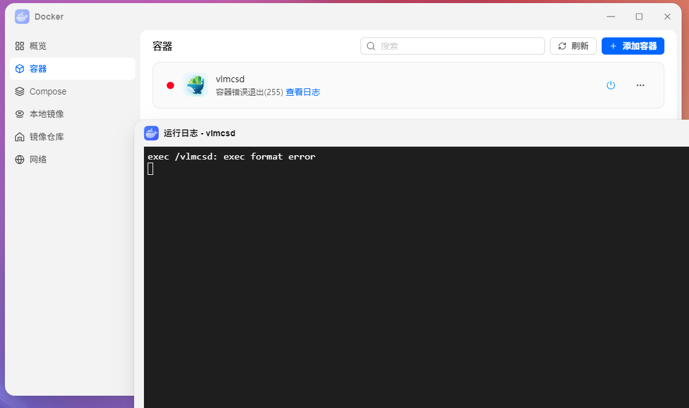
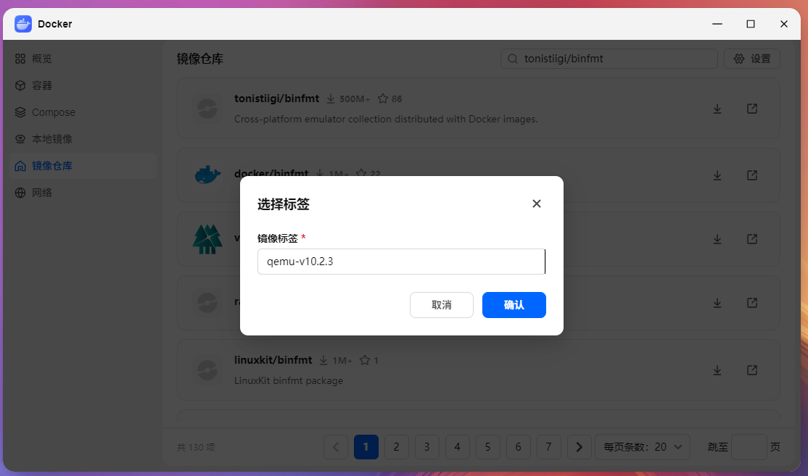
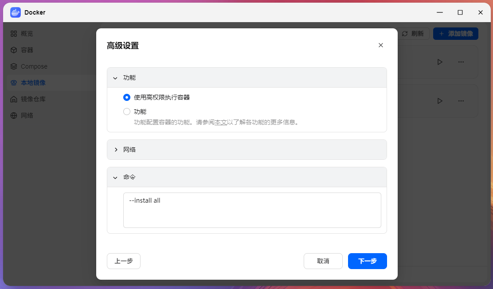
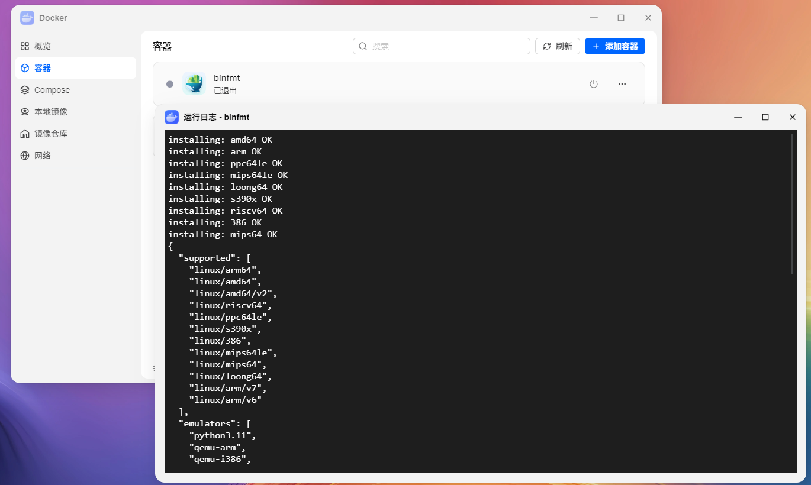
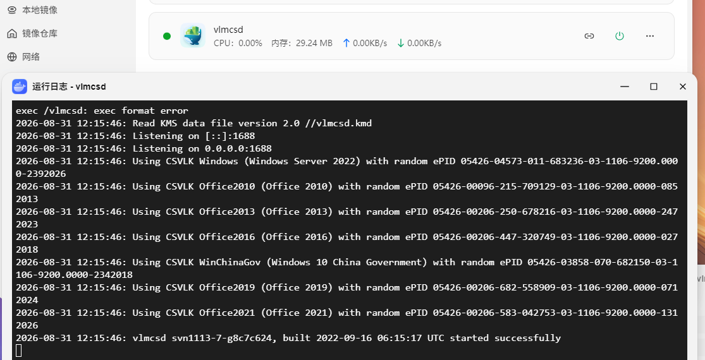

# 在arm64版本的飞牛系统使用binfmt运行x86架构容器

# 直接运行x86架构容器会扑街

arm64架构的飞牛中，长期面临可玩性低的问题  
其中很大的一个原因便是许多好用的容器缺失arm64版本，只提供x86版本

直接运行便会遇到以下`exec format error`问题  


实际上这种超小型又超实用的容器比比皆是，使用qemu用户模式可以很方便的运行起来

# 安装binfmt

直接从镜像仓库中，下载`tonistiigi/binfmt:qemu-v10.2.3`镜像。



运行该容器的时候，协议勾选`使用高权限执行容器`，并在命令中输入` --install all`  


随后等待容器启动，容器会自己结束。  
观察运行日志，跨架构能力安装完毕。  


# 在binfmt辅助下运行x86架构容器
如图所示，容器正常跑起来了  



使用命令查询可见容器进程使用qemu用户模式承载运行  
至于user mode与system mode的区别有兴趣可以自己查询  
```text
root       13993   13969  0 20:15 ?        00:00:00 /usr/bin/qemu-x86_64 /vlmcsd /vlmcsd -D -d -t 3 -e -v
root       21453    4512  0 20:26 tty1     00:00:00 grep --color=auto qemu
```

# 结束语
安装一个简简单单的东西，只需要几十兆的空间，就可以极大提高arm64架构下的实用性  
不是很明白飞牛官方为什么不集成这东西