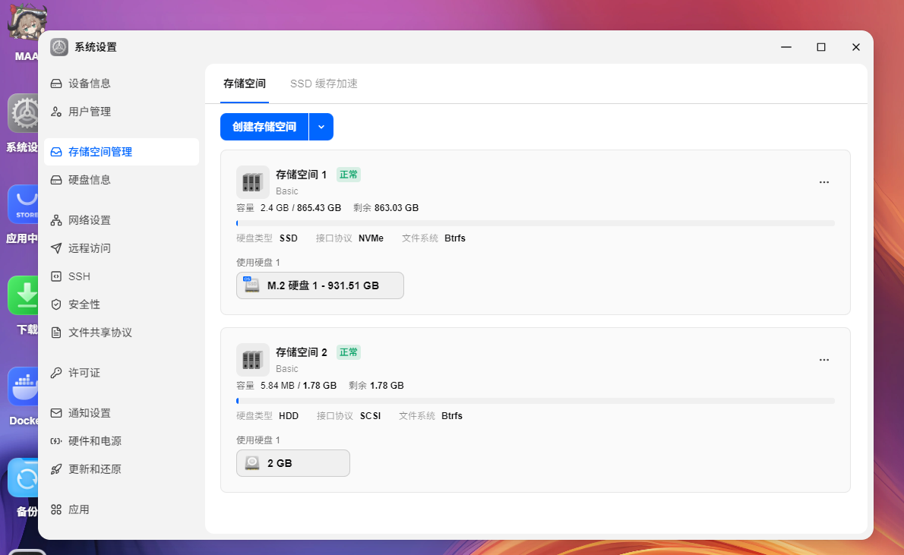

# 在飞牛nas使用tcm_loop加载持久化虚拟磁盘

# 前言
之前在 [创建在可在内存中运行的飞牛fnOS系统镜像](../../../2025/06/28010553_live_fnos/index.md) 中，给大家介绍了一种使用scsi_debug创建虚拟磁盘的方法  
那就是执行`modprobe scsi_debug dev_size_mb=1024`  

有的人在群里就问了，这个虚拟磁盘每次都丢，能不能创建不会丢的  
问了一下使用场景，许多都是系统盘空间有空余想充分利用，但又不想自己重新分区的

那我只能说，有的，方法有的，用`tcm_loop`加载磁盘上的虚拟磁盘文件就行

# 创建虚拟磁盘文件
使用如下命令创建稀疏磁盘文件  
```shell
truncate -s 2G /root/vdisk.img
```
当然，你也可以用dd来创建这个磁盘文件

# 创建启动脚本
如下所示，直接创建一个脚本去加载那个虚拟磁盘  
以下例子我们放到`/root/vdisk.sh`文件，你也可以选择其他文件  
记得用`chmod a+x /root/vdisk.sh`给脚本执行权限
```shell
#!/bin/bash

IMG=/root/vdisk.img

NAME=vdisk0

WWN=naa.1122334455667788

modprobe configfs
modprobe target_core_mod
modprobe target_core_file
modprobe tcm_loop

mountpoint -q /sys/kernel/config || mount -t configfs none /sys/kernel/config

mkdir -p /sys/kernel/config/target/core/fileio_0/$NAME

echo "fd_dev_name=$IMG" > /sys/kernel/config/target/core/fileio_0/$NAME/control

echo "fd_dev_size=$(stat -c %s "$IMG")" > /sys/kernel/config/target/core/fileio_0/$NAME/control

echo 1 > /sys/kernel/config/target/core/fileio_0/$NAME/enable

mkdir -p /sys/kernel/config/target/loopback/$WWN/tpgt_1/lun/lun_0

echo "$WWN" > /sys/kernel/config/target/loopback/$WWN/tpgt_1/nexus

ln -s /sys/kernel/config/target/core/fileio_0/$NAME /sys/kernel/config/target/loopback/$WWN/tpgt_1/lun/lun_0/$NAME

for h in /sys/class/scsi_host/host*/scan; do
    echo "- - -" > "$h" 2>/dev/null || true
done
```

# 执行脚本并创建存储空间
执行脚本后会出现一个新的硬盘  
这个正常创建存储空间就行，没什么好说的  


也可以往里面放点东西，确定持久化真的生效了

# 插入启动脚本

就如之前一样，这个脚本要在飞牛相关服务初始化之前执行完毕

```shell
sed -i '/^ExecStart=\/usr\/trim\/bin\/triminit/a ExecStartPre=/root/vdisk.sh' /etc/systemd/system/trim_init.service
systemctl daemon-reload
```

上面的命令实际上就是修改配置`/etc/systemd/system/trim_init.service`

```text

[Unit]
Description=trim init service
After=rc-local.service

[Service]
Type=oneshot
ExecStart=/usr/trim/bin/triminit
ExecStartPre=/root/vdisk.sh
RemainAfterExit=yes

[Install]
WantedBy=multi-user.targe
```

# 重启验证
直接重启，能看见新增加的虚拟硬盘与存储空间即可

# 结束语
只能说有的人系统盘不够用，成天问怎么清理系统盘腾空间  
但有的人系统盘空间大到有大量闲置，总是问怎么充分利用  
装系统的时候，这两种人的心理状态究竟是怎么样的，完全搞不明白